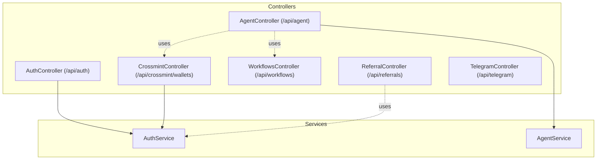
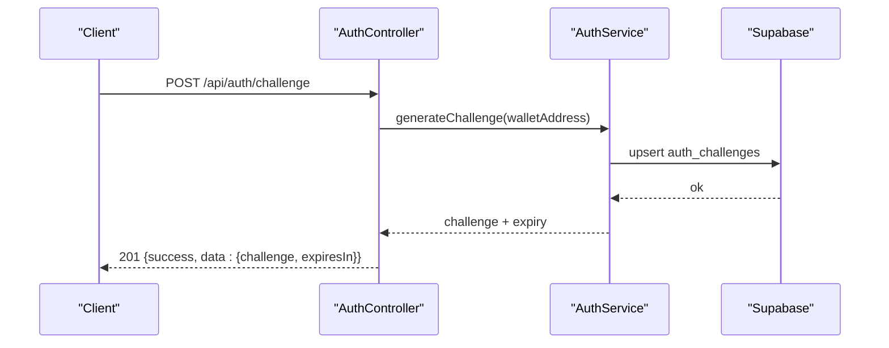
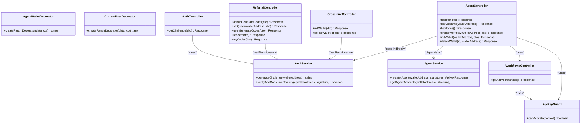

# API Reference

<cite>
**Referenced Files in This Document**
- [src/main.ts](file://src/main.ts)
- [src/app.module.ts](file://src/app.module.ts)
- [src/root.controller.ts](file://src/root.controller.ts)
- [src/auth/auth.controller.ts](file://src/auth/auth.controller.ts)
- [src/auth/auth.service.ts](file://src/auth/auth.service.ts)
- [src/auth/dto/wallet-challenge.dto.ts](file://src/auth/dto/wallet-challenge.dto.ts)
- [src/agent/agent.controller.ts](file://src/agent/agent.controller.ts)
- [src/agent/agent.service.ts](file://src/agent/agent.service.ts)
- [src/agent/dto/agent-register.dto.ts](file://src/agent/dto/agent-register.dto.ts)
- [src/agent/dto/agent-init-wallet.dto.ts](file://src/agent/dto/agent-init-wallet.dto.ts)
- [src/crossmint/crossmint.controller.ts](file://src/crossmint/crossmint.controller.ts)
- [src/crossmint/dto/init-wallet.dto.ts](file://src/crossmint/dto/init-wallet.dto.ts)
- [src/crossmint/dto/signed-request.dto.ts](file://src/crossmint/dto/signed-request.dto.ts)
- [src/workflows/workflows.controller.ts](file://src/workflows/workflows.controller.ts)
- [src/workflows/dto/create-workflow.dto.ts](file://src/workflows/dto/create-workflow.dto.ts)
- [src/referral/referral.controller.ts](file://src/referral/referral.controller.ts)
- [src/referral/dto/admin-generate-referral-codes.dto.ts](file://src/referral/dto/admin-generate-referral-codes.dto.ts)
- [src/referral/dto/generate-user-referral-codes.dto.ts](file://src/referral/dto/generate-user-referral-codes.dto.ts)
- [src/telegram/telegram.controller.ts](file://src/telegram/telegram.controller.ts)
- [src/common/guards/api-key.guard.ts](file://src/common/guards/api-key.guard.ts)
- [src/common/decorators/agent-wallet.decorator.ts](file://src/common/decorators/agent-wallet.decorator.ts)
- [src/common/decorators/current-user.decorator.ts](file://src/common/decorators/current-user.decorator.ts)
- [supabase/migrations/20260128140000_add_auth_challenges.sql](file://supabase/migrations/20260128140000_add_auth_challenges.sql)
- [supabase/migrations/20260218000000_add_agent_api_keys.sql](file://supabase/migrations/20260218000000_add_agent_api_keys.sql)
- [supabase/migrations/20260320090000_add_referral_system.sql](file://supabase/migrations/20260320090000_add_referral_system.sql)
</cite>

## Table of Contents
1. [Introduction](#introduction)
2. [Project Structure](#project-structure)
3. [Core Components](#core-components)
4. [Architecture Overview](#architecture-overview)
5. [Detailed Component Analysis](#detailed-component-analysis)
6. [Dependency Analysis](#dependency-analysis)
7. [Performance Considerations](#performance-considerations)
8. [Troubleshooting Guide](#troubleshooting-guide)
9. [Conclusion](#conclusion)
10. [Appendices](#appendices)

## Introduction
This document provides comprehensive API documentation for the PinTool backend. It covers all public endpoints grouped by functional areas, including authentication, agents, wallets, workflows, referrals, and Telegram. For each endpoint, you will find HTTP methods, URL patterns, request/response schemas, authentication requirements, validation rules, and error response formats. Practical curl examples illustrate success scenarios and common error cases. Security, rate limiting, CORS, versioning, and deprecation policies are documented, along with Swagger/OpenAPI integration details and client implementation guidelines.

## Project Structure
The API is implemented using NestJS with modular controllers and services. Controllers expose endpoints under base paths such as /api/auth, /api/agent, /api/crossmint/wallets, /api/workflows, /api/referrals, and /api/telegram. Validation is enforced via DTOs with class-validator decorators. Authentication uses a wallet challenge/signature flow for human and agent flows, and an API key header for agent-only endpoints.

**Diagram sources**
- [src/auth/auth.controller.ts:1-49](file://src/auth/auth.controller.ts#L1-L49)
- [src/agent/agent.controller.ts:1-111](file://src/agent/agent.controller.ts#L1-L111)
- [src/crossmint/crossmint.controller.ts:1-67](file://src/crossmint/crossmint.controller.ts#L1-L67)
- [src/workflows/workflows.controller.ts:1-28](file://src/workflows/workflows.controller.ts#L1-L28)
- [src/referral/referral.controller.ts:1-92](file://src/referral/referral.controller.ts#L1-L92)
- [src/telegram/telegram.controller.ts:1-32](file://src/telegram/telegram.controller.ts#L1-L32)
- [src/auth/auth.service.ts:1-165](file://src/auth/auth.service.ts#L1-L165)
- [src/agent/agent.service.ts:1-77](file://src/agent/agent.service.ts#L1-L77)

**Section sources**
- [src/app.module.ts](file://src/app.module.ts)
- [src/root.controller.ts](file://src/root.controller.ts)

## Core Components
- Auth endpoints: Challenge generation and signature verification for wallet-based authentication.
- Agent endpoints: Registration, API key retrieval, account listing, node discovery, workflow creation, and wallet initialization/closure.
- Crossmint wallet endpoints: Initialize and close wallets with signature verification.
- Workflow endpoints: List active workflow instances.
- Referral endpoints: Admin and user code generation, quota setting, redemption, and listing.
- Telegram endpoints: Internal webhook for Telegram Bot updates.

**Section sources**
- [src/auth/auth.controller.ts:1-49](file://src/auth/auth.controller.ts#L1-L49)
- [src/agent/agent.controller.ts:1-111](file://src/agent/agent.controller.ts#L1-L111)
- [src/crossmint/crossmint.controller.ts:1-67](file://src/crossmint/crossmint.controller.ts#L1-L67)
- [src/workflows/workflows.controller.ts:1-28](file://src/workflows/workflows.controller.ts#L1-L28)
- [src/referral/referral.controller.ts:1-92](file://src/referral/referral.controller.ts#L1-L92)
- [src/telegram/telegram.controller.ts:1-32](file://src/telegram/telegram.controller.ts#L1-L32)

## Architecture Overview
The API follows a layered architecture:
- Controllers define routes and orchestrate requests.
- Services encapsulate business logic and integrate with external systems.
- Guards enforce authentication and authorization.
- DTOs validate and document request payloads.
- Swagger decorators annotate endpoints for OpenAPI generation.

**Diagram sources**
- [src/auth/auth.controller.ts:11-47](file://src/auth/auth.controller.ts#L11-L47)
- [src/auth/auth.service.ts:27-51](file://src/auth/auth.service.ts#L27-L51)
- [supabase/migrations/20260128140000_add_auth_challenges.sql](file://supabase/migrations/20260128140000_add_auth_challenges.sql)

## Detailed Component Analysis

### Authentication Endpoints
- Base Path: /api/auth
- Purpose: Generate wallet authentication challenges and verify signatures.

Endpoints
- POST /api/auth/challenge
  - Description: Generates a challenge message for wallet signature authentication.
  - Authentication: None.
  - Request Body: WalletChallengeDto
    - walletAddress: string (required, Solana address format)
  - Response: 201 Created
    - body: { success: true, data: { challenge: string, expiresIn: number } }
  - Errors: 400 Bad Request (invalid wallet address)
  - Example curl:
    - curl -X POST https://your-host/api/auth/challenge -H "Content-Type: application/json" -d '{"walletAddress":"7xKXtg2CW87d97TXJSDpbD5jBkheTqA83TZRuJosgAsU"}'

- POST /api/auth/challenge (signature verification)
  - Description: Verifies a wallet signature against the stored challenge.
  - Authentication: None.
  - Request Body: SignedRequestDto (walletAddress, signature)
  - Response: 200 OK or 401 Unauthorized (invalid/expired signature)
  - Errors: 401 Unauthorized
  - Example curl:
    - curl -X POST https://your-host/api/crossmint/wallets/init -H "Content-Type: application/json" -d '{"walletAddress":"7xKXtg2CW87d97TXJSDpbD5jBkheTqA83TZRuJosgAsU","signature":"..."}'

Validation Rules
- walletAddress matches Solana address pattern.
- Signature must be a non-empty string.

Security Notes
- Challenges expire after 5 minutes and are cleaned periodically.
- Signature verification uses ed25519 (Solana).

**Section sources**
- [src/auth/auth.controller.ts:11-47](file://src/auth/auth.controller.ts#L11-L47)
- [src/auth/auth.service.ts:27-91](file://src/auth/auth.service.ts#L27-L91)
- [src/auth/dto/wallet-challenge.dto.ts:4-15](file://src/auth/dto/wallet-challenge.dto.ts#L4-L15)
- [src/crossmint/dto/signed-request.dto.ts:4-21](file://src/crossmint/dto/signed-request.dto.ts#L4-L21)
- [supabase/migrations/20260128140000_add_auth_challenges.sql](file://supabase/migrations/20260128140000_add_auth_challenges.sql)

### Agent Endpoints
- Base Path: /api/agent
- Authentication: Requires X-API-Key header for protected endpoints.

Endpoints
- POST /api/agent/register
  - Description: Register an agent using a wallet signature (same challenge flow).
  - Authentication: None.
  - Request Body: AgentRegisterDto
    - walletAddress: string (required)
    - signature: string (required)
  - Response: 201 Created
    - body: { success: true, data: { apiKey: string, walletAddress: string } }
  - Errors: 401 Unauthorized (invalid/expired signature)

- GET /api/agent/accounts
  - Description: List agent accounts owned by the wallet associated with the API key.
  - Authentication: X-API-Key required.
  - Response: 200 OK
    - body: { success: true, data: [...] }
  - Errors: 401 Unauthorized (missing/invalid/inactive API key)

- GET /api/agent/nodes
  - Description: List available node types and their parameter schemas.
  - Authentication: None.
  - Response: 200 OK
    - body: { success: true, data: [...] }

- POST /api/agent/workflows
  - Description: Create a workflow for the agent’s wallet.
  - Authentication: X-API-Key required.
  - Request Body: CreateWorkflowDto
  - Response: 201 Created
    - body: { success: true, data: workflow }
  - Errors: 401 Unauthorized

- POST /api/agent/wallets/init
  - Description: Initialize a Crossmint wallet for the agent’s wallet.
  - Authentication: X-API-Key required.
  - Request Body: AgentInitWalletDto
  - Response: 201 Created
    - body: { success: true, data: account }
  - Errors: 401 Unauthorized

- DELETE /api/agent/wallets/:id
  - Description: Close a wallet and withdraw assets to the owner wallet.
  - Authentication: X-API-Key required.
  - Response: 200 OK
    - body: { success: true, message: string, data: withdrawResult }
  - Errors: 401 Unauthorized

Validation Rules
- AgentRegisterDto: walletAddress and signature required and validated.
- AgentInitWalletDto: accountName required; workflowId optional.
- CreateWorkflowDto: name and definition required; isActive and telegramChatId optional.

Security Notes
- X-API-Key is validated against hashed keys stored in the database.
- Successful API key validation attaches the agent’s wallet address to the request.

**Section sources**
- [src/agent/agent.controller.ts:30-109](file://src/agent/agent.controller.ts#L30-L109)
- [src/agent/agent.service.ts:15-59](file://src/agent/agent.service.ts#L15-L59)
- [src/agent/dto/agent-register.dto.ts:4-23](file://src/agent/dto/agent-register.dto.ts#L4-L23)
- [src/agent/dto/agent-init-wallet.dto.ts:4-21](file://src/agent/dto/agent-init-wallet.dto.ts#L4-L21)
- [src/workflows/dto/create-workflow.dto.ts:4-62](file://src/workflows/dto/create-workflow.dto.ts#L4-L62)
- [src/common/guards/api-key.guard.ts:11-54](file://src/common/guards/api-key.guard.ts#L11-L54)
- [src/common/decorators/agent-wallet.decorator.ts:3-8](file://src/common/decorators/agent-wallet.decorator.ts#L3-L8)
- [supabase/migrations/20260218000000_add_agent_api_keys.sql](file://supabase/migrations/20260218000000_add_agent_api_keys.sql)

### Crossmint Wallet Endpoints
- Base Path: /api/crossmint/wallets
- Authentication: Signature verification required for init and delete.

Endpoints
- POST /api/crossmint/wallets/init
  - Description: Initialize a Crossmint wallet requiring owner signature.
  - Authentication: None.
  - Request Body: InitWalletDto (extends SignedRequestDto)
    - accountName: string (required)
    - workflowId: string (optional)
    - walletAddress: string (required)
    - signature: string (required)
  - Response: 201 Created
    - body: { success: true, data: account }
  - Errors: 401 Unauthorized (invalid/expired signature)

- DELETE /api/crossmint/wallets/:id
  - Description: Close a wallet and withdraw assets; requires owner signature.
  - Authentication: None.
  - Request Body: SignedRequestDto
  - Response: 200 OK
    - body: { success: true, message: string, data: withdrawResult }
  - Errors: 401 Unauthorized (invalid/expired signature), 403 Forbidden (not owner)

Validation Rules
- InitWalletDto: accountName required; workflowId optional.
- SignedRequestDto: walletAddress and signature required.

Security Notes
- Signature verification uses the challenge mechanism.
- Ownership checks are performed during deletion.

**Section sources**
- [src/crossmint/crossmint.controller.ts:23-65](file://src/crossmint/crossmint.controller.ts#L23-L65)
- [src/crossmint/dto/init-wallet.dto.ts:5-21](file://src/crossmint/dto/init-wallet.dto.ts#L5-L21)
- [src/crossmint/dto/signed-request.dto.ts:4-21](file://src/crossmint/dto/signed-request.dto.ts#L4-L21)
- [src/auth/auth.service.ts:57-91](file://src/auth/auth.service.ts#L57-L91)

### Workflow Endpoints
- Base Path: /api/workflows
- Authentication: X-API-Key required.

Endpoints
- GET /api/workflows/active
  - Description: List active workflow instances currently held in-memory by the lifecycle manager.
  - Authentication: X-API-Key required.
  - Response: 200 OK
    - body: { success: true, count: number, data: [...] }
  - Errors: 401 Unauthorized

Security Notes
- Requires X-API-Key header.

**Section sources**
- [src/workflows/workflows.controller.ts:11-26](file://src/workflows/workflows.controller.ts#L11-L26)
- [src/common/guards/api-key.guard.ts:11-54](file://src/common/guards/api-key.guard.ts#L11-L54)

### Referral Endpoints
- Base Path: /api/referrals
- Authentication: Signature verification required for admin and user operations.

Endpoints
- POST /api/referrals/admin/codes
  - Description: Admin generates single-use referral codes for a target wallet.
  - Authentication: None.
  - Request Body: AdminGenerateReferralCodesDto
    - adminWalletAddress: string (required)
    - signature: string (required)
    - targetWalletAddress: string (required)
    - count: number (1 to max batch size)
    - expiresAt: string (optional, ISO-8601)
    - metadata: object (optional)
  - Response: 201 Created
    - body: { success: true, count: number, data: [...] }
  - Errors: 401 Unauthorized

- PATCH /api/referrals/admin/quotas/:walletAddress
  - Description: Admin sets lifetime referral-code quota for a user wallet.
  - Authentication: None.
  - Request Body: SetReferralQuotaDto (not defined in code; refer to controller usage)
  - Response: 200 OK
    - body: { success: true, data: quota }

- POST /api/referrals/codes
  - Description: User generates single-use referral codes within lifetime quota.
  - Authentication: None.
  - Request Body: GenerateUserReferralCodesDto
  - Response: 201 Created
    - body: { success: true, count: number, data: [...] }
  - Errors: 401 Unauthorized

- POST /api/referrals/redeem
  - Description: Redeem a single-use referral code.
  - Authentication: None.
  - Request Body: RedeemReferralCodeDto (not defined in code; refer to controller usage)
  - Response: 200 OK
    - body: { success: true, data: result }

- POST /api/referrals/my-codes
  - Description: List referral codes created by this wallet.
  - Authentication: None.
  - Request Body: SignedWalletRequestDto (not defined in code; refer to controller usage)
  - Response: 200 OK
    - body: { success: true, count: number, data: [...] }
  - Errors: 401 Unauthorized

Validation Rules
- AdminGenerateReferralCodesDto: count constrained by max batch size; optional expiresAt and metadata.
- GenerateUserReferralCodesDto: count constrained by max batch size; optional expiresAt and metadata.

Security Notes
- All endpoints require signature verification against the active challenge.

**Section sources**
- [src/referral/referral.controller.ts:15-90](file://src/referral/referral.controller.ts#L15-L90)
- [src/referral/dto/admin-generate-referral-codes.dto.ts:15-72](file://src/referral/dto/admin-generate-referral-codes.dto.ts#L15-L72)
- [src/referral/dto/generate-user-referral-codes.dto.ts:15-61](file://src/referral/dto/generate-user-referral-codes.dto.ts#L15-L61)
- [src/auth/auth.service.ts:57-91](file://src/auth/auth.service.ts#L57-L91)
- [supabase/migrations/20260320090000_add_referral_system.sql](file://supabase/migrations/20260320090000_add_referral_system.sql)

### Telegram Endpoints
- Base Path: /api/telegram
- Authentication: None.

Endpoints
- POST /api/telegram/webhook
  - Description: Internal endpoint for receiving updates from Telegram Bot API.
  - Authentication: None.
  - Response: 200 OK
    - body: { ok: true }

Notes
- This endpoint is excluded from Swagger UI as it is for internal use.

**Section sources**
- [src/telegram/telegram.controller.ts:10-30](file://src/telegram/telegram.controller.ts#L10-L30)

## Dependency Analysis

**Diagram sources**
- [src/common/guards/api-key.guard.ts:1-56](file://src/common/guards/api-key.guard.ts#L1-L56)
- [src/common/decorators/agent-wallet.decorator.ts:1-9](file://src/common/decorators/agent-wallet.decorator.ts#L1-L9)
- [src/common/decorators/current-user.decorator.ts:1-11](file://src/common/decorators/current-user.decorator.ts#L1-L11)
- [src/auth/auth.service.ts:1-165](file://src/auth/auth.service.ts#L1-L165)
- [src/agent/agent.service.ts:1-77](file://src/agent/agent.service.ts#L1-L77)
- [src/auth/auth.controller.ts:1-49](file://src/auth/auth.controller.ts#L1-L49)
- [src/agent/agent.controller.ts:1-111](file://src/agent/agent.controller.ts#L1-L111)
- [src/crossmint/crossmint.controller.ts:1-67](file://src/crossmint/crossmint.controller.ts#L1-L67)
- [src/workflows/workflows.controller.ts:1-28](file://src/workflows/workflows.controller.ts#L1-L28)
- [src/referral/referral.controller.ts:1-92](file://src/referral/referral.controller.ts#L1-L92)

## Performance Considerations
- Challenge cleanup: Expired auth challenges are cleaned periodically to prevent accumulation.
- API key usage tracking: Last-used timestamps are updated asynchronously to minimize latency.
- Node listing: Node schemas are computed dynamically from the registry; caching may be considered for high traffic.
- Database queries: Most endpoints perform single-table reads/writes; ensure proper indexing on wallet_address and key_hash.

[No sources needed since this section provides general guidance]

## Troubleshooting Guide
Common Issues and Resolutions
- Missing X-API-Key header
  - Symptom: 401 Unauthorized on agent endpoints.
  - Resolution: Include X-API-Key header with a valid, active API key.
- Invalid or expired signature
  - Symptom: 401 Unauthorized on signature-required endpoints.
  - Resolution: Generate a fresh challenge, sign it, and submit immediately.
- API key inactive
  - Symptom: 401 Unauthorized with inactive key message.
  - Resolution: Rotate or regenerate the API key.
- Not owner (wallet closure)
  - Symptom: 403 Forbidden when closing a wallet.
  - Resolution: Ensure the signing wallet is the owner of the target account.

**Section sources**
- [src/common/guards/api-key.guard.ts:15-33](file://src/common/guards/api-key.guard.ts#L15-L33)
- [src/auth/auth.service.ts:57-91](file://src/auth/auth.service.ts#L57-L91)
- [src/crossmint/crossmint.controller.ts:52-65](file://src/crossmint/crossmint.controller.ts#L52-L65)

## Conclusion
This API provides a secure, wallet-signature-driven authentication model for both human and agent use cases, complemented by robust agent-only endpoints protected via API keys. The OpenAPI specification is auto-generated from Swagger decorators, enabling interactive documentation and client scaffolding. Follow the recommended validation rules, security practices, and rate-limiting guidance to ensure reliable integrations.

[No sources needed since this section summarizes without analyzing specific files]

## Appendices

### HTTP Status Codes
- 200 OK: Successful operation.
- 201 Created: Resource created successfully.
- 400 Bad Request: Invalid request payload or parameters.
- 401 Unauthorized: Missing/invalid/expired signature or API key.
- 403 Forbidden: Insufficient permissions (e.g., not the account owner).

### Authentication and Authorization
- Wallet Challenge/Signature: Used by human and admin operations; challenges expire in 5 minutes.
- API Key: Required for agent endpoints; validated via hashed key lookup and activity check.

### Rate Limiting and Throttling
- Not explicitly implemented in the provided code. Recommended to implement per-endpoint limits and sliding windows.

### CORS Configuration
- Not explicitly configured in the provided code. Configure per environment to allow trusted origins.

### Security Considerations
- Always use HTTPS in production.
- Rotate API keys regularly.
- Validate all inputs using DTOs and regex patterns.
- Enforce least privilege for agent actions.

### Versioning Strategy
- No explicit versioning scheme observed in the codebase. Recommended to adopt URL-based versioning (e.g., /api/v1/...) to maintain backward compatibility and manage breaking changes.

### Deprecation Policy
- No formal deprecation policy present. Recommended to announce deprecations with timelines and migration guides.

### Swagger/OpenAPI Integration
- Auto-generated documentation is available via Swagger UI and ReDoc based on controller decorators. Ensure the Swagger module is enabled in the application bootstrap.

**Section sources**
- [src/main.ts](file://src/main.ts)
- [src/app.module.ts](file://src/app.module.ts)

### Curl Examples

- Get Challenge
  - curl -X POST https://your-host/api/auth/challenge -H "Content-Type: application/json" -d '{"walletAddress":"7xKXtg2CW87d97TXJSDpbD5jBkheTqA83TZRuJosgAsU"}'

- Register Agent
  - curl -X POST https://your-host/api/agent/register -H "Content-Type: application/json" -d '{"walletAddress":"7xKXtg2CW87d97TXJSDpbD5jBkheTqA83TZRuJosgAsU","signature":"..."}'

- List Agent Accounts
  - curl -H "X-API-Key: YOUR_API_KEY" https://your-host/api/agent/accounts

- List Active Workflows
  - curl -H "X-API-Key: YOUR_API_KEY" https://your-host/api/workflows/active

- Initialize Crossmint Wallet
  - curl -X POST https://your-host/api/crossmint/wallets/init -H "Content-Type: application/json" -d '{"walletAddress":"7xKXtg2CW87d97TXJSDpbD5jBkheTqA83TZRuJosgAsU","signature":"...","accountName":"Trading Account"}'

- Close Crossmint Wallet
  - curl -X DELETE https://your-host/api/crossmint/wallets/:id -H "Content-Type: application/json" -d '{"walletAddress":"7xKXtg2CW87d97TXJSDpbD5jBkheTqA83TZRuJosgAsU","signature":"..."}'

- Admin Generate Referral Codes
  - curl -X POST https://your-host/api/referrals/admin/codes -H "Content-Type: application/json" -d '{"adminWalletAddress":"7xKXtg2CW87d97TXJSDpbD5jBkheTqA83TZRuJosgAsU","signature":"...","targetWalletAddress":"8XQk8F4YJ6xH3aKx5v2Fq2wM6k7V2ZrD8QWf7BwSx8g4","count":10}'

- User Generate Referral Codes
  - curl -X POST https://your-host/api/referrals/codes -H "Content-Type: application/json" -d '{"walletAddress":"7xKXtg2CW87d97TXJSDpbD5jBkheTqA83TZRuJosgAsU","signature":"...","count":3}'

- Redeem Referral Code
  - curl -X POST https://your-host/api/referrals/redeem -H "Content-Type: application/json" -d '{"walletAddress":"7xKXtg2CW87d97TXJSDpbD5jBkheTqA83TZRuJosgAsU","signature":"...","code":"ABC123"}'

- Telegram Webhook
  - curl -X POST https://your-host/api/telegram/webhook -H "Content-Type: application/json" -d '{}'

[No sources needed since this section provides general guidance]

### Client Implementation Guidelines
- Use the challenge endpoint to obtain a challenge, sign it with the wallet, and submit immediately.
- Store API keys securely and rotate them periodically.
- Implement retry with exponential backoff for transient failures.
- Validate all server responses against the documented schemas.

[No sources needed since this section provides general guidance]