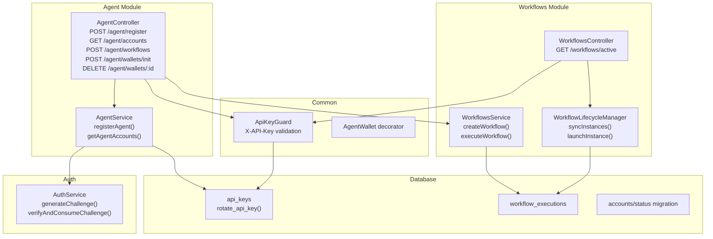
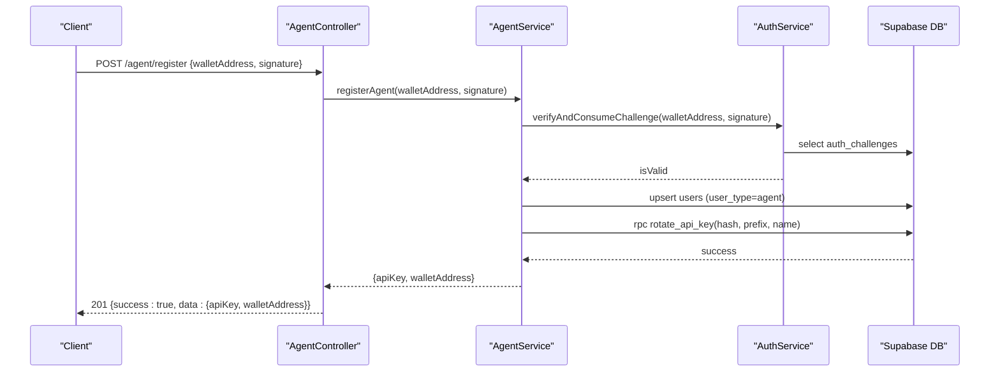
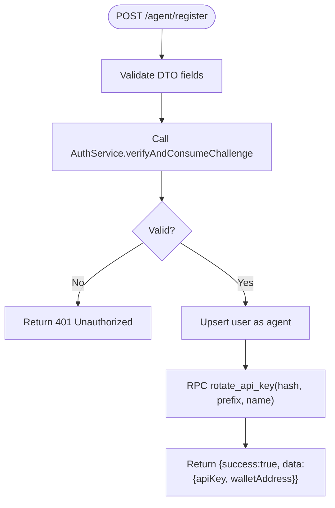
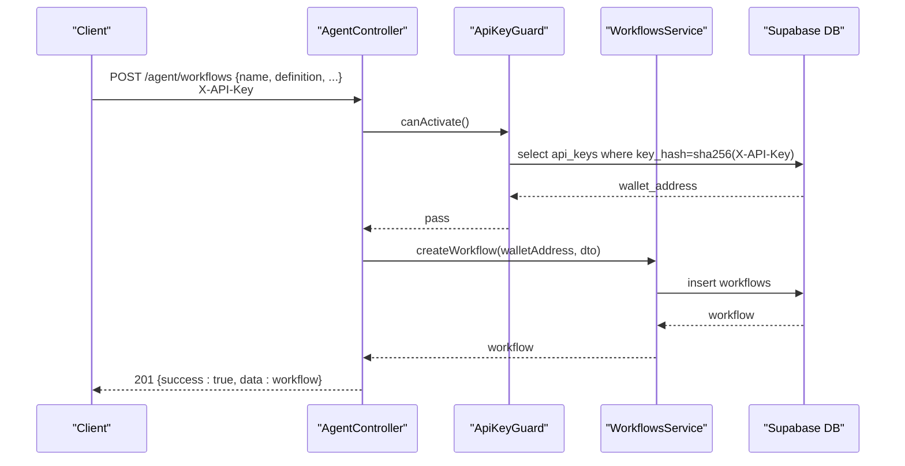
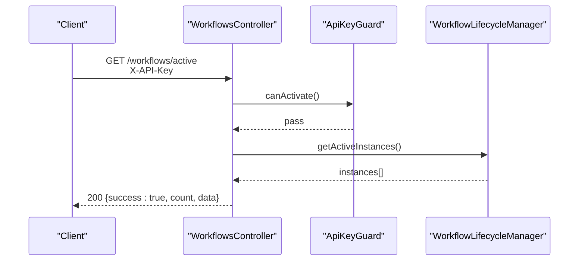
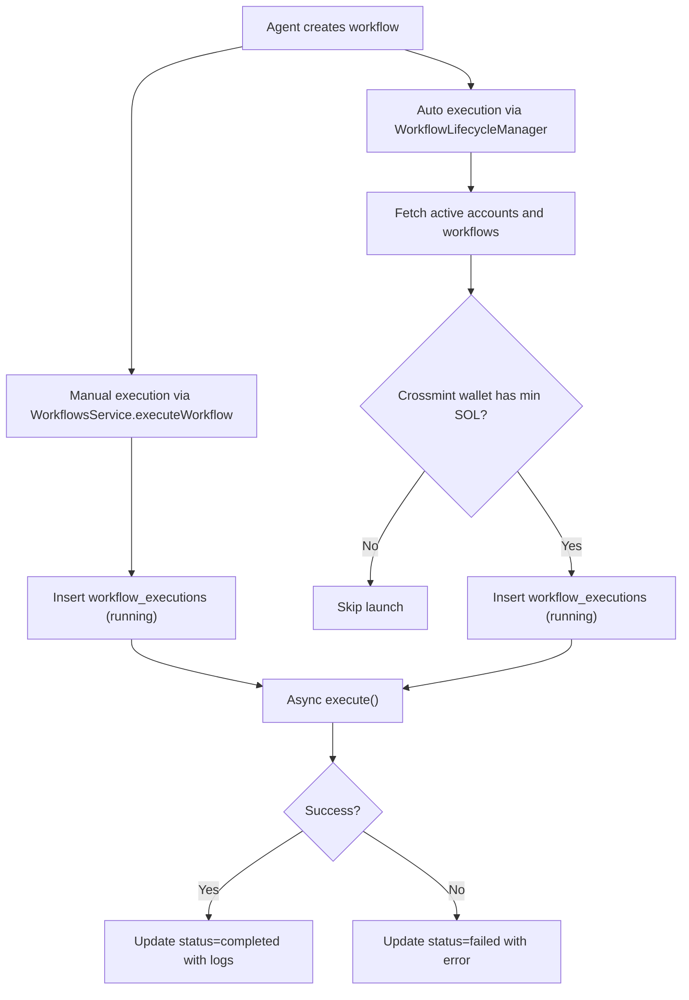
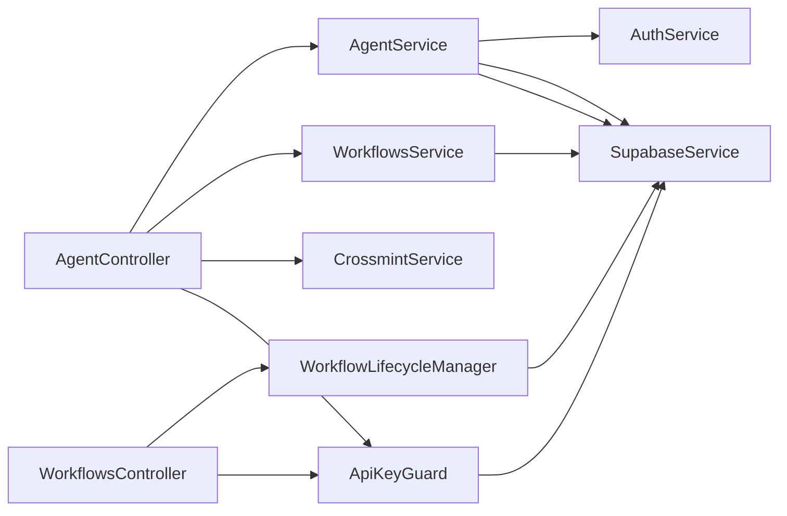

# Agent API

<cite>
**Referenced Files in This Document**
- [agent.controller.ts](file://src/agent/agent.controller.ts)
- [agent.service.ts](file://src/agent/agent.service.ts)
- [agent-register.dto.ts](file://src/agent/dto/agent-register.dto.ts)
- [agent-init-wallet.dto.ts](file://src/agent/dto/agent-init-wallet.dto.ts)
- [workflows.controller.ts](file://src/workflows/workflows.controller.ts)
- [workflows.service.ts](file://src/workflows/workflows.service.ts)
- [workflow-lifecycle.service.ts](file://src/workflows/workflow-lifecycle.service.ts)
- [create-workflow.dto.ts](file://src/workflows/dto/create-workflow.dto.ts)
- [api-key.guard.ts](file://src/common/guards/api-key.guard.ts)
- [agent-wallet.decorator.ts](file://src/common/decorators/agent-wallet.decorator.ts)
- [auth.service.ts](file://src/auth/auth.service.ts)
- [20260218000000_add_agent_api_keys.sql](file://supabase/migrations/20260218000000_add_agent_api_keys.sql)
- [20260218010000_add_rotate_api_key_function.sql](file://supabase/migrations/20260218010000_add_rotate_api_key_function.sql)
- [20260308000000_add_canvases_and_account_status.sql](file://supabase/migrations/20260308000000_add_canvases_and_account_status.sql)
- [initial-1.sql](file://src/database/schema/initial-1.sql)
</cite>

## Table of Contents
1. [Introduction](#introduction)
2. [Project Structure](#project-structure)
3. [Core Components](#core-components)
4. [Architecture Overview](#architecture-overview)
5. [Detailed Component Analysis](#detailed-component-analysis)
6. [Dependency Analysis](#dependency-analysis)
7. [Performance Considerations](#performance-considerations)
8. [Troubleshooting Guide](#troubleshooting-guide)
9. [Conclusion](#conclusion)
10. [Appendices](#appendices)

## Introduction
This document provides comprehensive API documentation for agent management endpoints that require X-API-Key authentication. It covers:
- POST /api/agent/register for agent registration with wallet signature challenge and API key generation
- POST /api/agent/workflows for workflow creation under agent accounts
- GET /api/workflows/active for monitoring active workflow instances
- Authentication via X-API-Key header validated by ApiKeyGuard
- Request/response schemas, error handling, and operational guidance

The APIs integrate with wallet-based authentication, secure API key storage, and a lifecycle manager that runs workflows for active agent accounts.

## Project Structure
The Agent API spans several NestJS modules:
- Agent module: registration, account listing, node discovery, and wallet initialization
- Workflows module: workflow CRUD and lifecycle management
- Common modules: API key guard and agent wallet decorator
- Auth module: challenge generation and signature verification
- Database: Supabase tables for users, API keys, workflows, executions, and accounts

**Diagram sources**
- [agent.controller.ts:22-111](file://src/agent/agent.controller.ts#L22-L111)
- [agent.service.ts:15-77](file://src/agent/agent.service.ts#L15-L77)
- [workflows.controller.ts:7-28](file://src/workflows/workflows.controller.ts#L7-L28)
- [workflows.service.ts:60-216](file://src/workflows/workflows.service.ts#L60-L216)
- [workflow-lifecycle.service.ts:70-343](file://src/workflows/workflow-lifecycle.service.ts#L70-L343)
- [api-key.guard.ts:11-56](file://src/common/guards/api-key.guard.ts#L11-L56)
- [auth.service.ts:27-91](file://src/auth/auth.service.ts#L27-L91)
- [20260218000000_add_agent_api_keys.sql:6-26](file://supabase/migrations/20260218000000_add_agent_api_keys.sql#L6-L26)
- [20260218010000_add_rotate_api_key_function.sql:1-27](file://supabase/migrations/20260218010000_add_rotate_api_key_function.sql#L1-L27)
- [20260308000000_add_canvases_and_account_status.sql:35-44](file://supabase/migrations/20260308000000_add_canvases_and_account_status.sql#L35-L44)
- [initial-1.sql:116-137](file://src/database/schema/initial-1.sql#L116-L137)

**Section sources**
- [agent.controller.ts:22-111](file://src/agent/agent.controller.ts#L22-L111)
- [workflows.controller.ts:7-28](file://src/workflows/workflows.controller.ts#L7-L28)

## Core Components
- AgentController: Exposes registration, account listing, node discovery, workflow creation, and wallet operations under /api/agent.
- WorkflowsController: Exposes monitoring endpoint for active workflow instances under /api/workflows.
- AgentService: Handles agent registration with wallet signature verification and atomic API key rotation.
- WorkflowsService: Manages workflow creation and manual execution with concurrency control.
- WorkflowLifecycleManager: Runs workflows for active agent accounts based on polling and account status.
- ApiKeyGuard: Validates X-API-Key header against hashed keys stored in api_keys table.
- AgentWallet decorator: Extracts wallet address from request after successful API key validation.
- AuthService: Generates and verifies challenge messages for wallet-based authentication.

**Section sources**
- [agent.controller.ts:22-111](file://src/agent/agent.controller.ts#L22-L111)
- [workflows.controller.ts:7-28](file://src/workflows/workflows.controller.ts#L7-L28)
- [agent.service.ts:15-77](file://src/agent/agent.service.ts#L15-L77)
- [workflows.service.ts:60-216](file://src/workflows/workflows.service.ts#L60-L216)
- [workflow-lifecycle.service.ts:70-343](file://src/workflows/workflow-lifecycle.service.ts#L70-L343)
- [api-key.guard.ts:11-56](file://src/common/guards/api-key.guard.ts#L11-L56)
- [agent-wallet.decorator.ts:3-8](file://src/common/decorators/agent-wallet.decorator.ts#L3-L8)
- [auth.service.ts:27-91](file://src/auth/auth.service.ts#L27-L91)

## Architecture Overview
The Agent API enforces two-factor authentication:
- Wallet signature challenge for agent registration
- X-API-Key header for subsequent requests

**Diagram sources**
- [agent.controller.ts:30-40](file://src/agent/agent.controller.ts#L30-L40)
- [agent.service.ts:15-59](file://src/agent/agent.service.ts#L15-L59)
- [auth.service.ts:57-91](file://src/auth/auth.service.ts#L57-L91)
- [20260218010000_add_rotate_api_key_function.sql:1-27](file://supabase/migrations/20260218010000_add_rotate_api_key_function.sql#L1-L27)

**Section sources**
- [agent.controller.ts:30-40](file://src/agent/agent.controller.ts#L30-L40)
- [agent.service.ts:15-59](file://src/agent/agent.service.ts#L15-L59)
- [auth.service.ts:57-91](file://src/auth/auth.service.ts#L57-L91)

## Detailed Component Analysis

### POST /api/agent/register
Purpose: Register an agent using a wallet signature challenge and receive an API key for future authenticated requests.

- Authentication: None (challenge-based registration)
- Request body schema:
  - walletAddress: string (Solana address format)
  - signature: string (base58-encoded signature)
- Response:
  - success: boolean
  - data: object containing apiKey and walletAddress

Implementation highlights:
- Validates signature using AuthService.verifyAndConsumeChallenge
- Upserts user with user_type=agent
- Generates API key using rotate_api_key function with SHA-256 hash and key prefix
- Returns plaintext API key once (stored hashed in DB)

**Diagram sources**
- [agent-register.dto.ts:4-23](file://src/agent/dto/agent-register.dto.ts#L4-L23)
- [agent.service.ts:15-59](file://src/agent/agent.service.ts#L15-L59)
- [auth.service.ts:57-91](file://src/auth/auth.service.ts#L57-L91)
- [20260218010000_add_rotate_api_key_function.sql:1-27](file://supabase/migrations/20260218010000_add_rotate_api_key_function.sql#L1-L27)

**Section sources**
- [agent.controller.ts:30-40](file://src/agent/agent.controller.ts#L30-L40)
- [agent-register.dto.ts:4-23](file://src/agent/dto/agent-register.dto.ts#L4-L23)
- [agent.service.ts:15-59](file://src/agent/agent.service.ts#L15-L59)
- [auth.service.ts:57-91](file://src/auth/auth.service.ts#L57-L91)

### POST /api/agent/workflows
Purpose: Create a new workflow owned by the authenticated agent.

- Authentication: X-API-Key required
- Request body schema:
  - name: string
  - description: string (optional)
  - definition: object (workflow graph with nodes and connections)
  - isActive: boolean (optional, default true)
  - telegramChatId: string (optional)
- Response:
  - success: boolean
  - data: created workflow object

Implementation highlights:
- Uses ApiKeyGuard to extract wallet address from request
- Calls WorkflowsService.createWorkflow with owner wallet address
- Enforces agent ownership via controller-level guard

**Diagram sources**
- [agent.controller.ts:81-89](file://src/agent/agent.controller.ts#L81-L89)
- [api-key.guard.ts:11-56](file://src/common/guards/api-key.guard.ts#L11-L56)
- [workflows.service.ts:60-81](file://src/workflows/workflows.service.ts#L60-L81)
- [create-workflow.dto.ts:4-63](file://src/workflows/dto/create-workflow.dto.ts#L4-L63)

**Section sources**
- [agent.controller.ts:81-89](file://src/agent/agent.controller.ts#L81-L89)
- [api-key.guard.ts:11-56](file://src/common/guards/api-key.guard.ts#L11-L56)
- [workflows.service.ts:60-81](file://src/workflows/workflows.service.ts#L60-L81)
- [create-workflow.dto.ts:4-63](file://src/workflows/dto/create-workflow.dto.ts#L4-L63)

### GET /api/workflows/active
Purpose: List active workflow instances currently managed in memory by the lifecycle manager.

- Authentication: X-API-Key required
- Response:
  - success: boolean
  - count: number
  - data: array of active instances with accountId, executionId, workflowName, ownerWalletAddress, isRunning, nodeCount, startedAt

Implementation highlights:
- Uses ApiKeyGuard for authentication
- Reads from WorkflowLifecycleManager.getActiveInstances()

**Diagram sources**
- [workflows.controller.ts:11-26](file://src/workflows/workflows.controller.ts#L11-L26)
- [api-key.guard.ts:11-56](file://src/common/guards/api-key.guard.ts#L11-L56)
- [workflow-lifecycle.service.ts:122-154](file://src/workflows/workflow-lifecycle.service.ts#L122-L154)

**Section sources**
- [workflows.controller.ts:11-26](file://src/workflows/workflows.controller.ts#L11-L26)
- [workflow-lifecycle.service.ts:122-154](file://src/workflows/workflow-lifecycle.service.ts#L122-L154)

### Workflow Execution Lifecycle
While the primary focus is on creation and monitoring, execution is supported via manual execution and automatic lifecycle management.

Manual execution:
- WorkflowsService.executeWorkflow creates a workflow_executions record and starts execution asynchronously
- Execution logs and status are persisted upon completion or failure

Automatic lifecycle:
- WorkflowLifecycleManager periodically syncs active accounts and launches instances
- Requires minimum SOL balance for Crossmint wallets to start

**Diagram sources**
- [workflows.service.ts:83-216](file://src/workflows/workflows.service.ts#L83-L216)
- [workflow-lifecycle.service.ts:238-343](file://src/workflows/workflow-lifecycle.service.ts#L238-L343)
- [initial-1.sql:116-137](file://src/database/schema/initial-1.sql#L116-L137)

**Section sources**
- [workflows.service.ts:83-216](file://src/workflows/workflows.service.ts#L83-L216)
- [workflow-lifecycle.service.ts:238-343](file://src/workflows/workflow-lifecycle.service.ts#L238-L343)
- [initial-1.sql:116-137](file://src/database/schema/initial-1.sql#L116-L137)

## Dependency Analysis
- AgentController depends on AgentService, WorkflowsService, and CrossmintService
- AgentService depends on AuthService and SupabaseService
- WorkflowsController depends on WorkflowLifecycleManager
- WorkflowsService depends on SupabaseService and WorkflowExecutorFactory
- WorkflowLifecycleManager depends on SupabaseService, WorkflowExecutorFactory, and AgentKitService
- ApiKeyGuard depends on SupabaseService for api_keys validation
- AgentWallet decorator reads agentWalletAddress injected by ApiKeyGuard

**Diagram sources**
- [agent.controller.ts:24-28](file://src/agent/agent.controller.ts#L24-L28)
- [agent.service.ts:10-13](file://src/agent/agent.service.ts#L10-L13)
- [workflows.controller.ts](file://src/workflows/workflows.controller.ts#L9)
- [workflows.service.ts:8-12](file://src/workflows/workflows.service.ts#L8-L12)
- [workflow-lifecycle.service.ts:19-23](file://src/workflows/workflow-lifecycle.service.ts#L19-L23)
- [api-key.guard.ts](file://src/common/guards/api-key.guard.ts#L9)

**Section sources**
- [agent.controller.ts:24-28](file://src/agent/agent.controller.ts#L24-L28)
- [agent.service.ts:10-13](file://src/agent/agent.service.ts#L10-L13)
- [workflows.controller.ts](file://src/workflows/workflows.controller.ts#L9)
- [workflows.service.ts:8-12](file://src/workflows/workflows.service.ts#L8-L12)
- [workflow-lifecycle.service.ts:19-23](file://src/workflows/workflow-lifecycle.service.ts#L19-L23)
- [api-key.guard.ts](file://src/common/guards/api-key.guard.ts#L9)

## Performance Considerations
- API key validation is O(1) via hashed lookup and indexed columns
- Workflow creation is synchronous; execution is asynchronous and fire-and-forget from API perspective
- Lifecycle manager polls every minute; adjust POLLING_MS for higher/lower frequency
- Minimum SOL balance check performs a single RPC call per account launch
- In-flight execution deduplication prevents overlapping runs

[No sources needed since this section provides general guidance]

## Troubleshooting Guide
Common errors and resolutions:
- Missing X-API-Key header: ApiKeyGuard throws UnauthorizedException
- Invalid or inactive API key: ApiKeyGuard throws UnauthorizedException
- Invalid wallet signature during registration: AgentService throws UnauthorizedException
- Failed to upsert user or rotate API key: AgentService throws InternalServerErrorException
- Workflow not found: WorkflowsService throws NotFoundException
- Failed to create workflow execution: WorkflowsService throws Error
- Insufficient SOL balance: Lifecycle manager skips launch and logs debug message

Operational checks:
- Confirm api_keys table has the key hash and is_active=true
- Verify rotate_api_key function exists and is callable
- Ensure accounts.status is 'active' for lifecycle to start workflows
- Validate Crossmint wallet has sufficient SOL balance

**Section sources**
- [api-key.guard.ts:15-33](file://src/common/guards/api-key.guard.ts#L15-L33)
- [agent.service.ts:18-20](file://src/agent/agent.service.ts#L18-L20)
- [agent.service.ts:33-36](file://src/agent/agent.service.ts#L33-L36)
- [agent.service.ts:51-54](file://src/agent/agent.service.ts#L51-L54)
- [workflows.service.ts](file://src/workflows/workflows.service.ts#L54)
- [workflows.service.ts](file://src/workflows/workflows.service.ts#L124)
- [workflow-lifecycle.service.ts:246-255](file://src/workflows/workflow-lifecycle.service.ts#L246-L255)

## Conclusion
The Agent API provides a secure, wallet-authenticated pathway for agents to manage workflows and monitor execution. Registration yields a plaintext API key for subsequent requests, while X-API-Key guards protect all agent-facing endpoints. The system supports both manual and automatic workflow execution with robust persistence and concurrency controls.

[No sources needed since this section summarizes without analyzing specific files]

## Appendices

### Authentication Header Requirements
- Header: X-API-Key
- Required for: All agent endpoints except registration
- Validation: SHA-256 hash lookup in api_keys table with is_active=true

**Section sources**
- [agent.controller.ts:43-46](file://src/agent/agent.controller.ts#L43-L46)
- [agent.controller.ts:82-85](file://src/agent/agent.controller.ts#L82-L85)
- [workflows.controller.ts](file://src/workflows/workflows.controller.ts#L17)
- [api-key.guard.ts:13-35](file://src/common/guards/api-key.guard.ts#L13-L35)

### Request/Response Schemas

- POST /api/agent/register
  - Request: { walletAddress: string, signature: string }
  - Response: { success: boolean, data: { apiKey: string, walletAddress: string } }

- POST /api/agent/workflows
  - Request: { name: string, description?: string, definition: object, isActive?: boolean, telegramChatId?: string }
  - Response: { success: boolean, data: object }

- GET /api/workflows/active
  - Response: { success: boolean, count: number, data: Array<{ accountId: string, executionId: string, workflowName: string, ownerWalletAddress?: string, isRunning: boolean, nodeCount: number, startedAt: string }> }

**Section sources**
- [agent-register.dto.ts:4-23](file://src/agent/dto/agent-register.dto.ts#L4-L23)
- [agent.controller.ts:37-40](file://src/agent/agent.controller.ts#L37-L40)
- [create-workflow.dto.ts:4-63](file://src/workflows/dto/create-workflow.dto.ts#L4-L63)
- [agent.controller.ts:86-89](file://src/agent/agent.controller.ts#L86-L89)
- [workflows.controller.ts:19-26](file://src/workflows/workflows.controller.ts#L19-L26)

### Database Schema Notes
- api_keys table stores hashed keys with unique active key constraint per wallet
- rotate_api_key function ensures atomic key rotation
- workflow_executions persists execution records with status and logs
- accounts.status migrated from boolean is_active to enum (inactive/active/closed)

**Section sources**
- [20260218000000_add_agent_api_keys.sql:6-26](file://supabase/migrations/20260218000000_add_agent_api_keys.sql#L6-L26)
- [20260218010000_add_rotate_api_key_function.sql:1-27](file://supabase/migrations/20260218010000_add_rotate_api_key_function.sql#L1-L27)
- [initial-1.sql:116-137](file://src/database/schema/initial-1.sql#L116-L137)
- [20260308000000_add_canvases_and_account_status.sql:35-44](file://supabase/migrations/20260308000000_add_canvases_and_account_status.sql#L35-L44)

### Practical Examples

- Agent Setup
  - Step 1: Obtain challenge from AuthService.generateChallenge
  - Step 2: Sign challenge with wallet
  - Step 3: POST /api/agent/register with walletAddress and signature
  - Step 4: Store returned apiKey securely

- Workflow Deployment
  - Step 1: POST /api/agent/workflows with name, description, and definition
  - Step 2: Optionally GET /api/workflows/active to confirm lifecycle started

- Programmatic Access Patterns
  - Include X-API-Key in all subsequent requests
  - Use AgentWallet decorator to access authenticated wallet address in controllers

**Section sources**
- [auth.service.ts:27-51](file://src/auth/auth.service.ts#L27-L51)
- [agent.controller.ts:30-40](file://src/agent/agent.controller.ts#L30-L40)
- [agent.controller.ts:81-89](file://src/agent/agent.controller.ts#L81-L89)
- [workflows.controller.ts:11-26](file://src/workflows/workflows.controller.ts#L11-L26)
- [agent-wallet.decorator.ts:3-8](file://src/common/decorators/agent-wallet.decorator.ts#L3-L8)

### API Key Rotation, Rate Limiting, and Security Considerations
- API Key Rotation
  - rotate_api_key function deactivates existing active keys and inserts a new active key atomically
  - Keys are stored as SHA-256 hashes with visible key prefixes for identification

- Rate Limiting
  - Not implemented in the provided code; consider adding rate limiting at gateway or middleware level

- Security Considerations
  - ApiKeyGuard validates X-API-Key and marks last_used_at
  - api_keys table enables RLS and restricts anon/authenticated roles
  - Accounts status prevents accidental reactivation of closed accounts
  - Minimum SOL balance enforced before launching workflow instances

**Section sources**
- [20260218010000_add_rotate_api_key_function.sql:1-27](file://supabase/migrations/20260218010000_add_rotate_api_key_function.sql#L1-L27)
- [api-key.guard.ts:19-51](file://src/common/guards/api-key.guard.ts#L19-L51)
- [20260218000000_add_agent_api_keys.sql:28-48](file://supabase/migrations/20260218000000_add_agent_api_keys.sql#L28-L48)
- [workflow-lifecycle.service.ts:216-229](file://src/workflows/workflow-lifecycle.service.ts#L216-L229)
- [20260308000000_add_canvases_and_account_status.sql:35-44](file://supabase/migrations/20260308000000_add_canvases_and_account_status.sql#L35-L44)