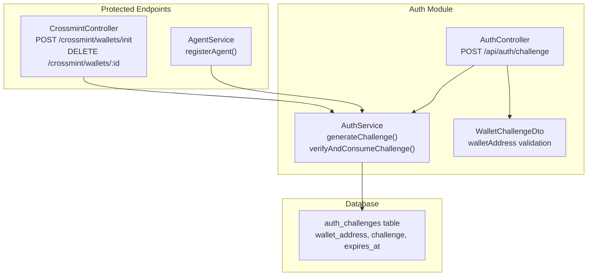
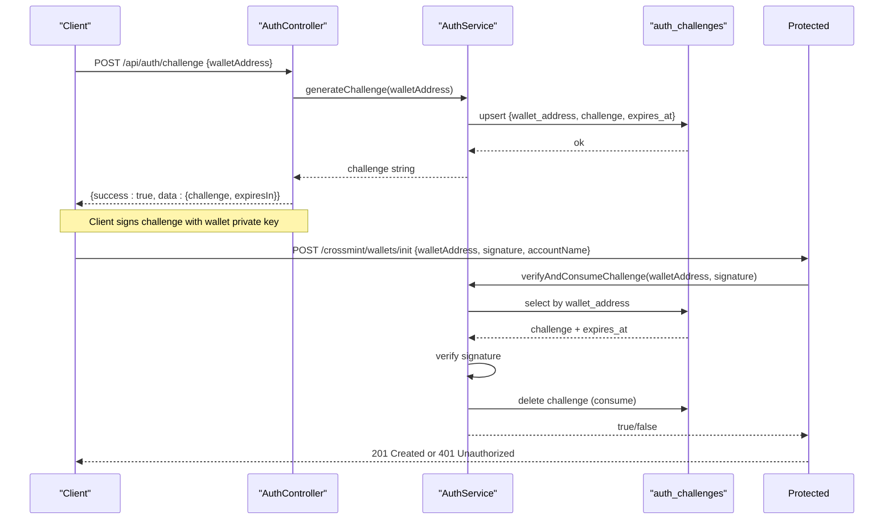
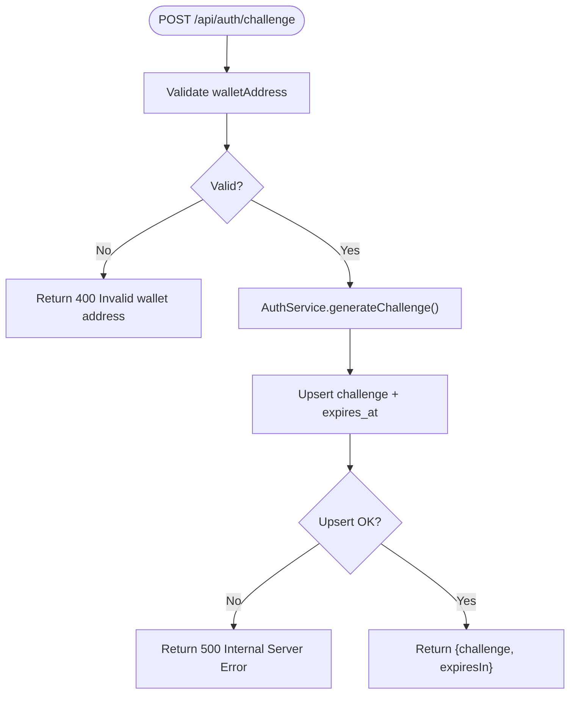
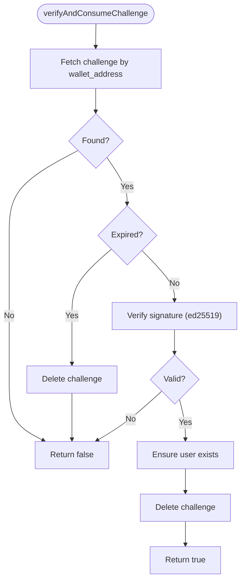
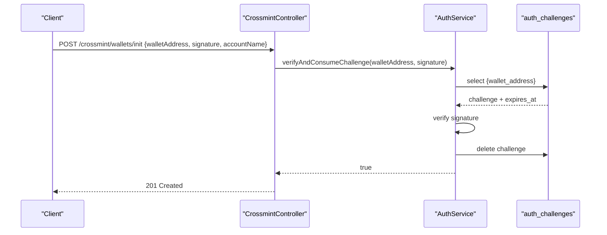
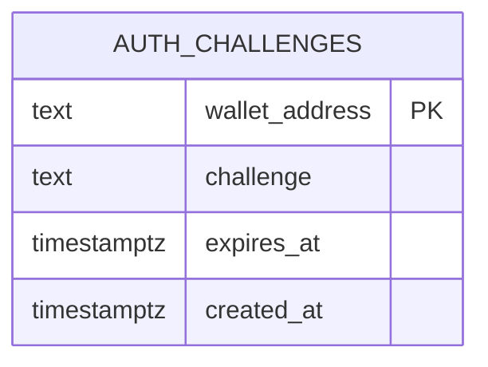
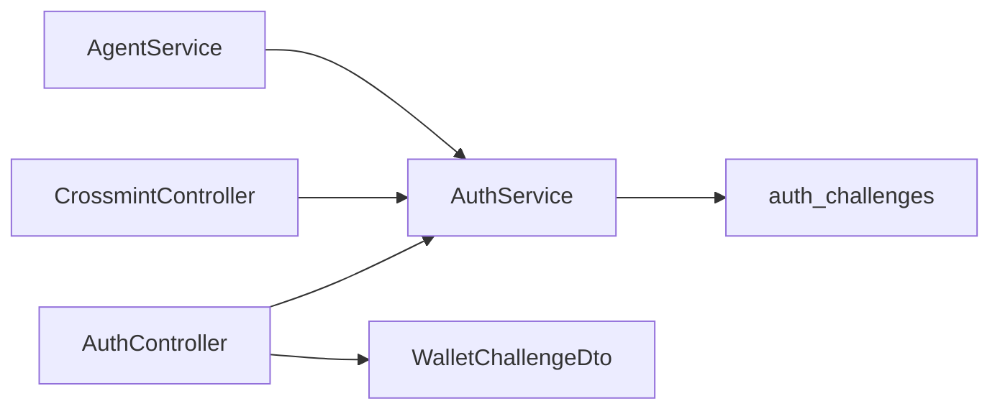

# Authentication API

<cite>
**Referenced Files in This Document**
- [auth.controller.ts](file://src/auth/auth.controller.ts)
- [auth.service.ts](file://src/auth/auth.service.ts)
- [wallet-challenge.dto.ts](file://src/auth/dto/wallet-challenge.dto.ts)
- [crossmint.controller.ts](file://src/crossmint/crossmint.controller.ts)
- [init-wallet.dto.ts](file://src/crossmint/dto/init-wallet.dto.ts)
- [signed-request.dto.ts](file://src/crossmint/dto/signed-request.dto.ts)
- [agent.service.ts](file://src/agent/agent.service.ts)
- [agent-wallet.decorator.ts](file://src/common/decorators/agent-wallet.decorator.ts)
- [add_auth_challenges.sql](file://supabase/migrations/20260128140000_add_auth_challenges.sql)
- [fix_auth_rls.sql](file://supabase/migrations/20260128143000_fix_auth_rls.sql)
- [full_system_test.ts](file://scripts/full_system_test.ts)
</cite>

## Table of Contents
1. [Introduction](#introduction)
2. [Project Structure](#project-structure)
3. [Core Components](#core-components)
4. [Architecture Overview](#architecture-overview)
5. [Detailed Component Analysis](#detailed-component-analysis)
6. [Dependency Analysis](#dependency-analysis)
7. [Performance Considerations](#performance-considerations)
8. [Troubleshooting Guide](#troubleshooting-guide)
9. [Conclusion](#conclusion)

## Introduction
This document provides comprehensive API documentation for the wallet signature authentication system. It focuses on the POST /api/auth/challenge endpoint for generating authentication challenges, the wallet signature verification flow, and practical integration patterns with protected endpoints. It also covers security considerations, challenge expiration handling, and best practices for client-side implementation.

## Project Structure
The authentication system is implemented as a NestJS module with a dedicated controller and service. Protected endpoints integrate with the authentication service to verify signatures and consume challenges.

**Diagram sources**
- [auth.controller.ts:11-47](file://src/auth/auth.controller.ts#L11-L47)
- [auth.service.ts:27-91](file://src/auth/auth.service.ts#L27-L91)
- [wallet-challenge.dto.ts:4-15](file://src/auth/dto/wallet-challenge.dto.ts#L4-L15)
- [crossmint.controller.ts:30-65](file://src/crossmint/crossmint.controller.ts#L30-L65)
- [agent.service.ts:15-20](file://src/agent/agent.service.ts#L15-L20)
- [add_auth_challenges.sql:1-7](file://supabase/migrations/20260128140000_add_auth_challenges.sql#L1-L7)

**Section sources**
- [auth.controller.ts:1-48](file://src/auth/auth.controller.ts#L1-L48)
- [auth.service.ts:1-165](file://src/auth/auth.service.ts#L1-L165)
- [wallet-challenge.dto.ts:1-16](file://src/auth/dto/wallet-challenge.dto.ts#L1-L16)
- [crossmint.controller.ts:1-67](file://src/crossmint/crossmint.controller.ts#L1-L67)
- [agent.service.ts:1-36](file://src/agent/agent.service.ts#L1-L36)
- [add_auth_challenges.sql:1-7](file://supabase/migrations/20260128140000_add_auth_challenges.sql#L1-L7)

## Core Components
- AuthController: Exposes the POST /api/auth/challenge endpoint and returns a challenge message and expiration time.
- AuthService: Generates challenges, persists them to the database, verifies signatures, and consumes challenges upon successful verification.
- WalletChallengeDto: Validates the incoming wallet address format.
- CrossmintController: Integrates signature verification for protected operations like initializing wallets and deleting accounts.
- AgentService: Uses the same signature verification flow for agent registration.

**Section sources**
- [auth.controller.ts:11-47](file://src/auth/auth.controller.ts#L11-L47)
- [auth.service.ts:27-91](file://src/auth/auth.service.ts#L27-L91)
- [wallet-challenge.dto.ts:4-15](file://src/auth/dto/wallet-challenge.dto.ts#L4-L15)
- [crossmint.controller.ts:30-65](file://src/crossmint/crossmint.controller.ts#L30-L65)
- [agent.service.ts:15-20](file://src/agent/agent.service.ts#L15-L20)

## Architecture Overview
The authentication flow consists of three phases:
1. Challenge Generation: Client requests a challenge for a given wallet address.
2. Client Signing: Client signs the challenge message with their wallet private key.
3. Protected Endpoint Access: Client submits the signature to protected endpoints; server verifies and consumes the challenge.

**Diagram sources**
- [auth.controller.ts:36-47](file://src/auth/auth.controller.ts#L36-L47)
- [auth.service.ts:27-51](file://src/auth/auth.service.ts#L27-L51)
- [auth.service.ts:57-91](file://src/auth/auth.service.ts#L57-L91)
- [crossmint.controller.ts:30-42](file://src/crossmint/crossmint.controller.ts#L30-L42)
- [add_auth_challenges.sql:1-7](file://supabase/migrations/20260128140000_add_auth_challenges.sql#L1-L7)

## Detailed Component Analysis

### POST /api/auth/challenge
- Purpose: Generate a challenge message for wallet signature authentication.
- Request body: JSON object containing walletAddress.
- Response: JSON object with success flag, challenge string, and expiresIn (seconds).
- Validation: walletAddress is validated against a Solana address pattern.
- Error handling: Returns 400 for invalid wallet address; internal errors return 500.

**Diagram sources**
- [auth.controller.ts:36-47](file://src/auth/auth.controller.ts#L36-L47)
- [auth.service.ts:27-51](file://src/auth/auth.service.ts#L27-L51)
- [wallet-challenge.dto.ts:4-15](file://src/auth/dto/wallet-challenge.dto.ts#L4-L15)

**Section sources**
- [auth.controller.ts:11-47](file://src/auth/auth.controller.ts#L11-L47)
- [auth.service.ts:27-51](file://src/auth/auth.service.ts#L27-L51)
- [wallet-challenge.dto.ts:4-15](file://src/auth/dto/wallet-challenge.dto.ts#L4-L15)

### Wallet Signature Verification Flow
- Protected endpoints call AuthService.verifyAndConsumeChallenge(walletAddress, signature).
- The service retrieves the stored challenge, checks expiration, verifies the signature using ed25519, and deletes the challenge upon success.
- On successful verification, the user record is ensured to exist.

**Diagram sources**
- [auth.service.ts:57-91](file://src/auth/auth.service.ts#L57-L91)

**Section sources**
- [auth.service.ts:57-91](file://src/auth/auth.service.ts#L57-L91)

### Protected Endpoints Integration
- CrossmintController.initWallet and CrossmintController.deleteWallet both verify signatures before performing operations.
- AgentService.registerAgent uses the same verification flow to register agents.

**Diagram sources**
- [crossmint.controller.ts:30-42](file://src/crossmint/crossmint.controller.ts#L30-L42)
- [auth.service.ts:57-91](file://src/auth/auth.service.ts#L57-L91)

**Section sources**
- [crossmint.controller.ts:30-42](file://src/crossmint/crossmint.controller.ts#L30-L42)
- [agent.service.ts:15-20](file://src/agent/agent.service.ts#L15-L20)

### Data Model
The auth_challenges table stores wallet challenges with expiration timestamps.

**Diagram sources**
- [add_auth_challenges.sql:1-7](file://supabase/migrations/20260128140000_add_auth_challenges.sql#L1-L7)

**Section sources**
- [add_auth_challenges.sql:1-7](file://supabase/migrations/20260128140000_add_auth_challenges.sql#L1-L7)
- [fix_auth_rls.sql:1-20](file://supabase/migrations/20260128143000_fix_auth_rls.sql#L1-L20)

## Dependency Analysis
- AuthController depends on AuthService and WalletChallengeDto.
- CrossmintController depends on AuthService for signature verification.
- AgentService depends on AuthService for agent registration.
- All verification logic depends on the auth_challenges table for challenge storage and retrieval.

**Diagram sources**
- [auth.controller.ts:3-4](file://src/auth/auth.controller.ts#L3-L4)
- [auth.service.ts:12-15](file://src/auth/auth.service.ts#L12-L15)
- [crossmint.controller.ts:10-21](file://src/crossmint/crossmint.controller.ts#L10-L21)
- [agent.service.ts:3-13](file://src/agent/agent.service.ts#L3-L13)
- [add_auth_challenges.sql:1-7](file://supabase/migrations/20260128140000_add_auth_challenges.sql#L1-L7)

**Section sources**
- [auth.controller.ts:3-4](file://src/auth/auth.controller.ts#L3-L4)
- [auth.service.ts:12-15](file://src/auth/auth.service.ts#L12-L15)
- [crossmint.controller.ts:10-21](file://src/crossmint/crossmint.controller.ts#L10-L21)
- [agent.service.ts:3-13](file://src/agent/agent.service.ts#L3-L13)

## Performance Considerations
- Challenge expiration: Challenges expire after 5 minutes; expired entries are cleaned periodically.
- Database upsert: Each challenge generation performs an upsert operation; ensure database performance is monitored under load.
- Signature verification: Uses tweetnacl for ed25519 verification; keep dependencies updated.

[No sources needed since this section provides general guidance]

## Troubleshooting Guide
Common issues and resolutions:
- Invalid wallet address: Ensure the walletAddress matches the expected Solana address pattern; the API returns 400 for invalid inputs.
- Invalid signature or expired challenge: Protected endpoints return 401 Unauthorized when the signature is invalid or the challenge has expired.
- Replay attacks: Challenges are consumed upon successful verification; attempting reuse results in 401 Unauthorized.
- Resource not found: Some endpoints may return 404 for non-existent resources after passing authentication.

Practical curl examples:
- Step 1: Generate challenge
  - curl -X POST https://your-domain.com/api/auth/challenge \
    -H "Content-Type: application/json" \
    -d '{"walletAddress":"YOUR_WALLET_ADDRESS"}'

- Step 2: Sign the challenge message using your wallet's private key (ed25519) and encode the signature in base58.

- Step 3: Submit signature to a protected endpoint
  - curl -X POST https://your-domain.com/crossmint/wallets/init \
    -H "Content-Type: application/json" \
    -d '{"walletAddress":"YOUR_WALLET_ADDRESS","signature":"BASE58_SIGNATURE","accountName":"Test Account"}'

Notes:
- Replace YOUR_WALLET_ADDRESS with your actual wallet address.
- Replace BASE58_SIGNATURE with the signature produced by signing the challenge message.
- The signature must be generated by the wallet that owns the provided walletAddress.

**Section sources**
- [auth.controller.ts:32-35](file://src/auth/auth.controller.ts#L32-L35)
- [auth.service.ts:72-76](file://src/auth/auth.service.ts#L72-L76)
- [crossmint.controller.ts:36-38](file://src/crossmint/crossmint.controller.ts#L36-L38)
- [full_system_test.ts:45-84](file://scripts/full_system_test.ts#L45-L84)

## Conclusion
The authentication system provides a secure, wallet signature-based mechanism for protecting endpoints. Clients generate challenges, sign them with their wallet private keys, and submit the signatures to protected endpoints. The server verifies signatures, enforces expiration, and prevents replay attacks by consuming challenges upon successful verification. Follow the provided patterns and best practices to integrate securely and reliably.