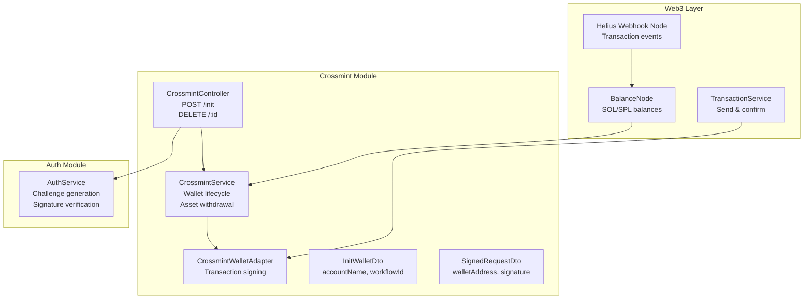
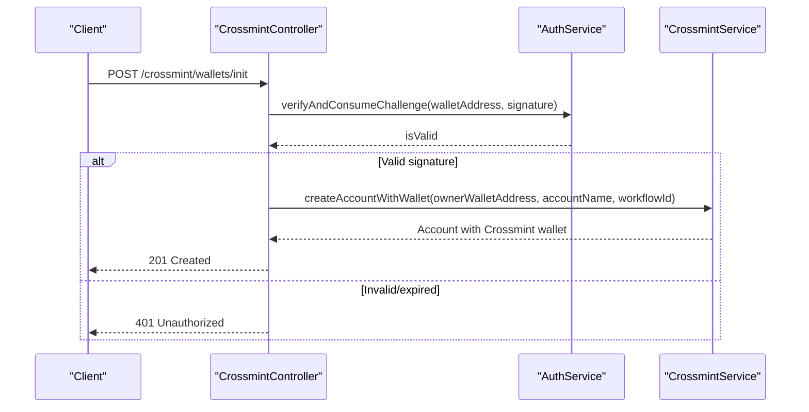
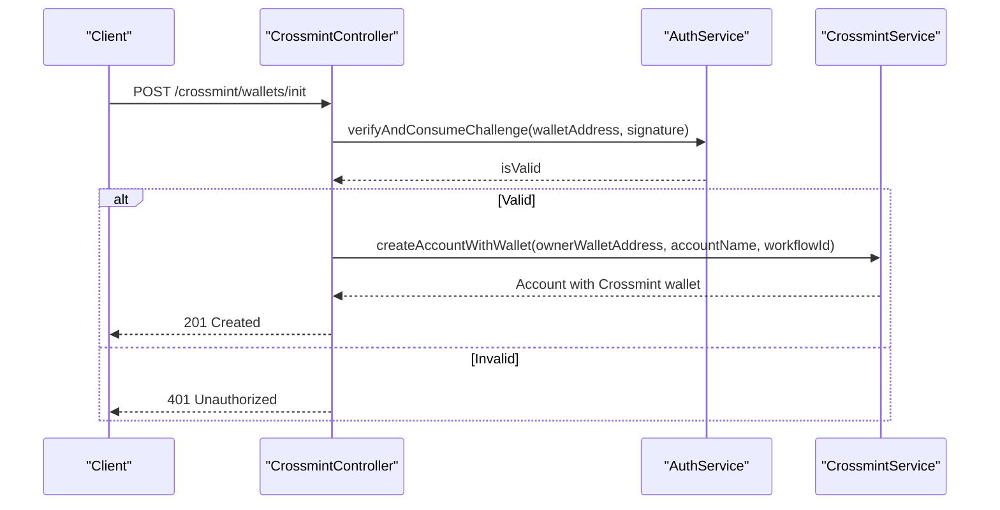
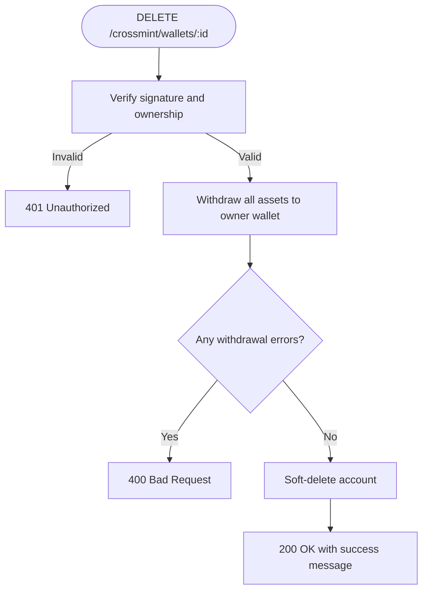
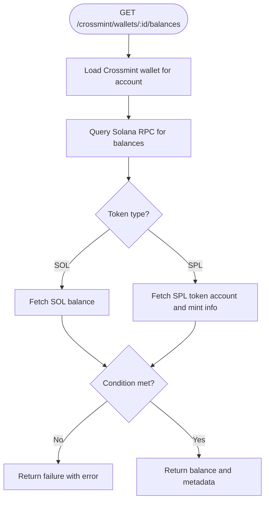
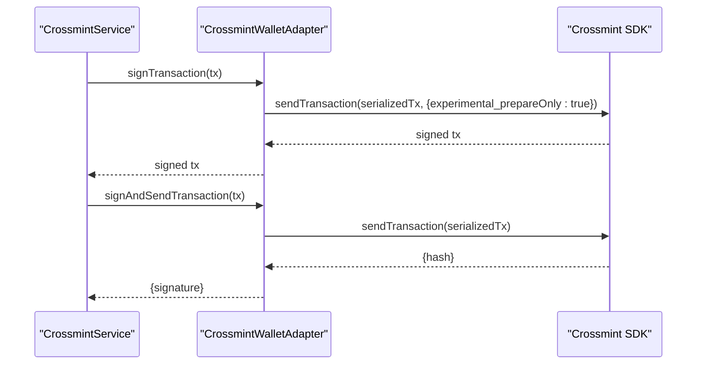
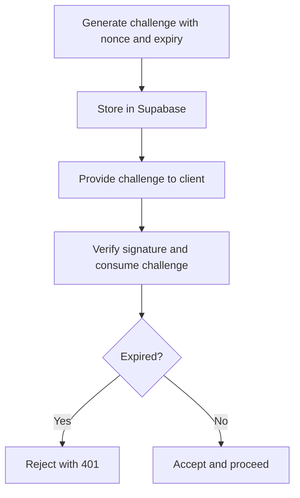
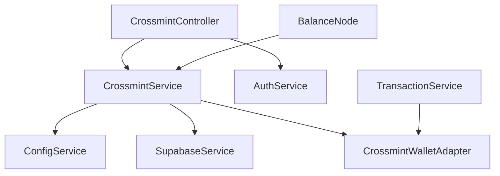

# Crossmint API

<cite>
**Referenced Files in This Document**
- [crossmint.controller.ts](file://src/crossmint/crossmint.controller.ts)
- [crossmint.service.ts](file://src/crossmint/crossmint.service.ts)
- [crossmint-wallet.adapter.ts](file://src/crossmint/crossmint-wallet.adapter.ts)
- [init-wallet.dto.ts](file://src/crossmint/dto/init-wallet.dto.ts)
- [signed-request.dto.ts](file://src/crossmint/dto/signed-request.dto.ts)
- [auth.service.ts](file://src/auth/auth.service.ts)
- [configuration.ts](file://src/config/configuration.ts)
- [balance.node.ts](file://src/web3/nodes/balance.node.ts)
- [transaction.service.ts](file://src/web3/services/transaction.service.ts)
- [helius-webhook.node.ts](file://src/web3/nodes/helius-webhook.node.ts)
- [full_system_test.ts](file://scripts/full_system_test.ts)
- [test-crossmint.ts](file://scripts/test-crossmint.ts)
</cite>

## Table of Contents
1. [Introduction](#introduction)
2. [Project Structure](#project-structure)
3. [Core Components](#core-components)
4. [Architecture Overview](#architecture-overview)
5. [Detailed Component Analysis](#detailed-component-analysis)
6. [Dependency Analysis](#dependency-analysis)
7. [Performance Considerations](#performance-considerations)
8. [Troubleshooting Guide](#troubleshooting-guide)
9. [Conclusion](#conclusion)
10. [Appendices](#appendices)

## Introduction
This document provides comprehensive API documentation for Crossmint wallet integration endpoints. It covers:
- POST /api/crossmint/wallets/init for custodial wallet initialization with request schema including wallet owner identifier and optional metadata
- DELETE /api/crossmint/wallets/:id for closing wallets with asset withdrawal
- GET /api/crossmint/wallets/:id/balances for retrieving wallet balances via the Balance Node
- Transaction signing and submission workflows using Crossmint wallets
- Crossmint-specific authentication requirements using signed challenges
- Error handling for wallet creation failures, transaction rejections, and network issues
- Practical examples and integration guidance

## Project Structure
The Crossmint integration is implemented as a NestJS module with dedicated controller, service, DTOs, and adapters. Authentication is handled by a separate Auth service that validates signed challenges. Balance queries leverage a Balance Node that interacts with the Crossmint wallet adapter.

**Diagram sources**
- [crossmint.controller.ts:15-67](file://src/crossmint/crossmint.controller.ts#L15-L67)
- [crossmint.service.ts:43-154](file://src/crossmint/crossmint.service.ts#L43-L154)
- [crossmint-wallet.adapter.ts:16-88](file://src/crossmint/crossmint-wallet.adapter.ts#L16-L88)
- [auth.service.ts:27-91](file://src/auth/auth.service.ts#L27-L91)
- [balance.node.ts:15-196](file://src/web3/nodes/balance.node.ts#L15-L196)
- [transaction.service.ts:41-101](file://src/web3/services/transaction.service.ts#L41-L101)
- [helius-webhook.node.ts:218-337](file://src/web3/nodes/helius-webhook.node.ts#L218-L337)

**Section sources**
- [crossmint.controller.ts:15-67](file://src/crossmint/crossmint.controller.ts#L15-L67)
- [crossmint.service.ts:43-154](file://src/crossmint/crossmint.service.ts#L43-L154)
- [auth.service.ts:27-91](file://src/auth/auth.service.ts#L27-L91)
- [balance.node.ts:15-196](file://src/web3/nodes/balance.node.ts#L15-L196)
- [transaction.service.ts:41-101](file://src/web3/services/transaction.service.ts#L41-L101)
- [helius-webhook.node.ts:218-337](file://src/web3/nodes/helius-webhook.node.ts#L218-L337)

## Core Components
- CrossmintController: Exposes wallet initialization and deletion endpoints with signature verification.
- CrossmintService: Manages Crossmint wallet lifecycle, including creation, retrieval, asset withdrawal, and deletion.
- CrossmintWalletAdapter: Wraps Crossmint's Solana wallet to support signing and sending transactions.
- InitWalletDto and SignedRequestDto: Request schemas for wallet initialization and generic signed requests.
- AuthService: Generates and verifies signed challenges for Crossmint authentication.
- BalanceNode: Queries SOL and SPL token balances for a given account ID.
- TransactionService: Provides transaction send-and-confirm utilities used by higher-level workflows.

**Section sources**
- [crossmint.controller.ts:15-67](file://src/crossmint/crossmint.controller.ts#L15-L67)
- [crossmint.service.ts:43-154](file://src/crossmint/crossmint.service.ts#L43-L154)
- [crossmint-wallet.adapter.ts:16-88](file://src/crossmint/crossmint-wallet.adapter.ts#L16-L88)
- [init-wallet.dto.ts:5-21](file://src/crossmint/dto/init-wallet.dto.ts#L5-L21)
- [signed-request.dto.ts:4-20](file://src/crossmint/dto/signed-request.dto.ts#L4-L20)
- [auth.service.ts:27-91](file://src/auth/auth.service.ts#L27-L91)
- [balance.node.ts:15-196](file://src/web3/nodes/balance.node.ts#L15-L196)
- [transaction.service.ts:41-101](file://src/web3/services/transaction.service.ts#L41-L101)

## Architecture Overview
The Crossmint integration follows a layered architecture:
- API Layer: CrossmintController handles HTTP requests and delegates to CrossmintService.
- Authentication Layer: AuthService validates signatures derived from signed challenges.
- Wallet Abstraction: CrossmintWalletAdapter provides a unified interface for signing and sending transactions.
- Data Access: CrossmintService persists wallet associations in Supabase and coordinates asset withdrawals.
- Monitoring and Events: BalanceNode and Helius Webhook Node provide balance monitoring and transaction event handling.

**Diagram sources**
- [crossmint.controller.ts:23-42](file://src/crossmint/crossmint.controller.ts#L23-L42)
- [auth.service.ts:57-91](file://src/auth/auth.service.ts#L57-L91)
- [crossmint.service.ts:163-204](file://src/crossmint/crossmint.service.ts#L163-L204)

## Detailed Component Analysis

### Wallet Initialization Endpoint
- Endpoint: POST /api/crossmint/wallets/init
- Purpose: Initialize a new custodial Crossmint wallet for an owner wallet address and create an associated account record.
- Authentication: Requires a valid signature derived from a signed challenge generated by the Auth service.
- Request Schema:
  - walletAddress: string (required)
  - signature: string (required)
  - accountName: string (required)
  - workflowId: string (optional)
- Response: Account object containing identifiers and wallet details.
- Error Handling:
  - 401 Unauthorized if signature verification fails or challenge expired.
  - 500 Internal Server Error for failures during wallet creation or account insertion.

**Diagram sources**
- [crossmint.controller.ts:23-42](file://src/crossmint/crossmint.controller.ts#L23-L42)
- [auth.service.ts:57-91](file://src/auth/auth.service.ts#L57-L91)
- [crossmint.service.ts:163-204](file://src/crossmint/crossmint.service.ts#L163-L204)

**Section sources**
- [crossmint.controller.ts:23-42](file://src/crossmint/crossmint.controller.ts#L23-L42)
- [init-wallet.dto.ts:5-21](file://src/crossmint/dto/init-wallet.dto.ts#L5-L21)
- [signed-request.dto.ts:4-20](file://src/crossmint/dto/signed-request.dto.ts#L4-L20)
- [auth.service.ts:57-91](file://src/auth/auth.service.ts#L57-L91)
- [crossmint.service.ts:163-204](file://src/crossmint/crossmint.service.ts#L163-L204)

### Wallet Deletion Endpoint
- Endpoint: DELETE /api/crossmint/wallets/:id
- Purpose: Close a wallet by withdrawing all assets back to the owner wallet and marking the account as closed.
- Authentication: Requires a valid signature derived from a signed challenge.
- Request Schema:
  - walletAddress: string (required)
  - signature: string (required)
- Behavior:
  - Verifies ownership and signature.
  - Withdraws all SPL tokens and SOL (reserving minimal lamports for fees).
  - Prevents closure if any withdrawal fails.
  - Soft-deletes the account upon successful withdrawal.
- Responses:
  - 200 OK with success message and withdrawal results.
  - 401 Unauthorized for invalid signature.
  - 403 Forbidden for non-owner attempts.
  - 404 Not Found for missing account.
  - 400 Bad Request if withdrawal errors occurred.

**Diagram sources**
- [crossmint.controller.ts:44-65](file://src/crossmint/crossmint.controller.ts#L44-L65)
- [crossmint.service.ts:349-401](file://src/crossmint/crossmint.service.ts#L349-L401)

**Section sources**
- [crossmint.controller.ts:44-65](file://src/crossmint/crossmint.controller.ts#L44-L65)
- [crossmint.service.ts:349-401](file://src/crossmint/crossmint.service.ts#L349-L401)

### Balance Retrieval Endpoint
- Endpoint: GET /api/crossmint/wallets/:id/balances
- Implementation: Provided via BalanceNode, which queries SOL and SPL token balances for a given account ID.
- Supported Tokens: SOL and SPL tokens defined in TOKEN_ADDRESS constants.
- Conditions: Optional threshold checks (greater than, less than, equal to, etc.) for workflow gating.
- Response Fields:
  - success: boolean
  - operation: "getBalance"
  - token: string
  - balance: number
  - decimals: number
  - walletAddress: string
  - accountId: string
  - condition: object|null

**Diagram sources**
- [balance.node.ts:68-196](file://src/web3/nodes/balance.node.ts#L68-L196)

**Section sources**
- [balance.node.ts:68-196](file://src/web3/nodes/balance.node.ts#L68-L196)

### Transaction Signing and Submission
- Wallet Adapter: CrossmintWalletAdapter supports signing single/multiple transactions and sending them via Crossmint.
- Signing Flow:
  - Serialize transaction to base64.
  - Call sendTransaction with experimental_prepareOnly for signing-only.
- Sending Flow:
  - Serialize transaction to base64.
  - Call sendTransaction without prepareOnly to submit.
- Error Handling:
  - Throws for unsupported signMessage operations.
  - Propagates underlying Crossmint SDK errors.

**Diagram sources**
- [crossmint-wallet.adapter.ts:35-76](file://src/crossmint/crossmint-wallet.adapter.ts#L35-L76)
- [crossmint.service.ts:209-344](file://src/crossmint/crossmint.service.ts#L209-L344)

**Section sources**
- [crossmint-wallet.adapter.ts:35-76](file://src/crossmint/crossmint-wallet.adapter.ts#L35-L76)
- [crossmint.service.ts:209-344](file://src/crossmint/crossmint.service.ts#L209-L344)

### Authentication and Challenge Management
- Challenge Generation: AuthService generates a challenge with a random nonce and expiration timestamp, stores it in Supabase, and returns the challenge string.
- Signature Verification: Validates the provided signature against the stored challenge and removes the challenge upon successful verification.
- Expiration: Challenges expire after 5 minutes and are cleaned up periodically.

**Diagram sources**
- [auth.service.ts:27-91](file://src/auth/auth.service.ts#L27-L91)

**Section sources**
- [auth.service.ts:27-91](file://src/auth/auth.service.ts#L27-L91)

### API Definitions

#### POST /api/crossmint/wallets/init
- Description: Initialize a new custodial Crossmint wallet for the provided owner wallet address.
- Authentication: Signed challenge required.
- Request Body:
  - walletAddress: string
  - signature: string
  - accountName: string
  - workflowId: string (optional)
- Responses:
  - 201 Created: Account created with Crossmint wallet details.
  - 401 Unauthorized: Invalid or expired signature.
  - 500 Internal Server Error: Failure during wallet creation or account insertion.

**Section sources**
- [crossmint.controller.ts:23-42](file://src/crossmint/crossmint.controller.ts#L23-L42)
- [init-wallet.dto.ts:5-21](file://src/crossmint/dto/init-wallet.dto.ts#L5-L21)
- [auth.service.ts:57-91](file://src/auth/auth.service.ts#L57-L91)
- [crossmint.service.ts:163-204](file://src/crossmint/crossmint.service.ts#L163-L204)

#### DELETE /api/crossmint/wallets/:id
- Description: Close a wallet by withdrawing all assets to the owner wallet and soft-deleting the account.
- Authentication: Signed challenge required.
- Request Body:
  - walletAddress: string
  - signature: string
- Responses:
  - 200 OK: Success with withdrawal results.
  - 401 Unauthorized: Invalid or expired signature.
  - 403 Forbidden: Ownership verification failed.
  - 404 Not Found: Account does not exist.
  - 400 Bad Request: Withdrawal errors prevented closure.

**Section sources**
- [crossmint.controller.ts:44-65](file://src/crossmint/crossmint.controller.ts#L44-L65)
- [crossmint.service.ts:349-401](file://src/crossmint/crossmint.service.ts#L349-L401)

#### GET /api/crossmint/wallets/:id/balances
- Description: Retrieve SOL and SPL token balances for the specified account ID.
- Implementation: BalanceNode queries balances via Solana RPC and supports optional threshold conditions.
- Response Fields:
  - success: boolean
  - operation: "getBalance"
  - token: string
  - balance: number
  - decimals: number
  - walletAddress: string
  - accountId: string
  - condition: object|null

**Section sources**
- [balance.node.ts:68-196](file://src/web3/nodes/balance.node.ts#L68-L196)

## Dependency Analysis
- CrossmintController depends on CrossmintService and AuthService.
- CrossmintService depends on:
  - ConfigService for Crossmint credentials and environment
  - SupabaseService for account/wallet persistence
  - CrossmintWallets SDK for wallet operations
  - WorkflowLifecycleManager for workflow orchestration
- CrossmintWalletAdapter wraps Crossmint's SolanaWallet to provide a unified interface.
- BalanceNode depends on AgentKitService and TOKEN_ADDRESS constants.
- TransactionService provides reusable transaction send-and-confirm utilities.

**Diagram sources**
- [crossmint.controller.ts:18-21](file://src/crossmint/crossmint.controller.ts#L18-L21)
- [crossmint.service.ts:49-54](file://src/crossmint/crossmint.service.ts#L49-L54)
- [balance.node.ts:72-77](file://src/web3/nodes/balance.node.ts#L72-L77)
- [transaction.service.ts:41-101](file://src/web3/services/transaction.service.ts#L41-L101)

**Section sources**
- [crossmint.controller.ts:18-21](file://src/crossmint/crossmint.controller.ts#L18-L21)
- [crossmint.service.ts:49-54](file://src/crossmint/crossmint.service.ts#L49-L54)
- [balance.node.ts:72-77](file://src/web3/nodes/balance.node.ts#L72-L77)
- [transaction.service.ts:41-101](file://src/web3/services/transaction.service.ts#L41-L101)

## Performance Considerations
- Crossmint wallet creation and retrieval involve external SDK calls; cache frequently accessed wallet adapters when appropriate.
- Balance queries rely on Solana RPC; batch requests and use efficient token lookup tables where possible.
- Transaction submission incurs network latency; consider using recent blockhash caching and parallelization for multiple transactions.
- Asset withdrawal performs multiple RPC calls per token; optimize by consolidating operations and retrying transient failures.

## Troubleshooting Guide
Common issues and resolutions:
- 401 Unauthorized on /init:
  - Cause: Invalid or expired signature.
  - Resolution: Regenerate challenge and sign again within 5 minutes.
- 403 Forbidden on /delete:
  - Cause: Non-owner attempting to close wallet.
  - Resolution: Ensure the provided walletAddress matches the account owner.
- 400 Bad Request on /delete:
  - Cause: Withdrawal errors preventing closure.
  - Resolution: Inspect withdrawal results and retry after resolving underlying issues.
- 404 Not Found on /delete:
  - Cause: Account does not exist.
  - Resolution: Verify account ID and existence in Supabase.
- BalanceNode errors:
  - Cause: Unknown token or RPC failures.
  - Resolution: Confirm token is supported and RPC endpoint is reachable.

Operational checks:
- Environment variables: Ensure CROSSMINT_SERVER_API_KEY, CROSSMINT_SIGNER_SECRET, and CROSSMINT_ENVIRONMENT are configured.
- Crossmint SDK connectivity: Use the provided test script to validate SDK configuration.
- System integration: The full system test demonstrates end-to-end initialization and replay attack prevention.

**Section sources**
- [auth.service.ts:27-91](file://src/auth/auth.service.ts#L27-L91)
- [crossmint.controller.ts:44-65](file://src/crossmint/crossmint.controller.ts#L44-L65)
- [crossmint.service.ts:349-401](file://src/crossmint/crossmint.service.ts#L349-L401)
- [balance.node.ts:167-190](file://src/web3/nodes/balance.node.ts#L167-L190)
- [configuration.ts:27-31](file://src/config/configuration.ts#L27-L31)
- [test-crossmint.ts:12-78](file://scripts/test-crossmint.ts#L12-L78)
- [full_system_test.ts:71-102](file://scripts/full_system_test.ts#L71-L102)

## Conclusion
The Crossmint integration provides secure, custodial wallet management with robust authentication, asset withdrawal, and balance monitoring capabilities. By leveraging signed challenges, a unified wallet adapter, and modular services, the system supports reliable wallet lifecycle management and transaction execution on Solana.

## Appendices

### Crossmint API Key Management
- Required environment variables:
  - CROSSMINT_SERVER_API_KEY: Crossmint server API key
  - CROSSMINT_SIGNER_SECRET: Crossmint signer secret
  - CROSSMINT_ENVIRONMENT: Environment selection (default: production)
- Configuration loading occurs in ConfigService under the crossmint namespace.

**Section sources**
- [configuration.ts:27-31](file://src/config/configuration.ts#L27-L31)

### Webhook Integration for Transaction Confirmations
- Helius Webhook Node supports creating, retrieving, deleting, and listing webhooks for transaction monitoring.
- Configure webhook URLs and transaction types to receive real-time updates for monitored addresses.

**Section sources**
- [helius-webhook.node.ts:218-337](file://src/web3/nodes/helius-webhook.node.ts#L218-L337)

### Practical Examples

#### Wallet Setup
- Step 1: Generate a signed challenge and obtain the challenge string.
- Step 2: Sign the challenge with the owner wallet.
- Step 3: Call POST /api/crossmint/wallets/init with walletAddress, signature, accountName, and optional workflowId.
- Expected outcome: 201 Created with account and wallet details.

**Section sources**
- [auth.service.ts:27-51](file://src/auth/auth.service.ts#L27-L51)
- [crossmint.controller.ts:23-42](file://src/crossmint/crossmint.controller.ts#L23-L42)
- [full_system_test.ts:71-84](file://scripts/full_system_test.ts#L71-L84)

#### Transaction Execution
- Obtain Crossmint wallet adapter for the account.
- Build transaction instructions and serialize to base64.
- Sign transaction using signTransaction (prepare-only).
- Submit transaction using signAndSendTransaction.
- Monitor confirmation via Helius webhooks or RPC polling.

**Section sources**
- [crossmint-wallet.adapter.ts:35-76](file://src/crossmint/crossmint-wallet.adapter.ts#L35-L76)
- [transaction.service.ts:41-101](file://src/web3/services/transaction.service.ts#L41-L101)
- [helius-webhook.node.ts:218-337](file://src/web3/nodes/helius-webhook.node.ts#L218-L337)

#### Balance Monitoring
- Use BalanceNode to query SOL and SPL token balances for an account ID.
- Optionally enforce thresholds to gate downstream workflow steps.

**Section sources**
- [balance.node.ts:68-196](file://src/web3/nodes/balance.node.ts#L68-L196)