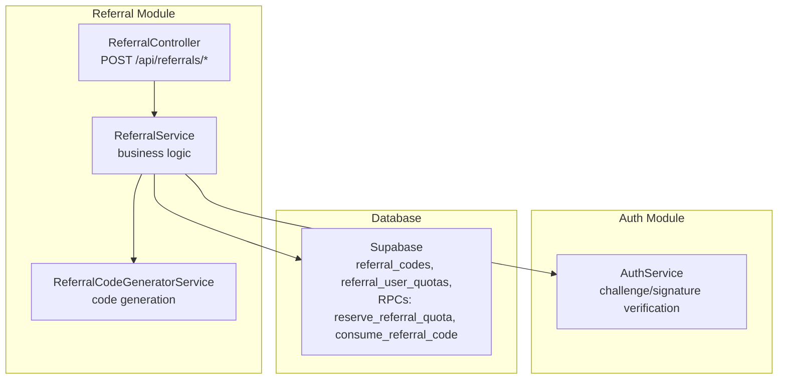
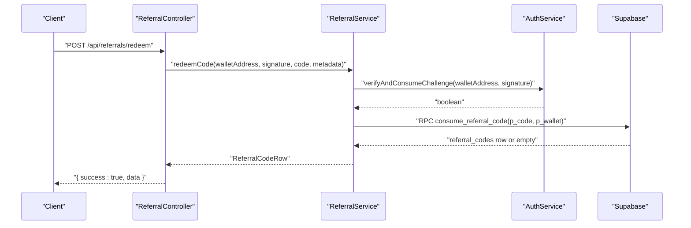
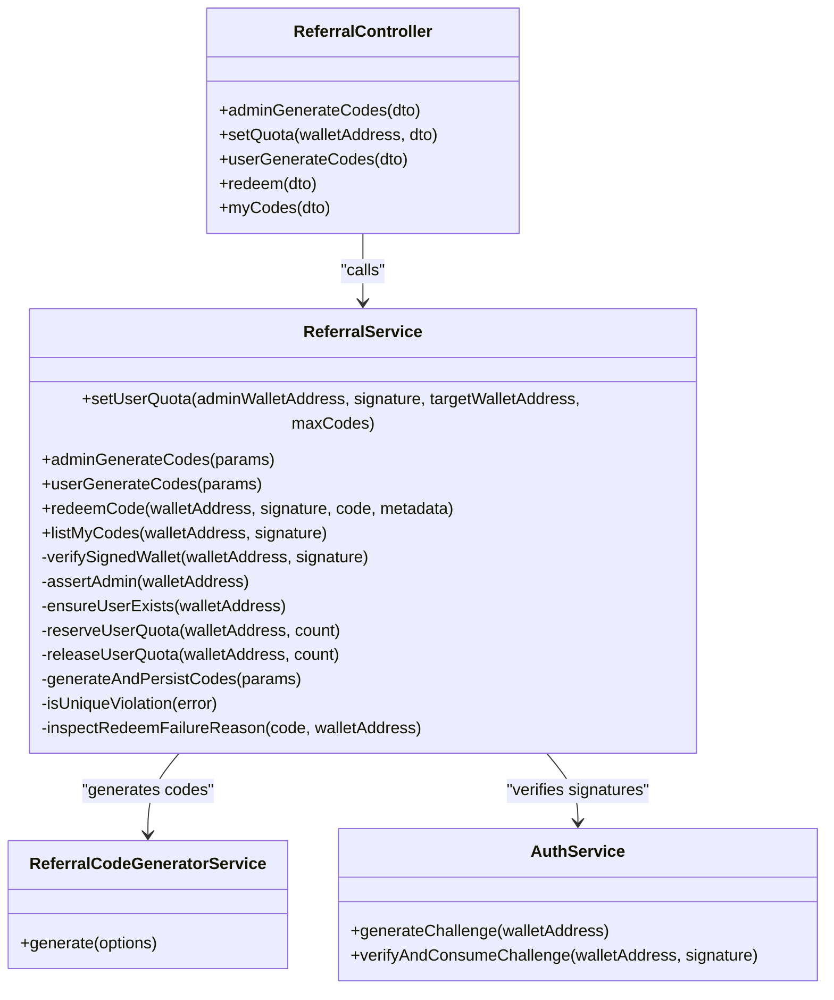
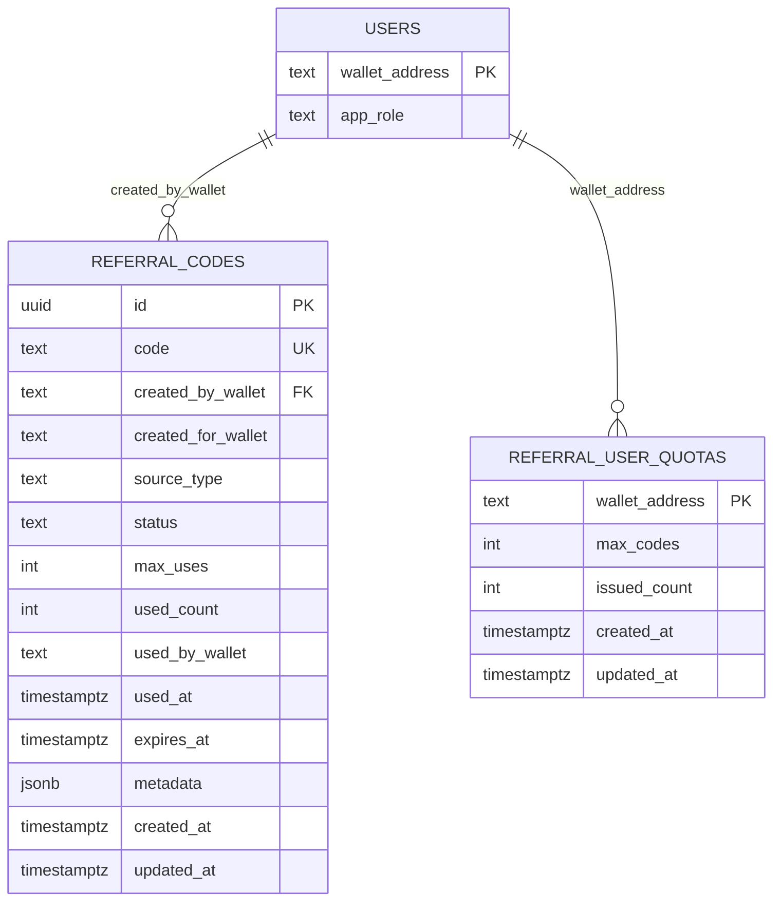
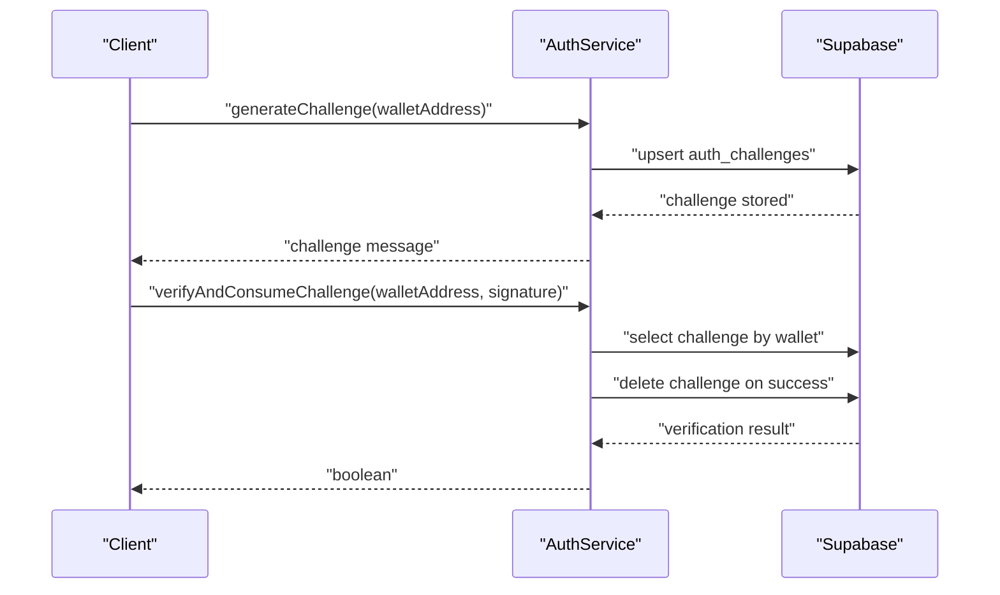
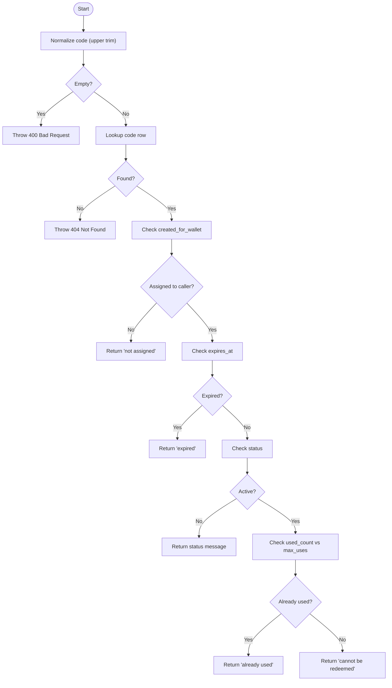

# Referral API

<cite>
**Referenced Files in This Document**
- [referral.controller.ts](file://src/referral/referral.controller.ts)
- [referral.service.ts](file://src/referral/referral.service.ts)
- [admin-generate-referral-codes.dto.ts](file://src/referral/dto/admin-generate-referral-codes.dto.ts)
- [generate-user-referral-codes.dto.ts](file://src/referral/dto/generate-user-referral-codes.dto.ts)
- [redeem-referral-code.dto.ts](file://src/referral/dto/redeem-referral-code.dto.ts)
- [set-referral-quota.dto.ts](file://src/referral/dto/set-referral-quota.dto.ts)
- [signed-wallet-request.dto.ts](file://src/referral/dto/signed-wallet-request.dto.ts)
- [referral-code-generator.service.ts](file://src/referral/referral-code-generator.service.ts)
- [referral.constants.ts](file://src/referral/referral.constants.ts)
- [referral.module.ts](file://src/referral/referral.module.ts)
- [20260320090000_add_referral_system.sql](file://supabase/migrations/20260320090000_add_referral_system.sql)
- [auth.service.ts](file://src/auth/auth.service.ts)
- [wallet-challenge.dto.ts](file://src/auth/dto/wallet-challenge.dto.ts)
</cite>

## Table of Contents
1. [Introduction](#introduction)
2. [Project Structure](#project-structure)
3. [Core Components](#core-components)
4. [Architecture Overview](#architecture-overview)
5. [Detailed Component Analysis](#detailed-component-analysis)
6. [Dependency Analysis](#dependency-analysis)
7. [Performance Considerations](#performance-considerations)
8. [Troubleshooting Guide](#troubleshooting-guide)
9. [Conclusion](#conclusion)
10. [Appendices](#appendices)

## Introduction
This document provides comprehensive API documentation for the referral system endpoints. It covers:
- POST /api/referrals/admin/codes for administrative bulk generation of single-use referral codes
- POST /api/referrals/codes for user-generated codes within lifetime quota
- POST /api/referrals/redeem for wallet-signed referral code redemption
- PATCH /api/referrals/admin/quotas/:walletAddress for setting user lifetime quotas
- POST /api/referrals/my-codes for listing codes created by a wallet

It documents request/response schemas, wallet signature requirements, practical workflows, validation rules, duplicate prevention, audit trail mechanisms, and error handling.

## Project Structure
The referral system is implemented as a NestJS module with a controller, service, DTOs, and a generator service. Database schema and helper functions are defined via a Supabase migration.

**Diagram sources**
- [referral.controller.ts:10-92](file://src/referral/referral.controller.ts#L10-L92)
- [referral.service.ts:43-49](file://src/referral/referral.service.ts#L43-L49)
- [referral-code-generator.service.ts:24-49](file://src/referral/referral-code-generator.service.ts#L24-L49)
- [auth.service.ts:8-165](file://src/auth/auth.service.ts#L8-L165)
- [20260320090000_add_referral_system.sql:32-195](file://supabase/migrations/20260320090000_add_referral_system.sql#L32-L195)

**Section sources**
- [referral.module.ts:1-14](file://src/referral/referral.module.ts#L1-L14)
- [referral.controller.ts:10-92](file://src/referral/referral.controller.ts#L10-L92)

## Core Components
- ReferralController: Exposes REST endpoints for admin generation, user generation, redemption, quota setting, and listing codes.
- ReferralService: Implements business logic, enforces admin checks, validates signatures, reserves/releases quotas, generates and persists codes, and redeems codes via RPC.
- ReferralCodeGeneratorService: Generates unique referral codes using a dedicated library.
- DTOs: Strongly typed request schemas for each endpoint with validation rules.
- Database: Supabase tables and stored procedures for code lifecycle and quota management.

**Section sources**
- [referral.controller.ts:10-92](file://src/referral/referral.controller.ts#L10-L92)
- [referral.service.ts:43-364](file://src/referral/referral.service.ts#L43-L364)
- [referral-code-generator.service.ts:24-49](file://src/referral/referral-code-generator.service.ts#L24-L49)
- [admin-generate-referral-codes.dto.ts:15-73](file://src/referral/dto/admin-generate-referral-codes.dto.ts#L15-L73)
- [generate-user-referral-codes.dto.ts:15-62](file://src/referral/dto/generate-user-referral-codes.dto.ts#L15-L62)
- [redeem-referral-code.dto.ts:5-41](file://src/referral/dto/redeem-referral-code.dto.ts#L5-L41)
- [set-referral-quota.dto.ts:5-34](file://src/referral/dto/set-referral-quota.dto.ts#L5-L34)
- [signed-wallet-request.dto.ts:5-25](file://src/referral/dto/signed-wallet-request.dto.ts#L5-L25)
- [20260320090000_add_referral_system.sql:32-195](file://supabase/migrations/20260320090000_add_referral_system.sql#L32-L195)

## Architecture Overview
The referral API follows a layered architecture:
- Controller validates DTOs and delegates to Service
- Service verifies wallet signatures, ensures admin roles, manages quotas via RPCs, and performs code generation/persistence/redemption
- Generator service produces unique codes
- Database enforces uniqueness and stores state; RPCs handle atomic operations

**Diagram sources**
- [referral.controller.ts:66-80](file://src/referral/referral.controller.ts#L66-L80)
- [referral.service.ts:140-193](file://src/referral/referral.service.ts#L140-L193)
- [auth.service.ts:57-91](file://src/auth/auth.service.ts#L57-L91)
- [20260320090000_add_referral_system.sql:155-187](file://supabase/migrations/20260320090000_add_referral_system.sql#L155-L187)

## Detailed Component Analysis

### POST /api/referrals/admin/codes
Purpose: Admin generates single-use referral codes for a target wallet.

- Path: POST /api/referrals/admin/codes
- Request DTO: AdminGenerateReferralCodesDto
- Response: JSON with success flag, count, and array of generated ReferralCodeRow

Request Schema
- adminWalletAddress: string (Solana wallet address)
- signature: string (wallet signature of active challenge)
- targetWalletAddress: string (Solana wallet address)
- count: number (1 to REFERRAL_MAX_BATCH_SIZE)
- expiresAt: string (optional ISO-8601 timestamp)
- metadata: object (optional JSON)

Response Schema
- success: boolean
- count: number
- data: ReferralCodeRow[]

Validation and Security
- Admin signature verified against active challenge
- Admin role enforced
- Target user ensured to exist
- Codes generated with retry loop to prevent duplicates
- Single-use, active status, optional expiration

Practical Example
- Admin signs a challenge, then calls admin/codes with targetWalletAddress, count, optional expiresAt and metadata
- Returns array of newly created codes

**Section sources**
- [referral.controller.ts:15-31](file://src/referral/referral.controller.ts#L15-L31)
- [admin-generate-referral-codes.dto.ts:15-73](file://src/referral/dto/admin-generate-referral-codes.dto.ts#L15-L73)
- [referral.service.ts:84-107](file://src/referral/referral.service.ts#L84-L107)
- [referral.service.ts:279-320](file://src/referral/referral.service.ts#L279-L320)
- [20260320090000_add_referral_system.sql:32-48](file://supabase/migrations/20260320090000_add_referral_system.sql#L32-L48)

### POST /api/referrals/codes
Purpose: User generates single-use referral codes within lifetime quota.

- Path: POST /api/referrals/codes
- Request DTO: GenerateUserReferralCodesDto
- Response: JSON with success flag, count, and array of generated ReferralCodeRow

Request Schema
- walletAddress: string (Solana wallet address)
- signature: string (wallet signature of active challenge)
- count: number (1 to REFERRAL_MAX_BATCH_SIZE)
- expiresAt: string (optional ISO-8601 timestamp)
- metadata: object (optional JSON)

Response Schema
- success: boolean
- count: number
- data: ReferralCodeRow[]

Validation and Security
- User signature verified against active challenge
- User ensured to exist
- Quota reserved via RPC; on failure, user quota released
- Codes generated with retry loop to prevent duplicates

Practical Example
- User requests a code batch; system checks quota, reserves it, generates codes, and persists them

**Section sources**
- [referral.controller.ts:49-64](file://src/referral/referral.controller.ts#L49-L64)
- [generate-user-referral-codes.dto.ts:15-62](file://src/referral/dto/generate-user-referral-codes.dto.ts#L15-L62)
- [referral.service.ts:109-138](file://src/referral/referral.service.ts#L109-L138)
- [referral.service.ts:255-277](file://src/referral/referral.service.ts#L255-L277)
- [20260320090000_add_referral_system.sql:65-72](file://supabase/migrations/20260320090000_add_referral_system.sql#L65-L72)

### POST /api/referrals/redeem
Purpose: Redeem a single-use referral code with wallet signature.

- Path: POST /api/referrals/redeem
- Request DTO: RedeemReferralCodeDto
- Response: JSON with success flag and redeemed ReferralCodeRow

Request Schema
- walletAddress: string (Solana wallet address)
- signature: string (wallet signature of active challenge)
- code: string (non-empty)
- metadata: object (optional JSON)

Response Schema
- success: boolean
- data: ReferralCodeRow

Validation and Security
- Wallet signature verified against active challenge
- User ensured to exist
- Code normalized to uppercase and trimmed
- Redemption performed via RPC with atomic updates
- Metadata can be merged into existing metadata on successful redemption

Practical Example
- User submits code and signature; system validates state and consumes the code atomically

**Section sources**
- [referral.controller.ts:66-80](file://src/referral/referral.controller.ts#L66-L80)
- [redeem-referral-code.dto.ts:5-41](file://src/referral/dto/redeem-referral-code.dto.ts#L5-L41)
- [referral.service.ts:140-193](file://src/referral/referral.service.ts#L140-L193)
- [20260320090000_add_referral_system.sql:155-187](file://supabase/migrations/20260320090000_add_referral_system.sql#L155-L187)

### PATCH /api/referrals/admin/quotas/:walletAddress
Purpose: Admin sets a user’s lifetime referral-code quota.

- Path: PATCH /api/referrals/admin/quotas/:walletAddress
- Request DTO: SetReferralQuotaDto
- Response: JSON with success flag and updated quota

Request Schema
- adminWalletAddress: string (Solana wallet address)
- signature: string (wallet signature of active challenge)
- maxCodes: number (minimum 0)

Response Schema
- success: boolean
- data: QuotaRow

Validation and Security
- Admin signature verified against active challenge
- Admin role enforced
- Target user ensured to exist
- Upsert with conflict on wallet_address; quota cannot be lower than current issued_count

Practical Example
- Admin increases a user’s lifetime quota; system enforces constraints and returns updated quota

**Section sources**
- [referral.controller.ts:33-47](file://src/referral/referral.controller.ts#L33-L47)
- [set-referral-quota.dto.ts:5-34](file://src/referral/dto/set-referral-quota.dto.ts#L5-L34)
- [referral.service.ts:51-82](file://src/referral/referral.service.ts#L51-L82)
- [20260320090000_add_referral_system.sql:65-72](file://supabase/migrations/20260320090000_add_referral_system.sql#L65-L72)

### POST /api/referrals/my-codes
Purpose: List referral codes created by the calling wallet.

- Path: POST /api/referrals/my-codes
- Request DTO: SignedWalletRequestDto
- Response: JSON with success flag, count, and array of ReferralCodeRow

Request Schema
- walletAddress: string (Solana wallet address)
- signature: string (wallet signature of active challenge)

Response Schema
- success: boolean
- count: number
- data: ReferralCodeRow[]

Validation and Security
- Wallet signature verified against active challenge
- Fetches codes ordered by creation time descending

Practical Example
- User lists their own codes for audit or sharing

**Section sources**
- [referral.controller.ts:82-90](file://src/referral/referral.controller.ts#L82-L90)
- [signed-wallet-request.dto.ts:5-25](file://src/referral/dto/signed-wallet-request.dto.ts#L5-L25)
- [referral.service.ts:195-209](file://src/referral/referral.service.ts#L195-L209)

## Dependency Analysis

**Diagram sources**
- [referral.controller.ts:10-92](file://src/referral/referral.controller.ts#L10-L92)
- [referral.service.ts:43-364](file://src/referral/referral.service.ts#L43-L364)
- [referral-code-generator.service.ts:24-49](file://src/referral/referral-code-generator.service.ts#L24-L49)
- [auth.service.ts:8-165](file://src/auth/auth.service.ts#L8-L165)

**Section sources**
- [referral.controller.ts:10-92](file://src/referral/referral.controller.ts#L10-L92)
- [referral.service.ts:43-364](file://src/referral/referral.service.ts#L43-L364)
- [referral-code-generator.service.ts:24-49](file://src/referral/referral-code-generator.service.ts#L24-L49)
- [auth.service.ts:8-165](file://src/auth/auth.service.ts#L8-L165)

## Performance Considerations
- Batch limits: Maximum batch size is enforced by DTOs and constants to prevent excessive load.
- Unique code generation: Retry loop with unique violation detection reduces duplicate keys during insertion.
- Atomic operations: Quota reservation/release and code redemption use stored procedures to avoid race conditions.
- Indexes: Database tables include strategic indexes to optimize queries on created_by_wallet, created_for_wallet, status, and timestamps.

[No sources needed since this section provides general guidance]

## Troubleshooting Guide
Common errors and causes:
- Invalid signature or challenge expired
  - Triggered when signature verification fails or challenge expired
  - Response: 403 Forbidden
  - Related to signature verification logic
- Admin permission required
  - Triggered when attempting admin-only operations without admin role
  - Response: 403 Forbidden
- User not found or cannot be upserted
  - Triggered when ensuring user existence fails
  - Response: 500 Internal Server Error
- Quota exceeded or not configured
  - Triggered when user attempts to generate codes beyond lifetime quota
  - Response: 403 Forbidden
- Failed to set referral quota
  - Triggered by database errors or constraint violations
  - Response: 400 Bad Request or 500 Internal Server Error
- Referral code not found
  - Triggered when redeeming a non-existent code
  - Response: 404 Not Found
- Cannot redeem code
  - Inspected reasons include: not assigned to wallet, expired, not active, already used
  - Response: 400 Bad Request with specific reason
- Failed to persist referral codes
  - Triggered by database errors during insertion
  - Response: 500 Internal Server Error

**Section sources**
- [referral.service.ts:56-82](file://src/referral/referral.service.ts#L56-L82)
- [referral.service.ts:118-137](file://src/referral/referral.service.ts#L118-L137)
- [referral.service.ts:146-193](file://src/referral/referral.service.ts#L146-L193)
- [referral.service.ts:330-362](file://src/referral/referral.service.ts#L330-L362)
- [auth.service.ts:57-91](file://src/auth/auth.service.ts#L57-L91)

## Conclusion
The referral API provides secure, auditable, and scalable mechanisms for generating, managing, and redeeming single-use referral codes. It enforces wallet signature-based authentication, admin-only controls for quotas and bulk generation, and robust validation to prevent misuse. The database schema and stored procedures ensure atomicity and consistency across concurrent operations.

[No sources needed since this section summarizes without analyzing specific files]

## Appendices

### Data Models

**Diagram sources**
- [20260320090000_add_referral_system.sql:32-72](file://supabase/migrations/20260320090000_add_referral_system.sql#L32-L72)

### Wallet Signature Workflow

**Diagram sources**
- [auth.service.ts:27-91](file://src/auth/auth.service.ts#L27-L91)
- [wallet-challenge.dto.ts:4-16](file://src/auth/dto/wallet-challenge.dto.ts#L4-L16)

### Redemption Failure Inspection Flow

**Diagram sources**
- [referral.service.ts:140-193](file://src/referral/referral.service.ts#L140-L193)
- [referral.service.ts:330-362](file://src/referral/referral.service.ts#L330-L362)