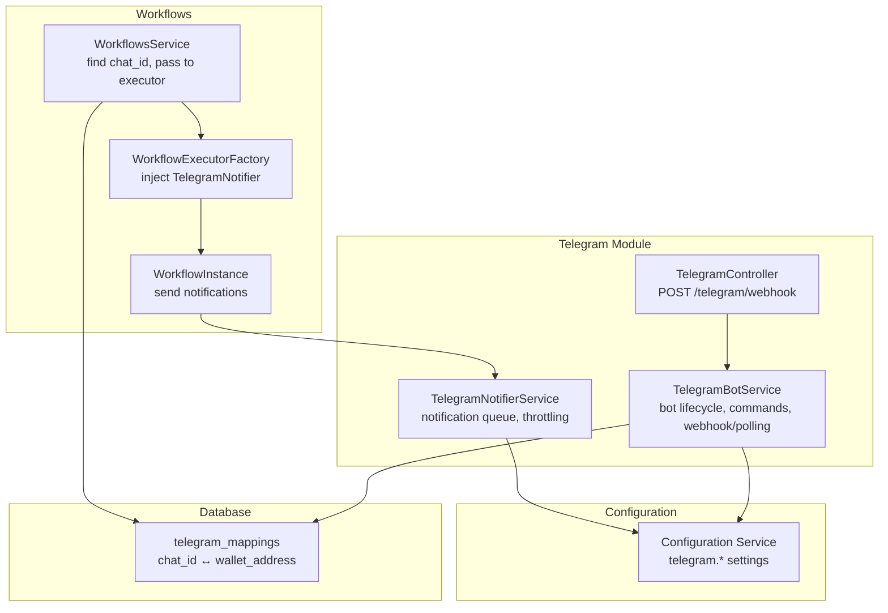
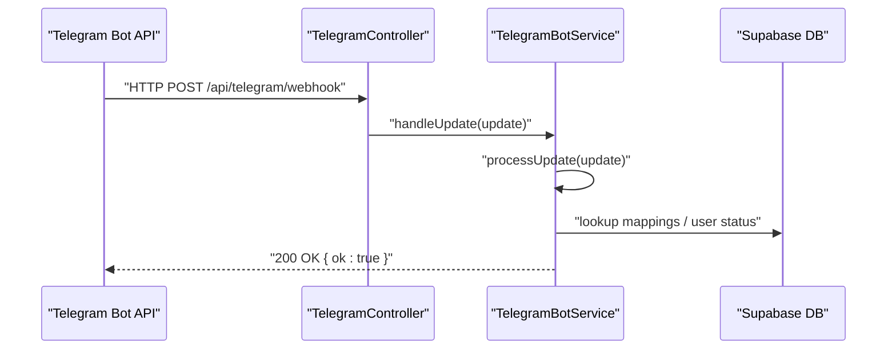
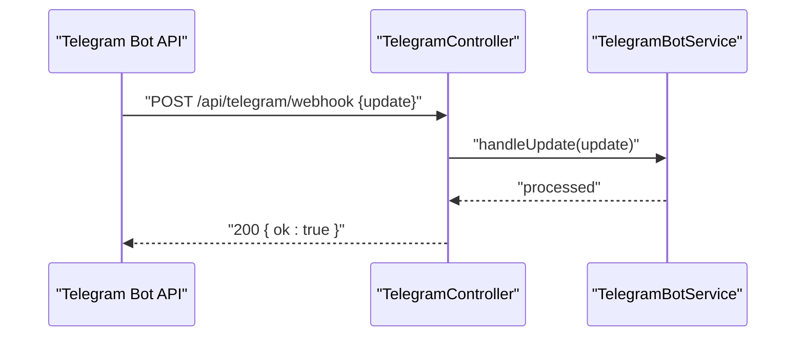
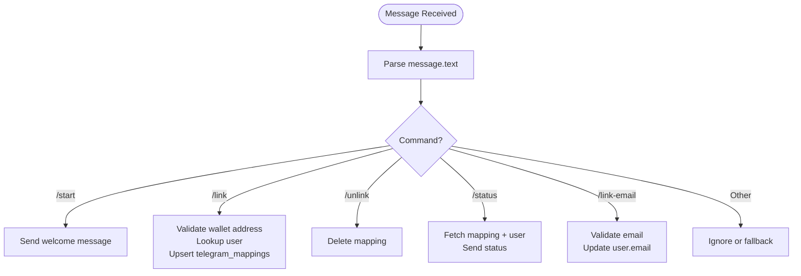
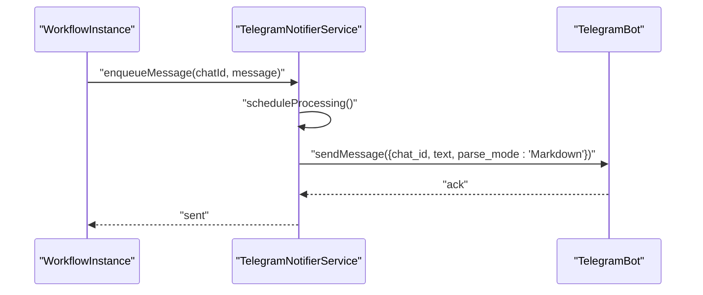
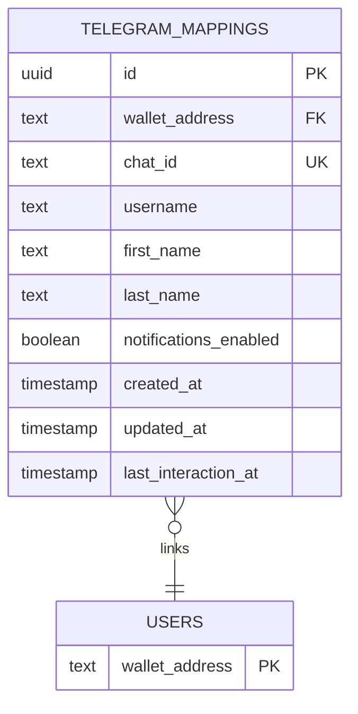
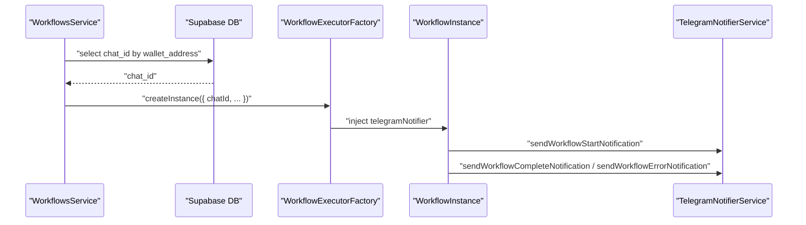
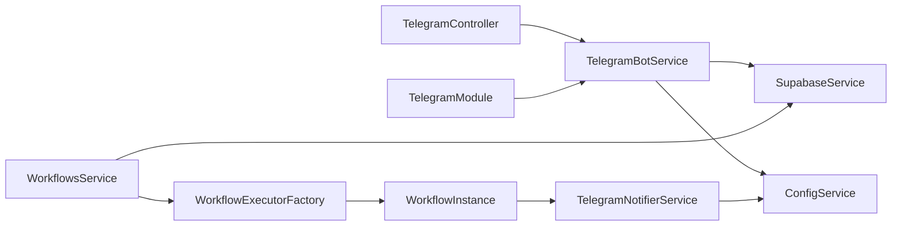

# Telegram API

<cite>
**Referenced Files in This Document**
- [telegram.controller.ts](file://src/telegram/telegram.controller.ts)
- [telegram-bot.service.ts](file://src/telegram/telegram-bot.service.ts)
- [telegram-notifier.service.ts](file://src/telegram/telegram-notifier.service.ts)
- [telegram.module.ts](file://src/telegram/telegram.module.ts)
- [configuration.ts](file://src/config/configuration.ts)
- [initial-1.sql](file://src/database/schema/initial-1.sql)
- [workflows.service.ts](file://src/workflows/workflows.service.ts)
- [workflow-executor.factory.ts](file://src/workflows/workflow-executor.factory.ts)
- [workflow-instance.ts](file://src/workflows/workflow-instance.ts)
- [README.md](file://README.md)
</cite>

## Table of Contents
1. [Introduction](#introduction)
2. [Project Structure](#project-structure)
3. [Core Components](#core-components)
4. [Architecture Overview](#architecture-overview)
5. [Detailed Component Analysis](#detailed-component-analysis)
6. [Dependency Analysis](#dependency-analysis)
7. [Performance Considerations](#performance-considerations)
8. [Troubleshooting Guide](#troubleshooting-guide)
9. [Conclusion](#conclusion)
10. [Appendices](#appendices)

## Introduction
This document provides detailed API documentation for Telegram integration endpoints and services within the backend. It covers:
- POST /api/telegram/webhook for configuring Telegram webhook URLs and event subscription management
- Notification delivery via Telegram bot for workflow execution events
- Configuration and runtime behavior for webhook vs polling modes
- Practical examples for webhook setup, notification scheduling, and user subscription management
- Message formatting with Markdown, rate limiting considerations, and security notes
- Error handling for bot disconnections, invalid chat IDs, and message delivery failures
- Integration patterns with workflow execution notifications and real-time alerts

## Project Structure
The Telegram integration spans three primary modules:
- Telegram controller: exposes the webhook endpoint used by Telegram
- Telegram bot service: manages bot initialization, commands, and webhook/polling startup
- Telegram notifier service: queues and sends formatted notifications to users
- Configuration: environment-driven settings for bot token, webhook URL, and notification enablement
- Database schema: stores Telegram chat-to-wallet mappings
- Workflow integration: fetches chat IDs and triggers notifications during workflow execution

**Diagram sources**
- [telegram.controller.ts:10-30](file://src/telegram/telegram.controller.ts#L10-L30)
- [telegram-bot.service.ts:243-258](file://src/telegram/telegram-bot.service.ts#L243-L258)
- [telegram-notifier.service.ts:14-24](file://src/telegram/telegram-notifier.service.ts#L14-L24)
- [configuration.ts:12-16](file://src/config/configuration.ts#L12-L16)
- [initial-1.sql:66-79](file://src/database/schema/initial-1.sql#L66-L79)
- [workflows.service.ts:132-139](file://src/workflows/workflows.service.ts#L132-L139)
- [workflow-executor.factory.ts:10-28](file://src/workflows/workflow-executor.factory.ts#L10-L28)
- [workflow-instance.ts:102-146](file://src/workflows/workflow-instance.ts#L102-L146)

**Section sources**
- [telegram.controller.ts:10-30](file://src/telegram/telegram.controller.ts#L10-L30)
- [telegram-bot.service.ts:243-258](file://src/telegram/telegram-bot.service.ts#L243-L258)
- [telegram-notifier.service.ts:14-24](file://src/telegram/telegram-notifier.service.ts#L14-L24)
- [configuration.ts:12-16](file://src/config/configuration.ts#L12-L16)
- [initial-1.sql:66-79](file://src/database/schema/initial-1.sql#L66-L79)
- [workflows.service.ts:132-139](file://src/workflows/workflows.service.ts#L132-L139)
- [workflow-executor.factory.ts:10-28](file://src/workflows/workflow-executor.factory.ts#L10-L28)
- [workflow-instance.ts:102-146](file://src/workflows/workflow-instance.ts#L102-L146)

## Core Components
- TelegramController: Exposes POST /api/telegram/webhook for Telegram to deliver updates. The endpoint is intentionally hidden from Swagger UI as it is for Telegram’s internal use only.
- TelegramBotService: Initializes the Telegram bot, registers message handlers for commands (/start, /link, /unlink, /status, /link-email), and starts either webhook mode or long-polling depending on configuration.
- TelegramNotifierService: Queues and sends Telegram notifications with a minimum interval to respect rate limits. Uses Markdown formatting for rich messages.
- Configuration: telegram.botToken, telegram.notifyEnabled, and telegram.webhookUrl control bot behavior and notification delivery.
- Database: telegram_mappings stores chat_id ↔ wallet_address mappings with notification preferences and timestamps.

**Section sources**
- [telegram.controller.ts:10-30](file://src/telegram/telegram.controller.ts#L10-L30)
- [telegram-bot.service.ts:24-43](file://src/telegram/telegram-bot.service.ts#L24-L43)
- [telegram-bot.service.ts:243-258](file://src/telegram/telegram-bot.service.ts#L243-L258)
- [telegram-notifier.service.ts:14-24](file://src/telegram/telegram-notifier.service.ts#L14-L24)
- [configuration.ts:12-16](file://src/config/configuration.ts#L12-L16)
- [initial-1.sql:66-79](file://src/database/schema/initial-1.sql#L66-L79)

## Architecture Overview
The Telegram integration supports two operational modes:
- Webhook mode: The bot registers a webhook URL via Telegram Bot API. Incoming updates are delivered to POST /api/telegram/webhook.
- Polling mode: The bot runs long-polling locally when no webhook URL is configured.

Notifications are queued and sent with a minimum interval to avoid rate limiting. Workflow execution triggers notifications when a user has linked their wallet to a Telegram chat.

**Diagram sources**
- [telegram.controller.ts:27-30](file://src/telegram/telegram.controller.ts#L27-L30)
- [telegram-bot.service.ts:255-258](file://src/telegram/telegram-bot.service.ts#L255-L258)

**Section sources**
- [telegram.controller.ts:10-30](file://src/telegram/telegram.controller.ts#L10-L30)
- [telegram-bot.service.ts:243-258](file://src/telegram/telegram-bot.service.ts#L243-L258)

## Detailed Component Analysis

### Telegram Webhook Endpoint
- Endpoint: POST /api/telegram/webhook
- Purpose: Receives updates from Telegram Bot API when webhook mode is enabled
- Behavior:
  - Accepts raw update payloads
  - Delegates to TelegramBotService.handleUpdate to process updates
  - Returns HTTP 200 with { ok: true }
- Swagger visibility: Hidden from UI (internal endpoint)
- Security: Telegram validates webhook authenticity; no additional signature verification is implemented in this codebase

**Diagram sources**
- [telegram.controller.ts:27-30](file://src/telegram/telegram.controller.ts#L27-L30)
- [telegram-bot.service.ts:255-258](file://src/telegram/telegram-bot.service.ts#L255-L258)

**Section sources**
- [telegram.controller.ts:10-30](file://src/telegram/telegram.controller.ts#L10-L30)
- [telegram-bot.service.ts:243-258](file://src/telegram/telegram-bot.service.ts#L243-L258)

### Telegram Bot Lifecycle and Commands
- Initialization:
  - Reads telegram.botToken from configuration
  - Creates TelegramBot instance and registers message handlers
- Startup modes:
  - If telegram.webhookUrl is set, sets webhook URL via Telegram Bot API
  - Otherwise starts long-polling
- Supported commands:
  - /start: Welcome message and instructions
  - /link <wallet_address>: Links wallet to Telegram chat; validates Solana address format and checks user existence
  - /unlink: Removes the mapping
  - /status: Reports wallet, email, and notification status
  - /link-email <email>: Links email to the user’s wallet

**Diagram sources**
- [telegram-bot.service.ts:24-43](file://src/telegram/telegram-bot.service.ts#L24-L43)
- [telegram-bot.service.ts:65-126](file://src/telegram/telegram-bot.service.ts#L65-L126)
- [telegram-bot.service.ts:128-148](file://src/telegram/telegram-bot.service.ts#L128-L148)
- [telegram-bot.service.ts:150-187](file://src/telegram/telegram-bot.service.ts#L150-L187)
- [telegram-bot.service.ts:197-241](file://src/telegram/telegram-bot.service.ts#L197-L241)

**Section sources**
- [telegram-bot.service.ts:24-43](file://src/telegram/telegram-bot.service.ts#L24-L43)
- [telegram-bot.service.ts:65-126](file://src/telegram/telegram-bot.service.ts#L65-L126)
- [telegram-bot.service.ts:128-148](file://src/telegram/telegram-bot.service.ts#L128-L148)
- [telegram-bot.service.ts:150-187](file://src/telegram/telegram-bot.service.ts#L150-L187)
- [telegram-bot.service.ts:197-241](file://src/telegram/telegram-bot.service.ts#L197-L241)

### Notification Delivery and Formatting
- Queue and throttling:
  - TelegramNotifierService maintains an in-memory queue and a minimum interval between sends
  - Messages are sent with parse_mode Markdown
- Trigger points:
  - Workflow start, completion, and error notifications
  - Optional per-node notifications when node definition enables it
- Message templates:
  - Workflow start: includes workflow name, execution ID, and timestamp
  - Node completion: includes node name, type, and protocol-specific details
  - Workflow completion: success summary
  - Workflow error: includes error message in a code block

**Diagram sources**
- [workflow-instance.ts:102-146](file://src/workflows/workflow-instance.ts#L102-L146)
- [telegram-notifier.service.ts:124-164](file://src/telegram/telegram-notifier.service.ts#L124-L164)

**Section sources**
- [telegram-notifier.service.ts:14-24](file://src/telegram/telegram-notifier.service.ts#L14-L24)
- [telegram-notifier.service.ts:30-113](file://src/telegram/telegram-notifier.service.ts#L30-L113)
- [telegram-notifier.service.ts:124-164](file://src/telegram/telegram-notifier.service.ts#L124-L164)
- [workflow-instance.ts:102-146](file://src/workflows/workflow-instance.ts#L102-L146)

### Database Schema for Subscriptions
- Table: telegram_mappings
  - Fields: id, wallet_address, chat_id (unique), username, first_name, last_name, notifications_enabled, created_at, updated_at, last_interaction_at
  - Foreign key: wallet_address references users(wallet_address)
- Purpose: Associates Telegram chats with user wallets and tracks notification preferences

**Diagram sources**
- [initial-1.sql:66-79](file://src/database/schema/initial-1.sql#L66-L79)

**Section sources**
- [initial-1.sql:66-79](file://src/database/schema/initial-1.sql#L66-L79)

### Integration with Workflow Execution
- WorkflowsService finds the Telegram chat_id for a given wallet address and passes it to the workflow executor
- WorkflowExecutorFactory injects TelegramNotifierService into WorkflowInstance
- WorkflowInstance sends notifications at start, completion, error, and optionally per-node completion

**Diagram sources**
- [workflows.service.ts:132-139](file://src/workflows/workflows.service.ts#L132-L139)
- [workflow-executor.factory.ts:10-28](file://src/workflows/workflow-executor.factory.ts#L10-L28)
- [workflow-instance.ts:102-146](file://src/workflows/workflow-instance.ts#L102-L146)

**Section sources**
- [workflows.service.ts:132-139](file://src/workflows/workflows.service.ts#L132-L139)
- [workflow-executor.factory.ts:10-28](file://src/workflows/workflow-executor.factory.ts#L10-L28)
- [workflow-instance.ts:102-146](file://src/workflows/workflow-instance.ts#L102-L146)

## Dependency Analysis
- TelegramController depends on TelegramBotService
- TelegramBotService depends on ConfigService and SupabaseService
- TelegramNotifierService depends on ConfigService
- TelegramModule initializes TelegramBotService on module init
- WorkflowsService integrates Telegram via telegram_mappings lookup and WorkflowExecutorFactory injection

**Diagram sources**
- [telegram.controller.ts:8](file://src/telegram/telegram.controller.ts#L8)
- [telegram-bot.service.ts:10-22](file://src/telegram/telegram-bot.service.ts#L10-L22)
- [telegram-notifier.service.ts:14-24](file://src/telegram/telegram-notifier.service.ts#L14-L24)
- [telegram.module.ts:12-16](file://src/telegram/telegram.module.ts#L12-L16)
- [workflows.service.ts:132-139](file://src/workflows/workflows.service.ts#L132-L139)
- [workflow-executor.factory.ts:10-28](file://src/workflows/workflow-executor.factory.ts#L10-L28)
- [workflow-instance.ts:102-146](file://src/workflows/workflow-instance.ts#L102-L146)

**Section sources**
- [telegram.controller.ts:8](file://src/telegram/telegram.controller.ts#L8)
- [telegram-bot.service.ts:10-22](file://src/telegram/telegram-bot.service.ts#L10-L22)
- [telegram-notifier.service.ts:14-24](file://src/telegram/telegram-notifier.service.ts#L14-L24)
- [telegram.module.ts:12-16](file://src/telegram/telegram.module.ts#L12-L16)
- [workflows.service.ts:132-139](file://src/workflows/workflows.service.ts#L132-L139)
- [workflow-executor.factory.ts:10-28](file://src/workflows/workflow-executor.factory.ts#L10-L28)
- [workflow-instance.ts:102-146](file://src/workflows/workflow-instance.ts#L102-L146)

## Performance Considerations
- Rate limiting:
  - TelegramNotifierService enforces a minimum interval between sends to reduce rate limit risk
  - Messages are queued and processed sequentially with a scheduled drain
- Throughput:
  - Queue-based delivery prevents bursty traffic to Telegram
  - Consider externalizing the queue (e.g., Redis) for horizontal scaling and persistence
- Latency:
  - Webhook mode reduces latency compared to long-polling
  - Ensure webhookUrl is reachable and TLS-enabled for reliable delivery

[No sources needed since this section provides general guidance]

## Troubleshooting Guide
Common issues and resolutions:
- Telegram bot not responding
  - Verify telegram.botToken is set
  - Confirm startup logs show “✅ Telegram bot started” or “✅ Telegram webhook set”
- Webhook not received
  - Ensure telegram.webhookUrl is set and publicly accessible
  - Check that the endpoint path matches Telegram Bot settings
- Invalid wallet address or user not found
  - /link validates Solana address format and checks user existence
  - Returns user-friendly error messages
- Email linking errors
  - /link-email validates email format and requires prior wallet linkage
- Notification delivery failures
  - TelegramNotifierService logs failures and continues processing
  - Check network connectivity and Telegram API availability
- Workflow notifications not sent
  - Ensure telegram_mappings exists for the wallet
  - Confirm telegram.notifyEnabled is true

**Section sources**
- [telegram-bot.service.ts:67-72](file://src/telegram/telegram-bot.service.ts#L67-L72)
- [telegram-bot.service.ts:81-87](file://src/telegram/telegram-bot.service.ts#L81-L87)
- [telegram-notifier.service.ts:156-158](file://src/telegram/telegram-notifier.service.ts#L156-L158)
- [README.md:294-296](file://README.md#L294-L296)

## Conclusion
The Telegram integration provides a robust foundation for real-time notifications and user subscription management:
- Webhook mode enables efficient, low-latency update delivery
- Command-driven user onboarding and status management
- Structured notification templates with Markdown formatting
- Seamless integration with workflow execution lifecycle
Future enhancements could include webhook signature verification, externalized queues, and richer formatting options.

[No sources needed since this section summarizes without analyzing specific files]

## Appendices

### API Definitions

- POST /api/telegram/webhook
  - Description: Internal endpoint for Telegram webhook updates
  - Request body: Raw Telegram update object
  - Response: 200 OK with { ok: true }
  - Notes: Hidden from Swagger UI; used by Telegram Bot API

- GET /api/telegram/status
  - Description: Not implemented in the current codebase
  - Availability: Not present in controller or services

- POST /api/telegram/notify
  - Description: Not implemented in the current codebase
  - Availability: No endpoint exists for manual notifications

**Section sources**
- [telegram.controller.ts:10-30](file://src/telegram/telegram.controller.ts#L10-L30)
- [README.md:157-169](file://README.md#L157-L169)

### Environment Variables
- TELEGRAM_BOT_TOKEN: Telegram bot token
- TELEGRAM_NOTIFY_ENABLED: Enable/disable notifications
- TELEGRAM_WEBHOOK_URL: Publicly accessible URL for Telegram webhook

**Section sources**
- [configuration.ts:12-16](file://src/config/configuration.ts#L12-L16)
- [README.md:78-82](file://README.md#L78-L82)

### Practical Examples

- Webhook Setup
  - Set TELEGRAM_WEBHOOK_URL to a publicly accessible HTTPS endpoint
  - Ensure the endpoint path matches Telegram Bot settings
  - Restart the service to apply changes

- Notification Scheduling
  - Enable telegram.notifyEnabled
  - Link a wallet to a Telegram chat using /link
  - Trigger a workflow; notifications will be sent automatically

- User Subscription Management
  - Use /start to initiate the bot
  - Use /link <wallet_address> to link a wallet
  - Use /unlink to remove the mapping
  - Use /status to check current status

**Section sources**
- [telegram-bot.service.ts:24-43](file://src/telegram/telegram-bot.service.ts#L24-L43)
- [telegram-bot.service.ts:65-126](file://src/telegram/telegram-bot.service.ts#L65-L126)
- [telegram-bot.service.ts:128-148](file://src/telegram/telegram-bot.service.ts#L128-L148)
- [telegram-bot.service.ts:150-187](file://src/telegram/telegram-bot.service.ts#L150-L187)
- [README.md:157-169](file://README.md#L157-L169)

### Message Formatting and Rate Limits
- Formatting:
  - parse_mode is Markdown for most notifications
  - Use bold markers and code blocks for readability
- Rate limits:
  - Minimum interval enforced by TelegramNotifierService
  - Consider external queuing for high-volume scenarios

**Section sources**
- [telegram-notifier.service.ts:124-164](file://src/telegram/telegram-notifier.service.ts#L124-L164)

### Security Considerations
- Webhook authenticity:
  - Telegram validates webhook requests; no additional signature verification is implemented in this codebase
- Access control:
  - The webhook endpoint is internal-only and not exposed in Swagger UI
- Secrets:
  - Store TELEGRAM_BOT_TOKEN securely in environment variables

**Section sources**
- [telegram.controller.ts:11](file://src/telegram/telegram.controller.ts#L11)
- [README.md:262-268](file://README.md#L262-L268)