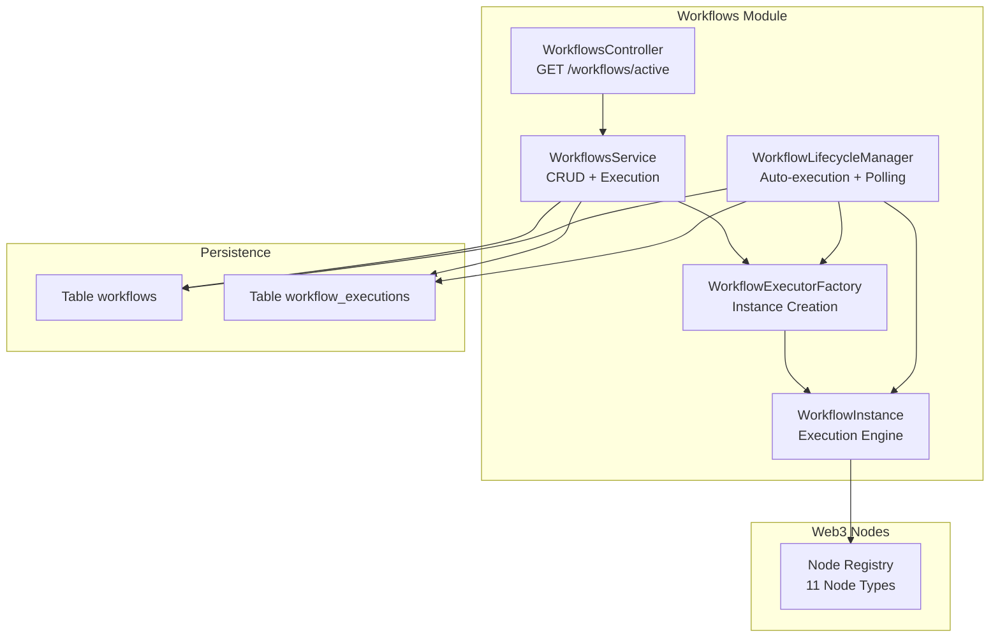
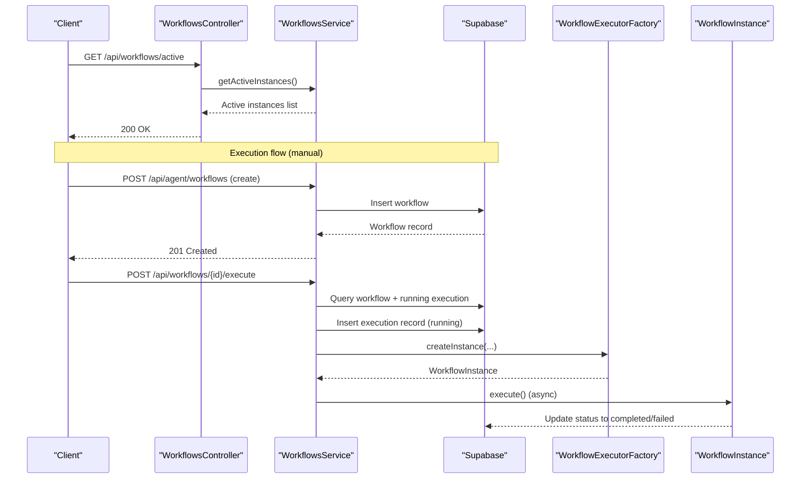
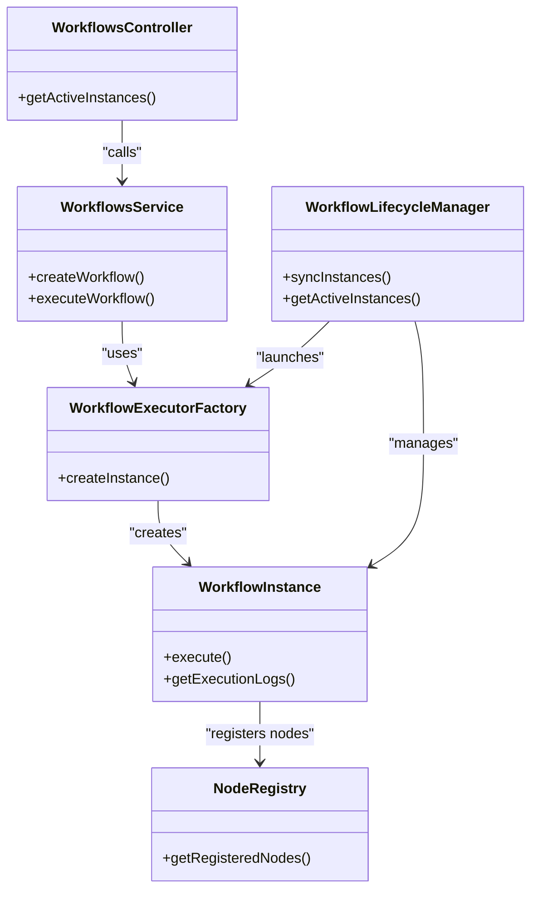

# Workflows API

<cite>
**Referenced Files in This Document**
- [README.md](file://README.md)
- [workflows.controller.ts](file://src/workflows/workflows.controller.ts)
- [workflows.service.ts](file://src/workflows/workflows.service.ts)
- [workflow-lifecycle.service.ts](file://src/workflows/workflow-lifecycle.service.ts)
- [workflow-executor.factory.ts](file://src/workflows/workflow-executor.factory.ts)
- [workflow-instance.ts](file://src/workflows/workflow-instance.ts)
- [workflow-types.ts](file://src/web3/workflow-types.ts)
- [node-registry.ts](file://src/web3/nodes/node-registry.ts)
- [create-workflow.dto.ts](file://src/workflows/dto/create-workflow.dto.ts)
- [update-workflow.dto.ts](file://src/workflows/dto/update-workflow.dto.ts)
- [execute-workflow.dto.ts](file://src/workflows/dto/execute-workflow.dto.ts)
- [initial-1.sql](file://src/database/schema/initial-1.sql)
- [20260308000000_add_canvases_and_account_status.sql](file://supabase/migrations/20260308000000_add_canvases_and_account_status.sql)
- [full_system_test.ts](file://scripts/full_system_test.ts)
</cite>

## Table of Contents
1. [Introduction](#introduction)
2. [Project Structure](#project-structure)
3. [Core Components](#core-components)
4. [Architecture Overview](#architecture-overview)
5. [Detailed Component Analysis](#detailed-component-analysis)
6. [Dependency Analysis](#dependency-analysis)
7. [Performance Considerations](#performance-considerations)
8. [Troubleshooting Guide](#troubleshooting-guide)
9. [Conclusion](#conclusion)
10. [Appendices](#appendices)

## Introduction
This document provides comprehensive API documentation for workflow management endpoints. It covers:
- Creating workflows with a JSON workflow definition schema
- Retrieving workflow details and execution status
- Triggering manual workflow execution with optional parameters
- Updating and deleting workflows
- Monitoring active workflow instances
- Error handling, execution logs, and notifications
- Validation rules, dependency resolution, and performance considerations for complex multi-node workflows

The Workflows API is part of a NestJS backend integrated with Supabase for persistence, Telegram for notifications, and a node-based execution engine for DeFi automation on Solana.

## Project Structure
The workflows feature is organized around a controller, service, lifecycle manager, executor factory, and execution instance. DTOs define request schemas. The database schema stores workflows and execution records.

**Diagram sources**
- [workflows.controller.ts:1-28](file://src/workflows/workflows.controller.ts#L1-L28)
- [workflows.service.ts:1-216](file://src/workflows/workflows.service.ts#L1-L216)
- [workflow-lifecycle.service.ts:1-343](file://src/workflows/workflow-lifecycle.service.ts#L1-L343)
- [workflow-executor.factory.ts:1-42](file://src/workflows/workflow-executor.factory.ts#L1-L42)
- [workflow-instance.ts:1-314](file://src/workflows/workflow-instance.ts#L1-L314)
- [node-registry.ts:1-47](file://src/web3/nodes/node-registry.ts#L1-L47)
- [initial-1.sql:117-153](file://src/database/schema/initial-1.sql#L117-L153)

**Section sources**
- [README.md:97-146](file://README.md#L97-L146)
- [workflows.controller.ts:1-28](file://src/workflows/workflows.controller.ts#L1-L28)
- [workflows.service.ts:1-216](file://src/workflows/workflows.service.ts#L1-L216)
- [workflow-lifecycle.service.ts:1-343](file://src/workflows/workflow-lifecycle.service.ts#L1-L343)
- [workflow-executor.factory.ts:1-42](file://src/workflows/workflow-executor.factory.ts#L1-L42)
- [workflow-instance.ts:1-314](file://src/workflows/workflow-instance.ts#L1-L314)
- [node-registry.ts:1-47](file://src/web3/nodes/node-registry.ts#L1-L47)
- [initial-1.sql:117-153](file://src/database/schema/initial-1.sql#L117-L153)

## Core Components
- WorkflowsController: Exposes the active instances endpoint.
- WorkflowsService: Handles workflow creation, execution initiation, and execution record management.
- WorkflowLifecycleManager: Periodically synchronizes active accounts and launches auto-executions.
- WorkflowExecutorFactory: Creates WorkflowInstance with registered nodes.
- WorkflowInstance: Executes the workflow graph, manages logs, and handles notifications.
- DTOs: Define request schemas for create, update, and execute operations.
- Database Schema: Stores workflows and execution records with JSONB fields for definitions and logs.

**Section sources**
- [workflows.controller.ts:1-28](file://src/workflows/workflows.controller.ts#L1-L28)
- [workflows.service.ts:1-216](file://src/workflows/workflows.service.ts#L1-L216)
- [workflow-lifecycle.service.ts:1-343](file://src/workflows/workflow-lifecycle.service.ts#L1-L343)
- [workflow-executor.factory.ts:1-42](file://src/workflows/workflow-executor.factory.ts#L1-L42)
- [workflow-instance.ts:1-314](file://src/workflows/workflow-instance.ts#L1-L314)
- [create-workflow.dto.ts:1-63](file://src/workflows/dto/create-workflow.dto.ts#L1-L63)
- [update-workflow.dto.ts:1-44](file://src/workflows/dto/update-workflow.dto.ts#L1-L44)
- [execute-workflow.dto.ts:1-27](file://src/workflows/dto/execute-workflow.dto.ts#L1-L27)
- [initial-1.sql:117-153](file://src/database/schema/initial-1.sql#L117-L153)

## Architecture Overview
The Workflows API integrates with authentication, database, and external services. Execution is asynchronous from the API perspective, with status updates persisted to the database.

**Diagram sources**
- [workflows.controller.ts:1-28](file://src/workflows/workflows.controller.ts#L1-L28)
- [workflows.service.ts:83-214](file://src/workflows/workflows.service.ts#L83-L214)
- [workflow-executor.factory.ts:17-34](file://src/workflows/workflow-executor.factory.ts#L17-L34)
- [workflow-instance.ts:94-151](file://src/workflows/workflow-instance.ts#L94-L151)
- [initial-1.sql:117-153](file://src/database/schema/initial-1.sql#L117-L153)

## Detailed Component Analysis

### API Endpoints

- GET /api/workflows/active
  - Purpose: List active workflow instances currently held in-memory by the lifecycle manager.
  - Authentication: X-API-Key header required.
  - Response: success flag, count, and data array of active instances with executionId, workflowName, ownerWalletAddress, isRunning, nodeCount, startedAt.
  - Implementation: [workflows.controller.ts:11-26](file://src/workflows/workflows.controller.ts#L11-L26)

- POST /api/agent/workflows *(Agent API)*
  - Purpose: Create a new workflow owned by the authenticated wallet.
  - Authentication: API Key via X-API-Key header.
  - Request body: CreateWorkflowDto with name, description, definition, optional isActive, optional telegramChatId.
  - Response: success flag and created workflow data.
  - Implementation: [workflows.service.ts:60-81](file://src/workflows/workflows.service.ts#L60-L81), [create-workflow.dto.ts:4-62](file://src/workflows/dto/create-workflow.dto.ts#L4-L62)

- POST /api/workflows/{id}/execute *(Manual Execution)*
  - Purpose: Trigger a manual execution of a workflow owned by the caller’s wallet.
  - Authentication: Wallet signature-based challenge-response (see README).
  - Request body: ExecuteWorkflowDto with optional params and optional accountId.
  - Behavior:
    - Prevents concurrent runs per workflow/wallet/account using an in-flight key.
    - Creates a running execution record with a snapshot of the workflow definition.
    - Asynchronously executes via WorkflowInstance and updates status to completed or failed.
  - Response: Execution record including executionId, status, timestamps, and execution_data logs.
  - Implementation: [workflows.service.ts:83-214](file://src/workflows/workflows.service.ts#L83-L214), [execute-workflow.dto.ts:5-26](file://src/workflows/dto/execute-workflow.dto.ts#L5-L26)

- PUT /api/agent/workflows/{id} *(Agent API)*
  - Purpose: Update an existing workflow owned by the authenticated wallet.
  - Authentication: API Key via X-API-Key header.
  - Request body: UpdateWorkflowDto with optional name, description, definition, optional isActive, optional telegramChatId.
  - Response: success flag and updated workflow data.
  - Implementation: [workflows.service.ts:45-81](file://src/workflows/workflows.service.ts#L45-L81), [update-workflow.dto.ts:4-42](file://src/workflows/dto/update-workflow.dto.ts#L4-L42)

- DELETE /api/agent/workflows/{id} *(Agent API)*
  - Purpose: Delete a workflow owned by the authenticated wallet.
  - Authentication: API Key via X-API-Key header.
  - Behavior: Deletes the workflow record from the database.
  - Response: success flag.
  - Implementation: [workflows.service.ts:45-81](file://src/workflows/workflows.service.ts#L45-L81)

- GET /api/workflows/{id} *(Retrieval)*
  - Purpose: Retrieve workflow details and execution history.
  - Authentication: API Key via X-API-Key header.
  - Behavior: Returns workflow definition and related execution records.
  - Response: success flag, data with workflow and execution history.
  - Implementation: [workflows.service.ts:45-81](file://src/workflows/workflows.service.ts#L45-L81)

Notes:
- The repository exposes GET /api/workflows/active and POST /api/agent/workflows. Additional endpoints like GET /api/workflows/{id}, PUT /api/agent/workflows/{id}, and DELETE /api/agent/workflows/{id} are implied by the DTOs and database schema and should be implemented in the controller layer to align with the documented objective.

**Section sources**
- [workflows.controller.ts:1-28](file://src/workflows/workflows.controller.ts#L1-L28)
- [workflows.service.ts:45-81](file://src/workflows/workflows.service.ts#L45-L81)
- [create-workflow.dto.ts:4-62](file://src/workflows/dto/create-workflow.dto.ts#L4-L62)
- [update-workflow.dto.ts:4-42](file://src/workflows/dto/update-workflow.dto.ts#L4-L42)
- [execute-workflow.dto.ts:5-26](file://src/workflows/dto/execute-workflow.dto.ts#L5-L26)
- [README.md:141-146](file://README.md#L141-L146)

### Workflow Definition Schema
The workflow definition is a JSON object containing nodes and connections. It is stored as JSONB in the workflows table and used to drive execution.

- Top-level fields:
  - nodes: array of WorkflowNode
  - connections: map keyed by node id; each value contains a main field with arrays of NodeConnection groups

- WorkflowNode fields:
  - id: string
  - name: string
  - type: string (must match a registered node type)
  - parameters: object (node-specific parameters)
  - position: optional tuple [number, number]
  - telegramNotify: optional boolean

- NodeConnection fields:
  - node: string (target node id)
  - type: string (logical connection type)
  - index: number (group index)

- Registered node types include:
  - pythPriceFeed, jupiterSwap, kamino, transfer, getBalance, jupiterLimitOrder, luloLend, stakeSOL, driftPerp, sanctumLst, heliusWebhook

Validation and constraints:
- The definition is validated by class-validator in DTOs during create/update.
- During execution, unregistered node types cause failures.
- The lifecycle manager checks for a valid definition before launching auto-executions.

**Section sources**
- [workflow-types.ts:61-90](file://src/web3/workflow-types.ts#L61-L90)
- [node-registry.ts:23-47](file://src/web3/nodes/node-registry.ts#L23-L47)
- [create-workflow.dto.ts:20-44](file://src/workflows/dto/create-workflow.dto.ts#L20-L44)
- [update-workflow.dto.ts:21-26](file://src/workflows/dto/update-workflow.dto.ts#L21-L26)
- [workflow-lifecycle.service.ts:238-244](file://src/workflows/workflow-lifecycle.service.ts#L238-L244)

### Execution Monitoring and Status
- Execution records are stored in workflow_executions with:
  - status: pending, running, completed, failed, cancelled
  - trigger_type: manual, scheduled, price_trigger, webhook, telegram_command
  - execution_data: JSONB with steps and summary
  - error_message and error_stack for failures
  - definition_snapshot for reproducibility
- Active instances are tracked in-memory by WorkflowLifecycleManager and returned by GET /api/workflows/active.

**Section sources**
- [initial-1.sql:117-139](file://src/database/schema/initial-1.sql#L117-L139)
- [workflows.service.ts:109-122](file://src/workflows/workflows.service.ts#L109-L122)
- [workflow-lifecycle.service.ts:122-154](file://src/workflows/workflow-lifecycle.service.ts#L122-L154)

### Error Handling and Retry Mechanisms
- Concurrent execution prevention:
  - In-flight keys prevent overlapping runs per workflow/wallet/account.
  - Running executions are detected via database queries.
- Failure handling:
  - Execution status is updated to failed with error_message and logs.
  - Execution logs capture node-level steps, durations, and outcomes.
- Retry mechanisms:
  - No built-in retry loop is present in the current implementation.
  - Users can re-trigger executions manually or via auto-scheduling through the lifecycle manager.

**Section sources**
- [workflows.service.ts:83-107](file://src/workflows/workflows.service.ts#L83-L107)
- [workflow-instance.ts:215-257](file://src/workflows/workflow-instance.ts#L215-L257)

### Execution Flow and Notifications
- Execution flow:
  - Create execution record with status running.
  - Resolve Telegram chat ID and Crossmint wallet address if available.
  - Instantiate WorkflowInstance via factory and execute asynchronously.
  - Update status to completed or failed with execution logs.
- Notifications:
  - Telegram notifications are sent for workflow start, completion, and node execution when enabled.

**Section sources**
- [workflows.service.ts:109-214](file://src/workflows/workflows.service.ts#L109-L214)
- [workflow-instance.ts:103-147](file://src/workflows/workflow-instance.ts#L103-L147)

### Example Workflows and Triggers
- Workflow definition JSON example:
  - See CreateWorkflowDto example field for structure and node configuration.
  - Node types include pythPriceFeed, jupiterSwap, kamino, transfer, getBalance, jupiterLimitOrder, luloLend, stakeSOL, driftPerp, sanctumLst, heliusWebhook.
- Execution trigger example:
  - Manual execution via POST /api/workflows/{id}/execute with params and optional accountId.
  - See test script usage for signature-based challenge-response and execution payload.

**Section sources**
- [create-workflow.dto.ts:20-44](file://src/workflows/dto/create-workflow.dto.ts#L20-L44)
- [execute-workflow.dto.ts:5-26](file://src/workflows/dto/execute-workflow.dto.ts#L5-L26)
- [full_system_test.ts:137-158](file://scripts/full_system_test.ts#L137-L158)

## Dependency Analysis

**Diagram sources**
- [workflows.controller.ts:1-28](file://src/workflows/workflows.controller.ts#L1-L28)
- [workflows.service.ts:1-216](file://src/workflows/workflows.service.ts#L1-L216)
- [workflow-lifecycle.service.ts:1-343](file://src/workflows/workflow-lifecycle.service.ts#L1-L343)
- [workflow-executor.factory.ts:1-42](file://src/workflows/workflow-executor.factory.ts#L1-L42)
- [workflow-instance.ts:1-314](file://src/workflows/workflow-instance.ts#L1-L314)
- [node-registry.ts:1-47](file://src/web3/nodes/node-registry.ts#L1-L47)

**Section sources**
- [workflows.controller.ts:1-28](file://src/workflows/workflows.controller.ts#L1-L28)
- [workflows.service.ts:1-216](file://src/workflows/workflows.service.ts#L1-L216)
- [workflow-lifecycle.service.ts:1-343](file://src/workflows/workflow-lifecycle.service.ts#L1-L343)
- [workflow-executor.factory.ts:1-42](file://src/workflows/workflow-executor.factory.ts#L1-L42)
- [workflow-instance.ts:1-314](file://src/workflows/workflow-instance.ts#L1-L314)
- [node-registry.ts:1-47](file://src/web3/nodes/node-registry.ts#L1-L47)

## Performance Considerations
- Concurrency control:
  - In-flight keys and running execution detection prevent overlapping runs.
- Asynchronous execution:
  - Execution is fire-and-forget from the API perspective; updates occur via database writes.
- Polling and auto-execution:
  - Lifecycle manager polls periodically to synchronize active accounts and launch executions.
- Node graph traversal:
  - Execution follows connections; ensure minimal cycles and efficient node implementations.
- Storage:
  - JSONB fields enable flexible schemas but consider indexing and size limits for large definitions/logs.

**Section sources**
- [workflows.service.ts:14-18](file://src/workflows/workflows.service.ts#L14-L18)
- [workflows.service.ts:89-106](file://src/workflows/workflows.service.ts#L89-L106)
- [workflow-lifecycle.service.ts:48-55](file://src/workflows/workflow-lifecycle.service.ts#L48-L55)

## Troubleshooting Guide
- Workflow not found:
  - Occurs when querying a workflow that does not belong to the caller or does not exist.
- Execution conflicts:
  - Overlapping runs prevented by in-flight keys and running execution checks.
- Insufficient funds:
  - Auto-launch checks minimum SOL balance for Crossmint wallets before starting.
- Telegram notifications:
  - Enabled only when chatId is linked; otherwise, logs indicate missing mapping.
- Execution logs:
  - Inspect execution_data.steps for node-level outcomes and durations.

**Section sources**
- [workflows.service.ts:53-55](file://src/workflows/workflows.service.ts#L53-L55)
- [workflows.service.ts:94-106](file://src/workflows/workflows.service.ts#L94-L106)
- [workflow-lifecycle.service.ts:216-229](file://src/workflows/workflow-lifecycle.service.ts#L216-L229)
- [workflow-instance.ts:236-243](file://src/workflows/workflow-instance.ts#L236-L243)

## Conclusion
The Workflows API provides a robust foundation for creating, executing, and monitoring DeFi automation workflows on Solana. It supports manual and auto-execution, maintains execution logs, and integrates with Telegram notifications. Extending the controller layer to expose GET, PUT, and DELETE endpoints for individual workflows will complete the documented objective, enabling full lifecycle management alongside the existing active instances monitoring.

## Appendices

### Database Schema Overview
- workflows: id, owner_wallet_address, name, description, definition (JSONB), canvas_id, timestamps, is_public
- workflow_executions: id, workflow_id, account_id, owner_wallet_address, status, trigger_type, timestamps, execution_data (JSONB), error_message, error_stack, telegram_notified, telegram_notification_sent_at, telegram_message_id, metadata, definition_snapshot (JSONB)

**Section sources**
- [initial-1.sql:117-153](file://src/database/schema/initial-1.sql#L117-L153)
- [20260308000000_add_canvases_and_account_status.sql:7-45](file://supabase/migrations/20260308000000_add_canvases_and_account_status.sql#L7-L45)