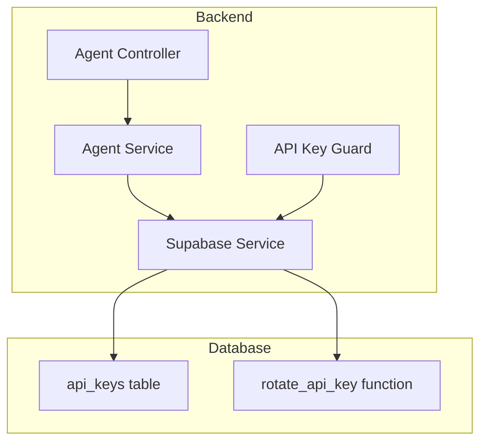
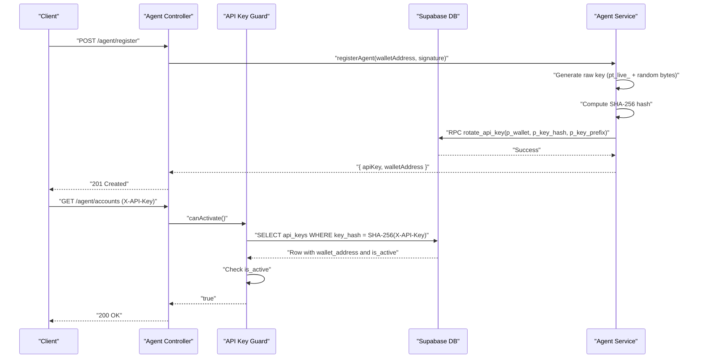
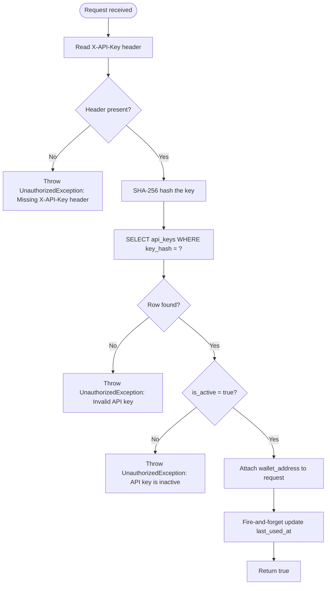
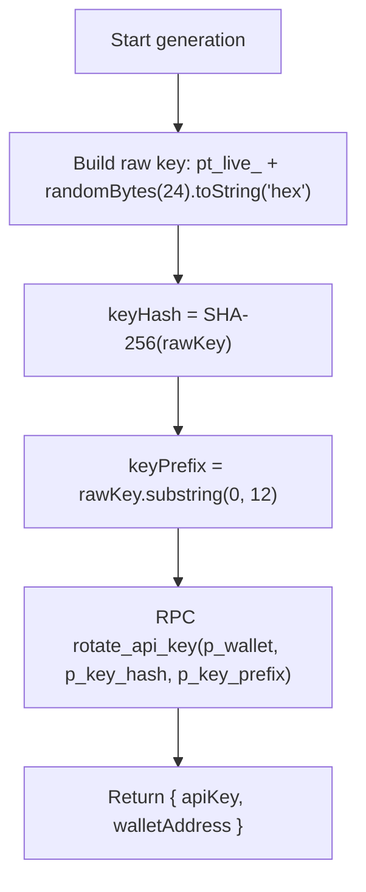
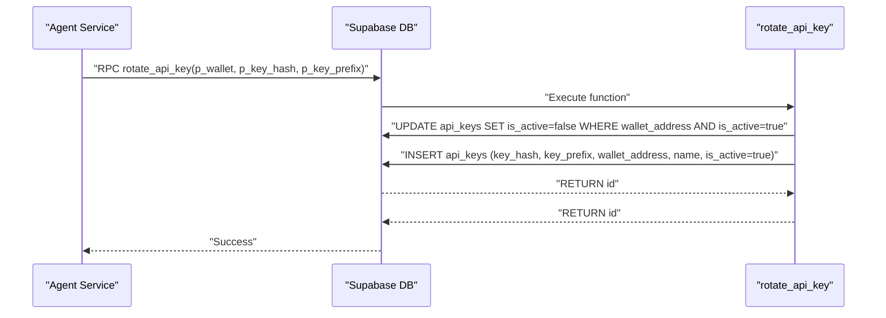
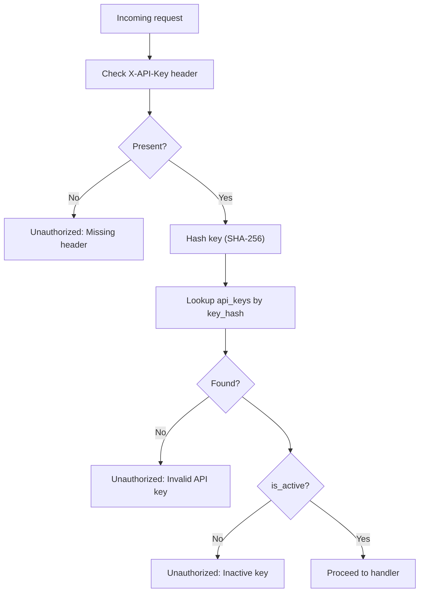
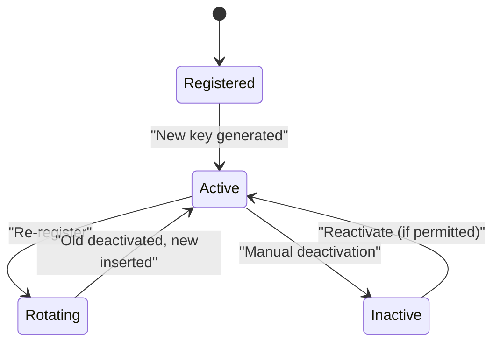
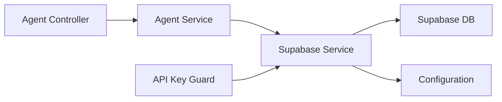

# API Key System and Security

<cite>
**Referenced Files in This Document**
- [api-key.guard.ts](file://src/common/guards/api-key.guard.ts)
- [agent.service.ts](file://src/agent/agent.service.ts)
- [agent.controller.ts](file://src/agent/agent.controller.ts)
- [supabase.service.ts](file://src/database/supabase.service.ts)
- [configuration.ts](file://src/config/configuration.ts)
- [20260218000000_add_agent_api_keys.sql](file://supabase/migrations/20260218000000_add_agent_api_keys.sql)
- [20260218010000_add_rotate_api_key_function.sql](file://supabase/migrations/20260218010000_add_rotate_api_key_function.sql)
- [SKILL.md](file://SKILL.md)
- [http-exception.filter.ts](file://src/common/filters/http-exception.filter.ts)
- [config.toml](file://supabase/config.toml)
</cite>

## Table of Contents
1. [Introduction](#introduction)
2. [Project Structure](#project-structure)
3. [Core Components](#core-components)
4. [Architecture Overview](#architecture-overview)
5. [Detailed Component Analysis](#detailed-component-analysis)
6. [Dependency Analysis](#dependency-analysis)
7. [Performance Considerations](#performance-considerations)
8. [Troubleshooting Guide](#troubleshooting-guide)
9. [Conclusion](#conclusion)
10. [Appendices](#appendices)

## Introduction
This document explains the API key system and security mechanisms for programmatic access control and authentication. It covers:
- Secure API key generation with strong randomness and SHA-256 hashing
- Key prefix management and storage
- Atomic key rotation via a PostgreSQL function ensuring transaction safety
- API key guard implementation, request header validation, and unauthorized access handling
- Concrete examples of API key structure (pt_live_ prefix), validation workflows, and security best practices
- Lifecycle management, rotation strategies, rate limiting considerations, and secure key distribution patterns
- Troubleshooting guidance and security audit recommendations

## Project Structure
The API key system spans the backend application and the Supabase database:
- Backend components:
  - Guard validates incoming requests and enforces API key authentication
  - Agent service generates keys, hashes them, and rotates them atomically
  - Supabase service provides database connectivity and RLS context
  - Agent controller exposes endpoints protected by the API key guard
- Database components:
  - Migration defines the api_keys table and indexes
  - Migration defines the rotate_api_key function for atomic rotation

**Diagram sources**
- [agent.controller.ts:30-50](file://src/agent/agent.controller.ts#L30-L50)
- [agent.service.ts:15-59](file://src/agent/agent.service.ts#L15-L59)
- [api-key.guard.ts:11-54](file://src/common/guards/api-key.guard.ts#L11-L54)
- [supabase.service.ts:29-40](file://src/database/supabase.service.ts#L29-L40)
- [20260218000000_add_agent_api_keys.sql:6-26](file://supabase/migrations/20260218000000_add_agent_api_keys.sql#L6-L26)
- [20260218010000_add_rotate_api_key_function.sql:1-26](file://supabase/migrations/20260218010000_add_rotate_api_key_function.sql#L1-L26)

**Section sources**
- [agent.controller.ts:30-50](file://src/agent/agent.controller.ts#L30-L50)
- [agent.service.ts:15-59](file://src/agent/agent.service.ts#L15-L59)
- [api-key.guard.ts:11-54](file://src/common/guards/api-key.guard.ts#L11-L54)
- [supabase.service.ts:29-40](file://src/database/supabase.service.ts#L29-L40)
- [20260218000000_add_agent_api_keys.sql:6-26](file://supabase/migrations/20260218000000_add_agent_api_keys.sql#L6-L26)
- [20260218010000_add_rotate_api_key_function.sql:1-26](file://supabase/migrations/20260218010000_add_rotate_api_key_function.sql#L1-L26)

## Core Components
- API Key Guard: Extracts the X-API-Key header, computes SHA-256 hash, queries the api_keys table, checks activation status, attaches the associated wallet address to the request, and asynchronously updates last_used_at.
- Agent Service: Generates a random API key with the pt_live_ prefix, computes the SHA-256 hash, extracts a short prefix, and performs atomic rotation via the rotate_api_key function.
- Supabase Service: Initializes the Supabase client with service credentials and provides helpers for RLS context.
- Database Schema: Defines the api_keys table with unique key_hash, partial unique index enforcing one active key per wallet, and RLS policies.
- Rotation Function: Updates all active keys to inactive and inserts a new active key in a single transaction-safe operation.

**Section sources**
- [api-key.guard.ts:11-54](file://src/common/guards/api-key.guard.ts#L11-L54)
- [agent.service.ts:38-59](file://src/agent/agent.service.ts#L38-L59)
- [supabase.service.ts:11-40](file://src/database/supabase.service.ts#L11-L40)
- [20260218000000_add_agent_api_keys.sql:6-26](file://supabase/migrations/20260218000000_add_agent_api_keys.sql#L6-L26)
- [20260218010000_add_rotate_api_key_function.sql:1-26](file://supabase/migrations/20260218010000_add_rotate_api_key_function.sql#L1-L26)

## Architecture Overview
The system enforces API key authentication at the controller layer using a guard. Keys are stored as SHA-256 hashes in the database with the original plaintext returned only once during registration. Rotation is atomic and safe against concurrent races.

**Diagram sources**
- [agent.controller.ts:30-50](file://src/agent/agent.controller.ts#L30-L50)
- [agent.service.ts:38-59](file://src/agent/agent.service.ts#L38-L59)
- [api-key.guard.ts:11-54](file://src/common/guards/api-key.guard.ts#L11-L54)
- [20260218010000_add_rotate_api_key_function.sql:1-26](file://supabase/migrations/20260218010000_add_rotate_api_key_function.sql#L1-L26)

## Detailed Component Analysis

### API Key Guard Implementation
Responsibilities:
- Extract X-API-Key from the request header
- Compute SHA-256 hash of the provided key
- Query the api_keys table for a matching key_hash
- Reject missing or invalid headers, inactive keys, or missing records
- Attach the associated wallet_address to the request context
- Fire-and-forget update of last_used_at

Behavioral notes:
- Uses crypto.createHash("sha256") for deterministic hashing
- Single-row selection ensures exact match
- Asynchronous update of last_used_at avoids blocking the request path

**Diagram sources**
- [api-key.guard.ts:11-54](file://src/common/guards/api-key.guard.ts#L11-L54)

**Section sources**
- [api-key.guard.ts:11-54](file://src/common/guards/api-key.guard.ts#L11-L54)

### API Key Generation and Storage
Generation process:
- Construct raw key with the pt_live_ prefix followed by 24 random bytes encoded as hex
- Compute SHA-256 hash of the raw key for database storage
- Extract a short key_prefix (first 12 characters) for indexing and display hints
- Rotate atomically via rotate_api_key RPC

Storage model:
- api_keys table stores key_hash (unique), key_prefix, wallet_address, is_active, timestamps
- Unique index on key_hash
- Partial unique index ensuring a single active key per wallet_address
- Row Level Security enabled and restricted to service_role

**Diagram sources**
- [agent.service.ts:38-59](file://src/agent/agent.service.ts#L38-L59)
- [20260218000000_add_agent_api_keys.sql:6-26](file://supabase/migrations/20260218000000_add_agent_api_keys.sql#L6-L26)
- [20260218010000_add_rotate_api_key_function.sql:1-26](file://supabase/migrations/20260218010000_add_rotate_api_key_function.sql#L1-L26)

**Section sources**
- [agent.service.ts:38-59](file://src/agent/agent.service.ts#L38-L59)
- [20260218000000_add_agent_api_keys.sql:6-26](file://supabase/migrations/20260218000000_add_agent_api_keys.sql#L6-L26)
- [20260218010000_add_rotate_api_key_function.sql:1-26](file://supabase/migrations/20260218010000_add_rotate_api_key_function.sql#L1-L26)

### Atomic Key Rotation Mechanism
The rotate_api_key function ensures:
- Deactivates all currently active keys for the given wallet_address
- Inserts a new key with is_active = true
- Returns the new key's id
- Runs inside a single transaction to prevent race conditions

**Diagram sources**
- [agent.service.ts:44-49](file://src/agent/agent.service.ts#L44-L49)
- [20260218010000_add_rotate_api_key_function.sql:1-26](file://supabase/migrations/20260218010000_add_rotate_api_key_function.sql#L1-L26)

**Section sources**
- [agent.service.ts:44-49](file://src/agent/agent.service.ts#L44-L49)
- [20260218010000_add_rotate_api_key_function.sql:1-26](file://supabase/migrations/20260218010000_add_rotate_api_key_function.sql#L1-L26)

### Request Header Validation and Unauthorized Handling
- Header requirement: X-API-Key is mandatory for protected routes
- Validation steps: presence check, SHA-256 computation, database lookup, activation status check
- Unauthorized exceptions: Missing header, invalid key, inactive key
- Logging: Guard logs warnings for failed last_used_at updates

**Diagram sources**
- [api-key.guard.ts:11-54](file://src/common/guards/api-key.guard.ts#L11-L54)

**Section sources**
- [api-key.guard.ts:11-54](file://src/common/guards/api-key.guard.ts#L11-L54)

### API Key Structure and Examples
- Structure: pt_live_ + 24 random bytes (hex-encoded)
- Example: pt_live_a1b2c3d4e5f67890123456789012345678901234567890123456789012345678901234567890123456789012345678901234567890123456789012345678901234567890123456789012345678901234567890123456789012345678901234567890123456789012345678901234567890123456789012345678901234567890123456789012345678901234567890123456789012345678901234567890123456789012345678901234567890123456789012345678901234567890123456789012345678901234567890123456789012345678901234567890123456789012345678901234567890123456789012345678901234567890123456789012345......"
- Prefix: First 12 characters of the raw key for indexing and display hints

**Section sources**
- [agent.service.ts:38-41](file://src/agent/agent.service.ts#L38-L41)
- [20260218000000_add_agent_api_keys.sql:9-10](file://supabase/migrations/20260218000000_add_agent_api_keys.sql#L9-L10)

### Key Lifecycle Management and Rotation Strategies
- Registration: Generates a new key and returns it once
- Rotation: Re-registering with a valid signature rotates the key; previous key becomes inactive
- Deactivation: Old active keys are deactivated atomically during rotation
- Distribution: Keys are never shown again; clients must persist securely

**Diagram sources**
- [agent.service.ts:38-59](file://src/agent/agent.service.ts#L38-L59)
- [20260218010000_add_rotate_api_key_function.sql:14-22](file://supabase/migrations/20260218010000_add_rotate_api_key_function.sql#L14-L22)

**Section sources**
- [SKILL.md:30-49](file://SKILL.md#L30-L49)
- [agent.service.ts:38-59](file://src/agent/agent.service.ts#L38-L59)
- [20260218010000_add_rotate_api_key_function.sql:14-22](file://supabase/migrations/20260218010000_add_rotate_api_key_function.sql#L14-L22)

### Rate Limiting Considerations
- Supabase Auth includes built-in rate limits for Web3 logins and other operations
- Consider applying application-level rate limiting for API key-protected endpoints if needed
- Monitor and tune thresholds based on workload and security posture

**Section sources**
- [config.toml:174-188](file://supabase/config.toml#L174-L188)

### Secure Key Distribution Patterns
- Environment variables for production
- Local JSON files with proper .gitignore
- Secrets managers (e.g., AWS Secrets Manager, Vault, Doppler)
- Never hard-code keys in source or commit them to version control
- Lost keys: re-register to rotate; previous key is invalidated

**Section sources**
- [SKILL.md:30-49](file://SKILL.md#L30-L49)

## Dependency Analysis
- Agent Controller depends on Agent Service and API Key Guard
- Agent Service depends on Supabase Service and the database schema/function
- API Key Guard depends on Supabase Service and the api_keys table
- Supabase Service depends on configuration for credentials

**Diagram sources**
- [agent.controller.ts:24-28](file://src/agent/agent.controller.ts#L24-L28)
- [agent.service.ts:10-13](file://src/agent/agent.service.ts#L10-L13)
- [api-key.guard.ts:9](file://src/common/guards/api-key.guard.ts#L9)
- [supabase.service.ts:9-27](file://src/database/supabase.service.ts#L9-L27)
- [configuration.ts:6-10](file://src/config/configuration.ts#L6-L10)

**Section sources**
- [agent.controller.ts:24-28](file://src/agent/agent.controller.ts#L24-L28)
- [agent.service.ts:10-13](file://src/agent/agent.service.ts#L10-L13)
- [api-key.guard.ts:9](file://src/common/guards/api-key.guard.ts#L9)
- [supabase.service.ts:9-27](file://src/database/supabase.service.ts#L9-L27)
- [configuration.ts:6-10](file://src/config/configuration.ts#L6-L10)

## Performance Considerations
- SHA-256 hashing is fast and deterministic; negligible overhead
- Index on key_hash accelerates lookups
- Partial unique index prevents multiple active keys per wallet without scanning
- Asynchronous last_used_at update avoids request latency
- Consider caching frequently accessed wallet metadata if needed

[No sources needed since this section provides general guidance]

## Troubleshooting Guide
Common issues and resolutions:
- Missing X-API-Key header: Ensure the X-API-Key header is included in every protected request
- Invalid API key: Confirm the key matches the stored key_hash; re-register if needed
- Inactive API key: Reactivate the key if permitted by policy or re-register to rotate
- Rotation failures: Check database connectivity and function permissions; verify RPC invocation parameters
- Last-used update failures: Guard logs warnings; inspect database write permissions

Operational tips:
- Use the exception filter to standardize error responses
- Log guard warnings for failed last_used_at updates
- Validate configuration values for Supabase service credentials

**Section sources**
- [api-key.guard.ts:15-33](file://src/common/guards/api-key.guard.ts#L15-L33)
- [api-key.guard.ts:37-51](file://src/common/guards/api-key.guard.ts#L37-L51)
- [http-exception.filter.ts:14-38](file://src/common/filters/http-exception.filter.ts#L14-L38)
- [supabase.service.ts:15-17](file://src/database/supabase.service.ts#L15-L17)

## Conclusion
The API key system combines secure key generation, robust hashing, and atomic rotation to provide reliable programmatic access control. The guard enforces strict validation and integrates seamlessly with the backend’s controller layer. Database-level constraints and RLS policies further strengthen security. Adopt the recommended distribution and rotation strategies to maintain a strong security posture.

[No sources needed since this section summarizes without analyzing specific files]

## Appendices

### API Endpoint Reference
- POST /api/agent/register: Registers an agent and returns a new API key (shown once)
- GET /api/agent/accounts: Lists agent accounts (requires X-API-Key)

Headers:
- X-API-Key: Required for protected routes

**Section sources**
- [agent.controller.ts:30-50](file://src/agent/agent.controller.ts#L30-L50)