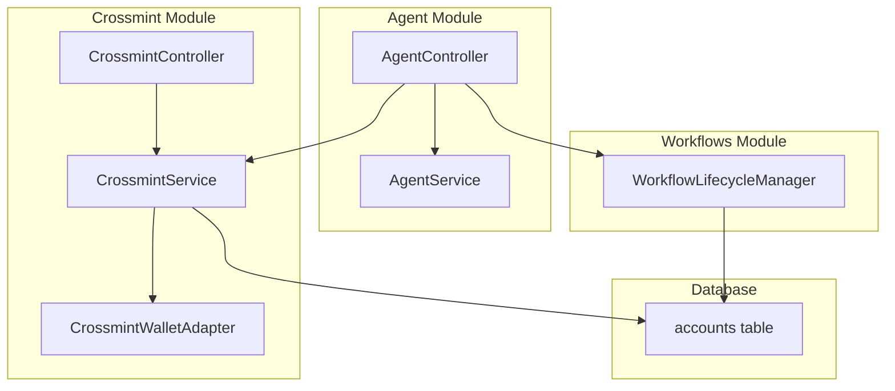
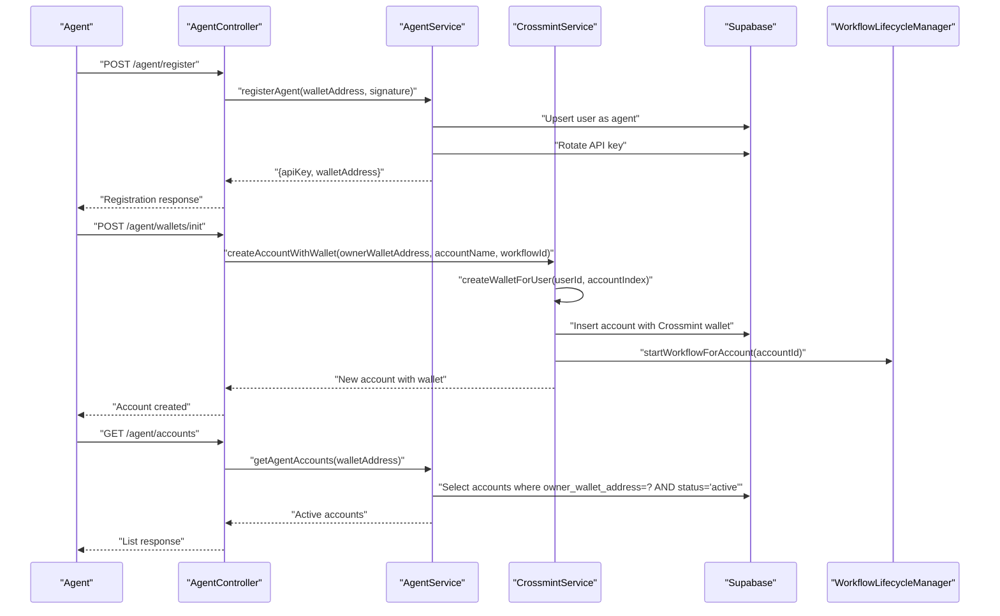
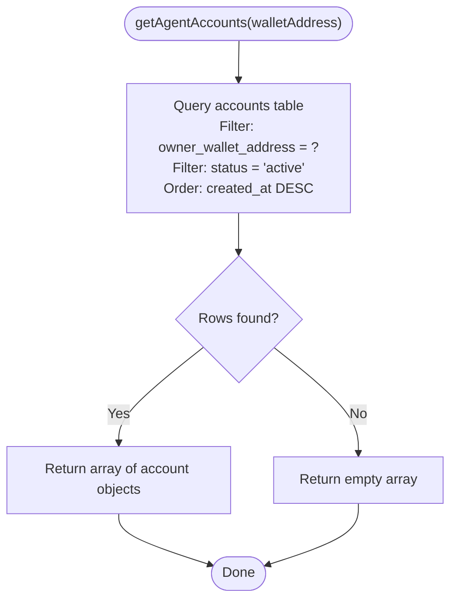
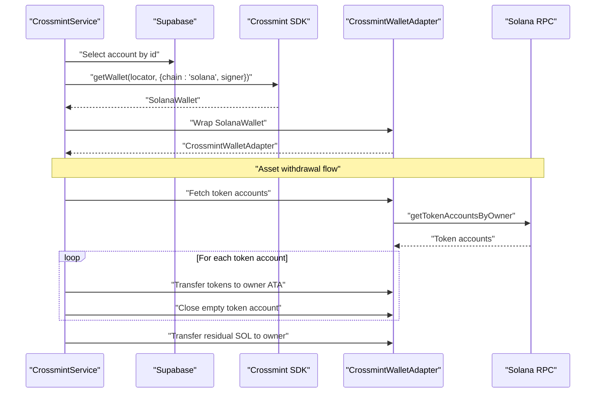
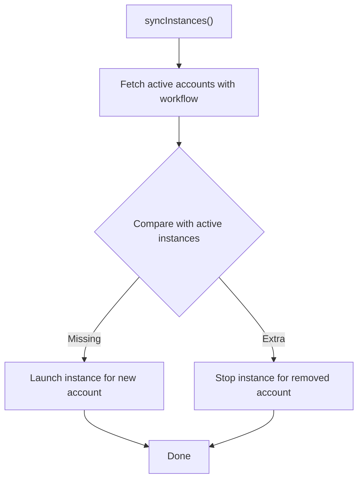
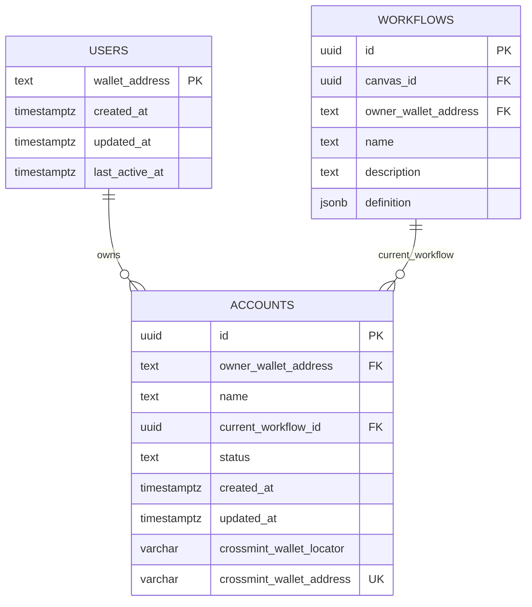
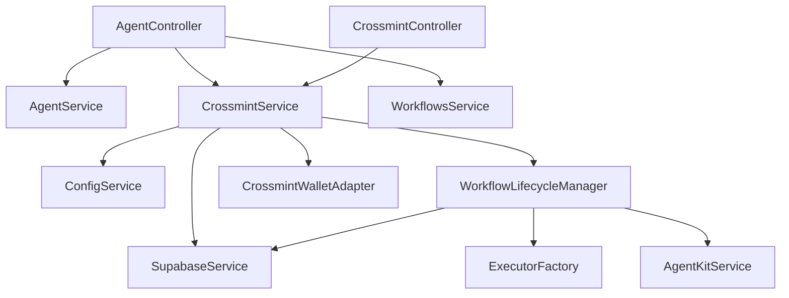

# Agent Account Management

<cite>
**Referenced Files in This Document**
- [agent.service.ts](file://src/agent/agent.service.ts)
- [agent.controller.ts](file://src/agent/agent.controller.ts)
- [crossmint.service.ts](file://src/crossmint/crossmint.service.ts)
- [crossmint-wallet.adapter.ts](file://src/crossmint/crossmint-wallet.adapter.ts)
- [crossmint.controller.ts](file://src/crossmint/crossmint.controller.ts)
- [workflow-lifecycle.service.ts](file://src/workflows/workflow-lifecycle.service.ts)
- [configuration.ts](file://src/config/configuration.ts)
- [initial-1.sql](file://src/database/schema/initial-1.sql)
- [20260308000000_add_canvases_and_account_status.sql](file://supabase/migrations/20260308000000_add_canvases_and_account_status.sql)
- [20260118210000_remove_legacy_wallet_fields.sql](file://supabase/migrations/20260118210000_remove_legacy_wallet_fields.sql)
- [agent-register.dto.ts](file://src/agent/dto/agent-register.dto.ts)
- [agent-init-wallet.dto.ts](file://src/agent/dto/agent-init-wallet.dto.ts)
- [init-wallet.dto.ts](file://src/crossmint/dto/init-wallet.dto.ts)
- [signed-request.dto.ts](file://src/crossmint/dto/signed-request.dto.ts)
</cite>

## Table of Contents
1. [Introduction](#introduction)
2. [Project Structure](#project-structure)
3. [Core Components](#core-components)
4. [Architecture Overview](#architecture-overview)
5. [Detailed Component Analysis](#detailed-component-analysis)
6. [Dependency Analysis](#dependency-analysis)
7. [Performance Considerations](#performance-considerations)
8. [Troubleshooting Guide](#troubleshooting-guide)
9. [Conclusion](#conclusion)

## Introduction
This document explains agent account management with Crossmint wallet integration and account lifecycle operations. It focuses on the getAgentAccounts method, account query filtering by owner wallet address and status, and account data retrieval patterns. It also details the relationship between agent wallets and Crossmint custodial accounts, including status management and workflow associations, and provides practical examples of account queries, response formats, and integration with the Crossmint wallet adapter. Lifecycle stages, status transitions, and cleanup procedures are covered, along with monitoring, troubleshooting, and best practices.

## Project Structure
Agent account management spans several modules:
- Agent module: registration, API key generation, and account listing
- Crossmint module: wallet creation, retrieval, and deletion with asset withdrawal
- Workflows module: lifecycle management of workflows associated with accounts
- Database schema: accounts table with owner, Crossmint wallet identifiers, and status

**Diagram sources**
- [agent.controller.ts:23-28](file://src/agent/agent.controller.ts#L23-L28)
- [agent.service.ts:7-13](file://src/agent/agent.service.ts#L7-L13)
- [crossmint.service.ts:43-54](file://src/crossmint/crossmint.service.ts#L43-L54)
- [crossmint-wallet.adapter.ts:16-23](file://src/crossmint/crossmint-wallet.adapter.ts#L16-L23)
- [crossmint.controller.ts:16-21](file://src/crossmint/crossmint.controller.ts#L16-L21)
- [workflow-lifecycle.service.ts:12-23](file://src/workflows/workflow-lifecycle.service.ts#L12-L23)
- [initial-1.sql:4-17](file://src/database/schema/initial-1.sql#L4-L17)

**Section sources**
- [agent.controller.ts:23-28](file://src/agent/agent.controller.ts#L23-L28)
- [agent.service.ts:7-13](file://src/agent/agent.service.ts#L7-L13)
- [crossmint.service.ts:43-54](file://src/crossmint/crossmint.service.ts#L43-L54)
- [crossmint-wallet.adapter.ts:16-23](file://src/crossmint/crossmint-wallet.adapter.ts#L16-L23)
- [crossmint.controller.ts:16-21](file://src/crossmint/crossmint.controller.ts#L16-L21)
- [workflow-lifecycle.service.ts:12-23](file://src/workflows/workflow-lifecycle.service.ts#L12-L23)
- [initial-1.sql:4-17](file://src/database/schema/initial-1.sql#L4-L17)

## Core Components
- AgentService: registers agents, generates API keys, and lists agent accounts filtered by owner wallet and active status
- CrossmintService: creates Crossmint wallets, retrieves wallet adapters, creates accounts with wallets, withdraws assets, and deletes accounts
- CrossmintWalletAdapter: wraps Crossmint Solana wallet to conform to a standard wallet interface
- WorkflowLifecycleManager: manages active workflow instances per account and enforces minimum SOL balance checks
- Controllers: expose endpoints for agent registration, account listing, wallet initialization, and deletion

Key implementation references:
- getAgentAccounts method and filtering: [agent.service.ts:61-75](file://src/agent/agent.service.ts#L61-L75)
- Account creation with Crossmint wallet: [crossmint.service.ts:163-204](file://src/crossmint/crossmint.service.ts#L163-L204)
- Wallet retrieval for account: [crossmint.service.ts:122-154](file://src/crossmint/crossmint.service.ts#L122-L154)
- Asset withdrawal and deletion: [crossmint.service.ts:209-401](file://src/crossmint/crossmint.service.ts#L209-L401)
- Lifecycle synchronization and balance checks: [workflow-lifecycle.service.ts:70-229](file://src/workflows/workflow-lifecycle.service.ts#L70-L229)

**Section sources**
- [agent.service.ts:61-75](file://src/agent/agent.service.ts#L61-L75)
- [crossmint.service.ts:122-204](file://src/crossmint/crossmint.service.ts#L122-L204)
- [crossmint-wallet.adapter.ts:16-88](file://src/crossmint/crossmint-wallet.adapter.ts#L16-L88)
- [workflow-lifecycle.service.ts:70-229](file://src/workflows/workflow-lifecycle.service.ts#L70-L229)

## Architecture Overview
The agent account lifecycle integrates wallet creation, account persistence, and workflow orchestration:
- Agent registers via wallet signature and receives an API key
- Agent creates an account with a Crossmint custodial wallet
- The system starts a workflow for the account (subject to minimum SOL balance)
- Agent can list active accounts and later delete an account (with asset withdrawal)

**Diagram sources**
- [agent.controller.ts:30-40](file://src/agent/agent.controller.ts#L30-L40)
- [agent.controller.ts:91-99](file://src/agent/agent.controller.ts#L91-L99)
- [agent.controller.ts:42-50](file://src/agent/agent.controller.ts#L42-L50)
- [agent.service.ts:15-59](file://src/agent/agent.service.ts#L15-L59)
- [agent.service.ts:61-75](file://src/agent/agent.service.ts#L61-L75)
- [crossmint.service.ts:84-204](file://src/crossmint/crossmint.service.ts#L84-L204)
- [workflow-lifecycle.service.ts:160-198](file://src/workflows/workflow-lifecycle.service.ts#L160-L198)

## Detailed Component Analysis

### AgentService: Account Listing and Registration
- getAgentAccounts(walletAddress):
  - Filters accounts by owner_wallet_address and status=active
  - Orders by created_at descending
  - Returns selected fields: id, name, crossmint_wallet_address, current_workflow_id, status, created_at
- registerAgent(walletAddress, signature):
  - Verifies signature against stored challenges
  - Upserts user as agent type
  - Generates and rotates API key atomically

**Diagram sources**
- [agent.service.ts:61-75](file://src/agent/agent.service.ts#L61-L75)

**Section sources**
- [agent.service.ts:61-75](file://src/agent/agent.service.ts#L61-L75)
- [agent.service.ts:15-59](file://src/agent/agent.service.ts#L15-L59)

### CrossmintService: Wallet Creation, Retrieval, and Deletion
- createWalletForUser(userId, accountIndex):
  - Creates a Crossmint custodial wallet with server-side signer
  - Returns locator and address
- createAccountWithWallet(ownerWalletAddress, accountName, workflowId?):
  - Creates Crossmint wallet and inserts account record with crossmint_wallet_locator/address
  - Optionally assigns current_workflow_id
  - Starts workflow for the account
- getWalletForAccount(accountId):
  - Retrieves account and resolves locator/address
  - Wraps Crossmint wallet in CrossmintWalletAdapter
- deleteWallet(accountId, ownerWalletAddress):
  - Verifies ownership
  - Stops running workflow for account
  - Withdraws all assets (SPL + SOL) to owner wallet
  - Soft-deletes account by setting status=closed

**Diagram sources**
- [crossmint.service.ts:122-154](file://src/crossmint/crossmint.service.ts#L122-L154)
- [crossmint.service.ts:209-344](file://src/crossmint/crossmint.service.ts#L209-L344)
- [crossmint-wallet.adapter.ts:16-88](file://src/crossmint/crossmint-wallet.adapter.ts#L16-L88)

**Section sources**
- [crossmint.service.ts:84-204](file://src/crossmint/crossmint.service.ts#L84-L204)
- [crossmint.service.ts:122-154](file://src/crossmint/crossmint.service.ts#L122-L154)
- [crossmint.service.ts:209-401](file://src/crossmint/crossmint.service.ts#L209-L401)
- [crossmint-wallet.adapter.ts:16-88](file://src/crossmint/crossmint-wallet.adapter.ts#L16-L88)

### WorkflowLifecycleManager: Active Accounts and Balance Checks
- syncInstances():
  - Fetches active accounts with current_workflow_id and joins user/workflow data
  - Starts or stops workflow instances accordingly
- startWorkflowForAccount(accountId):
  - Validates account readiness and launches instance
- stopWorkflowForAccount(accountId):
  - Stops a running instance for the account
- hasMinimumBalance(walletAddress):
  - Ensures minimum SOL threshold before launching workflows

**Diagram sources**
- [workflow-lifecycle.service.ts:70-117](file://src/workflows/workflow-lifecycle.service.ts#L70-L117)
- [workflow-lifecycle.service.ts:160-229](file://src/workflows/workflow-lifecycle.service.ts#L160-L229)

**Section sources**
- [workflow-lifecycle.service.ts:70-117](file://src/workflows/workflow-lifecycle.service.ts#L70-L117)
- [workflow-lifecycle.service.ts:160-229](file://src/workflows/workflow-lifecycle.service.ts#L160-L229)

### Data Model: Accounts and Status Management
The accounts table stores owner, wallet identifiers, workflow association, and status. Status is an enum with values: inactive, active, closed. Crossmint wallet fields include locator and address, with uniqueness constraints.

**Diagram sources**
- [initial-1.sql:4-17](file://src/database/schema/initial-1.sql#L4-L17)
- [initial-1.sql:105-116](file://src/database/schema/initial-1.sql#L105-L116)
- [initial-1.sql:140-153](file://src/database/schema/initial-1.sql#L140-L153)

**Section sources**
- [initial-1.sql:4-17](file://src/database/schema/initial-1.sql#L4-L17)
- [20260308000000_add_canvases_and_account_status.sql:35-44](file://supabase/migrations/20260308000000_add_canvases_and_account_status.sql#L35-L44)
- [20260118210000_remove_legacy_wallet_fields.sql:23-43](file://supabase/migrations/20260118210000_remove_legacy_wallet_fields.sql#L23-L43)

## Dependency Analysis
- AgentController depends on AgentService, CrossmintService, and WorkflowsService
- CrossmintController depends on CrossmintService and AuthService for signature verification
- CrossmintService depends on SupabaseService, ConfigService, and WorkflowLifecycleManager
- WorkflowLifecycleManager depends on SupabaseService, ExecutorFactory, and AgentKitService
- CrossmintWalletAdapter wraps Crossmint SDK wallet to provide a standard interface

**Diagram sources**
- [agent.controller.ts:24-28](file://src/agent/agent.controller.ts#L24-L28)
- [crossmint.controller.ts:18-21](file://src/crossmint/crossmint.controller.ts#L18-L21)
- [crossmint.service.ts:49-54](file://src/crossmint/crossmint.service.ts#L49-L54)
- [workflow-lifecycle.service.ts:19-23](file://src/workflows/workflow-lifecycle.service.ts#L19-L23)
- [crossmint-wallet.adapter.ts:16-23](file://src/crossmint/crossmint-wallet.adapter.ts#L16-L23)

**Section sources**
- [agent.controller.ts:24-28](file://src/agent/agent.controller.ts#L24-L28)
- [crossmint.controller.ts:18-21](file://src/crossmint/crossmint.controller.ts#L18-L21)
- [crossmint.service.ts:49-54](file://src/crossmint/crossmint.service.ts#L49-L54)
- [workflow-lifecycle.service.ts:19-23](file://src/workflows/workflow-lifecycle.service.ts#L19-L23)
- [crossmint-wallet.adapter.ts:16-23](file://src/crossmint/crossmint-wallet.adapter.ts#L16-L23)

## Performance Considerations
- Filtering and ordering: getAgentAccounts orders by created_at descending; ensure appropriate indexing on owner_wallet_address and status for efficient filtering
- Batch operations: Crossmint asset withdrawal iterates token accounts; consider batching and rate limiting to avoid RPC throttling
- Workflow polling: Lifecycle manager runs periodic sync; tune polling interval based on workload and latency requirements
- Balance checks: Minimum SOL balance checks query RPC frequently; cache balances when feasible and avoid redundant calls

[No sources needed since this section provides general guidance]

## Troubleshooting Guide
Common issues and resolutions:
- Invalid signature during registration or wallet operations:
  - Verify challenge expiration and signature validity using the shared challenge mechanism
  - References: [agent.controller.ts:30-40](file://src/agent/agent.controller.ts#L30-L40), [crossmint.controller.ts:30-42](file://src/crossmint/crossmint.controller.ts#L30-L42)
- Account not found or missing Crossmint wallet:
  - Ensure account exists and crossmint_wallet_locator/address are populated
  - Reference: [crossmint.service.ts:122-154](file://src/crossmint/crossmint.service.ts#L122-L154)
- Asset withdrawal failures:
  - Review returned errors and retry failed transfers; ensure sufficient SOL for fees
  - Reference: [crossmint.service.ts:209-344](file://src/crossmint/crossmint.service.ts#L209-L344)
- Unauthorized deletion attempts:
  - Ownership verification must match owner_wallet_address
  - Reference: [crossmint.service.ts:355-368](file://src/crossmint/crossmint.service.ts#L355-L368)
- Workflow not starting:
  - Confirm account status is active, has a current_workflow_id, and wallet has minimum SOL balance
  - Reference: [workflow-lifecycle.service.ts:70-117](file://src/workflows/workflow-lifecycle.service.ts#L70-L117), [workflow-lifecycle.service.ts:216-229](file://src/workflows/workflow-lifecycle.service.ts#L216-L229)

**Section sources**
- [agent.controller.ts:30-40](file://src/agent/agent.controller.ts#L30-L40)
- [crossmint.controller.ts:30-42](file://src/crossmint/crossmint.controller.ts#L30-L42)
- [crossmint.service.ts:122-154](file://src/crossmint/crossmint.service.ts#L122-L154)
- [crossmint.service.ts:209-344](file://src/crossmint/crossmint.service.ts#L209-L344)
- [crossmint.service.ts:355-368](file://src/crossmint/crossmint.service.ts#L355-L368)
- [workflow-lifecycle.service.ts:70-117](file://src/workflows/workflow-lifecycle.service.ts#L70-L117)
- [workflow-lifecycle.service.ts:216-229](file://src/workflows/workflow-lifecycle.service.ts#L216-L229)

## Conclusion
Agent account management integrates secure registration, Crossmint custodial wallet creation, and lifecycle-driven workflows. The getAgentAccounts method efficiently filters active accounts for an owner, while CrossmintService handles wallet operations and safe deletion with asset withdrawal. WorkflowLifecycleManager ensures workflows run only when conditions are met, and the database schema supports robust status tracking and foreign key relationships. Following the troubleshooting and best practices outlined here will help maintain reliable agent account operations.