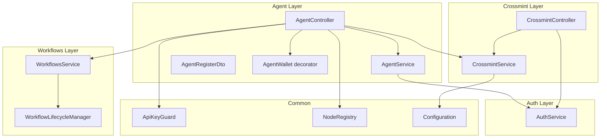
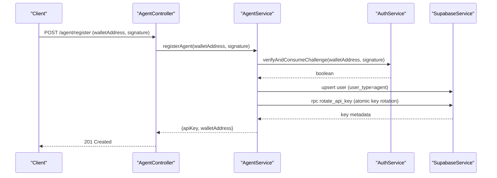
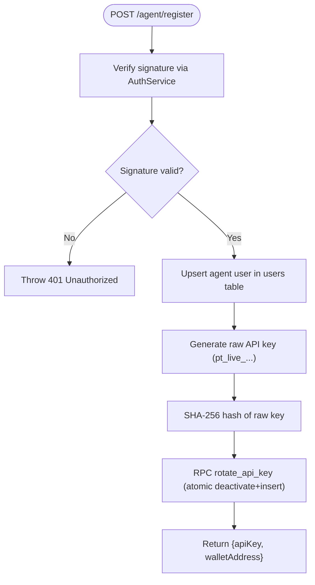
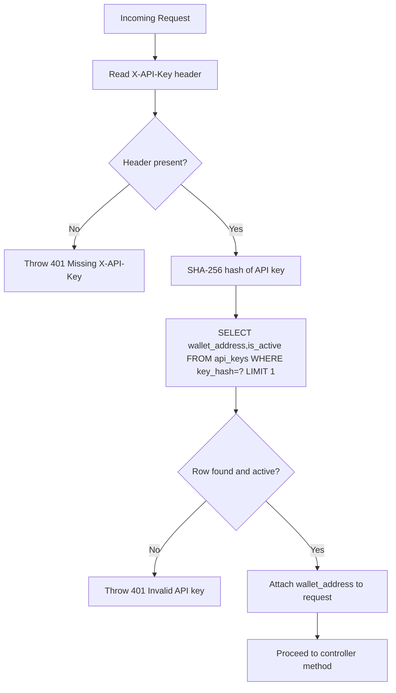
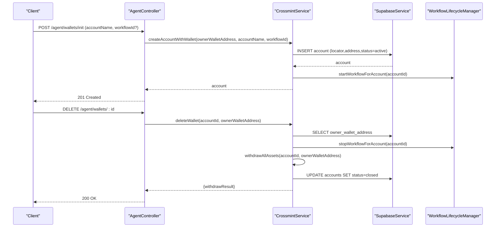
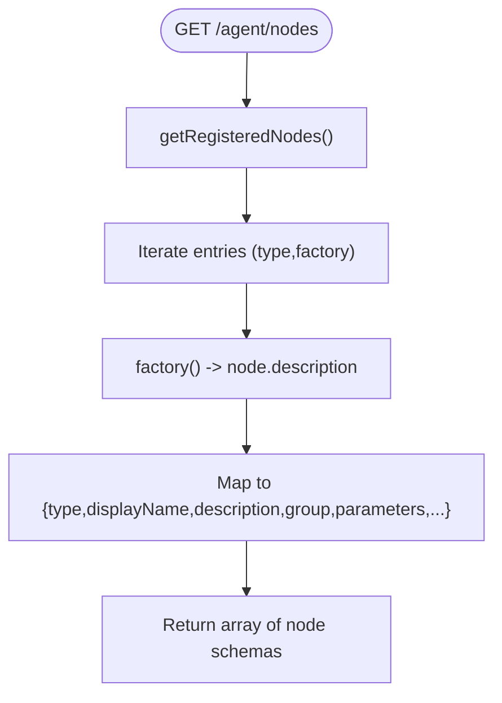
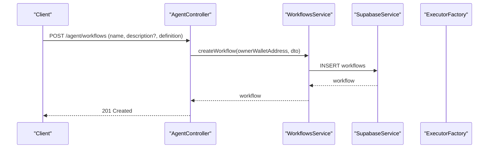
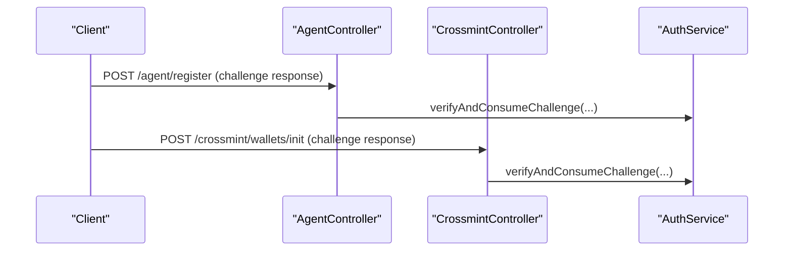
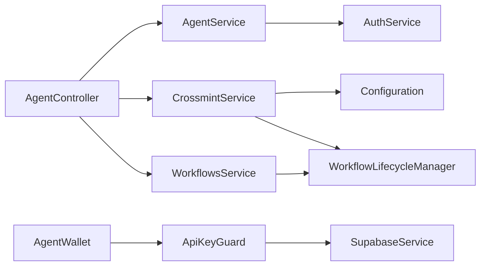

# Agent Framework

<cite>
**Referenced Files in This Document**
- [agent.controller.ts](file://src/agent/agent.controller.ts)
- [agent.service.ts](file://src/agent/agent.service.ts)
- [agent-register.dto.ts](file://src/agent/dto/agent-register.dto.ts)
- [agent-init-wallet.dto.ts](file://src/agent/dto/agent-init-wallet.dto.ts)
- [api-key.guard.ts](file://src/common/guards/api-key.guard.ts)
- [agent-wallet.decorator.ts](file://src/common/decorators/agent-wallet.decorator.ts)
- [auth.service.ts](file://src/auth/auth.service.ts)
- [crossmint.service.ts](file://src/crossmint/crossmint.service.ts)
- [crossmint.controller.ts](file://src/crossmint/crossmint.controller.ts)
- [workflows.service.ts](file://src/workflows/workflows.service.ts)
- [workflow-lifecycle.service.ts](file://src/workflows/workflow-lifecycle.service.ts)
- [node-registry.ts](file://src/web3/nodes/node-registry.ts)
- [configuration.ts](file://src/config/configuration.ts)
- [agent.module.ts](file://src/agent/agent.module.ts)
- [20260218000000_add_agent_api_keys.sql](file://supabase/migrations/20260218000000_add_agent_api_keys.sql)
- [20260218010000_add_rotate_api_key_function.sql](file://supabase/migrations/20260218010000_add_rotate_api_key_function.sql)
</cite>

## Table of Contents
1. [Introduction](#introduction)
2. [Project Structure](#project-structure)
3. [Core Components](#core-components)
4. [Architecture Overview](#architecture-overview)
5. [Detailed Component Analysis](#detailed-component-analysis)
6. [Dependency Analysis](#dependency-analysis)
7. [Performance Considerations](#performance-considerations)
8. [Troubleshooting Guide](#troubleshooting-guide)
9. [Conclusion](#conclusion)
10. [Appendices](#appendices)

## Introduction
This document explains the agent framework for programmatic access and API-key based authentication. It covers:
- Agent registration via wallet signature challenge
- API key generation and management with atomic rotation
- Account lifecycle management through Crossmint integration
- Controllers for listing accounts, retrieving node schemas, creating workflows, and initializing/deleting wallets
- Security model, best practices, and operational guidance for API key distribution, rotation, rate limiting, and cleanup

## Project Structure
The agent framework spans several modules:
- Agent module: registration, account listing, node schema discovery, workflow creation, and wallet lifecycle
- Authentication module: challenge generation and signature verification
- Crossmint module: wallet creation, asset withdrawal, and deletion
- Workflows module: workflow definition persistence and execution lifecycle
- Common guards and decorators: API key enforcement and agent wallet extraction

**Diagram sources**
- [agent.controller.ts:1-111](file://src/agent/agent.controller.ts#L1-L111)
- [agent.service.ts:1-77](file://src/agent/agent.service.ts#L1-L77)
- [auth.service.ts:1-165](file://src/auth/auth.service.ts#L1-L165)
- [crossmint.service.ts:1-403](file://src/crossmint/crossmint.service.ts#L1-L403)
- [crossmint.controller.ts:1-67](file://src/crossmint/crossmint.controller.ts#L1-L67)
- [workflows.service.ts:1-216](file://src/workflows/workflows.service.ts#L1-L216)
- [workflow-lifecycle.service.ts:1-343](file://src/workflows/workflow-lifecycle.service.ts#L1-L343)
- [api-key.guard.ts:1-56](file://src/common/guards/api-key.guard.ts#L1-L56)
- [agent-wallet.decorator.ts:1-9](file://src/common/decorators/agent-wallet.decorator.ts#L1-L9)
- [node-registry.ts:1-47](file://src/web3/nodes/node-registry.ts#L1-L47)
- [configuration.ts:1-45](file://src/config/configuration.ts#L1-L45)

**Section sources**
- [agent.controller.ts:1-111](file://src/agent/agent.controller.ts#L1-L111)
- [agent.service.ts:1-77](file://src/agent/agent.service.ts#L1-L77)
- [auth.service.ts:1-165](file://src/auth/auth.service.ts#L1-L165)
- [crossmint.service.ts:1-403](file://src/crossmint/crossmint.service.ts#L1-L403)
- [workflows.service.ts:1-216](file://src/workflows/workflows.service.ts#L1-L216)
- [workflow-lifecycle.service.ts:1-343](file://src/workflows/workflow-lifecycle.service.ts#L1-L343)
- [api-key.guard.ts:1-56](file://src/common/guards/api-key.guard.ts#L1-L56)
- [agent-wallet.decorator.ts:1-9](file://src/common/decorators/agent-wallet.decorator.ts#L1-L9)
- [node-registry.ts:1-47](file://src/web3/nodes/node-registry.ts#L1-L47)
- [configuration.ts:1-45](file://src/config/configuration.ts#L1-L45)

## Core Components
- AgentController: exposes endpoints for registration, account listing, node schema retrieval, workflow creation, and wallet initialization/deletion. Uses ApiKeyGuard for protected routes and extracts the agent’s wallet address via AgentWallet decorator.
- AgentService: orchestrates agent registration by verifying the wallet challenge, upserting the agent user, generating a raw API key, hashing it, and performing atomic key rotation via a stored procedure.
- ApiKeyGuard: enforces API key authentication by validating the hashed key against the database, ensuring the key is active, and attaching the associated wallet address to the request.
- CrossmintService: manages Crossmint wallets, including creation, retrieval, asset withdrawal, and deletion with ownership checks and workflow lifecycle hooks.
- WorkflowsService: persists and executes workflows, tracks in-flight executions, and integrates with lifecycle manager for auto-start/stop.
- WorkflowLifecycleManager: periodically synchronizes active accounts with running workflow instances, enforces minimum SOL balance checks, and manages instance lifecycle.
- NodeRegistry: enumerates available node types and parameters for schema discovery.

**Section sources**
- [agent.controller.ts:20-111](file://src/agent/agent.controller.ts#L20-L111)
- [agent.service.ts:15-77](file://src/agent/agent.service.ts#L15-L77)
- [api-key.guard.ts:11-56](file://src/common/guards/api-key.guard.ts#L11-L56)
- [crossmint.service.ts:163-403](file://src/crossmint/crossmint.service.ts#L163-L403)
- [workflows.service.ts:60-216](file://src/workflows/workflows.service.ts#L60-L216)
- [workflow-lifecycle.service.ts:70-343](file://src/workflows/workflow-lifecycle.service.ts#L70-L343)
- [node-registry.ts:19-47](file://src/web3/nodes/node-registry.ts#L19-L47)

## Architecture Overview
The agent framework follows a layered design:
- Presentation: AgentController and CrossmintController expose REST endpoints
- Application: AgentService, WorkflowsService, and WorkflowLifecycleManager coordinate business logic
- Infrastructure: CrossmintService interacts with Crossmint SDK and Solana; ApiKeyGuard and AgentWallet decorator enforce security and pass identity
- Persistence: Supabase stores users, API keys, accounts, workflows, and auth challenges

**Diagram sources**
- [agent.controller.ts:30-40](file://src/agent/agent.controller.ts#L30-L40)
- [agent.service.ts:15-59](file://src/agent/agent.service.ts#L15-L59)
- [auth.service.ts:57-91](file://src/auth/auth.service.ts#L57-L91)
- [20260218010000_add_rotate_api_key_function.sql:1-27](file://supabase/migrations/20260218010000_add_rotate_api_key_function.sql#L1-L27)

## Detailed Component Analysis

### Agent Registration and API Key Management
- Registration endpoint validates wallet signature using the same challenge mechanism as human users, upserts the agent user, generates a raw API key, hashes it, and rotates it atomically via a stored procedure.
- API key storage includes a unique prefix for visibility and a hash for secure lookup, with row-level security policies and partial uniqueness to ensure one active key per wallet.

**Diagram sources**
- [agent.controller.ts:30-40](file://src/agent/agent.controller.ts#L30-L40)
- [agent.service.ts:15-59](file://src/agent/agent.service.ts#L15-L59)
- [auth.service.ts:57-91](file://src/auth/auth.service.ts#L57-L91)
- [20260218000000_add_agent_api_keys.sql:6-27](file://supabase/migrations/20260218000000_add_agent_api_keys.sql#L6-L27)
- [20260218010000_add_rotate_api_key_function.sql:1-27](file://supabase/migrations/20260218010000_add_rotate_api_key_function.sql#L1-L27)

**Section sources**
- [agent.controller.ts:30-40](file://src/agent/agent.controller.ts#L30-L40)
- [agent.service.ts:15-59](file://src/agent/agent.service.ts#L15-L59)
- [agent-register.dto.ts:1-24](file://src/agent/dto/agent-register.dto.ts#L1-L24)
- [auth.service.ts:27-91](file://src/auth/auth.service.ts#L27-L91)
- [20260218000000_add_agent_api_keys.sql:1-48](file://supabase/migrations/20260218000000_add_agent_api_keys.sql#L1-L48)
- [20260218010000_add_rotate_api_key_function.sql:1-27](file://supabase/migrations/20260218010000_add_rotate_api_key_function.sql#L1-L27)

### API Key Guard Implementation
- Validates presence of X-API-Key header, hashes the key, queries the api_keys table, ensures the key is active, and attaches the associated wallet address to the request for downstream use.

**Diagram sources**
- [api-key.guard.ts:11-56](file://src/common/guards/api-key.guard.ts#L11-L56)
- [20260218000000_add_agent_api_keys.sql:6-27](file://supabase/migrations/20260218000000_add_agent_api_keys.sql#L6-L27)

**Section sources**
- [api-key.guard.ts:1-56](file://src/common/guards/api-key.guard.ts#L1-L56)
- [agent-wallet.decorator.ts:1-9](file://src/common/decorators/agent-wallet.decorator.ts#L1-L9)
- [20260218000000_add_agent_api_keys.sql:1-48](file://supabase/migrations/20260218000000_add_agent_api_keys.sql#L1-L48)

### Crossmint Wallet Operations and Account Lifecycle
- Initialization: Creates a Crossmint wallet under a server-signed owner and persists account metadata, optionally linking a workflow. The lifecycle manager starts the workflow automatically.
- Deletion: Stops running workflow instances, withdraws all SPL tokens and SOL back to the owner wallet, and marks the account as closed if withdrawal succeeds.
- Asset withdrawal: Iterates token accounts, creates owner ATAs if needed, transfers and closes accounts, reserves minimal SOL for fees, and records results.

**Diagram sources**
- [agent.controller.ts:91-110](file://src/agent/agent.controller.ts#L91-L110)
- [crossmint.service.ts:163-403](file://src/crossmint/crossmint.service.ts#L163-L403)
- [workflow-lifecycle.service.ts:160-211](file://src/workflows/workflow-lifecycle.service.ts#L160-L211)

**Section sources**
- [agent.controller.ts:91-110](file://src/agent/agent.controller.ts#L91-L110)
- [crossmint.service.ts:163-403](file://src/crossmint/crossmint.service.ts#L163-L403)
- [workflow-lifecycle.service.ts:160-211](file://src/workflows/workflow-lifecycle.service.ts#L160-L211)

### Node Schema Retrieval
- Lists all registered node types, their parameters, and metadata by iterating the global node registry and materializing each node’s description.

**Diagram sources**
- [agent.controller.ts:52-79](file://src/agent/agent.controller.ts#L52-L79)
- [node-registry.ts:19-47](file://src/web3/nodes/node-registry.ts#L19-L47)

**Section sources**
- [agent.controller.ts:52-79](file://src/agent/agent.controller.ts#L52-L79)
- [node-registry.ts:1-47](file://src/web3/nodes/node-registry.ts#L1-L47)

### Workflow Creation and Execution
- Creation: Stores a new workflow bound to the agent’s wallet address.
- Execution: Prevents overlapping runs via in-memory tracking and DB queries, creates an execution record, and delegates to the executor factory. Results are persisted upon completion or failure.

**Diagram sources**
- [agent.controller.ts:81-89](file://src/agent/agent.controller.ts#L81-L89)
- [workflows.service.ts:60-81](file://src/workflows/workflows.service.ts#L60-L81)

**Section sources**
- [agent.controller.ts:81-89](file://src/agent/agent.controller.ts#L81-L89)
- [workflows.service.ts:60-216](file://src/workflows/workflows.service.ts#L60-L216)

### Relationship with Authentication System
- Both agent registration and Crossmint account initialization reuse the same challenge/signature flow to authenticate the owner wallet. This ensures consistent identity verification across human and agent flows.

**Diagram sources**
- [agent.controller.ts:30-40](file://src/agent/agent.controller.ts#L30-L40)
- [crossmint.controller.ts:30-42](file://src/crossmint/crossmint.controller.ts#L30-L42)
- [auth.service.ts:57-91](file://src/auth/auth.service.ts#L57-L91)

**Section sources**
- [agent.controller.ts:30-40](file://src/agent/agent.controller.ts#L30-L40)
- [crossmint.controller.ts:30-42](file://src/crossmint/crossmint.controller.ts#L30-L42)
- [auth.service.ts:27-91](file://src/auth/auth.service.ts#L27-L91)

## Dependency Analysis
- AgentController depends on AgentService, CrossmintService, and WorkflowsService.
- AgentService depends on AuthService and SupabaseService.
- CrossmintService depends on configuration, SupabaseService, and WorkflowLifecycleManager.
- WorkflowsService depends on SupabaseService and WorkflowExecutorFactory.
- WorkflowLifecycleManager depends on SupabaseService, WorkflowExecutorFactory, and AgentKitService.
- ApiKeyGuard depends on SupabaseService for key validation.
- AgentWallet decorator reads the agent wallet address attached by ApiKeyGuard.

**Diagram sources**
- [agent.controller.ts:24-28](file://src/agent/agent.controller.ts#L24-L28)
- [agent.service.ts:10-13](file://src/agent/agent.service.ts#L10-L13)
- [crossmint.service.ts:49-54](file://src/crossmint/crossmint.service.ts#L49-L54)
- [workflows.service.ts:8-12](file://src/workflows/workflows.service.ts#L8-L12)
- [workflow-lifecycle.service.ts:19-23](file://src/workflows/workflow-lifecycle.service.ts#L19-L23)
- [api-key.guard.ts:9-9](file://src/common/guards/api-key.guard.ts#L9-L9)
- [agent-wallet.decorator.ts:3-8](file://src/common/decorators/agent-wallet.decorator.ts#L3-L8)

**Section sources**
- [agent.module.ts:1-15](file://src/agent/agent.module.ts#L1-L15)
- [agent.controller.ts:1-111](file://src/agent/agent.controller.ts#L1-L111)
- [agent.service.ts:1-77](file://src/agent/agent.service.ts#L1-L77)
- [crossmint.service.ts:1-403](file://src/crossmint/crossmint.service.ts#L1-L403)
- [workflows.service.ts:1-216](file://src/workflows/workflows.service.ts#L1-L216)
- [workflow-lifecycle.service.ts:1-343](file://src/workflows/workflow-lifecycle.service.ts#L1-L343)
- [api-key.guard.ts:1-56](file://src/common/guards/api-key.guard.ts#L1-L56)
- [agent-wallet.decorator.ts:1-9](file://src/common/decorators/agent-wallet.decorator.ts#L1-L9)

## Performance Considerations
- API key validation uses a single indexed lookup by hashed key; ensure the key_hash index remains healthy.
- Atomic key rotation via stored procedure prevents race conditions during concurrent registrations.
- Workflow execution deduplication avoids redundant runs using in-memory and DB-backed tracking.
- Lifecycle polling interval balances responsiveness and load; adjust POLLING_MS according to workload.
- Minimum SOL balance checks prevent unnecessary execution attempts on underfunded wallets.

[No sources needed since this section provides general guidance]

## Troubleshooting Guide
- Missing X-API-Key header: ApiKeyGuard throws 401 Unauthorized; ensure clients send the header.
- Invalid or inactive API key: ApiKeyGuard throws 401 Unauthorized; regenerate the key if inactive.
- Registration failures: Verify challenge validity and that the user exists; check database upsert and stored procedure execution.
- Wallet initialization errors: Confirm Crossmint credentials and environment configuration; ensure the owner wallet is properly authenticated.
- Deletion blocked by pending assets: Withdrawal must succeed for all tokens and SOL; inspect returned errors and retry after resolving issues.
- Workflow not starting: Ensure the account has a valid workflow ID, sufficient SOL balance, and that lifecycle manager is running.

**Section sources**
- [api-key.guard.ts:15-33](file://src/common/guards/api-key.guard.ts#L15-L33)
- [agent.service.ts:33-54](file://src/agent/agent.service.ts#L33-L54)
- [crossmint.service.ts:379-386](file://src/crossmint/crossmint.service.ts#L379-L386)
- [workflow-lifecycle.service.ts:216-255](file://src/workflows/workflow-lifecycle.service.ts#L216-L255)

## Conclusion
The agent framework provides a secure, programmatic interface for managing agent identities, API keys, and Crossmint-backed accounts. By leveraging shared authentication, atomic key rotation, and robust lifecycle management, it supports reliable automation and scaling of agent-driven workflows.

[No sources needed since this section summarizes without analyzing specific files]

## Appendices

### API Endpoints Overview
- POST /agent/register: Register agent and receive API key
- GET /agent/accounts: List agent accounts (requires X-API-Key)
- GET /agent/nodes: List node schemas
- POST /agent/workflows: Create a workflow
- POST /agent/wallets/init: Initialize a Crossmint wallet for an account
- DELETE /agent/wallets/:id: Close account and withdraw assets

**Section sources**
- [agent.controller.ts:30-110](file://src/agent/agent.controller.ts#L30-L110)

### Security Considerations and Best Practices
- Distribute raw API keys securely; only reveal the key prefix to users for identification.
- Enforce rate limiting at the gateway or application level to prevent abuse.
- Rotate API keys regularly; maintain audit logs via last_used_at updates.
- Use RLS policies and partial uniqueness on api_keys to minimize risk.
- Validate node schemas client-side and restrict node usage per account.

**Section sources**
- [20260218000000_add_agent_api_keys.sql:23-26](file://supabase/migrations/20260218000000_add_agent_api_keys.sql#L23-L26)
- [api-key.guard.ts:37-51](file://src/common/guards/api-key.guard.ts#L37-L51)

### Practical Integration Patterns
- Programmatic agent onboarding: Generate challenge, sign it, register agent, store API key securely, and configure initial workflow.
- Automated account provisioning: Use POST /agent/wallets/init to create accounts and workflows, then monitor via lifecycle manager.
- Batch operations: Use GET /agent/accounts and GET /agent/nodes to discover state and capabilities before issuing commands.
- Maintenance workflows: Implement periodic checks for SOL balance and key health; rotate keys and clean up inactive accounts.

[No sources needed since this section provides general guidance]