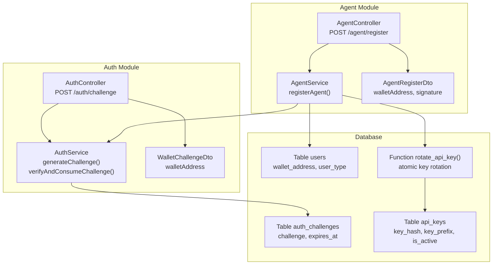
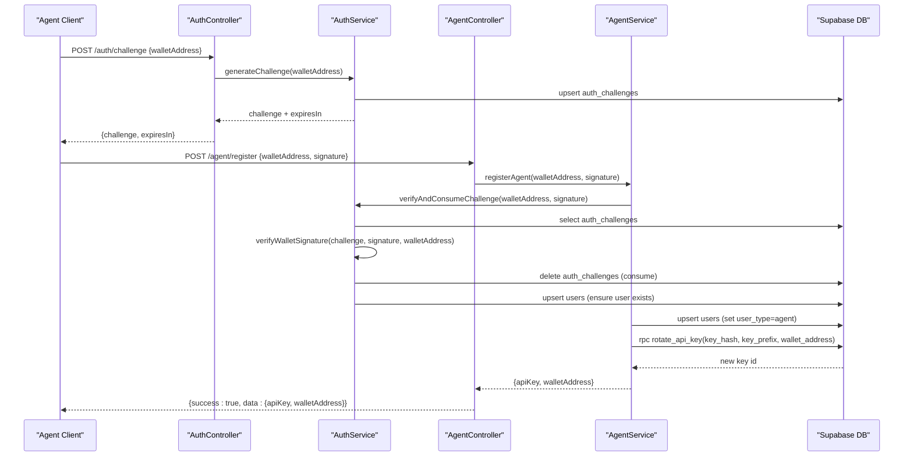
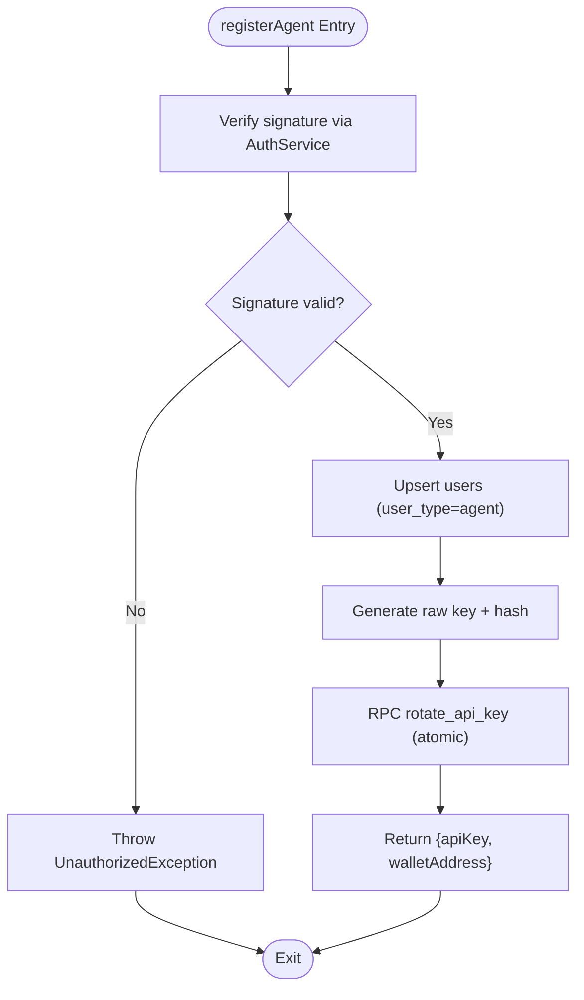
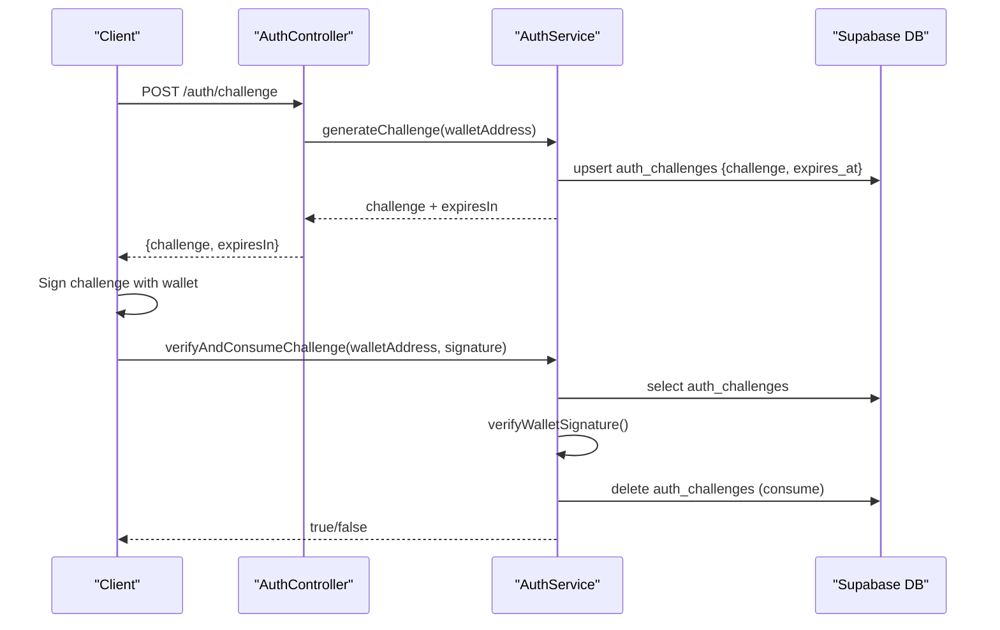
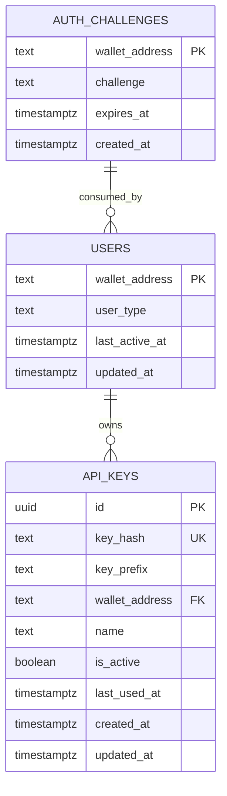
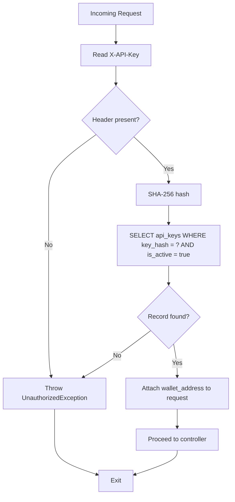
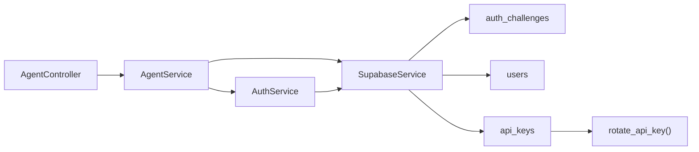

# Agent Registration and Management

<cite>
**Referenced Files in This Document**
- [agent.controller.ts](file://src/agent/agent.controller.ts)
- [agent.service.ts](file://src/agent/agent.service.ts)
- [agent-register.dto.ts](file://src/agent/dto/agent-register.dto.ts)
- [auth.controller.ts](file://src/auth/auth.controller.ts)
- [auth.service.ts](file://src/auth/auth.service.ts)
- [wallet-challenge.dto.ts](file://src/auth/dto/wallet-challenge.dto.ts)
- [api-key.guard.ts](file://src/common/guards/api-key.guard.ts)
- [20260218000000_add_agent_api_keys.sql](file://supabase/migrations/20260218000000_add_agent_api_keys.sql)
- [20260218010000_add_rotate_api_key_function.sql](file://supabase/migrations/20260218010000_add_rotate_api_key_function.sql)
- [initial-2-auth-challenges.sql](file://src/database/schema/initial-2-auth-challenges.sql)
- [20260128143000_fix_auth_rls.sql](file://supabase/migrations/202601281430000_fix_auth_rls.sql)
</cite>

## Table of Contents
1. [Introduction](#introduction)
2. [Project Structure](#project-structure)
3. [Core Components](#core-components)
4. [Architecture Overview](#architecture-overview)
5. [Detailed Component Analysis](#detailed-component-analysis)
6. [Dependency Analysis](#dependency-analysis)
7. [Performance Considerations](#performance-considerations)
8. [Troubleshooting Guide](#troubleshooting-guide)
9. [Conclusion](#conclusion)

## Introduction
This document explains the complete agent onboarding and registration process, focusing on wallet-based authentication, signature verification, user type assignment, and secure API key generation. It details the registerAgent method, the authentication challenge lifecycle, and the database upsert and key rotation operations. Practical examples, security considerations, and troubleshooting guidance are included to help developers integrate and operate the agent registration flow safely and efficiently.

## Project Structure
The agent registration flow spans three primary areas:
- Authentication module: challenge generation and signature verification
- Agent module: registration endpoint, DTO validation, and API key rotation
- Database schema and functions: auth challenges storage, users table, and atomic key rotation

**Diagram sources**
- [agent.controller.ts:30-40](file://src/agent/agent.controller.ts#L30-L40)
- [agent.service.ts:15-59](file://src/agent/agent.service.ts#L15-L59)
- [agent-register.dto.ts:4-23](file://src/agent/dto/agent-register.dto.ts#L4-L23)
- [auth.controller.ts:36-47](file://src/auth/auth.controller.ts#L36-L47)
- [auth.service.ts:27-91](file://src/auth/auth.service.ts#L27-L91)
- [wallet-challenge.dto.ts:4-15](file://src/auth/dto/wallet-challenge.dto.ts#L4-L15)
- [initial-2-auth-challenges.sql:1-7](file://src/database/schema/initial-2-auth-challenges.sql#L1-L7)
- [20260218000000_add_agent_api_keys.sql:1-48](file://supabase/migrations/20260218000000_add_agent_api_keys.sql#L1-L48)
- [20260218010000_add_rotate_api_key_function.sql:1-27](file://supabase/migrations/20260218010000_add_rotate_api_key_function.sql#L1-L27)

**Section sources**
- [agent.controller.ts:30-40](file://src/agent/agent.controller.ts#L30-L40)
- [agent.service.ts:15-59](file://src/agent/agent.service.ts#L15-L59)
- [auth.controller.ts:36-47](file://src/auth/auth.controller.ts#L36-L47)
- [auth.service.ts:27-91](file://src/auth/auth.service.ts#L27-L91)
- [initial-2-auth-challenges.sql:1-7](file://src/database/schema/initial-2-auth-challenges.sql#L1-L7)
- [20260218000000_add_agent_api_keys.sql:1-48](file://supabase/migrations/20260218000000_add_agent_api_keys.sql#L1-L48)
- [20260218010000_add_rotate_api_key_function.sql:1-27](file://supabase/migrations/20260218010000_add_rotate_api_key_function.sql#L1-L27)

## Core Components
- AgentController: Exposes POST /agent/register to initiate agent registration with wallet signature and returns an API key on success.
- AgentService: Orchestrates signature verification, user upsert with agent type, and atomic API key rotation via a stored procedure.
- AgentRegisterDto: Validates incoming registration payload (wallet address format and non-empty signature).
- AuthController and AuthService: Provide challenge generation and signature verification with expiration and consumption semantics.
- Database schema and functions: auth_challenges, users, api_keys tables and rotate_api_key function for secure key rotation.

Key responsibilities:
- Wallet signature verification using ed25519 (Solana)
- User record creation/upsert with user_type set to agent
- Atomic API key rotation to prevent race conditions
- Security via Row Level Security and service role access

**Section sources**
- [agent.controller.ts:30-40](file://src/agent/agent.controller.ts#L30-L40)
- [agent.service.ts:15-59](file://src/agent/agent.service.ts#L15-L59)
- [agent-register.dto.ts:4-23](file://src/agent/dto/agent-register.dto.ts#L4-L23)
- [auth.controller.ts:36-47](file://src/auth/auth.controller.ts#L36-L47)
- [auth.service.ts:27-91](file://src/auth/auth.service.ts#L27-L91)
- [20260218000000_add_agent_api_keys.sql:1-48](file://supabase/migrations/20260218000000_add_agent_api_keys.sql#L1-L48)
- [20260218010000_add_rotate_api_key_function.sql:1-27](file://supabase/migrations/20260218010000_add_rotate_api_key_function.sql#L1-L27)

## Architecture Overview
The agent registration flow follows a strict wallet signature authentication pattern:
1. Request an authentication challenge for the agent’s wallet address.
2. The agent signs the challenge message with their wallet.
3. Submit the signature to POST /agent/register along with the wallet address.
4. Backend verifies the signature against the stored challenge, consumes the challenge, and ensures the user exists.
5. Upsert the user record with user_type set to agent.
6. Generate a new API key and atomically rotate it via rotate_api_key function.
7. Return the raw API key to the caller.

**Diagram sources**
- [auth.controller.ts:36-47](file://src/auth/auth.controller.ts#L36-L47)
- [auth.service.ts:27-91](file://src/auth/auth.service.ts#L27-L91)
- [agent.controller.ts:37-39](file://src/agent/agent.controller.ts#L37-L39)
- [agent.service.ts:15-59](file://src/agent/agent.service.ts#L15-L59)
- [20260218010000_add_rotate_api_key_function.sql:2-26](file://supabase/migrations/20260218010000_add_rotate_api_key_function.sql#L2-L26)

## Detailed Component Analysis

### Agent Registration Endpoint
- Endpoint: POST /agent/register
- Request DTO: AgentRegisterDto validates walletAddress format and non-empty signature.
- Response: On success, returns { success: true, data: { apiKey, walletAddress } }.

Behavior highlights:
- Delegates to AgentService.registerAgent(walletAddress, signature)
- Uses ApiKeyGuard for downstream agent endpoints after registration

**Section sources**
- [agent.controller.ts:30-40](file://src/agent/agent.controller.ts#L30-L40)
- [agent-register.dto.ts:4-23](file://src/agent/dto/agent-register.dto.ts#L4-L23)

### Agent Registration Service
- registerAgent(walletAddress, signature):
  - Verifies signature using AuthService.verifyAndConsumeChallenge
  - Upserts user with user_type set to agent and timestamps updated
  - Generates a new API key (raw key + hashed prefix)
  - Calls rotate_api_key RPC to atomically deactivate old keys and insert new one
  - Returns the raw API key to the caller

**Diagram sources**
- [agent.service.ts:15-59](file://src/agent/agent.service.ts#L15-L59)
- [20260218010000_add_rotate_api_key_function.sql:2-26](file://supabase/migrations/20260218010000_add_rotate_api_key_function.sql#L2-L26)

**Section sources**
- [agent.service.ts:15-59](file://src/agent/agent.service.ts#L15-L59)

### Authentication Challenge Lifecycle
- POST /auth/challenge generates a challenge with:
  - Nonce
  - Timestamp
  - Wallet address embedded
  - 5-minute expiry
- The challenge is stored in auth_challenges with expires_at
- verifyAndConsumeChallenge retrieves the challenge, checks expiry, verifies signature, and deletes the challenge upon success

**Diagram sources**
- [auth.controller.ts:36-47](file://src/auth/auth.controller.ts#L36-L47)
- [auth.service.ts:27-91](file://src/auth/auth.service.ts#L27-L91)
- [initial-2-auth-challenges.sql:1-7](file://src/database/schema/initial-2-auth-challenges.sql#L1-L7)

**Section sources**
- [auth.controller.ts:36-47](file://src/auth/auth.controller.ts#L36-L47)
- [auth.service.ts:27-91](file://src/auth/auth.service.ts#L27-L91)
- [initial-2-auth-challenges.sql:1-7](file://src/database/schema/initial-2-auth-challenges.sql#L1-L7)

### Database Schema and Transactions
- users table:
  - wallet_address (PK)
  - user_type with constraint ('human' | 'agent')
  - timestamps for activity and updates
- api_keys table:
  - key_hash (UNIQUE), key_prefix, wallet_address (FK), name, is_active
  - Unique index ensuring one active key per wallet
- rotate_api_key function:
  - Deactivates all active keys for a wallet
  - Inserts a new active key atomically
  - Returns the new key id

**Diagram sources**
- [20260218000000_add_agent_api_keys.sql:1-48](file://supabase/migrations/20260218000000_add_agent_api_keys.sql#L1-L48)
- [initial-2-auth-challenges.sql:1-7](file://src/database/schema/initial-2-auth-challenges.sql#L1-L7)

**Section sources**
- [20260218000000_add_agent_api_keys.sql:1-48](file://supabase/migrations/20260218000000_add_agent_api_keys.sql#L1-L48)
- [20260218010000_add_rotate_api_key_function.sql:1-27](file://supabase/migrations/20260218010000_add_rotate_api_key_function.sql#L1-L27)

### API Key Guard and Subsequent Requests
- ApiKeyGuard enforces X-API-Key header validation:
  - Hashes the provided key and queries api_keys
  - Ensures the key is active
  - Attaches the associated wallet address to the request for downstream authorization

**Diagram sources**
- [api-key.guard.ts:11-54](file://src/common/guards/api-key.guard.ts#L11-L54)

**Section sources**
- [api-key.guard.ts:11-54](file://src/common/guards/api-key.guard.ts#L11-L54)

## Dependency Analysis
- AgentController depends on AgentService for registration logic.
- AgentService depends on AuthService for challenge verification and on SupabaseService for database operations.
- AuthService depends on SupabaseService for auth_challenges and users upserts.
- Database relies on rotate_api_key function for atomic key rotation and RLS policies for security.

**Diagram sources**
- [agent.controller.ts:24-28](file://src/agent/agent.controller.ts#L24-L28)
- [agent.service.ts:10-13](file://src/agent/agent.service.ts#L10-L13)
- [auth.service.ts:12-15](file://src/auth/auth.service.ts#L12-L15)
- [20260218010000_add_rotate_api_key_function.sql:2-26](file://supabase/migrations/20260218010000_add_rotate_api_key_function.sql#L2-L26)

**Section sources**
- [agent.controller.ts:24-28](file://src/agent/agent.controller.ts#L24-L28)
- [agent.service.ts:10-13](file://src/agent/agent.service.ts#L10-L13)
- [auth.service.ts:12-15](file://src/auth/auth.service.ts#L12-L15)

## Performance Considerations
- Challenge cleanup: AuthService runs a periodic cleanup to remove expired auth challenges, preventing table bloat.
- Atomic key rotation: The rotate_api_key function performs deactivation and insertion in a single transaction, minimizing race conditions during concurrent registrations.
- Indexes: api_keys table includes indexes on key_hash and wallet_address to optimize lookups.
- RLS policies: Enforce row-level security on sensitive tables, reducing accidental exposure.

[No sources needed since this section provides general guidance]

## Troubleshooting Guide
Common issues and resolutions:
- Invalid signature or challenge expired
  - Cause: Signature does not match the stored challenge or challenge expired (>5 minutes).
  - Resolution: Re-request a fresh challenge and re-sign it promptly.
  - Evidence: AgentService throws UnauthorizedException when verification fails.
  - Section sources
    - [agent.service.ts:18-20](file://src/agent/agent.service.ts#L18-L20)
    - [auth.service.ts:73-76](file://src/auth/auth.service.ts#L73-L76)

- Database upsert failures
  - Cause: Errors during users upsert or rotate_api_key RPC.
  - Resolution: Check database connectivity and RLS policies; retry after verifying constraints.
  - Evidence: AgentService logs and throws InternalServerErrorException on errors.
  - Section sources
    - [agent.service.ts:33-36](file://src/agent/agent.service.ts#L33-L36)
    - [agent.service.ts:51-54](file://src/agent/agent.service.ts#L51-L54)

- Missing or inactive API key
  - Cause: Missing X-API-Key header or inactive key.
  - Resolution: Use the API key returned by registration; ensure it is active.
  - Evidence: ApiKeyGuard throws UnauthorizedException for missing or invalid keys.
  - Section sources
    - [api-key.guard.ts:15-33](file://src/common/guards/api-key.guard.ts#L15-L33)

- Wallet address validation
  - Cause: Malformed or invalid wallet address format.
  - Resolution: Ensure the address matches the expected Base58 format and length.
  - Evidence: DTOs enforce wallet address validation.
  - Section sources
    - [agent-register.dto.ts:11-13](file://src/agent/dto/agent-register.dto.ts#L11-L13)
    - [wallet-challenge.dto.ts:11-13](file://src/auth/dto/wallet-challenge.dto.ts#L11-L13)

## Conclusion
The agent registration flow integrates robust wallet-based authentication with secure user and API key management. By leveraging challenge-based signatures, atomic key rotation, and strict database constraints, the system ensures safe onboarding and operation of agents. Following the documented steps and troubleshooting guidance will help maintain reliability and security across agent lifecycles.