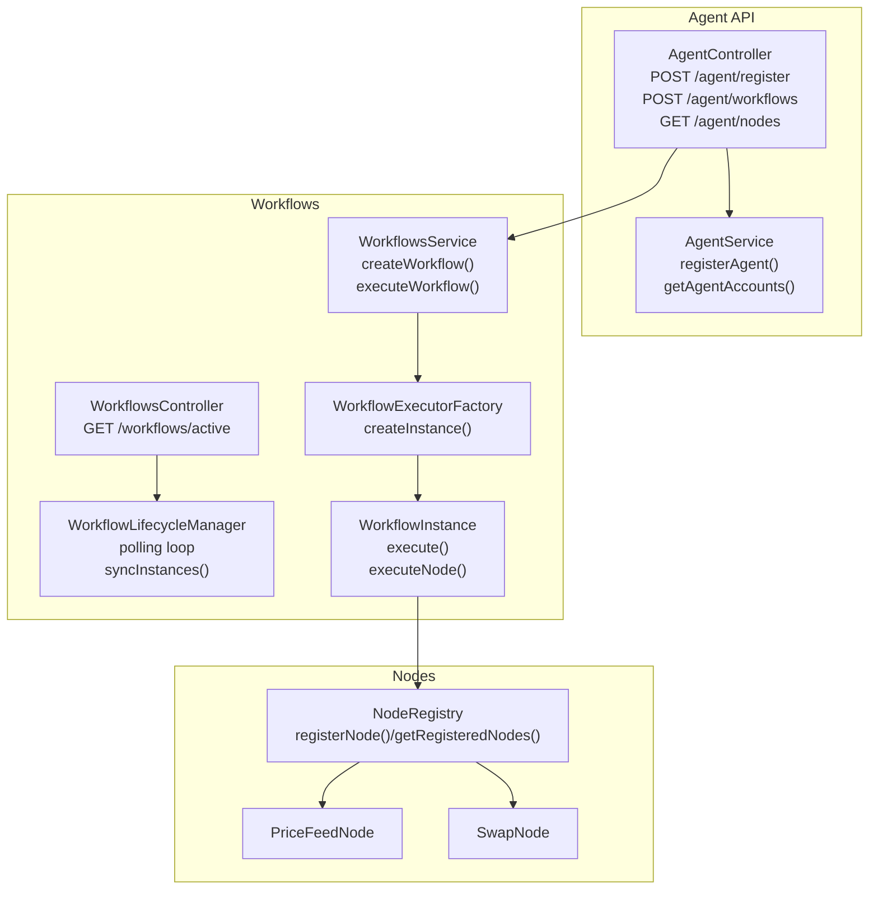
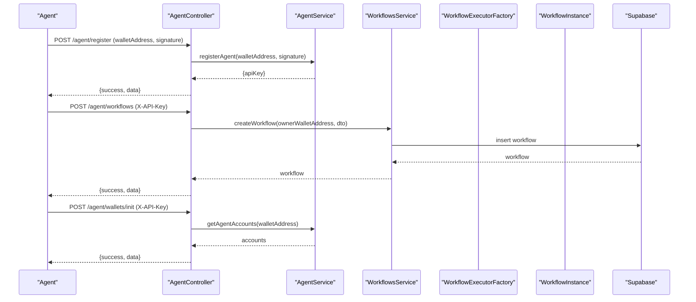
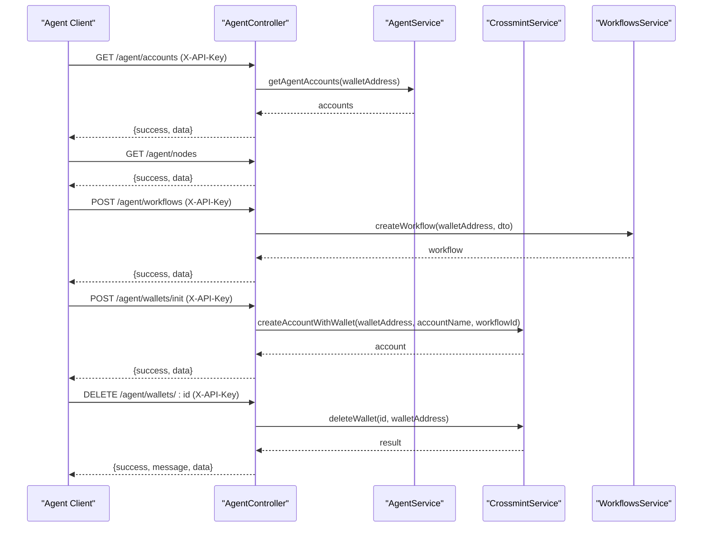
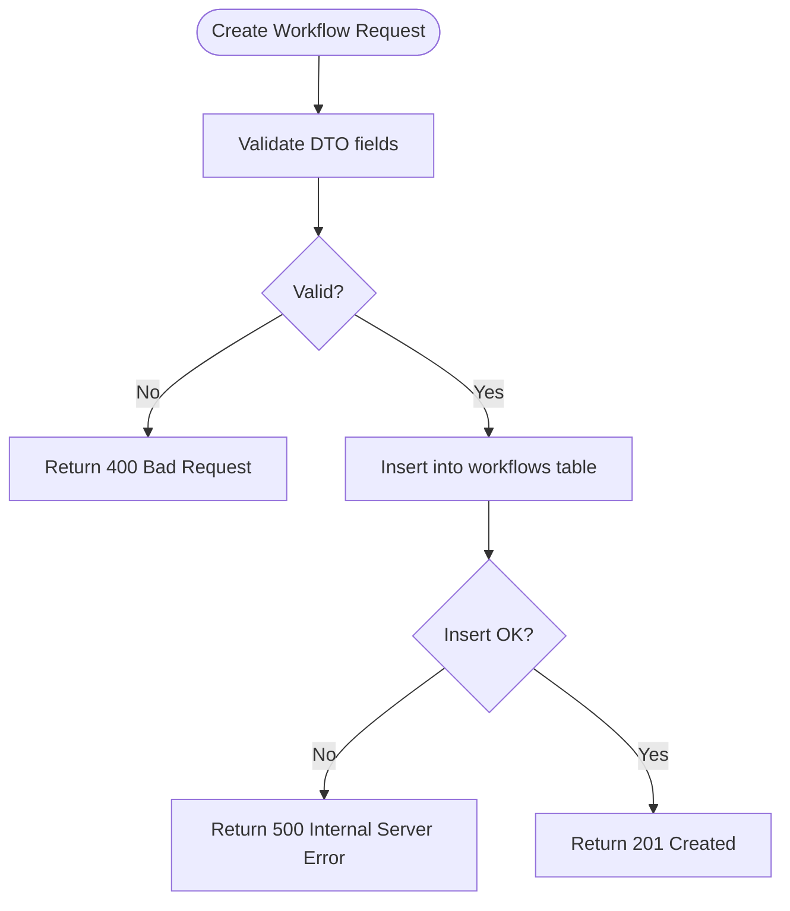
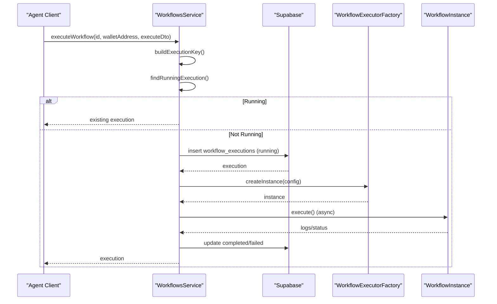
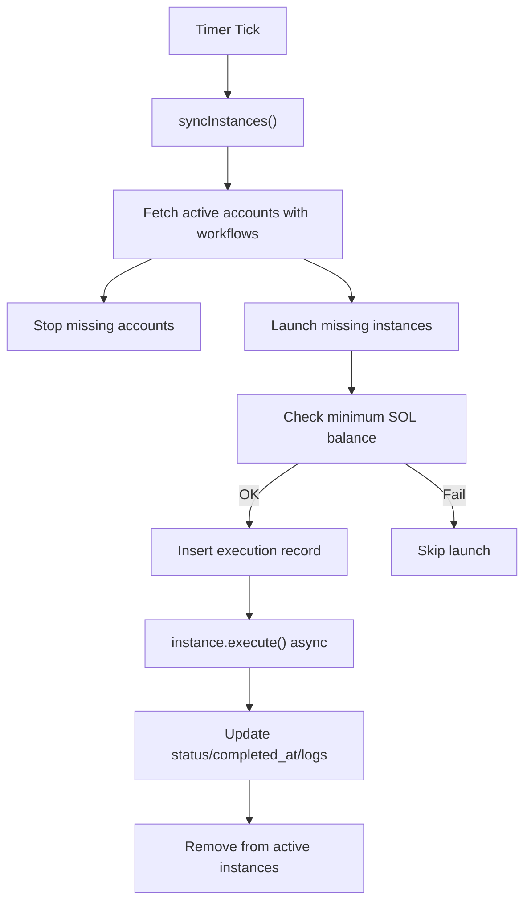
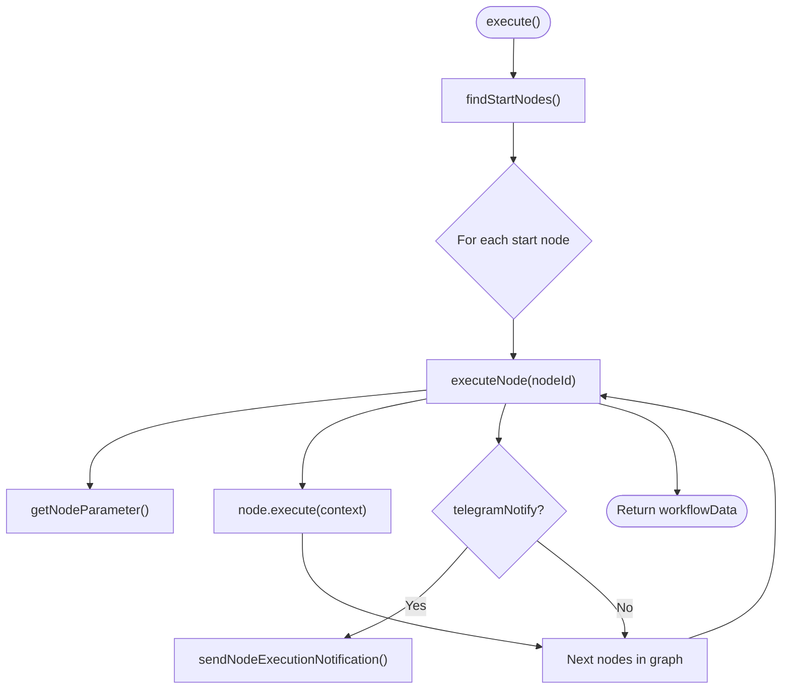
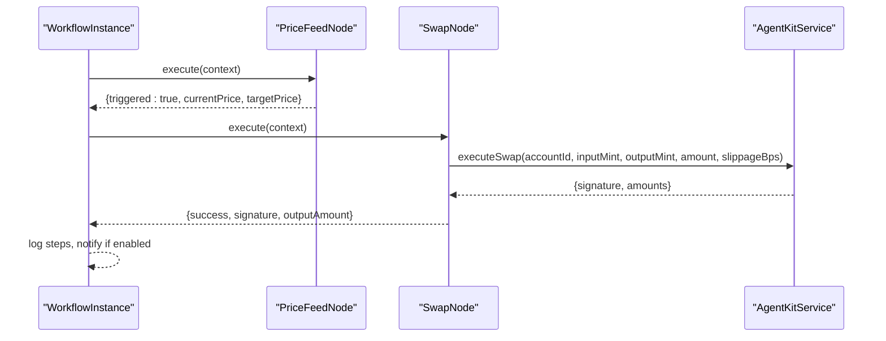
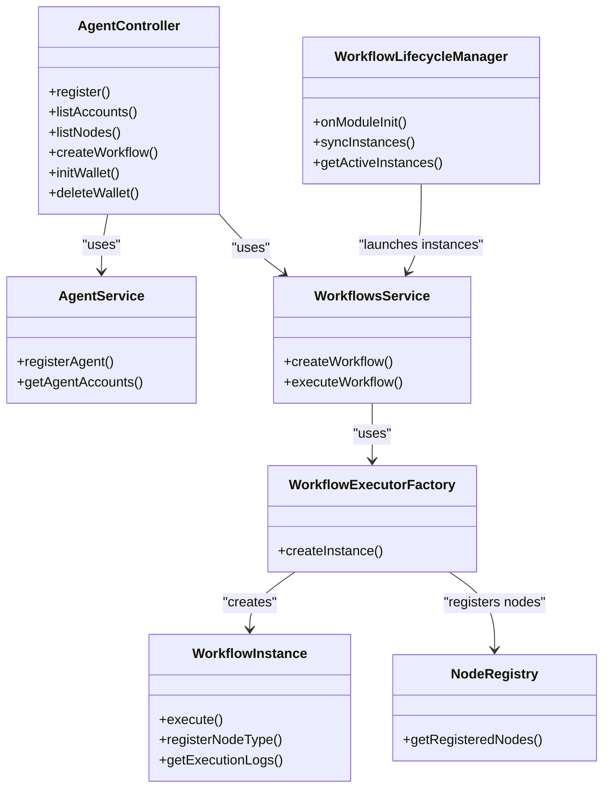

# Agent Workflow Integration

<cite>
**Referenced Files in This Document**
- [agent.controller.ts](file://src/agent/agent.controller.ts)
- [agent.service.ts](file://src/agent/agent.service.ts)
- [agent-register.dto.ts](file://src/agent/dto/agent-register.dto.ts)
- [agent-init-wallet.dto.ts](file://src/agent/dto/agent-init-wallet.dto.ts)
- [workflows.controller.ts](file://src/workflows/workflows.controller.ts)
- [workflows.service.ts](file://src/workflows/workflows.service.ts)
- [workflow-lifecycle.service.ts](file://src/workflows/workflow-lifecycle.service.ts)
- [workflow-executor.factory.ts](file://src/workflows/workflow-executor.factory.ts)
- [workflow-instance.ts](file://src/workflows/workflow-instance.ts)
- [workflow-types.ts](file://src/web3/workflow-types.ts)
- [node-registry.ts](file://src/web3/nodes/node-registry.ts)
- [price-feed.node.ts](file://src/web3/nodes/price-feed.node.ts)
- [swap.node.ts](file://src/web3/nodes/swap.node.ts)
- [20260129000000_update_schema_v2.sql](file://supabase/migrations/20260129000000_update_schema_v2.sql)
</cite>

## Table of Contents
1. [Introduction](#introduction)
2. [Project Structure](#project-structure)
3. [Core Components](#core-components)
4. [Architecture Overview](#architecture-overview)
5. [Detailed Component Analysis](#detailed-component-analysis)
6. [Dependency Analysis](#dependency-analysis)
7. [Performance Considerations](#performance-considerations)
8. [Troubleshooting Guide](#troubleshooting-guide)
9. [Conclusion](#conclusion)
10. [Appendices](#appendices)

## Introduction
This document explains how agents programmatically create, execute, and manage workflows through dedicated controller endpoints and the integrated workflow engine. It covers authorization via API keys, execution context injection, parameter validation, monitoring, and error handling. It also details workflow isolation, resource management, and performance considerations for agent-driven automation, with practical examples and integration patterns.

## Project Structure
The agent workflow integration spans three primary areas:
- Agent API: registration, wallet/account management, and workflow creation
- Workflow Engine: lifecycle management, execution orchestration, and persistence
- Node Ecosystem: pluggable nodes implementing workflow steps (e.g., price monitoring, swaps)

**Diagram sources**
- [agent.controller.ts:23-111](file://src/agent/agent.controller.ts#L23-L111)
- [agent.service.ts:15-77](file://src/agent/agent.service.ts#L15-L77)
- [workflows.controller.ts:8-28](file://src/workflows/workflows.controller.ts#L8-L28)
- [workflows.service.ts:60-216](file://src/workflows/workflows.service.ts#L60-L216)
- [workflow-lifecycle.service.ts:12-343](file://src/workflows/workflow-lifecycle.service.ts#L12-L343)
- [workflow-executor.factory.ts:9-42](file://src/workflows/workflow-executor.factory.ts#L9-L42)
- [workflow-instance.ts:33-314](file://src/workflows/workflow-instance.ts#L33-L314)
- [node-registry.ts:7-47](file://src/web3/nodes/node-registry.ts#L7-L47)
- [price-feed.node.ts:5-133](file://src/web3/nodes/price-feed.node.ts#L5-L133)
- [swap.node.ts:49-209](file://src/web3/nodes/swap.node.ts#L49-L209)

**Section sources**
- [agent.controller.ts:23-111](file://src/agent/agent.controller.ts#L23-L111)
- [workflows.controller.ts:8-28](file://src/workflows/workflows.controller.ts#L8-L28)
- [workflow-lifecycle.service.ts:12-343](file://src/workflows/workflow-lifecycle.service.ts#L12-L343)
- [workflow-executor.factory.ts:9-42](file://src/workflows/workflow-executor.factory.ts#L9-L42)
- [workflow-instance.ts:33-314](file://src/workflows/workflow-instance.ts#L33-L314)
- [node-registry.ts:7-47](file://src/web3/nodes/node-registry.ts#L7-L47)

## Core Components
- AgentController: Exposes endpoints for agent registration, workflow creation, node discovery, and wallet/account lifecycle.
- AgentService: Handles agent registration with wallet signature verification and API key rotation.
- WorkflowsService: Creates workflows and executes them, managing concurrency and persistence.
- WorkflowLifecycleManager: Runs a polling loop to start and manage workflow instances for active accounts.
- WorkflowExecutorFactory: Builds WorkflowInstance with injected services and registers all node types.
- WorkflowInstance: Executes the workflow graph, manages execution logs, and supports notifications.
- Node Registry and Nodes: Pluggable node ecosystem enabling triggers and actions (e.g., price feeds, swaps).

**Section sources**
- [agent.controller.ts:23-111](file://src/agent/agent.controller.ts#L23-L111)
- [agent.service.ts:15-77](file://src/agent/agent.service.ts#L15-L77)
- [workflows.service.ts:60-216](file://src/workflows/workflows.service.ts#L60-L216)
- [workflow-lifecycle.service.ts:12-343](file://src/workflows/workflow-lifecycle.service.ts#L12-L343)
- [workflow-executor.factory.ts:9-42](file://src/workflows/workflow-executor.factory.ts#L9-L42)
- [workflow-instance.ts:33-314](file://src/workflows/workflow-instance.ts#L33-L314)
- [node-registry.ts:7-47](file://src/web3/nodes/node-registry.ts#L7-L47)

## Architecture Overview
Agent-driven workflow execution follows a clear separation of concerns:
- Authorization: Agents authenticate via wallet signatures and receive API keys.
- Creation: Agents submit workflow definitions via the agent controller.
- Execution: WorkflowsService persists and starts asynchronous execution; WorkflowExecutorFactory constructs instances and injects services.
- Lifecycle: WorkflowLifecycleManager periodically synchronizes active accounts and launches instances with resource checks.
- Monitoring: Execution records are stored with logs and status; optional Telegram notifications are sent.

**Diagram sources**
- [agent.controller.ts:30-99](file://src/agent/agent.controller.ts#L30-L99)
- [agent.service.ts:15-77](file://src/agent/agent.service.ts#L15-L77)
- [workflows.service.ts:60-81](file://src/workflows/workflows.service.ts#L60-L81)

## Detailed Component Analysis

### Agent Controller Endpoints
- Registration: Validates wallet signature and issues API key.
- Accounts: Lists agent’s active accounts.
- Nodes: Returns available node types and parameters.
- Workflow Creation: Creates a workflow owned by the agent.
- Wallet Init/Delete: Creates or closes Crossmint wallets bound to agent accounts.

**Diagram sources**
- [agent.controller.ts:42-109](file://src/agent/agent.controller.ts#L42-L109)
- [agent.service.ts:61-77](file://src/agent/agent.service.ts#L61-L77)

**Section sources**
- [agent.controller.ts:42-109](file://src/agent/agent.controller.ts#L42-L109)
- [agent-register.dto.ts:4-24](file://src/agent/dto/agent-register.dto.ts#L4-L24)
- [agent-init-wallet.dto.ts:4-21](file://src/agent/dto/agent-init-wallet.dto.ts#L4-L21)

### Workflow Creation and Authorization
- Authorization: All agent endpoints guarded by API key; registration uses wallet challenge flow.
- Validation: CreateWorkflowDto enforces name, optional description, and definition shape.
- Persistence: WorkflowsService inserts workflow metadata and sets privacy flag.

**Diagram sources**
- [workflows.service.ts:60-81](file://src/workflows/workflows.service.ts#L60-L81)
- [create-workflow.dto.ts:4-63](file://src/workflows/dto/create-workflow.dto.ts#L4-L63)

**Section sources**
- [agent.controller.ts:30-40](file://src/agent/agent.controller.ts#L30-L40)
- [agent.service.ts:15-59](file://src/agent/agent.service.ts#L15-L59)
- [workflows.service.ts:60-81](file://src/workflows/workflows.service.ts#L60-L81)
- [create-workflow.dto.ts:4-63](file://src/workflows/dto/create-workflow.dto.ts#L4-L63)

### Execution Context and Concurrency Control
- Concurrency: WorkflowsService tracks in-flight executions per workflow/account to prevent overlapping runs.
- Execution Record: A running record is inserted with snapshot and initial logs.
- Context Injection: WorkflowInstance exposes getNodeParameter, getInputData, and helpers; special parameters inject services and wallet addresses.
- Fire-and-forget: Execution continues asynchronously; completion/failure updates persisted state.

**Diagram sources**
- [workflows.service.ts:83-216](file://src/workflows/workflows.service.ts#L83-L216)
- [workflow-executor.factory.ts:17-34](file://src/workflows/workflow-executor.factory.ts#L17-L34)
- [workflow-instance.ts:94-151](file://src/workflows/workflow-instance.ts#L94-L151)

**Section sources**
- [workflows.service.ts:14-18](file://src/workflows/workflows.service.ts#L14-L18)
- [workflows.service.ts:83-107](file://src/workflows/workflows.service.ts#L83-L107)
- [workflows.service.ts:110-129](file://src/workflows/workflows.service.ts#L110-L129)
- [workflow-instance.ts:188-213](file://src/workflows/workflow-instance.ts#L188-L213)

### Lifecycle Management and Auto-Execution
- Polling Loop: WorkflowLifecycleManager periodically syncs active accounts and starts instances.
- Resource Check: Ensures minimum SOL balance before launching auto-executions.
- Instance Lifecycle: Creates execution records, registers instance, executes asynchronously, and cleans up.

**Diagram sources**
- [workflow-lifecycle.service.ts:48-117](file://src/workflows/workflow-lifecycle.service.ts#L48-L117)
- [workflow-lifecycle.service.ts:238-342](file://src/workflows/workflow-lifecycle.service.ts#L238-L342)

**Section sources**
- [workflow-lifecycle.service.ts:25-65](file://src/workflows/workflow-lifecycle.service.ts#L25-L65)
- [workflow-lifecycle.service.ts:70-117](file://src/workflows/workflow-lifecycle.service.ts#L70-L117)
- [workflow-lifecycle.service.ts:216-229](file://src/workflows/workflow-lifecycle.service.ts#L216-L229)
- [workflow-lifecycle.service.ts:258-276](file://src/workflows/workflow-lifecycle.service.ts#L258-L276)

### Node Execution Model
- Graph Traversal: WorkflowInstance finds start nodes (no incoming connections), executes nodes, and propagates outputs.
- Parameter Resolution: getNodeParameter resolves node parameters, injects services, and optionally supplies wallet address.
- Notifications: Optional Telegram notifications per node or type.

**Diagram sources**
- [workflow-instance.ts:94-151](file://src/workflows/workflow-instance.ts#L94-L151)
- [workflow-instance.ts:162-258](file://src/workflows/workflow-instance.ts#L162-L258)
- [workflow-instance.ts:188-213](file://src/workflows/workflow-instance.ts#L188-L213)

**Section sources**
- [workflow-instance.ts:298-312](file://src/workflows/workflow-instance.ts#L298-L312)
- [workflow-instance.ts:277-296](file://src/workflows/workflow-instance.ts#L277-L296)
- [workflow-instance.ts:188-213](file://src/workflows/workflow-instance.ts#L188-L213)

### Example Scenarios

#### Scenario 1: Price Triggered Swap
- Workflow Definition: A price feed node monitors a target price; upon reaching threshold, a swap node executes a trade using a Crossmint account.
- Execution Context: The swap node resolves the account ID and uses AgentKitService to perform the swap; optional notifications are sent.

**Diagram sources**
- [price-feed.node.ts:66-131](file://src/web3/nodes/price-feed.node.ts#L66-L131)
- [swap.node.ts:102-207](file://src/web3/nodes/swap.node.ts#L102-L207)
- [workflow-instance.ts:224-243](file://src/workflows/workflow-instance.ts#L224-L243)

**Section sources**
- [price-feed.node.ts:66-131](file://src/web3/nodes/price-feed.node.ts#L66-L131)
- [swap.node.ts:102-207](file://src/web3/nodes/swap.node.ts#L102-L207)

#### Scenario 2: Auto-Execution on Account Creation
- Lifecycle Manager detects a newly created active account with an assigned workflow and launches an instance after verifying minimum SOL balance.

**Section sources**
- [workflow-lifecycle.service.ts:160-198](file://src/workflows/workflow-lifecycle.service.ts#L160-L198)
- [workflow-lifecycle.service.ts:238-342](file://src/workflows/workflow-lifecycle.service.ts#L238-L342)

### Status Tracking and Monitoring
- Active Instances: The WorkflowsController endpoint lists in-memory active instances managed by the lifecycle manager.
- Execution Records: WorkflowsService persists execution snapshots, logs, and status; includes completion timestamps and error messages.

**Section sources**
- [workflows.controller.ts:11-26](file://src/workflows/workflows.controller.ts#L11-L26)
- [workflows.service.ts:177-208](file://src/workflows/workflows.service.ts#L177-L208)
- [workflow-lifecycle.service.ts:304-335](file://src/workflows/workflow-lifecycle.service.ts#L304-L335)

## Dependency Analysis
The following diagram highlights key dependencies among components involved in agent workflow integration.

**Diagram sources**
- [agent.controller.ts:24-28](file://src/agent/agent.controller.ts#L24-L28)
- [agent.service.ts:15-77](file://src/agent/agent.service.ts#L15-L77)
- [workflows.service.ts:60-216](file://src/workflows/workflows.service.ts#L60-L216)
- [workflow-lifecycle.service.ts:12-343](file://src/workflows/workflow-lifecycle.service.ts#L12-L343)
- [workflow-executor.factory.ts:9-42](file://src/workflows/workflow-executor.factory.ts#L9-L42)
- [workflow-instance.ts:33-314](file://src/workflows/workflow-instance.ts#L33-L314)
- [node-registry.ts:19-21](file://src/web3/nodes/node-registry.ts#L19-L21)

**Section sources**
- [agent.controller.ts:24-28](file://src/agent/agent.controller.ts#L24-L28)
- [workflows.service.ts:60-216](file://src/workflows/workflows.service.ts#L60-L216)
- [workflow-lifecycle.service.ts:12-343](file://src/workflows/workflow-lifecycle.service.ts#L12-L343)
- [workflow-executor.factory.ts:9-42](file://src/workflows/workflow-executor.factory.ts#L9-L42)
- [workflow-instance.ts:33-314](file://src/workflows/workflow-instance.ts#L33-L314)
- [node-registry.ts:19-21](file://src/web3/nodes/node-registry.ts#L19-L21)

## Performance Considerations
- Concurrency Control: In-flight execution keys prevent overlapping runs, reducing contention and wasted resources.
- Asynchronous Execution: Long-running workflows run fire-and-forget from API perspective; updates are persisted upon completion.
- Polling Interval: Lifecycle manager uses a fixed polling interval to balance responsiveness and load.
- Indexing: Schema migrations add indexes on owner and workflow ID to accelerate execution queries.
- Resource Checks: Auto-launch validates minimum SOL balance to avoid failed transactions.

**Section sources**
- [workflows.service.ts:14-18](file://src/workflows/workflows.service.ts#L14-L18)
- [workflows.service.ts:172-211](file://src/workflows/workflows.service.ts#L172-L211)
- [workflow-lifecycle.service.ts:17-55](file://src/workflows/workflow-lifecycle.service.ts#L17-L55)
- [20260129000000_update_schema_v2.sql:29-34](file://supabase/migrations/20260129000000_update_schema_v2.sql#L29-L34)

## Troubleshooting Guide
Common issues and resolutions:
- Authentication Failures: Registration requires a valid wallet signature; invalid or expired challenges cause unauthorized errors.
- API Key Issues: All agent endpoints require X-API-Key; missing or invalid keys return unauthorized responses.
- Duplicate or Overlapping Executions: Concurrency guard prevents starting a new run if an identical execution is already running or inflight.
- Execution Failures: Errors during execution are captured, logged, and persisted with error messages; inspect execution logs for details.
- Auto-Execution Skipped: Lifecycle manager skips launches if minimum SOL balance is not met; top up the Crossmint wallet address.
- Node Parameter Errors: Ensure node parameters match expected types and required fields; service injection is handled automatically.

**Section sources**
- [agent.controller.ts:30-40](file://src/agent/agent.controller.ts#L30-L40)
- [agent.service.ts:15-59](file://src/agent/agent.service.ts#L15-L59)
- [workflows.service.ts:94-106](file://src/workflows/workflows.service.ts#L94-L106)
- [workflows.service.ts:191-208](file://src/workflows/workflows.service.ts#L191-L208)
- [workflow-lifecycle.service.ts:246-255](file://src/workflows/workflow-lifecycle.service.ts#L246-L255)

## Conclusion
The agent workflow integration provides a robust, extensible framework for programmatic automation. Agents authenticate securely, define workflows declaratively, and execute them with strong isolation and monitoring. The lifecycle manager ensures continuous operation for active accounts, while the node registry enables flexible composition of triggers and actions. Together, these components support reliable, observable, and scalable agent-driven automation.

## Appendices

### API Endpoints Summary
- Agent
  - POST /agent/register: Register agent and receive API key
  - GET /agent/accounts: List agent accounts
  - GET /agent/nodes: List available node types and parameters
  - POST /agent/workflows: Create a workflow
  - POST /agent/wallets/init: Create Crossmint account
  - DELETE /agent/wallets/:id: Close account and withdraw assets
- Workflows
  - GET /workflows/active: List active workflow instances

**Section sources**
- [agent.controller.ts:30-109](file://src/agent/agent.controller.ts#L30-L109)
- [workflows.controller.ts:11-26](file://src/workflows/workflows.controller.ts#L11-L26)

### Data Models Overview
- WorkflowDefinition: Nodes and connections forming a directed acyclic graph.
- Node Types: Implement INodeType with description and execute method.
- Execution Logs: Structured logs per node with inputs, outputs, and timing.

**Section sources**
- [workflow-types.ts:82-91](file://src/web3/workflow-types.ts#L82-L91)
- [workflow-types.ts:12-15](file://src/web3/workflow-types.ts#L12-L15)
- [workflow-instance.ts:215-231](file://src/workflows/workflow-instance.ts#L215-L231)