# Architecture Overview

<cite>
**Referenced Files in This Document**
- [src/app.module.ts](file://src/app.module.ts)
- [src/main.ts](file://src/main.ts)
- [src/auth/auth.module.ts](file://src/auth/auth.module.ts)
- [src/web3/web3.module.ts](file://src/web3/web3.module.ts)
- [src/workflows/workflows.module.ts](file://src/workflows/workflows.module.ts)
- [src/database/database.module.ts](file://src/database/database.module.ts)
- [src/workflows/workflow-executor.factory.ts](file://src/workflows/workflow-executor.factory.ts)
- [src/web3/nodes/node-registry.ts](file://src/web3/nodes/node-registry.ts)
- [src/workflows/workflow-lifecycle.service.ts](file://src/workflows/workflow-lifecycle.service.ts)
- [src/crossmint/crossmint.module.ts](file://src/crossmint/crossmint.module.ts)
- [src/telegram/telegram.module.ts](file://src/telegram/telegram.module.ts)
- [src/agent/agent.module.ts](file://src/agent/agent.module.ts)
- [src/config/configuration.ts](file://src/config/configuration.ts)
- [src/database/supabase.service.ts](file://src/database/supabase.service.ts)
- [src/web3/services/agent-kit.service.ts](file://src/web3/services/agent-kit.service.ts)
- [src/common/interceptors/logging.interceptor.ts](file://src/common/interceptors/logging.interceptor.ts)
- [src/common/guards/api-key.guard.ts](file://src/common/guards/api-key.guard.ts)
- [src/common/decorators/current-user.decorator.ts](file://src/common/decorators/current-user.decorator.ts)
</cite>

## Table of Contents
1. [Introduction](#introduction)
2. [Project Structure](#project-structure)
3. [Core Components](#core-components)
4. [Architecture Overview](#architecture-overview)
5. [Detailed Component Analysis](#detailed-component-analysis)
6. [Dependency Analysis](#dependency-analysis)
7. [Performance Considerations](#performance-considerations)
8. [Troubleshooting Guide](#troubleshooting-guide)
9. [Conclusion](#conclusion)
10. [Appendices](#appendices)

## Introduction
This document describes the architectural design and component organization of PinTool’s backend built with NestJS. The system follows a modular, layered architecture with clear separation of concerns across authentication, agent management, Crossmint integration, workflow engine, Telegram notifications, and Web3 blockchain infrastructure. It emphasizes service-layer business logic, robust cross-cutting concerns (security, observability, and database access), and scalable deployment topology.

## Project Structure
The application bootstraps through a central module that aggregates feature modules. Global middleware and configuration are applied during startup. The system is composed of:
- AppModule orchestrator that imports and wires all feature modules
- Feature modules for authentication, agent management, workflows, Telegram, Crossmint, and Web3
- A global database module providing a shared Supabase client
- Configuration module supplying environment-driven settings

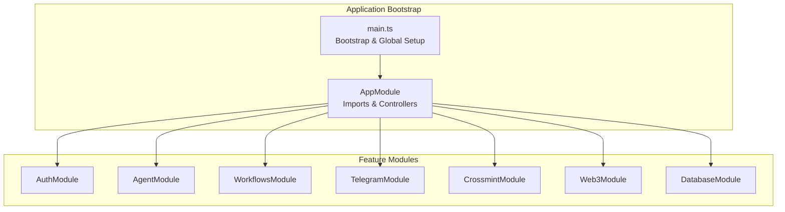

**Diagram sources**
- [src/app.module.ts:15-32](file://src/app.module.ts#L15-L32)
- [src/main.ts:9-37](file://src/main.ts#L9-L37)

**Section sources**
- [src/app.module.ts:1-33](file://src/app.module.ts#L1-L33)
- [src/main.ts:1-81](file://src/main.ts#L1-L81)

## Core Components
- Authentication: Wallet-based challenge-response authentication with DTOs and controller/service wiring.
- Agent Management: Agent controller/service coordinating with Crossmint and Workflows.
- Crossmint Integration: Crossmint module providing wallet adapters and server-side API key handling.
- Workflow Engine: Factory-based executor and lifecycle manager orchestrating workflow instances and node registry.
- Telegram Notifications: Bot and notifier services integrated into workflows.
- Web3 Infrastructure: AgentKit service managing Crossmint wallets, RPC access, rate limiting, retries, and external API interactions.
- Database Layer: Global Supabase service with RLS context support and centralized client access.

**Section sources**
- [src/auth/auth.module.ts:1-11](file://src/auth/auth.module.ts#L1-L11)
- [src/agent/agent.module.ts:1-15](file://src/agent/agent.module.ts#L1-L15)
- [src/crossmint/crossmint.module.ts:1-16](file://src/crossmint/crossmint.module.ts#L1-L16)
- [src/workflows/workflows.module.ts:1-17](file://src/workflows/workflows.module.ts#L1-L17)
- [src/telegram/telegram.module.ts:1-18](file://src/telegram/telegram.module.ts#L1-L18)
- [src/web3/web3.module.ts:1-13](file://src/web3/web3.module.ts#L1-L13)
- [src/database/database.module.ts:1-10](file://src/database/database.module.ts#L1-L10)

## Architecture Overview
The system is structured around a central AppModule that imports feature modules. The WorkflowsModule depends on Telegram, Crossmint, and Web3 modules. The Web3Module depends on Database and Crossmint modules. The DatabaseModule is globally provided. Configuration is loaded via a configuration provider.

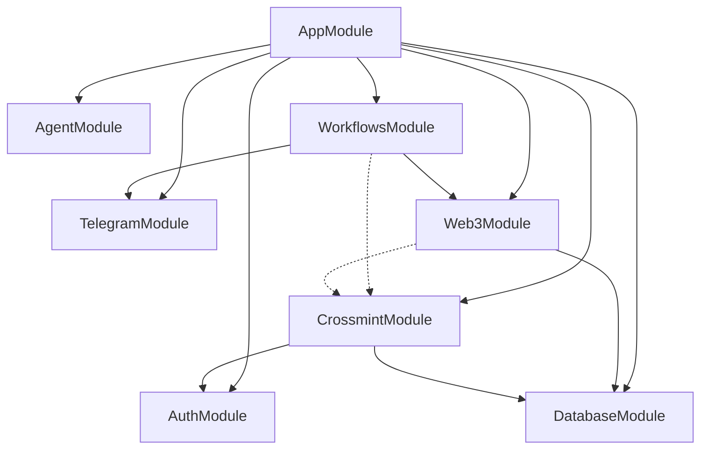

**Diagram sources**
- [src/app.module.ts:15-32](file://src/app.module.ts#L15-L32)
- [src/workflows/workflows.module.ts:10-16](file://src/workflows/workflows.module.ts#L10-L16)
- [src/web3/web3.module.ts:7-12](file://src/web3/web3.module.ts#L7-L12)
- [src/crossmint/crossmint.module.ts:9-16](file://src/crossmint/crossmint.module.ts#L9-L16)
- [src/telegram/telegram.module.ts:6-11](file://src/telegram/telegram.module.ts#L6-L11)
- [src/database/database.module.ts:4-9](file://src/database/database.module.ts#L4-L9)

## Detailed Component Analysis

### Authentication Module
- Purpose: Provides wallet-based authentication using challenge-response and wallet signatures.
- Structure: Controller and service with DTOs for challenge requests.
- Integration: Exposed via AuthModule and consumed by other modules (e.g., Crossmint).

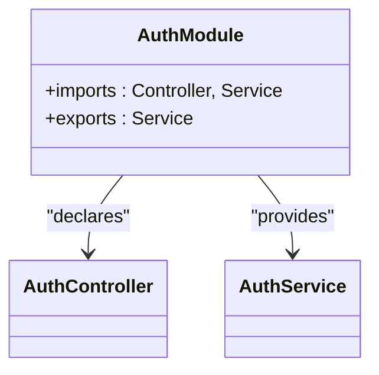

**Diagram sources**
- [src/auth/auth.module.ts:1-11](file://src/auth/auth.module.ts#L1-L11)

**Section sources**
- [src/auth/auth.module.ts:1-11](file://src/auth/auth.module.ts#L1-L11)

### Agent Management Module
- Purpose: Agent controller/service coordinating agent-related operations.
- Dependencies: Uses AuthModule, CrossmintModule, and WorkflowsModule.

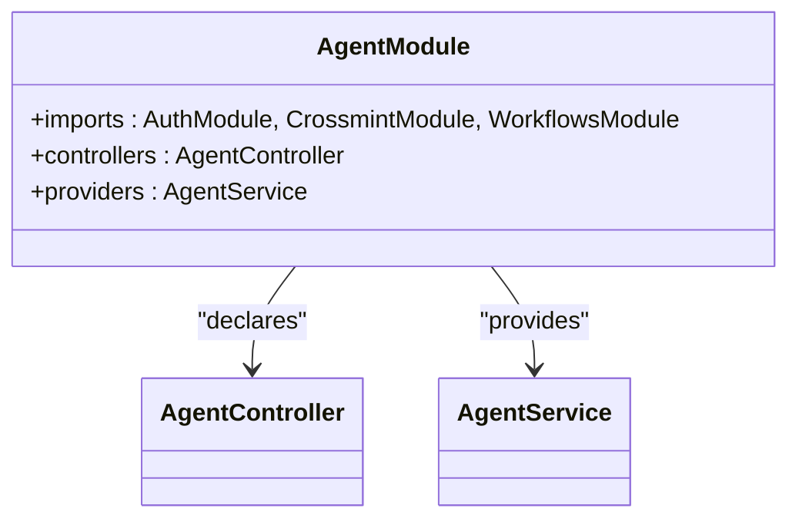

**Diagram sources**
- [src/agent/agent.module.ts:8-15](file://src/agent/agent.module.ts#L8-L15)

**Section sources**
- [src/agent/agent.module.ts:1-15](file://src/agent/agent.module.ts#L1-L15)

### Crossmint Integration Module
- Purpose: Integrates Crossmint wallet adapters and server-side API key handling.
- Dependencies: Depends on AuthModule, DatabaseModule, and WorkflowsModule; exports CrossmintService.

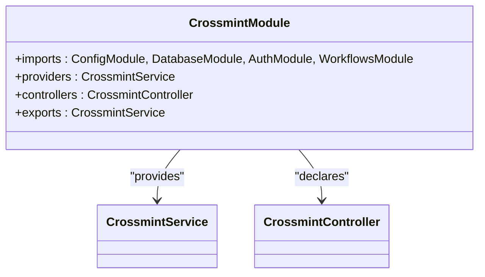

**Diagram sources**
- [src/crossmint/crossmint.module.ts:9-16](file://src/crossmint/crossmint.module.ts#L9-L16)

**Section sources**
- [src/crossmint/crossmint.module.ts:1-16](file://src/crossmint/crossmint.module.ts#L1-L16)

### Telegram Notifications Module
- Purpose: Telegram bot and notifier services for workflow notifications.
- Lifecycle: Starts the bot on module initialization.

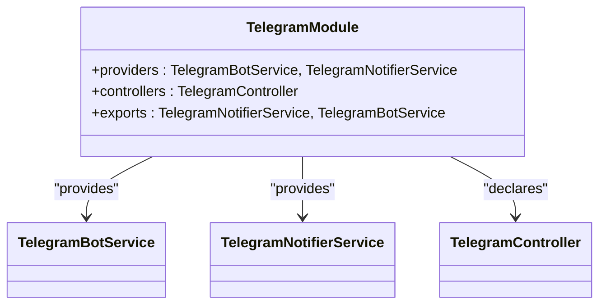

**Diagram sources**
- [src/telegram/telegram.module.ts:6-17](file://src/telegram/telegram.module.ts#L6-L17)

**Section sources**
- [src/telegram/telegram.module.ts:1-18](file://src/telegram/telegram.module.ts#L1-L18)

### Web3 Infrastructure Module
- Purpose: Provides connection management and AgentKit service for Crossmint wallets and external integrations.
- Dependencies: Imports DatabaseModule and uses CrossmintModule via forwardRef.

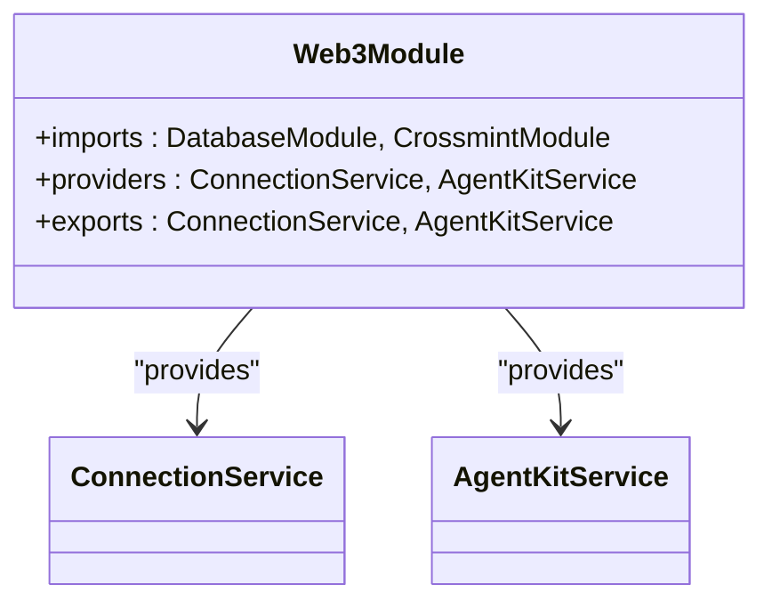

**Diagram sources**
- [src/web3/web3.module.ts:7-12](file://src/web3/web3.module.ts#L7-L12)

**Section sources**
- [src/web3/web3.module.ts:1-13](file://src/web3/web3.module.ts#L1-L13)

### Database Module
- Purpose: Global Supabase service providing a shared client and RLS context helper.

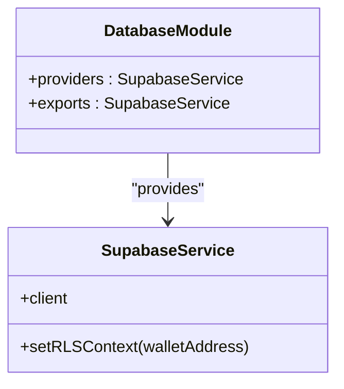

**Diagram sources**
- [src/database/database.module.ts:4-9](file://src/database/database.module.ts#L4-L9)
- [src/database/supabase.service.ts:6-41](file://src/database/supabase.service.ts#L6-L41)

**Section sources**
- [src/database/database.module.ts:1-10](file://src/database/database.module.ts#L1-L10)
- [src/database/supabase.service.ts:1-42](file://src/database/supabase.service.ts#L1-L42)

### Workflows Module
- Purpose: Orchestrates workflow execution lifecycle and integrates with Telegram and Web3.
- Dependencies: Imports TelegramModule, Web3Module; uses CrossmintModule via forwardRef.

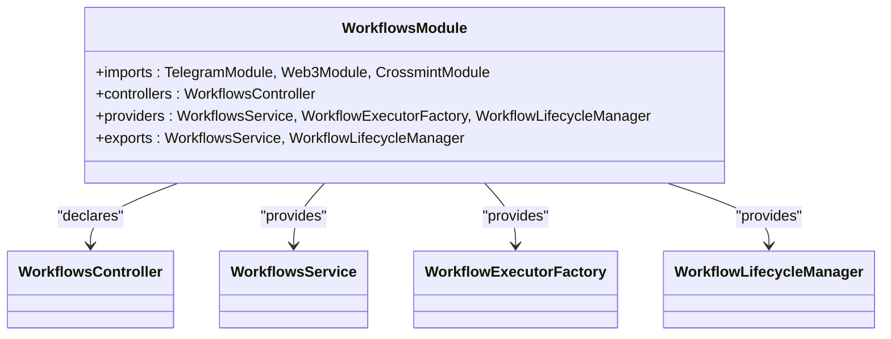

**Diagram sources**
- [src/workflows/workflows.module.ts:10-16](file://src/workflows/workflows.module.ts#L10-L16)

**Section sources**
- [src/workflows/workflows.module.ts:1-17](file://src/workflows/workflows.module.ts#L1-L17)

### Workflow Executor Factory Pattern
- Purpose: Creates WorkflowInstance with injected services and registers standard node types from the registry.
- Pattern: Factory pattern instantiates and configures workflow instances.

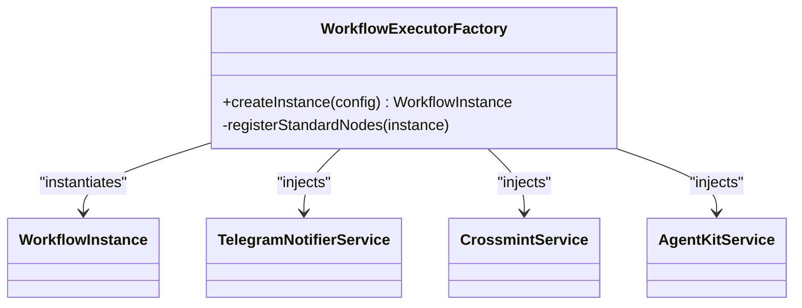

**Diagram sources**
- [src/workflows/workflow-executor.factory.ts:9-41](file://src/workflows/workflow-executor.factory.ts#L9-L41)

**Section sources**
- [src/workflows/workflow-executor.factory.ts:1-42](file://src/workflows/workflow-executor.factory.ts#L1-L42)

### Node Registry Pattern
- Purpose: Centralized registry of node types enabling dynamic registration and discovery.
- Pattern: Registry pattern maintains a map of node factories keyed by name.

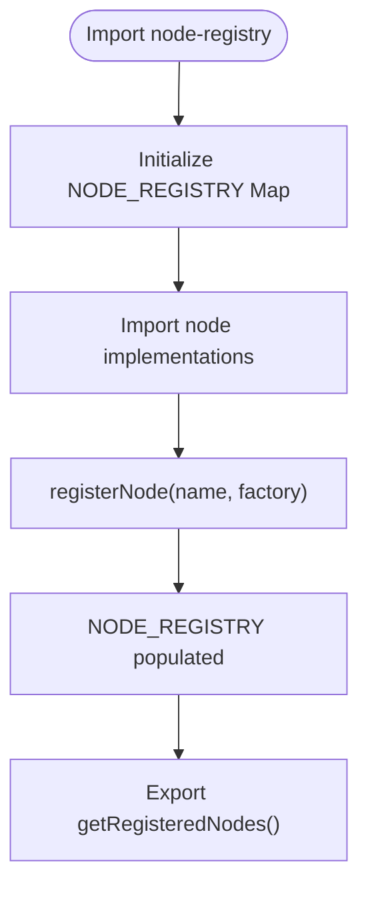

**Diagram sources**
- [src/web3/nodes/node-registry.ts:7-21](file://src/web3/nodes/node-registry.ts#L7-L21)
- [src/web3/nodes/node-registry.ts:24-47](file://src/web3/nodes/node-registry.ts#L24-L47)

**Section sources**
- [src/web3/nodes/node-registry.ts:1-47](file://src/web3/nodes/node-registry.ts#L1-L47)

### Workflow Lifecycle Manager
- Purpose: Polls active accounts, launches workflow instances, manages execution records, and handles completion/failure.
- Responsibilities: Periodic synchronization, instance lifecycle, balance checks, execution record updates.

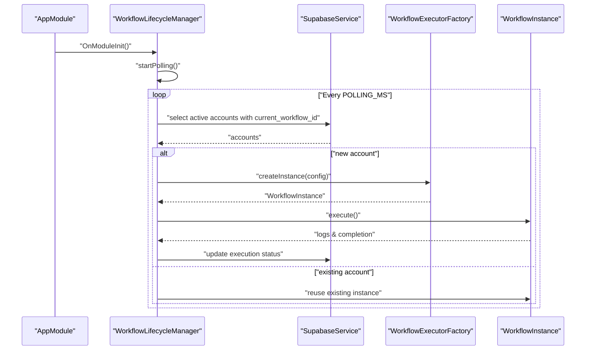

**Diagram sources**
- [src/workflows/workflow-lifecycle.service.ts:25-342](file://src/workflows/workflow-lifecycle.service.ts#L25-L342)
- [src/workflows/workflow-executor.factory.ts:22-34](file://src/workflows/workflow-executor.factory.ts#L22-L34)
- [src/database/supabase.service.ts:29-40](file://src/database/supabase.service.ts#L29-L40)

**Section sources**
- [src/workflows/workflow-lifecycle.service.ts:1-343](file://src/workflows/workflow-lifecycle.service.ts#L1-L343)

### Web3 AgentKit Service
- Purpose: Unified service for Crossmint wallet integration, RPC access, rate limiting, retries, and external API interactions (e.g., Jupiter).
- Features: Wallet retrieval per account, swap execution with retry and rate limiting, RPC URL management.

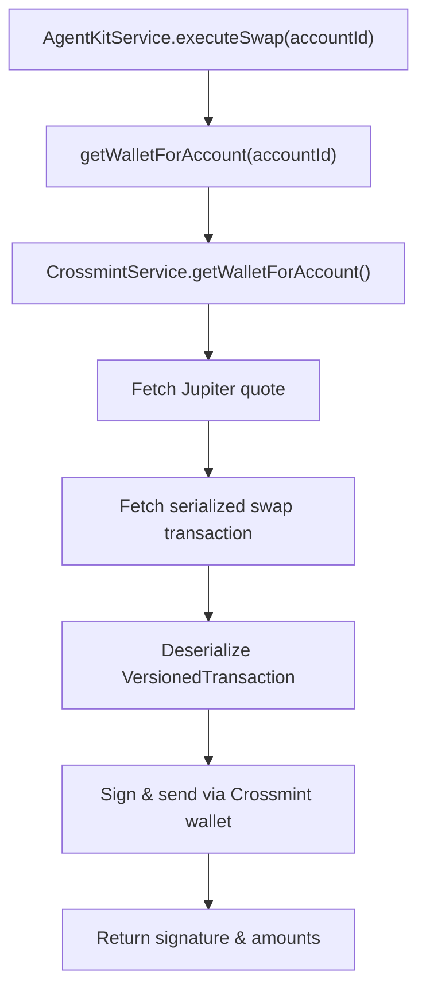

**Diagram sources**
- [src/web3/services/agent-kit.service.ts:99-161](file://src/web3/services/agent-kit.service.ts#L99-L161)

**Section sources**
- [src/web3/services/agent-kit.service.ts:1-163](file://src/web3/services/agent-kit.service.ts#L1-L163)

### Cross-Cutting Concerns

#### Security
- API Key Guard: Validates X-API-Key header against hashed keys stored in the database and attaches the associated wallet address to the request.
- Wallet Signature Authentication: Auth module supports wallet-based authentication flows.
- Database RLS: SupabaseService exposes a helper to set RLS context for wallet-scoped queries.

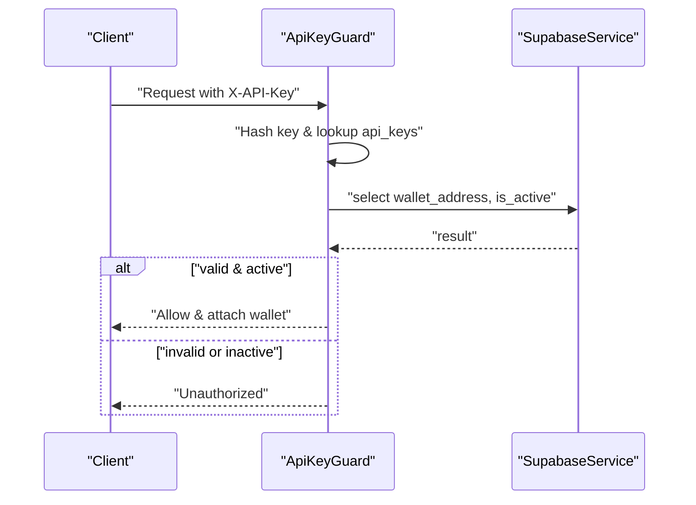

**Diagram sources**
- [src/common/guards/api-key.guard.ts:11-54](file://src/common/guards/api-key.guard.ts#L11-L54)
- [src/database/supabase.service.ts:33-40](file://src/database/supabase.service.ts#L33-L40)

**Section sources**
- [src/common/guards/api-key.guard.ts:1-56](file://src/common/guards/api-key.guard.ts#L1-L56)
- [src/common/decorators/current-user.decorator.ts:1-11](file://src/common/decorators/current-user.decorator.ts#L1-L11)
- [src/database/supabase.service.ts:1-42](file://src/database/supabase.service.ts#L1-L42)

#### Observability
- Logging Interceptor: Logs request method, URL, and response time for all requests.

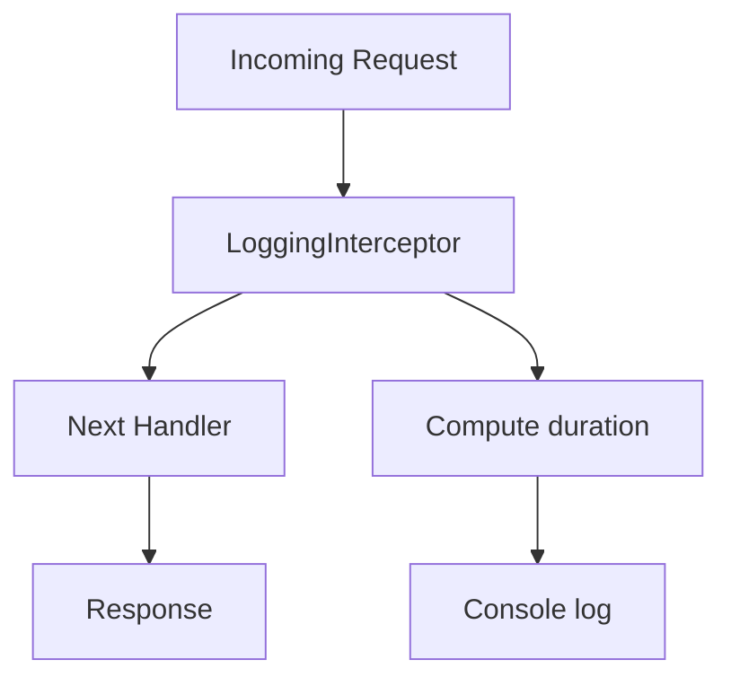

**Diagram sources**
- [src/common/interceptors/logging.interceptor.ts:7-18](file://src/common/interceptors/logging.interceptor.ts#L7-L18)

**Section sources**
- [src/common/interceptors/logging.interceptor.ts:1-20](file://src/common/interceptors/logging.interceptor.ts#L1-L20)

## Dependency Analysis
The module dependency graph reveals a clean separation of concerns:
- AppModule aggregates all modules.
- WorkflowsModule depends on TelegramModule, Web3Module, and CrossmintModule (via forwardRef).
- Web3Module depends on DatabaseModule and CrossmintModule (via forwardRef).
- CrossmintModule depends on AuthModule, DatabaseModule, and WorkflowsModule (via forwardRef).
- TelegramModule is standalone and starts a bot on initialization.
- DatabaseModule is global and exported for use across modules.

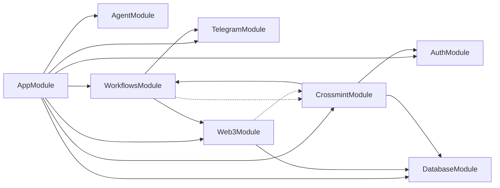

**Diagram sources**
- [src/app.module.ts:15-32](file://src/app.module.ts#L15-L32)
- [src/workflows/workflows.module.ts:10-16](file://src/workflows/workflows.module.ts#L10-L16)
- [src/web3/web3.module.ts:7-12](file://src/web3/web3.module.ts#L7-L12)
- [src/crossmint/crossmint.module.ts:9-16](file://src/crossmint/crossmint.module.ts#L9-L16)
- [src/telegram/telegram.module.ts:6-11](file://src/telegram/telegram.module.ts#L6-L11)
- [src/database/database.module.ts:4-9](file://src/database/database.module.ts#L4-L9)

**Section sources**
- [src/app.module.ts:1-33](file://src/app.module.ts#L1-L33)
- [src/workflows/workflows.module.ts:1-17](file://src/workflows/workflows.module.ts#L1-L17)
- [src/web3/web3.module.ts:1-13](file://src/web3/web3.module.ts#L1-L13)
- [src/crossmint/crossmint.module.ts:1-16](file://src/crossmint/crossmint.module.ts#L1-L16)
- [src/telegram/telegram.module.ts:1-18](file://src/telegram/telegram.module.ts#L1-L18)
- [src/database/database.module.ts:1-10](file://src/database/database.module.ts#L1-L10)

## Performance Considerations
- Rate limiting and retries: AgentKitService applies a limiter and exponential backoff for external API calls to prevent throttling and improve resilience.
- Polling cadence: WorkflowLifecycleManager uses a configurable polling interval to balance responsiveness and resource usage.
- Asynchronous execution: Workflow instances execute asynchronously with cleanup and DB status updates to avoid blocking the lifecycle manager.
- Connection pooling and client reuse: Supabase client is initialized once and reused across the application lifecycle.

[No sources needed since this section provides general guidance]

## Troubleshooting Guide
- Missing Supabase credentials: Initialization throws an error if URL or service key are missing.
- API key validation failures: ApiKeyGuard returns unauthorized for missing or invalid keys and logs warnings for failed metadata updates.
- Logging interceptor: Use console logs to track request durations and identify slow endpoints.
- Crossmint wallet availability: Ensure the account has a valid Crossmint wallet address and sufficient SOL balance before launching workflows.

**Section sources**
- [src/database/supabase.service.ts:15-17](file://src/database/supabase.service.ts#L15-L17)
- [src/common/guards/api-key.guard.ts:15-33](file://src/common/guards/api-key.guard.ts#L15-L33)
- [src/common/interceptors/logging.interceptor.ts:13-16](file://src/common/interceptors/logging.interceptor.ts#L13-L16)
- [src/workflows/workflow-lifecycle.service.ts:216-229](file://src/workflows/workflow-lifecycle.service.ts#L216-L229)

## Conclusion
PinTool’s architecture leverages NestJS modularity to cleanly separate concerns across authentication, agent management, Crossmint integration, workflow execution, Telegram notifications, and Web3 infrastructure. The factory and registry patterns enable extensible workflow execution, while service-layer separation ensures maintainable business logic. Cross-cutting concerns like API key validation, wallet signatures, logging, and database RLS are integrated consistently. The system is designed for scalability with configurable polling, rate limiting, and asynchronous execution.

[No sources needed since this section summarizes without analyzing specific files]

## Appendices

### System Context Diagram: Authentication to Blockchain Execution
This diagram shows the end-to-end flow from authentication through workflow execution to blockchain interactions.

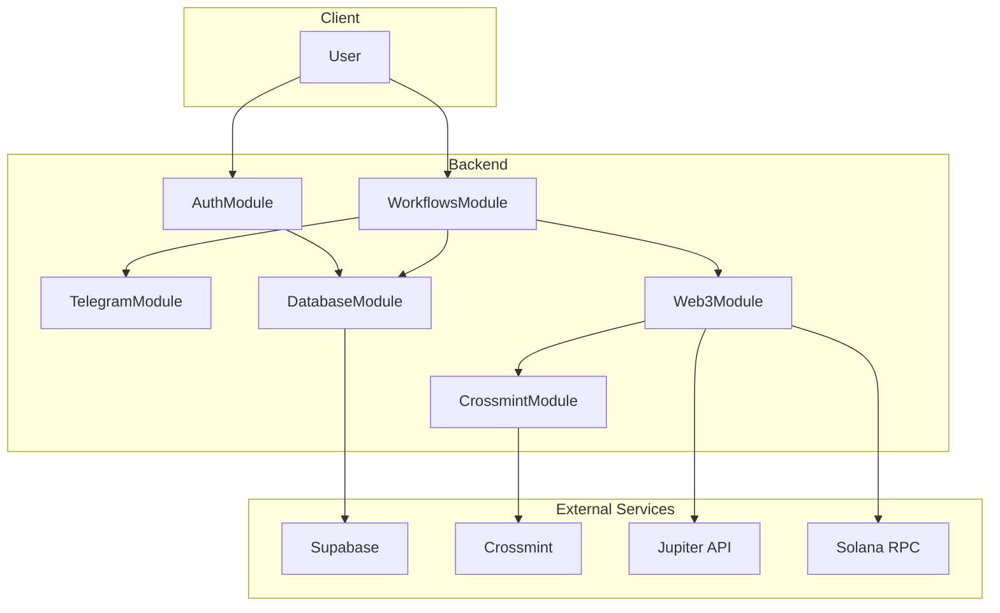

**Diagram sources**
- [src/auth/auth.module.ts:1-11](file://src/auth/auth.module.ts#L1-L11)
- [src/workflows/workflows.module.ts:10-16](file://src/workflows/workflows.module.ts#L10-L16)
- [src/telegram/telegram.module.ts:6-11](file://src/telegram/telegram.module.ts#L6-L11)
- [src/web3/web3.module.ts:7-12](file://src/web3/web3.module.ts#L7-L12)
- [src/crossmint/crossmint.module.ts:9-16](file://src/crossmint/crossmint.module.ts#L9-L16)
- [src/database/database.module.ts:4-9](file://src/database/database.module.ts#L4-L9)

### Infrastructure Requirements and Deployment Topology
- Environment variables: Supabase, Telegram, Solana RPC/WS, Crossmint, Helius, Lulo, Sanctum, and Pyth endpoints are configured via environment variables.
- Database: Supabase with Row Level Security policies and wallet-scoped context.
- Runtime: NestJS application with global CORS, validation pipe, exception filter, and logging interceptor.
- Scalability: Horizontal scaling supported by stateless controllers and shared database; workflow polling and rate limiting ensure controlled resource usage.

**Section sources**
- [src/config/configuration.ts:1-45](file://src/config/configuration.ts#L1-L45)
- [src/main.ts:14-37](file://src/main.ts#L14-L37)
- [src/database/supabase.service.ts:33-40](file://src/database/supabase.service.ts#L33-L40)