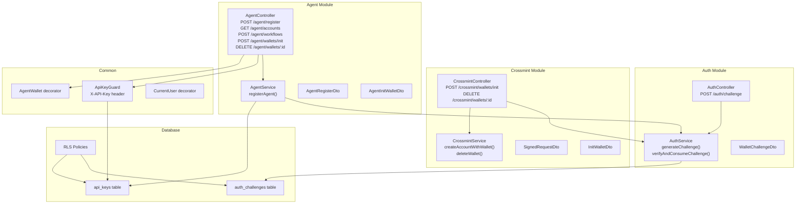
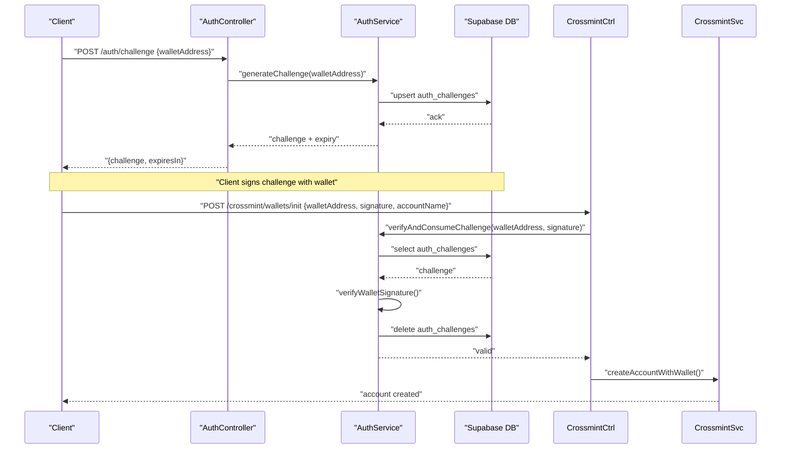
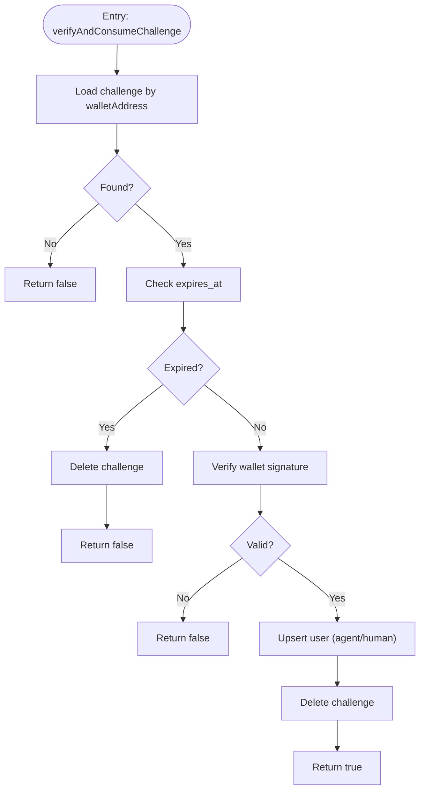
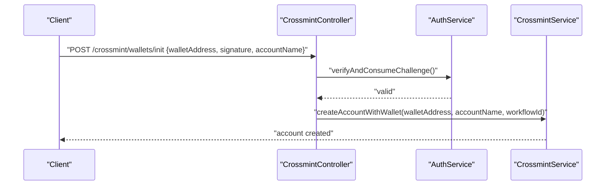
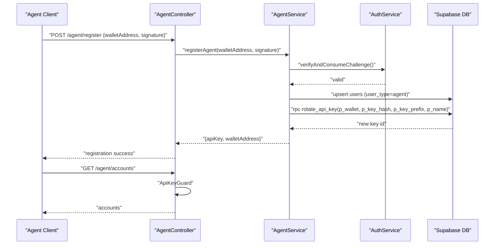
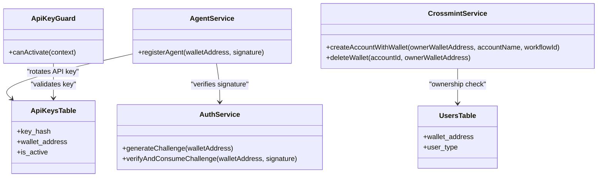
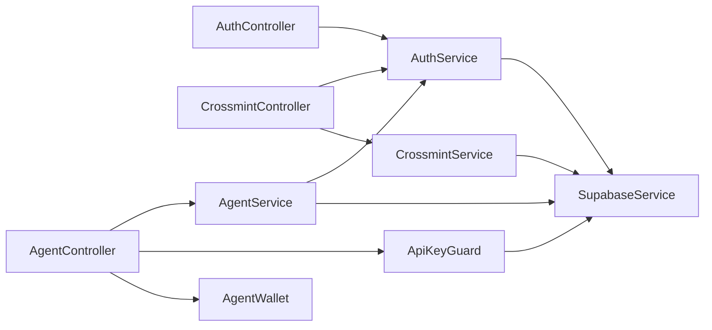

# Authentication Architecture

<cite>
**Referenced Files in This Document**
- [auth.controller.ts](file://src/auth/auth.controller.ts)
- [auth.service.ts](file://src/auth/auth.service.ts)
- [wallet-challenge.dto.ts](file://src/auth/dto/wallet-challenge.dto.ts)
- [api-key.guard.ts](file://src/common/guards/api-key.guard.ts)
- [agent.controller.ts](file://src/agent/agent.controller.ts)
- [agent.service.ts](file://src/agent/agent.service.ts)
- [agent-register.dto.ts](file://src/agent/dto/agent-register.dto.ts)
- [agent-init-wallet.dto.ts](file://src/agent/dto/agent-init-wallet.dto.ts)
- [crossmint.controller.ts](file://src/crossmint/crossmint.controller.ts)
- [crossmint.service.ts](file://src/crossmint/crossmint.service.ts)
- [signed-request.dto.ts](file://src/crossmint/dto/signed-request.dto.ts)
- [init-wallet.dto.ts](file://src/crossmint/dto/init-wallet.dto.ts)
- [agent-wallet.decorator.ts](file://src/common/decorators/agent-wallet.decorator.ts)
- [current-user.decorator.ts](file://src/common/decorators/current-user.decorator.ts)
- [initial-2-auth-challenges.sql](file://src/database/schema/initial-2-auth-challenges.sql)
- [20260218000000_add_agent_api_keys.sql](file://supabase/migrations/20260218000000_add_agent_api_keys.sql)
- [20260218010000_add_rotate_api_key_function.sql](file://supabase/migrations/20260218010000_add_rotate_api_key_function.sql)
- [20260128143000_fix_auth_rls.sql](file://supabase/migrations/20260128143000_fix_auth_rls.sql)
</cite>

## Table of Contents
1. [Introduction](#introduction)
2. [Project Structure](#project-structure)
3. [Core Components](#core-components)
4. [Architecture Overview](#architecture-overview)
5. [Detailed Component Analysis](#detailed-component-analysis)
6. [Dependency Analysis](#dependency-analysis)
7. [Performance Considerations](#performance-considerations)
8. [Troubleshooting Guide](#troubleshooting-guide)
9. [Conclusion](#conclusion)

## Introduction
This document describes the dual authentication system implemented in the backend. It covers:
- Wallet signature authentication via Solana wallet challenges
- Crossmint integration for passwordless account creation and deletion
- Agent programmatic access control via API keys
- Authentication service architecture including challenge generation, signature verification, and sessionless consumption
- Relationship between authentication and authorization, including user roles and permissions
- Security considerations for wallet signatures, nonce management, and replay attack prevention
- Integration between wallet authentication and agent API key systems

## Project Structure
The authentication system spans several modules:
- Auth module: challenge generation and signature verification
- Crossmint module: passwordless account lifecycle bound to wallet signatures
- Agent module: agent registration and API key-based access control
- Common guards and decorators: API key enforcement and parameter extraction
- Database schema and policies: secure storage of challenges and API keys

**Diagram sources**
- [auth.controller.ts:11-47](file://src/auth/auth.controller.ts#L11-L47)
- [auth.service.ts:27-91](file://src/auth/auth.service.ts#L27-L91)
- [wallet-challenge.dto.ts:4-15](file://src/auth/dto/wallet-challenge.dto.ts#L4-L15)
- [crossmint.controller.ts:30-65](file://src/crossmint/crossmint.controller.ts#L30-L65)
- [crossmint.service.ts:163-204](file://src/crossmint/crossmint.service.ts#L163-L204)
- [agent.controller.ts:37-109](file://src/agent/agent.controller.ts#L37-L109)
- [agent.service.ts:15-59](file://src/agent/agent.service.ts#L15-L59)
- [agent-register.dto.ts:4-23](file://src/agent/dto/agent-register.dto.ts#L4-L23)
- [agent-init-wallet.dto.ts:4-21](file://src/agent/dto/agent-init-wallet.dto.ts#L4-L21)
- [api-key.guard.ts:11-54](file://src/common/guards/api-key.guard.ts#L11-L54)
- [agent-wallet.decorator.ts:3-8](file://src/common/decorators/agent-wallet.decorator.ts#L3-L8)
- [current-user.decorator.ts:3-10](file://src/common/decorators/current-user.decorator.ts#L3-L10)
- [initial-2-auth-challenges.sql:1-7](file://src/database/schema/initial-2-auth-challenges.sql#L1-L7)
- [20260218000000_add_agent_api_keys.sql:6-17](file://supabase/migrations/20260218000000_add_agent_api_keys.sql#L6-L17)
- [20260128143000_fix_auth_rls.sql:1-21](file://supabase/migrations/20260128143000_fix_auth_rls.sql#L1-L21)

**Section sources**
- [auth.controller.ts:1-49](file://src/auth/auth.controller.ts#L1-L49)
- [auth.service.ts:1-165](file://src/auth/auth.service.ts#L1-L165)
- [crossmint.controller.ts:1-67](file://src/crossmint/crossmint.controller.ts#L1-L67)
- [crossmint.service.ts:1-403](file://src/crossmint/crossmint.service.ts#L1-L403)
- [agent.controller.ts:1-111](file://src/agent/agent.controller.ts#L1-L111)
- [agent.service.ts:1-77](file://src/agent/agent.service.ts#L1-L77)
- [api-key.guard.ts:1-56](file://src/common/guards/api-key.guard.ts#L1-L56)
- [initial-2-auth-challenges.sql:1-7](file://src/database/schema/initial-2-auth-challenges.sql#L1-L7)
- [20260218000000_add_agent_api_keys.sql:1-48](file://supabase/migrations/20260218000000_add_agent_api_keys.sql#L1-L48)
- [20260218010000_add_rotate_api_key_function.sql:1-27](file://supabase/migrations/20260218010000_add_rotate_api_key_function.sql#L1-L27)
- [20260128143000_fix_auth_rls.sql:1-21](file://supabase/migrations/20260128143000_fix_auth_rls.sql#L1-L21)

## Core Components
- AuthController: exposes challenge endpoint for wallet signature authentication.
- AuthService: generates challenges with nonce and timestamp, stores them, verifies signatures, and consumes challenges after successful verification.
- CrossmintController: integrates wallet signature verification with Crossmint account lifecycle operations.
- CrossmintService: creates and manages Crossmint wallets, withdraws assets, and enforces ownership checks.
- AgentController: registers agents via wallet signature and exposes protected endpoints guarded by API keys.
- AgentService: registers agents, upserts user records as agents, and rotates API keys atomically.
- ApiKeyGuard: validates X-API-Key header against hashed API keys stored in the database.
- Decorators: AgentWallet and CurrentUser extract wallet address and user context from request.
- Database: auth_challenges table for challenge storage and RLS; api_keys table for agent API keys with atomic rotation function.

**Section sources**
- [auth.controller.ts:11-47](file://src/auth/auth.controller.ts#L11-L47)
- [auth.service.ts:27-163](file://src/auth/auth.service.ts#L27-L163)
- [crossmint.controller.ts:30-65](file://src/crossmint/crossmint.controller.ts#L30-L65)
- [crossmint.service.ts:163-401](file://src/crossmint/crossmint.service.ts#L163-L401)
- [agent.controller.ts:37-109](file://src/agent/agent.controller.ts#L37-L109)
- [agent.service.ts:15-59](file://src/agent/agent.service.ts#L15-L59)
- [api-key.guard.ts:11-54](file://src/common/guards/api-key.guard.ts#L11-L54)
- [agent-wallet.decorator.ts:3-8](file://src/common/decorators/agent-wallet.decorator.ts#L3-L8)
- [current-user.decorator.ts:3-10](file://src/common/decorators/current-user.decorator.ts#L3-L10)
- [initial-2-auth-challenges.sql:1-7](file://src/database/schema/initial-2-auth-challenges.sql#L1-L7)
- [20260218000000_add_agent_api_keys.sql:6-17](file://supabase/migrations/20260218000000_add_agent_api_keys.sql#L6-L17)
- [20260218010000_add_rotate_api_key_function.sql:1-27](file://supabase/migrations/20260218010000_add_rotate_api_key_function.sql#L1-L27)
- [20260128143000_fix_auth_rls.sql:1-21](file://supabase/migrations/20260128143000_fix_auth_rls.sql#L1-L21)

## Architecture Overview
The system implements a dual authentication model:
- Human and agent users authenticate via wallet signatures using a challenge-response mechanism.
- Agents receive API keys for programmatic access to protected endpoints.
- Crossmint operations are bound to wallet signatures to ensure ownership.

**Diagram sources**
- [auth.controller.ts:36-47](file://src/auth/auth.controller.ts#L36-L47)
- [auth.service.ts:27-51](file://src/auth/auth.service.ts#L27-L51)
- [auth.service.ts:57-91](file://src/auth/auth.service.ts#L57-L91)
- [crossmint.controller.ts:30-42](file://src/crossmint/crossmint.controller.ts#L30-L42)
- [crossmint.service.ts:163-204](file://src/crossmint/crossmint.service.ts#L163-L204)

## Detailed Component Analysis

### Wallet Signature Authentication Flow
- Challenge generation:
  - Generates a random nonce and timestamp.
  - Constructs a deterministic challenge string containing nonce, timestamp, and wallet address.
  - Upserts challenge with expiration into auth_challenges table.
- Signature verification and consumption:
  - Retrieves the stored challenge for the wallet.
  - Checks expiration and deletes expired entries.
  - Verifies the signature against the challenge using ed25519.
  - Creates or updates user record and consumes the challenge by deleting it.

**Diagram sources**
- [auth.service.ts:57-91](file://src/auth/auth.service.ts#L57-L91)
- [auth.service.ts:116-132](file://src/auth/auth.service.ts#L116-L132)
- [auth.service.ts:137-142](file://src/auth/auth.service.ts#L137-L142)

**Section sources**
- [auth.service.ts:27-51](file://src/auth/auth.service.ts#L27-L51)
- [auth.service.ts:57-91](file://src/auth/auth.service.ts#L57-L91)
- [auth.service.ts:96-111](file://src/auth/auth.service.ts#L96-L111)
- [auth.service.ts:116-132](file://src/auth/auth.service.ts#L116-L132)
- [auth.service.ts:137-142](file://src/auth/auth.service.ts#L137-L142)
- [auth.service.ts:147-156](file://src/auth/auth.service.ts#L147-L156)
- [wallet-challenge.dto.ts:4-15](file://src/auth/dto/wallet-challenge.dto.ts#L4-L15)

### Crossmint Integration for Passwordless Authentication
- Initialization:
  - Requires a valid signature from the owner wallet.
  - On success, creates a Crossmint wallet and an account linked to the owner’s wallet address.
- Deletion:
  - Requires a valid signature from the owner wallet.
  - Performs ownership verification, asset withdrawal, and soft-deletes the account.

**Diagram sources**
- [crossmint.controller.ts:30-42](file://src/crossmint/crossmint.controller.ts#L30-L42)
- [crossmint.service.ts:163-204](file://src/crossmint/crossmint.service.ts#L163-L204)
- [auth.service.ts:57-91](file://src/auth/auth.service.ts#L57-L91)

**Section sources**
- [crossmint.controller.ts:30-42](file://src/crossmint/crossmint.controller.ts#L30-L42)
- [crossmint.controller.ts:52-65](file://src/crossmint/crossmint.controller.ts#L52-L65)
- [crossmint.service.ts:163-204](file://src/crossmint/crossmint.service.ts#L163-L204)
- [crossmint.service.ts:349-401](file://src/crossmint/crossmint.service.ts#L349-L401)
- [signed-request.dto.ts:4-21](file://src/crossmint/dto/signed-request.dto.ts#L4-L21)
- [init-wallet.dto.ts:5-22](file://src/crossmint/dto/init-wallet.dto.ts#L5-L22)

### Agent Programmatic Access Control with API Keys
- Registration:
  - Agent authenticates with a wallet signature using the same challenge flow.
  - Upserts user as agent type and generates an API key.
  - Uses a stored procedure to atomically deactivate old active keys and insert a new active key.
- Protected endpoints:
  - Require X-API-Key header validated by ApiKeyGuard.
  - AgentWallet decorator extracts the wallet address derived from the API key.
  - AgentController routes expose account listing, workflow creation, and wallet operations.

**Diagram sources**
- [agent.controller.ts:37-109](file://src/agent/agent.controller.ts#L37-L109)
- [agent.service.ts:15-59](file://src/agent/agent.service.ts#L15-L59)
- [agent.service.ts:44-49](file://src/agent/agent.service.ts#L44-L49)
- [auth.service.ts:57-91](file://src/auth/auth.service.ts#L57-L91)
- [api-key.guard.ts:11-54](file://src/common/guards/api-key.guard.ts#L11-L54)
- [agent-wallet.decorator.ts:3-8](file://src/common/decorators/agent-wallet.decorator.ts#L3-L8)

**Section sources**
- [agent.controller.ts:37-109](file://src/agent/agent.controller.ts#L37-L109)
- [agent.service.ts:15-59](file://src/agent/agent.service.ts#L15-L59)
- [agent-register.dto.ts:4-23](file://src/agent/dto/agent-register.dto.ts#L4-L23)
- [agent-init-wallet.dto.ts:4-21](file://src/agent/dto/agent-init-wallet.dto.ts#L4-L21)
- [api-key.guard.ts:11-54](file://src/common/guards/api-key.guard.ts#L11-L54)
- [agent-wallet.decorator.ts:3-8](file://src/common/decorators/agent-wallet.decorator.ts#L3-L8)
- [20260218000000_add_agent_api_keys.sql:6-17](file://supabase/migrations/20260218000000_add_agent_api_keys.sql#L6-L17)
- [20260218010000_add_rotate_api_key_function.sql:1-27](file://supabase/migrations/20260218010000_add_rotate_api_key_function.sql#L1-L27)

### Authentication vs Authorization and Roles
- Authentication:
  - Wallet signature challenge-response for both human users and agents.
  - API key validation for programmatic agent access.
- Authorization:
  - Ownership verification enforced in CrossmintService for account deletion.
  - ApiKeyGuard attaches the associated wallet address to the request for downstream authorization decisions.
  - Users table includes user_type to distinguish human vs agent.

**Diagram sources**
- [auth.service.ts:27-91](file://src/auth/auth.service.ts#L27-L91)
- [agent.service.ts:15-59](file://src/agent/agent.service.ts#L15-L59)
- [api-key.guard.ts:11-54](file://src/common/guards/api-key.guard.ts#L11-L54)
- [crossmint.service.ts:349-401](file://src/crossmint/crossmint.service.ts#L349-L401)
- [20260218000000_add_agent_api_keys.sql:6-17](file://supabase/migrations/20260218000000_add_agent_api_keys.sql#L6-L17)

**Section sources**
- [agent.service.ts:22-36](file://src/agent/agent.service.ts#L22-L36)
- [crossmint.service.ts:355-368](file://src/crossmint/crossmint.service.ts#L355-L368)
- [api-key.guard.ts:35-35](file://src/common/guards/api-key.guard.ts#L35-L35)
- [20260218000000_add_agent_api_keys.sql:1-48](file://supabase/migrations/20260218000000_add_agent_api_keys.sql#L1-L48)

## Dependency Analysis
- AuthController depends on AuthService for challenge generation.
- CrossmintController depends on AuthService for signature verification and on CrossmintService for account operations.
- AgentController depends on AgentService, ApiKeyGuard, and AgentWallet decorator.
- AgentService depends on AuthService for signature verification and on Supabase for user and API key operations.
- ApiKeyGuard depends on SupabaseService to validate API keys.
- Database tables and policies enforce Row Level Security for auth_challenges and api_keys.

**Diagram sources**
- [auth.controller.ts:9-9](file://src/auth/auth.controller.ts#L9-L9)
- [auth.service.ts:12-15](file://src/auth/auth.service.ts#L12-L15)
- [crossmint.controller.ts:18-21](file://src/crossmint/crossmint.controller.ts#L18-L21)
- [crossmint.service.ts:49-54](file://src/crossmint/crossmint.service.ts#L49-L54)
- [agent.controller.ts:24-28](file://src/agent/agent.controller.ts#L24-L28)
- [agent.service.ts:10-13](file://src/agent/agent.service.ts#L10-L13)
- [api-key.guard.ts:9-9](file://src/common/guards/api-key.guard.ts#L9-L9)

**Section sources**
- [auth.controller.ts:1-49](file://src/auth/auth.controller.ts#L1-L49)
- [auth.service.ts:1-165](file://src/auth/auth.service.ts#L1-L165)
- [crossmint.controller.ts:1-67](file://src/crossmint/crossmint.controller.ts#L1-L67)
- [crossmint.service.ts:1-403](file://src/crossmint/crossmint.service.ts#L1-L403)
- [agent.controller.ts:1-111](file://src/agent/agent.controller.ts#L1-L111)
- [agent.service.ts:1-77](file://src/agent/agent.service.ts#L1-L77)
- [api-key.guard.ts:1-56](file://src/common/guards/api-key.guard.ts#L1-L56)

## Performance Considerations
- Challenge cleanup interval: expired challenges are cleaned periodically to prevent table bloat.
- Asynchronous last_used_at updates: ApiKeyGuard performs fire-and-forget updates to avoid blocking request handling.
- Atomic API key rotation: Stored procedure ensures no race conditions during key rotation.
- Nonce and timestamp: Random nonce and strict expiration reduce replay window and improve uniqueness.

[No sources needed since this section provides general guidance]

## Troubleshooting Guide
- Invalid signature or challenge expired:
  - Thrown when verifyAndConsumeChallenge returns false.
  - Ensure the client reissues a challenge and signs it promptly.
- Missing X-API-Key header:
  - ApiKeyGuard throws UnauthorizedException if header is absent.
  - Include X-API-Key in all agent-protected requests.
- Inactive API key:
  - ApiKeyGuard rejects requests when the key is inactive.
  - Rotate or activate the key in the api_keys table.
- Ownership verification failure:
  - CrossmintService throws ForbiddenException if the caller does not own the account.
  - Confirm the wallet address matches the account owner.
- Database errors:
  - Check auth_challenges and api_keys table policies and constraints.
  - Verify RLS policies are enabled and properly configured.

**Section sources**
- [auth.service.ts:66-76](file://src/auth/auth.service.ts#L66-L76)
- [api-key.guard.ts:15-33](file://src/common/guards/api-key.guard.ts#L15-L33)
- [crossmint.service.ts:366-368](file://src/crossmint/crossmint.service.ts#L366-L368)
- [20260128143000_fix_auth_rls.sql:1-21](file://supabase/migrations/20260128143000_fix_auth_rls.sql#L1-L21)

## Conclusion
The authentication architecture combines wallet signature challenges with API key-based access control for agents. Challenges are securely stored, verified, and consumed to prevent replay attacks. Crossmint operations are tightly coupled with wallet signatures to ensure ownership. The system leverages database policies and atomic operations to maintain security and consistency.