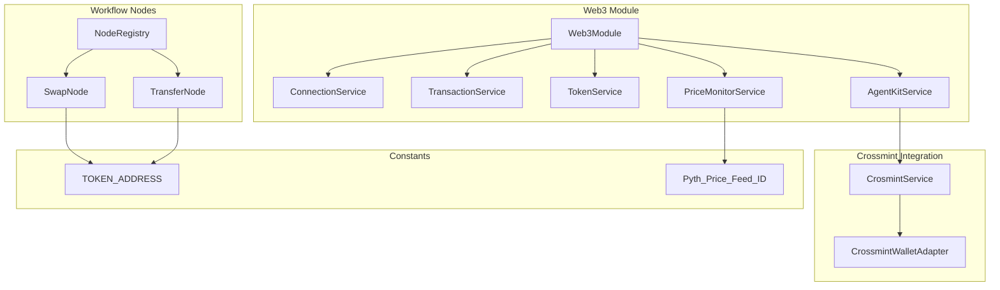
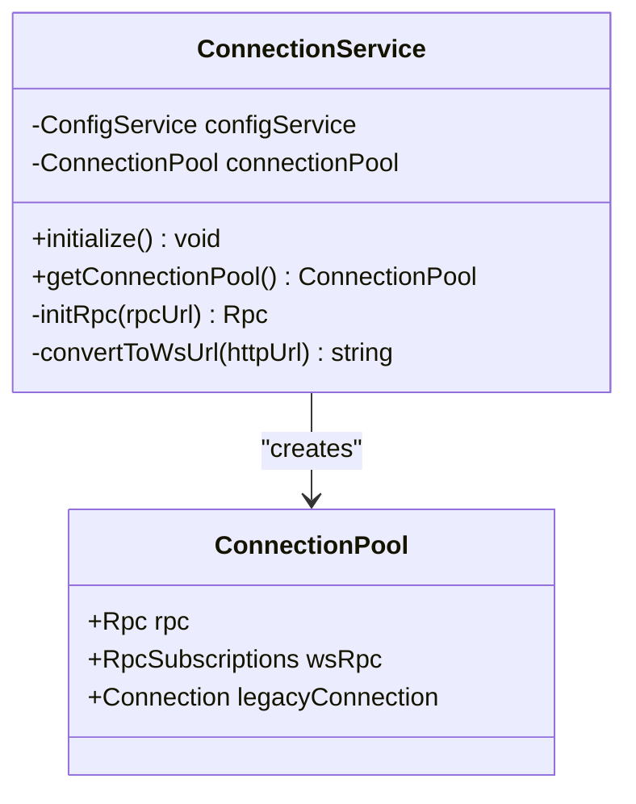
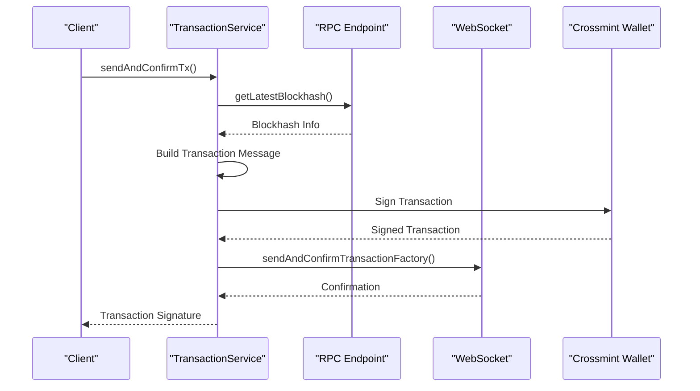
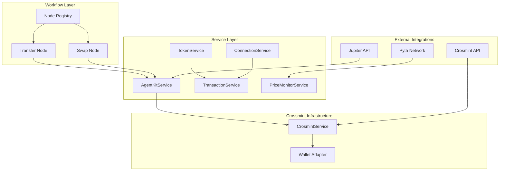
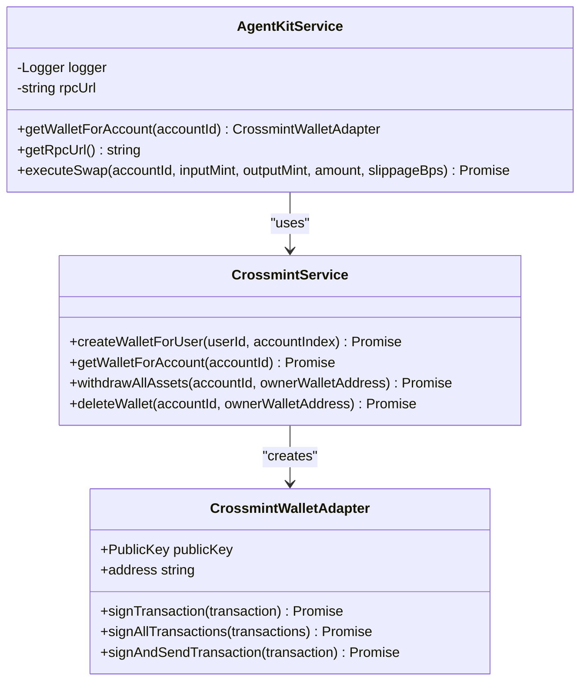
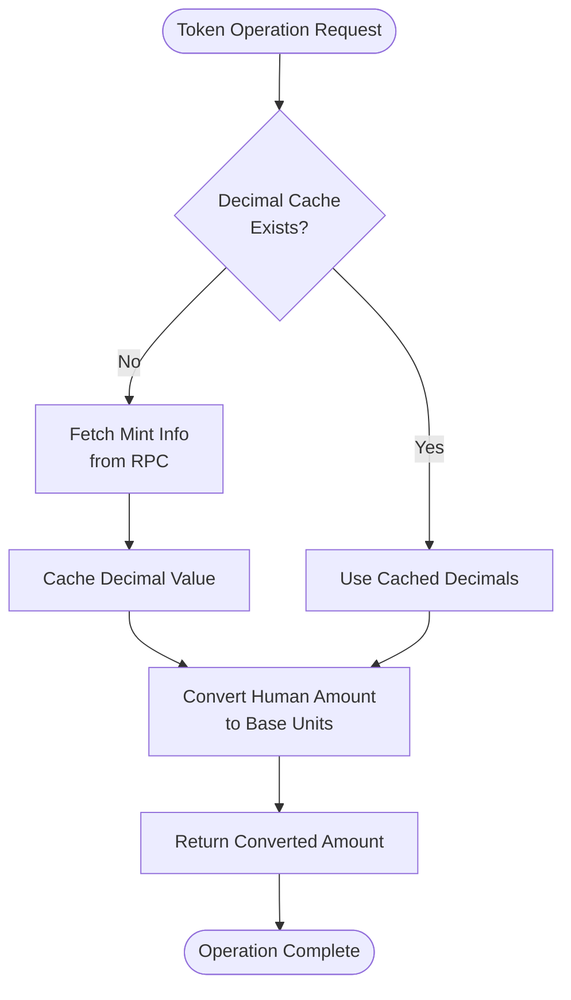
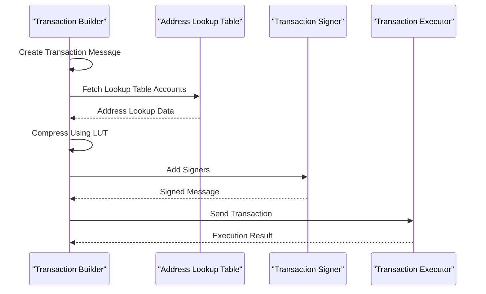
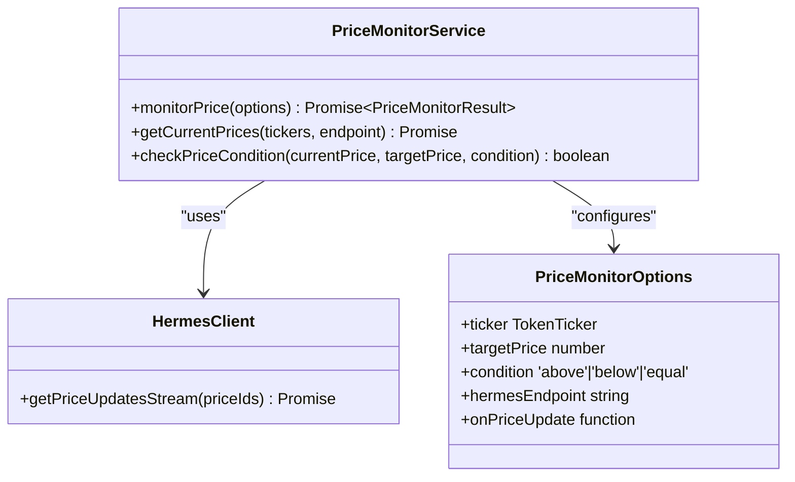
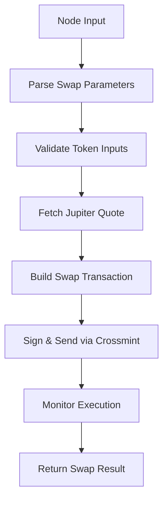

# Blockchain Integration Architecture

<cite>
**Referenced Files in This Document**
- [web3.module.ts](file://src/web3/web3.module.ts)
- [connection.service.ts](file://src/web3/services/connection.service.ts)
- [transaction.service.ts](file://src/web3/services/transaction.service.ts)
- [token.service.ts](file://src/web3/services/token.service.ts)
- [agent-kit.service.ts](file://src/web3/services/agent-kit.service.ts)
- [crossmint.service.ts](file://src/crossmint/crossmint.service.ts)
- [crossmint-wallet.adapter.ts](file://src/crossmint/crossmint-wallet.adapter.ts)
- [price-monitor.service.ts](file://src/web3/services/price-monitor.service.ts)
- [node-registry.ts](file://src/web3/nodes/node-registry.ts)
- [swap.node.ts](file://src/web3/nodes/swap.node.ts)
- [transfer.node.ts](file://src/web3/nodes/transfer.node.ts)
- [constants.ts](file://src/web3/constants.ts)
- [env.service.ts](file://src/web3/services/env.service.ts)
</cite>

## Table of Contents
1. [Introduction](#introduction)
2. [Project Structure](#project-structure)
3. [Core Components](#core-components)
4. [Architecture Overview](#architecture-overview)
5. [Detailed Component Analysis](#detailed-component-analysis)
6. [Dependency Analysis](#dependency-analysis)
7. [Performance Considerations](#performance-considerations)
8. [Security Considerations](#security-considerations)
9. [Troubleshooting Guide](#troubleshooting-guide)
10. [Conclusion](#conclusion)

## Introduction

This document provides comprehensive blockchain integration architecture documentation for Solana Web3.js integration. The system implements a robust service layer architecture that manages Solana connections, builds and executes transactions, integrates with Crossmint wallet infrastructure, and provides DeFi protocol monitoring capabilities.

The architecture follows NestJS modular patterns with specialized services for connection management, transaction processing, token operations, and Crossmint wallet integration. It supports both direct RPC communication and subscription-based real-time updates through WebSocket connections.

## Project Structure

The blockchain integration is organized within the `/src/web3` directory, following a clean separation of concerns:



**Diagram sources**
- [web3.module.ts:1-13](file://src/web3/web3.module.ts#L1-L13)
- [connection.service.ts:22-73](file://src/web3/services/connection.service.ts#L22-L73)
- [agent-kit.service.ts:55-163](file://src/web3/services/agent-kit.service.ts#L55-L163)
- [crossmint.service.ts:42-403](file://src/crossmint/crossmint.service.ts#L42-L403)

**Section sources**
- [web3.module.ts:1-13](file://src/web3/web3.module.ts#L1-L13)
- [node-registry.ts:1-47](file://src/web3/nodes/node-registry.ts#L1-L47)

## Core Components

### Connection Management Service

The ConnectionService establishes and maintains stable RPC connections to the Solana network using the @solana/kit library. It creates three distinct connection types:

- **HTTP RPC**: Standard JSON-RPC over HTTP for read operations
- **WebSocket Subscriptions**: Real-time event streaming for transaction confirmations
- **Legacy Connection**: Traditional @solana/web3.js Connection for compatibility



**Diagram sources**
- [connection.service.ts:16-20](file://src/web3/services/connection.service.ts#L16-L20)
- [connection.service.ts:22-73](file://src/web3/services/connection.service.ts#L22-L73)

### Transaction Service Architecture

The TransactionService provides comprehensive transaction building, signing, and execution capabilities:



**Diagram sources**
- [transaction.service.ts:41-101](file://src/web3/services/transaction.service.ts#L41-L101)

**Section sources**
- [connection.service.ts:22-73](file://src/web3/services/connection.service.ts#L22-L73)
- [transaction.service.ts:1-158](file://src/web3/services/transaction.service.ts#L1-L158)

## Architecture Overview

The system implements a layered architecture with clear separation between service layers and workflow execution:



**Diagram sources**
- [agent-kit.service.ts:99-161](file://src/web3/services/agent-kit.service.ts#L99-L161)
- [crossmint.service.ts:122-154](file://src/crossmint/crossmint.service.ts#L122-L154)
- [node-registry.ts:23-47](file://src/web3/nodes/node-registry.ts#L23-L47)

## Detailed Component Analysis

### AgentKit Service for Crossmint Wallet Operations

The AgentKitService serves as the central orchestrator for Crossmint wallet operations, providing unified access to托管钱包 functionality:



**Diagram sources**
- [agent-kit.service.ts:55-163](file://src/web3/services/agent-kit.service.ts#L55-L163)
- [crossmint.service.ts:42-403](file://src/crossmint/crossmint.service.ts#L42-L403)
- [crossmint-wallet.adapter.ts:16-89](file://src/crossmint/crossmint-wallet.adapter.ts#L16-L89)

The AgentKitService implements sophisticated rate limiting and retry mechanisms:

- **Rate Limiting**: Built-in limiter for external API calls (5 concurrent requests)
- **Retry Logic**: Exponential backoff with jitter for failed operations
- **Queue Management**: Sequential processing to prevent API throttling

**Section sources**
- [agent-kit.service.ts:1-163](file://src/web3/services/agent-kit.service.ts#L1-L163)
- [crossmint.service.ts:1-403](file://src/crossmint/crossmint.service.ts#L1-L403)
- [crossmint-wallet.adapter.ts:1-89](file://src/crossmint/crossmint-wallet.adapter.ts#L1-L89)

### Token Service for SPL Token Interactions

The TokenService provides comprehensive SPL token operations with caching mechanisms:



**Diagram sources**
- [token.service.ts:7-15](file://src/web3/services/token.service.ts#L7-L15)

**Section sources**
- [token.service.ts:1-45](file://src/web3/services/token.service.ts#L1-L45)

### Transaction Service Architecture

The TransactionService implements advanced transaction building with support for:

- **Address Lookup Tables**: Optimized transaction compression
- **Multi-signer Support**: Batch signing for complex operations
- **Simulation Capabilities**: Pre-execution simulation for debugging
- **Error Recovery**: Comprehensive error handling with transaction logs retrieval



**Diagram sources**
- [transaction.service.ts:59-67](file://src/web3/services/transaction.service.ts#L59-L67)

**Section sources**
- [transaction.service.ts:1-158](file://src/web3/services/transaction.service.ts#L1-L158)

### Price Monitoring Services for DeFi Protocol Integration

The PriceMonitorService enables real-time price monitoring using Pyth Oracle feeds:



**Diagram sources**
- [price-monitor.service.ts:28-105](file://src/web3/services/price-monitor.service.ts#L28-L105)
- [price-monitor.service.ts:6-21](file://src/web3/services/price-monitor.service.ts#L6-L21)

**Section sources**
- [price-monitor.service.ts:1-191](file://src/web3/services/price-monitor.service.ts#L1-L191)

### Workflow Nodes for Automated Operations

The system includes specialized workflow nodes for automated blockchain operations:

#### Swap Node Implementation

The SwapNode coordinates token swaps through the Jupiter aggregator:



**Diagram sources**
- [swap.node.ts:102-207](file://src/web3/nodes/swap.node.ts#L102-L207)

#### Transfer Node Implementation

The TransferNode handles both SOL and SPL token transfers:

**Section sources**
- [swap.node.ts:1-209](file://src/web3/nodes/swap.node.ts#L1-L209)
- [transfer.node.ts:1-199](file://src/web3/nodes/transfer.node.ts#L1-L199)

## Dependency Analysis

The system exhibits clear dependency relationships with well-defined interfaces:

```mermaid
graph LR
subgraph "External Dependencies"
SOLANAKIT[@solana/kit]
WEB3JS[@solana/web3.js]
CROSSMINT[@crossmint/wallets-sdk]
JUPITER[@jup-ag/api]
PYTH[@pythnetwork/hermes-client]
end
subgraph "Internal Services"
CS[ConnectionService]
AK[AgentKitService]
TX[TransactionService]
TK[TokenService]
CM[CrosmintService]
end
CS --> SOLANAKIT
TX --> SOLANAKIT
AK --> CROSSMINT
AK --> JUPITER
CM --> CROSSMINT
TX --> WEB3JS
TK --> WEB3JS
```

**Diagram sources**
- [agent-kit.service.ts:116-149](file://src/web3/services/agent-kit.service.ts#L116-L149)
- [crossmint.service.ts:31-34](file://src/crossmint/crossmint.service.ts#L31-L34)

**Section sources**
- [web3.module.ts:1-13](file://src/web3/web3.module.ts#L1-L13)

## Performance Considerations

### Connection Pool Management

The system implements efficient connection pooling with automatic failover capabilities:

- **Connection Reuse**: Single connection pool shared across all operations
- **Automatic Retry**: Configured retry logic for transient network failures
- **Resource Cleanup**: Proper disposal of WebSocket connections

### Transaction Optimization

- **Address Lookup Tables**: Reduces transaction size and cost
- **Batch Processing**: Concurrent operations where safe
- **Caching Strategy**: Token decimals cached to minimize RPC calls

### Rate Limiting and Throttling

- **External API Limits**: Built-in rate limiting for Crossmint and Jupiter APIs
- **Exponential Backoff**: Intelligent retry with jitter to prevent thundering herd
- **Queue Management**: Sequential processing to maintain order guarantees

## Security Considerations

### Private Key Management

The system follows secure practices for Crossmint wallet management:

- **Server-Side Signing**: Private keys never leave the server environment
- **Wallet Isolation**: Each account has dedicated wallet instances
- **Access Control**: Strict validation of account ownership before operations

### Transaction Safety

- **Pre-execution Simulation**: Validates transactions before submission
- **Error Recovery**: Comprehensive error handling with rollback capabilities
- **Transaction Logging**: Detailed audit trails for all operations

### Network Security

- **HTTPS Enforcement**: All external communications use encrypted connections
- **Certificate Validation**: Proper SSL/TLS certificate verification
- **Timeout Management**: Prevents hanging connections and resource leaks

## Troubleshooting Guide

### Common Connection Issues

**RPC URL Configuration Errors**
- Verify SOLANA_RPC_URL environment variable is properly set
- Check network connectivity to the specified RPC endpoint
- Validate RPC endpoint supports WebSocket subscriptions

**Transaction Confirmation Failures**
- Review transaction logs for detailed error messages
- Verify sufficient SOL balance for transaction fees
- Check blockhash validity and recent blockhash expiration

### Crossmint Integration Problems

**Wallet Retrieval Failures**
- Confirm Crossmint API key configuration
- Verify account has associated wallet in Crossmint system
- Check wallet address format and validity

**Transaction Signing Issues**
- Validate wallet has sufficient permissions
- Check for pending transactions blocking new operations
- Verify wallet adapter compatibility with transaction type

### Performance Optimization

**High Latency Operations**
- Implement connection pooling for multiple concurrent operations
- Use transaction simulation to identify bottlenecks
- Monitor RPC endpoint performance metrics

**Memory Management**
- Regularly dispose of unused WebSocket connections
- Clear transaction caches periodically
- Monitor memory usage in long-running processes

**Section sources**
- [connection.service.ts:30-49](file://src/web3/services/connection.service.ts#L30-L49)
- [transaction.service.ts:70-98](file://src/web3/services/transaction.service.ts#L70-L98)
- [crossmint.service.ts:122-154](file://src/crossmint/crossmint.service.ts#L122-L154)

## Conclusion

The Solana Web3.js integration architecture provides a robust, scalable foundation for blockchain operations. The modular design ensures maintainability while the comprehensive service layer handles complex scenarios including Crossmint wallet integration, DeFi protocol monitoring, and automated workflow execution.

Key strengths include:
- **Modular Architecture**: Clean separation of concerns with well-defined interfaces
- **Production Ready**: Comprehensive error handling, retry logic, and monitoring
- **Scalable Design**: Efficient resource management and connection pooling
- **Security Focus**: Secure private key management and transaction safety measures

The architecture successfully balances flexibility with reliability, providing a solid foundation for enterprise-grade blockchain applications on the Solana network.