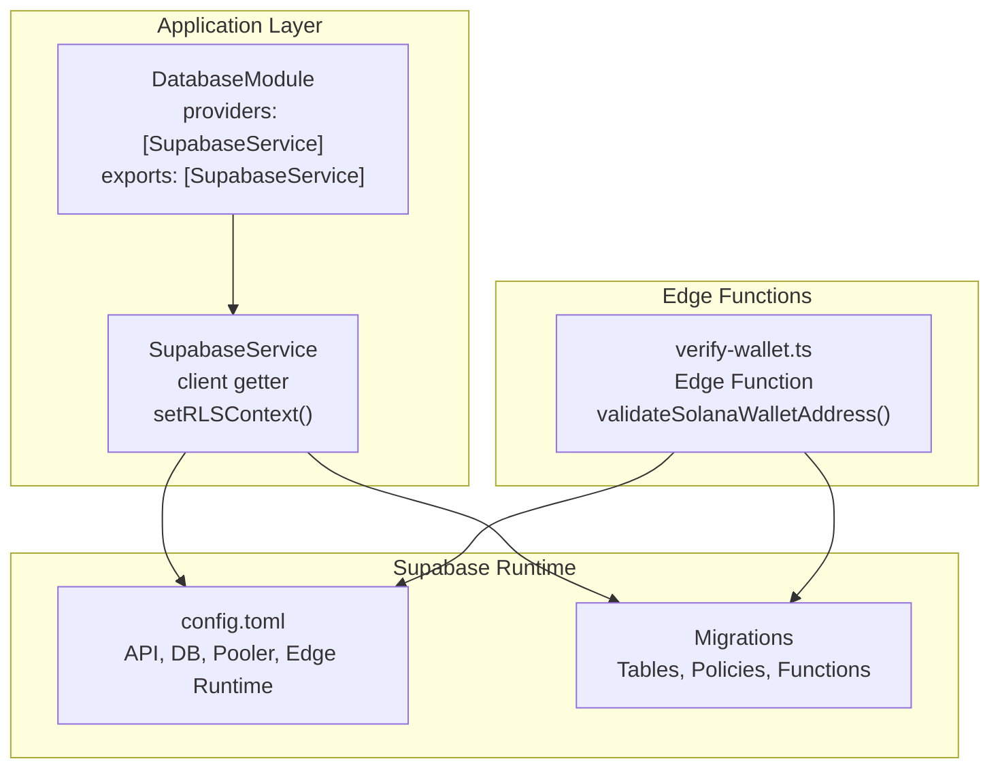
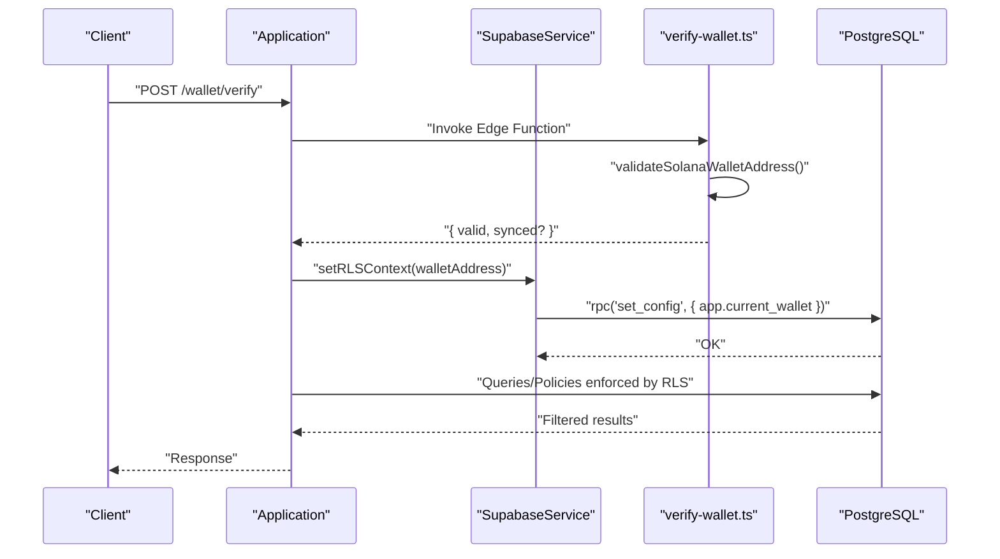
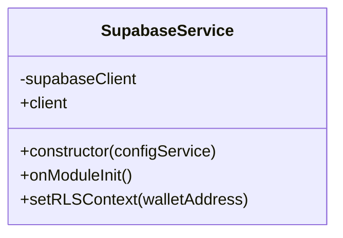
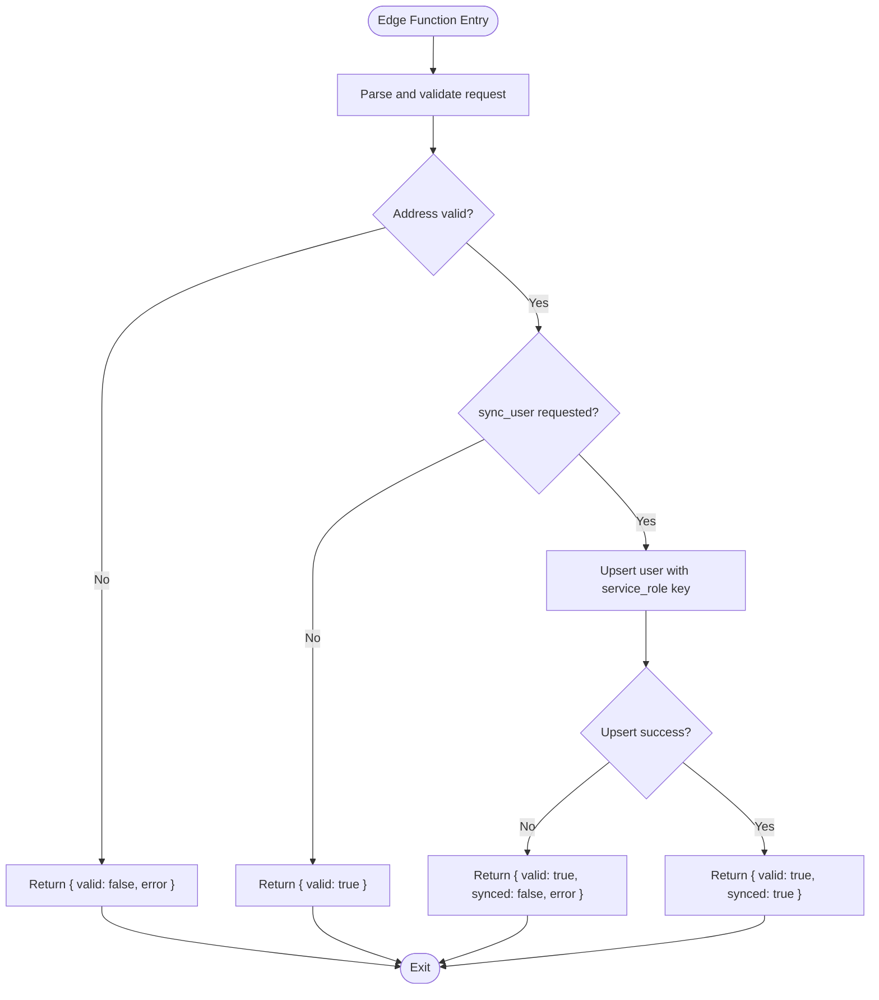
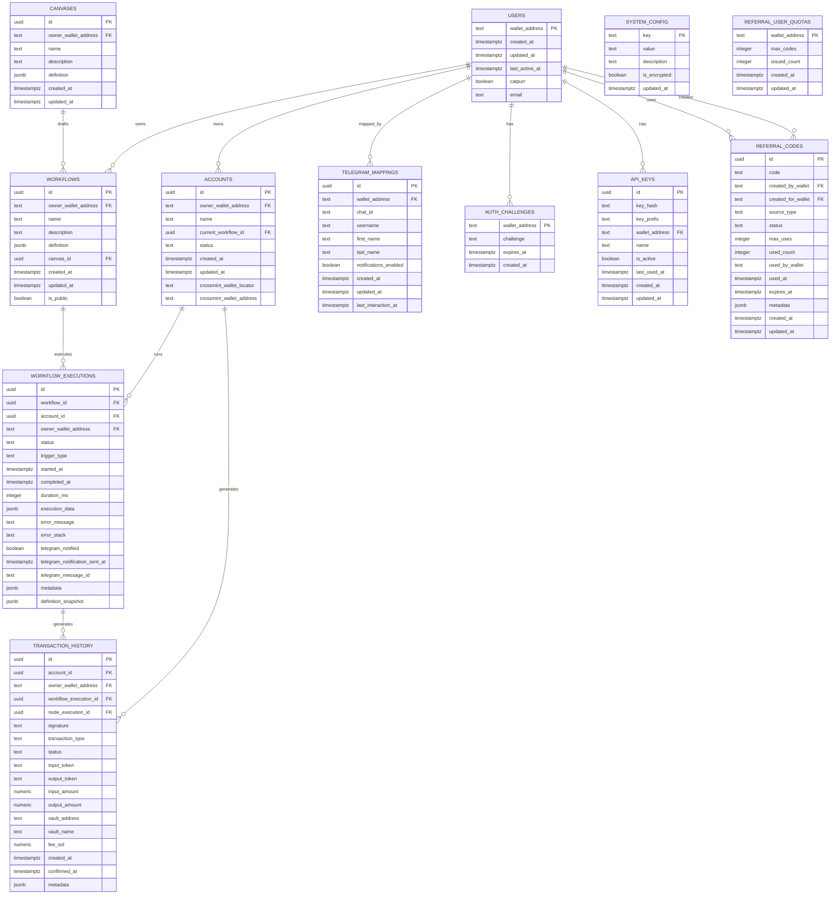
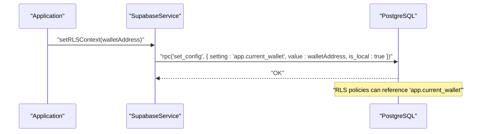
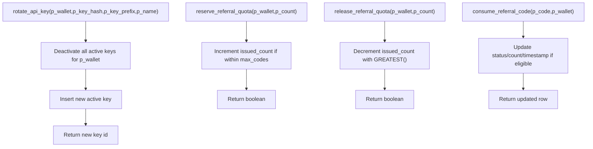
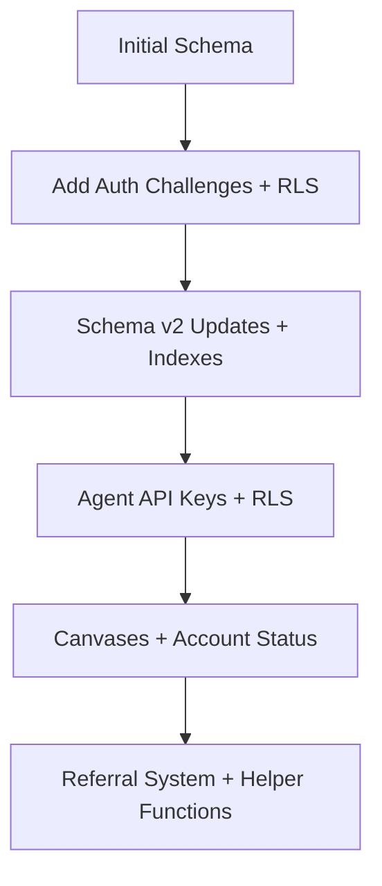
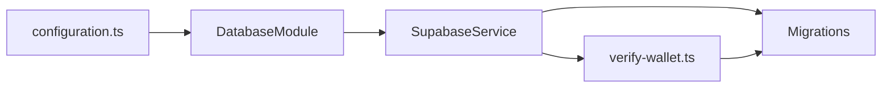

# Data Architecture

<cite>
**Referenced Files in This Document**
- [configuration.ts](file://src/config/configuration.ts)
- [database.module.ts](file://src/database/database.module.ts)
- [supabase.service.ts](file://src/database/supabase.service.ts)
- [verify-wallet.ts](file://src/database/functions/verify-wallet.ts)
- [initial-1.sql](file://src/database/schema/initial-1.sql)
- [initial-2-auth-challenges.sql](file://src/database/schema/initial-2-auth-challenges.sql)
- [20260118210000_remove_legacy_wallet_fields.sql](file://supabase/migrations/20260118210000_remove_legacy_wallet_fields.sql)
- [20260128140000_add_auth_challenges.sql](file://supabase/migrations/20260128140000_add_auth_challenges.sql)
- [20260128143000_fix_auth_rls.sql](file://supabase/migrations/202601281430000_fix_auth_rls.sql)
- [20260129000000_update_schema_v2.sql](file://supabase/migrations/20260129000000_update_schema_v2.sql)
- [20260218000000_add_agent_api_keys.sql](file://supabase/migrations/20260218000000_add_agent_api_keys.sql)
- [20260218010000_add_rotate_api_key_function.sql](file://supabase/migrations/20260218010000_add_rotate_api_key_function.sql)
- [20260308000000_add_canvases_and_account_status.sql](file://supabase/migrations/20260308000000_add_canvases_and_account_status.sql)
- [20260320090000_add_referral_system.sql](file://supabase/migrations/20260320090000_add_referral_system.sql)
- [config.toml](file://supabase/config.toml)
</cite>

## Table of Contents
1. [Introduction](#introduction)
2. [Project Structure](#project-structure)
3. [Core Components](#core-components)
4. [Architecture Overview](#architecture-overview)
5. [Detailed Component Analysis](#detailed-component-analysis)
6. [Dependency Analysis](#dependency-analysis)
7. [Performance Considerations](#performance-considerations)
8. [Troubleshooting Guide](#troubleshooting-guide)
9. [Conclusion](#conclusion)
10. [Appendices](#appendices)

## Introduction
This document describes the data architecture for the Supabase PostgreSQL integration, focusing on connection management, Row Level Security (RLS), schema design, function-based security, migrations, and operational practices. It explains how the backend initializes a Supabase client, sets RLS context, validates wallet addresses via Edge Functions, and enforces access controls across tables and functions. It also documents migration strategies, indexing, and operational guidance for performance, backups, monitoring, and maintenance.

## Project Structure
The data layer is organized around:
- A NestJS module that exposes a globally available Supabase client service
- Edge Functions for wallet verification and user synchronization
- SQL schema and migrations defining tables, constraints, indexes, and RLS policies
- Supabase configuration controlling API exposure, database pooling, and runtime settings

**Diagram sources**
- [database.module.ts:1-10](file://src/database/database.module.ts#L1-L10)
- [supabase.service.ts:1-42](file://src/database/supabase.service.ts#L1-L42)
- [verify-wallet.ts:1-231](file://src/database/functions/verify-wallet.ts#L1-L231)
- [config.toml:1-383](file://supabase/config.toml#L1-L383)

**Section sources**
- [database.module.ts:1-10](file://src/database/database.module.ts#L1-L10)
- [supabase.service.ts:1-42](file://src/database/supabase.service.ts#L1-L42)
- [config.toml:1-383](file://supabase/config.toml#L1-L383)

## Core Components
- Supabase client initialization and lifecycle management
- RLS context propagation via RPC
- Edge Function for wallet verification and optional user upsert
- Schema and migration-driven evolution of tables, constraints, indexes, and policies

Key implementation references:
- Supabase client creation and environment configuration
- RLS context setter for wallet-based isolation
- Edge Function for validating Solana wallet addresses and optionally syncing users
- Initial schema and migration definitions for tables, constraints, indexes, and RLS policies

**Section sources**
- [supabase.service.ts:11-41](file://src/database/supabase.service.ts#L11-L41)
- [configuration.ts:6-10](file://src/config/configuration.ts#L6-L10)
- [verify-wallet.ts:109-229](file://src/database/functions/verify-wallet.ts#L109-L229)
- [initial-1.sql:105-153](file://src/database/schema/initial-1.sql#L105-L153)

## Architecture Overview
The data architecture centers on:
- Application-side Supabase client configured with a service key and RLS-aware context
- Edge Functions for wallet verification and user synchronization
- Supabase-managed RLS policies and function security definitions
- Migrations that evolve schema, constraints, indexes, and policies over time

**Diagram sources**
- [supabase.service.ts:33-40](file://src/database/supabase.service.ts#L33-L40)
- [verify-wallet.ts:109-229](file://src/database/functions/verify-wallet.ts#L109-L229)

## Detailed Component Analysis

### Supabase Client Service
Responsibilities:
- Initialize a Supabase client using environment-provided URL and service key
- Provide a getter for the client instance
- Set RLS context for wallet-based row-level filtering

Implementation highlights:
- Client creation with explicit auth settings to avoid automatic token refresh
- Environment validation for required configuration
- Helper method to set a custom configuration key consumed by RLS policies

**Diagram sources**
- [supabase.service.ts:5-41](file://src/database/supabase.service.ts#L5-L41)

**Section sources**
- [supabase.service.ts:11-41](file://src/database/supabase.service.ts#L11-L41)
- [configuration.ts:6-10](file://src/config/configuration.ts#L6-L10)

### Edge Function: Wallet Verification and Sync
Responsibilities:
- Validate a Solana wallet address using Base58 checks and decoding
- Optionally upsert a user record when requested
- Use a service role key to bypass RLS during upserts within the Edge Function context

Key behaviors:
- Request validation and CORS handling
- Decoding and length checks for Solana addresses
- Conditional user upsert with conflict resolution
- Error handling and structured responses

**Diagram sources**
- [verify-wallet.ts:109-229](file://src/database/functions/verify-wallet.ts#L109-L229)

**Section sources**
- [verify-wallet.ts:109-229](file://src/database/functions/verify-wallet.ts#L109-L229)

### Schema Design and Table Relationships
The schema defines core entities and their relationships:
- Users: primary key on wallet_address
- Accounts: owned by a user, references users(wallet_address)
- Workflows: owned by a user, optionally linked to Canvases
- Canvas: design drafts for workflows
- Workflow Executions: track runs, optionally linked to Accounts and Workflows
- Transaction History: records transactions with foreign keys to Accounts and Executions
- Telegram Mappings: links wallet_address to Telegram identifiers
- System Config: global configuration entries
- Auth Challenges: per-wallet challenges for authentication
- API Keys: per-wallet API keys with constraints and indexes
- Referral System: referral codes and user quotas with helper functions

**Diagram sources**
- [initial-1.sql:4-153](file://src/database/schema/initial-1.sql#L4-L153)
- [initial-2-auth-challenges.sql:1-7](file://src/database/schema/initial-2-auth-challenges.sql#L1-L7)
- [20260218000000_add_agent_api_keys.sql:6-17](file://supabase/migrations/20260218000000_add_agent_api_keys.sql#L6-L17)
- [20260320090000_add_referral_system.sql:32-72](file://supabase/migrations/20260320090000_add_referral_system.sql#L32-L72)

**Section sources**
- [initial-1.sql:4-153](file://src/database/schema/initial-1.sql#L4-L153)
- [initial-2-auth-challenges.sql:1-7](file://src/database/schema/initial-2-auth-challenges.sql#L1-L7)
- [20260218000000_add_agent_api_keys.sql:6-17](file://supabase/migrations/20260218000000_add_agent_api_keys.sql#L6-L17)
- [20260320090000_add_referral_system.sql:32-72](file://supabase/migrations/20260320090000_add_referral_system.sql#L32-L72)

### Row Level Security Implementation
RLS is enabled and enforced across sensitive tables:
- Auth Challenges: RLS enabled; service_role granted; anon and authenticated revoked
- API Keys: RLS enabled; service_role granted; anon and authenticated revoked
- Referral Codes and Quotas: RLS enabled; service_role granted; anon and authenticated revoked

RLS context propagation:
- The application sets a custom configuration key that downstream policies can consume for user isolation

**Diagram sources**
- [supabase.service.ts:33-40](file://src/database/supabase.service.ts#L33-L40)
- [20260128143000_fix_auth_rls.sql:1-21](file://supabase/migrations/20260128143000_fix_auth_rls.sql#L1-L21)
- [20260218000000_add_agent_api_keys.sql:28-48](file://supabase/migrations/20260218000000_add_agent_api_keys.sql#L28-L48)
- [20260320090000_add_referral_system.sql:74-101](file://supabase/migrations/20260320090000_add_referral_system.sql#L74-L101)

**Section sources**
- [supabase.service.ts:33-40](file://src/database/supabase.service.ts#L33-L40)
- [20260128143000_fix_auth_rls.sql:1-21](file://supabase/migrations/20260128143000_fix_auth_rls.sql#L1-L21)
- [20260218000000_add_agent_api_keys.sql:28-48](file://supabase/migrations/20260218000000_add_agent_api_keys.sql#L28-L48)
- [20260320090000_add_referral_system.sql:74-101](file://supabase/migrations/20260320090000_add_referral_system.sql#L74-L101)

### Function-Based Security Model
- Wallet verification Edge Function:
  - Validates Solana addresses and optionally upserts users using a service role key
  - Enforced via Edge Function environment variables and Supabase service role key
- API Key Rotation Function:
  - Atomic update to deactivate previous keys and insert a new active key
  - Uses SECURITY DEFINER to operate with elevated privileges
- Referral System Helper Functions:
  - Reserve/release quota and consume referral codes atomically
  - SECURITY DEFINER with explicit grants to service_role and postgres

**Diagram sources**
- [20260218010000_add_rotate_api_key_function.sql:1-27](file://supabase/migrations/20260218010000_add_rotate_api_key_function.sql#L1-L27)
- [20260320090000_add_referral_system.sql:106-187](file://supabase/migrations/20260320090000_add_referral_system.sql#L106-L187)

**Section sources**
- [verify-wallet.ts:155-191](file://src/database/functions/verify-wallet.ts#L155-L191)
- [20260218010000_add_rotate_api_key_function.sql:1-27](file://supabase/migrations/20260218010000_add_rotate_api_key_function.sql#L1-L27)
- [20260320090000_add_referral_system.sql:106-187](file://supabase/migrations/20260320090000_add_referral_system.sql#L106-L187)

### Data Migration Strategies and Versioning
Approach:
- Migrations are applied in chronological order, each encapsulating schema changes, constraints, indexes, and policy updates
- Rollback scripts are embedded within migration files to restore prior state
- Indexes are added to optimize frequent queries (execution history, transaction history, canvases, workflows)

Examples:
- Removing legacy wallet fields and enforcing uniqueness on Crossmint wallet address
- Adding auth challenges table and enabling RLS
- Updating schema v2 with new columns and indexes
- Adding agent API keys, indexes, and RLS
- Adding canvases, status enum, and referral system with helper functions

**Diagram sources**
- [20260118210000_remove_legacy_wallet_fields.sql:1-56](file://supabase/migrations/20260118210000_remove_legacy_wallet_fields.sql#L1-L56)
- [20260128140000_add_auth_challenges.sql:1-7](file://supabase/migrations/20260128140000_add_auth_challenges.sql#L1-L7)
- [20260129000000_update_schema_v2.sql:1-39](file://supabase/migrations/20260129000000_update_schema_v2.sql#L1-L39)
- [20260218000000_add_agent_api_keys.sql:1-48](file://supabase/migrations/20260218000000_add_agent_api_keys.sql#L1-L48)
- [20260308000000_add_canvases_and_account_status.sql:1-45](file://supabase/migrations/20260308000000_add_canvases_and_account_status.sql#L1-L45)
- [20260320090000_add_referral_system.sql:1-195](file://supabase/migrations/20260320090000_add_referral_system.sql#L1-L195)

**Section sources**
- [20260118210000_remove_legacy_wallet_fields.sql:1-56](file://supabase/migrations/20260118210000_remove_legacy_wallet_fields.sql#L1-L56)
- [20260128140000_add_auth_challenges.sql:1-7](file://supabase/migrations/20260128140000_add_auth_challenges.sql#L1-L7)
- [20260129000000_update_schema_v2.sql:1-39](file://supabase/migrations/20260129000000_update_schema_v2.sql#L1-L39)
- [20260218000000_add_agent_api_keys.sql:1-48](file://supabase/migrations/20260218000000_add_agent_api_keys.sql#L1-L48)
- [20260308000000_add_canvases_and_account_status.sql:1-45](file://supabase/migrations/20260308000000_add_canvases_and_account_status.sql#L1-L45)
- [20260320090000_add_referral_system.sql:1-195](file://supabase/migrations/20260320090000_add_referral_system.sql#L1-L195)

### Transaction Management
- Edge Functions operate outside of database transactions; they use service role keys to perform writes
- Application-level transactions should leverage Supabase client methods appropriate to the use case
- For atomic operations like API key rotation and referral code consumption, functions are defined with SECURITY DEFINER and use PL/pgSQL blocks to ensure atomicity

Operational guidance:
- Prefer function-based atomic operations for critical workflows
- Use service_role keys only within trusted contexts (Edge Functions or controlled server-side flows)
- Apply RLS policies to enforce user isolation at the database level

**Section sources**
- [verify-wallet.ts:155-191](file://src/database/functions/verify-wallet.ts#L155-L191)
- [20260218010000_add_rotate_api_key_function.sql:11-26](file://supabase/migrations/20260218010000_add_rotate_api_key_function.sql#L11-L26)
- [20260320090000_add_referral_system.sql:106-187](file://supabase/migrations/20260320090000_add_referral_system.sql#L106-L187)

## Dependency Analysis
High-level dependencies:
- DatabaseModule exports SupabaseService for injection across the application
- SupabaseService depends on configuration for URL and service key
- Edge Functions depend on Supabase service role keys and environment variables
- Migrations define schema dependencies and RLS policy dependencies

**Diagram sources**
- [configuration.ts:6-10](file://src/config/configuration.ts#L6-L10)
- [database.module.ts:1-10](file://src/database/database.module.ts#L1-L10)
- [supabase.service.ts:11-41](file://src/database/supabase.service.ts#L11-L41)
- [verify-wallet.ts:155-191](file://src/database/functions/verify-wallet.ts#L155-L191)

**Section sources**
- [configuration.ts:6-10](file://src/config/configuration.ts#L6-L10)
- [database.module.ts:1-10](file://src/database/database.module.ts#L1-L10)
- [supabase.service.ts:11-41](file://src/database/supabase.service.ts#L11-L41)
- [verify-wallet.ts:155-191](file://src/database/functions/verify-wallet.ts#L155-L191)

## Performance Considerations
Indexing strategy:
- Execution history by owner_wallet_address and workflow_id for user history and stats
- Transaction history by account_id for wallet activity
- Additional indexes on canvases and workflows for FK lookups

Connection pooling:
- Supabase pooler is disabled in local configuration; production deployments should evaluate enabling and tuning pool_mode, default_pool_size, and max_client_conn

Query optimization:
- Use targeted queries with indexed columns (owner_wallet_address, workflow_id, account_id)
- Prefer filtered queries aligned with RLS context to minimize result sets

Caching:
- Consider application-level caching for frequently accessed configuration and non-sensitive metadata
- Avoid caching sensitive data; rely on RLS and short-lived JWTs

Scaling:
- Use Supabase’s managed capabilities for compute and storage scaling
- Monitor query performance and adjust indexes as usage patterns evolve

**Section sources**
- [20260129000000_update_schema_v2.sql:27-39](file://supabase/migrations/20260129000000_update_schema_v2.sql#L27-L39)
- [config.toml:36-47](file://supabase/config.toml#L36-L47)

## Troubleshooting Guide
Common issues and resolutions:
- Missing Supabase credentials:
  - Ensure SUPABASE_URL and SUPABASE_SERVICE_KEY are set; the service will fail fast if missing
- RLS context not applied:
  - Verify setRLSContext is called before queries; confirm the custom configuration key matches policy expectations
- Edge Function failures:
  - Check service role key availability and environment variables; review logs for decoding or upsert errors
- Migration conflicts:
  - Review migration order and rollback scripts; ensure indexes and constraints are created in the correct sequence

Monitoring and maintenance:
- Use Supabase Studio and logs to inspect policies, functions, and migrations
- Regularly review query performance and adjust indexes as needed
- Keep migrations minimal and reversible where possible

**Section sources**
- [supabase.service.ts:15-17](file://src/database/supabase.service.ts#L15-L17)
- [supabase.service.ts:33-40](file://src/database/supabase.service.ts#L33-L40)
- [verify-wallet.ts:155-191](file://src/database/functions/verify-wallet.ts#L155-L191)
- [20260118210000_remove_legacy_wallet_fields.sql:46-56](file://supabase/migrations/20260118210000_remove_legacy_wallet_fields.sql#L46-L56)

## Conclusion
The data architecture leverages Supabase’s Edge Functions for secure wallet verification and user synchronization, combined with robust RLS policies and function-based atomic operations to enforce user isolation and data protection. Migrations drive schema evolution with embedded rollback capabilities, while indexing and configuration support query performance and operational scalability. Adhering to the outlined practices ensures secure, maintainable, and performant data operations.

## Appendices

### Appendix A: Configuration Reference
- Supabase client configuration keys (URL, service key)
- Supabase pooler settings (disabled by default)
- Edge runtime configuration for Deno and inspector port

**Section sources**
- [configuration.ts:6-10](file://src/config/configuration.ts#L6-L10)
- [config.toml:36-47](file://supabase/config.toml#L36-L47)
- [config.toml:351-361](file://supabase/config.toml#L351-L361)