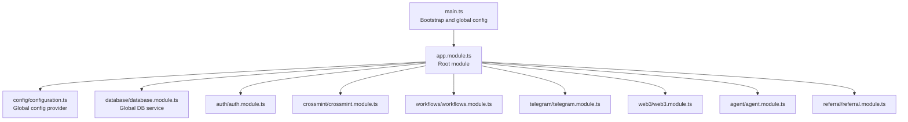
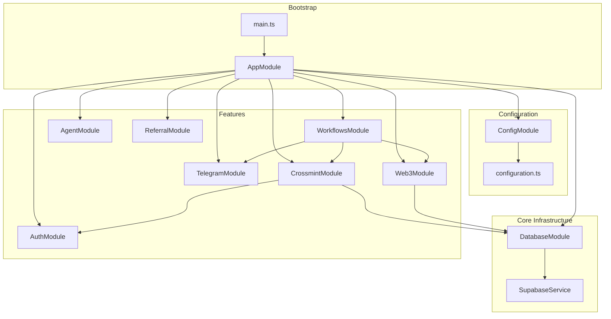
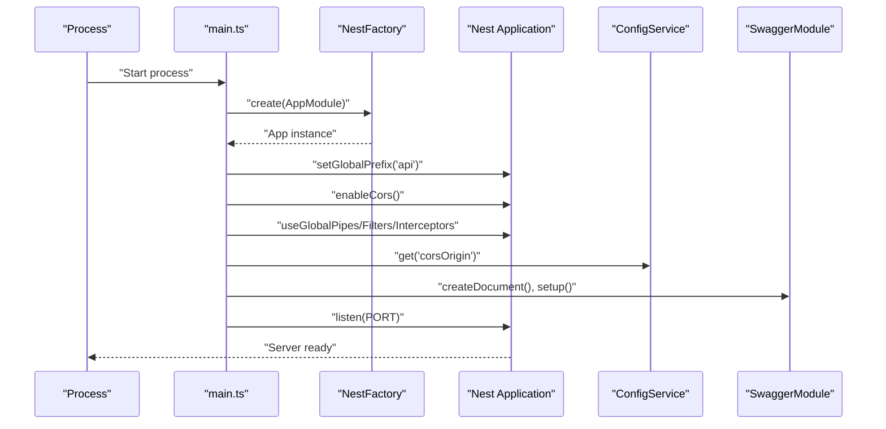
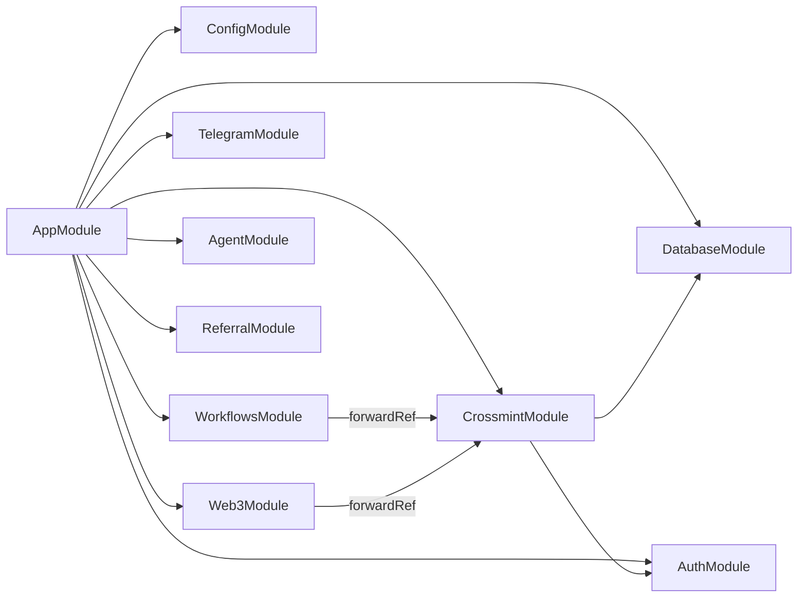
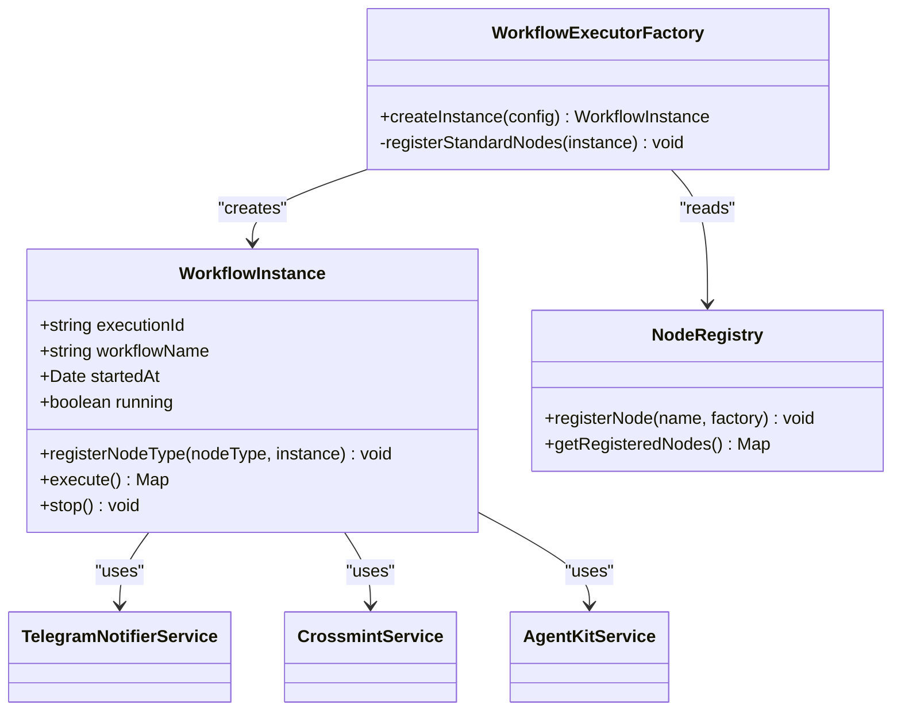
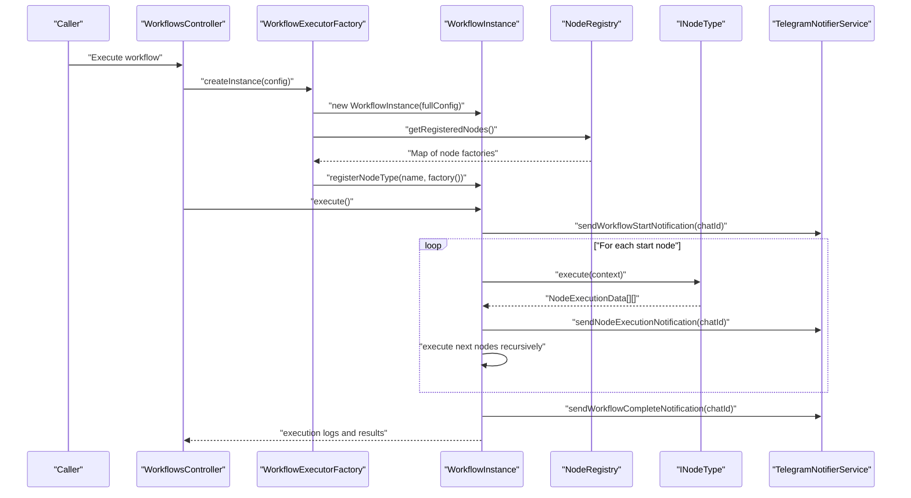
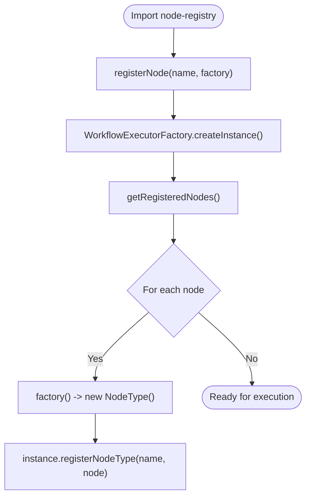
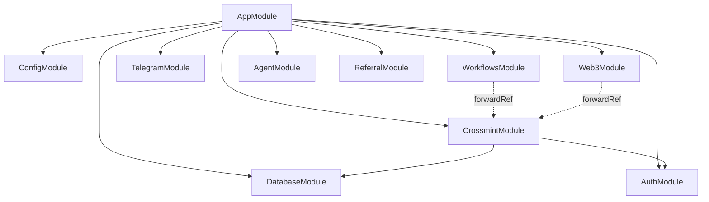

# System Design

<cite>
**Referenced Files in This Document**
- [main.ts](file://src/main.ts)
- [app.module.ts](file://src/app.module.ts)
- [configuration.ts](file://src/config/configuration.ts)
- [database.module.ts](file://src/database/database.module.ts)
- [web3.module.ts](file://src/web3/web3.module.ts)
- [crossmint.module.ts](file://src/crossmint/crossmint.module.ts)
- [auth.module.ts](file://src/auth/auth.module.ts)
- [workflows.module.ts](file://src/workflows/workflows.module.ts)
- [workflow-executor.factory.ts](file://src/workflows/workflow-executor.factory.ts)
- [workflow-instance.ts](file://src/workflows/workflow-instance.ts)
- [workflow-types.ts](file://src/web3/workflow-types.ts)
- [node-registry.ts](file://src/web3/nodes/node-registry.ts)
- [telegram.module.ts](file://src/telegram/telegram.module.ts)
- [agent.module.ts](file://src/agent/agent.module.ts)
- [referral.module.ts](file://src/referral/referral.module.ts)
</cite>

## Table of Contents
1. [Introduction](#introduction)
2. [Project Structure](#project-structure)
3. [Core Components](#core-components)
4. [Architecture Overview](#architecture-overview)
5. [Detailed Component Analysis](#detailed-component-analysis)
6. [Dependency Analysis](#dependency-analysis)
7. [Performance Considerations](#performance-considerations)
8. [Troubleshooting Guide](#troubleshooting-guide)
9. [Conclusion](#conclusion)
10. [Appendices](#appendices)

## Introduction
This document describes the system design of PinTool, a modular monolith built with NestJS. The architecture emphasizes separation of concerns across authentication, agent management, Crossmint integration, workflow engine, Telegram notifications, and database layers. It documents the dependency injection container, module loading order, controller orchestration, and the initialization sequence from main.ts through AppModule to feature module registration. Architectural patterns include a service-layer separation, a factory pattern for workflow executors, and a registry pattern for node types. Scalability, performance bottlenecks, and horizontal scaling strategies are addressed alongside configuration management and environment variable handling.

## Project Structure
PinTool follows a feature-based module layout under src/, with a central AppModule importing feature modules and a global configuration module. The system initializes via main.ts, sets global prefixes and middleware, and exposes Swagger documentation.

**Diagram sources**
- [main.ts:1-81](file://src/main.ts#L1-L81)
- [app.module.ts:1-33](file://src/app.module.ts#L1-L33)
- [configuration.ts:1-45](file://src/config/configuration.ts#L1-L45)
- [database.module.ts:1-10](file://src/database/database.module.ts#L1-L10)
- [auth.module.ts:1-11](file://src/auth/auth.module.ts#L1-L11)
- [crossmint.module.ts:1-16](file://src/crossmint/crossmint.module.ts#L1-L16)
- [workflows.module.ts:1-17](file://src/workflows/workflows.module.ts#L1-L17)
- [telegram.module.ts:1-18](file://src/telegram/telegram.module.ts#L1-L18)
- [web3.module.ts:1-13](file://src/web3/web3.module.ts#L1-L13)
- [agent.module.ts:1-15](file://src/agent/agent.module.ts#L1-L15)
- [referral.module.ts:1-14](file://src/referral/referral.module.ts#L1-L14)

**Section sources**
- [main.ts:1-81](file://src/main.ts#L1-L81)
- [app.module.ts:1-33](file://src/app.module.ts#L1-L33)

## Core Components
- Bootstrap and Initialization: main.ts creates the Nest application, sets global prefix, enables CORS based on environment, registers global pipes/filters/interceptors, builds Swagger docs, and starts the server.
- Root Module: AppModule imports configuration, database, Crossmint, Auth, Workflows, Telegram, Web3, Agent, and Referral modules, and registers top-level controllers.
- Configuration Management: configuration.ts loads environment variables into a global ConfigModule provider for consumption across modules.
- Database Layer: database.module.ts provides a globally available Supabase service.
- Feature Modules: Each domain area (Auth, Crossmint, Workflows, Telegram, Web3, Agent, Referral) encapsulates its own controllers, services, and providers.

**Section sources**
- [main.ts:9-81](file://src/main.ts#L9-L81)
- [app.module.ts:15-32](file://src/app.module.ts#L15-L32)
- [configuration.ts:1-45](file://src/config/configuration.ts#L1-L45)
- [database.module.ts:4-9](file://src/database/database.module.ts#L4-L9)

## Architecture Overview
The system is a modular monolith with explicit boundaries per feature. The dependency injection container wires services across modules. Controllers orchestrate requests and delegate to services. The workflow engine is decoupled from infrastructure via a factory and registry pattern.

**Diagram sources**
- [main.ts:1-81](file://src/main.ts#L1-L81)
- [app.module.ts:1-33](file://src/app.module.ts#L1-L33)
- [configuration.ts:1-45](file://src/config/configuration.ts#L1-L45)
- [database.module.ts:1-10](file://src/database/database.module.ts#L1-L10)
- [auth.module.ts:1-11](file://src/auth/auth.module.ts#L1-L11)
- [crossmint.module.ts:1-16](file://src/crossmint/crossmint.module.ts#L1-L16)
- [workflows.module.ts:1-17](file://src/workflows/workflows.module.ts#L1-L17)
- [telegram.module.ts:1-18](file://src/telegram/telegram.module.ts#L1-L18)
- [web3.module.ts:1-13](file://src/web3/web3.module.ts#L1-L13)
- [agent.module.ts:1-15](file://src/agent/agent.module.ts#L1-L15)
- [referral.module.ts:1-14](file://src/referral/referral.module.ts#L1-L14)

## Detailed Component Analysis

### System Initialization Sequence
The initialization sequence from bootstrap to feature module readiness:

**Diagram sources**
- [main.ts:9-78](file://src/main.ts#L9-L78)

**Section sources**
- [main.ts:9-78](file://src/main.ts#L9-L78)

### Dependency Injection Container and Module Loading Order
- AppModule imports modules in a deliberate order to satisfy dependencies: ConfigModule (global), DatabaseModule (global), then feature modules. Feature modules declare their own imports and exports.
- Global providers (e.g., SupabaseService) are exported by DatabaseModule for use across modules.
- CrossmintModule and Web3Module use forwardRef to resolve circular dependencies safely.
- TelegramModule initializes the Telegram bot during onModuleInit.

**Diagram sources**
- [app.module.ts:15-32](file://src/app.module.ts#L15-L32)
- [workflows.module.ts:10-16](file://src/workflows/workflows.module.ts#L10-L16)
- [web3.module.ts:7-12](file://src/web3/web3.module.ts#L7-L12)
- [crossmint.module.ts:9-16](file://src/crossmint/crossmint.module.ts#L9-L16)
- [telegram.module.ts:11-17](file://src/telegram/telegram.module.ts#L11-L17)

**Section sources**
- [app.module.ts:15-32](file://src/app.module.ts#L15-L32)
- [workflows.module.ts:10-16](file://src/workflows/workflows.module.ts#L10-L16)
- [web3.module.ts:7-12](file://src/web3/web3.module.ts#L7-L12)
- [crossmint.module.ts:9-16](file://src/crossmint/crossmint.module.ts#L9-L16)
- [telegram.module.ts:11-17](file://src/telegram/telegram.module.ts#L11-L17)

### Controller Orchestration
- Top-level controllers are registered in AppModule (RootController and AppController).
- Feature modules register their own controllers (e.g., AuthController, CrossmintController, WorkflowsController, TelegramController, AgentController, ReferralController).
- Controllers depend on services provided by their respective modules or imported modules.

**Section sources**
- [app.module.ts:30-31](file://src/app.module.ts#L30-L31)
- [auth.module.ts:5-10](file://src/auth/auth.module.ts#L5-L10)
- [crossmint.module.ts:9-16](file://src/crossmint/crossmint.module.ts#L9-L16)
- [workflows.module.ts:10-16](file://src/workflows/workflows.module.ts#L10-L16)
- [telegram.module.ts:6-10](file://src/telegram/telegram.module.ts#L6-L10)
- [agent.module.ts:8-14](file://src/agent/agent.module.ts#L8-L14)
- [referral.module.ts:7-13](file://src/referral/referral.module.ts#L7-L13)

### Authentication Module
- Provides wallet-based authentication DTOs and controllers.
- Exports AuthService for use by other modules.

**Section sources**
- [auth.module.ts:1-11](file://src/auth/auth.module.ts#L1-L11)

### Crossmint Integration Module
- Integrates Crossmint services and controllers.
- Depends on ConfigModule, DatabaseModule, AuthModule, and WorkflowsModule (via forwardRef).

**Section sources**
- [crossmint.module.ts:1-16](file://src/crossmint/crossmint.module.ts#L1-L16)

### Telegram Notifications Module
- Initializes Telegram bot on module startup.
- Provides TelegramNotifierService for workflow notifications.

**Section sources**
- [telegram.module.ts:1-18](file://src/telegram/telegram.module.ts#L1-L18)

### Web3 and Workflow Engine
- Web3Module provides connection and agent services and depends on DatabaseModule and CrossmintModule (via forwardRef).
- Workflow engine defines typed node interfaces and execution context.
- WorkflowExecutorFactory constructs WorkflowInstance with injected services and auto-registers node types from the registry.

**Diagram sources**
- [workflow-instance.ts:33-151](file://src/workflows/workflow-instance.ts#L33-L151)
- [workflow-executor.factory.ts:8-41](file://src/workflows/workflow-executor.factory.ts#L8-L41)
- [node-registry.ts:7-21](file://src/web3/nodes/node-registry.ts#L7-L21)

**Section sources**
- [web3.module.ts:7-12](file://src/web3/web3.module.ts#L7-L12)
- [workflow-types.ts:12-56](file://src/web3/workflow-types.ts#L12-L56)
- [workflow-instance.ts:33-151](file://src/workflows/workflow-instance.ts#L33-L151)
- [workflow-executor.factory.ts:8-41](file://src/workflows/workflow-executor.factory.ts#L8-L41)
- [node-registry.ts:7-47](file://src/web3/nodes/node-registry.ts#L7-L47)

### Workflow Execution Flow
End-to-end workflow execution orchestrated by WorkflowExecutorFactory and WorkflowInstance:

**Diagram sources**
- [workflow-executor.factory.ts:17-34](file://src/workflows/workflow-executor.factory.ts#L17-L34)
- [workflow-instance.ts:94-151](file://src/workflows/workflow-instance.ts#L94-L151)
- [node-registry.ts:36-47](file://src/web3/nodes/node-registry.ts#L36-L47)

**Section sources**
- [workflow-executor.factory.ts:17-34](file://src/workflows/workflow-executor.factory.ts#L17-L34)
- [workflow-instance.ts:94-151](file://src/workflows/workflow-instance.ts#L94-L151)

### Node Registry Pattern
- Node types are registered centrally in node-registry.ts.
- Each node implements INodeType and is lazily instantiated via factory functions.
- WorkflowExecutorFactory reads the registry and registers nodes into WorkflowInstance.

**Diagram sources**
- [node-registry.ts:12-21](file://src/web3/nodes/node-registry.ts#L12-L21)
- [workflow-executor.factory.ts:36-40](file://src/workflows/workflow-executor.factory.ts#L36-L40)

**Section sources**
- [node-registry.ts:12-21](file://src/web3/nodes/node-registry.ts#L12-L21)
- [workflow-executor.factory.ts:36-40](file://src/workflows/workflow-executor.factory.ts#L36-L40)

### Configuration Management and Environment Variables
- configuration.ts consolidates environment variables into a single ConfigModule provider.
- main.ts reads CORS origin from ConfigService to configure CORS policy.
- Modules consume configuration via ConfigService to initialize external integrations (e.g., Solana RPC, Pyth Hermes, Crossmint keys).

**Section sources**
- [configuration.ts:1-45](file://src/config/configuration.ts#L1-L45)
- [main.ts:19-23](file://src/main.ts#L19-L23)

### Agent Management Module
- AgentModule orchestrates agent-related controllers and services and depends on AuthModule, CrossmintModule, and WorkflowsModule.

**Section sources**
- [agent.module.ts:1-15](file://src/agent/agent.module.ts#L1-L15)

### Referral Module
- ReferralModule provides referral code generation and redemption services and depends on AuthModule.

**Section sources**
- [referral.module.ts:1-14](file://src/referral/referral.module.ts#L1-L14)

## Dependency Analysis
The module dependency graph reveals a layered architecture with clear import/export boundaries and forwardRef usage to break cycles.

**Diagram sources**
- [app.module.ts:15-32](file://src/app.module.ts#L15-L32)
- [workflows.module.ts:10-16](file://src/workflows/workflows.module.ts#L10-L16)
- [web3.module.ts:7-12](file://src/web3/web3.module.ts#L7-L12)
- [crossmint.module.ts:9-16](file://src/crossmint/crossmint.module.ts#L9-L16)

**Section sources**
- [app.module.ts:15-32](file://src/app.module.ts#L15-L32)
- [workflows.module.ts:10-16](file://src/workflows/workflows.module.ts#L10-L16)
- [web3.module.ts:7-12](file://src/web3/web3.module.ts#L7-L12)
- [crossmint.module.ts:9-16](file://src/crossmint/crossmint.module.ts#L9-L16)

## Performance Considerations
- Concurrency and Parallelism: WorkflowInstance executes nodes breadth-first from start nodes; ensure node implementations avoid blocking operations and leverage asynchronous patterns. Consider batching external API calls (e.g., RPC or Crossmint) to reduce latency.
- Circuit Breakers and Retries: Introduce retry/backoff and circuit breaker patterns around external services (Solana RPC, Pyth, Helius, Sanctum) to mitigate transient failures.
- Caching: Cache frequently accessed data (e.g., token prices, wallet balances) using in-memory or Redis caching to reduce repeated network calls.
- Horizontal Scaling: Run multiple instances behind a load balancer. Use sticky sessions only if Telegram webhook requires it; otherwise, distribute stateless workloads across instances. Persist stateful data in the database and keep caches coherent.
- Monitoring and Metrics: Add metrics for workflow execution durations, node throughput, and error rates. Use structured logging and correlation IDs to trace requests across services.
- Database Bottlenecks: Optimize queries and indexes in Supabase. Use read replicas for heavy reads and write sharding if needed. Apply connection pooling and limit long-running transactions.

[No sources needed since this section provides general guidance]

## Troubleshooting Guide
- CORS Issues: Verify CORS origin configuration loaded from environment variables and applied via ConfigService.
- Telegram Notifications: Confirm Telegram bot token and webhook URL are configured; check that TelegramModule initialized the bot and notifier services.
- Crossmint Integration: Validate Crossmint API key and environment settings; ensure CrossmintModule is imported and services are available.
- Workflow Failures: Inspect execution logs returned by WorkflowInstance and node-level logs. Check node registration and parameter resolution in the execution context.
- Database Connectivity: Ensure Supabase URL and keys are set; confirm DatabaseModule is imported and globally available.

**Section sources**
- [main.ts:19-23](file://src/main.ts#L19-L23)
- [configuration.ts:12-16](file://src/config/configuration.ts#L12-L16)
- [crossmint.module.ts:9-16](file://src/crossmint/crossmint.module.ts#L9-L16)
- [telegram.module.ts:11-17](file://src/telegram/telegram.module.ts#L11-L17)
- [workflow-instance.ts:134-151](file://src/workflows/workflow-instance.ts#L134-L151)

## Conclusion
PinTool’s modular monolith architecture cleanly separates concerns across authentication, agent management, Crossmint integration, workflow engine, Telegram notifications, and database layers. The dependency injection container, combined with explicit module imports and exports, ensures maintainable and testable code. The workflow engine leverages a factory and registry pattern to enable extensibility and controlled instantiation of node types. With proper configuration management, performance optimizations, and horizontal scaling strategies, the system can evolve to meet growing demands while preserving modularity and clarity.

[No sources needed since this section summarizes without analyzing specific files]

## Appendices

### Environment Variables Reference
- Port and environment: PORT, NODE_ENV
- CORS: CORS_ORIGIN
- Supabase: SUPABASE_URL, SUPABASE_ANON_KEY, SUPABASE_SERVICE_KEY
- Telegram: TELEGRAM_BOT_TOKEN, TELEGRAM_NOTIFY_ENABLED, TELEGRAM_WEBHOOK_URL
- Solana: SOLANA_RPC_URL, SOLANA_WS_URL
- Pyth: PYTH_HERMES_ENDPOINT
- Crossmint: CROSSMINT_SERVER_API_KEY, CROSSMINT_SIGNER_SECRET, CROSSMINT_ENVIRONMENT
- Helius: HELIUS_API_KEY
- Lulo: LULO_API_KEY
- Sanctum: SANCTUM_API_KEY

**Section sources**
- [configuration.ts:1-45](file://src/config/configuration.ts#L1-L45)