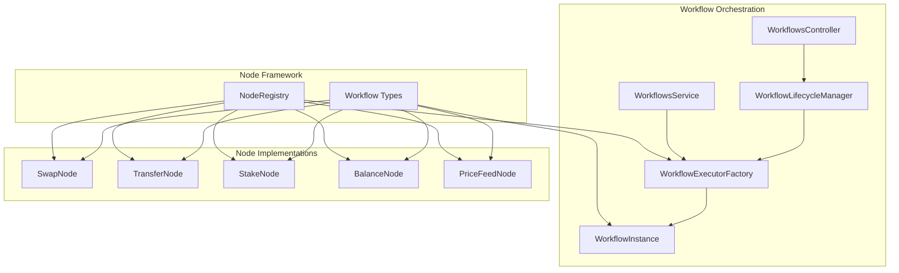
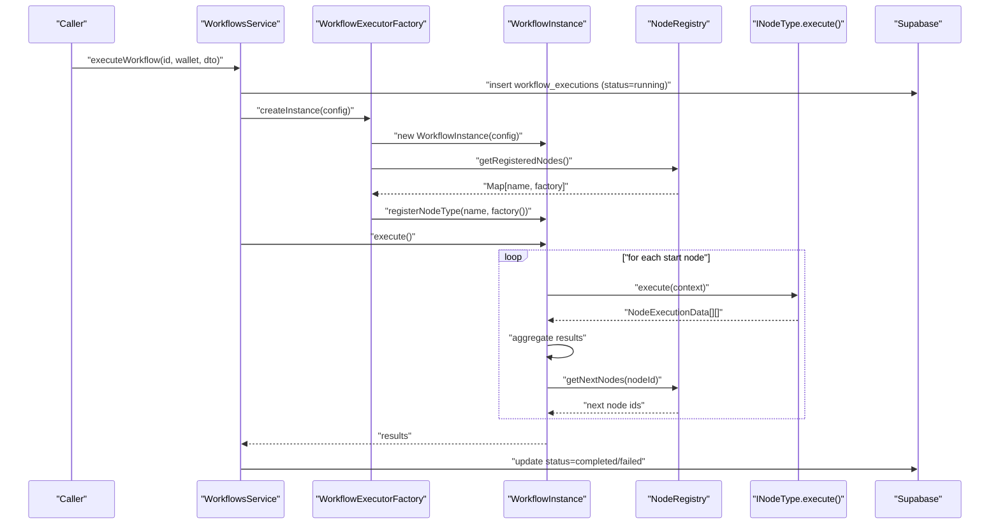
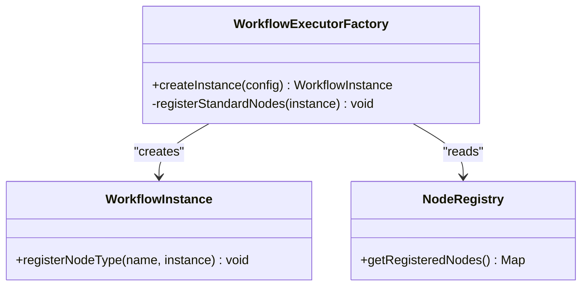
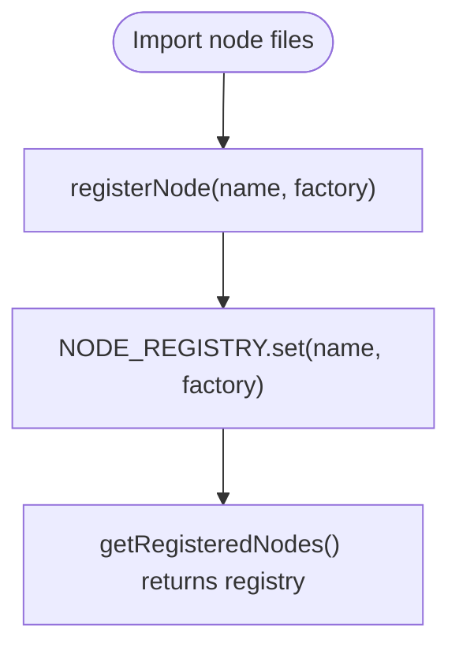
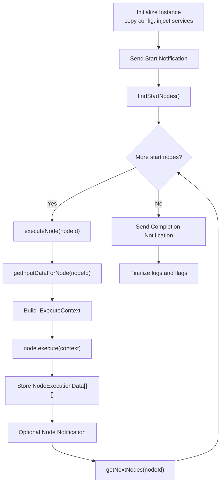
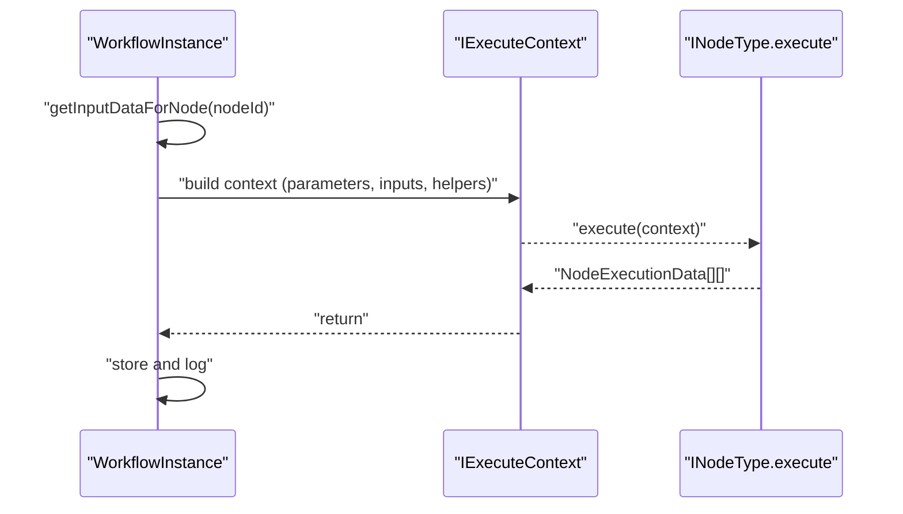
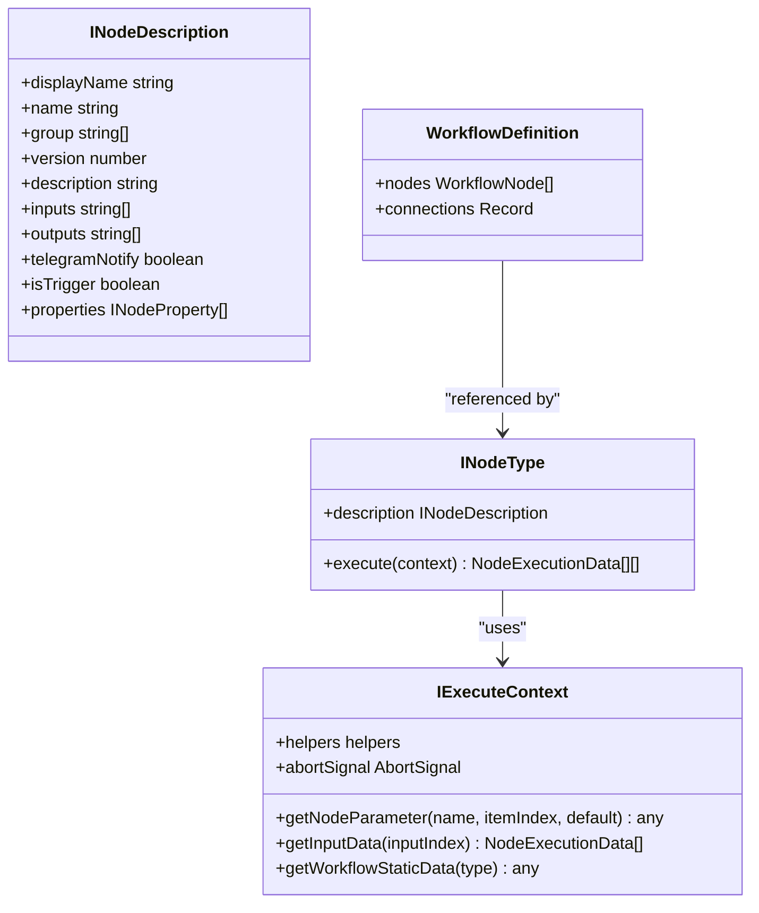
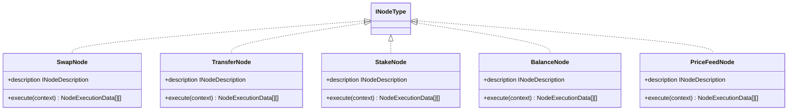
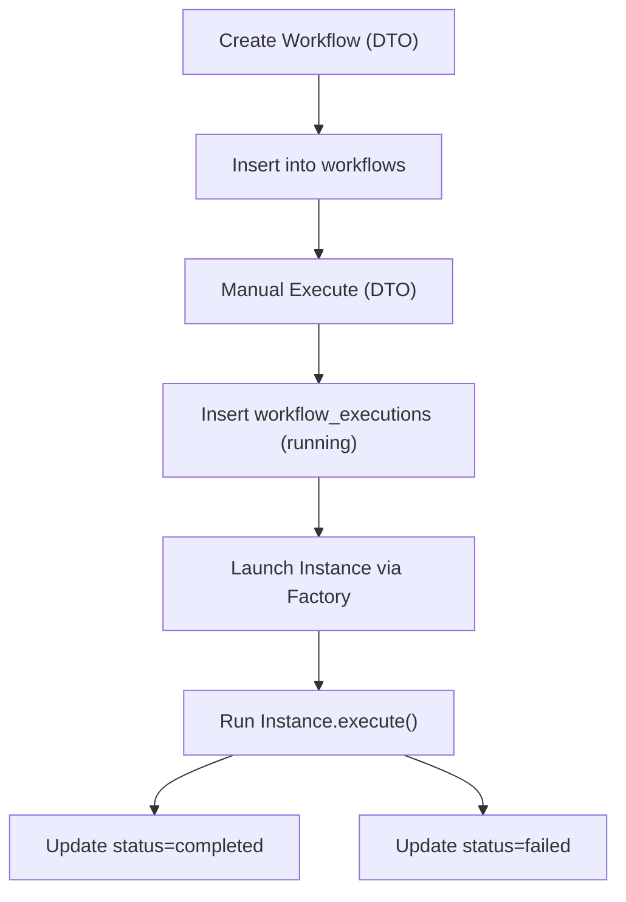
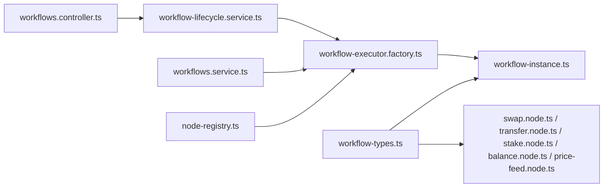

# Workflow Engine Architecture

<cite>
**Referenced Files in This Document**
- [workflow-executor.factory.ts](file://src/workflows/workflow-executor.factory.ts)
- [workflow-instance.ts](file://src/workflows/workflow-instance.ts)
- [workflow-lifecycle.service.ts](file://src/workflows/workflow-lifecycle.service.ts)
- [node-registry.ts](file://src/web3/nodes/node-registry.ts)
- [workflow-types.ts](file://src/web3/workflow-types.ts)
- [swap.node.ts](file://src/web3/nodes/swap.node.ts)
- [transfer.node.ts](file://src/web3/nodes/transfer.node.ts)
- [stake.node.ts](file://src/web3/nodes/stake.node.ts)
- [balance.node.ts](file://src/web3/nodes/balance.node.ts)
- [price-feed.node.ts](file://src/web3/nodes/price-feed.node.ts)
- [workflows.service.ts](file://src/workflows/workflows.service.ts)
- [workflows.controller.ts](file://src/workflows/workflows.controller.ts)
- [create-workflow.dto.ts](file://src/workflows/dto/create-workflow.dto.ts)
- [execute-workflow.dto.ts](file://src/workflows/dto/execute-workflow.dto.ts)
- [update-workflow.dto.ts](file://src/workflows/dto/update-workflow.dto.ts)
</cite>

## Table of Contents
1. [Introduction](#introduction)
2. [Project Structure](#project-structure)
3. [Core Components](#core-components)
4. [Architecture Overview](#architecture-overview)
5. [Detailed Component Analysis](#detailed-component-analysis)
6. [Dependency Analysis](#dependency-analysis)
7. [Performance Considerations](#performance-considerations)
8. [Troubleshooting Guide](#troubleshooting-guide)
9. [Conclusion](#conclusion)
10. [Appendices](#appendices)

## Introduction
This document explains the workflow engine’s node-based execution system. It covers the factory pattern for creating isolated workflow execution instances, the registry pattern for managing node types, the lifecycle of workflow instances (creation, execution phases, error handling, and cleanup), node architecture and interfaces, execution context management, parameter passing, result aggregation, workflow definition storage and validation, execution monitoring, concurrency control, resource management, and performance optimization strategies.

## Project Structure
The workflow engine is organized around three primary layers:
- Workflow orchestration: factories, lifecycle manager, and services/controllers for execution and monitoring
- Node framework: shared interfaces and registry for pluggable node implementations
- Node implementations: concrete operations (swap, transfer, stake, balance, price feed, etc.)

**Diagram sources**
- [workflow-executor.factory.ts:1-42](file://src/workflows/workflow-executor.factory.ts#L1-L42)
- [workflow-instance.ts:1-314](file://src/workflows/workflow-instance.ts#L1-L314)
- [workflow-lifecycle.service.ts:1-343](file://src/workflows/workflow-lifecycle.service.ts#L1-L343)
- [node-registry.ts:1-47](file://src/web3/nodes/node-registry.ts#L1-L47)
- [workflow-types.ts:1-91](file://src/web3/workflow-types.ts#L1-L91)
- [swap.node.ts:1-209](file://src/web3/nodes/swap.node.ts#L1-L209)
- [transfer.node.ts:1-199](file://src/web3/nodes/transfer.node.ts#L1-L199)
- [stake.node.ts:1-297](file://src/web3/nodes/stake.node.ts#L1-L297)
- [balance.node.ts:1-196](file://src/web3/nodes/balance.node.ts#L1-L196)
- [price-feed.node.ts:1-133](file://src/web3/nodes/price-feed.node.ts#L1-L133)

**Section sources**
- [workflow-executor.factory.ts:1-42](file://src/workflows/workflow-executor.factory.ts#L1-L42)
- [workflow-instance.ts:1-314](file://src/workflows/workflow-instance.ts#L1-L314)
- [workflow-lifecycle.service.ts:1-343](file://src/workflows/workflow-lifecycle.service.ts#L1-L343)
- [node-registry.ts:1-47](file://src/web3/nodes/node-registry.ts#L1-L47)
- [workflow-types.ts:1-91](file://src/web3/workflow-types.ts#L1-L91)

## Core Components
- WorkflowExecutorFactory: Creates isolated WorkflowInstance with injected services and registers standard node types from the registry.
- WorkflowInstance: Encapsulates a single execution session, manages execution logs, orchestrates node execution, and aggregates results.
- WorkflowLifecycleManager: Polls active accounts, launches and cleans up workflow instances, enforces minimum SOL balance checks, and persists execution outcomes.
- NodeRegistry: Central registry for node types using a factory pattern; new nodes are registered here.
- Workflow Types: Shared interfaces for nodes, execution context, workflow definitions, and data structures.
- Node Implementations: Concrete nodes implementing INodeType for swap, transfer, stake, balance, and price feed operations.

**Section sources**
- [workflow-executor.factory.ts:17-40](file://src/workflows/workflow-executor.factory.ts#L17-L40)
- [workflow-instance.ts:33-75](file://src/workflows/workflow-instance.ts#L33-L75)
- [workflow-lifecycle.service.ts:12-343](file://src/workflows/workflow-lifecycle.service.ts#L12-L343)
- [node-registry.ts:7-47](file://src/web3/nodes/node-registry.ts#L7-L47)
- [workflow-types.ts:4-91](file://src/web3/workflow-types.ts#L4-L91)

## Architecture Overview
The engine follows a factory-and-registry pattern to decouple instance creation from node implementations. Execution proceeds by traversing nodes from start nodes determined by the workflow definition’s connections, passing data between nodes via input collections.

**Diagram sources**
- [workflows.service.ts:83-214](file://src/workflows/workflows.service.ts#L83-L214)
- [workflow-executor.factory.ts:17-40](file://src/workflows/workflow-executor.factory.ts#L17-L40)
- [workflow-instance.ts:94-151](file://src/workflows/workflow-instance.ts#L94-L151)
- [node-registry.ts:19-40](file://src/web3/nodes/node-registry.ts#L19-L40)

## Detailed Component Analysis

### Factory Pattern: WorkflowExecutorFactory
- Purpose: Build isolated WorkflowInstance with pre-registered node types and injected services.
- Behavior:
  - Accepts a partial config and injects Telegram notifier, Crossmint service, and AgentKit service.
  - Instantiates WorkflowInstance and registers all node types from the registry.

**Diagram sources**
- [workflow-executor.factory.ts:9-40](file://src/workflows/workflow-executor.factory.ts#L9-L40)
- [workflow-instance.ts:87-89](file://src/workflows/workflow-instance.ts#L87-L89)
- [node-registry.ts:19-21](file://src/web3/nodes/node-registry.ts#L19-L21)

**Section sources**
- [workflow-executor.factory.ts:17-40](file://src/workflows/workflow-executor.factory.ts#L17-L40)

### Registry Pattern: NodeRegistry
- Purpose: Centralized registration of node factories to enable dynamic discovery and registration during instance creation.
- Behavior:
  - Stores a map of node name to factory returning INodeType.
  - Exposes getters to enumerate all registered nodes.

**Diagram sources**
- [node-registry.ts:7-21](file://src/web3/nodes/node-registry.ts#L7-L21)

**Section sources**
- [node-registry.ts:7-47](file://src/web3/nodes/node-registry.ts#L7-L47)

### WorkflowInstance: Lifecycle and Execution
- Responsibilities:
  - Track execution state, logs, and runtime resources.
  - Resolve start nodes from workflow definition.
  - Execute nodes recursively, passing input data from upstream nodes.
  - Aggregate results per node and maintain execution logs.
  - Support cancellation via AbortController.
- Execution phases:
  - Initialization: copy config, inject services, initialize logs and flags.
  - Start notification: optional Telegram notification.
  - Execution: traverse nodes, build context, call node.execute(), notify per-node.
  - Completion: send completion notification and persist logs.
  - Cleanup: finalize flags and resources.

**Diagram sources**
- [workflow-instance.ts:94-151](file://src/workflows/workflow-instance.ts#L94-L151)
- [workflow-instance.ts:162-258](file://src/workflows/workflow-instance.ts#L162-L258)
- [workflow-instance.ts:260-312](file://src/workflows/workflow-instance.ts#L260-L312)

**Section sources**
- [workflow-instance.ts:33-75](file://src/workflows/workflow-instance.ts#L33-L75)
- [workflow-instance.ts:94-151](file://src/workflows/workflow-instance.ts#L94-L151)
- [workflow-instance.ts:162-258](file://src/workflows/workflow-instance.ts#L162-L258)
- [workflow-instance.ts:260-312](file://src/workflows/workflow-instance.ts#L260-L312)

### Execution Context Management and Parameter Passing
- IExecuteContext provides:
  - getNodeParameter: resolve parameters from node definition, inject services, or override with crossmint wallet address.
  - getInputData: fetch aggregated input items from upstream nodes.
  - getWorkflowStaticData: placeholder for static data access.
  - helpers.returnJsonArray: normalize JSON outputs to NodeExecutionData[][].
  - abortSignal: support for cooperative cancellation.
- Data flow:
  - Inputs are collected from all upstream connections to a node.
  - Results are stored per node and later consumed by downstream nodes.

**Diagram sources**
- [workflow-instance.ts:188-213](file://src/workflows/workflow-instance.ts#L188-L213)
- [workflow-instance.ts:277-296](file://src/workflows/workflow-instance.ts#L277-L296)

**Section sources**
- [workflow-instance.ts:188-213](file://src/workflows/workflow-instance.ts#L188-L213)
- [workflow-instance.ts:277-296](file://src/workflows/workflow-instance.ts#L277-L296)

### Node Architecture and Interfaces
- INodeType: Defines a node with description metadata and execute method returning NodeExecutionData[][].
- IExecuteContext: Provides parameter resolution, input retrieval, helpers, and abort signal.
- WorkflowDefinition: Describes nodes and connections; connections are grouped by channel (e.g., main) and indexed.

**Diagram sources**
- [workflow-types.ts:12-56](file://src/web3/workflow-types.ts#L12-L56)
- [workflow-types.ts:82-90](file://src/web3/workflow-types.ts#L82-L90)

**Section sources**
- [workflow-types.ts:12-56](file://src/web3/workflow-types.ts#L12-L56)
- [workflow-types.ts:82-90](file://src/web3/workflow-types.ts#L82-L90)

### Node Implementations
- SwapNode: Executes token swaps via AgentKit, supports amount parsing from previous node output, and returns standardized JSON results.
- TransferNode: Sends SOL or SPL tokens to a recipient using Crossmint wallet, validates inputs, and returns signatures and metadata.
- StakeNode: Performs staking/unstaking jupSOL/SOL via Jupiter APIs, handles amount parsing, and returns operation results.
- BalanceNode: Queries SOL or SPL token balances and optionally enforces conditions for downstream execution.
- PriceFeedNode: Monitors price feeds and triggers workflow execution when thresholds are met, integrates abort signals.

**Diagram sources**
- [swap.node.ts:49-209](file://src/web3/nodes/swap.node.ts#L49-L209)
- [transfer.node.ts:15-199](file://src/web3/nodes/transfer.node.ts#L15-L199)
- [stake.node.ts:16-297](file://src/web3/nodes/stake.node.ts#L16-L297)
- [balance.node.ts:15-196](file://src/web3/nodes/balance.node.ts#L15-L196)
- [price-feed.node.ts:5-133](file://src/web3/nodes/price-feed.node.ts#L5-L133)

**Section sources**
- [swap.node.ts:49-209](file://src/web3/nodes/swap.node.ts#L49-L209)
- [transfer.node.ts:15-199](file://src/web3/nodes/transfer.node.ts#L15-L199)
- [stake.node.ts:16-297](file://src/web3/nodes/stake.node.ts#L16-L297)
- [balance.node.ts:15-196](file://src/web3/nodes/balance.node.ts#L15-L196)
- [price-feed.node.ts:5-133](file://src/web3/nodes/price-feed.node.ts#L5-L133)

### Workflow Definition Storage and Validation
- Storage:
  - Workflows are persisted in the workflows table with owner wallet address and definition snapshot.
  - Executions are recorded in workflow_executions with status, timestamps, and execution_data logs.
- Validation:
  - Manual execution uses DTOs to validate inputs and optional accountId overrides.
  - Lifecycle manager ensures accounts are active and have a current_workflow_id before launching instances.
  - Minimum SOL balance check prevents launching instances with insufficient funds.

**Diagram sources**
- [workflows.service.ts:60-81](file://src/workflows/workflows.service.ts#L60-L81)
- [workflows.service.ts:83-214](file://src/workflows/workflows.service.ts#L83-L214)
- [workflow-lifecycle.service.ts:238-341](file://src/workflows/workflow-lifecycle.service.ts#L238-L341)

**Section sources**
- [workflows.service.ts:60-81](file://src/workflows/workflows.service.ts#L60-L81)
- [workflows.service.ts:83-214](file://src/workflows/workflows.service.ts#L83-L214)
- [workflow-lifecycle.service.ts:238-341](file://src/workflows/workflow-lifecycle.service.ts#L238-L341)
- [create-workflow.dto.ts:4-62](file://src/workflows/dto/create-workflow.dto.ts#L4-L62)
- [execute-workflow.dto.ts:5-26](file://src/workflows/dto/execute-workflow.dto.ts#L5-L26)
- [update-workflow.dto.ts:4-43](file://src/workflows/dto/update-workflow.dto.ts#L4-L43)

### Execution Monitoring and Notifications
- Telegram integration:
  - Start, completion, and per-node notifications are sent when enabled and chatId is present.
- Execution logs:
  - Per-node logs capture start/end times, input, output, and errors.
  - Logs are persisted with execution records upon completion.

**Section sources**
- [workflow-instance.ts:103-132](file://src/workflows/workflow-instance.ts#L103-L132)
- [workflow-instance.ts:236-243](file://src/workflows/workflow-instance.ts#L236-L243)
- [workflows.service.ts:176-208](file://src/workflows/workflows.service.ts#L176-L208)
- [workflow-lifecycle.service.ts:304-334](file://src/workflows/workflow-lifecycle.service.ts#L304-L334)

### Concurrency Control and Resource Management
- Concurrency control:
  - In-flight execution guard prevents overlapping runs for the same workflow+wallet+accountId combination.
  - Lifecycle manager polls periodically and avoids concurrent sync loops via a flag.
- Resource management:
  - AbortController enables cooperative cancellation during long-running nodes (e.g., price monitoring).
  - Minimum SOL balance check prevents unnecessary work on underfunded wallets.

**Section sources**
- [workflows.service.ts:14-18](file://src/workflows/workflows.service.ts#L14-L18)
- [workflows.service.ts:83-107](file://src/workflows/workflows.service.ts#L83-L107)
- [workflow-lifecycle.service.ts:48-65](file://src/workflows/workflow-lifecycle.service.ts#L48-L65)
- [workflow-lifecycle.service.ts:216-229](file://src/workflows/workflow-lifecycle.service.ts#L216-L229)
- [workflow-instance.ts:51](file://src/workflows/workflow-instance.ts#L51)

## Dependency Analysis
The system exhibits low coupling between orchestration and node implementations, with clear boundaries enforced by shared types and the registry.

**Diagram sources**
- [workflow-types.ts:1-91](file://src/web3/workflow-types.ts#L1-L91)
- [workflow-instance.ts:1-10](file://src/workflows/workflow-instance.ts#L1-L10)
- [swap.node.ts:1-2](file://src/web3/nodes/swap.node.ts#L1-L2)
- [transfer.node.ts:1-2](file://src/web3/nodes/transfer.node.ts#L1-L2)
- [stake.node.ts:1-3](file://src/web3/nodes/stake.node.ts#L1-L3)
- [balance.node.ts:1-5](file://src/web3/nodes/balance.node.ts#L1-L5)
- [price-feed.node.ts:1-3](file://src/web3/nodes/price-feed.node.ts#L1-L3)
- [node-registry.ts:1-7](file://src/web3/nodes/node-registry.ts#L1-L7)
- [workflow-executor.factory.ts:1-6](file://src/workflows/workflow-executor.factory.ts#L1-L6)
- [workflows.service.ts:1-5](file://src/workflows/workflows.service.ts#L1-L5)
- [workflow-lifecycle.service.ts:1-7](file://src/workflows/workflow-lifecycle.service.ts#L1-L7)
- [workflows.controller.ts:1-4](file://src/workflows/workflows.controller.ts#L1-L4)

**Section sources**
- [workflow-types.ts:1-91](file://src/web3/workflow-types.ts#L1-L91)
- [workflow-executor.factory.ts:1-6](file://src/workflows/workflow-executor.factory.ts#L1-L6)
- [workflow-instance.ts:1-10](file://src/workflows/workflow-instance.ts#L1-L10)
- [node-registry.ts:1-7](file://src/web3/nodes/node-registry.ts#L1-L7)
- [workflows.service.ts:1-5](file://src/workflows/workflows.service.ts#L1-L5)
- [workflow-lifecycle.service.ts:1-7](file://src/workflows/workflow-lifecycle.service.ts#L1-L7)
- [workflows.controller.ts:1-4](file://src/workflows/workflows.controller.ts#L1-L4)

## Performance Considerations
- Asynchronous execution: Instances execute fire-and-forget from the API perspective, minimizing latency for callers.
- Minimal coupling: Registry-based node discovery avoids hard dependencies and supports incremental node addition.
- Input aggregation: Efficiently collects upstream outputs to reduce repeated network calls.
- Abort signals: Long-running nodes (e.g., price monitoring) can exit early on cancellation.
- Periodic polling: Lifecycle manager uses a fixed interval to avoid excessive DB load while keeping synchronization timely.

[No sources needed since this section provides general guidance]

## Troubleshooting Guide
Common issues and remedies:
- Unregistered node type: Ensure the node is imported and registered in the registry; the factory registers all nodes from the registry.
- Missing services in context: Verify that injected services (Telegram notifier, Crossmint service, AgentKit service) are available in the factory and passed to the instance.
- Insufficient SOL balance: Lifecycle manager skips instance launch if the Crossmint wallet has less than the minimum balance.
- Duplicate executions: In-flight guard prevents overlapping runs for the same workflow+wallet+accountId; wait for the existing run to finish.
- Node failures: Execution logs capture node status, duration, and error messages; inspect logs in workflow_executions.

**Section sources**
- [workflow-executor.factory.ts:36-40](file://src/workflows/workflow-executor.factory.ts#L36-L40)
- [workflow-instance.ts:188-213](file://src/workflows/workflow-instance.ts#L188-L213)
- [workflow-lifecycle.service.ts:246-255](file://src/workflows/workflow-lifecycle.service.ts#L246-L255)
- [workflows.service.ts:14-18](file://src/workflows/workflows.service.ts#L14-L18)
- [workflows.service.ts:191-208](file://src/workflows/workflows.service.ts#L191-L208)

## Conclusion
The workflow engine employs a clean separation of concerns: a factory constructs isolated execution instances, a registry centralizes node discovery, and shared types define the contract for node implementations. Execution is orchestrated deterministically from start nodes, with robust logging, notifications, and safeguards against concurrency and resource issues. Node implementations encapsulate domain logic while adhering to a consistent interface, enabling extensibility and maintainability.

[No sources needed since this section summarizes without analyzing specific files]

## Appendices

### API Definitions
- Execute Workflow
  - Method: POST
  - Path: Execute workflow manually
  - Request body: ExecuteWorkflowDto
  - Response: Execution record with status and logs

- Active Instances
  - Method: GET
  - Path: Retrieve in-memory active workflow instances
  - Response: Array of instance summaries

**Section sources**
- [workflows.controller.ts:11-26](file://src/workflows/workflows.controller.ts#L11-L26)
- [execute-workflow.dto.ts:5-26](file://src/workflows/dto/execute-workflow.dto.ts#L5-L26)