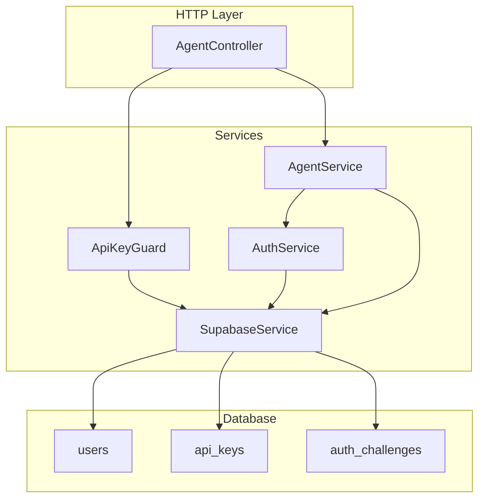
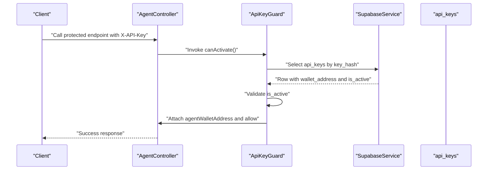
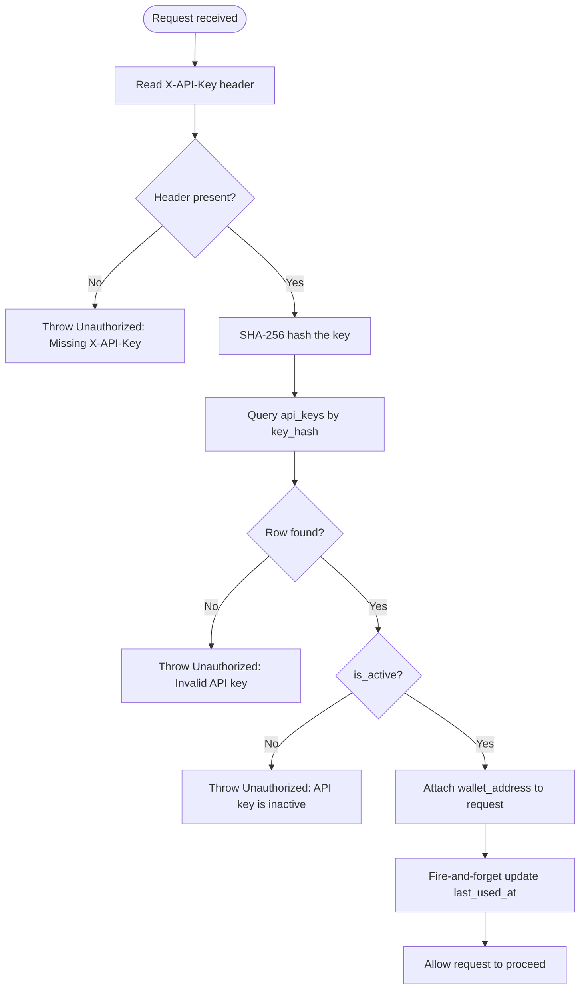
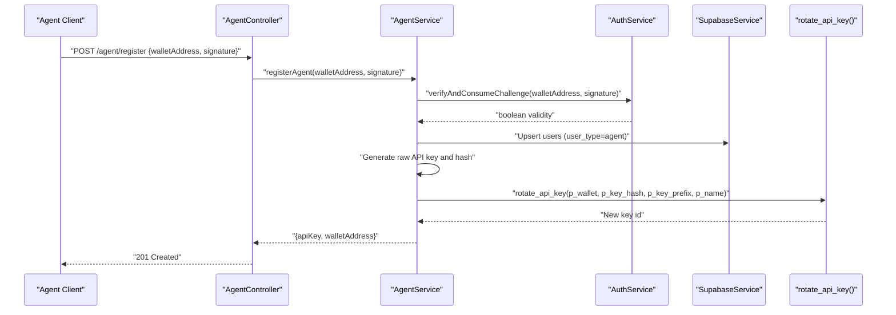
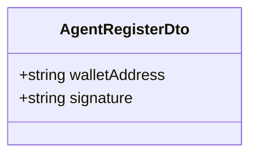
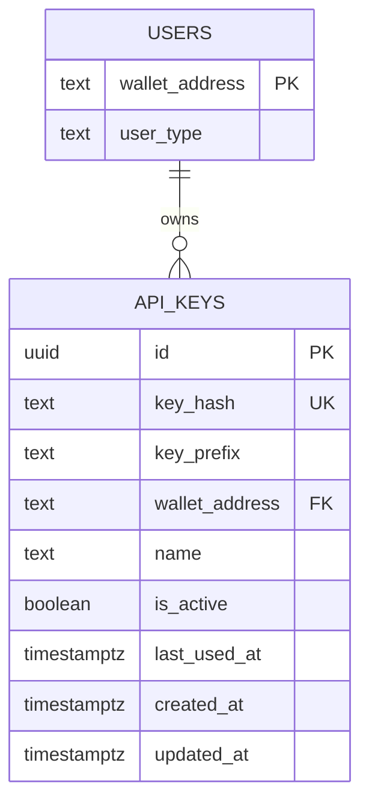
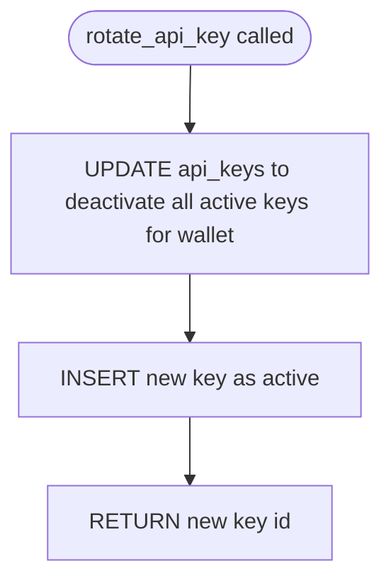
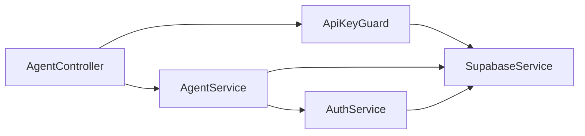

# API Key Authentication

<cite>
**Referenced Files in This Document**
- [api-key.guard.ts](file://src/common/guards/api-key.guard.ts)
- [agent-register.dto.ts](file://src/agent/dto/agent-register.dto.ts)
- [agent.service.ts](file://src/agent/agent.service.ts)
- [agent.controller.ts](file://src/agent/agent.controller.ts)
- [auth.service.ts](file://src/auth/auth.service.ts)
- [supabase.service.ts](file://src/database/supabase.service.ts)
- [agent-wallet.decorator.ts](file://src/common/decorators/agent-wallet.decorator.ts)
- [20260218000000_add_agent_api_keys.sql](file://supabase/migrations/20260218000000_add_agent_api_keys.sql)
- [20260218010000_add_rotate_api_key_function.sql](file://supabase/migrations/20260218010000_add_rotate_api_key_function.sql)
- [20260128140000_add_auth_challenges.sql](file://supabase/migrations/20260128140000_add_auth_challenges.sql)
- [check_keys.js](file://scripts/check_keys.js)
</cite>

## Table of Contents
1. [Introduction](#introduction)
2. [Project Structure](#project-structure)
3. [Core Components](#core-components)
4. [Architecture Overview](#architecture-overview)
5. [Detailed Component Analysis](#detailed-component-analysis)
6. [Dependency Analysis](#dependency-analysis)
7. [Performance Considerations](#performance-considerations)
8. [Troubleshooting Guide](#troubleshooting-guide)
9. [Conclusion](#conclusion)
10. [Appendices](#appendices)

## Introduction
This document explains the API key authentication system used by agents and programs. It covers the API key generation and rotation process, validation workflow, agent registration flow (including DTO validation), secure storage of API keys in the database, route protection via the API key guard, and integration with the agent service for key verification. It also provides practical usage examples, security considerations, database schema changes, stored procedures for rotation, and troubleshooting guidance for common issues.

## Project Structure
The API key authentication spans several modules:
- Guard: Validates incoming requests using the X-API-Key header and checks the database for a matching, active key.
- Agent service: Generates a raw API key, hashes it, and rotates it atomically via a stored procedure.
- Agent controller: Exposes the agent registration endpoint and protected endpoints guarded by the API key guard.
- Auth service: Provides wallet signature challenge generation and verification used during agent registration.
- Database: Stores users, API keys, and auth challenges; enforces row-level security and constraints.
- Decorators: Extracts the agent’s wallet address from the validated request context.

**Diagram sources**
- [agent.controller.ts:1-111](file://src/agent/agent.controller.ts#L1-L111)
- [api-key.guard.ts:1-56](file://src/common/guards/api-key.guard.ts#L1-L56)
- [agent.service.ts:1-77](file://src/agent/agent.service.ts#L1-L77)
- [auth.service.ts:1-165](file://src/auth/auth.service.ts#L1-L165)
- [supabase.service.ts:1-42](file://src/database/supabase.service.ts#L1-L42)
- [20260218000000_add_agent_api_keys.sql:1-48](file://supabase/migrations/20260218000000_add_agent_api_keys.sql#L1-L48)
- [20260128140000_add_auth_challenges.sql:1-7](file://supabase/migrations/20260128140000_add_auth_challenges.sql#L1-L7)

**Section sources**
- [agent.controller.ts:1-111](file://src/agent/agent.controller.ts#L1-L111)
- [api-key.guard.ts:1-56](file://src/common/guards/api-key.guard.ts#L1-L56)
- [agent.service.ts:1-77](file://src/agent/agent.service.ts#L1-L77)
- [auth.service.ts:1-165](file://src/auth/auth.service.ts#L1-L165)
- [supabase.service.ts:1-42](file://src/database/supabase.service.ts#L1-L42)
- [20260218000000_add_agent_api_keys.sql:1-48](file://supabase/migrations/20260218000000_add_agent_api_keys.sql#L1-L48)
- [20260128140000_add_auth_challenges.sql:1-7](file://supabase/migrations/20260128140000_add_auth_challenges.sql#L1-L7)

## Core Components
- API Key Guard: Extracts X-API-Key from the request, hashes it, queries the api_keys table for a matching, active key, attaches the associated wallet address to the request, and updates last_used_at asynchronously.
- Agent Service: Verifies the agent’s wallet signature via the auth service, upserts the agent user record, generates a raw API key, computes its hash, and rotates it atomically using a stored procedure.
- Agent Controller: Registers agents and exposes protected endpoints requiring the API key guard.
- Auth Service: Generates and verifies wallet challenges for signature-based authentication.
- Supabase Service: Initializes the Supabase client and provides helpers for database operations.
- Agent Wallet Decorator: Reads the validated wallet address attached by the guard.

**Section sources**
- [api-key.guard.ts:1-56](file://src/common/guards/api-key.guard.ts#L1-L56)
- [agent.service.ts:1-77](file://src/agent/agent.service.ts#L1-L77)
- [agent.controller.ts:1-111](file://src/agent/agent.controller.ts#L1-L111)
- [auth.service.ts:1-165](file://src/auth/auth.service.ts#L1-L165)
- [supabase.service.ts:1-42](file://src/database/supabase.service.ts#L1-L42)
- [agent-wallet.decorator.ts:1-9](file://src/common/decorators/agent-wallet.decorator.ts#L1-L9)

## Architecture Overview
The API key authentication architecture integrates request-time validation with backend services and database constraints. The guard ensures only requests with valid, active API keys proceed. The agent service coordinates registration and key rotation using atomic database operations.

**Diagram sources**
- [agent.controller.ts:42-99](file://src/agent/agent.controller.ts#L42-L99)
- [api-key.guard.ts:11-54](file://src/common/guards/api-key.guard.ts#L11-L54)
- [supabase.service.ts:29-40](file://src/database/supabase.service.ts#L29-L40)

## Detailed Component Analysis

### API Key Guard Implementation
The guard performs:
- Header extraction: reads X-API-Key from the request.
- Hashing: SHA-256 hashes the raw key.
- Lookup: queries api_keys by key_hash and expects a single active key.
- Attachment: stores the associated wallet_address on the request.
- Usage tracking: fire-and-forget update of last_used_at.

**Diagram sources**
- [api-key.guard.ts:11-54](file://src/common/guards/api-key.guard.ts#L11-L54)

**Section sources**
- [api-key.guard.ts:1-56](file://src/common/guards/api-key.guard.ts#L1-L56)

### Agent Registration and API Key Generation
Agent registration follows a signature-based challenge flow:
- Signature verification: the agent proves ownership of a wallet address using a signed challenge.
- User upsert: creates or updates a user record with user_type set to agent.
- API key generation: produces a raw key with a fixed prefix and computes its hash.
- Rotation: atomically deactivates existing active keys and inserts the new key via a stored procedure.

**Diagram sources**
- [agent.controller.ts:30-40](file://src/agent/agent.controller.ts#L30-L40)
- [agent.service.ts:15-59](file://src/agent/agent.service.ts#L15-L59)
- [auth.service.ts:57-91](file://src/auth/auth.service.ts#L57-L91)
- [20260218010000_add_rotate_api_key_function.sql:1-27](file://supabase/migrations/20260218010000_add_rotate_api_key_function.sql#L1-L27)

**Section sources**
- [agent.controller.ts:30-40](file://src/agent/agent.controller.ts#L30-L40)
- [agent.service.ts:15-59](file://src/agent/agent.service.ts#L15-L59)
- [auth.service.ts:57-91](file://src/auth/auth.service.ts#L57-L91)

### Agent Register DTO Validation
The registration DTO enforces:
- walletAddress: non-empty string matching a Solana address pattern.
- signature: non-empty string representing a wallet signature.

**Diagram sources**
- [agent-register.dto.ts:4-23](file://src/agent/dto/agent-register.dto.ts#L4-L23)

**Section sources**
- [agent-register.dto.ts:1-24](file://src/agent/dto/agent-register.dto.ts#L1-L24)

### Protected Routes and Decorators
Protected endpoints require the API key guard and expose the agent’s wallet address via a decorator:
- GET /agent/accounts
- POST /agent/workflows
- POST /agent/wallets/init
- DELETE /agent/wallets/:id

The AgentWallet decorator reads the validated wallet address attached by the guard.

**Section sources**
- [agent.controller.ts:42-109](file://src/agent/agent.controller.ts#L42-L109)
- [agent-wallet.decorator.ts:1-9](file://src/common/decorators/agent-wallet.decorator.ts#L1-L9)

### Database Schema and Constraints
The api_keys table stores hashed keys, metadata, and constraints:
- Unique key_hash
- One active key per wallet enforced by a partial unique index
- Foreign key to users(wallet_address)
- Row-level security enabled; explicit policy for service_role; anon and authenticated roles revoked

**Diagram sources**
- [20260218000000_add_agent_api_keys.sql:6-26](file://supabase/migrations/20260218000000_add_agent_api_keys.sql#L6-L26)

**Section sources**
- [20260218000000_add_agent_api_keys.sql:1-48](file://supabase/migrations/20260218000000_add_agent_api_keys.sql#L1-L48)

### Stored Procedure for Atomic Key Rotation
The rotate_api_key function:
- Deactivates all currently active keys for the given wallet.
- Inserts the new key as active.
- Returns the new key’s id.

**Diagram sources**
- [20260218010000_add_rotate_api_key_function.sql:1-27](file://supabase/migrations/20260218010000_add_rotate_api_key_function.sql#L1-L27)

**Section sources**
- [20260218010000_add_rotate_api_key_function.sql:1-27](file://supabase/migrations/20260218010000_add_rotate_api_key_function.sql#L1-L27)

### Practical Usage Examples
Programmatic access patterns:
- Request header: X-API-Key: <raw_api_key>
- Authentication pattern: Include the header on all protected endpoints.
- Example endpoints:
  - GET /agent/accounts
  - POST /agent/workflows
  - POST /agent/wallets/init
  - DELETE /agent/wallets/:id

Note: The guard enforces presence of the header and validates the key against the database.

**Section sources**
- [agent.controller.ts:42-109](file://src/agent/agent.controller.ts#L42-L109)
- [api-key.guard.ts:13-17](file://src/common/guards/api-key.guard.ts#L13-L17)

## Dependency Analysis
The following diagram shows key dependencies among components involved in API key authentication.

**Diagram sources**
- [agent.controller.ts:1-111](file://src/agent/agent.controller.ts#L1-L111)
- [api-key.guard.ts:1-56](file://src/common/guards/api-key.guard.ts#L1-L56)
- [agent.service.ts:1-77](file://src/agent/agent.service.ts#L1-L77)
- [auth.service.ts:1-165](file://src/auth/auth.service.ts#L1-L165)
- [supabase.service.ts:1-42](file://src/database/supabase.service.ts#L1-L42)

**Section sources**
- [agent.controller.ts:1-111](file://src/agent/agent.controller.ts#L1-L111)
- [api-key.guard.ts:1-56](file://src/common/guards/api-key.guard.ts#L1-L56)
- [agent.service.ts:1-77](file://src/agent/agent.service.ts#L1-L77)
- [auth.service.ts:1-165](file://src/auth/auth.service.ts#L1-L165)
- [supabase.service.ts:1-42](file://src/database/supabase.service.ts#L1-L42)

## Performance Considerations
- Hashing cost: SHA-256 hashing is lightweight but performed on every protected request; ensure efficient database indexing.
- Indexing: The key_hash index supports fast lookup; the partial unique index on (wallet_address) where is_active ensures one active key per wallet.
- Asynchronous usage tracking: last_used_at updates are fire-and-forget to avoid blocking request flow.
- Stored procedure atomicity: rotate_api_key prevents race conditions during concurrent registrations.

[No sources needed since this section provides general guidance]

## Troubleshooting Guide
Common issues and resolutions:
- Missing X-API-Key header
  - Symptom: Unauthorized error indicating missing header.
  - Resolution: Include the X-API-Key header in all protected requests.
  - Section sources
    - [api-key.guard.ts:15-17](file://src/common/guards/api-key.guard.ts#L15-L17)

- Invalid API key
  - Symptom: Unauthorized error for invalid key.
  - Resolution: Ensure the raw key matches the stored hash; regenerate if needed.
  - Section sources
    - [api-key.guard.ts:27-29](file://src/common/guards/api-key.guard.ts#L27-L29)

- API key is inactive
  - Symptom: Unauthorized error indicating inactive key.
  - Resolution: Rotate the key to activate a new one; verify the partial unique index allows only one active key per wallet.
  - Section sources
    - [api-key.guard.ts:31-33](file://src/common/guards/api-key.guard.ts#L31-L33)
    - [20260218000000_add_agent_api_keys.sql:23-26](file://supabase/migrations/20260218000000_add_agent_api_keys.sql#L23-L26)

- Registration failures
  - Symptom: Registration throws unauthorized or internal server error.
  - Resolution: Confirm the signature is valid and not expired; verify the challenge flow and user upsert succeeded.
  - Section sources
    - [agent.service.ts:17-20](file://src/agent/agent.service.ts#L17-L20)
    - [auth.service.ts:57-91](file://src/auth/auth.service.ts#L57-L91)

- Database connectivity and keys
  - Use the provided script to validate Supabase keys.
  - Section sources
    - [check_keys.js:1-19](file://scripts/check_keys.js#L1-L19)

## Conclusion
The API key authentication system combines signature-based agent registration, secure key storage, and robust route protection. The guard enforces key validity and activity, while the agent service ensures atomic key rotation. Database constraints and policies maintain integrity and access control. Following the usage patterns and troubleshooting steps outlined here will help ensure reliable, secure programmatic access for agents and programs.

## Appendices

### Security Considerations
- Key lifecycle: Keys are hashed at rest; raw keys are only exposed during generation and returned once to the requester.
- Access control: api_keys has RLS enabled with explicit policies; anon and authenticated roles are revoked from this table.
- Rotation policy: Enforced via a stored procedure to prevent race conditions and maintain one active key per wallet.
- Challenge flow: Registration uses a time-bound challenge and signature verification to authenticate wallet ownership.

**Section sources**
- [20260218000000_add_agent_api_keys.sql:28-47](file://supabase/migrations/20260218000000_add_agent_api_keys.sql#L28-L47)
- [20260218010000_add_rotate_api_key_function.sql:1-27](file://supabase/migrations/20260218010000_add_rotate_api_key_function.sql#L1-L27)
- [auth.service.ts:27-51](file://src/auth/auth.service.ts#L27-L51)