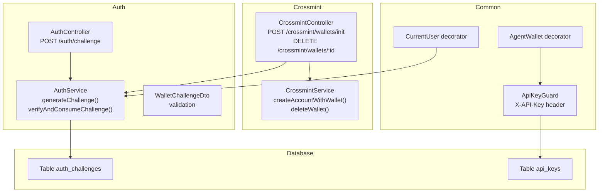
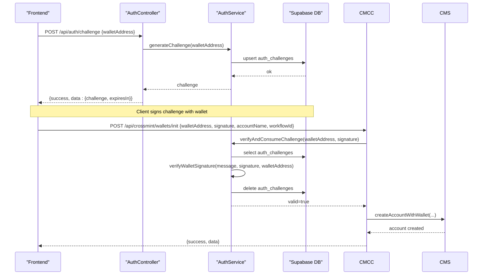
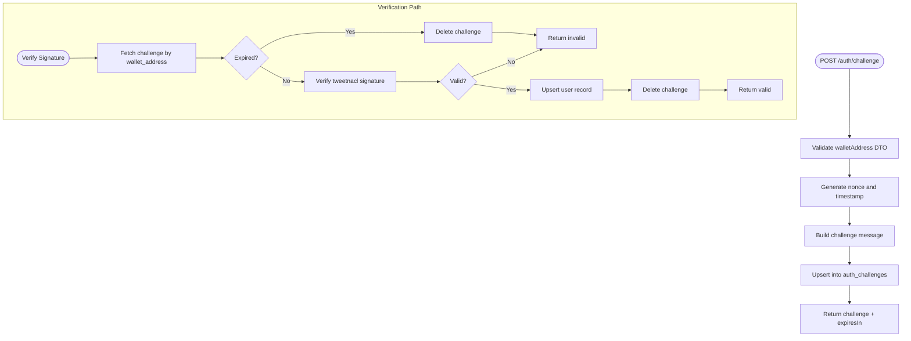
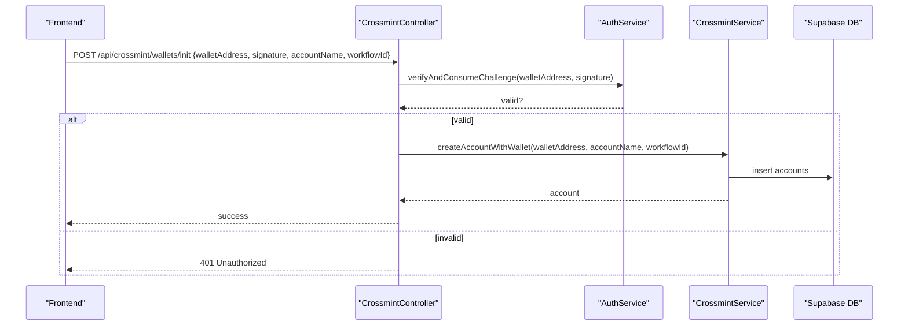
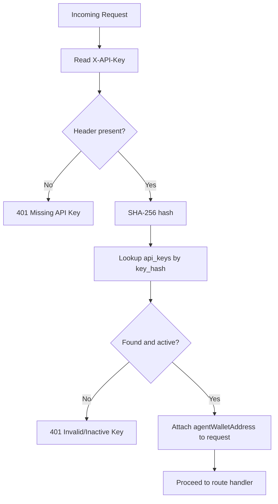
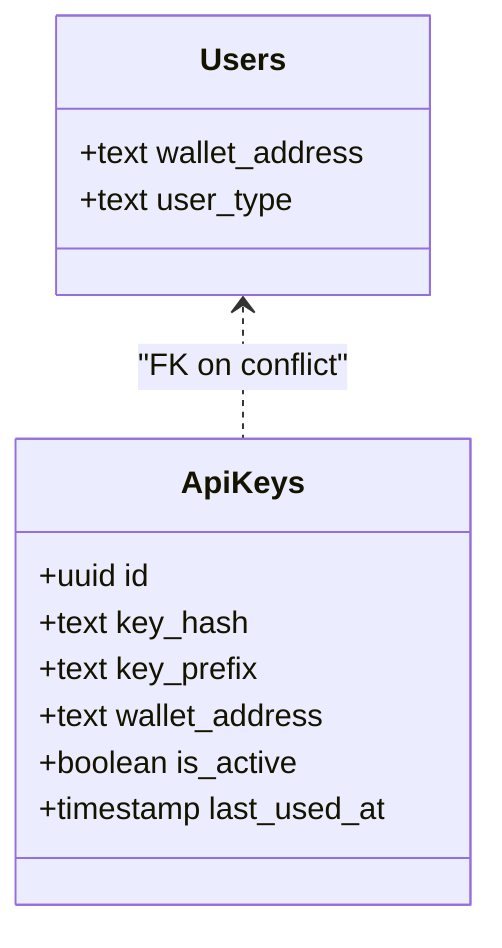
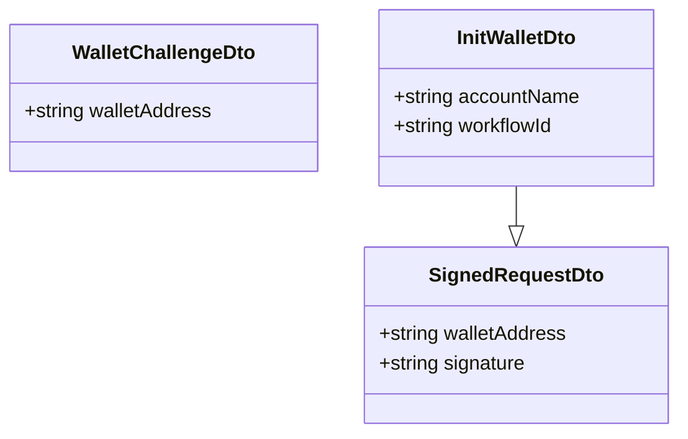
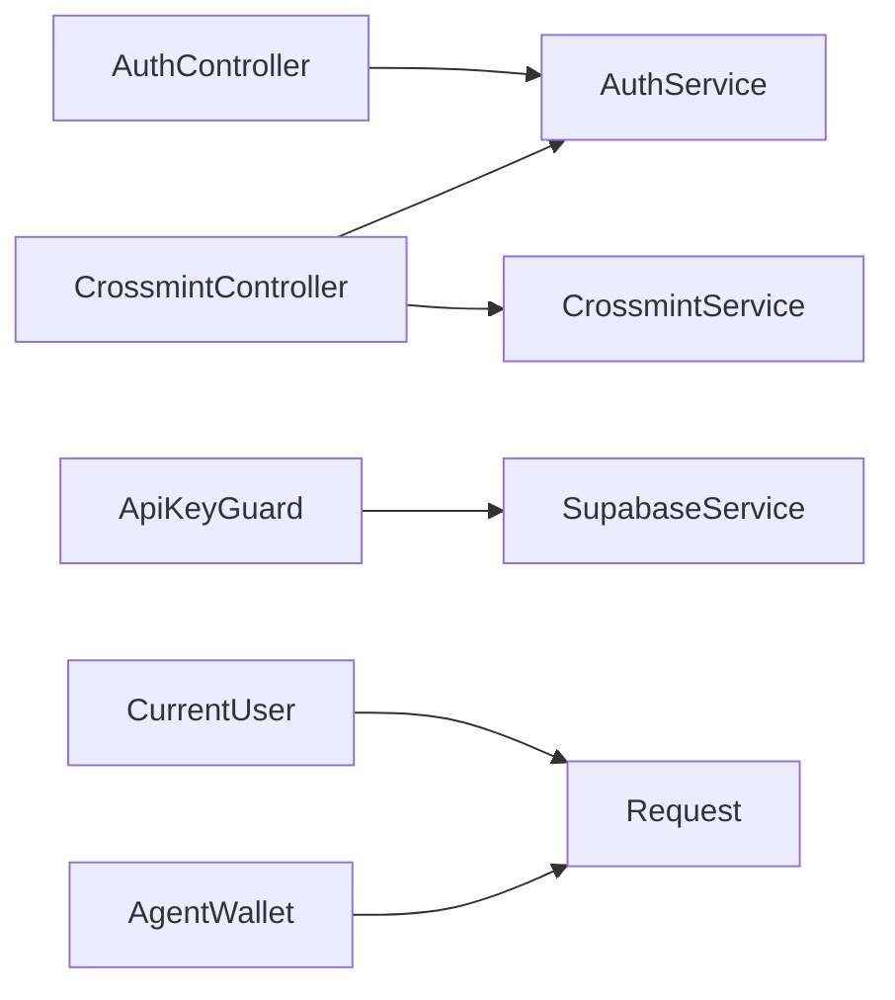

# Authentication System

<cite>
**Referenced Files in This Document**
- [auth.controller.ts](file://src/auth/auth.controller.ts)
- [auth.service.ts](file://src/auth/auth.service.ts)
- [wallet-challenge.dto.ts](file://src/auth/dto/wallet-challenge.dto.ts)
- [api-key.guard.ts](file://src/common/guards/api-key.guard.ts)
- [current-user.decorator.ts](file://src/common/decorators/current-user.decorator.ts)
- [agent-wallet.decorator.ts](file://src/common/decorators/agent-wallet.decorator.ts)
- [crossmint.controller.ts](file://src/crossmint/crossmint.controller.ts)
- [crossmint.service.ts](file://src/crossmint/crossmint.service.ts)
- [init-wallet.dto.ts](file://src/crossmint/dto/init-wallet.dto.ts)
- [signed-request.dto.ts](file://src/crossmint/dto/signed-request.dto.ts)
- [initial-2-auth-challenges.sql](file://src/database/schema/initial-2-auth-challenges.sql)
- [20260218000000_add_agent_api_keys.sql](file://supabase/migrations/20260218000000_add_agent_api_keys.sql)
- [verify_api.ts](file://scripts/verify_api.ts)
- [full_system_test.ts](file://scripts/full_system_test.ts)
</cite>

## Table of Contents
1. [Introduction](#introduction)
2. [Project Structure](#project-structure)
3. [Core Components](#core-components)
4. [Architecture Overview](#architecture-overview)
5. [Detailed Component Analysis](#detailed-component-analysis)
6. [Dependency Analysis](#dependency-analysis)
7. [Performance Considerations](#performance-considerations)
8. [Troubleshooting Guide](#troubleshooting-guide)
9. [Conclusion](#conclusion)
10. [Appendices](#appendices)

## Introduction
This document explains the dual authentication approach implemented in the backend:
- Wallet signature challenge-response for passwordless authentication
- Agent API key system for programmatic access

It covers the challenge generation, signature verification using tweetnacl, Crossmint integration, agent API key management, request validation DTOs, and the end-to-end authentication flow. It also documents authorization patterns, role management, error handling strategies, and practical integration examples for frontend applications.

## Project Structure
The authentication system spans several modules:
- Auth module: challenge generation and signature verification
- Crossmint module: wallet initialization and deletion with signature verification
- Common guards and decorators: API key guard and request parameter extraction
- Database schema: auth challenges and agent API keys
- Scripts: end-to-end verification and system tests

**Diagram sources**
- [auth.controller.ts:1-49](file://src/auth/auth.controller.ts#L1-L49)
- [auth.service.ts:1-165](file://src/auth/auth.service.ts#L1-L165)
- [wallet-challenge.dto.ts:1-16](file://src/auth/dto/wallet-challenge.dto.ts#L1-L16)
- [crossmint.controller.ts:1-67](file://src/crossmint/crossmint.controller.ts#L1-L67)
- [crossmint.service.ts:1-403](file://src/crossmint/crossmint.service.ts#L1-L403)
- [api-key.guard.ts:1-56](file://src/common/guards/api-key.guard.ts#L1-L56)
- [current-user.decorator.ts:1-11](file://src/common/decorators/current-user.decorator.ts#L1-L11)
- [agent-wallet.decorator.ts:1-9](file://src/common/decorators/agent-wallet.decorator.ts#L1-L9)
- [initial-2-auth-challenges.sql:1-7](file://src/database/schema/initial-2-auth-challenges.sql#L1-L7)
- [20260218000000_add_agent_api_keys.sql:1-48](file://supabase/migrations/20260218000000_add_agent_api_keys.sql#L1-L48)

**Section sources**
- [auth.controller.ts:1-49](file://src/auth/auth.controller.ts#L1-L49)
- [auth.service.ts:1-165](file://src/auth/auth.service.ts#L1-L165)
- [crossmint.controller.ts:1-67](file://src/crossmint/crossmint.controller.ts#L1-L67)
- [api-key.guard.ts:1-56](file://src/common/guards/api-key.guard.ts#L1-L56)
- [initial-2-auth-challenges.sql:1-7](file://src/database/schema/initial-2-auth-challenges.sql#L1-L7)
- [20260218000000_add_agent_api_keys.sql:1-48](file://supabase/migrations/20260218000000_add_agent_api_keys.sql#L1-L48)

## Core Components
- AuthController: Exposes the challenge endpoint for wallet signature authentication.
- AuthService: Generates challenges, stores them in the database, verifies signatures using tweetnacl, and consumes challenges upon successful verification.
- WalletChallengeDto: Validates incoming wallet address requests for challenge generation.
- CrossmintController: Uses signature verification to initialize and delete Crossmint wallets.
- CrossmintService: Manages Crossmint wallets and performs asset withdrawal and account closure.
- ApiKeyGuard: Enforces API key authentication for agent-driven endpoints.
- CurrentUser and AgentWallet decorators: Extract authenticated identities for controllers.
- Database schema: auth_challenges and api_keys tables with constraints and RLS policies.

**Section sources**
- [auth.controller.ts:1-49](file://src/auth/auth.controller.ts#L1-L49)
- [auth.service.ts:1-165](file://src/auth/auth.service.ts#L1-L165)
- [wallet-challenge.dto.ts:1-16](file://src/auth/dto/wallet-challenge.dto.ts#L1-L16)
- [crossmint.controller.ts:1-67](file://src/crossmint/crossmint.controller.ts#L1-L67)
- [crossmint.service.ts:1-403](file://src/crossmint/crossmint.service.ts#L1-L403)
- [api-key.guard.ts:1-56](file://src/common/guards/api-key.guard.ts#L1-L56)
- [current-user.decorator.ts:1-11](file://src/common/decorators/current-user.decorator.ts#L1-L11)
- [agent-wallet.decorator.ts:1-9](file://src/common/decorators/agent-wallet.decorator.ts#L1-L9)
- [initial-2-auth-challenges.sql:1-7](file://src/database/schema/initial-2-auth-challenges.sql#L1-L7)
- [20260218000000_add_agent_api_keys.sql:1-48](file://supabase/migrations/20260218000000_add_agent_api_keys.sql#L1-L48)

## Architecture Overview
The system implements a two-tier authentication model:
- Wallet signature challenge-response for human users
- Agent API keys for programmatic agents

**Diagram sources**
- [auth.controller.ts:11-47](file://src/auth/auth.controller.ts#L11-L47)
- [auth.service.ts:27-91](file://src/auth/auth.service.ts#L27-L91)
- [crossmint.controller.ts:30-42](file://src/crossmint/crossmint.controller.ts#L30-L42)
- [crossmint.service.ts:163-204](file://src/crossmint/crossmint.service.ts#L163-L204)

## Detailed Component Analysis

### Wallet Signature Challenge-Response
- Challenge generation:
  - Random nonce and timestamp embedded in a deterministic message
  - Stored in auth_challenges with expiration
- Signature verification:
  - Uses tweetnacl to verify ed25519 signature against the stored challenge
  - Cleans up consumed challenges immediately upon success
- Request validation:
  - WalletChallengeDto enforces Solana address format

**Diagram sources**
- [auth.controller.ts:36-47](file://src/auth/auth.controller.ts#L36-L47)
- [auth.service.ts:27-91](file://src/auth/auth.service.ts#L27-L91)
- [wallet-challenge.dto.ts:4-15](file://src/auth/dto/wallet-challenge.dto.ts#L4-L15)
- [initial-2-auth-challenges.sql:1-7](file://src/database/schema/initial-2-auth-challenges.sql#L1-L7)

**Section sources**
- [auth.controller.ts:11-47](file://src/auth/auth.controller.ts#L11-L47)
- [auth.service.ts:27-91](file://src/auth/auth.service.ts#L27-L91)
- [wallet-challenge.dto.ts:4-15](file://src/auth/dto/wallet-challenge.dto.ts#L4-L15)
- [initial-2-auth-challenges.sql:1-7](file://src/database/schema/initial-2-auth-challenges.sql#L1-L7)

### Crossmint Integration
- Initialization:
  - Requires a valid signature for the active challenge
  - Creates a Crossmint wallet and an account record
- Deletion:
  - Requires ownership verification and full asset withdrawal
  - Prevents closing accounts with outstanding assets

**Diagram sources**
- [crossmint.controller.ts:30-42](file://src/crossmint/crossmint.controller.ts#L30-L42)
- [auth.service.ts:57-91](file://src/auth/auth.service.ts#L57-L91)
- [crossmint.service.ts:163-204](file://src/crossmint/crossmint.service.ts#L163-L204)

**Section sources**
- [crossmint.controller.ts:23-42](file://src/crossmint/crossmint.controller.ts#L23-L42)
- [crossmint.service.ts:163-204](file://src/crossmint/crossmint.service.ts#L163-L204)

### Agent API Key System
- API key storage:
  - Hashed key stored in api_keys with unique prefix
  - One active key per wallet enforced by partial unique index
- Validation:
  - Guard reads X-API-Key header, hashes it, and validates against api_keys
  - Attaches agent wallet address to request for downstream authorization
- Security:
  - Row Level Security enabled on api_keys
  - Separate policies for service_role and restricted roles

**Diagram sources**
- [api-key.guard.ts:11-54](file://src/common/guards/api-key.guard.ts#L11-L54)
- [20260218000000_add_agent_api_keys.sql:6-26](file://supabase/migrations/20260218000000_add_agent_api_keys.sql#L6-L26)

**Section sources**
- [api-key.guard.ts:1-56](file://src/common/guards/api-key.guard.ts#L1-L56)
- [20260218000000_add_agent_api_keys.sql:1-48](file://supabase/migrations/20260218000000_add_agent_api_keys.sql#L1-L48)

### Authorization and Role Management
- User roles:
  - users table extended with user_type (human or agent)
- Access control patterns:
  - ApiKeyGuard for programmatic agents
  - CurrentUser and AgentWallet decorators for extracting identities
  - Ownership checks in CrossmintService for wallet operations

**Diagram sources**
- [20260218000000_add_agent_api_keys.sql:2-4](file://supabase/migrations/20260218000000_add_agent_api_keys.sql#L2-L4)
- [20260218000000_add_agent_api_keys.sql:7-16](file://supabase/migrations/20260218000000_add_agent_api_keys.sql#L7-L16)

**Section sources**
- [20260218000000_add_agent_api_keys.sql:1-48](file://supabase/migrations/20260218000000_add_agent_api_keys.sql#L1-L48)
- [current-user.decorator.ts:3-9](file://src/common/decorators/current-user.decorator.ts#L3-L9)
- [agent-wallet.decorator.ts:3-7](file://src/common/decorators/agent-wallet.decorator.ts#L3-L7)

### Request Validation DTOs
- WalletChallengeDto: Validates Solana wallet address format for challenge requests.
- SignedRequestDto: Base DTO for signed requests with walletAddress and signature.
- InitWalletDto: Extends SignedRequestDto with accountName and optional workflowId.

**Diagram sources**
- [wallet-challenge.dto.ts:4-15](file://src/auth/dto/wallet-challenge.dto.ts#L4-L15)
- [signed-request.dto.ts:4-21](file://src/crossmint/dto/signed-request.dto.ts#L4-L21)
- [init-wallet.dto.ts:5-21](file://src/crossmint/dto/init-wallet.dto.ts#L5-L21)

**Section sources**
- [wallet-challenge.dto.ts:1-16](file://src/auth/dto/wallet-challenge.dto.ts#L1-L16)
- [signed-request.dto.ts:1-21](file://src/crossmint/dto/signed-request.dto.ts#L1-L21)
- [init-wallet.dto.ts:1-22](file://src/crossmint/dto/init-wallet.dto.ts#L1-L22)

## Dependency Analysis
- AuthController depends on AuthService for challenge generation.
- CrossmintController depends on AuthService for signature verification and on CrossmintService for wallet operations.
- ApiKeyGuard depends on SupabaseService to validate API keys.
- Decorators depend on request context to extract identities.

**Diagram sources**
- [auth.controller.ts:1-49](file://src/auth/auth.controller.ts#L1-L49)
- [auth.service.ts:1-165](file://src/auth/auth.service.ts#L1-L165)
- [crossmint.controller.ts:1-67](file://src/crossmint/crossmint.controller.ts#L1-L67)
- [crossmint.service.ts:1-403](file://src/crossmint/crossmint.service.ts#L1-L403)
- [api-key.guard.ts:1-56](file://src/common/guards/api-key.guard.ts#L1-L56)
- [current-user.decorator.ts:1-11](file://src/common/decorators/current-user.decorator.ts#L1-L11)
- [agent-wallet.decorator.ts:1-9](file://src/common/decorators/agent-wallet.decorator.ts#L1-L9)

**Section sources**
- [auth.controller.ts:1-49](file://src/auth/auth.controller.ts#L1-L49)
- [auth.service.ts:1-165](file://src/auth/auth.service.ts#L1-L165)
- [crossmint.controller.ts:1-67](file://src/crossmint/crossmint.controller.ts#L1-L67)
- [api-key.guard.ts:1-56](file://src/common/guards/api-key.guard.ts#L1-L56)

## Performance Considerations
- Challenge cleanup: Background interval removes expired entries to keep auth_challenges small.
- Asynchronous updates: ApiKeyGuard updates last_used_at fire-and-forget to avoid blocking requests.
- Indexes: api_keys table includes indexes on key_hash and wallet_address for fast lookups.
- RLS: Enabling RLS adds minimal overhead while securing sensitive tables.

[No sources needed since this section provides general guidance]

## Troubleshooting Guide
- Challenge not found or expired:
  - Verify wallet address matches the stored challenge and that it has not expired.
  - Ensure the challenge is consumed after successful verification.
- Invalid signature:
  - Confirm the message exactly matches the stored challenge (including nonce and timestamp).
  - Ensure the signature is base58-encoded and corresponds to the wallet’s public key.
- Missing or invalid API key:
  - Ensure X-API-Key header is present and hashed correctly.
  - Confirm the key is active and belongs to the intended wallet.
- Ownership verification failures:
  - For wallet deletion, confirm the owner wallet address matches the account owner.
  - Ensure assets were successfully withdrawn before closing.

**Section sources**
- [auth.service.ts:66-90](file://src/auth/auth.service.ts#L66-L90)
- [api-key.guard.ts:15-33](file://src/common/guards/api-key.guard.ts#L15-L33)
- [crossmint.controller.ts:52-65](file://src/crossmint/crossmint.controller.ts#L52-L65)

## Conclusion
The authentication system combines secure, passwordless wallet signatures with robust agent API key management. The challenge-response mechanism ensures replay protection and single-use credentials, while the API key guard enables secure programmatic access. Together, they support strong authorization patterns and clear separation of concerns between human and agent interactions.

[No sources needed since this section summarizes without analyzing specific files]

## Appendices

### Practical Examples

- Request a challenge:
  - Endpoint: POST /api/auth/challenge
  - Body: { walletAddress }
  - Response: { success, data: { challenge, expiresIn } }

- Initialize a Crossmint wallet:
  - Endpoint: POST /api/crossmint/wallets/init
  - Body: { walletAddress, signature, accountName, workflowId }
  - Response: { success, data }

- Delete a Crossmint wallet:
  - Endpoint: DELETE /api/crossmint/wallets/:id
  - Body: { walletAddress, signature }
  - Response: { success, message, data }

- Programmatic access with API key:
  - Header: X-API-Key: <your-api-key>
  - Guard attaches agent wallet address to request for downstream authorization

**Section sources**
- [auth.controller.ts:11-47](file://src/auth/auth.controller.ts#L11-L47)
- [crossmint.controller.ts:30-65](file://src/crossmint/crossmint.controller.ts#L30-L65)
- [api-key.guard.ts:11-54](file://src/common/guards/api-key.guard.ts#L11-L54)

### End-to-End Verification Scripts
- verify_api.ts: Demonstrates challenge retrieval, signing with tweetnacl, and verifying the flow.
- full_system_test.ts: Integrates challenge generation, local signing, and Crossmint initialization.

**Section sources**
- [verify_api.ts:1-33](file://scripts/verify_api.ts#L1-L33)
- [full_system_test.ts:45-69](file://scripts/full_system_test.ts#L45-L69)