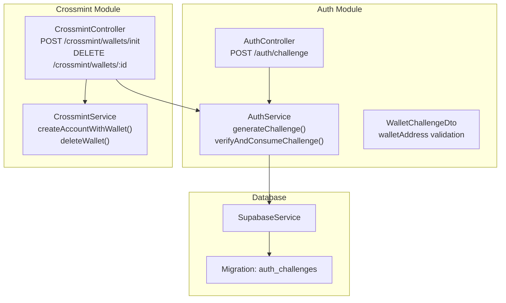
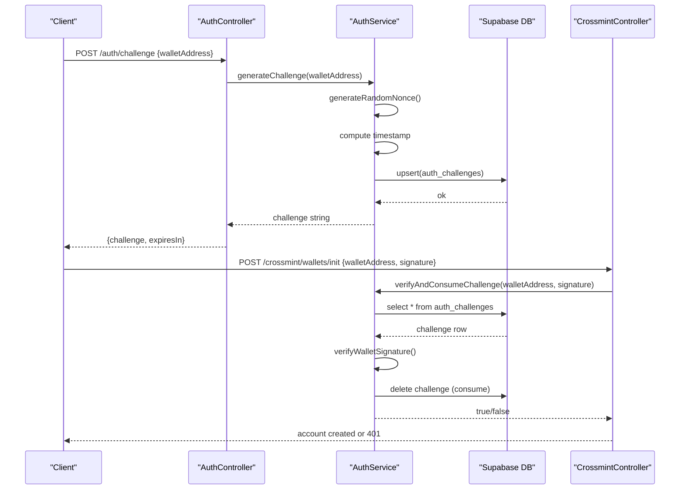
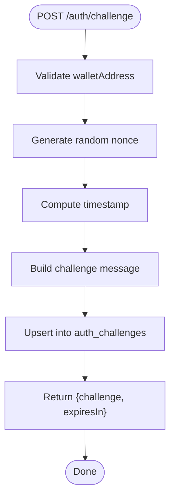
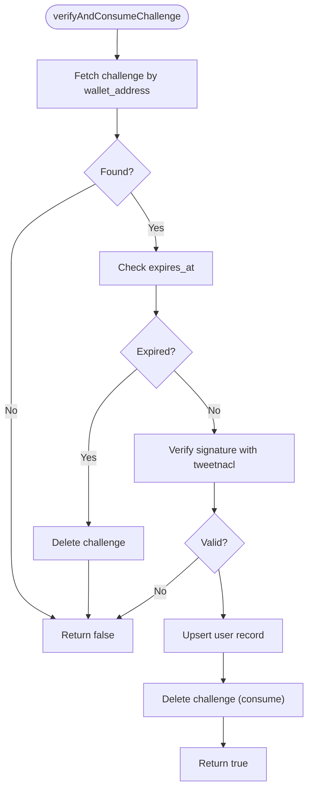
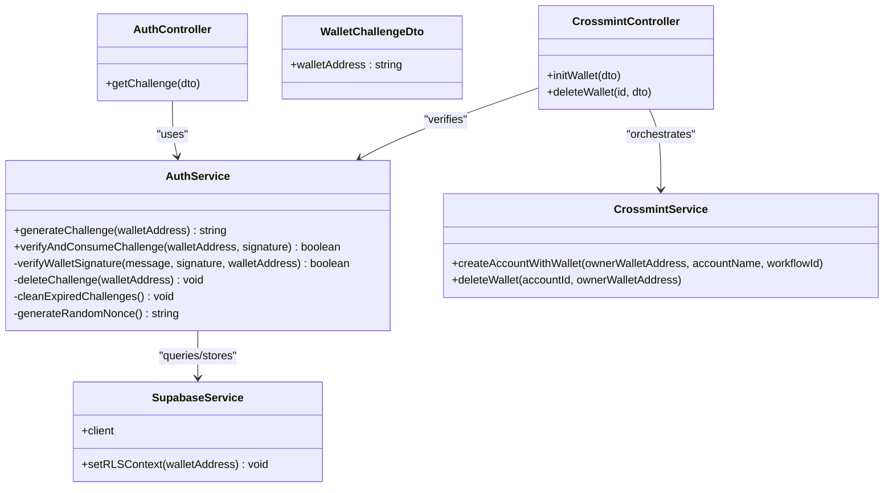

# Wallet Signature Authentication

<cite>
**Referenced Files in This Document**
- [auth.controller.ts](file://src/auth/auth.controller.ts)
- [auth.service.ts](file://src/auth/auth.service.ts)
- [wallet-challenge.dto.ts](file://src/auth/dto/wallet-challenge.dto.ts)
- [auth.module.ts](file://src/auth/auth.module.ts)
- [supabase.service.ts](file://src/database/supabase.service.ts)
- [20260128140000_add_auth_challenges.sql](file://supabase/migrations/20260128140000_add_auth_challenges.sql)
- [crossmint.controller.ts](file://src/crossmint/crossmint.controller.ts)
- [crossmint.service.ts](file://src/crossmint/crossmint.service.ts)
- [init-wallet.dto.ts](file://src/crossmint/dto/init-wallet.dto.ts)
- [signed-request.dto.ts](file://src/crossmint/dto/signed-request.dto.ts)
- [full_system_test.ts](file://scripts/full_system_test.ts)
- [verify_api.ts](file://scripts/verify_api.ts)
</cite>

## Table of Contents
1. [Introduction](#introduction)
2. [Project Structure](#project-structure)
3. [Core Components](#core-components)
4. [Architecture Overview](#architecture-overview)
5. [Detailed Component Analysis](#detailed-component-analysis)
6. [Dependency Analysis](#dependency-analysis)
7. [Performance Considerations](#performance-considerations)
8. [Security Considerations](#security-considerations)
9. [Frontend Integration Examples](#frontend-integration-examples)
10. [Troubleshooting Guide](#troubleshooting-guide)
11. [Conclusion](#conclusion)

## Introduction
This document explains the wallet signature authentication system used to authenticate users via Solana wallet signatures. It covers the complete flow from challenge generation to signature verification, including the challenge message format, tweetnacl integration for ed25519 verification, database storage of authentication challenges, DTO validation rules, and practical frontend integration examples. It also addresses security considerations and provides troubleshooting guidance.

## Project Structure
The authentication system spans several modules:
- Authentication module: challenge generation, signature verification, and challenge storage
- Crossmint module: wallet initialization and deletion guarded by signature verification
- Database module: Supabase client and migration for auth challenges table
- DTOs: validation rules for wallet addresses and signed requests

**Diagram sources**
- [auth.controller.ts:11-47](file://src/auth/auth.controller.ts#L11-L47)
- [auth.service.ts:27-91](file://src/auth/auth.service.ts#L27-L91)
- [wallet-challenge.dto.ts:4-15](file://src/auth/dto/wallet-challenge.dto.ts#L4-L15)
- [crossmint.controller.ts:30-65](file://src/crossmint/crossmint.controller.ts#L30-L65)
- [crossmint.service.ts:163-204](file://src/crossmint/crossmint.service.ts#L163-L204)
- [supabase.service.ts:29-40](file://src/database/supabase.service.ts#L29-L40)
- [20260128140000_add_auth_challenges.sql:1-7](file://supabase/migrations/20260128140000_add_auth_challenges.sql#L1-L7)

**Section sources**
- [auth.controller.ts:1-49](file://src/auth/auth.controller.ts#L1-L49)
- [auth.service.ts:1-165](file://src/auth/auth.service.ts#L1-L165)
- [auth.module.ts:1-11](file://src/auth/auth.module.ts#L1-L11)
- [crossmint.controller.ts:1-67](file://src/crossmint/crossmint.controller.ts#L1-L67)
- [crossmint.service.ts:1-403](file://src/crossmint/crossmint.service.ts#L1-L403)
- [supabase.service.ts:1-42](file://src/database/supabase.service.ts#L1-L42)
- [20260128140000_add_auth_challenges.sql:1-7](file://supabase/migrations/20260128140000_add_auth_challenges.sql#L1-L7)

## Core Components
- AuthController: exposes the challenge endpoint and returns the generated challenge with a fixed TTL.
- AuthService: generates challenges with nonce and timestamp, stores them in the database, verifies signatures using tweetnacl, and consumes challenges upon successful verification.
- WalletChallengeDto: validates the incoming wallet address format.
- SupabaseService: manages the Supabase client and RLS context.
- CrossmintController/CrossmintService: integrate signature verification to protect wallet initialization and deletion operations.

**Section sources**
- [auth.controller.ts:36-47](file://src/auth/auth.controller.ts#L36-L47)
- [auth.service.ts:27-163](file://src/auth/auth.service.ts#L27-L163)
- [wallet-challenge.dto.ts:4-15](file://src/auth/dto/wallet-challenge.dto.ts#L4-L15)
- [supabase.service.ts:29-40](file://src/database/supabase.service.ts#L29-L40)
- [crossmint.controller.ts:30-65](file://src/crossmint/crossmint.controller.ts#L30-L65)
- [crossmint.service.ts:163-204](file://src/crossmint/crossmint.service.ts#L163-L204)

## Architecture Overview
The authentication flow consists of:
1. Client requests a challenge for a given wallet address.
2. Server generates a challenge with a random nonce, current timestamp, and wallet address, stores it in the database, and returns it to the client.
3. Client signs the challenge with their wallet provider and submits the signature along with the wallet address to protected endpoints.
4. Server retrieves the stored challenge, verifies the signature using tweetnacl, and consumes the challenge on success.

**Diagram sources**
- [auth.controller.ts:36-47](file://src/auth/auth.controller.ts#L36-L47)
- [auth.service.ts:27-91](file://src/auth/auth.service.ts#L27-L91)
- [crossmint.controller.ts:30-42](file://src/crossmint/crossmint.controller.ts#L30-L42)

## Detailed Component Analysis

### Challenge Generation and Storage
- The controller endpoint accepts a validated wallet address and delegates to the service to generate a challenge.
- The service constructs a challenge string containing a static message, a random nonce, a timestamp, and the wallet address.
- The challenge is stored in the auth_challenges table with an expiration time (default TTL is 5 minutes).
- The controller returns the challenge and a fixed TTL (in seconds).

**Diagram sources**
- [auth.controller.ts:36-47](file://src/auth/auth.controller.ts#L36-L47)
- [auth.service.ts:27-51](file://src/auth/auth.service.ts#L27-L51)
- [20260128140000_add_auth_challenges.sql:1-7](file://supabase/migrations/20260128140000_add_auth_challenges.sql#L1-L7)

**Section sources**
- [auth.controller.ts:36-47](file://src/auth/auth.controller.ts#L36-L47)
- [auth.service.ts:27-51](file://src/auth/auth.service.ts#L27-L51)
- [wallet-challenge.dto.ts:4-15](file://src/auth/dto/wallet-challenge.dto.ts#L4-L15)
- [20260128140000_add_auth_challenges.sql:1-7](file://supabase/migrations/20260128140000_add_auth_challenges.sql#L1-L7)

### Signature Verification and Challenge Consumption
- The verifyAndConsumeChallenge method retrieves the stored challenge for the wallet address.
- It checks expiration and deletes expired challenges.
- It verifies the signature using tweetnacl with the stored challenge message, decoded signature, and the wallet’s public key.
- On success, it ensures the user record exists and deletes the consumed challenge.

**Diagram sources**
- [auth.service.ts:57-91](file://src/auth/auth.service.ts#L57-L91)
- [auth.service.ts:96-111](file://src/auth/auth.service.ts#L96-L111)

**Section sources**
- [auth.service.ts:57-111](file://src/auth/auth.service.ts#L57-L111)
- [supabase.service.ts:29-40](file://src/database/supabase.service.ts#L29-L40)

### Tweetnacl Integration for Ed25519 Verification
- The verification uses tweetnacl.sign.detached.verify with:
  - Message bytes derived from the stored challenge
  - Signature bytes decoded from base58
  - Public key bytes from the wallet address
- Any verification error results in a failure response.

**Section sources**
- [auth.service.ts:96-111](file://src/auth/auth.service.ts#L96-L111)

### Database Schema and Storage
- The auth_challenges table stores:
  - wallet_address (primary key)
  - challenge (text)
  - expires_at (timestamp with timezone)
  - created_at (timestamp with timezone)
- A periodic cleanup removes expired challenges.

**Section sources**
- [20260128140000_add_auth_challenges.sql:1-7](file://supabase/migrations/20260128140000_add_auth_challenges.sql#L1-L7)
- [auth.service.ts:147-156](file://src/auth/auth.service.ts#L147-L156)

### DTO Validation Rules
- WalletChallengeDto enforces:
  - String type
  - Base58-formatted Solana address with length 32–44
- SignedRequestDto (extended by InitWalletDto) enforces:
  - Non-empty walletAddress and signature fields

**Section sources**
- [wallet-challenge.dto.ts:4-15](file://src/auth/dto/wallet-challenge.dto.ts#L4-L15)
- [signed-request.dto.ts:4-21](file://src/crossmint/dto/signed-request.dto.ts#L4-L21)
- [init-wallet.dto.ts:5-22](file://src/crossmint/dto/init-wallet.dto.ts#L5-L22)

### Crossmint Integration
- CrossmintController uses verifyAndConsumeChallenge to protect:
  - Wallet initialization (POST /crossmint/wallets/init)
  - Wallet deletion (DELETE /crossmint/wallets/:id)
- On success, CrossmintService creates or closes accounts accordingly.

**Section sources**
- [crossmint.controller.ts:30-65](file://src/crossmint/crossmint.controller.ts#L30-L65)
- [crossmint.service.ts:163-204](file://src/crossmint/crossmint.service.ts#L163-L204)

## Dependency Analysis

**Diagram sources**
- [auth.controller.ts:36-47](file://src/auth/auth.controller.ts#L36-L47)
- [auth.service.ts:27-163](file://src/auth/auth.service.ts#L27-L163)
- [wallet-challenge.dto.ts:4-15](file://src/auth/dto/wallet-challenge.dto.ts#L4-L15)
- [supabase.service.ts:29-40](file://src/database/supabase.service.ts#L29-L40)
- [crossmint.controller.ts:30-65](file://src/crossmint/crossmint.controller.ts#L30-L65)
- [crossmint.service.ts:163-204](file://src/crossmint/crossmint.service.ts#L163-L204)

**Section sources**
- [auth.controller.ts:1-49](file://src/auth/auth.controller.ts#L1-L49)
- [auth.service.ts:1-165](file://src/auth/auth.service.ts#L1-L165)
- [crossmint.controller.ts:1-67](file://src/crossmint/crossmint.controller.ts#L1-L67)
- [crossmint.service.ts:1-403](file://src/crossmint/crossmint.service.ts#L1-L403)

## Performance Considerations
- Challenge TTL: Challenges expire after 5 minutes, balancing usability with security.
- Cleanup interval: Expired challenges are cleaned periodically to prevent table bloat.
- Signature verification cost: Ed25519 verification is efficient; keep message sizes minimal.
- Database writes: Upserts and deletes are lightweight; ensure database indexing for wallet_address if traffic increases.

[No sources needed since this section provides general guidance]

## Security Considerations
- Nonce generation: Random 16-byte hex nonce prevents replay across different challenges.
- Timestamp validation: While the current implementation does not parse or validate the timestamp field, it is included in the challenge string. For stronger anti-replay, consider validating the timestamp window server-side.
- Replay protection: Consuming the challenge immediately after successful verification prevents reuse.
- Wallet address normalization: Trimming whitespace avoids trivial mismatches.
- Signature verification: Uses tweetnacl with proper base58 decoding and Solana public key parsing.

**Section sources**
- [auth.service.ts:27-51](file://src/auth/auth.service.ts#L27-L51)
- [auth.service.ts:57-91](file://src/auth/auth.service.ts#L57-L91)
- [auth.service.ts:96-111](file://src/auth/auth.service.ts#L96-L111)

## Frontend Integration Examples
Below are practical integration steps for clients:

- Request a challenge:
  - Endpoint: POST /api/auth/challenge
  - Body: { walletAddress: "<Solana Address>" }
  - Response: { success: true, data: { challenge: "...", expiresIn: 300 } }

- Sign the challenge:
  - Decode the challenge string as UTF-8 bytes.
  - Sign the bytes with the user's wallet provider to produce a detached ed25519 signature.
  - Encode the signature in base58.

- Submit signature to protected endpoints:
  - POST /api/crossmint/wallets/init with { walletAddress, signature, accountName, workflowId? }
  - DELETE /api/crossmint/wallets/:id with { walletAddress, signature }

- Example references:
  - Challenge request and signature generation are demonstrated in the system tests and verification script.

**Section sources**
- [auth.controller.ts:36-47](file://src/auth/auth.controller.ts#L36-L47)
- [crossmint.controller.ts:30-65](file://src/crossmint/crossmint.controller.ts#L30-L65)
- [full_system_test.ts:45-69](file://scripts/full_system_test.ts#L45-L69)
- [verify_api.ts:16-33](file://scripts/verify_api.ts#L16-L33)

## Troubleshooting Guide
Common issues and resolutions:
- Signature verification fails:
  - Ensure the challenge string matches exactly what was returned by the server.
  - Confirm the signature is produced by signing the challenge bytes with the correct wallet private key.
  - Verify the signature is encoded in base58.
- Expired challenge:
  - Re-request a new challenge; TTL is short (5 minutes).
  - Check client clock synchronization if timestamps are considered server-side.
- Wallet address formatting:
  - Ensure the address is a valid Solana Base58 string of 32–44 characters.
  - Remove extra whitespace; the server trims but frontend should normalize.
- 401 Unauthorized on protected endpoints:
  - Indicates invalid or expired signature; re-sign the latest challenge.
  - Verify the wallet used to sign matches the walletAddress submitted.
- Database errors:
  - Check Supabase connectivity and credentials.
  - Ensure the auth_challenges table exists and is migrated.

**Section sources**
- [auth.service.ts:42-47](file://src/auth/auth.service.ts#L42-L47)
- [auth.service.ts:66-76](file://src/auth/auth.service.ts#L66-L76)
- [auth.service.ts:107-111](file://src/auth/auth.service.ts#L107-L111)
- [wallet-challenge.dto.ts:4-15](file://src/auth/dto/wallet-challenge.dto.ts#L4-L15)
- [supabase.service.ts:15-27](file://src/database/supabase.service.ts#L15-L27)
- [20260128140000_add_auth_challenges.sql:1-7](file://supabase/migrations/20260128140000_add_auth_challenges.sql#L1-L7)

## Conclusion
The wallet signature authentication system provides a secure, nonce-based, and time-bound mechanism for authenticating Solana wallet holders. By combining tweetnacl-based signature verification with database-backed challenge storage and immediate consumption, it mitigates replay risks and integrates cleanly with protected operations like wallet initialization and deletion.