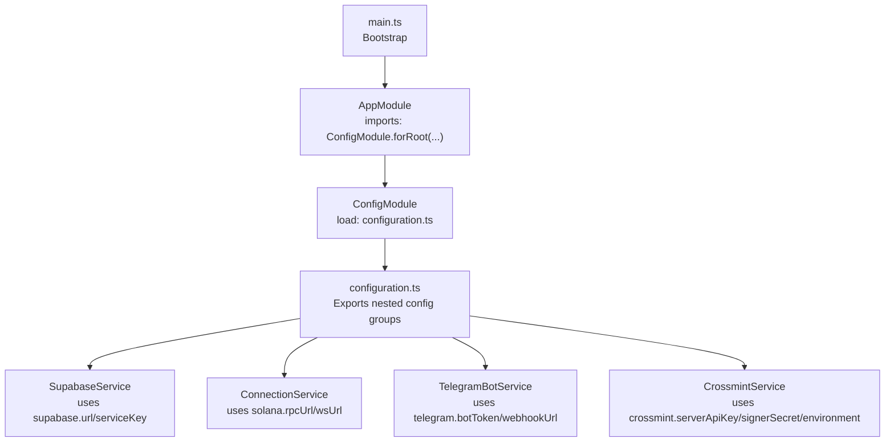
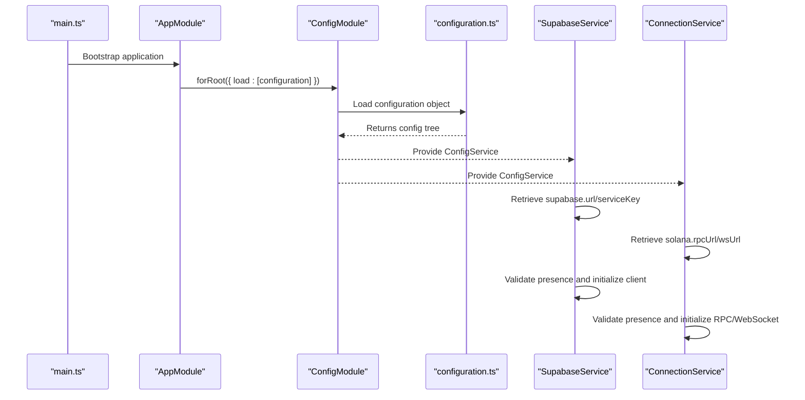
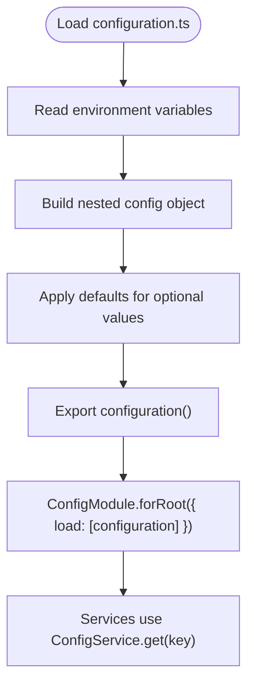
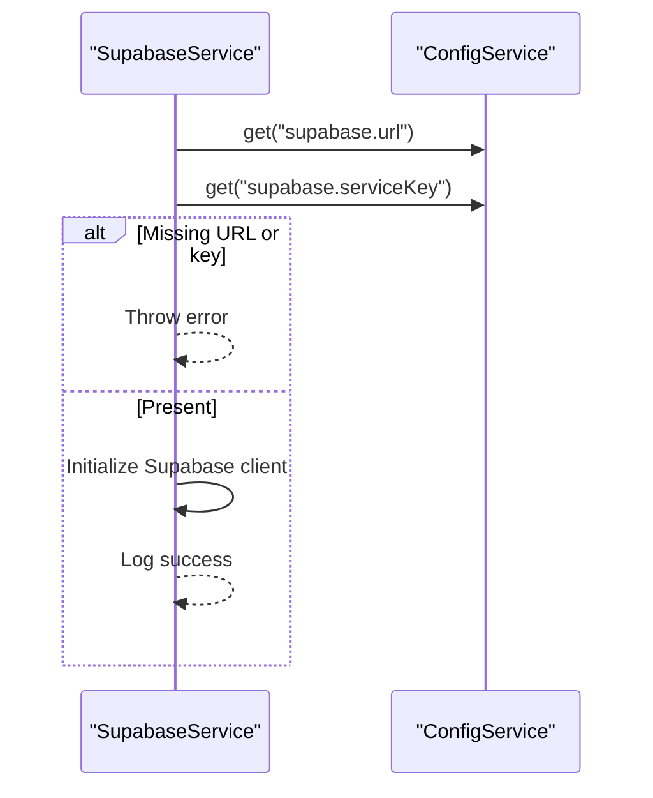
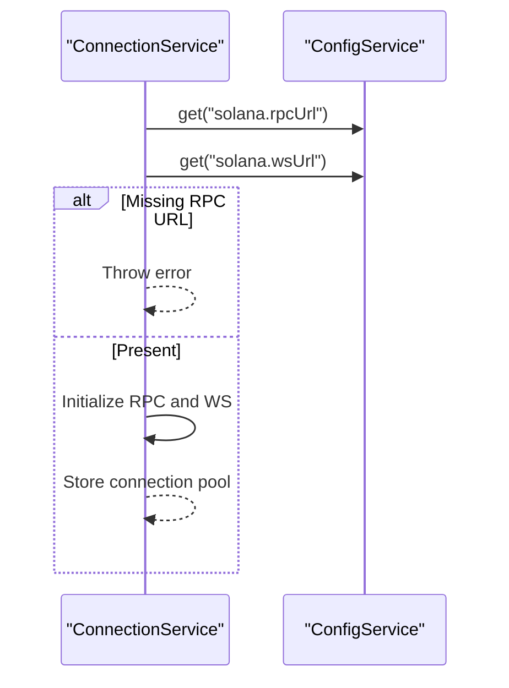
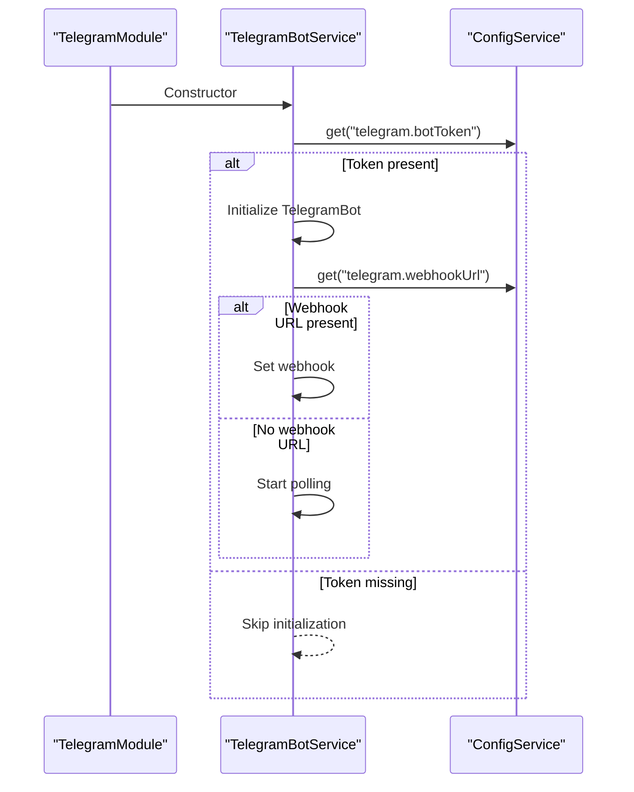
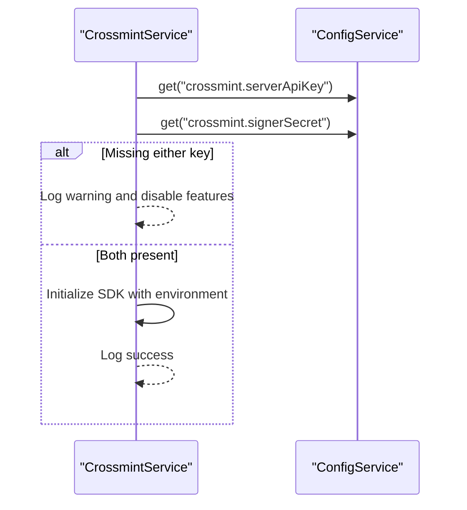
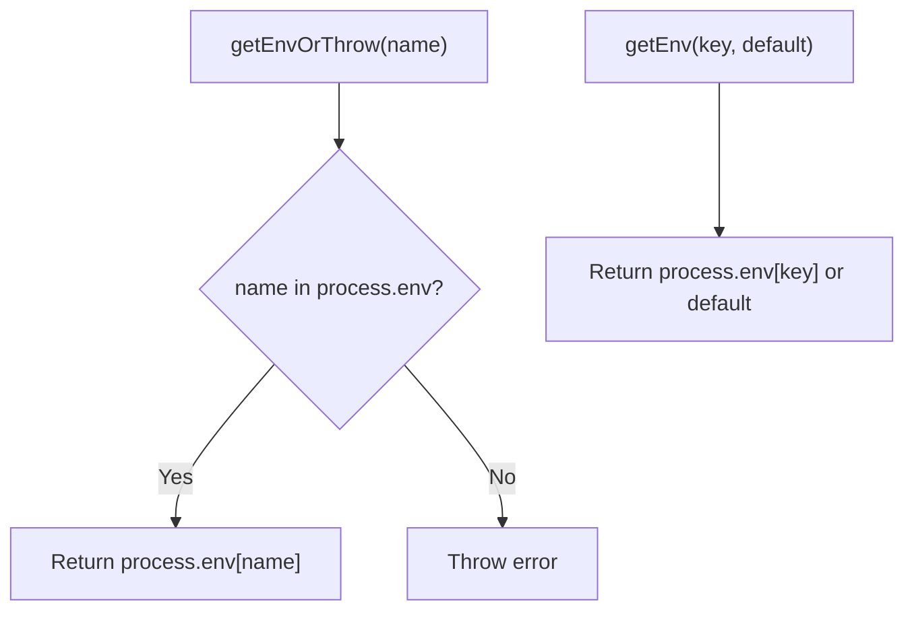
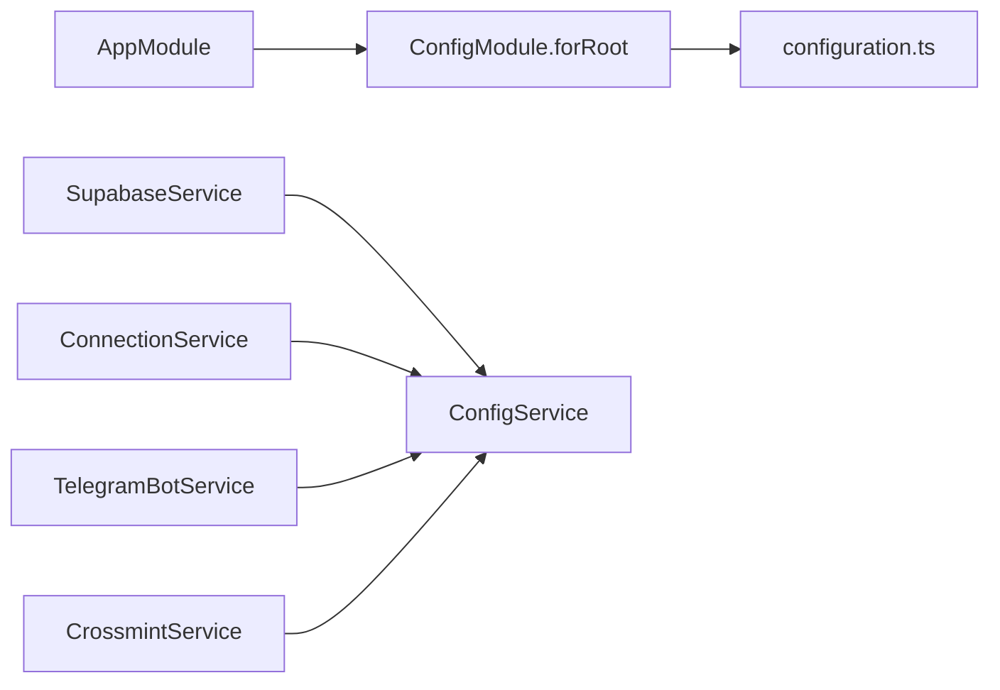

# Configuration Management

<cite>
**Referenced Files in This Document**
- [configuration.ts](file://src/config/configuration.ts)
- [main.ts](file://src/main.ts)
- [app.module.ts](file://src/app.module.ts)
- [supabase.service.ts](file://src/database/supabase.service.ts)
- [connection.service.ts](file://src/web3/services/connection.service.ts)
- [telegram-bot.service.ts](file://src/telegram/telegram-bot.service.ts)
- [crossmint.service.ts](file://src/crossmint/crossmint.service.ts)
- [env.service.ts](file://src/web3/services/env.service.ts)
- [env.ts](file://src/web3/utils/env.ts)
- [package.json](file://package.json)
</cite>

## Table of Contents
1. [Introduction](#introduction)
2. [Project Structure](#project-structure)
3. [Core Components](#core-components)
4. [Architecture Overview](#architecture-overview)
5. [Detailed Component Analysis](#detailed-component-analysis)
6. [Dependency Analysis](#dependency-analysis)
7. [Performance Considerations](#performance-considerations)
8. [Troubleshooting Guide](#troubleshooting-guide)
9. [Conclusion](#conclusion)
10. [Appendices](#appendices)

## Introduction
This document explains the configuration management architecture of the backend, focusing on environment variable handling and system configuration patterns. It covers how the NestJS ConfigModule loads configuration, how environment variables are accessed in a type-safe manner via ConfigService, and how various subsystems (database, blockchain RPC, external services) consume configuration. It also documents required and optional environment variables, validation strategies, defaults, hot-reloading, environment-specific overrides, testing strategies, security considerations, and operational guidance.

## Project Structure
The configuration system is centralized in a single configuration loader and consumed globally across the application:
- Central configuration loader defines environment-driven settings.
- The application bootstraps the ConfigModule as a global provider.
- Services and modules retrieve configuration values through ConfigService.

**Diagram sources**
- [main.ts:9-31](file://src/main.ts#L9-L31)
- [app.module.ts:17-20](file://src/app.module.ts#L17-L20)
- [configuration.ts:1-44](file://src/config/configuration.ts#L1-L44)

**Section sources**
- [main.ts:9-31](file://src/main.ts#L9-L31)
- [app.module.ts:17-20](file://src/app.module.ts#L17-L20)
- [configuration.ts:1-44](file://src/config/configuration.ts#L1-L44)

## Core Components
- Central configuration loader: Defines top-level keys and nested groups for Supabase, Telegram, Solana, Pyth, Crossmint, and other integrations.
- Global ConfigModule: Loaded once at startup and exposed globally to all modules.
- Type-safe access: Services inject ConfigService and retrieve typed values using dot notation keys.
- Validation and defaults: Some values are validated at runtime; others rely on defaults defined in the loader.

Key configuration groups and representative environment variables:
- Application: PORT, NODE_ENV, CORS_ORIGIN
- Supabase: SUPABASE_URL, SUPABASE_ANON_KEY, SUPABASE_SERVICE_KEY
- Telegram: TELEGRAM_BOT_TOKEN, TELEGRAM_NOTIFY_ENABLED, TELEGRAM_WEBHOOK_URL
- Solana: SOLANA_RPC_URL, SOLANA_WS_URL
- Pyth: PYTH_HERMES_ENDPOINT
- Crossmint: CROSSMINT_SERVER_API_KEY, CROSSMINT_SIGNER_SECRET, CROSSMINT_ENVIRONMENT
- Helius: HELIUS_API_KEY
- Lulo: LULO_API_KEY
- Sanctum: SANCTUM_API_KEY

Defaults and validation highlights:
- PORT defaults to 3000; NODE_ENV defaults to development; CORS_ORIGIN defaults to wildcard.
- Supabase service key is mandatory; missing throws an error during initialization.
- Solana RPC URL is mandatory; missing throws an error during initialization.
- Telegram bot token is optional; if absent, the bot is not initialized.
- Telegram webhook URL is optional; if present, webhook is used; otherwise polling is used.
- Crossmint server API key and signer secret are optional; if either is missing, Crossmint features are disabled.
- Solana WS URL defaults to a wss equivalent of the RPC URL if not provided.

**Section sources**
- [configuration.ts:1-44](file://src/config/configuration.ts#L1-L44)
- [supabase.service.ts:11-17](file://src/database/supabase.service.ts#L11-L17)
- [connection.service.ts:30-36](file://src/web3/services/connection.service.ts#L30-L36)
- [telegram-bot.service.ts:15-22](file://src/telegram/telegram-bot.service.ts#L15-L22)
- [telegram-bot.service.ts:243-253](file://src/telegram/telegram-bot.service.ts#L243-L253)
- [crossmint.service.ts:56-75](file://src/crossmint/crossmint.service.ts#L56-L75)

## Architecture Overview
The configuration architecture follows a layered pattern:
- Loader: Reads environment variables and returns a structured object.
- Provider: ConfigModule exposes the configuration globally.
- Consumers: Services and controllers retrieve values via ConfigService.get().
- Validation: Runtime checks ensure required values are present before using them.

**Diagram sources**
- [main.ts:9-31](file://src/main.ts#L9-L31)
- [app.module.ts:17-20](file://src/app.module.ts#L17-L20)
- [configuration.ts:1-44](file://src/config/configuration.ts#L1-L44)
- [supabase.service.ts:11-27](file://src/database/supabase.service.ts#L11-L27)
- [connection.service.ts:30-49](file://src/web3/services/connection.service.ts#L30-L49)

## Detailed Component Analysis

### Configuration Loader and Access Patterns
- Loader: Centralized in configuration.ts, exporting a function that returns a nested configuration object. Keys are grouped by domain (e.g., supabase, telegram, solana).
- Access: Modules import ConfigModule.forRoot and consumers inject ConfigService to retrieve values using dot notation (e.g., 'supabase.url', 'solana.rpcUrl').
- Defaults: Numeric and string defaults are applied in the loader; boolean flags are parsed from environment values.

**Diagram sources**
- [configuration.ts:1-44](file://src/config/configuration.ts#L1-L44)
- [app.module.ts:17-20](file://src/app.module.ts#L17-L20)

**Section sources**
- [configuration.ts:1-44](file://src/config/configuration.ts#L1-L44)
- [app.module.ts:17-20](file://src/app.module.ts#L17-L20)

### Database Configuration (Supabase)
- Access: SupabaseService retrieves supabase.url and supabase.serviceKey via ConfigService.
- Validation: Both URL and service key are required; absence triggers an error during initialization.
- Behavior: Initializes a Supabase client with explicit auth settings and logs successful initialization.

**Diagram sources**
- [supabase.service.ts:11-27](file://src/database/supabase.service.ts#L11-L27)

**Section sources**
- [supabase.service.ts:11-17](file://src/database/supabase.service.ts#L11-L17)
- [supabase.service.ts:19-24](file://src/database/supabase.service.ts#L19-L24)

### Blockchain RPC Configuration (Solana)
- Access: ConnectionService retrieves solana.rpcUrl and solana.wsUrl via ConfigService.
- Validation: RPC URL is required; absence triggers an error during initialization.
- Behavior: Creates RPC, WebSocket subscriptions, and a legacy Connection instance. WS URL defaults to a wss-equivalent of the RPC URL if not provided.

**Diagram sources**
- [connection.service.ts:30-49](file://src/web3/services/connection.service.ts#L30-L49)

**Section sources**
- [connection.service.ts:30-36](file://src/web3/services/connection.service.ts#L30-L36)
- [connection.service.ts:40-48](file://src/web3/services/connection.service.ts#L40-L48)
- [connection.service.ts:63-71](file://src/web3/services/connection.service.ts#L63-L71)

### External Service Integrations

#### Telegram Integration
- Access: TelegramBotService retrieves telegram.botToken and telegram.webhookUrl via ConfigService.
- Optional token: If absent, the bot is not initialized.
- Webhook vs polling: If telegram.webhookUrl is present, webhook is set; otherwise, polling starts.
- Behavior: Starts bot on module initialization and sets up commands.

**Diagram sources**
- [telegram-bot.service.ts:15-22](file://src/telegram/telegram-bot.service.ts#L15-L22)
- [telegram-bot.service.ts:243-253](file://src/telegram/telegram-bot.service.ts#L243-L253)

**Section sources**
- [telegram-bot.service.ts:15-22](file://src/telegram/telegram-bot.service.ts#L15-L22)
- [telegram-bot.service.ts:243-253](file://src/telegram/telegram-bot.service.ts#L243-L253)

#### Crossmint Integration
- Access: CrossmintService retrieves crossmint.serverApiKey, crossmint.signerSecret, and crossmint.environment via ConfigService.
- Optional keys: If either server API key or signer secret is missing, Crossmint features are disabled (logged warnings).
- Behavior: Initializes Crossmint SDK with environment and logs initialization status.

**Diagram sources**
- [crossmint.service.ts:56-75](file://src/crossmint/crossmint.service.ts#L56-L75)

**Section sources**
- [crossmint.service.ts:56-75](file://src/crossmint/crossmint.service.ts#L56-L75)

### Environment Variable Utilities
- Utility functions: getEnvOrThrow and getEnv are provided for direct environment access in utility contexts.
- Behavior: getEnvOrThrow throws if the variable is not set; getEnv returns a default value if provided or undefined otherwise.

**Diagram sources**
- [env.service.ts:1-6](file://src/web3/services/env.service.ts#L1-L6)
- [env.ts:1-10](file://src/web3/utils/env.ts#L1-L10)

**Section sources**
- [env.service.ts:1-6](file://src/web3/services/env.service.ts#L1-L6)
- [env.ts:1-10](file://src/web3/utils/env.ts#L1-L10)

## Dependency Analysis
- NestJS ConfigModule is imported globally in AppModule and loaded with the configuration loader.
- Services depend on ConfigService for runtime configuration retrieval.
- External integrations (Supabase, Solana, Telegram, Crossmint) depend on their respective configuration groups.

**Diagram sources**
- [app.module.ts:17-20](file://src/app.module.ts#L17-L20)
- [configuration.ts:1-44](file://src/config/configuration.ts#L1-L44)
- [supabase.service.ts:9](file://src/database/supabase.service.ts#L9)
- [connection.service.ts:26](file://src/web3/services/connection.service.ts#L26)
- [telegram-bot.service.ts:10-14](file://src/telegram/telegram-bot.service.ts#L10-L14)
- [crossmint.service.ts:50](file://src/crossmint/crossmint.service.ts#L50)

**Section sources**
- [app.module.ts:17-20](file://src/app.module.ts#L17-L20)
- [configuration.ts:1-44](file://src/config/configuration.ts#L1-L44)

## Performance Considerations
- Centralized configuration loading avoids repeated parsing of environment variables.
- Using ConfigService.get() is efficient; avoid excessive repeated lookups by caching values per module lifecycle if needed.
- Keep configuration flat and grouped to minimize lookup overhead.

## Troubleshooting Guide
Common configuration issues and resolutions:
- Missing Supabase service key or URL: Initialization fails early with an error. Ensure SUPABASE_URL and SUPABASE_SERVICE_KEY are set.
- Missing Solana RPC URL: Initialization fails early with an error. Ensure SOLANA_RPC_URL is set.
- Telegram bot not starting: TELEGRAM_BOT_TOKEN is missing. Either set the token or expect the bot to remain uninitialized.
- Telegram webhook not working: TELEGRAM_WEBHOOK_URL is set but not reachable or misconfigured. Verify webhook URL and SSL settings.
- Crossmint features disabled: Either CROSSMINT_SERVER_API_KEY or CROSSMINT_SIGNER_SECRET is missing. Set both to enable Crossmint integration.
- CORS issues: Adjust CORS_ORIGIN to allowlist specific origins or set to wildcard for development.

Operational tips:
- Validate environment variables at startup by checking logs for successful initialization messages.
- Use environment-specific files and CI/CD secrets to manage sensitive values.
- For local development, keep defaults minimal and only override what is necessary.

**Section sources**
- [supabase.service.ts:15-17](file://src/database/supabase.service.ts#L15-L17)
- [connection.service.ts:34-36](file://src/web3/services/connection.service.ts#L34-L36)
- [telegram-bot.service.ts:17-22](file://src/telegram/telegram-bot.service.ts#L17-L22)
- [telegram-bot.service.ts:246-252](file://src/telegram/telegram-bot.service.ts#L246-L252)
- [crossmint.service.ts:60-68](file://src/crossmint/crossmint.service.ts#L60-L68)

## Conclusion
The configuration system leverages NestJS ConfigModule to centralize environment-driven settings, expose them globally, and enforce validation at runtime. By grouping related settings and providing sensible defaults, the system balances flexibility with safety. Following the recommended practices ensures secure, maintainable, and observable deployments across environments.

## Appendices

### Environment Variables Reference
Required:
- SUPABASE_URL
- SUPABASE_SERVICE_KEY
- SOLANA_RPC_URL

Optional:
- PORT (defaults to 3000)
- NODE_ENV (defaults to development)
- CORS_ORIGIN (defaults to wildcard)
- SUPABASE_ANON_KEY
- TELEGRAM_BOT_TOKEN
- TELEGRAM_NOTIFY_ENABLED (boolean flag)
- TELEGRAM_WEBHOOK_URL
- SOLANA_WS_URL (defaults to a wss-equivalent of RPC URL)
- PYTH_HERMES_ENDPOINT (defaults to a public endpoint)
- CROSSMINT_SERVER_API_KEY
- CROSSMINT_SIGNER_SECRET
- CROSSMINT_ENVIRONMENT (defaults to production)
- HELIUS_API_KEY
- LULO_API_KEY
- SANCTUM_API_KEY

**Section sources**
- [configuration.ts:1-44](file://src/config/configuration.ts#L1-L44)

### Environment Setup Examples

Development:
- Set SUPABASE_URL and SUPABASE_SERVICE_KEY to local or staging values.
- Set SOLANA_RPC_URL to a development RPC endpoint.
- Optionally set TELEGRAM_BOT_TOKEN and TELEGRAM_WEBHOOK_URL for local testing.
- Keep CORS_ORIGIN as wildcard for convenience.

Production:
- Use dedicated Supabase project credentials.
- Use a reliable Solana RPC endpoint (consider authenticated endpoints).
- Store all secrets in environment storage (CI/CD secrets, platform secrets).
- Lock down CORS_ORIGIN to approved domains.

**Section sources**
- [configuration.ts:6-31](file://src/config/configuration.ts#L6-L31)

### Security Considerations
- Never commit secrets to version control; use environment storage or secret managers.
- Limit permissions of service keys and API keys to least privilege.
- Rotate keys regularly and invalidate old ones promptly.
- Use HTTPS endpoints for external services and validate certificates.
- Avoid logging sensitive values; sanitize logs and error messages.

**Section sources**
- [supabase.service.ts:15-17](file://src/database/supabase.service.ts#L15-L17)
- [crossmint.service.ts:60-68](file://src/crossmint/crossmint.service.ts#L60-L68)

### Configuration Testing Strategies
- Unit tests: Mock ConfigService.get() to return controlled values for each test scenario.
- Integration tests: Spin up services with environment-specific overrides to validate behavior.
- Health checks: Add endpoints that report current configuration groups and statuses.

**Section sources**
- [package.json:77-93](file://package.json#L77-L93)

### Hot-Reloading and Overrides
- Hot-reloading: Environment changes require restarting the process; there is no built-in hot-reload for configuration in this codebase.
- Overrides: Use environment-specific files and CI/CD variables to override defaults per deployment target.

**Section sources**
- [configuration.ts:1-44](file://src/config/configuration.ts#L1-L44)

### Configuration Backup and Migration
- Backup: Maintain separate environment files (.env.development, .env.staging, .env.production) under version control with placeholders for secrets.
- Migration: Use CI/CD to inject secrets at deploy time; validate configuration on startup and fail fast on missing values.

**Section sources**
- [configuration.ts:1-44](file://src/config/configuration.ts#L1-L44)