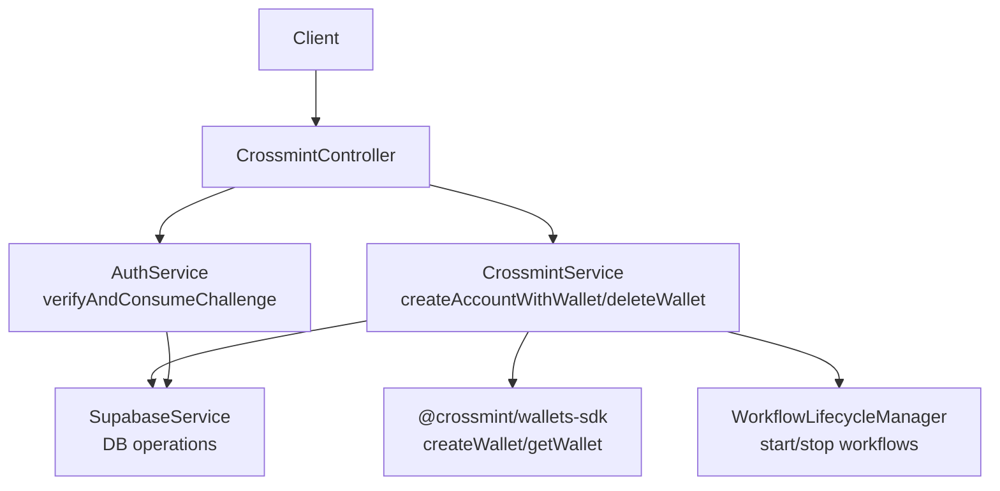
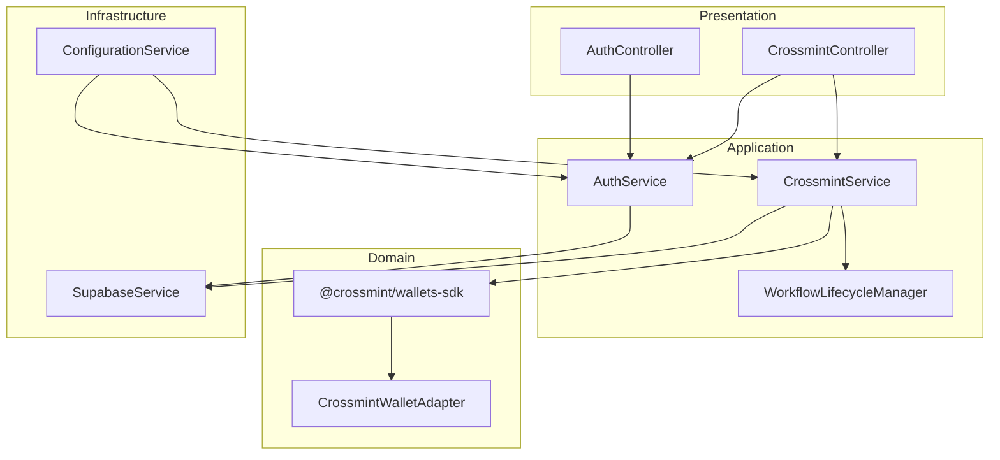
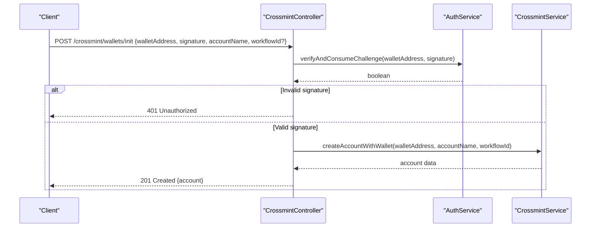
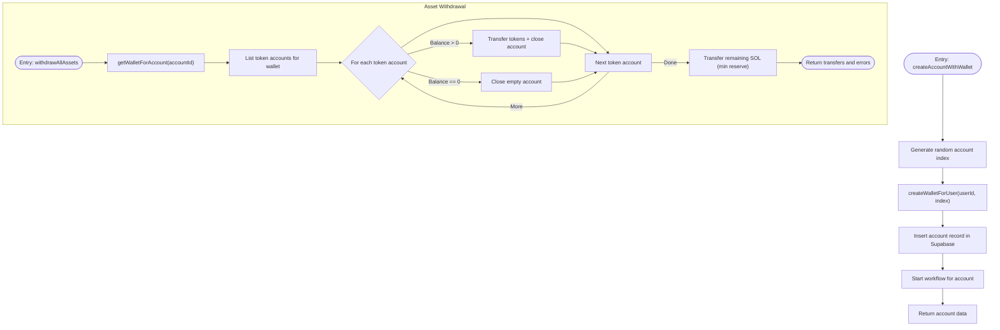
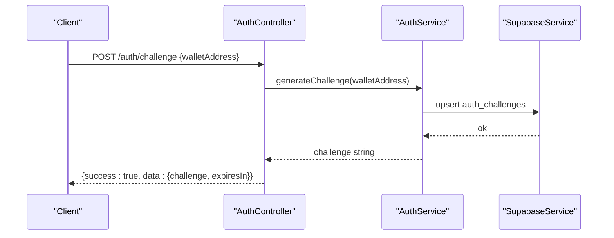
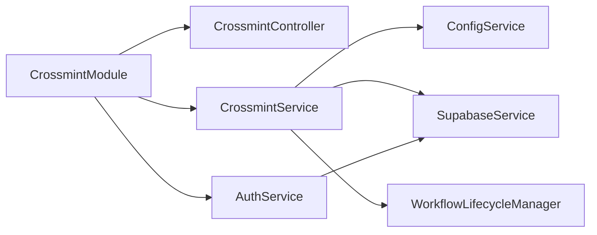

# API Integration Patterns

<cite>
**Referenced Files in This Document**
- [crossmint.controller.ts](file://src/crossmint/crossmint.controller.ts)
- [crossmint.service.ts](file://src/crossmint/crossmint.service.ts)
- [crossmint-wallet.adapter.ts](file://src/crossmint/crossmint-wallet.adapter.ts)
- [init-wallet.dto.ts](file://src/crossmint/dto/init-wallet.dto.ts)
- [signed-request.dto.ts](file://src/crossmint/dto/signed-request.dto.ts)
- [crossmint.module.ts](file://src/crossmint/crossmint.module.ts)
- [configuration.ts](file://src/config/configuration.ts)
- [auth.service.ts](file://src/auth/auth.service.ts)
- [auth.controller.ts](file://src/auth/auth.controller.ts)
- [supabase.service.ts](file://src/database/supabase.service.ts)
- [workflow-lifecycle.service.ts](file://src/workflows/workflow-lifecycle.service.ts)
- [test-crossmint.ts](file://scripts/test-crossmint.ts)
- [crossmint.service.spec.ts](file://src/crossmint/crossmint.service.spec.ts)
- [auth.controller.spec.ts](file://src/auth/auth.controller.spec.ts)
</cite>

## Table of Contents
1. [Introduction](#introduction)
2. [Project Structure](#project-structure)
3. [Core Components](#core-components)
4. [Architecture Overview](#architecture-overview)
5. [Detailed Component Analysis](#detailed-component-analysis)
6. [Dependency Analysis](#dependency-analysis)
7. [Performance Considerations](#performance-considerations)
8. [Troubleshooting Guide](#troubleshooting-guide)
9. [Conclusion](#conclusion)
10. [Appendices](#appendices)

## Introduction
This document explains the Crossmint API integration patterns and controller implementation within the backend. It covers RESTful controller endpoints for wallet management, request routing, and response handling. It also documents service layer integration patterns, dependency injection usage, and Crossmint SDK integration strategies. Error handling, response formatting, and API versioning considerations are addressed, along with integration points to the authentication system, database operations, and the workflow engine. Practical examples of request/response cycles, controller method implementations, and service layer patterns are included, alongside strategies for rate limiting, retry mechanisms, and circuit breaker patterns. Testing strategies and mock service implementations are documented to support reliable API integration.

## Project Structure
The Crossmint integration is encapsulated under the crossmint module, which exposes two primary endpoints:
- POST /crossmint/wallets/init for initializing a new account with a Crossmint wallet
- DELETE /crossmint/wallets/:id for deleting (closing) an account and withdrawing assets

The integration relies on:
- Authentication via signed challenges
- Crossmint SDK for wallet creation and retrieval
- Supabase for persistence and RLS context
- Workflow lifecycle manager for post-account creation automation



**Diagram sources**
- [crossmint.controller.ts:17-66](file://src/crossmint/crossmint.controller.ts#L17-L66)
- [auth.service.ts:57-91](file://src/auth/auth.service.ts#L57-L91)
- [crossmint.service.ts:163-204](file://src/crossmint/crossmint.service.ts#L163-L204)
- [crossmint.service.ts:349-401](file://src/crossmint/crossmint.service.ts#L349-L401)
- [supabase.service.ts:29-40](file://src/database/supabase.service.ts#L29-L40)
- [workflow-lifecycle.service.ts:160-198](file://src/workflows/workflow-lifecycle.service.ts#L160-L198)

**Section sources**
- [crossmint.controller.ts:17-66](file://src/crossmint/crossmint.controller.ts#L17-L66)
- [crossmint.module.ts:9-15](file://src/crossmint/crossmint.module.ts#L9-L15)

## Core Components
- CrossmintController: Exposes REST endpoints for wallet initialization and deletion, integrating signature verification and Crossmint service orchestration.
- CrossmintService: Manages Crossmint SDK initialization, wallet creation/retrieval, asset withdrawal, and account lifecycle operations.
- CrossmintWalletAdapter: Bridges Crossmint’s Solana wallet to a standard adapter interface for signing and sending transactions.
- DTOs: Strongly typed request bodies for initialization and signed requests.
- AuthService: Generates and validates wallet challenges for signature-based authentication.
- SupabaseService: Provides database client and RLS context helpers.
- WorkflowLifecycleManager: Starts/stops workflow instances for accounts and checks minimum SOL balances.

**Section sources**
- [crossmint.controller.ts:17-66](file://src/crossmint/crossmint.controller.ts#L17-L66)
- [crossmint.service.ts:42-75](file://src/crossmint/crossmint.service.ts#L42-L75)
- [crossmint-wallet.adapter.ts:16-88](file://src/crossmint/crossmint-wallet.adapter.ts#L16-L88)
- [init-wallet.dto.ts:5-21](file://src/crossmint/dto/init-wallet.dto.ts#L5-L21)
- [signed-request.dto.ts:4-20](file://src/crossmint/dto/signed-request.dto.ts#L4-L20)
- [auth.service.ts:57-91](file://src/auth/auth.service.ts#L57-L91)
- [supabase.service.ts:29-40](file://src/database/supabase.service.ts#L29-L40)
- [workflow-lifecycle.service.ts:160-211](file://src/workflows/workflow-lifecycle.service.ts#L160-L211)

## Architecture Overview
The integration follows a layered architecture:
- Presentation Layer: NestJS controllers handle HTTP requests and responses.
- Application Layer: Controllers delegate to services for business logic.
- Domain Layer: Crossmint SDK and wallet adapter manage Crossmint-specific operations.
- Infrastructure Layer: Supabase client and configuration provide persistence and environment settings.
- Workflow Engine: Lifecycle manager coordinates automated workflows per account.



**Diagram sources**
- [crossmint.controller.ts:17-66](file://src/crossmint/crossmint.controller.ts#L17-L66)
- [auth.controller.ts:7-48](file://src/auth/auth.controller.ts#L7-L48)
- [crossmint.service.ts:42-75](file://src/crossmint/crossmint.service.ts#L42-L75)
- [auth.service.ts:57-91](file://src/auth/auth.service.ts#L57-L91)
- [workflow-lifecycle.service.ts:16-31](file://src/workflows/workflow-lifecycle.service.ts#L16-L31)
- [supabase.service.ts:29-40](file://src/database/supabase.service.ts#L29-L40)
- [configuration.ts:27-31](file://src/config/configuration.ts#L27-L31)

## Detailed Component Analysis

### CrossmintController
Responsibilities:
- Initialize a new account with a Crossmint wallet using a signed challenge.
- Delete/close an account, verifying ownership via signature and withdrawing all assets.

Key behaviors:
- Signature verification via AuthService before proceeding.
- Delegation to CrossmintService for account creation and deletion.
- Controlled HTTP responses with appropriate status codes and messages.



**Diagram sources**
- [crossmint.controller.ts:30-42](file://src/crossmint/crossmint.controller.ts#L30-L42)
- [auth.service.ts:57-91](file://src/auth/auth.service.ts#L57-L91)
- [crossmint.service.ts:163-204](file://src/crossmint/crossmint.service.ts#L163-L204)

**Section sources**
- [crossmint.controller.ts:23-42](file://src/crossmint/crossmint.controller.ts#L23-L42)
- [init-wallet.dto.ts:5-21](file://src/crossmint/dto/init-wallet.dto.ts#L5-L21)
- [signed-request.dto.ts:4-20](file://src/crossmint/dto/signed-request.dto.ts#L4-L20)

### CrossmintService
Responsibilities:
- Initialize Crossmint SDK using configuration.
- Create Crossmint wallets for users and retrieve existing wallets.
- Create accounts and link them to Crossmint wallets.
- Withdraw all assets (SPL tokens and SOL) from a Crossmint wallet back to the owner wallet.
- Delete accounts after successful asset withdrawal and workflow termination.

Integration highlights:
- Uses @crossmint/wallets-sdk for wallet operations.
- Adapts Crossmint wallet to a standard adapter for signing and sending transactions.
- Persists account data in Supabase and manages RLS context.
- Coordinates with WorkflowLifecycleManager to start or stop workflows.



**Diagram sources**
- [crossmint.service.ts:163-204](file://src/crossmint/crossmint.service.ts#L163-L204)
- [crossmint.service.ts:209-344](file://src/crossmint/crossmint.service.ts#L209-L344)
- [crossmint-wallet.adapter.ts:35-76](file://src/crossmint/crossmint-wallet.adapter.ts#L35-L76)

**Section sources**
- [crossmint.service.ts:42-75](file://src/crossmint/crossmint.service.ts#L42-L75)
- [crossmint.service.ts:84-114](file://src/crossmint/crossmint.service.ts#L84-L114)
- [crossmint.service.ts:122-154](file://src/crossmint/crossmint.service.ts#L122-L154)
- [crossmint.service.ts:163-204](file://src/crossmint/crossmint.service.ts#L163-L204)
- [crossmint.service.ts:209-344](file://src/crossmint/crossmint.service.ts#L209-L344)
- [crossmint.service.ts:349-401](file://src/crossmint/crossmint.service.ts#L349-L401)

### CrossmintWalletAdapter
Responsibilities:
- Wrap Crossmint Solana wallet to conform to a standard adapter interface.
- Support signing and sending transactions, with explicit limitations for message signing.

```mermaid
classDiagram
class CrossmintWalletAdapter {
+publicKey PublicKey
+address string
+signTransaction(transaction) Promise<Transaction>
+signAllTransactions(transactions) Promise<Transaction[]>
+signAndSendTransaction(transaction) Promise<{signature}>
+signMessage(message) Promise<Uint8Array>
}
```

**Diagram sources**
- [crossmint-wallet.adapter.ts:16-88](file://src/crossmint/crossmint-wallet.adapter.ts#L16-L88)

**Section sources**
- [crossmint-wallet.adapter.ts:16-88](file://src/crossmint/crossmint-wallet.adapter.ts#L16-L88)

### DTOs and Request Validation
- SignedRequestDto: Base DTO for signed requests containing wallet address and signature.
- InitWalletDto: Extends SignedRequestDto with accountName and optional workflowId.

Validation ensures robust request handling and clear error responses.

**Section sources**
- [signed-request.dto.ts:4-20](file://src/crossmint/dto/signed-request.dto.ts#L4-L20)
- [init-wallet.dto.ts:5-21](file://src/crossmint/dto/init-wallet.dto.ts#L5-L21)

### Authentication Integration
- AuthController exposes a challenge endpoint to generate a time-bound challenge for wallet signatures.
- AuthService generates, stores, verifies, and consumes challenges, ensuring replay protection and expiration.



**Diagram sources**
- [auth.controller.ts:36-47](file://src/auth/auth.controller.ts#L36-L47)
- [auth.service.ts:27-51](file://src/auth/auth.service.ts#L27-L51)
- [auth.service.ts:57-91](file://src/auth/auth.service.ts#L57-L91)
- [supabase.service.ts:29-40](file://src/database/supabase.service.ts#L29-L40)

**Section sources**
- [auth.controller.ts:11-47](file://src/auth/auth.controller.ts#L11-L47)
- [auth.service.ts:27-91](file://src/auth/auth.service.ts#L27-L91)

### Database Operations and RLS Context
- SupabaseService initializes the client and exposes helpers to set RLS context for wallet address operations.
- CrossmintService and AuthService perform CRUD operations against Supabase tables for accounts and auth challenges.

**Section sources**
- [supabase.service.ts:11-40](file://src/database/supabase.service.ts#L11-L40)
- [crossmint.service.ts:180-195](file://src/crossmint/crossmint.service.ts#L180-L195)
- [auth.service.ts:36-51](file://src/auth/auth.service.ts#L36-L51)

### Workflow Engine Integration
- WorkflowLifecycleManager starts workflows for newly created accounts and stops them during deletion.
- It checks minimum SOL balance before launching workflows and updates execution records in Supabase.

**Section sources**
- [workflow-lifecycle.service.ts:160-198](file://src/workflows/workflow-lifecycle.service.ts#L160-L198)
- [workflow-lifecycle.service.ts:214-229](file://src/workflows/workflow-lifecycle.service.ts#L214-L229)
- [workflow-lifecycle.service.ts:258-275](file://src/workflows/workflow-lifecycle.service.ts#L258-L275)

## Dependency Analysis
The crossmint module integrates with multiple subsystems through dependency injection and module imports. The controller depends on the service and authentication service. The service depends on configuration, Supabase, and the workflow lifecycle manager. The authentication service depends on Supabase for challenge storage and verification.



**Diagram sources**
- [crossmint.module.ts:9-15](file://src/crossmint/crossmint.module.ts#L9-L15)
- [crossmint.controller.ts:18-21](file://src/crossmint/crossmint.controller.ts#L18-L21)
- [crossmint.service.ts:49-54](file://src/crossmint/crossmint.service.ts#L49-L54)
- [auth.service.ts:12-15](file://src/auth/auth.service.ts#L12-L15)

**Section sources**
- [crossmint.module.ts:9-15](file://src/crossmint/crossmint.module.ts#L9-L15)
- [crossmint.controller.ts:18-21](file://src/crossmint/crossmint.controller.ts#L18-L21)
- [crossmint.service.ts:49-54](file://src/crossmint/crossmint.service.ts#L49-L54)
- [auth.service.ts:12-15](file://src/auth/auth.service.ts#L12-L15)

## Performance Considerations
- SDK Initialization: Crossmint SDK is initialized once during module initialization using configuration values. Ensure environment variables are set to avoid runtime warnings.
- Asset Withdrawal Pipeline: The withdrawal process iterates over token accounts, performs transfers, and closes accounts. Consider batching and rate-limiting external RPC calls to Solana.
- Workflow Launch Checks: Minimum SOL balance checks prevent unnecessary launches and reduce failures.
- Database Transactions: Batch operations and careful error handling minimize partial state inconsistencies.

[No sources needed since this section provides general guidance]

## Troubleshooting Guide
Common issues and resolutions:
- Missing Crossmint credentials: If server API key or signer secret is not configured, the SDK remains uninitialized. Verify environment variables and restart the service.
- Signature verification failures: Ensure the challenge is fresh and matches the wallet address. Confirm the signature uses the correct message format.
- Account not found or wallet not configured: Validate account existence and presence of wallet locator/address in Supabase.
- Asset withdrawal errors: Review returned errors from the withdrawal operation and reattempt after resolving underlying issues.
- Workflow start failures: Confirm the account has sufficient SOL and is active.

**Section sources**
- [crossmint.service.ts:56-75](file://src/crossmint/crossmint.service.ts#L56-L75)
- [auth.service.ts:57-91](file://src/auth/auth.service.ts#L57-L91)
- [crossmint.service.ts:129-137](file://src/crossmint/crossmint.service.ts#L129-L137)
- [crossmint.service.ts:380-386](file://src/crossmint/crossmint.service.ts#L380-L386)

## Conclusion
The Crossmint integration leverages a clean separation of concerns: controllers handle HTTP concerns, services encapsulate business logic and SDK interactions, adapters bridge domain-specific APIs to standard interfaces, and infrastructure services provide persistence and configuration. The authentication system enforces secure, time-bound signature-based access. Together, these components form a robust foundation for wallet management, asset withdrawal, and automated workflow orchestration.

[No sources needed since this section summarizes without analyzing specific files]

## Appendices

### API Endpoints Summary
- POST /crossmint/wallets/init
  - Description: Initialize a new account with a Crossmint wallet using a signed challenge.
  - Request body: InitWalletDto (walletAddress, signature, accountName, workflowId?)
  - Responses: 201 Created with account data; 401 Unauthorized on invalid signature.

- DELETE /crossmint/wallets/:id
  - Description: Delete (close) an account after verifying ownership via signature and withdrawing all assets.
  - Request body: SignedRequestDto (walletAddress, signature)
  - Responses: 200 OK with success message and withdrawal results; 401 Unauthorized; 403 Forbidden; 400 Bad Request on incomplete withdrawal.

**Section sources**
- [crossmint.controller.ts:23-42](file://src/crossmint/crossmint.controller.ts#L23-L42)
- [crossmint.controller.ts:44-65](file://src/crossmint/crossmint.controller.ts#L44-L65)

### Configuration Reference
Key environment variables used by the integration:
- CROSSMINT_SERVER_API_KEY: Crossmint server API key for SDK initialization.
- CROSSMINT_SIGNER_SECRET: Crossmint signer secret for wallet operations.
- CROSSMINT_ENVIRONMENT: Crossmint environment (default: production).
- SUPABASE_URL, SUPABASE_SERVICE_KEY: Supabase client configuration.
- SOLANA_RPC_URL: Solana RPC endpoint for wallet operations.

**Section sources**
- [configuration.ts:27-31](file://src/config/configuration.ts#L27-L31)
- [configuration.ts:6-10](file://src/config/configuration.ts#L6-L10)
- [configuration.ts:18-21](file://src/config/configuration.ts#L18-L21)

### Testing Strategies
- End-to-end SDK connectivity: Use the provided script to validate Crossmint SDK initialization and wallet operations.
- Unit tests: Mock SDK and database interactions to verify service behavior under various scenarios.
- Controller tests: Validate response formatting and status codes for authentication endpoints.

**Section sources**
- [test-crossmint.ts:12-78](file://scripts/test-crossmint.ts#L12-L78)
- [crossmint.service.spec.ts:87-106](file://src/crossmint/crossmint.service.spec.ts#L87-L106)
- [crossmint.service.spec.ts:108-144](file://src/crossmint/crossmint.service.spec.ts#L108-L144)
- [crossmint.service.spec.ts:146-228](file://src/crossmint/crossmint.service.spec.ts#L146-L228)
- [auth.controller.spec.ts:1-22](file://src/auth/auth.controller.spec.ts#L1-L22)

### Reliability Patterns
- Rate Limiting: Apply per-wallet or per-endpoint limits using middleware or external rate limiting services.
- Retry Mechanisms: Implement exponential backoff for transient failures when interacting with Crossmint SDK and Solana RPC.
- Circuit Breaker: Monitor failure rates and temporarily halt operations to prevent cascading failures.

[No sources needed since this section provides general guidance]