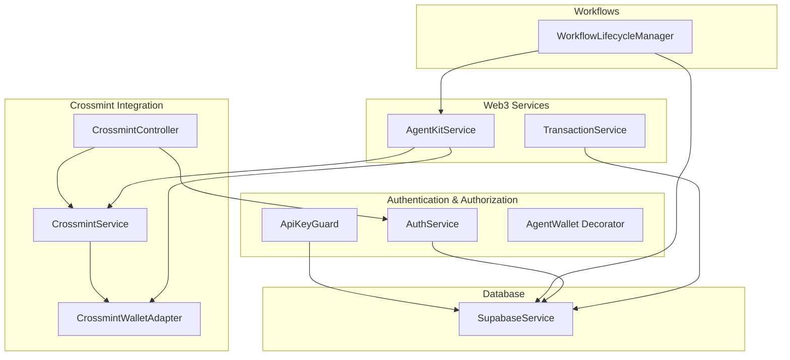
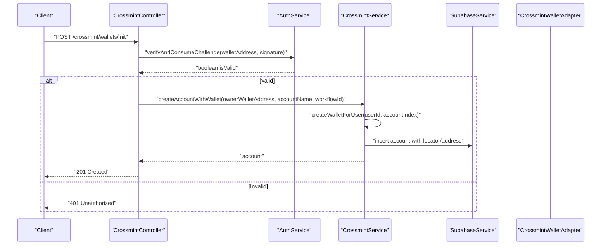
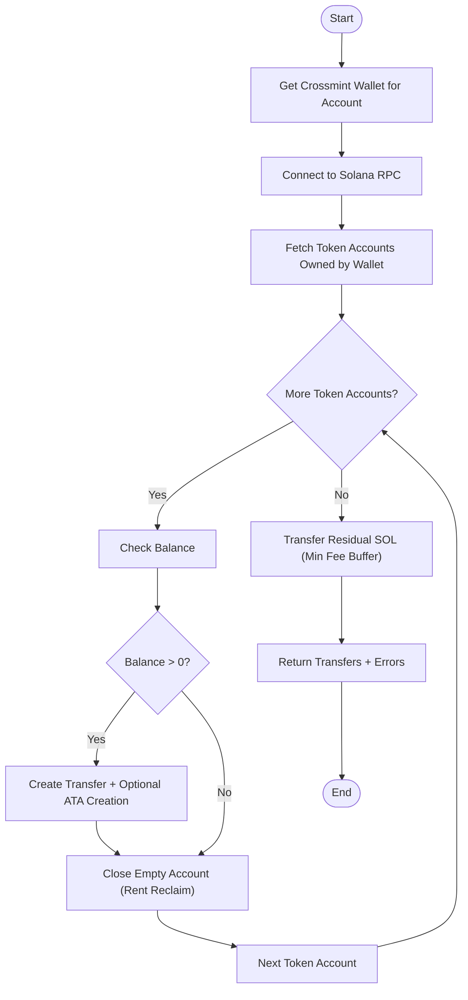
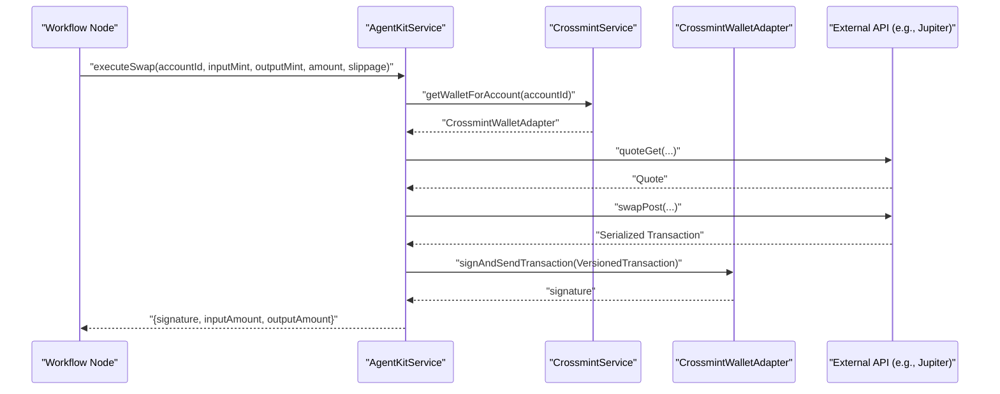
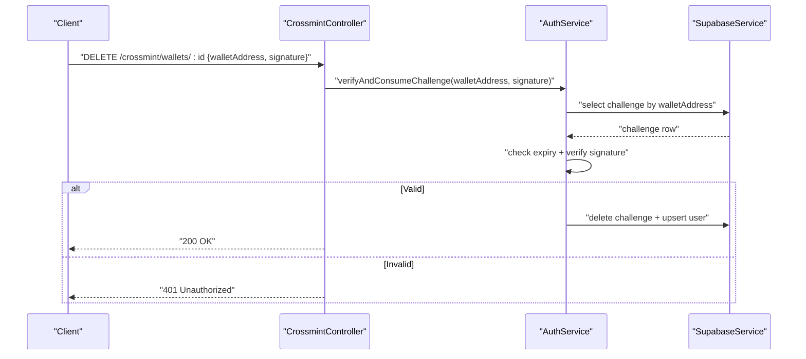
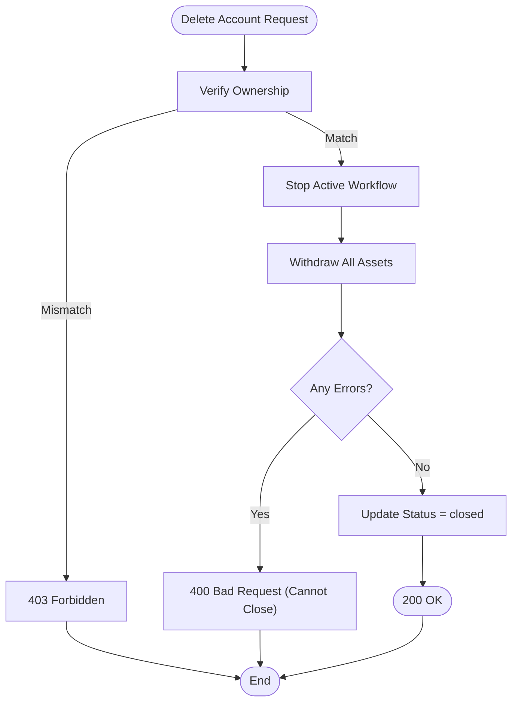
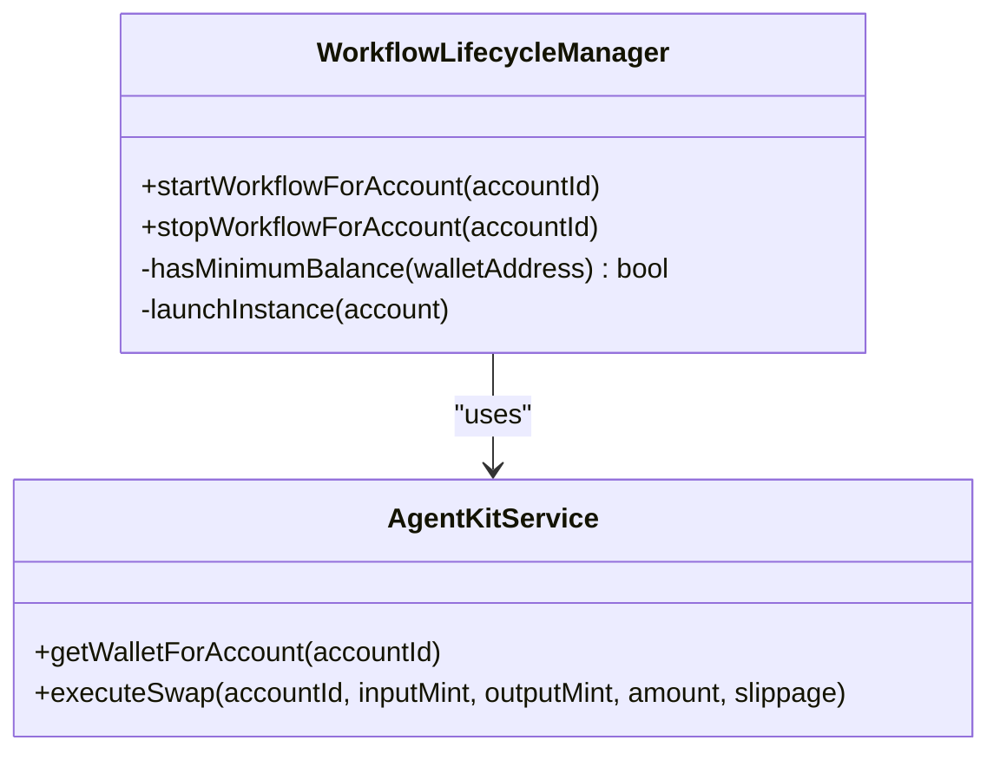
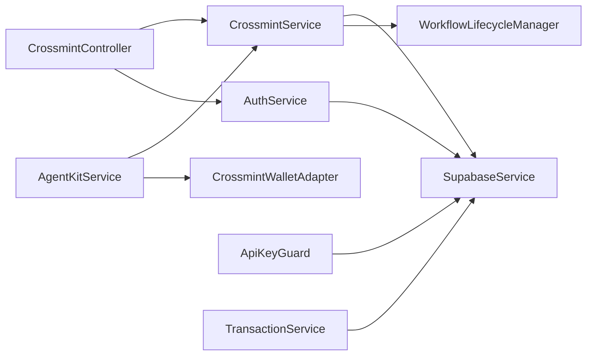

# Asset Operations and Security

<cite>
**Referenced Files in This Document**
- [crossmint.service.ts](file://src/crossmint/crossmint.service.ts)
- [crossmint.controller.ts](file://src/crossmint/crossmint.controller.ts)
- [signed-request.dto.ts](file://src/crossmint/dto/signed-request.dto.ts)
- [init-wallet.dto.ts](file://src/crossmint/dto/init-wallet.dto.ts)
- [crossmint-wallet.adapter.ts](file://src/crossmint/crossmint-wallet.adapter.ts)
- [agent-kit.service.ts](file://src/web3/services/agent-kit.service.ts)
- [workflow-lifecycle.service.ts](file://src/workflows/workflow-lifecycle.service.ts)
- [auth.service.ts](file://src/auth/auth.service.ts)
- [wallet-challenge.dto.ts](file://src/auth/dto/wallet-challenge.dto.ts)
- [api-key.guard.ts](file://src/common/guards/api-key.guard.ts)
- [agent-wallet.decorator.ts](file://src/common/decorators/agent-wallet.decorator.ts)
- [supabase.service.ts](file://src/database/supabase.service.ts)
- [transaction.service.ts](file://src/web3/services/transaction.service.ts)
- [full_system_test.ts](file://scripts/full_system_test.ts)
</cite>

## Table of Contents
1. [Introduction](#introduction)
2. [Project Structure](#project-structure)
3. [Core Components](#core-components)
4. [Architecture Overview](#architecture-overview)
5. [Detailed Component Analysis](#detailed-component-analysis)
6. [Dependency Analysis](#dependency-analysis)
7. [Performance Considerations](#performance-considerations)
8. [Troubleshooting Guide](#troubleshooting-guide)
9. [Conclusion](#conclusion)
10. [Appendices](#appendices)

## Introduction
This document explains asset operations and security measures for Crossmint integration within the backend. It covers secure asset management, including signed-request DTO validation, transaction signing workflows, and Crossmint API security patterns. It also details asset withdrawal processes, fund transfers, and account closure procedures, along with integration with agent-kit.service for secure transaction execution and Crossmint’s security model for custodial operations. Cryptographic signing requirements, request validation, and security best practices for custodial wallets are included, alongside examples of secure asset operations, error handling for failed transactions, and security incident response procedures. Regulatory compliance considerations, audit trails, and security monitoring for custodial operations are addressed.

## Project Structure
The Crossmint integration spans several modules:
- Crossmint domain: wallet creation, retrieval, and closure with asset withdrawal
- Authentication and authorization: challenge generation, signature verification, and API key enforcement
- Web3 services: agent kit orchestration, transaction signing, and execution
- Workflows: lifecycle management and execution of automated tasks
- Database: Supabase-backed persistence and RLS context management

**Diagram sources**
- [crossmint.controller.ts:1-67](file://src/crossmint/crossmint.controller.ts#L1-L67)
- [crossmint.service.ts:1-403](file://src/crossmint/crossmint.service.ts#L1-L403)
- [crossmint-wallet.adapter.ts:1-89](file://src/crossmint/crossmint-wallet.adapter.ts#L1-L89)
- [auth.service.ts:1-165](file://src/auth/auth.service.ts#L1-L165)
- [api-key.guard.ts:1-56](file://src/common/guards/api-key.guard.ts#L1-L56)
- [agent-wallet.decorator.ts:1-9](file://src/common/decorators/agent-wallet.decorator.ts#L1-L9)
- [agent-kit.service.ts:1-163](file://src/web3/services/agent-kit.service.ts#L1-L163)
- [transaction.service.ts:1-158](file://src/web3/services/transaction.service.ts#L1-L158)
- [workflow-lifecycle.service.ts:1-343](file://src/workflows/workflow-lifecycle.service.ts#L1-L343)
- [supabase.service.ts:1-42](file://src/database/supabase.service.ts#L1-L42)

**Section sources**
- [crossmint.controller.ts:1-67](file://src/crossmint/crossmint.controller.ts#L1-L67)
- [crossmint.service.ts:1-403](file://src/crossmint/crossmint.service.ts#L1-L403)
- [auth.service.ts:1-165](file://src/auth/auth.service.ts#L1-L165)
- [api-key.guard.ts:1-56](file://src/common/guards/api-key.guard.ts#L1-L56)
- [agent-kit.service.ts:1-163](file://src/web3/services/agent-kit.service.ts#L1-L163)
- [workflow-lifecycle.service.ts:1-343](file://src/workflows/workflow-lifecycle.service.ts#L1-L343)
- [supabase.service.ts:1-42](file://src/database/supabase.service.ts#L1-L42)

## Core Components
- CrossmintService: Creates and retrieves Crossmint wallets, creates accounts with wallets, withdraws all assets, and deletes/closes accounts with asset withdrawal.
- CrossmintWalletAdapter: Wraps Crossmint’s Solana wallet to conform to a standard wallet interface for signing and sending transactions.
- CrossmintController: Exposes endpoints for initializing wallets and deleting/closing accounts, enforcing signature validation.
- AuthService: Generates and verifies wallet challenges, enforces expiration, and cleans up expired challenges.
- AgentKitService: Provides unified access to Crossmint wallets for workflow nodes, integrates with external APIs (e.g., Jupiter) for swaps, and manages retries and concurrency.
- WorkflowLifecycleManager: Manages lifecycle of workflow instances per account, ensuring minimum SOL balances and safe execution.
- ApiKeyGuard and AgentWallet Decorator: Enforce API key-based authentication and attach agent wallet context to requests.
- SupabaseService: Initializes Supabase client and sets RLS context for wallet-aware queries.
- TransactionService: Utility functions for transaction simulation, blockhash fetching, and robust send-and-confirm flows.

**Section sources**
- [crossmint.service.ts:1-403](file://src/crossmint/crossmint.service.ts#L1-L403)
- [crossmint-wallet.adapter.ts:1-89](file://src/crossmint/crossmint-wallet.adapter.ts#L1-L89)
- [crossmint.controller.ts:1-67](file://src/crossmint/crossmint.controller.ts#L1-L67)
- [auth.service.ts:1-165](file://src/auth/auth.service.ts#L1-L165)
- [agent-kit.service.ts:1-163](file://src/web3/services/agent-kit.service.ts#L1-L163)
- [workflow-lifecycle.service.ts:1-343](file://src/workflows/workflow-lifecycle.service.ts#L1-L343)
- [api-key.guard.ts:1-56](file://src/common/guards/api-key.guard.ts#L1-L56)
- [agent-wallet.decorator.ts:1-9](file://src/common/decorators/agent-wallet.decorator.ts#L1-L9)
- [supabase.service.ts:1-42](file://src/database/supabase.service.ts#L1-L42)
- [transaction.service.ts:1-158](file://src/web3/services/transaction.service.ts#L1-L158)

## Architecture Overview
The system enforces a layered security model:
- Signature-based authentication for sensitive operations (init wallet, delete wallet)
- API key-based authentication for agent-facing endpoints
- Crossmint server-side signer for wallet operations
- Robust transaction signing and execution via AgentKitService
- Lifecycle management to ensure sufficient funds and controlled execution

**Diagram sources**
- [crossmint.controller.ts:30-42](file://src/crossmint/crossmint.controller.ts#L30-L42)
- [auth.service.ts:57-91](file://src/auth/auth.service.ts#L57-L91)
- [crossmint.service.ts:163-204](file://src/crossmint/crossmint.service.ts#L163-L204)
- [supabase.service.ts:29-40](file://src/database/supabase.service.ts#L29-L40)

## Detailed Component Analysis

### Crossmint Wallet Management and Asset Operations
- Wallet creation: Uses Crossmint SDK with server-side signer to create a new custodial wallet bound to an owner identifier.
- Wallet retrieval: Resolves wallet locator/address and wraps it into a standard adapter for signing and sending transactions.
- Account creation with wallet: Inserts account metadata and triggers workflow lifecycle start.
- Asset withdrawal: Iterates SPL token accounts, transfers balances to owner’s associated token account, closes empty accounts, and transfers residual SOL after deducting a conservative fee buffer.
- Account deletion/closure: Validates ownership, stops active workflows, withdraws all assets, and performs a soft delete on the account if withdrawal succeeds.

**Diagram sources**
- [crossmint.service.ts:209-344](file://src/crossmint/crossmint.service.ts#L209-L344)

**Section sources**
- [crossmint.service.ts:84-114](file://src/crossmint/crossmint.service.ts#L84-L114)
- [crossmint.service.ts:122-154](file://src/crossmint/crossmint.service.ts#L122-L154)
- [crossmint.service.ts:163-204](file://src/crossmint/crossmint.service.ts#L163-L204)
- [crossmint.service.ts:209-344](file://src/crossmint/crossmint.service.ts#L209-L344)
- [crossmint.service.ts:349-401](file://src/crossmint/crossmint.service.ts#L349-L401)

### Transaction Signing Workflows and Agent Integration
- AgentKitService orchestrates transaction execution for workflow nodes:
  - Retrieves Crossmint wallet adapter for an account
  - Executes swaps via external APIs (e.g., Jupiter), deserializes transactions, and signs via Crossmint wallet
  - Implements retry and concurrency controls for external API calls
- CrossmintWalletAdapter:
  - Supports signTransaction, signAllTransactions, and signAndSendTransaction
  - Throws if message signing is attempted (limited support for this wallet type)

**Diagram sources**
- [agent-kit.service.ts:99-161](file://src/web3/services/agent-kit.service.ts#L99-L161)
- [crossmint.service.ts:122-154](file://src/crossmint/crossmint.service.ts#L122-L154)
- [crossmint-wallet.adapter.ts:65-76](file://src/crossmint/crossmint-wallet.adapter.ts#L65-L76)

**Section sources**
- [agent-kit.service.ts:1-163](file://src/web3/services/agent-kit.service.ts#L1-L163)
- [crossmint-wallet.adapter.ts:1-89](file://src/crossmint/crossmint-wallet.adapter.ts#L1-L89)

### Request Validation and Crossmint API Security Patterns
- Signed-request DTO validation:
  - SignedRequestDto requires a non-empty wallet address and signature
  - InitWalletDto extends SignedRequestDto and adds accountName and optional workflowId
- CrossmintController enforces signature validation for initialization and deletion:
  - Uses AuthService.verifyAndConsumeChallenge to validate signatures and consume challenges
  - Returns 401 for invalid/expired signatures and 403 for unauthorized ownership checks
- API key enforcement:
  - ApiKeyGuard validates X-API-Key header against hashed keys stored in Supabase
  - Attaches agent wallet address to request context for downstream use
- Challenge generation and verification:
  - AuthService generates challenges with nonce and expiry, stores in DB, and verifies Ed25519 signatures
  - Cleans expired challenges periodically

**Diagram sources**
- [crossmint.controller.ts:52-65](file://src/crossmint/crossmint.controller.ts#L52-L65)
- [auth.service.ts:57-91](file://src/auth/auth.service.ts#L57-L91)
- [signed-request.dto.ts:1-21](file://src/crossmint/dto/signed-request.dto.ts#L1-L21)
- [init-wallet.dto.ts:1-22](file://src/crossmint/dto/init-wallet.dto.ts#L1-L22)

**Section sources**
- [signed-request.dto.ts:1-21](file://src/crossmint/dto/signed-request.dto.ts#L1-L21)
- [init-wallet.dto.ts:1-22](file://src/crossmint/dto/init-wallet.dto.ts#L1-L22)
- [crossmint.controller.ts:30-65](file://src/crossmint/crossmint.controller.ts#L30-L65)
- [auth.service.ts:27-91](file://src/auth/auth.service.ts#L27-L91)
- [api-key.guard.ts:1-56](file://src/common/guards/api-key.guard.ts#L1-L56)
- [agent-wallet.decorator.ts:1-9](file://src/common/decorators/agent-wallet.decorator.ts#L1-L9)

### Asset Withdrawal and Account Closure Procedures
- Withdrawal:
  - Enumerates token accounts, ensures owner ATA exists, transfers balances, closes empty accounts, and transfers residual SOL after a conservative fee buffer
  - Aggregates successful transfers and collects errors for partial failures
- Closure:
  - Validates ownership against stored owner wallet address
  - Stops active workflow instances for the account
  - Calls withdrawal routine; if any error occurs, blocks closure and returns a structured error
  - Soft-deletes the account by updating status to closed

**Diagram sources**
- [crossmint.service.ts:349-401](file://src/crossmint/crossmint.service.ts#L349-L401)

**Section sources**
- [crossmint.service.ts:209-344](file://src/crossmint/crossmint.service.ts#L209-L344)
- [crossmint.service.ts:349-401](file://src/crossmint/crossmint.service.ts#L349-L401)

### Workflow Lifecycle and Custodial Security Monitoring
- WorkflowLifecycleManager:
  - Polls active accounts and starts/stops workflow instances accordingly
  - Checks minimum SOL balance threshold before launching executions
  - Creates execution records and updates statuses on completion or failure
- AgentKitService:
  - Provides rate limiting and retry mechanisms for external API calls
  - Centralizes transaction signing via Crossmint wallets

**Diagram sources**
- [workflow-lifecycle.service.ts:160-211](file://src/workflows/workflow-lifecycle.service.ts#L160-L211)
- [agent-kit.service.ts:74-161](file://src/web3/services/agent-kit.service.ts#L74-L161)

**Section sources**
- [workflow-lifecycle.service.ts:1-343](file://src/workflows/workflow-lifecycle.service.ts#L1-L343)
- [agent-kit.service.ts:1-163](file://src/web3/services/agent-kit.service.ts#L1-L163)

### Security Best Practices for Custodial Wallets
- Use server-side signer with Crossmint to avoid exposing private keys
- Enforce signature-based authentication for sensitive operations with short-lived challenges
- Apply API key guards for agent-facing endpoints and attach wallet context
- Maintain audit trails via database inserts and updates for workflow executions
- Monitor SOL balances to prevent failed transactions due to insufficient fees
- Implement retry and concurrency controls for external API interactions

[No sources needed since this section provides general guidance]

### Examples of Secure Asset Operations
- Initializing a Crossmint wallet for an owner:
  - Obtain a challenge, sign it with the owner’s wallet, and call the init endpoint
  - See [full_system_test.ts:74-84](file://scripts/full_system_test.ts#L74-L84) for a test flow demonstrating this
- Executing a swap via AgentKit:
  - Retrieve wallet adapter, call executeSwap, and receive signature and amounts
  - See [agent-kit.service.ts:99-161](file://src/web3/services/agent-kit.service.ts#L99-L161)
- Withdrawing assets and closing an account:
  - Verify ownership, withdraw all assets, and soft-delete the account
  - See [crossmint.service.ts:349-401](file://src/crossmint/crossmint.service.ts#L349-L401)

**Section sources**
- [full_system_test.ts:74-84](file://scripts/full_system_test.ts#L74-L84)
- [agent-kit.service.ts:99-161](file://src/web3/services/agent-kit.service.ts#L99-L161)
- [crossmint.service.ts:349-401](file://src/crossmint/crossmint.service.ts#L349-L401)

### Error Handling for Failed Transactions
- CrossmintService:
  - Catches and logs errors during token account processing and SOL transfers
  - Aggregates errors and returns them alongside successful transfers
- AgentKitService:
  - Implements retry with exponential backoff and jitter for external API calls
  - Limits concurrent external API calls
- TransactionService:
  - Provides robust send-and-confirm logic with transaction log retrieval on failure

**Section sources**
- [crossmint.service.ts:209-344](file://src/crossmint/crossmint.service.ts#L209-L344)
- [agent-kit.service.ts:26-45](file://src/web3/services/agent-kit.service.ts#L26-L45)
- [transaction.service.ts:41-101](file://src/web3/services/transaction.service.ts#L41-L101)

### Security Incident Response Procedures
- Immediate actions:
  - Rotate API keys if compromise suspected
  - Invalidate compromised challenges and revoke affected sessions
  - Audit workflow executions and transaction logs
- Monitoring:
  - Track failed transactions and error rates
  - Alert on repeated failures or unusual patterns
- Compliance:
  - Maintain audit trails for regulatory reporting
  - Enforce RLS policies and restrict access to wallet-aware data

[No sources needed since this section provides general guidance]

## Dependency Analysis

**Diagram sources**
- [crossmint.controller.ts:1-67](file://src/crossmint/crossmint.controller.ts#L1-L67)
- [crossmint.service.ts:1-403](file://src/crossmint/crossmint.service.ts#L1-L403)
- [auth.service.ts:1-165](file://src/auth/auth.service.ts#L1-L165)
- [agent-kit.service.ts:1-163](file://src/web3/services/agent-kit.service.ts#L1-L163)
- [workflow-lifecycle.service.ts:1-343](file://src/workflows/workflow-lifecycle.service.ts#L1-L343)
- [api-key.guard.ts:1-56](file://src/common/guards/api-key.guard.ts#L1-L56)
- [supabase.service.ts:1-42](file://src/database/supabase.service.ts#L1-L42)
- [transaction.service.ts:1-158](file://src/web3/services/transaction.service.ts#L1-L158)

**Section sources**
- [crossmint.controller.ts:1-67](file://src/crossmint/crossmint.controller.ts#L1-L67)
- [crossmint.service.ts:1-403](file://src/crossmint/crossmint.service.ts#L1-L403)
- [auth.service.ts:1-165](file://src/auth/auth.service.ts#L1-L165)
- [agent-kit.service.ts:1-163](file://src/web3/services/agent-kit.service.ts#L1-L163)
- [workflow-lifecycle.service.ts:1-343](file://src/workflows/workflow-lifecycle.service.ts#L1-L343)
- [api-key.guard.ts:1-56](file://src/common/guards/api-key.guard.ts#L1-L56)
- [supabase.service.ts:1-42](file://src/database/supabase.service.ts#L1-L42)
- [transaction.service.ts:1-158](file://src/web3/services/transaction.service.ts#L1-L158)

## Performance Considerations
- External API calls are rate-limited and retried with exponential backoff to reduce contention and improve reliability
- Transaction signing leverages Crossmint’s server-side signer to minimize latency and avoid local signing overhead
- Workflow lifecycle polling runs at a fixed interval to balance responsiveness and resource usage
- Conservative SOL fee buffer ensures withdrawal transactions succeed even under fee volatility

[No sources needed since this section provides general guidance]

## Troubleshooting Guide
- 401 Unauthorized on init/delete:
  - Indicates invalid or expired signature; regenerate challenge and sign again
  - See [crossmint.controller.ts:30-65](file://src/crossmint/crossmint.controller.ts#L30-L65)
- 403 Forbidden on delete:
  - Ownership mismatch; confirm the caller owns the account
  - See [crossmint.service.ts:355-386](file://src/crossmint/crossmint.service.ts#L355-L386)
- Withdrawal errors:
  - Inspect returned errors array; resolve underlying causes (network, insufficient balances)
  - See [crossmint.service.ts:209-344](file://src/crossmint/crossmint.service.ts#L209-L344)
- API key issues:
  - Ensure X-API-Key header is present and valid; verify key status in Supabase
  - See [api-key.guard.ts:11-54](file://src/common/guards/api-key.guard.ts#L11-L54)
- Transaction failures:
  - Review transaction logs retrieved during send-and-confirm failure handling
  - See [transaction.service.ts:70-98](file://src/web3/services/transaction.service.ts#L70-L98)

**Section sources**
- [crossmint.controller.ts:30-65](file://src/crossmint/crossmint.controller.ts#L30-L65)
- [crossmint.service.ts:355-386](file://src/crossmint/crossmint.service.ts#L355-L386)
- [crossmint.service.ts:209-344](file://src/crossmint/crossmint.service.ts#L209-L344)
- [api-key.guard.ts:11-54](file://src/common/guards/api-key.guard.ts#L11-L54)
- [transaction.service.ts:70-98](file://src/web3/services/transaction.service.ts#L70-L98)

## Conclusion
The Crossmint integration implements a secure, auditable, and resilient asset management system. By combining signature-based authentication, server-side signing, API key enforcement, and robust transaction execution, it supports custodial operations with strong safeguards. Lifecycle management ensures funds availability, while withdrawal and closure procedures protect user assets. The documented patterns and troubleshooting guidance enable reliable operation and incident response aligned with security best practices.

[No sources needed since this section summarizes without analyzing specific files]

## Appendices
- Regulatory compliance considerations:
  - Maintain immutable audit logs for all wallet operations and workflow executions
  - Enforce RLS policies and restrict access to wallet-aware data
  - Implement key rotation and session management for API keys
- Security monitoring:
  - Track challenge consumption, API key usage, and transaction outcomes
  - Alert on anomalies such as repeated signature failures or excessive external API errors

[No sources needed since this section provides general guidance]