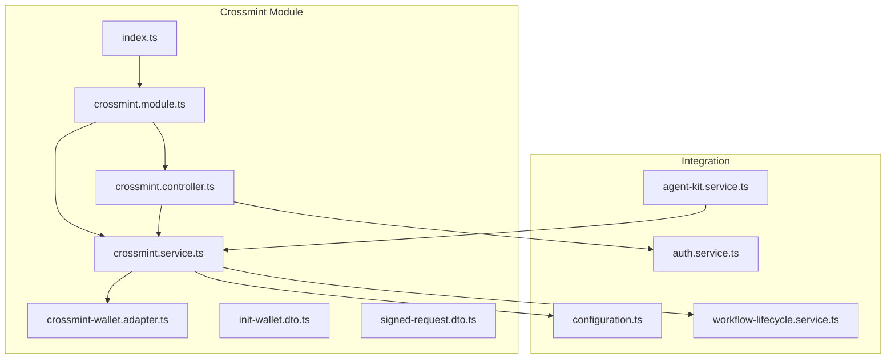
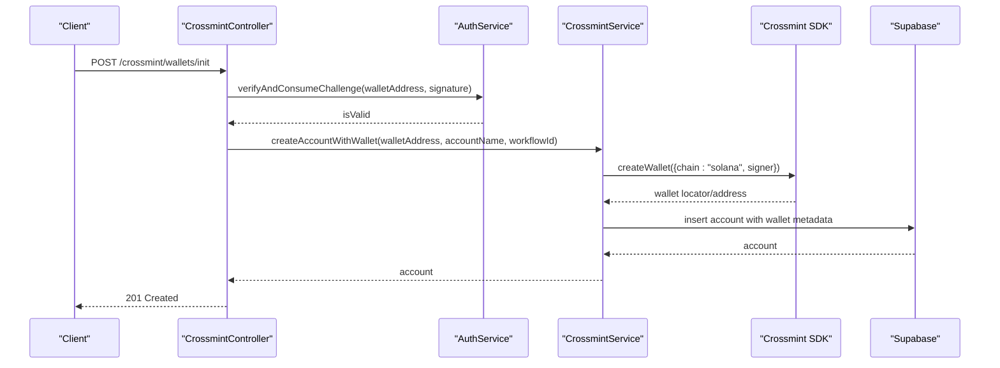
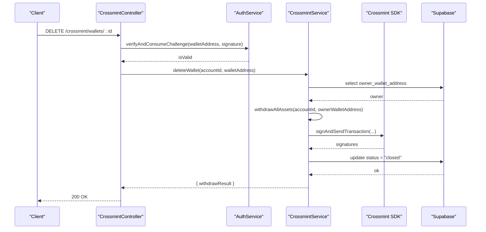
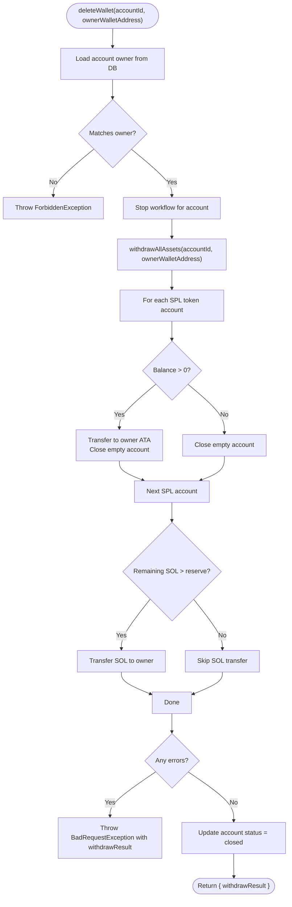
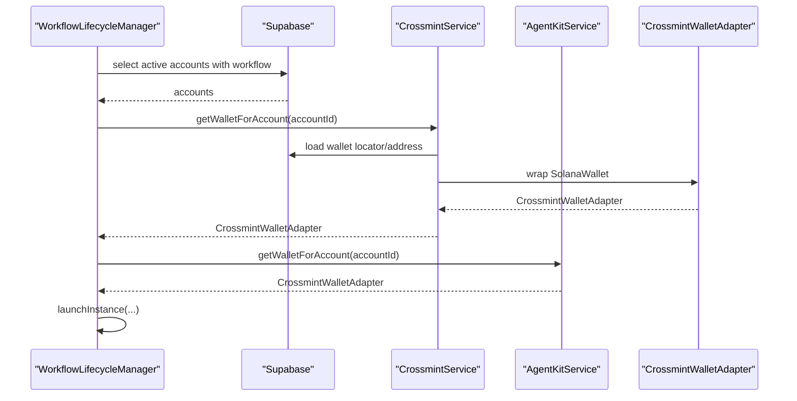
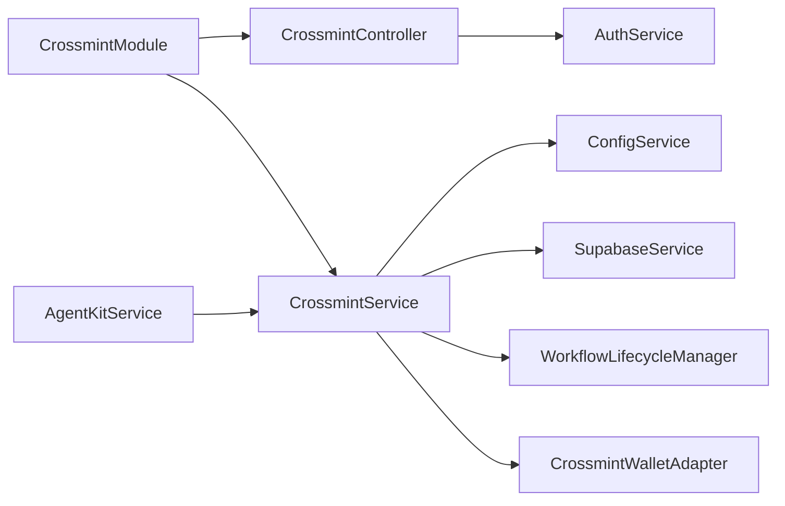

# Crossmint Integration

<cite>
**Referenced Files in This Document**
- [index.ts](file://src/crossmint/index.ts)
- [crossmint.module.ts](file://src/crossmint/crossmint.module.ts)
- [crossmint.controller.ts](file://src/crossmint/crossmint.controller.ts)
- [crossmint.service.ts](file://src/crossmint/crossmint.service.ts)
- [crossmint-wallet.adapter.ts](file://src/crossmint/crossmint-wallet.adapter.ts)
- [init-wallet.dto.ts](file://src/crossmint/dto/init-wallet.dto.ts)
- [signed-request.dto.ts](file://src/crossmint/dto/signed-request.dto.ts)
- [configuration.ts](file://src/config/configuration.ts)
- [auth.service.ts](file://src/auth/auth.service.ts)
- [agent-kit.service.ts](file://src/web3/services/agent-kit.service.ts)
- [workflow-lifecycle.service.ts](file://src/workflows/workflow-lifecycle.service.ts)
- [test-crossmint.ts](file://scripts/test-crossmint.ts)
</cite>

## Table of Contents
1. [Introduction](#introduction)
2. [Project Structure](#project-structure)
3. [Core Components](#core-components)
4. [Architecture Overview](#architecture-overview)
5. [Detailed Component Analysis](#detailed-component-analysis)
6. [Dependency Analysis](#dependency-analysis)
7. [Performance Considerations](#performance-considerations)
8. [Security Considerations](#security-considerations)
9. [Troubleshooting Guide](#troubleshooting-guide)
10. [Conclusion](#conclusion)
11. [Appendices](#appendices)

## Introduction
This document explains the Crossmint integration for custodial wallet management and blockchain account provisioning. It covers the custodial wallet concept, Crossmint SDK integration, wallet lifecycle management (initialization, asset management, and account closure), and the integration with the agent framework for programmatic wallet management. It also documents the controller endpoints, service layer operations, and the wallet abstraction adapter used to interface with the Crossmint SDK. Practical examples, security considerations, environment configuration, and troubleshooting guidance are included.

## Project Structure
The Crossmint integration is organized under the crossmint module with clear separation of concerns:
- Module and exports for easy consumption by other parts of the system
- Controller exposing REST endpoints for wallet initialization and deletion
- Service implementing Crossmint SDK interactions and asset withdrawal logic
- DTOs for request validation and secure operation signatures
- Wallet adapter for Solana transaction signing and submission via Crossmint
- Configuration for Crossmint and Solana environments
- Integration with the agent framework and workflow lifecycle management



**Diagram sources**
- [crossmint.module.ts:1-16](file://src/crossmint/crossmint.module.ts#L1-L16)
- [crossmint.controller.ts:1-67](file://src/crossmint/crossmint.controller.ts#L1-L67)
- [crossmint.service.ts:1-403](file://src/crossmint/crossmint.service.ts#L1-L403)
- [crossmint-wallet.adapter.ts:1-89](file://src/crossmint/crossmint-wallet.adapter.ts#L1-L89)
- [init-wallet.dto.ts:1-22](file://src/crossmint/dto/init-wallet.dto.ts#L1-L22)
- [signed-request.dto.ts:1-21](file://src/crossmint/dto/signed-request.dto.ts#L1-L21)
- [configuration.ts:1-45](file://src/config/configuration.ts#L1-L45)
- [auth.service.ts:1-165](file://src/auth/auth.service.ts#L1-L165)
- [agent-kit.service.ts:47-84](file://src/web3/services/agent-kit.service.ts#L47-L84)
- [workflow-lifecycle.service.ts:1-343](file://src/workflows/workflow-lifecycle.service.ts#L1-L343)

**Section sources**
- [crossmint.module.ts:1-16](file://src/crossmint/crossmint.module.ts#L1-L16)
- [index.ts:1-4](file://src/crossmint/index.ts#L1-L4)

## Core Components
- CrossmintModule: Declares dependencies and exports the CrossmintService for use across the application.
- CrossmintController: Exposes endpoints for initializing wallets and deleting/closing accounts, enforcing signature-based authentication.
- CrossmintService: Implements SDK initialization, wallet creation, retrieval, asset withdrawal, and account deletion with robust error handling.
- CrossmintWalletAdapter: Wraps Crossmint’s Solana wallet to conform to a standard wallet interface for signing and sending transactions.
- DTOs: InitWalletDto and SignedRequestDto define validated request shapes for secure operations.
- Configuration: Centralized environment variables for Crossmint and Solana.
- Integration: AgentKitService bridges Crossmint wallets to the agent framework; WorkflowLifecycleManager manages runtime workflows linked to accounts.

**Section sources**
- [crossmint.controller.ts:1-67](file://src/crossmint/crossmint.controller.ts#L1-L67)
- [crossmint.service.ts:1-403](file://src/crossmint/crossmint.service.ts#L1-L403)
- [crossmint-wallet.adapter.ts:1-89](file://src/crossmint/crossmint-wallet.adapter.ts#L1-L89)
- [init-wallet.dto.ts:1-22](file://src/crossmint/dto/init-wallet.dto.ts#L1-L22)
- [signed-request.dto.ts:1-21](file://src/crossmint/dto/signed-request.dto.ts#L1-L21)
- [configuration.ts:27-31](file://src/config/configuration.ts#L27-L31)
- [agent-kit.service.ts:47-84](file://src/web3/services/agent-kit.service.ts#L47-L84)
- [workflow-lifecycle.service.ts:160-211](file://src/workflows/workflow-lifecycle.service.ts#L160-L211)

## Architecture Overview
The integration follows a layered architecture:
- Presentation: CrossmintController handles HTTP requests and delegates to CrossmintService.
- Application: CrossmintService orchestrates Crossmint SDK operations, interacts with Supabase for persistence, and coordinates with WorkflowLifecycleManager.
- Infrastructure: CrossmintWalletAdapter adapts Crossmint’s wallet to a standard interface compatible with the agent framework and transaction signing.



**Diagram sources**
- [crossmint.controller.ts:23-42](file://src/crossmint/crossmint.controller.ts#L23-L42)
- [auth.service.ts:57-91](file://src/auth/auth.service.ts#L57-L91)
- [crossmint.service.ts:163-204](file://src/crossmint/crossmint.service.ts#L163-L204)

## Detailed Component Analysis

### Crossmint Controller Endpoints
- POST /crossmint/wallets/init
  - Validates InitWalletDto and SignedRequestDto
  - Verifies signature via AuthService challenge
  - Calls CrossmintService.createAccountWithWallet to provision a Crossmint wallet and create an account record
- DELETE /crossmint/wallets/:id
  - Validates SignedRequestDto
  - Verifies ownership and signature
  - Calls CrossmintService.deleteWallet to withdraw assets and mark account as closed



**Diagram sources**
- [crossmint.controller.ts:44-65](file://src/crossmint/crossmint.controller.ts#L44-L65)
- [crossmint.service.ts:349-401](file://src/crossmint/crossmint.service.ts#L349-L401)

**Section sources**
- [crossmint.controller.ts:23-65](file://src/crossmint/crossmint.controller.ts#L23-L65)

### Crossmint Service Operations
- Initialization and Wallet Provisioning
  - Creates a Crossmint wallet with a server-side signer and associates it with an account
  - Starts workflow execution for the newly created account
- Asset Management and Withdrawal
  - Enumerates SPL token accounts and transfers balances to the owner’s associated token account
  - Closes empty token accounts to reclaim rent
  - Transfers residual SOL after accounting for transaction fee buffers
- Account Closure
  - Validates ownership against stored owner wallet address
  - Stops active workflow instances
  - Requires successful asset withdrawal before marking the account as closed



**Diagram sources**
- [crossmint.service.ts:349-401](file://src/crossmint/crossmint.service.ts#L349-L401)
- [crossmint.service.ts:209-344](file://src/crossmint/crossmint.service.ts#L209-L344)

**Section sources**
- [crossmint.service.ts:163-204](file://src/crossmint/crossmint.service.ts#L163-L204)
- [crossmint.service.ts:209-344](file://src/crossmint/crossmint.service.ts#L209-L344)
- [crossmint.service.ts:349-401](file://src/crossmint/crossmint.service.ts#L349-L401)

### CrossmintWalletAdapter
- Provides a standard wallet interface for Crossmint-managed wallets
- Supports signing single and multiple transactions
- Sends transactions via Crossmint SDK and returns signatures
- Does not support message signing; use transaction signing instead

```mermaid
classDiagram
class CrossmintWalletAdapter {
+PublicKey publicKey
+address string
+signTransaction(transaction) Promise~Transaction~
+signAllTransactions(transactions) Promise~Transaction[]~
+signAndSendTransaction(transaction) Promise~{ signature }~
+signMessage(message) Promise~Uint8Array~
}
class SolanaWallet {
+sendTransaction(params) Promise
+address string
}
CrossmintWalletAdapter --> SolanaWallet : "wraps"
```

**Diagram sources**
- [crossmint-wallet.adapter.ts:16-88](file://src/crossmint/crossmint-wallet.adapter.ts#L16-L88)

**Section sources**
- [crossmint-wallet.adapter.ts:16-88](file://src/crossmint/crossmint-wallet.adapter.ts#L16-L88)

### DTOs and Request Validation
- SignedRequestDto
  - walletAddress: Non-empty string representing the signer’s Solana address
  - signature: Non-empty string containing the signature of the active challenge
- InitWalletDto
  - Extends SignedRequestDto
  - accountName: Non-empty string for the account name
  - workflowId: Optional string to associate a workflow with the account

These DTOs ensure that all incoming requests carry a valid signature and required metadata for secure wallet operations.

**Section sources**
- [signed-request.dto.ts:4-20](file://src/crossmint/dto/signed-request.dto.ts#L4-L20)
- [init-wallet.dto.ts:5-21](file://src/crossmint/dto/init-wallet.dto.ts#L5-L21)

### Environment Configuration
Crossmint and Solana environment variables are centralized in configuration:
- crossmint.serverApiKey: Crossmint server API key
- crossmint.signerSecret: Crossmint signer secret used for server-side signing
- crossmint.environment: Crossmint environment (default: production)
- solana.rpcUrl: Solana RPC endpoint used for balance and token account queries

**Section sources**
- [configuration.ts:27-31](file://src/config/configuration.ts#L27-L31)

### Integration with Agent Framework and Workflows
- AgentKitService retrieves a CrossmintWalletAdapter for a given account ID, enabling workflow nodes to sign and send transactions using the custodial wallet.
- WorkflowLifecycleManager starts workflows for newly created accounts and stops them during account deletion, ensuring proper resource management.



**Diagram sources**
- [workflow-lifecycle.service.ts:160-198](file://src/workflows/workflow-lifecycle.service.ts#L160-L198)
- [agent-kit.service.ts:74-77](file://src/web3/services/agent-kit.service.ts#L74-L77)
- [crossmint.service.ts:122-154](file://src/crossmint/crossmint.service.ts#L122-L154)

**Section sources**
- [agent-kit.service.ts:47-84](file://src/web3/services/agent-kit.service.ts#L47-L84)
- [workflow-lifecycle.service.ts:160-211](file://src/workflows/workflow-lifecycle.service.ts#L160-L211)
- [crossmint.service.ts:122-154](file://src/crossmint/crossmint.service.ts#L122-L154)

## Dependency Analysis
- CrossmintModule depends on ConfigModule, AuthModule, DatabaseModule, and WorkflowsModule.
- CrossmintController depends on CrossmintService and AuthService.
- CrossmintService depends on ConfigService, SupabaseService, and WorkflowLifecycleManager.
- CrossmintWalletAdapter wraps SolanaWallet from the Crossmint SDK.
- AgentKitService depends on CrossmintService and exposes wallet adapters to workflow nodes.



**Diagram sources**
- [crossmint.module.ts:9-14](file://src/crossmint/crossmint.module.ts#L9-L14)
- [crossmint.controller.ts:10-21](file://src/crossmint/crossmint.controller.ts#L10-L21)
- [crossmint.service.ts:49-54](file://src/crossmint/crossmint.service.ts#L49-L54)
- [agent-kit.service.ts:60-66](file://src/web3/services/agent-kit.service.ts#L60-L66)

**Section sources**
- [crossmint.module.ts:1-16](file://src/crossmint/crossmint.module.ts#L1-L16)
- [crossmint.controller.ts:1-21](file://src/crossmint/crossmint.controller.ts#L1-L21)
- [crossmint.service.ts:49-54](file://src/crossmint/crossmint.service.ts#L49-L54)
- [agent-kit.service.ts:47-66](file://src/web3/services/agent-kit.service.ts#L47-L66)

## Performance Considerations
- Batch operations: The service consolidates SPL transfers and closes accounts in a single pass per token account to minimize overhead.
- Fee buffer: Reserves a small SOL amount to cover transaction fees when transferring residual SOL.
- Polling and lifecycle: WorkflowLifecycleManager runs periodic synchronization to manage active instances efficiently.
- RPC reliability: Uses configured Solana RPC endpoints; ensure high availability for production deployments.

[No sources needed since this section provides general guidance]

## Security Considerations
- Signature-based authentication: All sensitive operations require a verified signature derived from an active challenge, enforced by AuthService.
- Server-side signer: Crossmint signer secret is used for server-side signing; protect environment variables and rotate secrets periodically.
- Ownership checks: Account deletion requires verifying the owner wallet address before proceeding with asset withdrawal and closure.
- Message signing limitation: Crossmint Solana wallets do not support signMessage; use transaction signing for all operations.

**Section sources**
- [auth.service.ts:57-91](file://src/auth/auth.service.ts#L57-L91)
- [crossmint.controller.ts:30-41](file://src/crossmint/crossmint.controller.ts#L30-L41)
- [crossmint.controller.ts:52-64](file://src/crossmint/crossmint.controller.ts#L52-L64)
- [crossmint-wallet.adapter.ts:82-87](file://src/crossmint/crossmint-wallet.adapter.ts#L82-L87)

## Troubleshooting Guide
Common issues and resolutions:
- Missing environment variables
  - Symptom: Crossmint service logs warnings about missing keys
  - Resolution: Set CROSSMINT_SERVER_API_KEY, CROSSMINT_SIGNER_SECRET, and CROSSMINT_ENVIRONMENT
- Invalid signature or challenge expired
  - Symptom: UnauthorizedException on init or delete
  - Resolution: Ensure the challenge was generated and consumed within the 5-minute window; reissue challenge and sign again
- Account has no Crossmint wallet configured
  - Symptom: BadRequestException when retrieving wallet
  - Resolution: Initialize a wallet for the account before attempting operations
- Withdrawal failures during account closure
  - Symptom: BadRequestException indicating incomplete withdrawal
  - Resolution: Review returned withdrawResult.errors and retry after resolving underlying issues
- Insufficient SOL balance for workflows
  - Symptom: Workflow launch skipped due to minimum balance requirement
  - Resolution: Fund the Crossmint wallet with at least the minimum SOL threshold

**Section sources**
- [crossmint.service.ts:56-75](file://src/crossmint/crossmint.service.ts#L56-L75)
- [auth.service.ts:66-91](file://src/auth/auth.service.ts#L66-L91)
- [crossmint.service.ts:134-137](file://src/crossmint/crossmint.service.ts#L134-L137)
- [workflow-lifecycle.service.ts:216-229](file://src/workflows/workflow-lifecycle.service.ts#L216-L229)

## Conclusion
The Crossmint integration provides a robust, secure, and automated pathway for custodial wallet management and account provisioning on Solana. By leveraging the Crossmint SDK, validated DTOs, and a standardized wallet adapter, the system supports programmatic wallet operations integrated with workflow automation. Proper environment configuration, strict signature verification, and careful asset withdrawal procedures ensure safe and reliable operations.

[No sources needed since this section summarizes without analyzing specific files]

## Appendices

### Practical Examples

- Wallet creation workflow
  - Steps: Generate challenge, sign challenge, call POST /crossmint/wallets/init with InitWalletDto and SignedRequestDto, receive account with Crossmint wallet locator/address
  - References: [crossmint.controller.ts:23-42](file://src/crossmint/crossmint.controller.ts#L23-L42), [auth.service.ts:57-91](file://src/auth/auth.service.ts#L57-L91), [crossmint.service.ts:163-204](file://src/crossmint/crossmint.service.ts#L163-L204)

- Asset withdrawal and account closure
  - Steps: Verify ownership and signature, call DELETE /crossmint/wallets/:id, service withdraws assets and marks account as closed
  - References: [crossmint.controller.ts:44-65](file://src/crossmint/crossmint.controller.ts#L44-L65), [crossmint.service.ts:349-401](file://src/crossmint/crossmint.service.ts#L349-L401)

- Environment setup
  - Configure CROSSMINT_SERVER_API_KEY, CROSSMINT_SIGNER_SECRET, CROSSMINT_ENVIRONMENT, SOLANA_RPC_URL
  - References: [configuration.ts:27-31](file://src/config/configuration.ts#L27-L31), [test-crossmint.ts:8-30](file://scripts/test-crossmint.ts#L8-L30)

### Monitoring and Maintenance
- Monitor Crossmint service initialization logs and warnings
- Track workflow lifecycle events and execution records
- Observe withdrawal results and error logs for troubleshooting
- Ensure regular cleanup of expired auth challenges

**Section sources**
- [crossmint.service.ts:56-75](file://src/crossmint/crossmint.service.ts#L56-L75)
- [workflow-lifecycle.service.ts:70-117](file://src/workflows/workflow-lifecycle.service.ts#L70-L117)
- [auth.service.ts:147-156](file://src/auth/auth.service.ts#L147-L156)