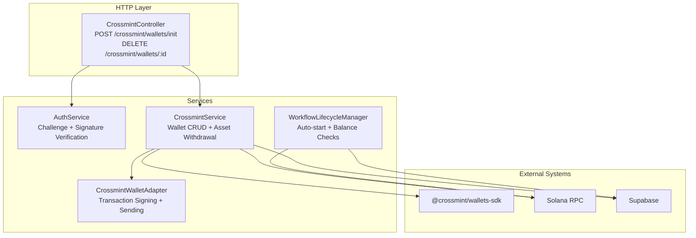
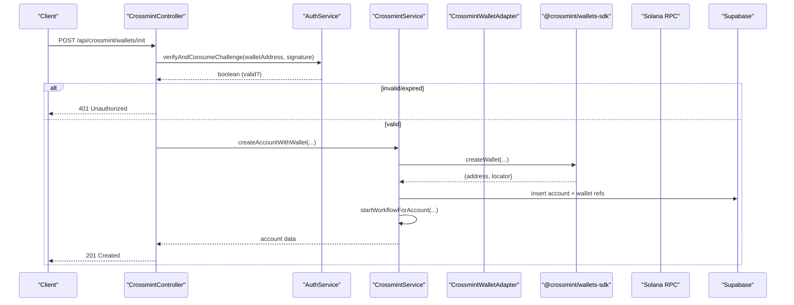
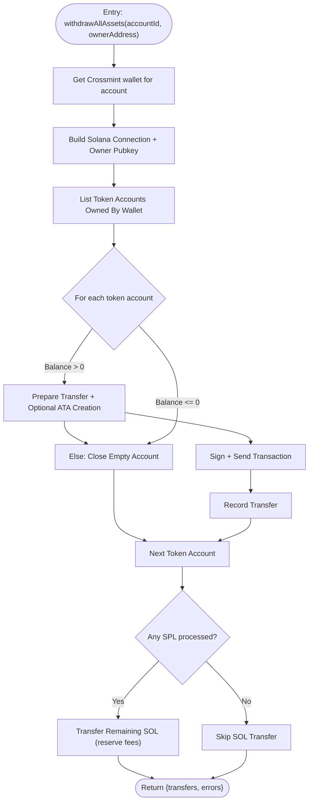
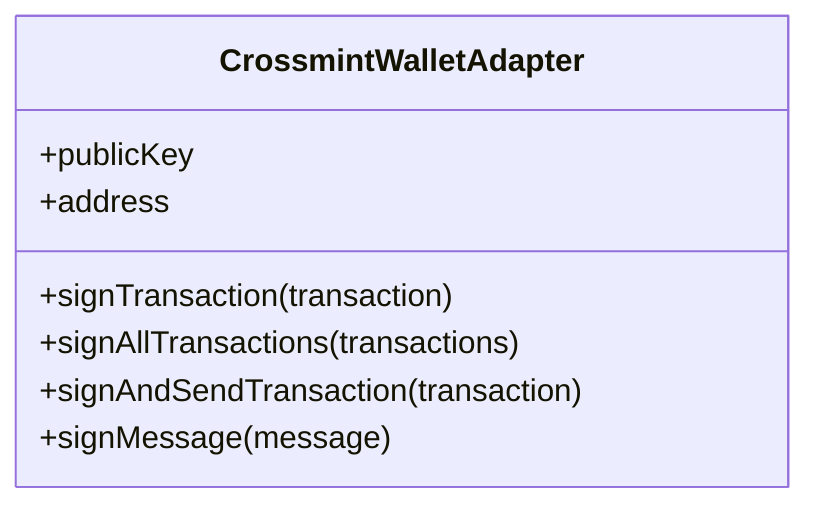
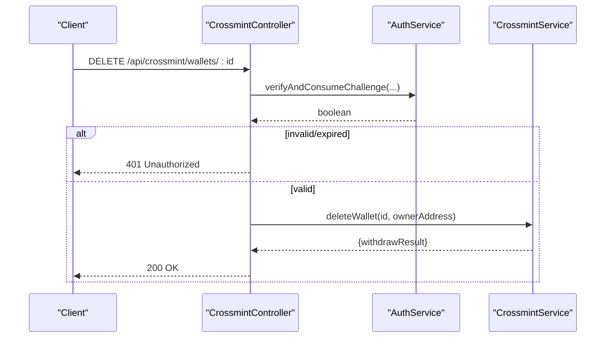
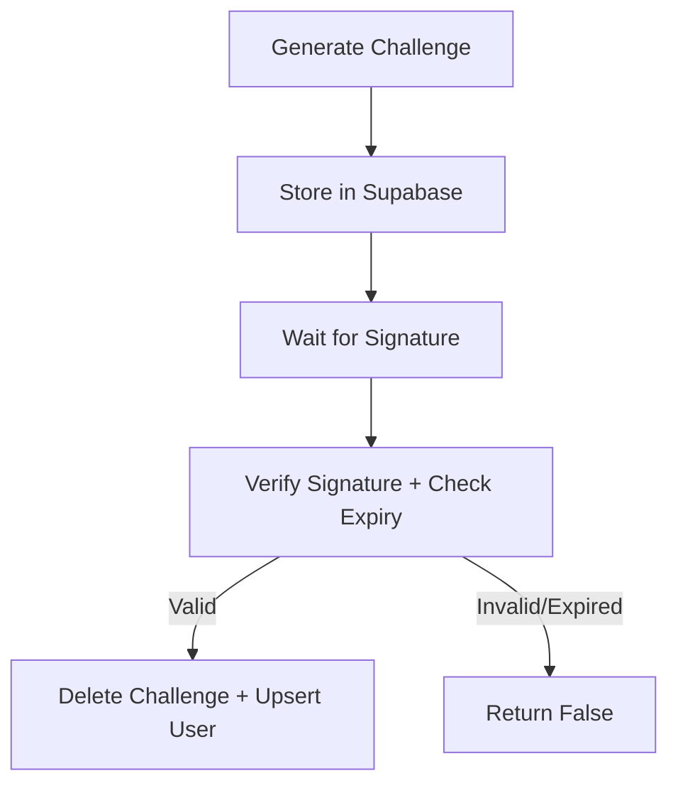
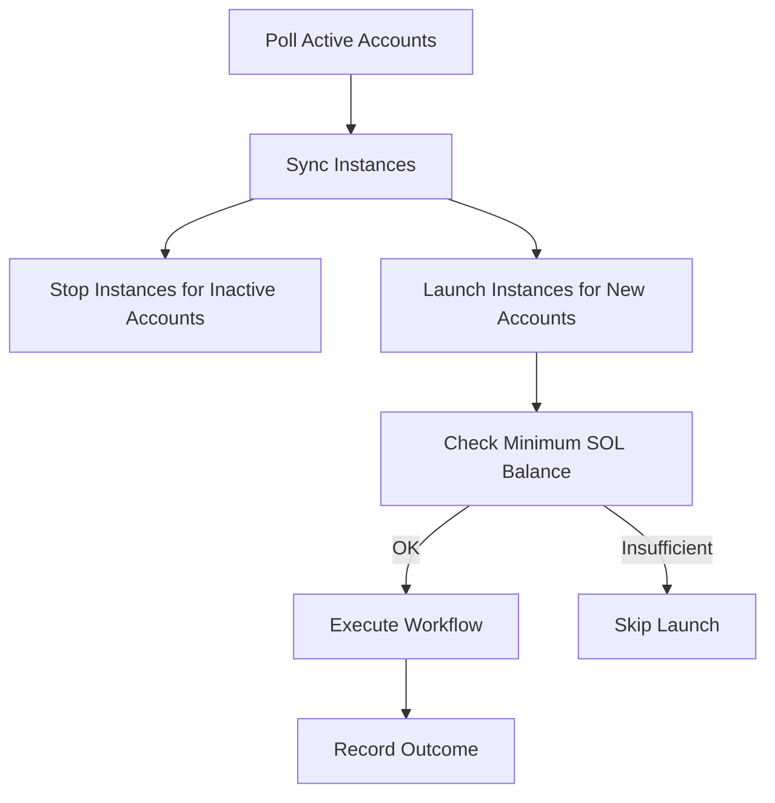
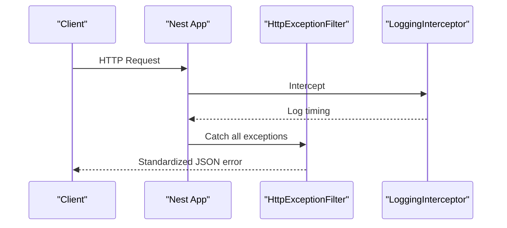
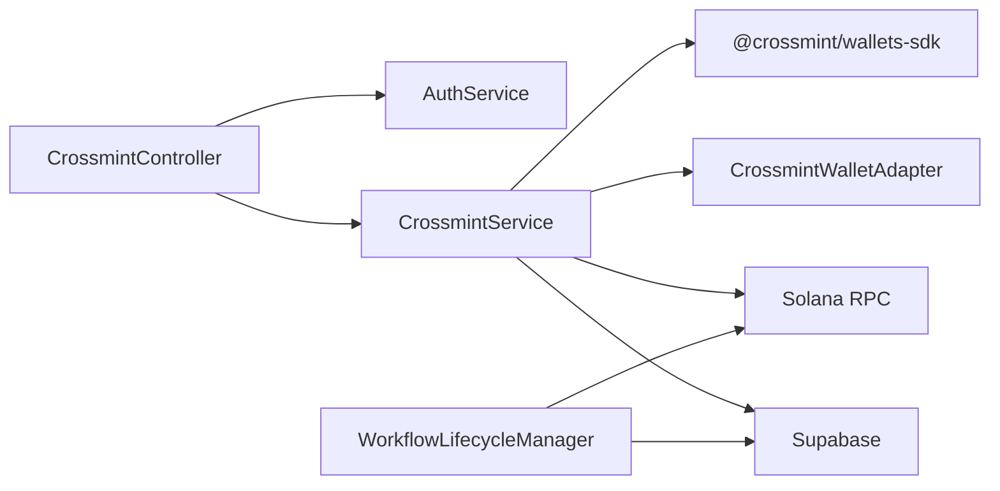

# Error Handling and Troubleshooting

<cite>
**Referenced Files in This Document**
- [main.ts](file://src/main.ts)
- [http-exception.filter.ts](file://src/common/filters/http-exception.filter.ts)
- [logging.interceptor.ts](file://src/common/interceptors/logging.interceptor.ts)
- [configuration.ts](file://src/config/configuration.ts)
- [crossmint.module.ts](file://src/crossmint/crossmint.module.ts)
- [crossmint.controller.ts](file://src/crossmint/crossmint.controller.ts)
- [crossmint.service.ts](file://src/crossmint/crossmint.service.ts)
- [crossmint-wallet.adapter.ts](file://src/crossmint/crossmint-wallet.adapter.ts)
- [auth.service.ts](file://src/auth/auth.service.ts)
- [workflow-lifecycle.service.ts](file://src/workflows/workflow-lifecycle.service.ts)
- [agent-kit.service.ts](file://src/web3/services/agent-kit.service.ts)
- [helius-webhook.node.ts](file://src/web3/nodes/helius-webhook.node.ts)
- [limit-order.node.ts](file://src/web3/nodes/limit-order.node.ts)
- [test-crossmint.ts](file://scripts/test-crossmint.ts)
- [full_system_test.ts](file://scripts/full_system_test.ts)
- [verify_api.ts](file://scripts/verify_api.ts)
</cite>

## Table of Contents
1. [Introduction](#introduction)
2. [Project Structure](#project-structure)
3. [Core Components](#core-components)
4. [Architecture Overview](#architecture-overview)
5. [Detailed Component Analysis](#detailed-component-analysis)
6. [Dependency Analysis](#dependency-analysis)
7. [Performance Considerations](#performance-considerations)
8. [Troubleshooting Guide](#troubleshooting-guide)
9. [Conclusion](#conclusion)
10. [Appendices](#appendices)

## Introduction
This document provides comprehensive guidance for error handling and troubleshooting in the Crossmint integration. It covers common error scenarios such as wallet creation failures, asset operation errors, and API communication issues. It explains error categorization, exception handling patterns, logging strategies, and operational procedures for authentication failures, network connectivity issues, and Crossmint service outages. It also documents recovery mechanisms, retry strategies, fallback procedures, diagnostic tools, debugging techniques, monitoring approaches, and incident response practices tailored to production environments.

## Project Structure
The Crossmint integration spans several modules and services:
- Crossmint module: Provides wallet initialization, deletion, and asset withdrawal operations.
- Authentication module: Handles challenge generation, signature verification, and replay protection.
- Workflow lifecycle: Manages automatic workflow startup and monitoring for accounts with sufficient balances.
- Web3 services and nodes: Implement rate limiting and retry strategies for external APIs.
- Global middleware: Centralized exception filtering and request logging.

**Diagram sources**
- [crossmint.controller.ts:16-66](file://src/crossmint/crossmint.controller.ts#L16-L66)
- [auth.service.ts:57-91](file://src/auth/auth.service.ts#L57-L91)
- [crossmint.service.ts:43-75](file://src/crossmint/crossmint.service.ts#L43-L75)
- [crossmint-wallet.adapter.ts:16-88](file://src/crossmint/crossmint-wallet.adapter.ts#L16-L88)
- [workflow-lifecycle.service.ts:11-343](file://src/workflows/workflow-lifecycle.service.ts#L11-L343)

**Section sources**
- [crossmint.module.ts:1-16](file://src/crossmint/crossmint.module.ts#L1-L16)
- [crossmint.controller.ts:16-66](file://src/crossmint/crossmint.controller.ts#L16-L66)
- [auth.service.ts:27-91](file://src/auth/auth.service.ts#L27-L91)
- [crossmint.service.ts:43-75](file://src/crossmint/crossmint.service.ts#L43-L75)
- [workflow-lifecycle.service.ts:11-343](file://src/workflows/workflow-lifecycle.service.ts#L11-L343)

## Core Components
- CrossmintController: Enforces signature-based authentication for wallet initialization and deletion, delegates to CrossmintService.
- CrossmintService: Orchestrates Crossmint SDK usage, wallet retrieval/creation, asset withdrawal, and account lifecycle actions.
- CrossmintWalletAdapter: Wraps Crossmint-managed wallet to support signing and sending transactions via the SDK.
- AuthService: Generates and verifies challenges, consumes challenges upon successful verification, and maintains replay protection.
- WorkflowLifecycleManager: Monitors active accounts, starts workflows when conditions are met, and records execution outcomes.
- Global Filters and Interceptors: Standardize error responses and log request durations.

**Section sources**
- [crossmint.controller.ts:16-66](file://src/crossmint/crossmint.controller.ts#L16-L66)
- [crossmint.service.ts:43-403](file://src/crossmint/crossmint.service.ts#L43-L403)
- [crossmint-wallet.adapter.ts:16-88](file://src/crossmint/crossmint-wallet.adapter.ts#L16-L88)
- [auth.service.ts:27-165](file://src/auth/auth.service.ts#L27-L165)
- [workflow-lifecycle.service.ts:11-343](file://src/workflows/workflow-lifecycle.service.ts#L11-L343)
- [http-exception.filter.ts:1-40](file://src/common/filters/http-exception.filter.ts#L1-L40)
- [logging.interceptor.ts:1-20](file://src/common/interceptors/logging.interceptor.ts#L1-L20)

## Architecture Overview
The integration follows a layered pattern:
- Controllers handle HTTP requests and enforce authentication.
- Services encapsulate business logic and external integrations.
- Adapters normalize third-party SDKs into a unified interface.
- Global middleware ensures consistent error handling and logging.

**Diagram sources**
- [crossmint.controller.ts:30-42](file://src/crossmint/crossmint.controller.ts#L30-L42)
- [auth.service.ts:57-91](file://src/auth/auth.service.ts#L57-L91)
- [crossmint.service.ts:163-204](file://src/crossmint/crossmint.service.ts#L163-L204)

## Detailed Component Analysis

### CrossmintService: Wallet Creation, Retrieval, Asset Withdrawal, and Deletion
- Initialization: Validates configuration and initializes the Crossmint SDK; logs environment mode.
- Wallet creation: Creates a Crossmint-managed wallet under a composed owner identifier; logs and propagates errors as internal server exceptions.
- Wallet retrieval: Fetches wallet by locator/address, wraps it into an adapter; logs and propagates errors as internal server exceptions.
- Account creation with wallet: Creates a Crossmint wallet and inserts account metadata; triggers workflow start asynchronously.
- Asset withdrawal: Iterates token accounts, prepares transfers, optionally creates owner ATA, closes empty accounts, and transfers residual SOL after accounting for fees.
- Deletion: Verifies ownership, stops workflows, withdraws all assets, rejects closure if withdrawals contain errors, and performs soft deletion.

**Diagram sources**
- [crossmint.service.ts:209-344](file://src/crossmint/crossmint.service.ts#L209-L344)

**Section sources**
- [crossmint.service.ts:56-75](file://src/crossmint/crossmint.service.ts#L56-L75)
- [crossmint.service.ts:84-114](file://src/crossmint/crossmint.service.ts#L84-L114)
- [crossmint.service.ts:122-154](file://src/crossmint/crossmint.service.ts#L122-L154)
- [crossmint.service.ts:163-204](file://src/crossmint/crossmint.service.ts#L163-L204)
- [crossmint.service.ts:209-344](file://src/crossmint/crossmint.service.ts#L209-L344)
- [crossmint.service.ts:349-401](file://src/crossmint/crossmint.service.ts#L349-L401)

### CrossmintWalletAdapter: Transaction Signing and Sending
- Provides a standard interface for signing and sending transactions against a Crossmint-managed wallet.
- Supports single and batch transaction signing.
- Throws a clear error for unsupported message signing.

**Diagram sources**
- [crossmint-wallet.adapter.ts:16-88](file://src/crossmint/crossmint-wallet.adapter.ts#L16-L88)

**Section sources**
- [crossmint-wallet.adapter.ts:35-76](file://src/crossmint/crossmint-wallet.adapter.ts#L35-L76)

### CrossmintController: Authentication-Guarded Endpoints
- POST /api/crossmint/wallets/init validates signatures via AuthService before creating an account with a Crossmint wallet.
- DELETE /api/crossmint/wallets/:id validates signatures and deletes/closes the account after withdrawing assets.

**Diagram sources**
- [crossmint.controller.ts:52-65](file://src/crossmint/crossmint.controller.ts#L52-L65)
- [auth.service.ts:57-91](file://src/auth/auth.service.ts#L57-L91)
- [crossmint.service.ts:349-401](file://src/crossmint/crossmint.service.ts#L349-L401)

**Section sources**
- [crossmint.controller.ts:30-42](file://src/crossmint/crossmint.controller.ts#L30-L42)
- [crossmint.controller.ts:52-65](file://src/crossmint/crossmint.controller.ts#L52-L65)

### AuthService: Challenge Generation and Signature Verification
- Generates a challenge with nonce and expiry, stores it in Supabase, and cleans up expired entries periodically.
- Verifies signatures using ed25519; consumes the challenge upon success to prevent replay.

**Diagram sources**
- [auth.service.ts:27-51](file://src/auth/auth.service.ts#L27-L51)
- [auth.service.ts:57-91](file://src/auth/auth.service.ts#L57-L91)
- [auth.service.ts:147-156](file://src/auth/auth.service.ts#L147-L156)

**Section sources**
- [auth.service.ts:27-91](file://src/auth/auth.service.ts#L27-L91)
- [auth.service.ts:116-132](file://src/auth/auth.service.ts#L116-L132)
- [auth.service.ts:147-156](file://src/auth/auth.service.ts#L147-L156)

### WorkflowLifecycleManager: Auto-Start and Monitoring
- Polls active accounts and manages workflow instances.
- Starts workflows only if the Crossmint wallet has sufficient SOL balance.
- Records execution results and logs errors.

**Diagram sources**
- [workflow-lifecycle.service.ts:48-117](file://src/workflows/workflow-lifecycle.service.ts#L48-L117)
- [workflow-lifecycle.service.ts:216-229](file://src/workflows/workflow-lifecycle.service.ts#L216-L229)
- [workflow-lifecycle.service.ts:238-342](file://src/workflows/workflow-lifecycle.service.ts#L238-L342)

**Section sources**
- [workflow-lifecycle.service.ts:48-117](file://src/workflows/workflow-lifecycle.service.ts#L48-L117)
- [workflow-lifecycle.service.ts:216-229](file://src/workflows/workflow-lifecycle.service.ts#L216-L229)
- [workflow-lifecycle.service.ts:238-342](file://src/workflows/workflow-lifecycle.service.ts#L238-L342)

### Global Middleware: Exception Filtering and Logging
- HttpExceptionFilter: Converts thrown exceptions into standardized JSON responses with consistent error fields and timestamps.
- LoggingInterceptor: Logs request method, URL, and response time.

**Diagram sources**
- [http-exception.filter.ts:1-40](file://src/common/filters/http-exception.filter.ts#L1-L40)
- [logging.interceptor.ts:1-20](file://src/common/interceptors/logging.interceptor.ts#L1-L20)
- [main.ts:25-38](file://src/main.ts#L25-L38)

**Section sources**
- [http-exception.filter.ts:1-40](file://src/common/filters/http-exception.filter.ts#L1-L40)
- [logging.interceptor.ts:1-20](file://src/common/interceptors/logging.interceptor.ts#L1-L20)
- [main.ts:25-38](file://src/main.ts#L25-L38)

## Dependency Analysis
- CrossmintController depends on AuthService for authentication and CrossmintService for business operations.
- CrossmintService depends on Supabase for persistence, Crossmint SDK for wallet operations, and Solana RPC for token/account queries.
- WorkflowLifecycleManager depends on Supabase and Solana RPC for synchronization and balance checks.
- Global middleware applies across all routes for consistent error handling and logging.

**Diagram sources**
- [crossmint.controller.ts:18-21](file://src/crossmint/crossmint.controller.ts#L18-L21)
- [crossmint.service.ts:32-34](file://src/crossmint/crossmint.service.ts#L32-L34)
- [workflow-lifecycle.service.ts:19-23](file://src/workflows/workflow-lifecycle.service.ts#L19-L23)

**Section sources**
- [crossmint.controller.ts:18-21](file://src/crossmint/crossmint.controller.ts#L18-L21)
- [crossmint.service.ts:32-34](file://src/crossmint/crossmint.service.ts#L32-L34)
- [workflow-lifecycle.service.ts:19-23](file://src/workflows/workflow-lifecycle.service.ts#L19-L23)

## Performance Considerations
- Retry and Rate Limiting: External API calls and node operations implement exponential backoff with jitter and concurrency limits to avoid throttling and improve resilience.
- Request Logging: Interceptor measures request duration for quick performance diagnostics.
- Balance Checks: WorkflowLifecycleManager avoids launching workflows on low-balance wallets to reduce wasted compute and failed transactions.

**Section sources**
- [agent-kit.service.ts:26-45](file://src/web3/services/agent-kit.service.ts#L26-L45)
- [helius-webhook.node.ts:24-43](file://src/web3/nodes/helius-webhook.node.ts#L24-L43)
- [limit-order.node.ts:47-72](file://src/web3/nodes/limit-order.node.ts#L47-L72)
- [logging.interceptor.ts:7-18](file://src/common/interceptors/logging.interceptor.ts#L7-L18)
- [workflow-lifecycle.service.ts:216-229](file://src/workflows/workflow-lifecycle.service.ts#L216-L229)

## Troubleshooting Guide

### Error Categorization and Exception Handling Patterns
- Authentication failures (401 Unauthorized):
  - Occur when signature verification fails or challenge is expired/consumed.
  - Controller throws unauthorized exceptions; filter returns standardized error payload.
- Authorization failures (403 Forbidden):
  - Occur when ownership verification fails during deletion.
- Resource not found (404 Not Found):
  - Occurs when account data is missing.
- Bad requests (400 Bad Request):
  - Occurs when asset withdrawal errors prevent account deletion.
- Internal server errors (500 Internal Server Error):
  - Occurs on SDK failures, database errors, or unexpected runtime issues.

**Section sources**
- [crossmint.controller.ts:36-38](file://src/crossmint/crossmint.controller.ts#L36-L38)
- [crossmint.controller.ts:58-60](file://src/crossmint/crossmint.controller.ts#L58-L60)
- [crossmint.service.ts:129-131](file://src/crossmint/crossmint.service.ts#L129-L131)
- [crossmint.service.ts:135-137](file://src/crossmint/crossmint.service.ts#L135-L137)
- [crossmint.service.ts:382-386](file://src/crossmint/crossmint.service.ts#L382-L386)
- [http-exception.filter.ts:14-26](file://src/common/filters/http-exception.filter.ts#L14-L26)

### Logging Strategies
- Service-level logs: Detailed messages for wallet creation, retrieval, withdrawal, and deletion operations.
- Global exception filter: Standardized error payloads with code, message, and timestamp.
- Request logging: Interceptor logs method, URL, and response time for quick diagnosis.

**Section sources**
- [crossmint.service.ts:95-113](file://src/crossmint/crossmint.service.ts#L95-L113)
- [crossmint.service.ts:139-153](file://src/crossmint/crossmint.service.ts#L139-L153)
- [crossmint.service.ts:193-195](file://src/crossmint/crossmint.service.ts#L193-L195)
- [crossmint.service.ts:381-382](file://src/crossmint/crossmint.service.ts#L381-L382)
- [http-exception.filter.ts:28-37](file://src/common/filters/http-exception.filter.ts#L28-L37)
- [logging.interceptor.ts:12-17](file://src/common/interceptors/logging.interceptor.ts#L12-L17)

### Diagnostics and Debugging Techniques
- Use the provided scripts to validate SDK connectivity and end-to-end flows:
  - Crossmint SDK connectivity test script.
  - Full system test script covering authentication, initialization, replay attack prevention, and deletion.
  - API verification script for wallet initialization and deletion flows.
- Inspect Supabase tables for stored challenges and account records to confirm state transitions.
- Monitor request logs and standardized error responses to pinpoint failure stages.

**Section sources**
- [test-crossmint.ts:34-78](file://scripts/test-crossmint.ts#L34-L78)
- [full_system_test.ts:74-84](file://scripts/full_system_test.ts#L74-L84)
- [full_system_test.ts:88-102](file://scripts/full_system_test.ts#L88-L102)
- [full_system_test.ts:169-187](file://scripts/full_system_test.ts#L169-L187)
- [verify_api.ts:38-53](file://scripts/verify_api.ts#L38-L53)

### Common Error Scenarios and Resolution Strategies

- Wallet creation failures:
  - Symptoms: Internal server error during wallet creation; logs indicate SDK failure.
  - Causes: Missing or invalid Crossmint configuration, SDK outage, or invalid signer secret.
  - Resolution: Verify environment variables; ensure SDK initialization succeeds; retry after confirming service availability.

- Asset operation errors:
  - Symptoms: Partial or complete failure during asset withdrawal; errors array indicates specific failures per token account.
  - Causes: RPC unavailability, insufficient fees, or account state inconsistencies.
  - Resolution: Re-run withdrawal after ensuring sufficient SOL balance; inspect individual token account failures and retry selectively.

- API communication issues:
  - Symptoms: 500 errors, timeouts, or inconsistent responses.
  - Causes: Network instability, rate limiting, or downstream service outages.
  - Resolution: Implement retries with exponential backoff; monitor request logs and error payloads; verify external service health.

- Authentication failures:
  - Symptoms: 401 Unauthorized on initialization or deletion.
  - Causes: Invalid signature, expired challenge, or replay attack.
  - Resolution: Regenerate challenge; ensure signature is produced by the correct keypair; prevent reuse of consumed challenges.

- Network connectivity issues:
  - Symptoms: RPC timeouts or balance checks failing.
  - Causes: Unstable RPC endpoints or high latency.
  - Resolution: Switch to a reliable RPC provider; increase timeouts; implement retry logic.

- Crossmint service outages:
  - Symptoms: SDK calls fail or return errors.
  - Causes: Outage or maintenance window.
  - Resolution: Retry with backoff; monitor service status; degrade gracefully where possible.

**Section sources**
- [crossmint.service.ts:56-75](file://src/crossmint/crossmint.service.ts#L56-L75)
- [crossmint.service.ts:108-113](file://src/crossmint/crossmint.service.ts#L108-L113)
- [crossmint.service.ts:307-310](file://src/crossmint/crossmint.service.ts#L307-L310)
- [crossmint.service.ts:339-341](file://src/crossmint/crossmint.service.ts#L339-L341)
- [crossmint.controller.ts:36-38](file://src/crossmint/crossmint.controller.ts#L36-L38)
- [auth.service.ts:66-76](file://src/auth/auth.service.ts#L66-L76)
- [full_system_test.ts:88-102](file://scripts/full_system_test.ts#L88-L102)
- [full_system_test.ts:169-187](file://scripts/full_system_test.ts#L169-L187)

### Error Recovery Mechanisms and Retry Strategies
- Exponential backoff with jitter: Implemented in Web3 services and nodes to reduce thundering herd effects and improve success rates.
- Concurrency limiter: Limits concurrent external API calls to respect rate limits.
- Idempotent operations: Prefer idempotent designs for retries; ensure re-running does not cause unintended side effects.

**Section sources**
- [agent-kit.service.ts:26-45](file://src/web3/services/agent-kit.service.ts#L26-L45)
- [helius-webhook.node.ts:24-43](file://src/web3/nodes/helius-webhook.node.ts#L24-L43)
- [limit-order.node.ts:47-72](file://src/web3/nodes/limit-order.node.ts#L47-L72)

### Fallback Procedures
- Graceful degradation: If asset withdrawal partially fails, prevent account deletion until remediation completes.
- Balance gating: Avoid launching workflows on low-balance wallets to prevent repeated failures.
- Circuit breaker patterns: Temporarily suspend operations when downstream services are unhealthy.

**Section sources**
- [crossmint.service.ts:380-386](file://src/crossmint/crossmint.service.ts#L380-L386)
- [workflow-lifecycle.service.ts:246-255](file://src/workflows/workflow-lifecycle.service.ts#L246-L255)

### Monitoring Approaches
- Centralized error reporting: Use the global exception filter to produce structured error responses for dashboards and alerts.
- Request telemetry: Use the logging interceptor to track response times and detect performance regressions.
- Database observability: Monitor Supabase tables for anomalies in challenge storage, account creation, and workflow execution records.
- External service health: Track RPC availability and SDK response latencies.

**Section sources**
- [http-exception.filter.ts:28-37](file://src/common/filters/http-exception.filter.ts#L28-L37)
- [logging.interceptor.ts:12-17](file://src/common/interceptors/logging.interceptor.ts#L12-L17)
- [workflow-lifecycle.service.ts:272-275](file://src/workflows/workflow-lifecycle.service.ts#L272-L275)

### Error Reporting and Incident Response
- Stakeholder reporting: Standardized error payloads include a machine-readable code and human-friendly message with a timestamp.
- Automated alerting: Surface critical errors (e.g., repeated 500s, authentication spikes) to monitoring systems.
- Runbooks: Document remediation steps for common incidents (authentication failures, asset withdrawal errors, SDK outages).

**Section sources**
- [http-exception.filter.ts:30-37](file://src/common/filters/http-exception.filter.ts#L30-L37)

## Conclusion
The Crossmint integration employs robust error handling patterns with centralized exception filtering, standardized logging, and resilient retry mechanisms. Authentication is enforced via challenge/signature verification, while asset operations are designed to be safe and recoverable. Operational procedures leverage structured logging, database observability, and circuit-breaking strategies to maintain system stability during outages and partial failures.

## Appendices

### Configuration Keys for Crossmint Integration
- crossmint.serverApiKey: Server-side API key for Crossmint SDK.
- crossmint.signerSecret: Secret used for server-signed operations.
- crossmint.environment: Crossmint environment mode (default: production).
- solana.rpcUrl: Solana RPC endpoint used for token/account queries and fee calculations.

**Section sources**
- [configuration.ts:27-31](file://src/config/configuration.ts#L27-L31)
- [configuration.ts:18-21](file://src/config/configuration.ts#L18-L21)