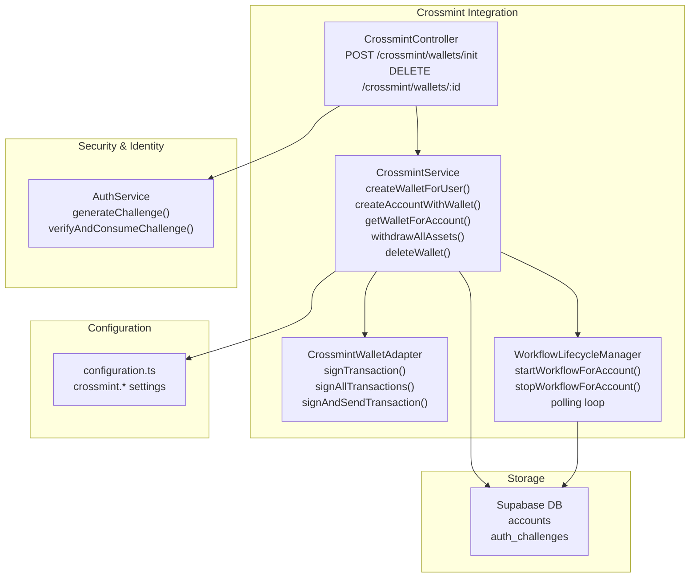
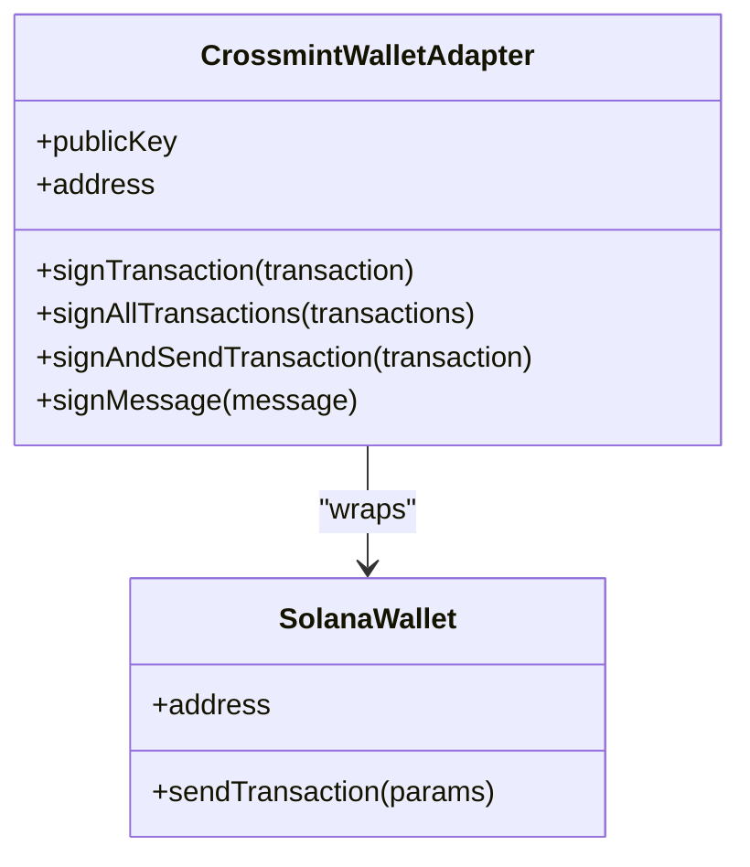
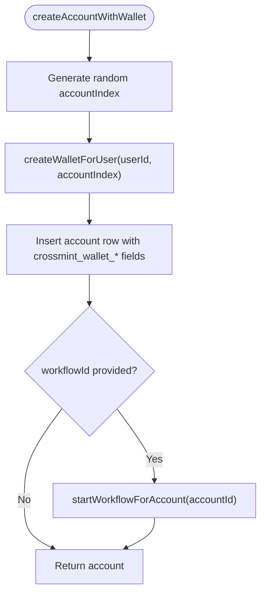
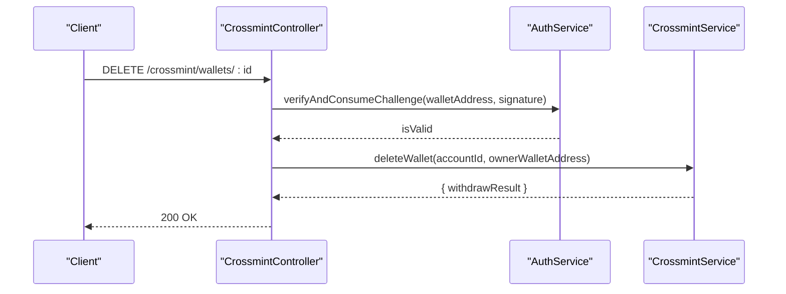
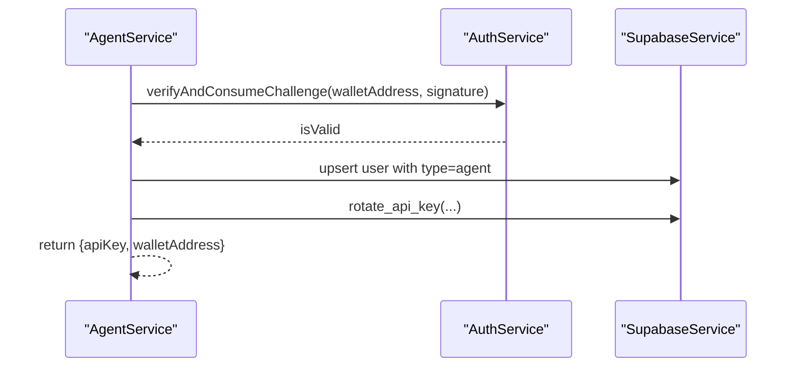
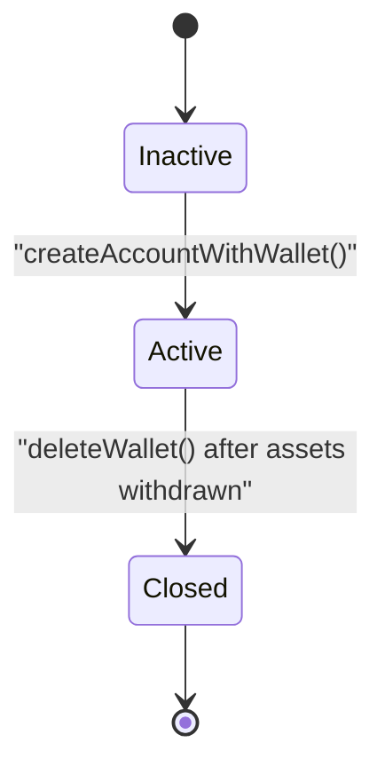
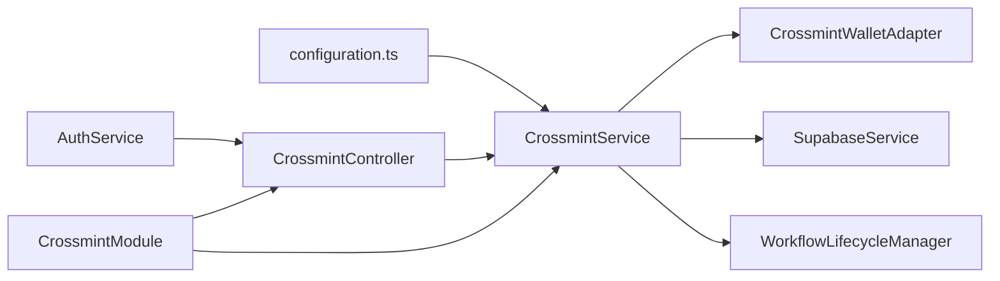

# Wallet Lifecycle Management

<cite>
**Referenced Files in This Document**
- [init-wallet.dto.ts](file://src/crossmint/dto/init-wallet.dto.ts)
- [signed-request.dto.ts](file://src/crossmint/dto/signed-request.dto.ts)
- [crossmint-wallet.adapter.ts](file://src/crossmint/crossmint-wallet.adapter.ts)
- [crossmint.service.ts](file://src/crossmint/crossmint.service.ts)
- [crossmint.controller.ts](file://src/crossmint/crossmint.controller.ts)
- [crossmint.module.ts](file://src/crossmint/crossmint.module.ts)
- [configuration.ts](file://src/config/configuration.ts)
- [workflow-lifecycle.service.ts](file://src/workflows/workflow-lifecycle.service.ts)
- [auth.service.ts](file://src/auth/auth.service.ts)
- [agent.service.ts](file://src/agent/agent.service.ts)
- [20260118210000_remove_legacy_wallet_fields.sql](file://supabase/migrations/20260118210000_remove_legacy_wallet_fields.sql)
- [20260128140000_add_auth_challenges.sql](file://supabase/migrations/20260128140000_add_auth_challenges.sql)
- [20260308000000_add_canvases_and_account_status.sql](file://supabase/migrations/20260308000000_add_canvases_and_account_status.sql)
</cite>

## Table of Contents
1. [Introduction](#introduction)
2. [Project Structure](#project-structure)
3. [Core Components](#core-components)
4. [Architecture Overview](#architecture-overview)
5. [Detailed Component Analysis](#detailed-component-analysis)
6. [Dependency Analysis](#dependency-analysis)
7. [Performance Considerations](#performance-considerations)
8. [Troubleshooting Guide](#troubleshooting-guide)
9. [Conclusion](#conclusion)

## Introduction
This document explains the complete wallet lifecycle management for Crossmint integration within the backend. It covers wallet creation from initialization through active operation, including DTO validation, the Crossmint wallet adapter abstraction, service-layer operations, and integration with the agent framework for programmatic wallet management. It also documents wallet state transitions, account provisioning workflows, security requirements, validation rules, monitoring, status tracking, lifecycle events, and the adapter pattern that maintains loose coupling with the Crossmint SDK.

## Project Structure
The Crossmint wallet lifecycle spans several modules:
- Crossmint module: exposes controller and service for wallet initialization and deletion
- DTOs: define request validation for initialization and generic signed requests
- Adapter: wraps Crossmint wallets to conform to a standard Solana wallet interface
- Service: orchestrates wallet creation, retrieval, asset withdrawal, and deletion
- Auth: handles challenge generation and signature verification
- Workflows: manages lifecycle polling and workflow execution for active accounts
- Database migrations: define schema for wallet storage and account status

**Diagram sources**
- [crossmint.controller.ts:1-67](file://src/crossmint/crossmint.controller.ts#L1-L67)
- [crossmint.service.ts:1-403](file://src/crossmint/crossmint.service.ts#L1-L403)
- [crossmint-wallet.adapter.ts:1-89](file://src/crossmint/crossmint-wallet.adapter.ts#L1-L89)
- [workflow-lifecycle.service.ts:1-343](file://src/workflows/workflow-lifecycle.service.ts#L1-L343)
- [auth.service.ts:1-165](file://src/auth/auth.service.ts#L1-L165)
- [configuration.ts:1-45](file://src/config/configuration.ts#L1-L45)

**Section sources**
- [crossmint.module.ts:1-16](file://src/crossmint/crossmint.module.ts#L1-L16)
- [crossmint.controller.ts:1-67](file://src/crossmint/crossmint.controller.ts#L1-L67)
- [crossmint.service.ts:1-403](file://src/crossmint/crossmint.service.ts#L1-L403)
- [crossmint-wallet.adapter.ts:1-89](file://src/crossmint/crossmint-wallet.adapter.ts#L1-L89)
- [workflow-lifecycle.service.ts:1-343](file://src/workflows/workflow-lifecycle.service.ts#L1-L343)
- [auth.service.ts:1-165](file://src/auth/auth.service.ts#L1-L165)
- [configuration.ts:1-45](file://src/config/configuration.ts#L1-L45)

## Core Components
- Initialization DTO: validates account creation request payload and enforces required fields
- Signed Request DTO: validates signature-based requests for sensitive operations
- Crossmint Wallet Adapter: adapts Crossmint SDK wallets to a standard Solana wallet interface
- Crossmint Service: creates wallets, provisions accounts, retrieves wallets, withdraws assets, and deletes accounts
- Controller: exposes endpoints for initialization and deletion with signature verification
- Workflow Lifecycle Manager: monitors active accounts and starts/stops workflow executions
- Auth Service: generates and verifies cryptographic challenges for signature-based authentication
- Configuration: loads Crossmint credentials and environment settings

**Section sources**
- [init-wallet.dto.ts:1-22](file://src/crossmint/dto/init-wallet.dto.ts#L1-L22)
- [signed-request.dto.ts:1-21](file://src/crossmint/dto/signed-request.dto.ts#L1-L21)
- [crossmint-wallet.adapter.ts:1-89](file://src/crossmint/crossmint-wallet.adapter.ts#L1-L89)
- [crossmint.service.ts:1-403](file://src/crossmint/crossmint.service.ts#L1-L403)
- [crossmint.controller.ts:1-67](file://src/crossmint/crossmint.controller.ts#L1-L67)
- [workflow-lifecycle.service.ts:1-343](file://src/workflows/workflow-lifecycle.service.ts#L1-L343)
- [auth.service.ts:1-165](file://src/auth/auth.service.ts#L1-L165)
- [configuration.ts:1-45](file://src/config/configuration.ts#L1-L45)

## Architecture Overview
The system follows a layered architecture:
- Presentation: CrossmintController handles HTTP requests and delegates to CrossmintService
- Application: CrossmintService coordinates Crossmint SDK, database operations, and workflow lifecycle
- Infrastructure: CrossmintWalletAdapter bridges Crossmint SDK to a standard wallet interface
- Security: AuthService manages challenge generation and signature verification
- Persistence: Supabase stores account metadata, wallet locators, and auth challenges

```mermaid
sequenceDiagram
participant Client as "Client"
participant Controller as "CrossmintController"
participant Auth as "AuthService"
participant Service as "CrossmintService"
participant DB as "SupabaseService"
participant CM as "Crossmint SDK"
participant WF as "WorkflowLifecycleManager"
Client->>Controller : POST /crossmint/wallets/init
Controller->>Auth : verifyAndConsumeChallenge(walletAddress, signature)
Auth-->>Controller : isValid
Controller->>Service : createAccountWithWallet(ownerWalletAddress, accountName, workflowId?)
Service->>CM : createWallet({chain : solana, signer})
CM-->>Service : {address, locator}
Service->>DB : insert account with crossmint_wallet_* fields
DB-->>Service : account
Service->>WF : startWorkflowForAccount(accountId)
Service-->>Controller : account
Controller-->>Client : 201 Created
```

**Diagram sources**
- [crossmint.controller.ts:23-42](file://src/crossmint/crossmint.controller.ts#L23-L42)
- [auth.service.ts:57-91](file://src/auth/auth.service.ts#L57-L91)
- [crossmint.service.ts:163-204](file://src/crossmint/crossmint.service.ts#L163-L204)
- [workflow-lifecycle.service.ts:160-198](file://src/workflows/workflow-lifecycle.service.ts#L160-L198)

## Detailed Component Analysis

### DTO Validation: InitWalletDto and SignedRequestDto
- InitWalletDto extends SignedRequestDto and adds accountName and optional workflowId
- Validation ensures non-empty strings for accountName and optional workflowId
- Used by the controller to validate initialization requests

**Section sources**
- [init-wallet.dto.ts:5-21](file://src/crossmint/dto/init-wallet.dto.ts#L5-L21)
- [signed-request.dto.ts:4-20](file://src/crossmint/dto/signed-request.dto.ts#L4-L20)

### Crossmint Wallet Adapter Abstraction
The adapter wraps Crossmint’s SolanaWallet to provide:
- Standardized address and publicKey access
- Transaction signing and batch signing
- Transaction signing-and-sending with signature return
- Message signing intentionally unsupported for Crossmint wallets

**Diagram sources**
- [crossmint-wallet.adapter.ts:16-88](file://src/crossmint/crossmint-wallet.adapter.ts#L16-L88)

**Section sources**
- [crossmint-wallet.adapter.ts:10-88](file://src/crossmint/crossmint-wallet.adapter.ts#L10-L88)

### Service Layer Operations: CrossmintService
Responsibilities:
- Initialize Crossmint SDK using server API key and signer secret from configuration
- Create Crossmint wallets per user/account index
- Retrieve wallets for accounts via locator/address
- Provision accounts with wallet metadata and optionally start workflows
- Withdraw all assets (SPL + SOL) back to owner wallet
- Delete/close accounts with ownership verification and asset withdrawal

Key behaviors:
- Wallet creation uses a randomized account index to avoid race conditions
- Retrieval supports fallback from locator to address if needed
- Asset withdrawal batches SPL token transfers and closes empty accounts
- Deletion enforces ownership, stops workflows, withdraws assets, and performs soft deletion

**Diagram sources**
- [crossmint.service.ts:163-204](file://src/crossmint/crossmint.service.ts#L163-L204)
- [workflow-lifecycle.service.ts:160-198](file://src/workflows/workflow-lifecycle.service.ts#L160-L198)

**Section sources**
- [crossmint.service.ts:56-75](file://src/crossmint/crossmint.service.ts#L56-L75)
- [crossmint.service.ts:84-114](file://src/crossmint/crossmint.service.ts#L84-L114)
- [crossmint.service.ts:122-154](file://src/crossmint/crossmint.service.ts#L122-L154)
- [crossmint.service.ts:163-204](file://src/crossmint/crossmint.service.ts#L163-L204)
- [crossmint.service.ts:209-344](file://src/crossmint/crossmint.service.ts#L209-L344)
- [crossmint.service.ts:349-401](file://src/crossmint/crossmint.service.ts#L349-L401)

### Controller Endpoints: Initialization and Deletion
- POST /crossmint/wallets/init
  - Verifies signature against stored challenge
  - Creates account with Crossmint wallet and optional workflow assignment
- DELETE /crossmint/wallets/:id
  - Verifies signature and ownership
  - Withdraws assets and soft-deletes account

**Diagram sources**
- [crossmint.controller.ts:44-65](file://src/crossmint/crossmint.controller.ts#L44-L65)
- [auth.service.ts:57-91](file://src/auth/auth.service.ts#L57-L91)
- [crossmint.service.ts:349-401](file://src/crossmint/crossmint.service.ts#L349-L401)

**Section sources**
- [crossmint.controller.ts:23-42](file://src/crossmint/crossmint.controller.ts#L23-L42)
- [crossmint.controller.ts:44-65](file://src/crossmint/crossmint.controller.ts#L44-L65)

### Agent Framework Integration
- AgentService registers agents via signature verification and rotates API keys atomically
- AgentService lists agent accounts filtered by active status
- CrossmintService integrates with WorkflowLifecycleManager to start workflows upon account creation

**Diagram sources**
- [agent.service.ts:15-59](file://src/agent/agent.service.ts#L15-L59)
- [auth.service.ts:57-91](file://src/auth/auth.service.ts#L57-L91)

**Section sources**
- [agent.service.ts:15-77](file://src/agent/agent.service.ts#L15-L77)
- [crossmint.service.ts:199-201](file://src/crossmint/crossmint.service.ts#L199-L201)

### Wallet State Transitions and Account Provisioning
- Inactive → Active: Account created with Crossmint wallet and optional workflow assignment
- Active → Closed: Soft deletion after successful asset withdrawal and workflow termination
- Status tracking is enforced via database migrations and lifecycle manager filtering

**Diagram sources**
- [crossmint.service.ts:163-204](file://src/crossmint/crossmint.service.ts#L163-L204)
- [crossmint.service.ts:349-401](file://src/crossmint/crossmint.service.ts#L349-L401)
- [20260308000000_add_canvases_and_account_status.sql:35-44](file://supabase/migrations/20260308000000_add_canvases_and_account_status.sql#L35-L44)

**Section sources**
- [20260308000000_add_canvases_and_account_status.sql:35-44](file://supabase/migrations/20260308000000_add_canvases_and_account_status.sql#L35-L44)
- [workflow-lifecycle.service.ts:89-90](file://src/workflows/workflow-lifecycle.service.ts#L89-L90)

### Security Requirements and Validation Rules
- Signature-based authentication: Challenges are generated and verified using ed25519 signatures
- Challenge storage: Nonce and expiration are persisted to prevent replay attacks
- Ownership verification: Deletion requires matching owner wallet address
- DTO validation: Strict field validation for initialization and signed requests
- Environment configuration: Crossmint server API key and signer secret are required for SDK initialization

**Section sources**
- [auth.service.ts:27-51](file://src/auth/auth.service.ts#L27-L51)
- [auth.service.ts:57-91](file://src/auth/auth.service.ts#L57-L91)
- [init-wallet.dto.ts:10-20](file://src/crossmint/dto/init-wallet.dto.ts#L10-L20)
- [signed-request.dto.ts:9-19](file://src/crossmint/dto/signed-request.dto.ts#L9-L19)
- [crossmint.service.ts:56-75](file://src/crossmint/crossmint.service.ts#L56-L75)

### Practical Examples
- Wallet creation request
  - Endpoint: POST /crossmint/wallets/init
  - Body: InitWalletDto (walletAddress, signature, accountName, optional workflowId)
  - Response: Account record with crossmint_wallet_locator and crossmint_wallet_address
- Response handling
  - Successful creation returns 201 with account data
  - Deletion returns 200 with withdrawal results
- Error scenarios
  - Invalid signature: 401 Unauthorized
  - Account not found: 404 Not Found
  - Ownership mismatch: 403 Forbidden
  - Insufficient funds for workflow: skipped launch with logs

**Section sources**
- [crossmint.controller.ts:30-42](file://src/crossmint/crossmint.controller.ts#L30-L42)
- [crossmint.controller.ts:52-65](file://src/crossmint/crossmint.controller.ts#L52-L65)
- [crossmint.service.ts:108-113](file://src/crossmint/crossmint.service.ts#L108-L113)
- [crossmint.service.ts:129-137](file://src/crossmint/crossmint.service.ts#L129-L137)
- [crossmint.service.ts:382-386](file://src/crossmint/crossmint.service.ts#L382-L386)

### Monitoring, Status Tracking, and Lifecycle Events
- Lifecycle polling: Periodic synchronization of active accounts and workflow instances
- Minimum SOL balance enforcement: Prevents launching workflows with insufficient funds
- Execution records: Creation of workflow execution entries with status transitions
- Graceful shutdown: Stops active instances and clears polling timers

**Section sources**
- [workflow-lifecycle.service.ts:25-55](file://src/workflows/workflow-lifecycle.service.ts#L25-L55)
- [workflow-lifecycle.service.ts:215-229](file://src/workflows/workflow-lifecycle.service.ts#L215-L229)
- [workflow-lifecycle.service.ts:258-275](file://src/workflows/workflow-lifecycle.service.ts#L258-L275)
- [workflow-lifecycle.service.ts:300-340](file://src/workflows/workflow-lifecycle.service.ts#L300-L340)

## Dependency Analysis
The Crossmint module depends on configuration, authentication, database, and workflow modules. The service depends on the adapter and lifecycle manager. The controller depends on the service and auth.

**Diagram sources**
- [crossmint.module.ts:9-14](file://src/crossmint/crossmint.module.ts#L9-L14)
- [crossmint.controller.ts:18-21](file://src/crossmint/crossmint.controller.ts#L18-L21)
- [crossmint.service.ts:49-54](file://src/crossmint/crossmint.service.ts#L49-L54)
- [configuration.ts:27-31](file://src/config/configuration.ts#L27-L31)

**Section sources**
- [crossmint.module.ts:1-16](file://src/crossmint/crossmint.module.ts#L1-L16)
- [crossmint.controller.ts:1-67](file://src/crossmint/crossmint.controller.ts#L1-L67)
- [crossmint.service.ts:1-54](file://src/crossmint/crossmint.service.ts#L1-L54)

## Performance Considerations
- Batch SPL transfers: Consolidate token transfers and account closures to minimize transaction count
- Minimum SOL reserve: Ensure sufficient SOL remains after withdrawals for future transactions
- Polling intervals: Controlled periodic synchronization avoids excessive load while keeping state consistent
- Asynchronous execution: Workflow launches occur asynchronously with cleanup and DB updates

## Troubleshooting Guide
Common issues and resolutions:
- Missing Crossmint credentials: SDK initialization logs warnings when server API key or signer secret are not configured
- Signature verification failures: Ensure challenge was generated and not expired; verify wallet address and signature match
- Account without wallet configured: Retrieval throws a bad request error; ensure account provisioning completed
- Asset withdrawal failures: Deletion blocks if any withdrawal fails; inspect returned errors and retry after resolving underlying issues
- Workflow not starting: Check minimum SOL balance and active status; verify workflow association and lifecycle manager health

**Section sources**
- [crossmint.service.ts:56-75](file://src/crossmint/crossmint.service.ts#L56-L75)
- [auth.service.ts:66-91](file://src/auth/auth.service.ts#L66-L91)
- [crossmint.service.ts:129-137](file://src/crossmint/crossmint.service.ts#L129-L137)
- [crossmint.service.ts:382-386](file://src/crossmint/crossmint.service.ts#L382-L386)
- [workflow-lifecycle.service.ts:215-229](file://src/workflows/workflow-lifecycle.service.ts#L215-L229)

## Conclusion
The Crossmint wallet lifecycle is managed through a secure, validated, and modular architecture. DTOs enforce request correctness, the adapter abstracts Crossmint SDK interactions, and the service orchestrates provisioning, monitoring, and lifecycle events. The integration with the agent framework enables programmatic wallet management, while robust security measures protect operations through signature-based authentication and controlled access patterns.