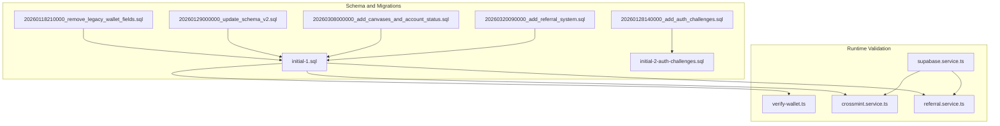
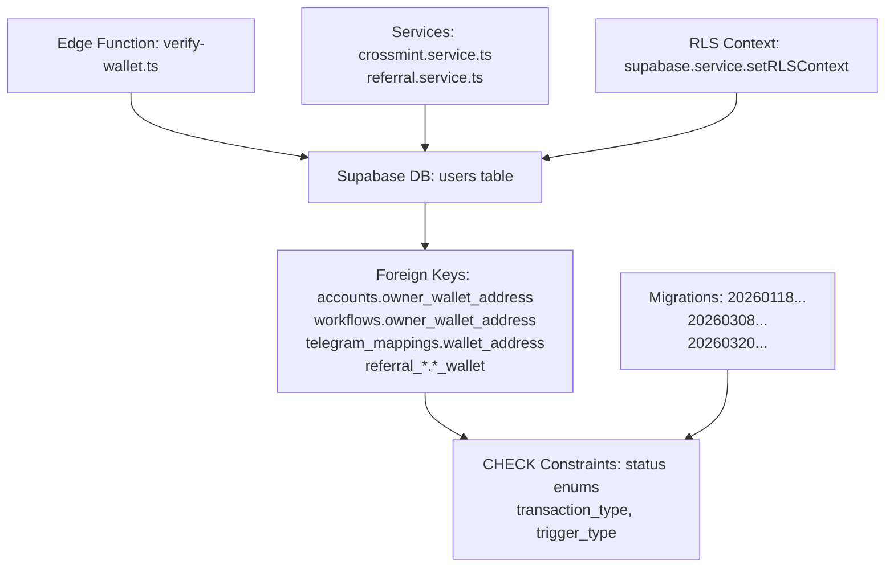
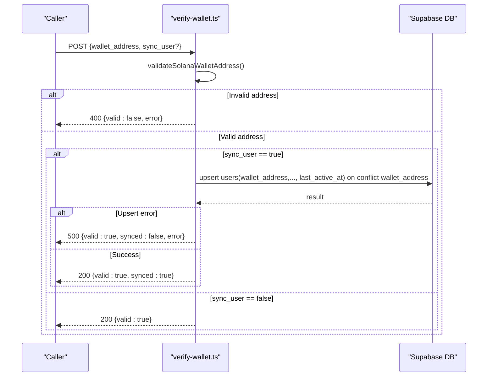
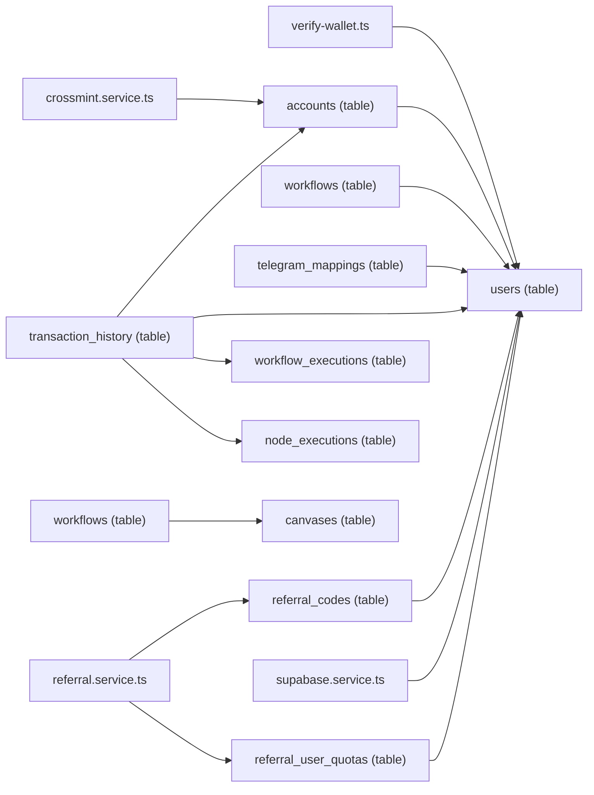

# Data Integrity and Validation

<cite>
**Referenced Files in This Document**
- [verify-wallet.ts](file://src/database/functions/verify-wallet.ts)
- [initial-1.sql](file://src/database/schema/initial-1.sql)
- [initial-2-auth-challenges.sql](file://src/database/schema/initial-2-auth-challenges.sql)
- [20260118210000_remove_legacy_wallet_fields.sql](file://supabase/migrations/20260118210000_remove_legacy_wallet_fields.sql)
- [20260128140000_add_auth_challenges.sql](file://supabase/migrations/20260128140000_add_auth_challenges.sql)
- [20260129000000_update_schema_v2.sql](file://supabase/migrations/20260129000000_update_schema_v2.sql)
- [20260308000000_add_canvases_and_account_status.sql](file://supabase/migrations/20260308000000_add_canvases_and_account_status.sql)
- [20260320090000_add_referral_system.sql](file://supabase/migrations/20260320090000_add_referral_system.sql)
- [supabase.service.ts](file://src/database/supabase.service.ts)
- [crossmint.service.ts](file://src/crossmint/crossmint.service.ts)
- [referral.service.ts](file://src/referral/referral.service.ts)
- [full_system_test.ts](file://scripts/full_system_test.ts)
</cite>

## Table of Contents
1. [Introduction](#introduction)
2. [Project Structure](#project-structure)
3. [Core Components](#core-components)
4. [Architecture Overview](#architecture-overview)
5. [Detailed Component Analysis](#detailed-component-analysis)
6. [Dependency Analysis](#dependency-analysis)
7. [Performance Considerations](#performance-considerations)
8. [Troubleshooting Guide](#troubleshooting-guide)
9. [Conclusion](#conclusion)

## Introduction
This document details the data integrity and validation mechanisms implemented in PinTool’s database layer. It covers constraint definitions (CHECK constraints for status fields, foreign key relationships, and unique constraints), database-level validation rules, the verify-wallet function for wallet address validation and duplicate prevention, transaction integrity via referential constraints, audit trails through created_at/updated_at timestamps, and data lifecycle management. It also addresses error handling, constraint violation scenarios, and data correction procedures, forming a robust validation architecture that ensures data quality and prevents invalid states.

## Project Structure
PinTool’s database integrity spans SQL schema definitions, migrations, and runtime validation logic:
- Schema definitions define primary keys, foreign keys, unique constraints, and CHECK constraints.
- Migrations evolve the schema and enforce integrity rules across versions.
- Edge Functions (verify-wallet) validate wallet addresses and optionally upsert users.
- Services orchestrate database operations with RLS context and typed DTOs.

**Diagram sources**
- [initial-1.sql:1-153](file://src/database/schema/initial-1.sql#L1-L153)
- [initial-2-auth-challenges.sql:1-7](file://src/database/schema/initial-2-auth-challenges.sql#L1-L7)
- [20260118210000_remove_legacy_wallet_fields.sql:1-56](file://supabase/migrations/20260118210000_remove_legacy_wallet_fields.sql#L1-L56)
- [20260128140000_add_auth_challenges.sql:1-7](file://supabase/migrations/20260128140000_add_auth_challenges.sql#L1-L7)
- [20260129000000_update_schema_v2.sql:1-39](file://supabase/migrations/20260129000000_update_schema_v2.sql#L1-L39)
- [20260308000000_add_canvases_and_account_status.sql:1-45](file://supabase/migrations/20260308000000_add_canvases_and_account_status.sql#L1-L45)
- [20260320090000_add_referral_system.sql:1-195](file://supabase/migrations/20260320090000_add_referral_system.sql#L1-L195)
- [verify-wallet.ts:1-231](file://src/database/functions/verify-wallet.ts#L1-L231)
- [crossmint.service.ts:1-200](file://src/crossmint/crossmint.service.ts#L1-L200)
- [referral.service.ts:1-200](file://src/referral/referral.service.ts#L1-L200)
- [supabase.service.ts:1-42](file://src/database/supabase.service.ts#L1-L42)

**Section sources**
- [initial-1.sql:1-153](file://src/database/schema/initial-1.sql#L1-L153)
- [initial-2-auth-challenges.sql:1-7](file://src/database/schema/initial-2-auth-challenges.sql#L1-L7)
- [20260118210000_remove_legacy_wallet_fields.sql:1-56](file://supabase/migrations/20260118210000_remove_legacy_wallet_fields.sql#L1-L56)
- [20260128140000_add_auth_challenges.sql:1-7](file://supabase/migrations/20260128140000_add_auth_challenges.sql#L1-L7)
- [20260129000000_update_schema_v2.sql:1-39](file://supabase/migrations/20260129000000_update_schema_v2.sql#L1-L39)
- [20260308000000_add_canvases_and_account_status.sql:1-45](file://supabase/migrations/20260308000000_add_canvases_and_account_status.sql#L1-L45)
- [20260320090000_add_referral_system.sql:1-195](file://supabase/migrations/20260320090000_add_referral_system.sql#L1-L195)
- [supabase.service.ts:1-42](file://src/database/supabase.service.ts#L1-L42)

## Core Components
- Database schema and constraints define integrity at rest.
- Migrations evolve constraints and indexes over time.
- Edge Function verify-wallet validates wallet addresses and enforces uniqueness via upsert.
- Services use Supabase client with RLS context to maintain per-user isolation.
- Referral system adds layered validation via stored procedures and CHECK constraints.

**Section sources**
- [initial-1.sql:1-153](file://src/database/schema/initial-1.sql#L1-L153)
- [20260320090000_add_referral_system.sql:106-195](file://supabase/migrations/20260320090000_add_referral_system.sql#L106-L195)
- [verify-wallet.ts:109-229](file://src/database/functions/verify-wallet.ts#L109-L229)
- [supabase.service.ts:33-40](file://src/database/supabase.service.ts#L33-L40)

## Architecture Overview
The validation architecture combines schema-level constraints, migration-driven evolution, and runtime checks:

**Diagram sources**
- [verify-wallet.ts:109-229](file://src/database/functions/verify-wallet.ts#L109-L229)
- [initial-1.sql:4-153](file://src/database/schema/initial-1.sql#L4-L153)
- [20260118210000_remove_legacy_wallet_fields.sql:42-43](file://supabase/migrations/20260118210000_remove_legacy_wallet_fields.sql#L42-L43)
- [20260308000000_add_canvases_and_account_status.sql:35-44](file://supabase/migrations/20260308000000_add_canvases_and_account_status.sql#L35-L44)
- [20260320090000_add_referral_system.sql:32-48](file://supabase/migrations/20260320090000_add_referral_system.sql#L32-L48)
- [supabase.service.ts:33-40](file://src/database/supabase.service.ts#L33-L40)

## Detailed Component Analysis

### Database Constraints and CHECK Enums
- Accounts status: Enum-like constraint restricts values to inactive, active, closed.
- Node executions status: Enum-like constraint restricts values to pending, running, completed, failed, skipped.
- Transaction history transaction_type: Enum-like constraint restricts values to predefined transaction types.
- Transaction history status: Enum-like constraint restricts values to pending, confirmed, failed.
- Workflow executions status: Enum-like constraint restricts values to pending, running, completed, failed, cancelled.
- Workflow executions trigger_type: Enum-like constraint restricts values to manual, scheduled, price_trigger, webhook, telegram_command.
- Users catpurr: Boolean-like CHECK constraint restricts values to true or false.
- Referral codes: CHECK constraints on max_uses, used_count, and status enumeration.
- Unique constraints:
  - users.email is unique.
  - accounts.crossmint_wallet_address is unique.
  - telegram_mappings.chat_id is unique.
  - transaction_history.signature is unique.
  - referral_codes.code is unique.

These constraints ensure data validity at the database level and prevent invalid states.

**Section sources**
- [initial-1.sql:9, 43, 87-88, 122, 123, 110, 38-47:9-123](file://src/database/schema/initial-1.sql#L9-L123)
- [20260308000000_add_canvases_and_account_status.sql:35-44](file://supabase/migrations/20260308000000_add_canvases_and_account_status.sql#L35-L44)
- [20260320090000_add_referral_system.sql:37-47](file://supabase/migrations/20260320090000_add_referral_system.sql#L37-L47)

### Foreign Key Relationships and Referential Integrity
- accounts.owner_wallet_address references users.wallet_address.
- workflows.owner_wallet_address references users.wallet_address.
- telegram_mappings.wallet_address references users.wallet_address.
- transaction_history.account_id references accounts.id.
- transaction_history.owner_wallet_address references users.wallet_address.
- transaction_history.workflow_execution_id references workflow_executions.id.
- transaction_history.node_execution_id references node_executions.id.
- workflows.canvas_id references canvases.id with ON DELETE SET NULL.
- referral codes foreign keys:
  - created_by_wallet references users.wallet_address.
  - created_for_wallet references users.wallet_address.
  - used_by_wallet references users.wallet_address.

These relationships enforce referential integrity and cascade actions where applicable.

**Section sources**
- [initial-1.sql:15, 27, 78, 100-103, 137, 152:15-152](file://src/database/schema/initial-1.sql#L15-L152)
- [20260308000000_add_canvases_and_account_status.sql:27-30](file://supabase/migrations/20260308000000_add_canvases_and_account_status.sql#L27-L30)
- [20260320090000_add_referral_system.sql:32-48](file://supabase/migrations/20260320090000_add_referral_system.sql#L32-L48)

### Unique Constraints and Duplicate Prevention
- accounts.crossmint_wallet_address is unique, enforced by migration adding a unique constraint.
- transaction_history.signature is unique, preventing duplicate transaction records.
- telegram_mappings.chat_id is unique, ensuring one-to-one chat mapping per wallet.
- users.email is unique, preventing duplicate emails.
- referral_codes.code is unique, ensuring distinct referral codes.

Duplicate prevention is achieved through unique constraints and upsert semantics.

**Section sources**
- [20260118210000_remove_legacy_wallet_fields.sql:42-43](file://supabase/migrations/20260118210000_remove_legacy_wallet_fields.sql#L42-L43)
- [initial-1.sql:13, 86, 69, 111](file://src/database/schema/initial-1.sql#L13,L86,L69,L111)

### verify-wallet Function: Wallet Address Validation and Upsert
The Edge Function performs:
- Input validation: Non-empty, trimmed string wallet address.
- Length validation: 32–44 characters.
- Base58 character validation against Solana alphabet.
- Decoding and byte-length verification: Must decode to 32 bytes.
- Optional user upsert: If sync_user is true, upserts users with conflict on wallet_address and updates last_active_at.

**Diagram sources**
- [verify-wallet.ts:109-229](file://src/database/functions/verify-wallet.ts#L109-L229)
- [initial-1.sql:110](file://src/database/schema/initial-1.sql#L110)

**Section sources**
- [verify-wallet.ts:63-107](file://src/database/functions/verify-wallet.ts#L63-L107)
- [verify-wallet.ts:154-204](file://src/database/functions/verify-wallet.ts#L154-L204)

### Transaction Integrity Through Cascading Actions
- workflows.canvas_id ON DELETE SET NULL allows canvases to be deleted without orphaning workflows.
- Referential constraints ensure child rows cannot outlive parent rows, maintaining consistency across accounts, workflows, executions, and transactions.

**Section sources**
- [initial-1.sql:152](file://src/database/schema/initial-1.sql#L152)
- [20260308000000_add_canvases_and_account_status.sql:27-30](file://supabase/migrations/20260308000000_add_canvases_and_account_status.sql#L27-L30)

### Audit Trails and Timestamps
- created_at and updated_at timestamps are present across most tables, enabling audit trails and lifecycle tracking.
- These timestamps support querying by creation/update time and inform data aging policies.

**Section sources**
- [initial-1.sql:10, 24, 33, 63, 74, 96, 115, 147, 148](file://src/database/schema/initial-1.sql#L10,L24,L33,L63,L74,L96,L115,L147,L148)

### Data Lifecycle Management
- Expiration fields (e.g., auth_challenges.expires_at) enable lifecycle cleanup.
- Status enums (accounts.status, transaction_history.status, referral codes status) model lifecycle stages and transitions.
- Indexes on frequently queried columns (e.g., workflow_executions owner, workflow_id, transaction_history account_id) improve lifecycle reporting performance.

**Section sources**
- [initial-2-auth-challenges.sql:3](file://src/database/schema/initial-2-auth-challenges.sql#L3)
- [20260129000000_update_schema_v2.sql:29-38](file://supabase/migrations/20260129000000_update_schema_v2.sql#L29-L38)
- [20260308000000_add_canvases_and_account_status.sql:35-44](file://supabase/migrations/20260308000000_add_canvases_and_account_status.sql#L35-L44)
- [20260320090000_add_referral_system.sql:37-47](file://supabase/migrations/20260320090000_add_referral_system.sql#L37-L47)

### Error Handling and Constraint Violation Scenarios
- verify-wallet returns structured errors for invalid methods, malformed bodies, invalid addresses, and upsert failures.
- Referral service handles PostgREST error codes (e.g., unique violations) and throws typed exceptions.
- Full-system tests validate blocking of replay attacks and enforcement of foreign key integrity.

Common scenarios:
- Unique constraint violation on users.email or referral_codes.code triggers a 409-like semantic via upsert or RPC failure.
- CHECK constraint violation on status fields or enums results in a 422/400 response depending on context.
- Foreign key violation blocks inserts/updates that reference non-existent parents.

**Section sources**
- [verify-wallet.ts:125-137](file://src/database/functions/verify-wallet.ts#L125-L137)
- [verify-wallet.ts:175-191](file://src/database/functions/verify-wallet.ts#L175-L191)
- [referral.service.ts:74-79](file://src/referral/referral.service.ts#L74-L79)
- [full_system_test.ts:71-102](file://scripts/full_system_test.ts#L71-L102)
- [full_system_test.ts:104-121](file://scripts/full_system_test.ts#L104-L121)

### Data Correction Procedures
- For unique violations during upserts, reattempt with corrected identifiers or remove conflicting entries.
- For CHECK constraint violations, adjust values to permitted enumerations.
- For expired auth challenges, regenerate challenges with future expires_at timestamps.
- For referral quota issues, adjust max_codes respecting used_count constraints.

**Section sources**
- [20260320090000_add_referral_system.sql:110-153](file://supabase/migrations/20260320090000_add_referral_system.sql#L110-L153)
- [initial-2-auth-challenges.sql:3](file://src/database/schema/initial-2-auth-challenges.sql#L3)

### Validation Architecture Summary
- Schema-level CHECK constraints and foreign keys form the backbone of integrity.
- Edge Functions validate inputs before persistence.
- Services operate under RLS context to enforce per-user access and data isolation.
- Migrations evolve constraints and indexes to support new features and performance needs.

**Section sources**
- [initial-1.sql:1-153](file://src/database/schema/initial-1.sql#L1-L153)
- [verify-wallet.ts:1-231](file://src/database/functions/verify-wallet.ts#L1-L231)
- [supabase.service.ts:33-40](file://src/database/supabase.service.ts#L33-L40)
- [20260320090000_add_referral_system.sql:106-195](file://supabase/migrations/20260320090000_add_referral_system.sql#L106-L195)

## Dependency Analysis

**Diagram sources**
- [initial-1.sql:4-153](file://src/database/schema/initial-1.sql#L4-L153)
- [20260308000000_add_canvases_and_account_status.sql:10-30](file://supabase/migrations/20260308000000_add_canvases_and_account_status.sql#L10-L30)
- [20260320090000_add_referral_system.sql:32-80](file://supabase/migrations/20260320090000_add_referral_system.sql#L32-L80)
- [supabase.service.ts:1-42](file://src/database/supabase.service.ts#L1-L42)
- [crossmint.service.ts:1-200](file://src/crossmint/crossmint.service.ts#L1-L200)
- [referral.service.ts:1-200](file://src/referral/referral.service.ts#L1-L200)

**Section sources**
- [initial-1.sql:4-153](file://src/database/schema/initial-1.sql#L4-L153)
- [20260308000000_add_canvases_and_account_status.sql:10-30](file://supabase/migrations/20260308000000_add_canvases_and_account_status.sql#L10-L30)
- [20260320090000_add_referral_system.sql:32-80](file://supabase/migrations/20260320090000_add_referral_system.sql#L32-L80)
- [supabase.service.ts:1-42](file://src/database/supabase.service.ts#L1-L42)
- [crossmint.service.ts:1-200](file://src/crossmint/crossmint.service.ts#L1-L200)
- [referral.service.ts:1-200](file://src/referral/referral.service.ts#L1-L200)

## Performance Considerations
- Indexes on frequently filtered columns (e.g., workflow_executions(owner_wallet_address), workflow_executions(workflow_id), transaction_history(account_id)) improve query performance for history views and analytics.
- CHECK constraints avoid expensive post-insert validation and keep data uniform.
- Unique constraints prevent duplicates proactively, reducing cleanup overhead.

**Section sources**
- [20260129000000_update_schema_v2.sql:29-38](file://supabase/migrations/20260129000000_update_schema_v2.sql#L29-L38)

## Troubleshooting Guide
Common issues and resolutions:
- Wallet validation failures:
  - Ensure address length is within 32–44 characters and contains only Base58 characters.
  - Confirm decoding produces exactly 32 bytes.
- UTXO-style duplicate prevention:
  - For accounts.crossmint_wallet_address conflicts, deduplicate or reconcile entries before retry.
- Referral code errors:
  - If consume fails, inspect code status, expiration, max_uses, and created_for_wallet constraints.
  - Use reserve/release quota helpers to manage concurrency safely.
- RLS access problems:
  - Verify RLS context is set via setRLSContext and policies permit service_role operations.

**Section sources**
- [verify-wallet.ts:63-107](file://src/database/functions/verify-wallet.ts#L63-L107)
- [20260320090000_add_referral_system.sql:106-195](file://supabase/migrations/20260320090000_add_referral_system.sql#L106-L195)
- [supabase.service.ts:33-40](file://src/database/supabase.service.ts#L33-L40)

## Conclusion
PinTool’s database integrity relies on a layered approach: schema-level CHECK constraints and foreign keys, unique constraints, migration-driven evolution, Edge Function validation, and service-layer RLS context. Together, these mechanisms enforce data quality, prevent invalid states, and support reliable audit trails and lifecycle management. Adhering to the documented constraints and validation flows ensures consistent behavior across the system.