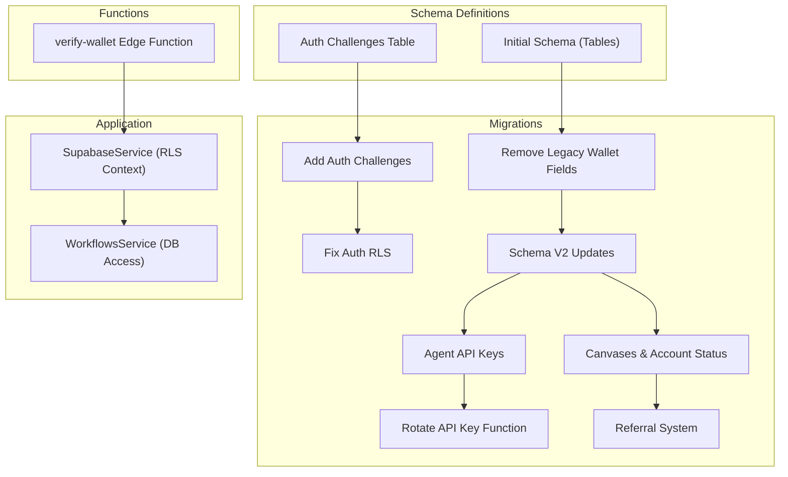
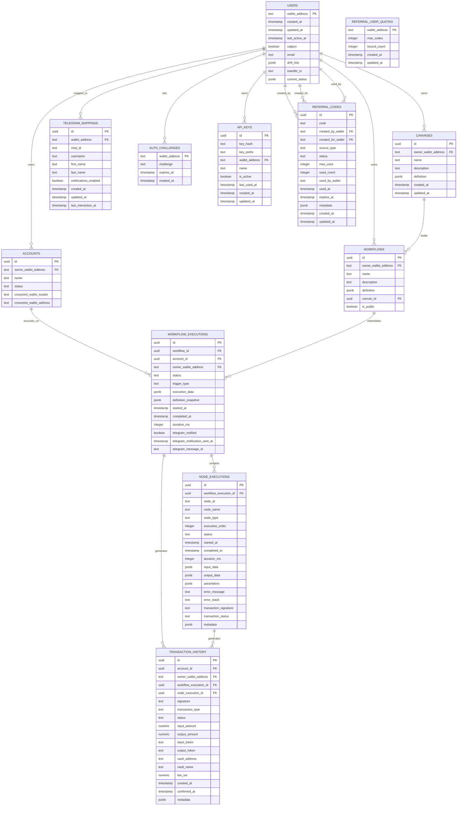
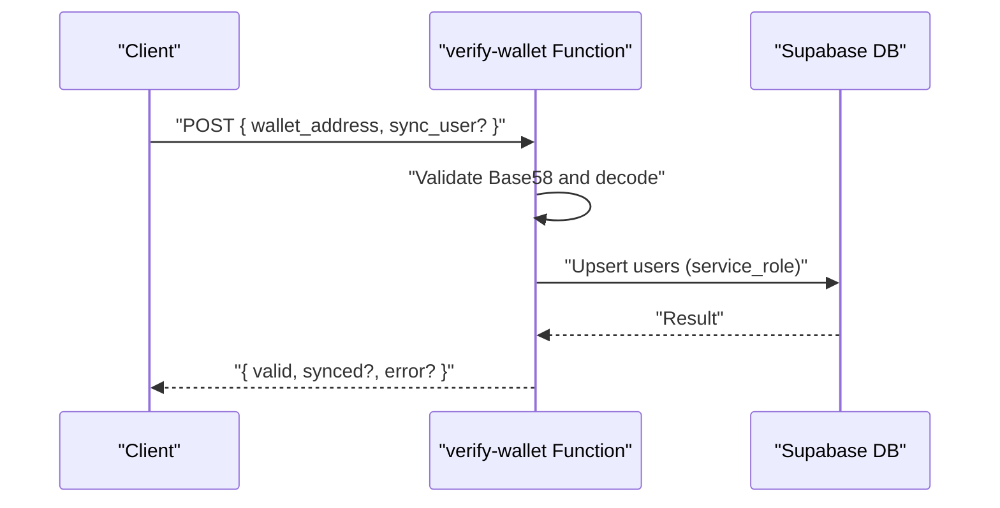
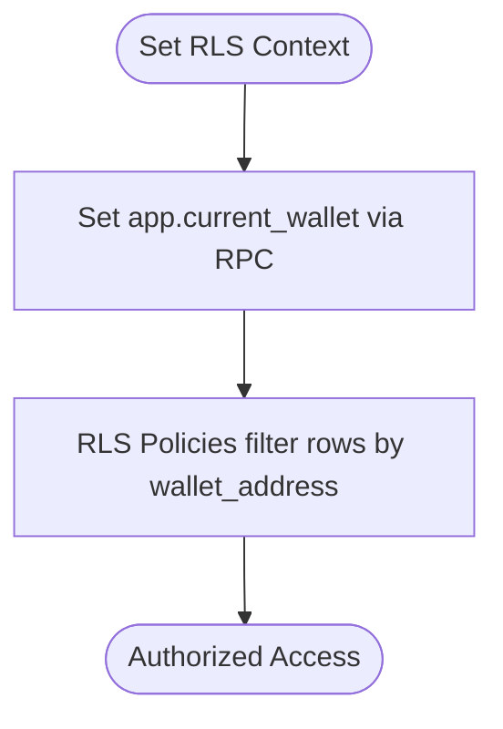
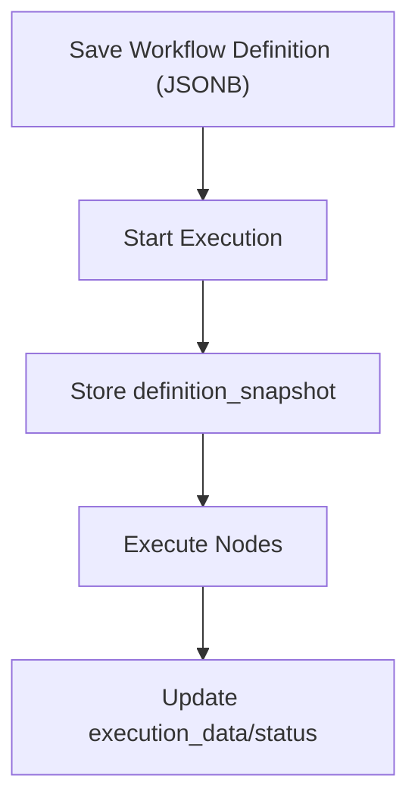
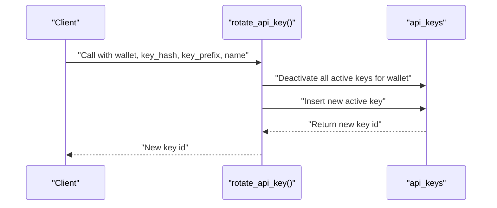
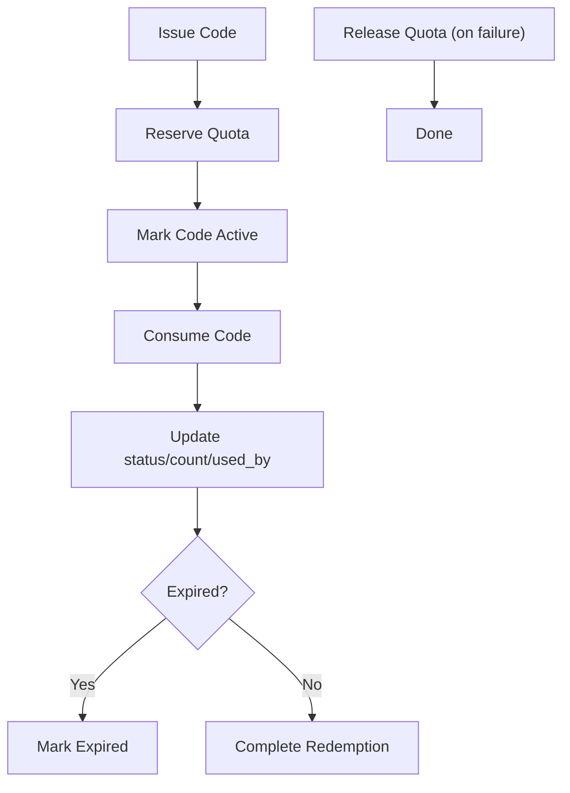
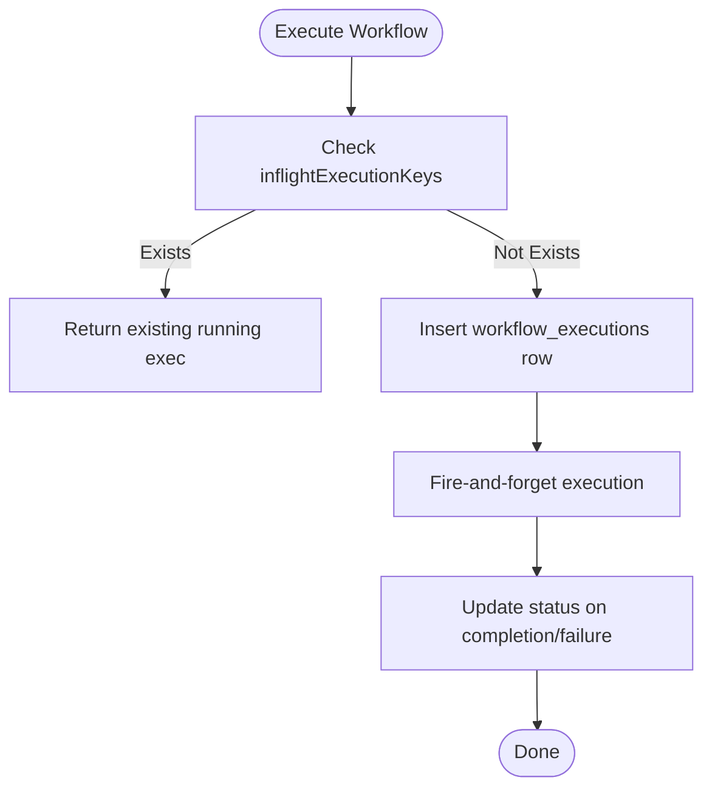
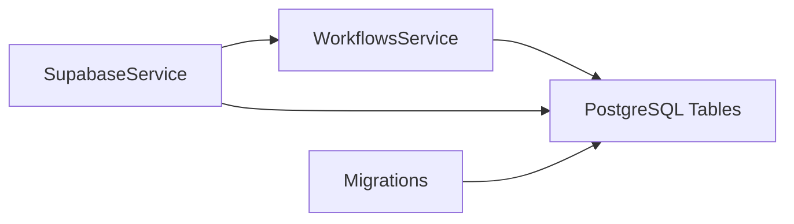

# Database Design

<cite>
**Referenced Files in This Document**
- [initial-1.sql](file://src/database/schema/initial-1.sql)
- [initial-2-auth-challenges.sql](file://src/database/schema/initial-2-auth-challenges.sql)
- [20260118210000_remove_legacy_wallet_fields.sql](file://supabase/migrations/20260118210000_remove_legacy_wallet_fields.sql)
- [20260128140000_add_auth_challenges.sql](file://supabase/migrations/20260128140000_add_auth_challenges.sql)
- [20260128143000_fix_auth_rls.sql](file://supabase/migrations/202601281430000_fix_auth_rls.sql)
- [20260129000000_update_schema_v2.sql](file://supabase/migrations/20260129000000_update_schema_v2.sql)
- [20260218000000_add_agent_api_keys.sql](file://supabase/migrations/20260218000000_add_agent_api_keys.sql)
- [20260218010000_add_rotate_api_key_function.sql](file://supabase/migrations/20260218010000_add_rotate_api_key_function.sql)
- [20260308000000_add_canvases_and_account_status.sql](file://supabase/migrations/20260308000000_add_canvases_and_account_status.sql)
- [20260320090000_add_referral_system.sql](file://supabase/migrations/20260320090000_add_referral_system.sql)
- [verify-wallet.ts](file://src/database/functions/verify-wallet.ts)
- [supabase.service.ts](file://src/database/supabase.service.ts)
- [workflows.service.ts](file://src/workflows/workflows.service.ts)
- [apply_migration.ts](file://scripts/apply_migration.ts)
</cite>

## Table of Contents
1. [Introduction](#introduction)
2. [Project Structure](#project-structure)
3. [Core Components](#core-components)
4. [Architecture Overview](#architecture-overview)
5. [Detailed Component Analysis](#detailed-component-analysis)
6. [Dependency Analysis](#dependency-analysis)
7. [Performance Considerations](#performance-considerations)
8. [Troubleshooting Guide](#troubleshooting-guide)
9. [Conclusion](#conclusion)
10. [Appendices](#appendices)

## Introduction
This document describes PinTool’s database schema and design patterns. It covers entity definitions, relationships, constraints, indexes, and security via Row Level Security (RLS). It also documents how workflows are stored as JSONB, the wallet verification function, and the evolution of the schema through Supabase migrations. The goal is to provide a clear understanding of data models, access patterns, and operational considerations for developers and operators.

## Project Structure
The database design is composed of:
- Initial schema definitions for core entities
- Supabase migrations that evolve the schema over time
- Edge Function for wallet verification and optional user sync
- Supabase client wrapper for RLS context and database access
- Application services that interact with the database

**Diagram sources**
- [initial-1.sql:1-153](file://src/database/schema/initial-1.sql#L1-L153)
- [initial-2-auth-challenges.sql:1-7](file://src/database/schema/initial-2-auth-challenges.sql#L1-L7)
- [20260118210000_remove_legacy_wallet_fields.sql:1-56](file://supabase/migrations/20260118210000_remove_legacy_wallet_fields.sql#L1-L56)
- [20260128140000_add_auth_challenges.sql:1-7](file://supabase/migrations/20260128140000_add_auth_challenges.sql#L1-L7)
- [20260128143000_fix_auth_rls.sql:1-21](file://supabase/migrations/20260128143000_fix_auth_rls.sql#L1-L21)
- [20260129000000_update_schema_v2.sql:1-39](file://supabase/migrations/20260129000000_update_schema_v2.sql#L1-L39)
- [20260218000000_add_agent_api_keys.sql:1-48](file://supabase/migrations/20260218000000_add_agent_api_keys.sql#L1-L48)
- [20260218010000_add_rotate_api_key_function.sql:1-27](file://supabase/migrations/20260218010000_add_rotate_api_key_function.sql#L1-L27)
- [20260308000000_add_canvases_and_account_status.sql:1-45](file://supabase/migrations/20260308000000_add_canvases_and_account_status.sql#L1-L45)
- [20260320090000_add_referral_system.sql:1-195](file://supabase/migrations/20260320090000_add_referral_system.sql#L1-L195)
- [verify-wallet.ts:1-231](file://src/database/functions/verify-wallet.ts#L1-L231)
- [supabase.service.ts:1-42](file://src/database/supabase.service.ts#L1-L42)
- [workflows.service.ts:1-215](file://src/workflows/workflows.service.ts#L1-L215)

**Section sources**
- [initial-1.sql:1-153](file://src/database/schema/initial-1.sql#L1-L153)
- [initial-2-auth-challenges.sql:1-7](file://src/database/schema/initial-2-auth-challenges.sql#L1-L7)
- [20260118210000_remove_legacy_wallet_fields.sql:1-56](file://supabase/migrations/20260118210000_remove_legacy_wallet_fields.sql#L1-L56)
- [20260128140000_add_auth_challenges.sql:1-7](file://supabase/migrations/20260128140000_add_auth_challenges.sql#L1-L7)
- [20260128143000_fix_auth_rls.sql:1-21](file://supabase/migrations/20260128143000_fix_auth_rls.sql#L1-L21)
- [20260129000000_update_schema_v2.sql:1-39](file://supabase/migrations/20260129000000_update_schema_v2.sql#L1-L39)
- [20260218000000_add_agent_api_keys.sql:1-48](file://supabase/migrations/20260218000000_add_agent_api_keys.sql#L1-L48)
- [20260218010000_add_rotate_api_key_function.sql:1-27](file://supabase/migrations/20260218010000_add_rotate_api_key_function.sql#L1-L27)
- [20260308000000_add_canvases_and_account_status.sql:1-45](file://supabase/migrations/20260308000000_add_canvases_and_account_status.sql#L1-L45)
- [20260320090000_add_referral_system.sql:1-195](file://supabase/migrations/20260320090000_add_referral_system.sql#L1-L195)
- [verify-wallet.ts:1-231](file://src/database/functions/verify-wallet.ts#L1-L231)
- [supabase.service.ts:1-42](file://src/database/supabase.service.ts#L1-L42)
- [workflows.service.ts:1-215](file://src/workflows/workflows.service.ts#L1-L215)

## Core Components
This section documents the core relational entities and their attributes, constraints, and indexes. All tables are defined in the initial schema and evolved through migrations.

- Users
  - Primary key: wallet_address
  - Notable columns: created_at, updated_at, last_active_at, catpurr, email, drift_hist, transfer_tx, current_status
  - Constraints: UNIQUE on email; CHECK on catpurr; PRIMARY KEY on wallet_address
  - Indexes: None explicitly defined in initial schema; app_role introduced later via migration

- Accounts
  - Primary key: id
  - Notable columns: owner_wallet_address (FK to users), name, status, crossmint_wallet_locator, crossmint_wallet_address (UNIQUE)
  - Constraints: status CHECK; UNIQUE on crossmint_wallet_address; FK to users
  - Indexes: None explicitly defined in initial schema; status column added via migration

- Canvases
  - Primary key: id
  - Notable columns: owner_wallet_address (FK to users), name, description, definition (jsonb)
  - Constraints: FK to users
  - Indexes: owner_wallet_address

- Workflows
  - Primary key: id
  - Notable columns: owner_wallet_address (FK to users), name, description, definition (jsonb), canvas_id (FK to canvases), is_public
  - Constraints: FK to users; FK to canvases; is_public default false
  - Indexes: canvas_id

- Workflow Executions
  - Primary key: id
  - Notable columns: workflow_id (FK to workflows), account_id (FK to accounts), owner_wallet_address (FK to users), status, trigger_type, execution_data (jsonb), definition_snapshot (jsonb)
  - Constraints: FKs to workflows, accounts, users; status and trigger_type CHECK
  - Indexes: owner_wallet_address, workflow_id; account_id added later

- Node Executions
  - Primary key: id
  - Notable columns: workflow_execution_id (FK to workflow_executions), node_id, node_name, node_type, status, input_data, output_data, parameters (jsonb), error_message, error_stack, transaction_signature, transaction_status, metadata (jsonb)
  - Constraints: FK to workflow_executions; status CHECK
  - Indexes: None explicitly defined

- Transaction History
  - Primary key: id
  - Notable columns: account_id (FK to accounts), owner_wallet_address (FK to users), workflow_execution_id (FK to workflow_executions), node_execution_id (FK to node_executions), signature (UNIQUE), transaction_type, status, amounts/tokens, vault info, fee_sol, timestamps
  - Constraints: UNIQUE on signature; FKs to accounts, users, workflow_executions, node_executions; transaction_type and status CHECK
  - Indexes: account_id added later

- Telegram Mappings
  - Primary key: id
  - Notable columns: wallet_address (FK to users), chat_id (UNIQUE), username, first_name, last_name, notifications_enabled, created_at, updated_at, last_interaction_at
  - Constraints: UNIQUE on chat_id; FK to users
  - Indexes: None explicitly defined

- System Config
  - Primary key: key
  - Notable columns: value, description, is_encrypted, updated_at
  - Constraints: PRIMARY KEY on key
  - Indexes: None explicitly defined

- Auth Challenges
  - Primary key: wallet_address
  - Notable columns: challenge, expires_at, created_at
  - Constraints: PRIMARY KEY on wallet_address
  - Indexes: None explicitly defined

- API Keys
  - Primary key: id
  - Notable columns: key_hash (UNIQUE), key_prefix, wallet_address (FK to users), name, is_active, last_used_at, created_at, updated_at
  - Constraints: UNIQUE on key_hash; FK to users; partial unique index on (wallet_address) where is_active = true
  - Indexes: key_hash, wallet_address

- Referral Codes
  - Primary key: id
  - Notable columns: code (UNIQUE), created_by_wallet (FK to users), created_for_wallet (FK to users), source_type, status, max_uses, used_count, used_by_wallet, used_at, expires_at, metadata (jsonb), created_at, updated_at
  - Constraints: UNIQUE on code; FK to users; CHECK on status and max_uses; CHECK ensuring used_count <= max_uses
  - Indexes: created_by_wallet, created_for_wallet, status, created_at DESC

- Referral User Quotas
  - Primary key: wallet_address (FK to users)
  - Notable columns: max_codes, issued_count, created_at, updated_at
  - Constraints: FK to users; CHECK ensuring issued_count <= max_codes
  - Indexes: None explicitly defined

**Section sources**
- [initial-1.sql:4-153](file://src/database/schema/initial-1.sql#L4-L153)
- [initial-2-auth-challenges.sql:1-7](file://src/database/schema/initial-2-auth-challenges.sql#L1-L7)
- [20260118210000_remove_legacy_wallet_fields.sql:23-43](file://supabase/migrations/20260118210000_remove_legacy_wallet_fields.sql#L23-L43)
- [20260128140000_add_auth_challenges.sql:1-7](file://supabase/migrations/20260128140000_add_auth_challenges.sql#L1-L7)
- [20260129000000_update_schema_v2.sql:19-38](file://supabase/migrations/20260129000000_update_schema_v2.sql#L19-L38)
- [20260218000000_add_agent_api_keys.sql:7-26](file://supabase/migrations/20260218000000_add_agent_api_keys.sql#L7-L26)
- [20260320090000_add_referral_system.sql:32-72](file://supabase/migrations/20260320090000_add_referral_system.sql#L32-L72)

## Architecture Overview
The database architecture centers around user-owned resources (accounts, canvases, workflows) and execution records. Workflows are stored as JSONB for flexibility, enabling dynamic node definitions and runtime customization. Execution snapshots preserve historical state for auditing and replay. RLS isolates data per wallet address, enforced via a Supabase service-level configuration key.

**Diagram sources**
- [initial-1.sql:4-153](file://src/database/schema/initial-1.sql#L4-L153)
- [20260308000000_add_canvases_and_account_status.sql:10-44](file://supabase/migrations/20260308000000_add_canvases_and_account_status.sql#L10-L44)
- [20260320090000_add_referral_system.sql:32-72](file://supabase/migrations/20260320090000_add_referral_system.sql#L32-L72)

## Detailed Component Analysis

### Authentication and Wallet Validation
- Purpose: Validate Solana wallet addresses and optionally upsert users into the database.
- Implementation: Edge Function performs Base58 validation, decodes the address, checks byte length, and conditionally syncs a user row when requested.
- Security: Uses a service role client to bypass RLS during upserts.

**Diagram sources**
- [verify-wallet.ts:109-229](file://src/database/functions/verify-wallet.ts#L109-L229)

**Section sources**
- [verify-wallet.ts:1-231](file://src/database/functions/verify-wallet.ts#L1-L231)

### Row Level Security and Access Control
- Enforced via RLS policies on sensitive tables.
- SupabaseService sets a session-local configuration key to filter rows by the current wallet address.
- Policies grant broad access to service_role and restrict anonymous and authenticated users from accessing sensitive tables.

**Diagram sources**
- [supabase.service.ts:33-40](file://src/database/supabase.service.ts#L33-L40)
- [20260128143000_fix_auth_rls.sql:1-21](file://supabase/migrations/202601281430000_fix_auth_rls.sql#L1-L21)
- [20260218000000_add_agent_api_keys.sql:28-48](file://supabase/migrations/20260218000000_add_agent_api_keys.sql#L28-L48)
- [20260320090000_add_referral_system.sql:74-101](file://supabase/migrations/20260320090000_add_referral_system.sql#L74-L101)

**Section sources**
- [supabase.service.ts:1-42](file://src/database/supabase.service.ts#L1-L42)
- [20260128143000_fix_auth_rls.sql:1-21](file://supabase/migrations/20260128143000_fix_auth_rls.sql#L1-L21)
- [20260218000000_add_agent_api_keys.sql:28-48](file://supabase/migrations/20260218000000_add_agent_api_keys.sql#L28-L48)
- [20260320090000_add_referral_system.sql:74-101](file://supabase/migrations/20260320090000_add_referral_system.sql#L74-L101)

### Workflow Definition Storage (JSONB)
- Workflows store their definition as JSONB, enabling flexible node graphs and dynamic configuration.
- Execution snapshots capture the definition at runtime for auditability and replay.

**Diagram sources**
- [initial-1.sql:140-153](file://src/database/schema/initial-1.sql#L140-L153)
- [20260129000000_update_schema_v2.sql:19-24](file://supabase/migrations/20260129000000_update_schema_v2.sql#L19-L24)

**Section sources**
- [initial-1.sql:140-153](file://src/database/schema/initial-1.sql#L140-L153)
- [20260129000000_update_schema_v2.sql:19-24](file://supabase/migrations/20260129000000_update_schema_v2.sql#L19-L24)

### API Key Management and Rotation
- API keys are scoped to wallet owners with a partial unique index ensuring one active key per wallet.
- A secure function rotates keys atomically, deactivating existing active keys and inserting a new active key.

**Diagram sources**
- [20260218010000_add_rotate_api_key_function.sql:2-26](file://supabase/migrations/20260218010000_add_rotate_api_key_function.sql#L2-L26)
- [20260218000000_add_agent_api_keys.sql:6-26](file://supabase/migrations/20260218000000_add_agent_api_keys.sql#L6-L26)

**Section sources**
- [20260218000000_add_agent_api_keys.sql:6-26](file://supabase/migrations/20260218000000_add_agent_api_keys.sql#L6-L26)
- [20260218010000_add_rotate_api_key_function.sql:1-27](file://supabase/migrations/20260218010000_add_rotate_api_key_function.sql#L1-L27)

### Referral System
- Referral codes support admin and user-generated codes with quotas and expiration.
- Helper RPCs reserve/release quota and consume codes atomically.

**Diagram sources**
- [20260320090000_add_referral_system.sql:106-187](file://supabase/migrations/20260320090000_add_referral_system.sql#L106-L187)

**Section sources**
- [20260320090000_add_referral_system.sql:1-195](file://supabase/migrations/20260320090000_add_referral_system.sql#L1-L195)

### Data Access Patterns and Caching
- Access patterns:
  - Fetch workflows owned by a wallet
  - List executions by owner or workflow
  - Upsert users on wallet verification
  - Manage API keys per wallet
- Caching:
  - In-memory cache for inflight execution keys to prevent duplicate runs
  - No persistent cache configured in code

**Diagram sources**
- [workflows.service.ts:16-214](file://src/workflows/workflows.service.ts#L16-L214)

**Section sources**
- [workflows.service.ts:1-215](file://src/workflows/workflows.service.ts#L1-L215)

## Dependency Analysis
- SupabaseService initializes the client and sets RLS context.
- WorkflowsService depends on SupabaseService for database operations and enforces deduplication via in-memory keys.
- Migrations define schema evolution and introduce new capabilities (e.g., canvases, referral system, API keys).

**Diagram sources**
- [supabase.service.ts:1-42](file://src/database/supabase.service.ts#L1-L42)
- [workflows.service.ts:1-215](file://src/workflows/workflows.service.ts#L1-L215)

**Section sources**
- [supabase.service.ts:1-42](file://src/database/supabase.service.ts#L1-L42)
- [workflows.service.ts:1-215](file://src/workflows/workflows.service.ts#L1-L215)

## Performance Considerations
- Indexes introduced by migrations:
  - workflow_executions(owner_wallet_address) for “my history”
  - workflow_executions(workflow_id) for “workflow stats”
  - workflow_executions(account_id) for wallet activity
- JSONB fields enable flexible storage but require appropriate GIN indexes if querying nested fields frequently (not present in current migrations).
- Deduplication of concurrent executions reduces redundant work and improves throughput.

[No sources needed since this section provides general guidance]

## Troubleshooting Guide
- Wallet verification failures:
  - Validate Base58 characters and length; ensure decoding produces 32 bytes.
  - Confirm service role credentials are available when syncing users.
- RLS access denied:
  - Ensure RLS context is set before queries.
  - Verify policies grant access to service_role and restrict anonymous users.
- API key rotation race conditions:
  - Use the provided rotate function to avoid concurrent activation conflicts.
- Referral code consumption:
  - Check status, max_uses, expiration, and matching created_for_wallet.

**Section sources**
- [verify-wallet.ts:63-107](file://src/database/functions/verify-wallet.ts#L63-L107)
- [supabase.service.ts:33-40](file://src/database/supabase.service.ts#L33-L40)
- [20260218010000_add_rotate_api_key_function.sql:2-26](file://supabase/migrations/20260218010000_add_rotate_api_key_function.sql#L2-L26)
- [20260320090000_add_referral_system.sql:155-187](file://supabase/migrations/20260320090000_add_referral_system.sql#L155-L187)

## Conclusion
PinTool’s database design emphasizes user-centric ownership, flexible workflow definitions via JSONB, and strong isolation through RLS. Migrations have progressively introduced canvases, agent API keys, and a referral system, while maintaining backward compatibility. The schema supports efficient querying through targeted indexes and safe concurrency via dedicated functions. Operational practices such as wallet verification via Edge Functions and controlled API key rotation further enhance security and reliability.

[No sources needed since this section summarizes without analyzing specific files]

## Appendices

### Migration History and Evolution
- Initial schema establishes core entities and relationships.
- Subsequent migrations:
  - Remove legacy wallet fields and enforce uniqueness on crossmint wallet address.
  - Introduce auth challenges and fix RLS.
  - Update schema v2: switch is_active to is_public, add definition_snapshot, allow nullable account_id, add indexes.
  - Add agent API keys and rotation function.
  - Add canvases and migrate accounts status to enum.
  - Add referral system with quotas and helper RPCs.

**Section sources**
- [initial-1.sql:1-153](file://src/database/schema/initial-1.sql#L1-L153)
- [20260118210000_remove_legacy_wallet_fields.sql:1-56](file://supabase/migrations/20260118210000_remove_legacy_wallet_fields.sql#L1-L56)
- [20260128140000_add_auth_challenges.sql:1-7](file://supabase/migrations/20260128140000_add_auth_challenges.sql#L1-L7)
- [20260128143000_fix_auth_rls.sql:1-21](file://supabase/migrations/20260128143000_fix_auth_rls.sql#L1-L21)
- [20260129000000_update_schema_v2.sql:1-39](file://supabase/migrations/20260129000000_update_schema_v2.sql#L1-L39)
- [20260218000000_add_agent_api_keys.sql:1-48](file://supabase/migrations/20260218000000_add_agent_api_keys.sql#L1-L48)
- [20260218010000_add_rotate_api_key_function.sql:1-27](file://supabase/migrations/20260218010000_add_rotate_api_key_function.sql#L1-L27)
- [20260308000000_add_canvases_and_account_status.sql:1-45](file://supabase/migrations/20260308000000_add_canvases_and_account_status.sql#L1-L45)
- [20260320090000_add_referral_system.sql:1-195](file://supabase/migrations/20260320090000_add_referral_system.sql#L1-L195)

### Data Lifecycle and Retention
- No explicit retention policies are defined in the schema or migrations.
- Recommendation: Define TTLs for auth challenges and logs, and archive old executions periodically.

[No sources needed since this section provides general guidance]

### Security and Privacy Measures
- RLS enabled on sensitive tables; service_role granted broad access; anonymous and authenticated roles restricted.
- Edge Function uses service role to upsert users safely.
- API keys are hashed and scoped to wallets; partial unique index ensures one active key per wallet.
- Referral system enforces quotas and status transitions via RPCs.

**Section sources**
- [20260128143000_fix_auth_rls.sql:1-21](file://supabase/migrations/20260128143000_fix_auth_rls.sql#L1-L21)
- [20260218000000_add_agent_api_keys.sql:28-48](file://supabase/migrations/20260218000000_add_agent_api_keys.sql#L28-L48)
- [20260320090000_add_referral_system.sql:74-101](file://supabase/migrations/20260320090000_add_referral_system.sql#L74-L101)
- [verify-wallet.ts:155-191](file://src/database/functions/verify-wallet.ts#L155-L191)

### Future Expansion Plans
- Consider adding GIN indexes for JSONB fields if deep queries become frequent.
- Introduce partitioning for transaction_history and workflow_executions for very large datasets.
- Add audit logs for sensitive operations (e.g., API key rotations, referral code redemptions).

[No sources needed since this section provides general guidance]