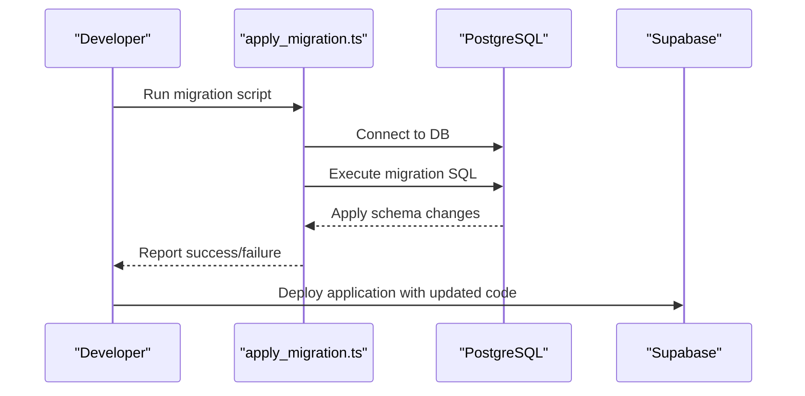
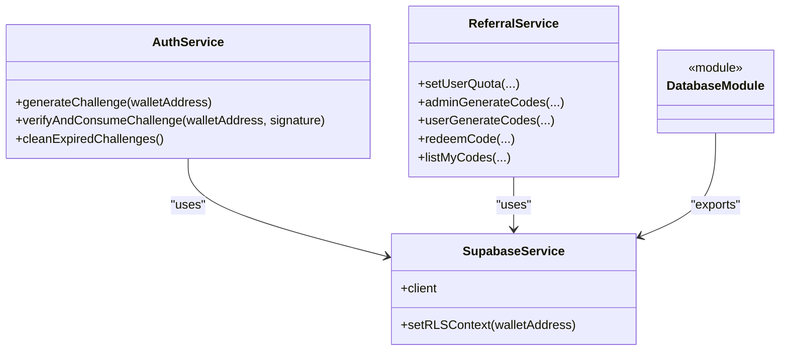
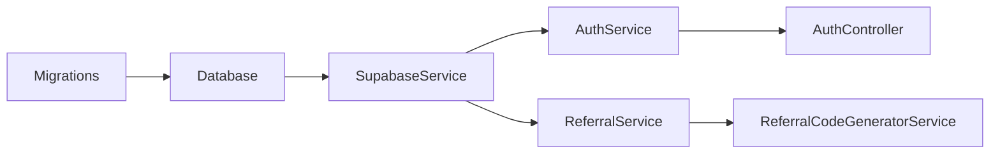

# Migration Management

<cite>
**Referenced Files in This Document**
- [20260118210000_remove_legacy_wallet_fields.sql](file://supabase/migrations/20260118210000_remove_legacy_wallet_fields.sql)
- [20260128140000_add_auth_challenges.sql](file://supabase/migrations/20260128140000_add_auth_challenges.sql)
- [20260128143000_fix_auth_rls.sql](file://supabase/migrations/202601281430000_fix_auth_rls.sql)
- [20260129000000_update_schema_v2.sql](file://supabase/migrations/20260129000000_update_schema_v2.sql)
- [20260218000000_add_agent_api_keys.sql](file://supabase/migrations/20260218000000_add_agent_api_keys.sql)
- [20260218010000_add_rotate_api_key_function.sql](file://supabase/migrations/20260218010000_add_rotate_api_key_function.sql)
- [20260308000000_add_canvases_and_account_status.sql](file://supabase/migrations/20260308000000_add_canvases_and_account_status.sql)
- [20260320090000_add_referral_system.sql](file://supabase/migrations/20260320090000_add_referral_system.sql)
- [initial-1.sql](file://src/database/schema/initial-1.sql)
- [initial-2-auth-challenges.sql](file://src/database/schema/initial-2-auth-challenges.sql)
- [supabase.service.ts](file://src/database/supabase.service.ts)
- [apply_migration.ts](file://scripts/apply_migration.ts)
- [full_system_test.ts](file://scripts/full_system_test.ts)
- [auth.service.ts](file://src/auth/auth.service.ts)
- [auth.controller.ts](file://src/auth/auth.controller.ts)
- [referral.service.ts](file://src/referral/referral.service.ts)
- [referral-code-generator.service.ts](file://src/referral/referral-code-generator.service.ts)
- [database.module.ts](file://src/database/database.module.ts)
</cite>

## Table of Contents
1. [Introduction](#introduction)
2. [Project Structure](#project-structure)
3. [Core Components](#core-components)
4. [Architecture Overview](#architecture-overview)
5. [Detailed Component Analysis](#detailed-component-analysis)
6. [Dependency Analysis](#dependency-analysis)
7. [Performance Considerations](#performance-considerations)
8. [Troubleshooting Guide](#troubleshooting-guide)
9. [Conclusion](#conclusion)
10. [Appendices](#appendices)

## Introduction
This document provides comprehensive migration management guidance for PinTool’s database evolution. It documents the migration history from legacy wallet fields removal to authentication challenges addition and the referral system implementation. It explains the migration strategy, versioning approach, rollback procedures, and the relationship between database schema changes and application code updates. It also outlines testing procedures, production deployment strategy, best practices for future migrations, and troubleshooting steps.

## Project Structure
PinTool organizes database migrations under the Supabase migrations directory and maintains application-side database integration via a dedicated service module. The migration files are named with timestamps to enforce chronological ordering and include both schema changes and helper functions. Application components interact with the database through a shared Supabase service.

```mermaid
graph TB
subgraph "Migrations"
M1["20260118210000_remove_legacy_wallet_fields.sql"]
M2["20260128140000_add_auth_challenges.sql"]
M3["202601281430000_fix_auth_rls.sql"]
M4["20260129000000_update_schema_v2.sql"]
M5["20260218000000_add_agent_api_keys.sql"]
M6["20260218010000_add_rotate_api_key_function.sql"]
M7["20260308000000_add_canvases_and_account_status.sql"]
M8["20260320090000_add_referral_system.sql"]
end
subgraph "Application"
Svc["SupabaseService"]
AuthSvc["AuthService"]
RefSvc["ReferralService"]
DBMod["DatabaseModule"]
end
M1 --> Svc
M2 --> Svc
M3 --> Svc
M4 --> Svc
M5 --> Svc
M6 --> Svc
M7 --> Svc
M8 --> Svc
AuthSvc --> Svc
RefSvc --> Svc
DBMod --> Svc
```

**Diagram sources**
- [20260118210000_remove_legacy_wallet_fields.sql:1-56](file://supabase/migrations/20260118210000_remove_legacy_wallet_fields.sql#L1-L56)
- [20260128140000_add_auth_challenges.sql:1-7](file://supabase/migrations/20260128140000_add_auth_challenges.sql#L1-L7)
- [20260128143000_fix_auth_rls.sql:1-21](file://supabase/migrations/20260128143000_fix_auth_rls.sql#L1-L21)
- [20260129000000_update_schema_v2.sql:1-39](file://supabase/migrations/20260129000000_update_schema_v2.sql#L1-L39)
- [20260218000000_add_agent_api_keys.sql:1-48](file://supabase/migrations/20260218000000_add_agent_api_keys.sql#L1-L48)
- [20260218010000_add_rotate_api_key_function.sql:1-27](file://supabase/migrations/20260218010000_add_rotate_api_key_function.sql#L1-L27)
- [20260308000000_add_canvases_and_account_status.sql:1-45](file://supabase/migrations/20260308000000_add_canvases_and_account_status.sql#L1-L45)
- [20260320090000_add_referral_system.sql:1-195](file://supabase/migrations/20260320090000_add_referral_system.sql#L1-L195)
- [supabase.service.ts:1-42](file://src/database/supabase.service.ts#L1-L42)
- [auth.service.ts:1-165](file://src/auth/auth.service.ts#L1-L165)
- [referral.service.ts:1-364](file://src/referral/referral.service.ts#L1-L364)
- [database.module.ts:1-10](file://src/database/database.module.ts#L1-L10)

**Section sources**
- [20260118210000_remove_legacy_wallet_fields.sql:1-56](file://supabase/migrations/20260118210000_remove_legacy_wallet_fields.sql#L1-L56)
- [20260128140000_add_auth_challenges.sql:1-7](file://supabase/migrations/20260128140000_add_auth_challenges.sql#L1-L7)
- [20260128143000_fix_auth_rls.sql:1-21](file://supabase/migrations/20260128143000_fix_auth_rls.sql#L1-L21)
- [20260129000000_update_schema_v2.sql:1-39](file://supabase/migrations/20260129000000_update_schema_v2.sql#L1-L39)
- [20260218000000_add_agent_api_keys.sql:1-48](file://supabase/migrations/20260218000000_add_agent_api_keys.sql#L1-L48)
- [20260218010000_add_rotate_api_key_function.sql:1-27](file://supabase/migrations/20260218010000_add_rotate_api_key_function.sql#L1-L27)
- [20260308000000_add_canvases_and_account_status.sql:1-45](file://supabase/migrations/20260308000000_add_canvases_and_account_status.sql#L1-L45)
- [20260320090000_add_referral_system.sql:1-195](file://supabase/migrations/20260320090000_add_referral_system.sql#L1-L195)
- [supabase.service.ts:1-42](file://src/database/supabase.service.ts#L1-L42)
- [database.module.ts:1-10](file://src/database/database.module.ts#L1-L10)

## Core Components
- SupabaseService: Centralized database client initialization and RLS context helper used by application services.
- AuthService: Generates and verifies authentication challenges, interacts with the auth_challenges table, and cleans expired entries.
- ReferralService: Manages referral codes, quotas, and redemption via stored procedures/functions exposed through RPC calls.
- DatabaseModule: Provides global export of SupabaseService for dependency injection across the application.

**Section sources**
- [supabase.service.ts:1-42](file://src/database/supabase.service.ts#L1-L42)
- [auth.service.ts:1-165](file://src/auth/auth.service.ts#L1-L165)
- [referral.service.ts:1-364](file://src/referral/referral.service.ts#L1-L364)
- [database.module.ts:1-10](file://src/database/database.module.ts#L1-L10)

## Architecture Overview
The migration lifecycle spans database schema changes and application code updates. Migrations are applied in chronological order using timestamped filenames. Application services rely on SupabaseService for database access and use RPC functions for domain-specific operations like referral code management and API key rotation.

**Diagram sources**
- [apply_migration.ts:38-73](file://scripts/apply_migration.ts#L38-L73)
- [20260129000000_update_schema_v2.sql:1-39](file://supabase/migrations/20260129000000_update_schema_v2.sql#L1-L39)

## Detailed Component Analysis

### Migration Strategy and Versioning
- Timestamp-based versioning ensures deterministic ordering and prevents conflicts.
- Each migration file encapsulates a single logical change with optional rollback comments.
- Rollback instructions are embedded within migration files to support recovery.

**Section sources**
- [20260118210000_remove_legacy_wallet_fields.sql:46-56](file://supabase/migrations/20260118210000_remove_legacy_wallet_fields.sql#L46-L56)
- [20260320090000_add_referral_system.sql:1-195](file://supabase/migrations/20260320090000_add_referral_system.sql#L1-L195)

### Legacy Wallet Fields Removal (20260118210000)
Purpose:
- Remove legacy self-managed wallet fields after migrating to Crossmint-managed wallets.

Changes:
- Drops indexes and constraints on old columns.
- Removes account_address, encrypted_private_key, and encryption_method.
- Adds a unique constraint on crossmint_wallet_address.

Impact:
- Ensures uniqueness of Crossmint-managed wallet addresses.
- Requires all existing accounts to be migrated prior to enforcing NOT NULL constraints.

Rollback:
- Re-adds removed columns, restores constraints, and re-enables uniqueness on the old address field.

**Section sources**
- [20260118210000_remove_legacy_wallet_fields.sql:1-56](file://supabase/migrations/20260118210000_remove_legacy_wallet_fields.sql#L1-L56)

### Authentication Challenges Addition (20260128140000)
Purpose:
- Introduce a temporary challenge table for wallet signature authentication.

Changes:
- Creates auth_challenges table with wallet_address primary key, challenge text, and expiration timestamp.

Impact:
- Enables secure, time-bound authentication flows requiring wallet signatures.

**Section sources**
- [20260128140000_add_auth_challenges.sql:1-7](file://supabase/migrations/20260128140000_add_auth_challenges.sql#L1-L7)

### Authentication RLS Fix (20260128143000)
Purpose:
- Enforce Row Level Security (RLS) and restrict access to the auth_challenges table.

Changes:
- Enables RLS on auth_challenges.
- Grants full access to service_role and postgres.
- Revokes access from anon and authenticated roles.

Impact:
- Prevents unauthorized access to authentication challenges.

**Section sources**
- [20260128143000_fix_auth_rls.sql:1-21](file://supabase/migrations/20260128143000_fix_auth_rls.sql#L1-L21)

### Schema Update v2 (20260129000000)
Purpose:
- Enhance workflows and executions for frontend history UI and performance.

Changes:
- Renames is_active to is_public on workflows.
- Adds definition_snapshot to workflow_executions.
- Allows account_id to be nullable in workflow_executions.
- Adds indexes for owner_wallet_address, workflow_id, and account_id.

Impact:
- Improves query performance for user history and stats.
- Supports system/notification workflows without associated wallets.

**Section sources**
- [20260129000000_update_schema_v2.sql:1-39](file://supabase/migrations/20260129000000_update_schema_v2.sql#L1-L39)

### Agent API Keys (202602180000)
Purpose:
- Introduce user_type and API key management for agents.

Changes:
- Adds user_type to users with a check constraint.
- Creates api_keys table with indexes and a partial unique index for one active key per wallet.
- Enables RLS and grants service_role access.
- Revokes access from anon and authenticated.

Impact:
- Supports agent workflows with programmable API access.

**Section sources**
- [20260218000000_add_agent_api_keys.sql:1-48](file://supabase/migrations/20260218000000_add_agent_api_keys.sql#L1-L48)

### Rotate API Key Function (20260218010000)
Purpose:
- Provide atomic key rotation to prevent race conditions.

Changes:
- Creates rotate_api_key function to deactivate existing active keys and insert a new active key.

Impact:
- Ensures thread-safe key rotation for agent API keys.

**Section sources**
- [20260218010000_add_rotate_api_key_function.sql:1-27](file://supabase/migrations/20260218010000_add_rotate_api_key_function.sql#L1-L27)

### Canvases and Account Status (20260308000000)
Purpose:
- Support draft workflow designs and improve account lifecycle management.

Changes:
- Creates canvases table with owner_wallet_address foreign key.
- Adds canvas_id to workflows with an index.
- Replaces accounts.is_active with a status enum (inactive, active, closed) and migrates existing data.

Impact:
- Enables workflow design drafts and clearer account state transitions.

**Section sources**
- [20260308000000_add_canvases_and_account_status.sql:1-45](file://supabase/migrations/20260308000000_add_canvases_and_account_status.sql#L1-L45)

### Referral System (20260320090000)
Purpose:
- Implement referral codes, quotas, and redemption with administrative controls.

Changes:
- Adds app_role to users for admin authorization.
- Creates referral_codes and referral_user_quotas tables with indexes and RLS.
- Adds helper RPCs: reserve_referral_quota, release_referral_quota, and consume_referral_code.

Impact:
- Provides a robust referral program with quota management and auditability.

**Section sources**
- [20260320090000_add_referral_system.sql:1-195](file://supabase/migrations/20260320090000_add_referral_system.sql#L1-L195)

### Relationship Between Schema Changes and Application Code
- SupabaseService initializes the database client and sets RLS context for wallet-scoped operations.
- AuthService interacts with auth_challenges for challenge generation and verification.
- ReferralService uses RPC functions for quota reservation, release, and code consumption.
- DatabaseModule provides centralized access to SupabaseService across the application.

**Diagram sources**
- [supabase.service.ts:1-42](file://src/database/supabase.service.ts#L1-L42)
- [auth.service.ts:1-165](file://src/auth/auth.service.ts#L1-L165)
- [referral.service.ts:1-364](file://src/referral/referral.service.ts#L1-L364)
- [database.module.ts:1-10](file://src/database/database.module.ts#L1-L10)

## Dependency Analysis
- Migrations depend on PostgreSQL capabilities (e.g., DO blocks, RLS, indexes).
- Application services depend on SupabaseService for database access.
- ReferralService depends on stored procedures/functions created by the referral migration.
- AuthService depends on the auth_challenges table created by earlier migrations.

**Diagram sources**
- [20260128140000_add_auth_challenges.sql:1-7](file://supabase/migrations/20260128140000_add_auth_challenges.sql#L1-L7)
- [20260320090000_add_referral_system.sql:1-195](file://supabase/migrations/20260320090000_add_referral_system.sql#L1-L195)
- [supabase.service.ts:1-42](file://src/database/supabase.service.ts#L1-L42)
- [auth.service.ts:1-165](file://src/auth/auth.service.ts#L1-L165)
- [referral.service.ts:1-364](file://src/referral/referral.service.ts#L1-L364)
- [auth.controller.ts:1-49](file://src/auth/auth.controller.ts#L1-L49)
- [referral-code-generator.service.ts:1-50](file://src/referral/referral-code-generator.service.ts#L1-L50)

**Section sources**
- [supabase.service.ts:1-42](file://src/database/supabase.service.ts#L1-L42)
- [auth.service.ts:1-165](file://src/auth/auth.service.ts#L1-L165)
- [referral.service.ts:1-364](file://src/referral/referral.service.ts#L1-L364)
- [auth.controller.ts:1-49](file://src/auth/auth.controller.ts#L1-L49)
- [referral-code-generator.service.ts:1-50](file://src/referral/referral-code-generator.service.ts#L1-L50)

## Performance Considerations
- Indexes added in schema updates (e.g., owner_wallet_address, workflow_id, account_id) improve query performance for history and stats views.
- RLS policies and constraints ensure data integrity and reduce accidental exposure.
- Stored procedures for API key rotation and referral operations minimize race conditions and maintain consistency.

[No sources needed since this section provides general guidance]

## Troubleshooting Guide
Common issues and recovery procedures:
- Migration failures: Use embedded rollback comments within each migration file to revert changes safely.
- RLS access violations: Verify policies for auth_challenges, api_keys, and referral tables; ensure service_role has appropriate grants.
- Expired challenges: AuthService periodically cleans expired entries; confirm cron-like cleanup is functioning.
- Referral quota errors: Use reserve_referral_quota and release_referral_quota RPCs to manage quotas atomically.
- Testing RLS: Use the system test script to verify anonymous access restrictions and foreign key integrity.

**Section sources**
- [20260128143000_fix_auth_rls.sql:1-21](file://supabase/migrations/20260128143000_fix_auth_rls.sql#L1-L21)
- [20260320090000_add_referral_system.sql:74-101](file://supabase/migrations/20260320090000_add_referral_system.sql#L74-L101)
- [auth.service.ts:147-156](file://src/auth/auth.service.ts#L147-L156)
- [full_system_test.ts:113-121](file://scripts/full_system_test.ts#L113-L121)

## Conclusion
PinTool’s migration management follows a disciplined, timestamped approach with embedded rollback instructions and strong security practices (RLS). Each migration aligns with application-layer services that leverage SupabaseService and RPC functions. Coordinated deployments ensure schema changes and code updates are synchronized, minimizing downtime and risk.

[No sources needed since this section summarizes without analyzing specific files]

## Appendices

### Migration Execution Process
- Prepare environment variables for Supabase connection.
- Run the migration script to connect to the database and apply the desired migration.
- Validate migration success and deploy application code.

**Section sources**
- [apply_migration.ts:15-73](file://scripts/apply_migration.ts#L15-L73)

### Production Deployment Strategy
- Apply migrations in strict chronological order.
- Perform pre-deployment checks: RLS policy verification, index existence, and stored procedure availability.
- Conduct smoke tests to validate authentication challenges and referral operations.
- Monitor logs for expired challenge cleanup and migration outcomes.

**Section sources**
- [20260128143000_fix_auth_rls.sql:1-21](file://supabase/migrations/20260128143000_fix_auth_rls.sql#L1-L21)
- [full_system_test.ts:113-121](file://scripts/full_system_test.ts#L113-L121)

### Best Practices for Future Migrations
- Keep migrations atomic and reversible where possible.
- Add indexes alongside schema changes to maintain performance.
- Enforce RLS and proper grants for sensitive tables.
- Use stored procedures for complex operations to prevent race conditions.
- Include rollback instructions and rollback tests in CI.

[No sources needed since this section provides general guidance]