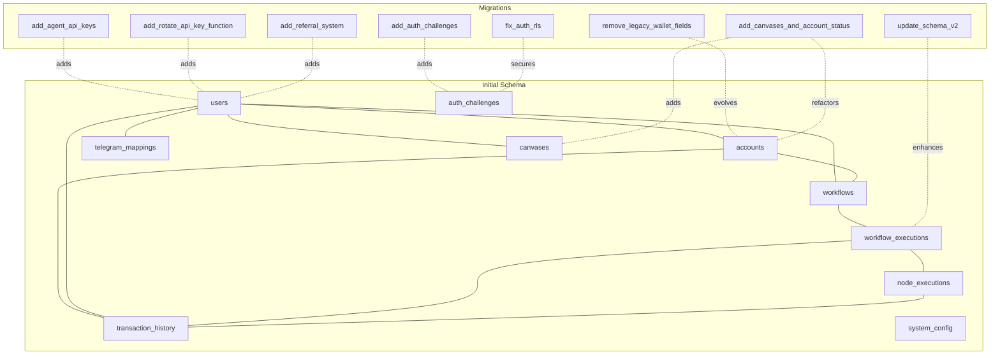
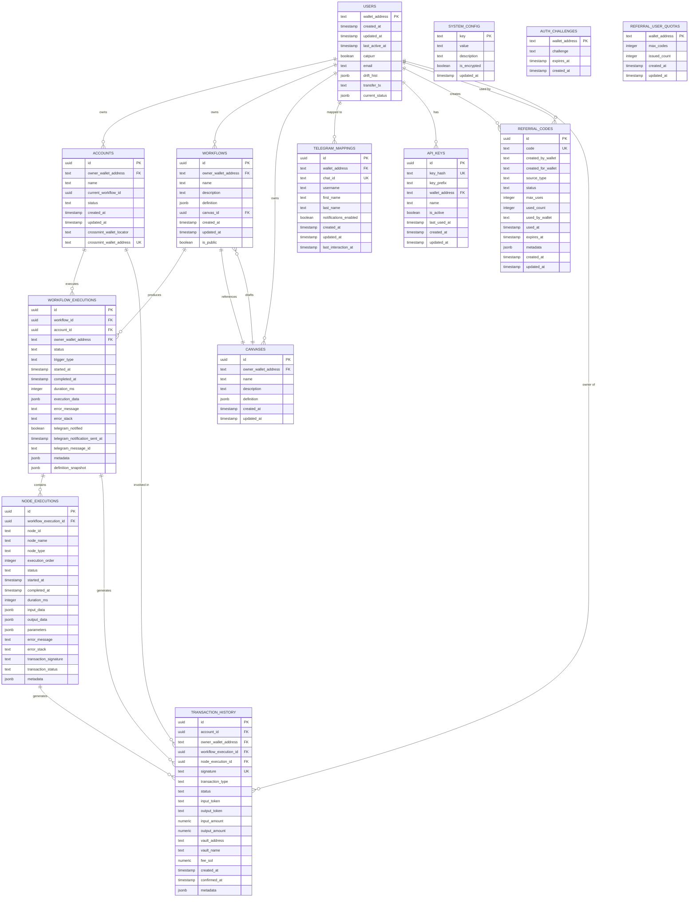
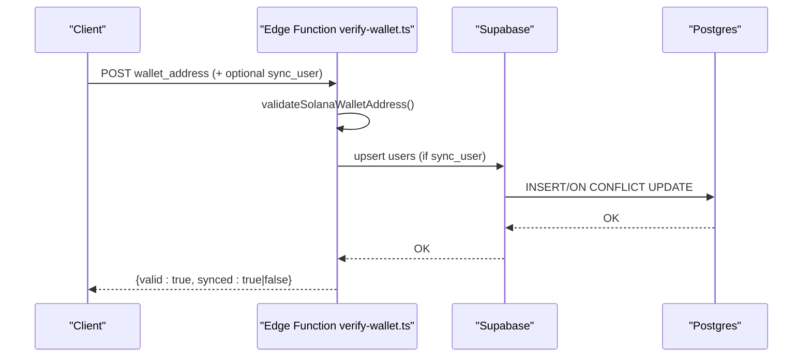
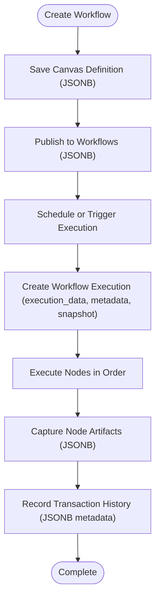
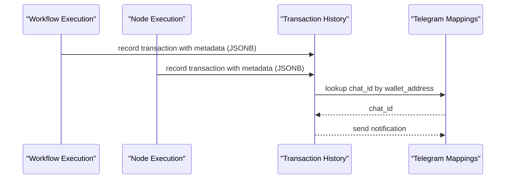
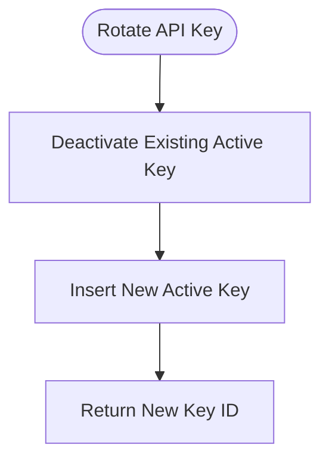
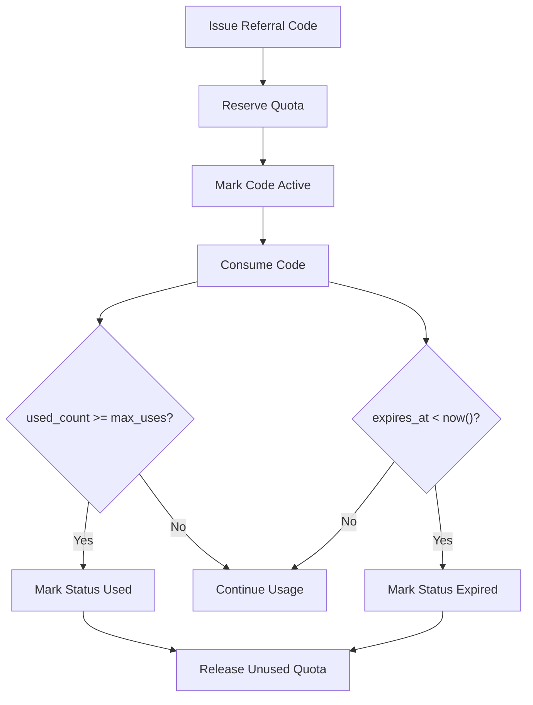
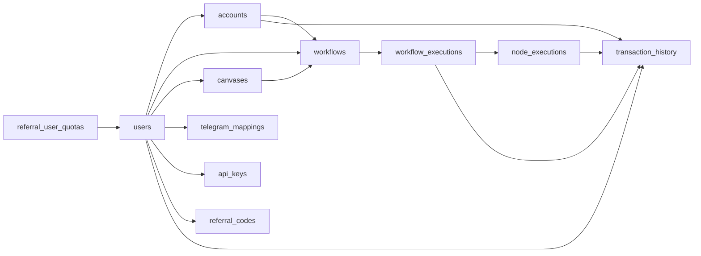

# Schema Overview

<cite>
**Referenced Files in This Document**
- [initial-1.sql](file://src/database/schema/initial-1.sql)
- [initial-2-auth-challenges.sql](file://src/database/schema/initial-2-auth-challenges.sql)
- [20260118210000_remove_legacy_wallet_fields.sql](file://supabase/migrations/20260118210000_remove_legacy_wallet_fields.sql)
- [20260128140000_add_auth_challenges.sql](file://supabase/migrations/20260128140000_add_auth_challenges.sql)
- [20260128143000_fix_auth_rls.sql](file://supabase/migrations/202601281430000_fix_auth_rls.sql)
- [20260129000000_update_schema_v2.sql](file://supabase/migrations/20260129000000_update_schema_v2.sql)
- [20260218000000_add_agent_api_keys.sql](file://supabase/migrations/20260218000000_add_agent_api_keys.sql)
- [20260218010000_add_rotate_api_key_function.sql](file://supabase/migrations/20260218010000_add_rotate_api_key_function.sql)
- [20260308000000_add_canvases_and_account_status.sql](file://supabase/migrations/20260308000000_add_canvases_and_account_status.sql)
- [20260320090000_add_referral_system.sql](file://supabase/migrations/20260320090000_add_referral_system.sql)
- [supabase.service.ts](file://src/database/supabase.service.ts)
- [verify-wallet.ts](file://src/database/functions/verify-wallet.ts)
</cite>

## Table of Contents
1. [Introduction](#introduction)
2. [Project Structure](#project-structure)
3. [Core Components](#core-components)
4. [Architecture Overview](#architecture-overview)
5. [Detailed Component Analysis](#detailed-component-analysis)
6. [Dependency Analysis](#dependency-analysis)
7. [Performance Considerations](#performance-considerations)
8. [Troubleshooting Guide](#troubleshooting-guide)
9. [Conclusion](#conclusion)

## Introduction
This document presents a comprehensive schema overview of PinTool’s PostgreSQL database structure hosted on Supabase. It covers the entity relationship model across users, accounts, workflows, workflow executions, node executions, transaction history, canvases, telegram mappings, and system configuration tables. It also documents table relationships, foreign key constraints, referential integrity rules, and the strategic use of JSONB columns for flexible data storage. The design philosophy emphasizes flexibility through JSONB while maintaining referential integrity for critical relationships such as ownership and execution lineage.

## Project Structure
The database schema is defined via initial SQL files and evolved through a series of migrations. The initial schema establishes core entities and relationships. Subsequent migrations refine the schema to support advanced features like canvases, API keys, referral system, and enhanced indexing for performance.

**Diagram sources**
- [initial-1.sql:4-153](file://src/database/schema/initial-1.sql#L4-L153)
- [20260118210000_remove_legacy_wallet_fields.sql:1-56](file://supabase/migrations/20260118210000_remove_legacy_wallet_fields.sql#L1-L56)
- [20260128140000_add_auth_challenges.sql:1-7](file://supabase/migrations/20260128140000_add_auth_challenges.sql#L1-L7)
- [20260128143000_fix_auth_rls.sql:1-21](file://supabase/migrations/20260128143000_fix_auth_rls.sql#L1-L21)
- [20260129000000_update_schema_v2.sql:1-39](file://supabase/migrations/20260129000000_update_schema_v2.sql#L1-L39)
- [20260218000000_add_agent_api_keys.sql:1-48](file://supabase/migrations/20260218000000_add_agent_api_keys.sql#L1-L48)
- [20260218010000_add_rotate_api_key_function.sql:1-27](file://supabase/migrations/20260218010000_add_rotate_api_key_function.sql#L1-L27)
- [20260308000000_add_canvases_and_account_status.sql:1-45](file://supabase/migrations/20260308000000_add_canvases_and_account_status.sql#L1-L45)
- [20260320090000_add_referral_system.sql:1-195](file://supabase/migrations/20260320090000_add_referral_system.sql#L1-L195)

**Section sources**
- [initial-1.sql:1-153](file://src/database/schema/initial-1.sql#L1-L153)
- [20260118210000_remove_legacy_wallet_fields.sql:1-56](file://supabase/migrations/20260118210000_remove_legacy_wallet_fields.sql#L1-L56)
- [20260128140000_add_auth_challenges.sql:1-7](file://supabase/migrations/20260128140000_add_auth_challenges.sql#L1-L7)
- [20260128143000_fix_auth_rls.sql:1-21](file://supabase/migrations/20260128143000_fix_auth_rls.sql#L1-L21)
- [20260129000000_update_schema_v2.sql:1-39](file://supabase/migrations/20260129000000_update_schema_v2.sql#L1-L39)
- [20260218000000_add_agent_api_keys.sql:1-48](file://supabase/migrations/20260218000000_add_agent_api_keys.sql#L1-L48)
- [20260218010000_add_rotate_api_key_function.sql:1-27](file://supabase/migrations/20260218010000_add_rotate_api_key_function.sql#L1-L27)
- [20260308000000_add_canvases_and_account_status.sql:1-45](file://supabase/migrations/20260308000000_add_canvases_and_account_status.sql#L1-L45)
- [20260320090000_add_referral_system.sql:1-195](file://supabase/migrations/20260320090000_add_referral_system.sql#L1-L195)

## Core Components
This section outlines the primary tables and their roles in the system, focusing on ownership, execution, and notification domains.

- users
  - Primary key: wallet_address
  - Notable columns: email (unique), drift_hist (JSONB), transfer_tx (text), current_status (JSONB)
  - Constraints: catpurr boolean check; JSONB fields for flexible user state
  - Purpose: Identity and profile for human and agent users

- accounts
  - Primary key: id
  - Foreign keys: owner_wallet_address -> users(wallet_address)
  - Constraints: status enum with values inactive, active, closed
  - Notes: Legacy columns removed; crossmint_wallet_address is unique
  - Purpose: Account container for workflows and transactions

- workflows
  - Primary key: id
  - Foreign keys: owner_wallet_address -> users(wallet_address), canvas_id -> canvases(id) ON DELETE SET NULL
  - Notable columns: definition (JSONB), is_public (boolean), canvas_id (nullable)
  - Purpose: Defines executable automation blueprints

- workflow_executions
  - Primary key: id
  - Foreign keys: workflow_id -> workflows(id), account_id -> accounts(id), owner_wallet_address -> users(wallet_address)
  - Notable columns: execution_data (JSONB), metadata (JSONB), definition_snapshot (JSONB), telegram_* fields
  - Constraints: status enum; trigger_type enum
  - Purpose: Tracks runs of workflows, including scheduling and Telegram notifications

- node_executions
  - Primary key: id
  - Foreign key: workflow_execution_id -> workflow_executions(id)
  - Notable columns: input_data, output_data, parameters, metadata (all JSONB), error_message, error_stack
  - Constraints: status enum
  - Purpose: Captures individual node-level execution details and artifacts

- transaction_history
  - Primary key: id
  - Unique: signature
  - Foreign keys: account_id -> accounts(id), owner_wallet_address -> users(wallet_address), workflow_execution_id -> workflow_executions(id), node_execution_id -> node_executions(id)
  - Notable columns: metadata (JSONB), amounts (numeric), fees (numeric), statuses
  - Constraints: transaction_type enum, status enum
  - Purpose: Records on-chain transaction events tied to accounts and executions

- canvases
  - Primary key: id
  - Foreign key: owner_wallet_address -> users(wallet_address)
  - Notable columns: definition (JSONB), description (text)
  - Purpose: Stores draft workflow designs prior to publishing

- telegram_mappings
  - Primary key: id
  - Foreign key: wallet_address -> users(wallet_address)
  - Notable columns: chat_id (unique), username, first_name, last_name, notifications_enabled, last_interaction_at
  - Purpose: Maps wallet identities to Telegram chat identifiers for notifications

- system_config
  - Primary key: key
  - Notable columns: value (text), description (text), is_encrypted (boolean)
  - Purpose: Centralized configuration store

- auth_challenges
  - Primary key: wallet_address
  - Purpose: Temporary challenge records for wallet authentication

- api_keys
  - Primary key: id
  - Foreign key: wallet_address -> users(wallet_address)
  - Notable columns: key_hash (unique), key_prefix, name, is_active, last_used_at
  - Constraints: partial unique index enforcing one active key per wallet
  - Purpose: Secure API access tokens per wallet

- referral_codes
  - Primary key: id
  - Notable columns: code (unique), created_by_wallet, created_for_wallet, source_type, status, max_uses, used_count, used_by_wallet, expires_at, metadata (JSONB)
  - Purpose: Referral program codes with usage limits and expiration

- referral_user_quotas
  - Primary key: wallet_address
  - Foreign key: wallet_address -> users(wallet_address)
  - Notable columns: max_codes, issued_count
  - Purpose: Enforces per-user issuance quotas for referral codes

**Section sources**
- [initial-1.sql:4-153](file://src/database/schema/initial-1.sql#L4-L153)
- [20260118210000_remove_legacy_wallet_fields.sql:23-43](file://supabase/migrations/20260118210000_remove_legacy_wallet_fields.sql#L23-L43)
- [20260218000000_add_agent_api_keys.sql:7-17](file://supabase/migrations/20260218000000_add_agent_api_keys.sql#L7-L17)
- [20260308000000_add_canvases_and_account_status.sql:10-20](file://supabase/migrations/20260308000000_add_canvases_and_account_status.sql#L10-L20)
- [20260320090000_add_referral_system.sql:32-48](file://supabase/migrations/20260320090000_add_referral_system.sql#L32-L48)

## Architecture Overview
The schema centers around a wallet-address-based identity model. Ownership is enforced via foreign keys from accounts, workflows, canvases, and telegram_mappings to users. Executions form a nested hierarchy: workflows produce workflow_executions, which produce node_executions, and both are tracked in transaction_history. Notification mapping ties wallet identities to Telegram chats. Flexible JSONB columns enable extensibility without sacrificing referential integrity for core relationships.

**Diagram sources**
- [initial-1.sql:4-153](file://src/database/schema/initial-1.sql#L4-L153)
- [20260308000000_add_canvases_and_account_status.sql:10-20](file://supabase/migrations/20260308000000_add_canvases_and_account_status.sql#L10-L20)
- [20260320090000_add_referral_system.sql:32-48](file://supabase/migrations/20260320090000_add_referral_system.sql#L32-L48)

## Detailed Component Analysis

### Authentication and Identity
- users
  - Ownership enforcement: all related entities reference users(wallet_address)
  - JSONB fields: drift_hist, current_status for flexible state storage
  - Additional attributes: email (unique), catpurr flag
- auth_challenges
  - Temporary challenge table for wallet authentication
  - Row Level Security enabled and restricted to service_role
- Supabase RLS context
  - Application sets RLS config app.current_wallet to scope queries per wallet

**Diagram sources**
- [verify-wallet.ts:109-229](file://src/database/functions/verify-wallet.ts#L109-L229)
- [supabase.service.ts:33-40](file://src/database/supabase.service.ts#L33-L40)

**Section sources**
- [initial-1.sql:105-116](file://src/database/schema/initial-1.sql#L105-L116)
- [20260128140000_add_auth_challenges.sql:1-7](file://supabase/migrations/20260128140000_add_auth_challenges.sql#L1-L7)
- [20260128143000_fix_auth_rls.sql:1-21](file://supabase/migrations/20260128143000_fix_auth_rls.sql#L1-L21)
- [verify-wallet.ts:109-229](file://src/database/functions/verify-wallet.ts#L109-L229)
- [supabase.service.ts:33-40](file://src/database/supabase.service.ts#L33-L40)

### Workflows, Executions, and Node Execution
- workflows
  - definition (JSONB) stores the complete workflow graph and configuration
  - is_public controls visibility; canvas_id links to drafts
- workflow_executions
  - execution_data (JSONB) captures runtime state
  - metadata (JSONB) stores auxiliary info
  - definition_snapshot (JSONB) preserves immutable snapshot for history replay
  - telegram_* fields manage Telegram notifications
- node_executions
  - input_data, output_data, parameters, metadata (JSONB) capture node-specific artifacts
  - error_message and error_stack preserve failure context

**Diagram sources**
- [initial-1.sql:140-153](file://src/database/schema/initial-1.sql#L140-L153)
- [initial-1.sql:117-139](file://src/database/schema/initial-1.sql#L117-L139)
- [initial-1.sql:36-57](file://src/database/schema/initial-1.sql#L36-L57)
- [20260129000000_update_schema_v2.sql:18-38](file://supabase/migrations/20260129000000_update_schema_v2.sql#L18-L38)

**Section sources**
- [initial-1.sql:140-153](file://src/database/schema/initial-1.sql#L140-L153)
- [initial-1.sql:117-139](file://src/database/schema/initial-1.sql#L117-L139)
- [initial-1.sql:36-57](file://src/database/schema/initial-1.sql#L36-L57)
- [20260129000000_update_schema_v2.sql:18-38](file://supabase/migrations/20260129000000_update_schema_v2.sql#L18-L38)

### Transaction Tracking and Notification
- transaction_history
  - Uniqueness on signature ensures idempotent recording
  - Foreign keys tie transactions to accounts, owners, workflow_executions, and node_executions
  - metadata (JSONB) stores arbitrary transaction details
- telegram_mappings
  - Maps wallet_address to chat_id (unique) for notifications
  - notifications_enabled toggles opt-in/out

**Diagram sources**
- [initial-1.sql:80-104](file://src/database/schema/initial-1.sql#L80-L104)
- [initial-1.sql:66-79](file://src/database/schema/initial-1.sql#L66-L79)

**Section sources**
- [initial-1.sql:80-104](file://src/database/schema/initial-1.sql#L80-L104)
- [initial-1.sql:66-79](file://src/database/schema/initial-1.sql#L66-L79)

### System Configuration and API Keys
- system_config
  - key-value store with optional encryption flag
- api_keys
  - key_hash (unique), key_prefix, name, is_active
  - Partial unique index ensures one active key per wallet
  - rotate_api_key function atomically rotates keys to prevent race conditions

**Diagram sources**
- [20260218010000_add_rotate_api_key_function.sql:2-26](file://supabase/migrations/20260218010000_add_rotate_api_key_function.sql#L2-L26)
- [20260218000000_add_agent_api_keys.sql:7-26](file://supabase/migrations/20260218000000_add_agent_api_keys.sql#L7-L26)

**Section sources**
- [initial-1.sql:58-65](file://src/database/schema/initial-1.sql#L58-L65)
- [20260218000000_add_agent_api_keys.sql:7-26](file://supabase/migrations/20260218000000_add_agent_api_keys.sql#L7-L26)
- [20260218010000_add_rotate_api_key_function.sql:2-26](file://supabase/migrations/20260218010000_add_rotate_api_key_function.sql#L2-L26)

### Referral System
- referral_codes
  - code (unique), created_by_wallet, created_for_wallet, source_type, status, max_uses, used_count, used_by_wallet, expires_at, metadata (JSONB)
  - Status lifecycle: active, used, revoked, expired
- referral_user_quotas
  - wallet_address (PK), max_codes, issued_count
- Helper functions
  - reserve_referral_quota: reserves issuance quota
  - release_referral_quota: releases unused quota
  - consume_referral_code: consumes a code atomically

**Diagram sources**
- [20260320090000_add_referral_system.sql:32-48](file://supabase/migrations/20260320090000_add_referral_system.sql#L32-L48)
- [20260320090000_add_referral_system.sql:106-187](file://supabase/migrations/20260320090000_add_referral_system.sql#L106-L187)

**Section sources**
- [20260320090000_add_referral_system.sql:32-48](file://supabase/migrations/20260320090000_add_referral_system.sql#L32-L48)
- [20260320090000_add_referral_system.sql:106-187](file://supabase/migrations/20260320090000_add_referral_system.sql#L106-L187)

## Dependency Analysis
This section maps dependencies among tables and highlights how migrations evolve the schema.

**Diagram sources**
- [initial-1.sql:4-153](file://src/database/schema/initial-1.sql#L4-L153)
- [20260308000000_add_canvases_and_account_status.sql:10-30](file://supabase/migrations/20260308000000_add_canvases_and_account_status.sql#L10-L30)
- [20260320090000_add_referral_system.sql:32-72](file://supabase/migrations/20260320090000_add_referral_system.sql#L32-L72)

**Section sources**
- [initial-1.sql:4-153](file://src/database/schema/initial-1.sql#L4-L153)
- [20260308000000_add_canvases_and_account_status.sql:10-30](file://supabase/migrations/20260308000000_add_canvases_and_account_status.sql#L10-L30)
- [20260320090000_add_referral_system.sql:32-72](file://supabase/migrations/20260320090000_add_referral_system.sql#L32-L72)

## Performance Considerations
- Indexes introduced by migrations:
  - workflow_executions: owner_wallet_address, workflow_id
  - transaction_history: account_id
- These indexes optimize common queries for user history, workflow statistics, and account activity.
- JSONB columns enable flexible storage without denormalization, reducing schema churn while preserving query performance through targeted indexes.

**Section sources**
- [20260129000000_update_schema_v2.sql:27-38](file://supabase/migrations/20260129000000_update_schema_v2.sql#L27-L38)

## Troubleshooting Guide
- Authentication challenges
  - Ensure auth_challenges RLS policy allows service_role access and denies anon/authenticated
  - Verify RLS context is set via SupabaseService.setRLSContext(walletAddress)
- API key rotation
  - Use rotate_api_key function to avoid race conditions during concurrent rotations
  - Confirm partial unique index enforces one active key per wallet
- Referral system
  - Use reserve_referral_quota and release_referral_quota to manage quotas
  - consume_referral_code updates status and timestamps atomically; verify expiry and usage checks
- Transaction history
  - Signature uniqueness prevents duplicate entries; confirm foreign keys resolve to valid rows

**Section sources**
- [20260128143000_fix_auth_rls.sql:1-21](file://supabase/migrations/20260128143000_fix_auth_rls.sql#L1-L21)
- [supabase.service.ts:33-40](file://src/database/supabase.service.ts#L33-L40)
- [20260218010000_add_rotate_api_key_function.sql:2-26](file://supabase/migrations/20260218010000_add_rotate_api_key_function.sql#L2-L26)
- [20260320090000_add_referral_system.sql:106-187](file://supabase/migrations/20260320090000_add_referral_system.sql#L106-L187)

## Conclusion
PinTool’s database schema balances flexibility and integrity. JSONB columns in workflows, canvases, executions, and transaction metadata enable rapid iteration and extensibility. Strict foreign keys and enums maintain referential integrity for ownership, execution lineage, and transaction semantics. Migrations consistently enhance performance and introduce capabilities such as canvases, API keys, and the referral system, all while preserving a coherent, wallet-centric data model.