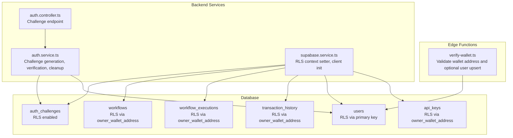
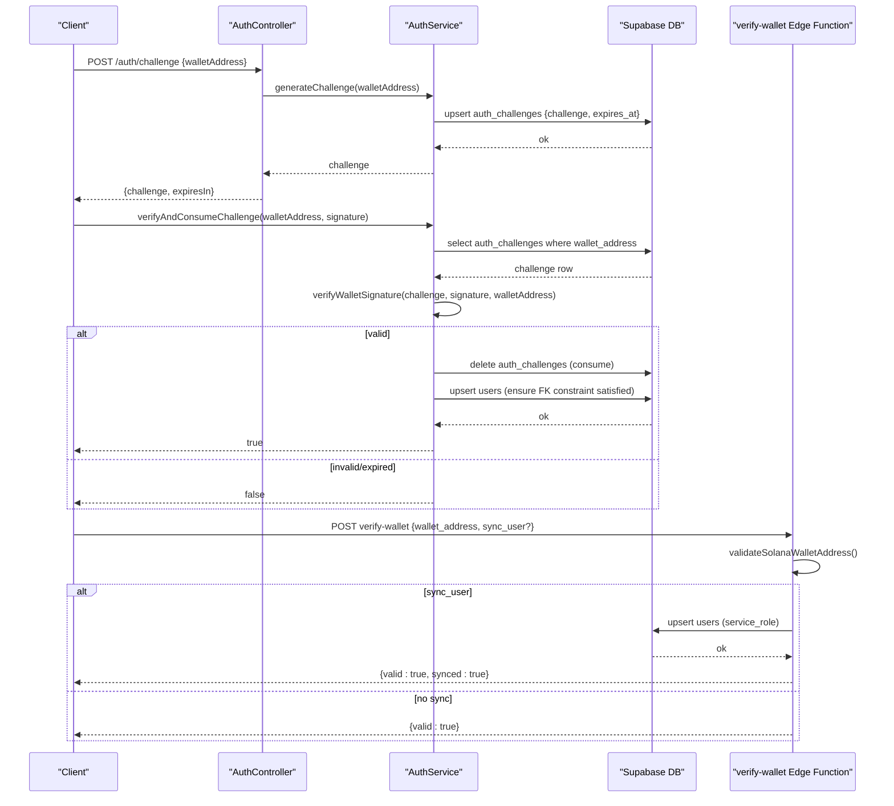
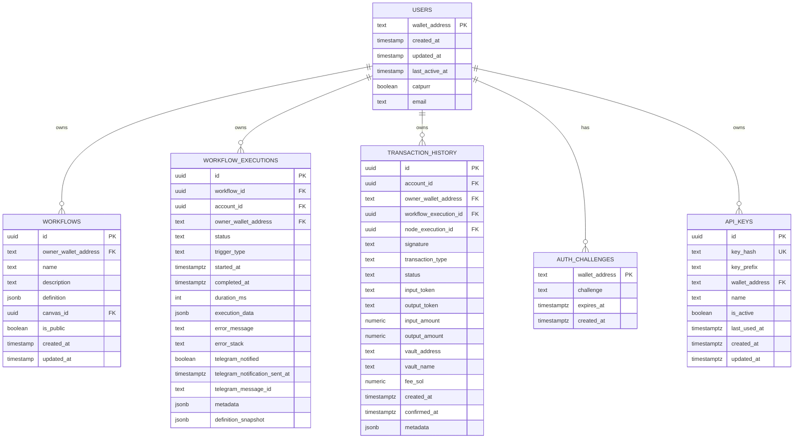
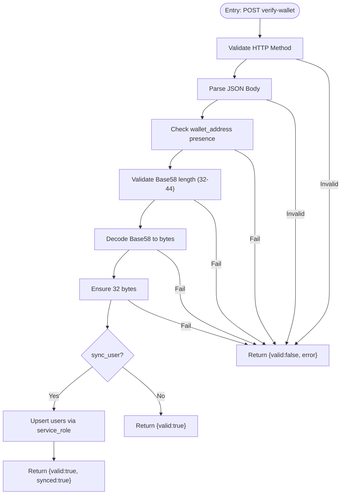
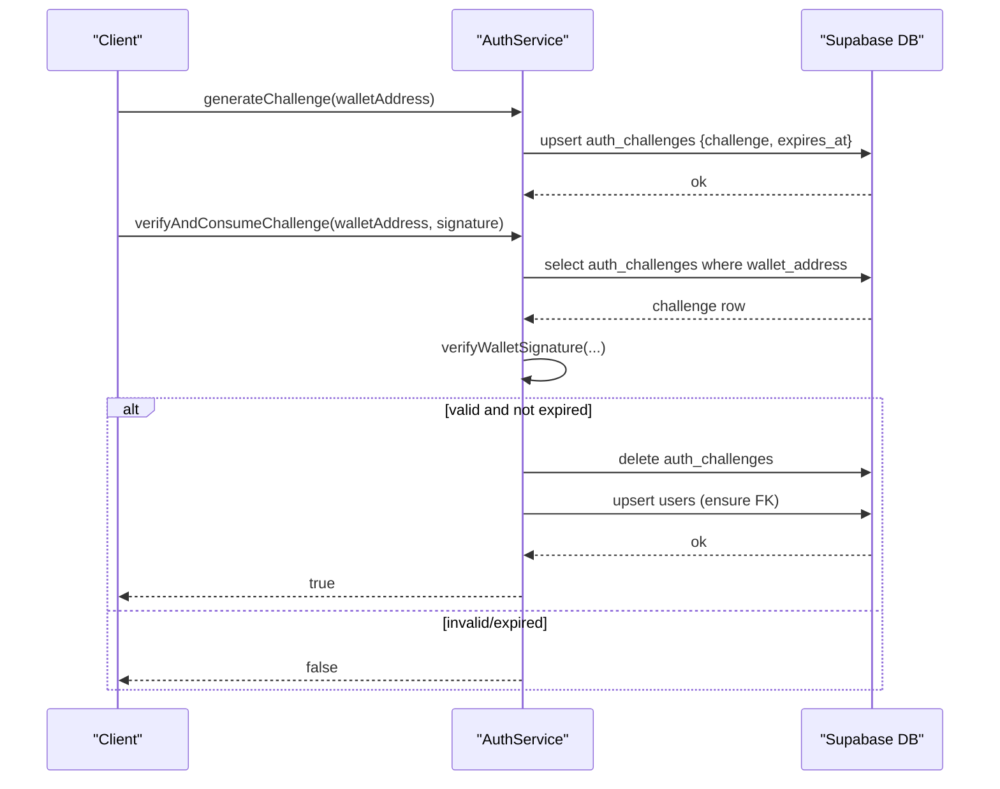
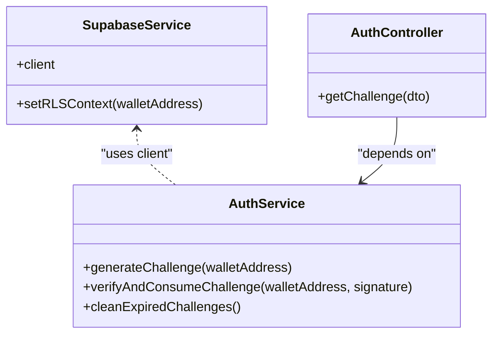
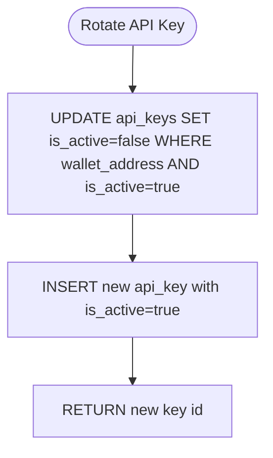
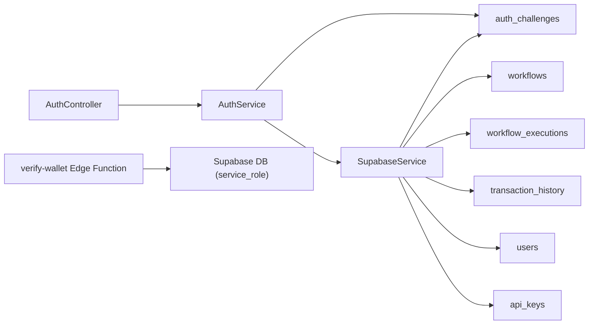

# Security and Access Control

<cite>
**Referenced Files in This Document**
- [verify-wallet.ts](file://src/database/functions/verify-wallet.ts)
- [wallet-challenge.dto.ts](file://src/auth/dto/wallet-challenge.dto.ts)
- [auth.service.ts](file://src/auth/auth.service.ts)
- [auth.controller.ts](file://src/auth/auth.controller.ts)
- [supabase.service.ts](file://src/database/supabase.service.ts)
- [initial-1.sql](file://src/database/schema/initial-1.sql)
- [initial-2-auth-challenges.sql](file://src/database/schema/initial-2-auth-challenges.sql)
- [20260128140000_add_auth_challenges.sql](file://supabase/migrations/20260128140000_add_auth_challenges.sql)
- [20260128143000_fix_auth_rls.sql](file://supabase/migrations/202601281430000_fix_auth_rls.sql)
- [20260129000000_update_schema_v2.sql](file://supabase/migrations/20260129000000_update_schema_v2.sql)
- [20260218000000_add_agent_api_keys.sql](file://supabase/migrations/20260218000000_add_agent_api_keys.sql)
- [20260218010000_add_rotate_api_key_function.sql](file://supabase/migrations/20260218010000_add_rotate_api_key_function.sql)
- [full_system_test.ts](file://scripts/full_system_test.ts)
</cite>

## Table of Contents
1. [Introduction](#introduction)
2. [Project Structure](#project-structure)
3. [Core Components](#core-components)
4. [Architecture Overview](#architecture-overview)
5. [Detailed Component Analysis](#detailed-component-analysis)
6. [Dependency Analysis](#dependency-analysis)
7. [Performance Considerations](#performance-considerations)
8. [Troubleshooting Guide](#troubleshooting-guide)
9. [Conclusion](#conclusion)
10. [Appendices](#appendices)

## Introduction
This document details the security and access control model for PinTool’s database implementation. It explains Row Level Security (RLS) policies ensuring data isolation, the verify-wallet function for wallet address validation and optional user synchronization, the authentication challenge system stored in the auth_challenges table and its role in preventing replay attacks, database user roles and permissions, and security considerations for JSONB data storage, SQL injection prevention, and data validation. Privacy and compliance considerations are addressed alongside practical guidance for protecting sensitive information such as API keys, transaction details, and user data.

## Project Structure
PinTool’s security model spans:
- Supabase-managed database with RLS-enabled tables and migrations
- Edge Function for wallet verification and optional user upsert
- Backend services for challenge generation, signature verification, and RLS context setting
- DTOs and controllers enforcing input validation and API contracts

**Diagram sources**
- [verify-wallet.ts:1-231](file://src/database/functions/verify-wallet.ts#L1-L231)
- [auth.controller.ts:1-49](file://src/auth/auth.controller.ts#L1-L49)
- [auth.service.ts:1-165](file://src/auth/auth.service.ts#L1-L165)
- [supabase.service.ts:1-42](file://src/database/supabase.service.ts#L1-L42)
- [initial-1.sql:105-153](file://src/database/schema/initial-1.sql#L105-L153)
- [20260128140000_add_auth_challenges.sql:1-7](file://supabase/migrations/20260128140000_add_auth_challenges.sql#L1-L7)
- [20260218000000_add_agent_api_keys.sql:1-47](file://supabase/migrations/20260218000000_add_agent_api_keys.sql#L1-L47)

**Section sources**
- [initial-1.sql:1-153](file://src/database/schema/initial-1.sql#L1-L153)
- [20260128140000_add_auth_challenges.sql:1-7](file://supabase/migrations/20260128140000_add_auth_challenges.sql#L1-L7)
- [20260128143000_fix_auth_rls.sql:1-21](file://supabase/migrations/20260128143000_fix_auth_rls.sql#L1-L21)
- [20260218000000_add_agent_api_keys.sql:1-47](file://supabase/migrations/20260218000000_add_agent_api_keys.sql#L1-L47)

## Core Components
- Row Level Security (RLS) policies on core tables enforce per-wallet access boundaries.
- The auth_challenges table stores short-lived challenges with strict RLS and revocations for anonymous and authenticated roles.
- The verify-wallet Edge Function validates wallet addresses and optionally upserts users using a service role key.
- The backend auth service generates challenges, verifies signatures, and consumes challenges to prevent reuse.
- Supabase service sets the RLS context variable to bind queries to the authenticated wallet.

**Section sources**
- [20260128143000_fix_auth_rls.sql:1-21](file://supabase/migrations/20260128143000_fix_auth_rls.sql#L1-L21)
- [verify-wallet.ts:109-229](file://src/database/functions/verify-wallet.ts#L109-L229)
- [auth.service.ts:27-91](file://src/auth/auth.service.ts#L27-L91)
- [supabase.service.ts:33-40](file://src/database/supabase.service.ts#L33-L40)

## Architecture Overview
The security architecture combines cryptographic wallet signatures, short-lived challenges, and database-level access controls:

**Diagram sources**
- [auth.controller.ts:36-47](file://src/auth/auth.controller.ts#L36-L47)
- [auth.service.ts:27-91](file://src/auth/auth.service.ts#L27-L91)
- [verify-wallet.ts:139-204](file://src/database/functions/verify-wallet.ts#L139-L204)

## Detailed Component Analysis

### Row Level Security (RLS) Policies and Data Isolation
- RLS is enabled on auth_challenges and enforced via explicit policies granting service_role full access and revoking access from anon and authenticated.
- Core data tables (users, workflows, workflow_executions, transaction_history) rely on foreign keys anchored to users’ wallet_address to enforce per-wallet isolation.
- Additional indexing improves query performance for history views and stats while maintaining access control.

**Diagram sources**
- [initial-1.sql:105-153](file://src/database/schema/initial-1.sql#L105-L153)
- [20260128140000_add_auth_challenges.sql:1-7](file://supabase/migrations/20260128140000_add_auth_challenges.sql#L1-L7)
- [20260218000000_add_agent_api_keys.sql:1-47](file://supabase/migrations/20260218000000_add_agent_api_keys.sql#L1-L47)

**Section sources**
- [20260128143000_fix_auth_rls.sql:1-21](file://supabase/migrations/20260128143000_fix_auth_rls.sql#L1-L21)
- [20260129000000_update_schema_v2.sql:27-39](file://supabase/migrations/20260129000000_update_schema_v2.sql#L27-L39)

### verify-wallet Function Implementation
- Validates Solana wallet addresses using Base58 decoding and length checks.
- Optionally upserts the user into the users table using a service role key to bypass RLS during synchronization.
- Enforces CORS and method checks, returning structured errors for invalid requests.

**Diagram sources**
- [verify-wallet.ts:63-107](file://src/database/functions/verify-wallet.ts#L63-L107)
- [verify-wallet.ts:155-204](file://src/database/functions/verify-wallet.ts#L155-L204)

**Section sources**
- [verify-wallet.ts:109-229](file://src/database/functions/verify-wallet.ts#L109-L229)

### Authentication Challenge System (auth_challenges)
- Challenges are short-lived (5 minutes) and stored per wallet_address with expiration timestamps.
- Signature verification uses ed25519 against the stored challenge message.
- After successful verification, the challenge is consumed (deleted) to prevent replay.
- Background cleanup removes expired challenges periodically.

**Diagram sources**
- [auth.service.ts:27-91](file://src/auth/auth.service.ts#L27-L91)
- [20260128140000_add_auth_challenges.sql:1-7](file://supabase/migrations/20260128140000_add_auth_challenges.sql#L1-L7)
- [20260128143000_fix_auth_rls.sql:1-21](file://supabase/migrations/20260128143000_fix_auth_rls.sql#L1-L21)

**Section sources**
- [auth.controller.ts:36-47](file://src/auth/auth.controller.ts#L36-L47)
- [auth.service.ts:147-156](file://src/auth/auth.service.ts#L147-L156)

### Database Roles, Permissions, and Access Patterns
- service_role: Full access to auth_challenges and api_keys tables; used by Edge Functions and backend for privileged operations.
- anon and authenticated: Revoked from auth_challenges and api_keys to prevent unauthorized access.
- RLS context variable app.current_wallet is set via RPC to constrain queries to the authenticated wallet.

**Diagram sources**
- [supabase.service.ts:33-40](file://src/database/supabase.service.ts#L33-L40)
- [auth.service.ts:27-91](file://src/auth/auth.service.ts#L27-L91)
- [auth.controller.ts:36-47](file://src/auth/auth.controller.ts#L36-L47)

**Section sources**
- [20260128143000_fix_auth_rls.sql:8-20](file://supabase/migrations/20260128143000_fix_auth_rls.sql#L8-L20)
- [20260218000000_add_agent_api_keys.sql:28-47](file://supabase/migrations/20260218000000_add_agent_api_keys.sql#L28-L47)
- [supabase.service.ts:33-40](file://src/database/supabase.service.ts#L33-L40)

### API Keys Management and Rotation
- api_keys table is RLS-enabled and constrained to a single active key per wallet via a partial unique index.
- rotate_api_key function atomically deactivates existing keys and inserts a new active key to prevent race conditions.

**Diagram sources**
- [20260218000000_add_agent_api_keys.sql:6-26](file://supabase/migrations/20260218000000_add_agent_api_keys.sql#L6-L26)
- [20260218010000_add_rotate_api_key_function.sql:1-26](file://supabase/migrations/20260218010000_add_rotate_api_key_function.sql#L1-L26)

**Section sources**
- [20260218000000_add_agent_api_keys.sql:1-47](file://supabase/migrations/20260218000000_add_agent_api_keys.sql#L1-L47)
- [20260218010000_add_rotate_api_key_function.sql:1-26](file://supabase/migrations/20260218010000_add_rotate_api_key_function.sql#L1-L26)

### JSONB Data Storage, Validation, and Injection Prevention
- JSONB columns (definition, execution_data, metadata, etc.) store flexible data structures for workflows and executions.
- Validation occurs at the application level via DTOs and runtime checks; database constraints ensure acceptable values where defined.
- SQL injection is mitigated by using parameterized queries and avoiding dynamic SQL construction in favor of ORM-style operations.

**Section sources**
- [initial-1.sql:140-153](file://src/database/schema/initial-1.sql#L140-L153)
- [wallet-challenge.dto.ts:4-15](file://src/auth/dto/wallet-challenge.dto.ts#L4-L15)

## Dependency Analysis
- AuthController depends on AuthService for challenge lifecycle.
- AuthService uses SupabaseService client for database operations and RLS context management.
- Edge Function verify-wallet depends on Supabase service role credentials to upsert users.
- Database migrations define RLS policies and constraints that underpin access control.

**Diagram sources**
- [auth.controller.ts:1-49](file://src/auth/auth.controller.ts#L1-L49)
- [auth.service.ts:1-165](file://src/auth/auth.service.ts#L1-L165)
- [supabase.service.ts:1-42](file://src/database/supabase.service.ts#L1-L42)
- [verify-wallet.ts:155-204](file://src/database/functions/verify-wallet.ts#L155-L204)

**Section sources**
- [auth.controller.ts:1-49](file://src/auth/auth.controller.ts#L1-L49)
- [auth.service.ts:1-165](file://src/auth/auth.service.ts#L1-L165)
- [supabase.service.ts:1-42](file://src/database/supabase.service.ts#L1-L42)

## Performance Considerations
- Indexes on frequently queried columns (workflow_executions owner and workflow_id, transaction_history account_id) improve query performance for history and analytics views.
- Background cleanup of expired auth challenges reduces table bloat and maintains efficient lookups.
- RLS evaluation adds minimal overhead when properly indexed and scoped to wallet-bound columns.

**Section sources**
- [20260129000000_update_schema_v2.sql:27-39](file://supabase/migrations/20260129000000_update_schema_v2.sql#L27-L39)
- [auth.service.ts:147-156](file://src/auth/auth.service.ts#L147-L156)

## Troubleshooting Guide
- RLS penetration tests: Ensure anon cannot read auth_challenges; failures indicate misconfigured policies.
- Challenge lifecycle: Confirm challenges are created, verified, and consumed; expired challenges are cleaned up.
- Wallet verification: Validate address format and decoding; confirm optional user upsert succeeds when sync_user is requested.

**Section sources**
- [full_system_test.ts:113-121](file://scripts/full_system_test.ts#L113-L121)
- [auth.service.ts:147-156](file://src/auth/auth.service.ts#L147-L156)
- [verify-wallet.ts:139-204](file://src/database/functions/verify-wallet.ts#L139-L204)

## Conclusion
PinTool’s security model integrates cryptographic wallet authentication, short-lived challenges, and robust database-level access controls. RLS policies, explicit service_role grants, and revocations protect sensitive tables like auth_challenges and api_keys. The verify-wallet Edge Function and backend services enforce replay protection and user synchronization. JSONB storage is supported by application-level validation and database constraints. Together, these mechanisms provide strong isolation, integrity, and compliance readiness for user data, workflows, and execution records.

## Appendices

### Appendix A: Data Protection and Compliance Notes
- Use RLS to enforce tenant isolation and minimize data exposure.
- Store only hashed API keys and manage rotation atomically.
- Validate and sanitize inputs at the API boundary; rely on database constraints for structural integrity.
- Monitor and audit access to sensitive tables (auth_challenges, api_keys) using database logs and application telemetry.

[No sources needed since this section provides general guidance]