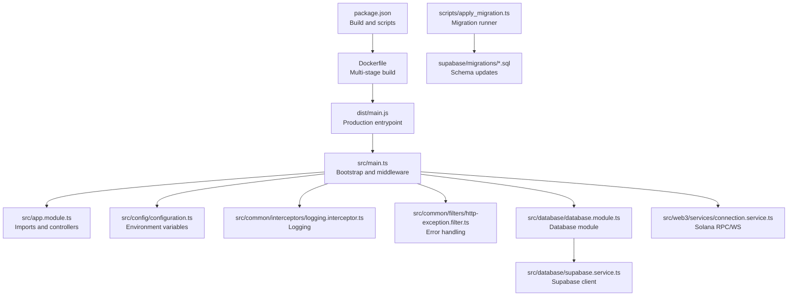
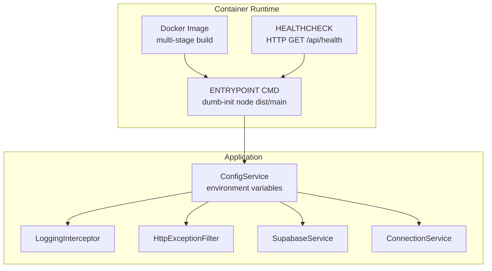
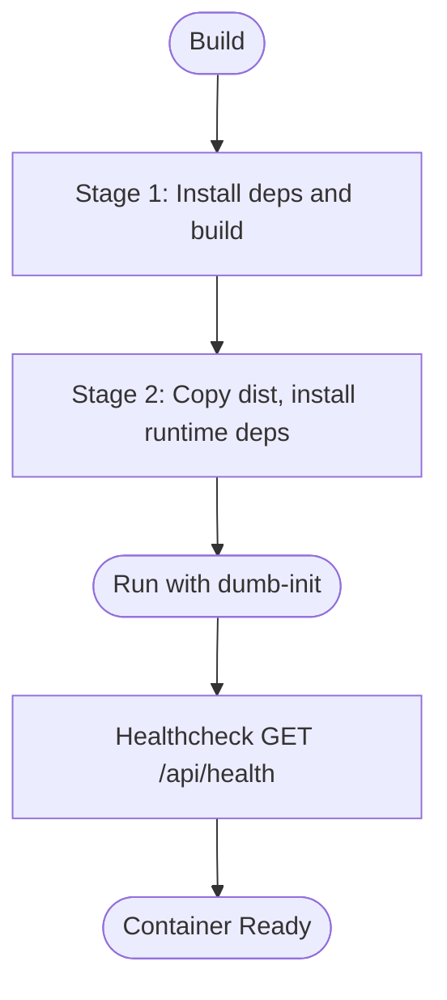
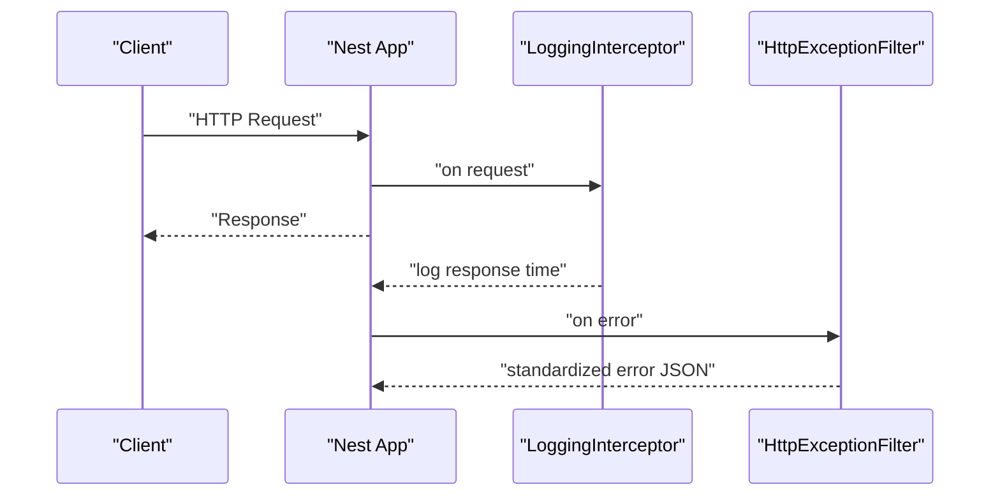
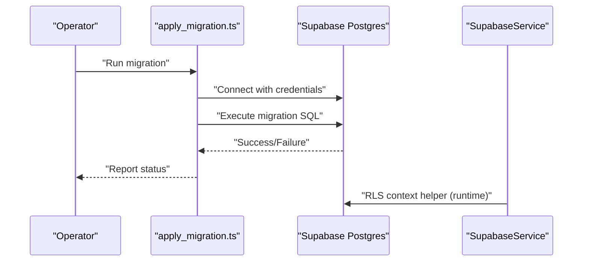
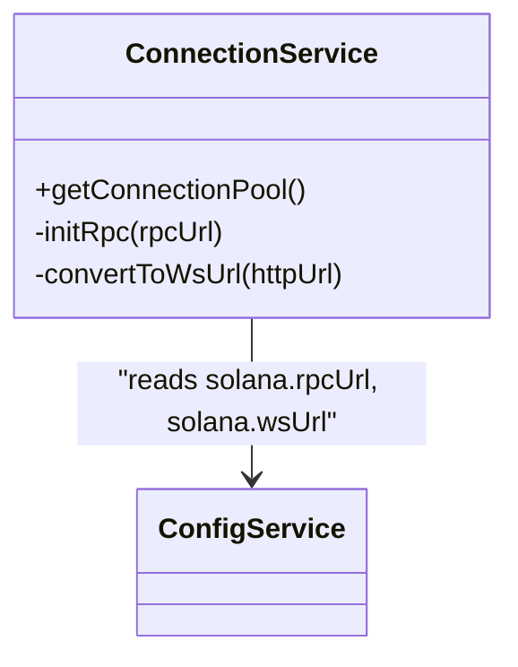
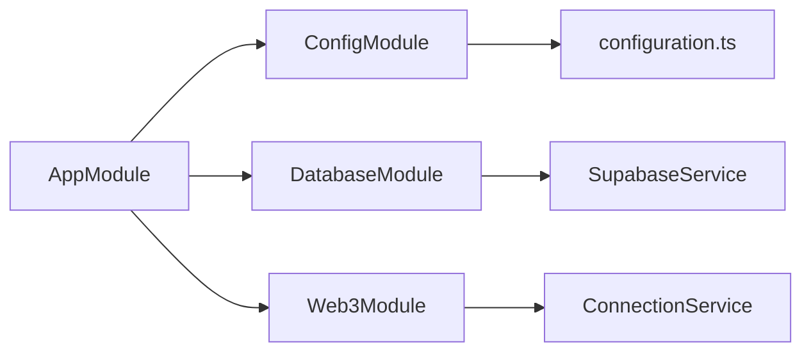

# Deployment and Operations

<cite>
**Referenced Files in This Document**
- [package.json](file://package.json)
- [Dockerfile](file://Dockerfile)
- [src/main.ts](file://src/main.ts)
- [src/app.module.ts](file://src/app.module.ts)
- [src/config/configuration.ts](file://src/config/configuration.ts)
- [src/common/interceptors/logging.interceptor.ts](file://src/common/interceptors/logging.interceptor.ts)
- [src/common/filters/http-exception.filter.ts](file://src/common/filters/http-exception.filter.ts)
- [src/database/database.module.ts](file://src/database/database.module.ts)
- [src/database/supabase.service.ts](file://src/database/supabase.service.ts)
- [src/web3/services/connection.service.ts](file://src/web3/services/connection.service.ts)
- [src/web3/utils/env.ts](file://src/web3/utils/env.ts)
- [scripts/apply_migration.ts](file://scripts/apply_migration.ts)
- [supabase/config.toml](file://supabase/config.toml)
</cite>

## Table of Contents
1. [Introduction](#introduction)
2. [Project Structure](#project-structure)
3. [Core Components](#core-components)
4. [Architecture Overview](#architecture-overview)
5. [Detailed Component Analysis](#detailed-component-analysis)
6. [Dependency Analysis](#dependency-analysis)
7. [Performance Considerations](#performance-considerations)
8. [Troubleshooting Guide](#troubleshooting-guide)
9. [Conclusion](#conclusion)
10. [Appendices](#appendices)

## Introduction
This document provides comprehensive deployment and operations guidance for the backend service. It covers production build and startup, containerization with Docker, environment configuration, deployment topology, monitoring and logging, health checks, performance optimization, scaling and high availability, database migration and maintenance, security hardening, and operational procedures tailored for a Web3 workflow automation platform.

## Project Structure
The backend is a NestJS application with modular design. Key operational aspects are defined in the build scripts, container image, runtime configuration, and environment-driven integrations.

**Diagram sources**
- [package.json:8-22](file://package.json#L8-L22)
- [Dockerfile:1-63](file://Dockerfile#L1-L63)
- [src/main.ts:9-81](file://src/main.ts#L9-L81)
- [src/app.module.ts:15-33](file://src/app.module.ts#L15-L33)
- [src/config/configuration.ts:1-45](file://src/config/configuration.ts#L1-L45)
- [src/common/interceptors/logging.interceptor.ts:5-20](file://src/common/interceptors/logging.interceptor.ts#L5-L20)
- [src/common/filters/http-exception.filter.ts:4-40](file://src/common/filters/http-exception.filter.ts#L4-L40)
- [src/database/database.module.ts:1-10](file://src/database/database.module.ts#L1-L10)
- [src/database/supabase.service.ts:1-42](file://src/database/supabase.service.ts#L1-L42)
- [src/web3/services/connection.service.ts:22-73](file://src/web3/services/connection.service.ts#L22-L73)
- [scripts/apply_migration.ts:1-74](file://scripts/apply_migration.ts#L1-L74)

**Section sources**
- [package.json:8-22](file://package.json#L8-L22)
- [Dockerfile:1-63](file://Dockerfile#L1-L63)
- [src/main.ts:9-81](file://src/main.ts#L9-L81)
- [src/app.module.ts:15-33](file://src/app.module.ts#L15-L33)
- [src/config/configuration.ts:1-45](file://src/config/configuration.ts#L1-L45)
- [src/common/interceptors/logging.interceptor.ts:5-20](file://src/common/interceptors/logging.interceptor.ts#L5-L20)
- [src/common/filters/http-exception.filter.ts:4-40](file://src/common/filters/http-exception.filter.ts#L4-L40)
- [src/database/database.module.ts:1-10](file://src/database/database.module.ts#L1-L10)
- [src/database/supabase.service.ts:1-42](file://src/database/supabase.service.ts#L1-L42)
- [src/web3/services/connection.service.ts:22-73](file://src/web3/services/connection.service.ts#L22-L73)
- [scripts/apply_migration.ts:1-74](file://scripts/apply_migration.ts#L1-L74)

## Core Components
- Build and start scripts define production build and runtime behavior.
- Dockerfile implements a multi-stage build, non-root user, health checks, and entrypoint.
- Runtime configuration loads environment variables for ports, CORS, Supabase, Telegram, Solana, Pyth, Crossmint, Helius, Lulo, Sanctum.
- Interceptors and filters standardize logging and error responses.
- Database module initializes Supabase client with service key and exposes helpers.
- Web3 services manage Solana RPC and WebSocket connections with environment-driven URLs.
- Migration script applies schema updates against Supabase-managed Postgres.

**Section sources**
- [package.json:8-22](file://package.json#L8-L22)
- [Dockerfile:32-63](file://Dockerfile#L32-L63)
- [src/config/configuration.ts:1-45](file://src/config/configuration.ts#L1-L45)
- [src/common/interceptors/logging.interceptor.ts:5-20](file://src/common/interceptors/logging.interceptor.ts#L5-L20)
- [src/common/filters/http-exception.filter.ts:4-40](file://src/common/filters/http-exception.filter.ts#L4-L40)
- [src/database/database.module.ts:1-10](file://src/database/database.module.ts#L1-L10)
- [src/database/supabase.service.ts:11-41](file://src/database/supabase.service.ts#L11-L41)
- [src/web3/services/connection.service.ts:30-72](file://src/web3/services/connection.service.ts#L30-L72)
- [scripts/apply_migration.ts:38-74](file://scripts/apply_migration.ts#L38-L74)

## Architecture Overview
The production runtime integrates configuration-driven services, database connectivity, and Web3 infrastructure. Health checks and logging are embedded in the container and application layers.

**Diagram sources**
- [Dockerfile:32-63](file://Dockerfile#L32-L63)
- [src/main.ts:9-81](file://src/main.ts#L9-L81)
- [src/config/configuration.ts:1-45](file://src/config/configuration.ts#L1-L45)
- [src/common/interceptors/logging.interceptor.ts:5-20](file://src/common/interceptors/logging.interceptor.ts#L5-L20)
- [src/common/filters/http-exception.filter.ts:4-40](file://src/common/filters/http-exception.filter.ts#L4-L40)
- [src/database/supabase.service.ts:11-41](file://src/database/supabase.service.ts#L11-L41)
- [src/web3/services/connection.service.ts:30-72](file://src/web3/services/connection.service.ts#L30-L72)

## Detailed Component Analysis

### Production Build and Startup
- Build: The build script compiles TypeScript sources into the dist directory.
- Production start: The production script executes the built main entrypoint using Node.js.
- Local development vs production: Scripts differentiate development and production modes.

Operational guidance:
- Build once, then run the production binary for minimal runtime overhead.
- Ensure environment variables are present before starting in production.

**Section sources**
- [package.json:8-22](file://package.json#L8-L22)
- [src/main.ts:65-77](file://src/main.ts#L65-L77)

### Containerization with Docker
- Multi-stage build: First stage installs dependencies and builds the app; second stage runs the app with a minimal runtime.
- Non-root user: Creates a dedicated user and switches to it for security.
- Health check: Uses HTTP GET against the health endpoint to determine container readiness.
- Entrypoint: Uses dumb-init to properly handle signals and PID 1 responsibilities.
- Exposed port: Default port is defined in the container; align with runtime configuration.

**Diagram sources**
- [Dockerfile:8-23](file://Dockerfile#L8-L23)
- [Dockerfile:32-63](file://Dockerfile#L32-L63)

**Section sources**
- [Dockerfile:8-23](file://Dockerfile#L8-L23)
- [Dockerfile:32-63](file://Dockerfile#L32-L63)

### Environment Configuration for Production
Configuration is loaded via a central configuration factory and consumed by services. Critical environment variables include:
- Server: PORT, NODE_ENV, CORS_ORIGIN
- Database: SUPABASE_URL, SUPABASE_SERVICE_KEY
- Notifications: TELEGRAM_BOT_TOKEN, TELEGRAM_NOTIFY_ENABLED, TELEGRAM_WEBHOOK_URL
- Blockchain: SOLANA_RPC_URL, SOLANA_WS_URL
- External APIs: PYTH_HERMES_ENDPOINT, CROSSMINT_SERVER_API_KEY, CROSSMINT_SIGNER_SECRET, CROSSMINT_ENVIRONMENT, HELIUS_API_KEY, LULO_API_KEY, SANCTUM_API_KEY

Best practices:
- Store secrets externally (e.g., secrets manager) and inject via environment variables.
- Keep CORS_ORIGIN restrictive in production.
- Use dedicated service keys for database access.

**Section sources**
- [src/config/configuration.ts:1-45](file://src/config/configuration.ts#L1-L45)
- [src/app.module.ts:17-20](file://src/app.module.ts#L17-L20)

### Monitoring and Logging Strategies
- Application logs: The logging interceptor records request method, URL, and response time.
- Error handling: The global exception filter standardizes error responses and logs errors with severity.
- Container logs: Docker captures stdout/stderr; integrate with centralized logging systems.
- Health checks: The container’s HEALTHCHECK probes the application’s health endpoint.

**Diagram sources**
- [src/common/interceptors/logging.interceptor.ts:7-18](file://src/common/interceptors/logging.interceptor.ts#L7-L18)
- [src/common/filters/http-exception.filter.ts:6-38](file://src/common/filters/http-exception.filter.ts#L6-L38)

**Section sources**
- [src/common/interceptors/logging.interceptor.ts:5-20](file://src/common/interceptors/logging.interceptor.ts#L5-L20)
- [src/common/filters/http-exception.filter.ts:4-40](file://src/common/filters/http-exception.filter.ts#L4-L40)
- [Dockerfile:54-56](file://Dockerfile#L54-L56)

### Database Connectivity and Migration
- Initialization: The database module constructs a Supabase client using service key and URL.
- RLS context: Helper method sets RLS configuration for wallet-scoped queries.
- Migration: A script connects to Supabase-managed Postgres and applies a specific migration file.

**Diagram sources**
- [scripts/apply_migration.ts:38-74](file://scripts/apply_migration.ts#L38-L74)
- [src/database/supabase.service.ts:11-41](file://src/database/supabase.service.ts#L11-L41)

**Section sources**
- [src/database/database.module.ts:1-10](file://src/database/database.module.ts#L1-L10)
- [src/database/supabase.service.ts:11-41](file://src/database/supabase.service.ts#L11-L41)
- [scripts/apply_migration.ts:38-74](file://scripts/apply_migration.ts#L38-L74)

### Web3 Infrastructure and External Dependencies
- Solana RPC/WS: The connection service initializes RPC and WebSocket clients from environment variables, with automatic protocol conversion for WS.
- External services: Configuration supports Pyth, Crossmint, Helius, Lulo, Sanctum via API keys and endpoints.

**Diagram sources**
- [src/web3/services/connection.service.ts:22-73](file://src/web3/services/connection.service.ts#L22-L73)
- [src/config/configuration.ts:18-21](file://src/config/configuration.ts#L18-L21)

**Section sources**
- [src/web3/services/connection.service.ts:30-72](file://src/web3/services/connection.service.ts#L30-L72)
- [src/web3/utils/env.ts:1-11](file://src/web3/utils/env.ts#L1-L11)
- [src/config/configuration.ts:18-43](file://src/config/configuration.ts#L18-L43)

### Security Hardening and Firewall Setup
- Container hardening: Non-root user, minimal base image, dumb-init for signal handling.
- Secrets management: Use environment variables for API keys and tokens; avoid embedding in images.
- Network exposure: Expose only necessary ports; restrict inbound traffic at the host/firewall level.
- TLS: Configure reverse proxy termination or use managed certificates; ensure outbound HTTPS to external services.

[No sources needed since this section provides general guidance]

### Scaling, Load Balancing, and High Availability
- Stateless design: The application is stateless; scale horizontally behind a load balancer.
- Health checks: Use the container’s health probe to gate traffic.
- Sticky sessions: Not required; keep application stateless.
- Database: Supabase-managed; rely on their HA and replication; tune connection pools accordingly.

[No sources needed since this section provides general guidance]

### Operational Procedures
- Build and deploy: Build once, containerize, then deploy to hosts or container orchestration.
- Environment rollout: Use environment-specific variables; validate with dry-run deployments.
- Rollouts: Prefer blue/green or rolling updates; monitor health probes and error rates.
- Backups: Coordinate with Supabase for database backups; maintain local snapshots of configuration and migration scripts.

[No sources needed since this section provides general guidance]

## Dependency Analysis
The application composes multiple modules and services driven by configuration. The database and Web3 services depend on environment variables.

**Diagram sources**
- [src/app.module.ts:15-33](file://src/app.module.ts#L15-L33)
- [src/config/configuration.ts:1-45](file://src/config/configuration.ts#L1-L45)
- [src/database/database.module.ts:1-10](file://src/database/database.module.ts#L1-L10)
- [src/database/supabase.service.ts:11-41](file://src/database/supabase.service.ts#L11-L41)
- [src/web3/services/connection.service.ts:30-72](file://src/web3/services/connection.service.ts#L30-L72)

**Section sources**
- [src/app.module.ts:15-33](file://src/app.module.ts#L15-L33)
- [src/config/configuration.ts:1-45](file://src/config/configuration.ts#L1-L45)
- [src/database/database.module.ts:1-10](file://src/database/database.module.ts#L1-L10)
- [src/database/supabase.service.ts:11-41](file://src/database/supabase.service.ts#L11-L41)
- [src/web3/services/connection.service.ts:30-72](file://src/web3/services/connection.service.ts#L30-L72)

## Performance Considerations
- Use production build and runtime to minimize overhead.
- Tune external RPC endpoints for latency and reliability; consider multiple providers.
- Apply connection pooling and reuse patterns where applicable.
- Monitor response times via logging interceptor and adjust resource allocation accordingly.

[No sources needed since this section provides general guidance]

## Troubleshooting Guide
Common production issues and remedies:
- Application fails to start: Verify environment variables and that the production binary exists.
- Database connection failures: Confirm Supabase URL and service key; check network reachability.
- Web3 connectivity issues: Validate RPC/WS URLs; ensure protocol conversion for WS endpoints.
- Health check failures: Inspect logs and ensure the health endpoint is reachable on the configured port.
- Error responses: Review standardized error logs for stack traces and error codes.

**Section sources**
- [src/main.ts:65-77](file://src/main.ts#L65-L77)
- [src/database/supabase.service.ts:15-17](file://src/database/supabase.service.ts#L15-L17)
- [src/web3/services/connection.service.ts:34-36](file://src/web3/services/connection.service.ts#L34-L36)
- [Dockerfile:54-56](file://Dockerfile#L54-L56)
- [src/common/filters/http-exception.filter.ts:28-38](file://src/common/filters/http-exception.filter.ts#L28-L38)

## Conclusion
This guide consolidates production deployment, containerization, operational management, and maintenance practices for the backend. By leveraging environment-driven configuration, robust logging and error handling, secure containerization, and careful database and Web3 integration, teams can operate a reliable Web3 workflow automation platform at scale.

[No sources needed since this section summarizes without analyzing specific files]

## Appendices

### Environment Variables Reference
- Server: PORT, NODE_ENV, CORS_ORIGIN
- Database: SUPABASE_URL, SUPABASE_SERVICE_KEY
- Notifications: TELEGRAM_BOT_TOKEN, TELEGRAM_NOTIFY_ENABLED, TELEGRAM_WEBHOOK_URL
- Blockchain: SOLANA_RPC_URL, SOLANA_WS_URL
- External APIs: PYTH_HERMES_ENDPOINT, CROSSMINT_SERVER_API_KEY, CROSSMINT_SIGNER_SECRET, CROSSMINT_ENVIRONMENT, HELIUS_API_KEY, LULO_API_KEY, SANCTUM_API_KEY

**Section sources**
- [src/config/configuration.ts:1-45](file://src/config/configuration.ts#L1-L45)

### Health Check Endpoint
- The container health check performs an HTTP GET against the application’s health endpoint on the configured port.

**Section sources**
- [Dockerfile:54-56](file://Dockerfile#L54-L56)

### Database Migration Workflow
- Use the migration script to apply schema updates to the Supabase-managed database using the project’s credentials.

**Section sources**
- [scripts/apply_migration.ts:38-74](file://scripts/apply_migration.ts#L38-L74)