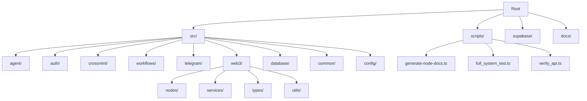
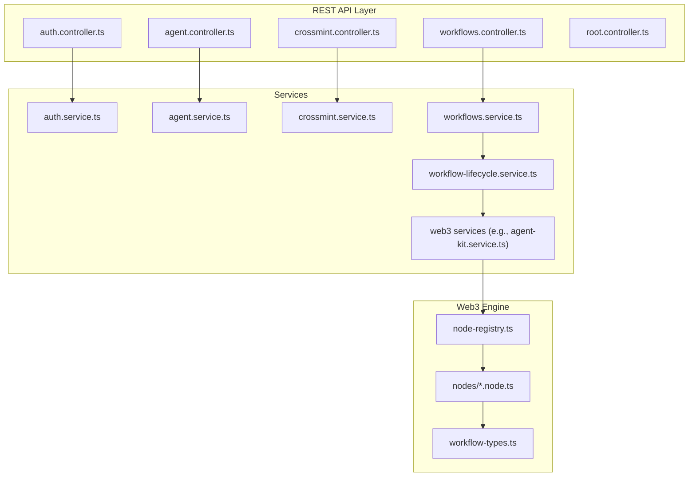
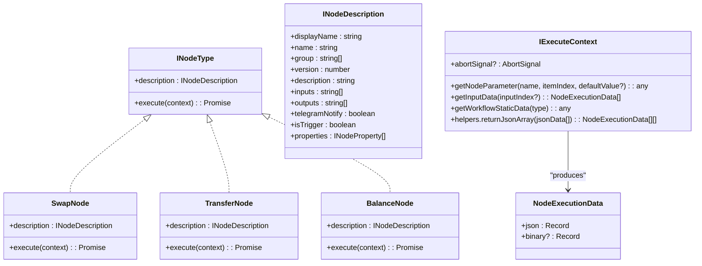
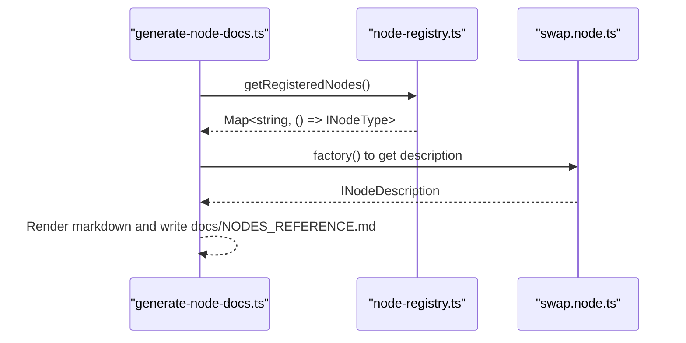
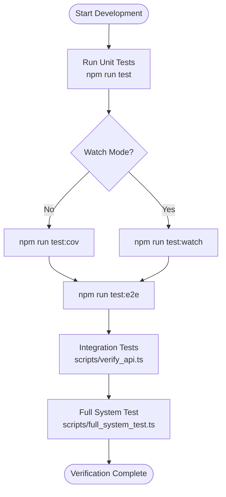
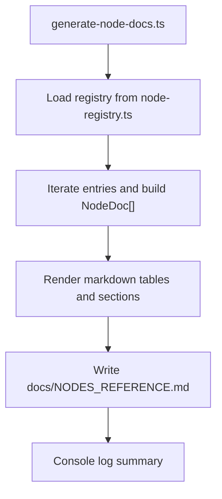
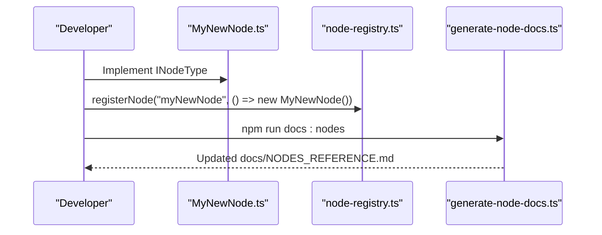
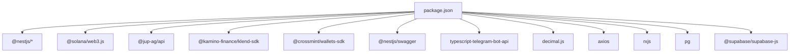

# Development Guide

<cite>
**Referenced Files in This Document**
- [package.json](file://package.json)
- [tsconfig.json](file://tsconfig.json)
- [.eslintrc.js](file://.eslintrc.js)
- [.prettierrc](file://.prettierrc)
- [nest-cli.json](file://nest-cli.json)
- [README.md](file://README.md)
- [SKILL.md](file://SKILL.md)
- [scripts/generate-node-docs.ts](file://scripts/generate-node-docs.ts)
- [scripts/full_system_test.ts](file://scripts/full_system_test.ts)
- [scripts/verify_api.ts](file://scripts/verify_api.ts)
- [src/web3/nodes/node-registry.ts](file://src/web3/nodes/node-registry.ts)
- [src/web3/workflow-types.ts](file://src/web3/workflow-types.ts)
- [src/web3/nodes/swap.node.ts](file://src/web3/nodes/swap.node.ts)
- [src/web3/nodes/transfer.node.ts](file://src/web3/nodes/transfer.node.ts)
- [src/web3/nodes/balance.node.ts](file://src/web3/nodes/balance.node.ts)
</cite>

## Table of Contents
1. [Introduction](#introduction)
2. [Project Structure](#project-structure)
3. [Core Components](#core-components)
4. [Architecture Overview](#architecture-overview)
5. [Detailed Component Analysis](#detailed-component-analysis)
6. [Dependency Analysis](#dependency-analysis)
7. [Performance Considerations](#performance-considerations)
8. [Troubleshooting Guide](#troubleshooting-guide)
9. [Conclusion](#conclusion)
10. [Appendices](#appendices)

## Introduction
This development guide provides a comprehensive overview of setting up the development environment, adhering to coding standards, and executing testing strategies for the backend service. It explains the development workflow using npm scripts, TypeScript configuration, ESLint and Prettier formatting, and the testing approach with unit, integration, and end-to-end tests. It also documents the codebase structure conventions, naming patterns, and architectural guidelines for extending the system, including adding new workflow nodes and integrating new DeFi protocols. Practical examples demonstrate running tests, generating documentation, and performing system verification. Finally, it covers debugging techniques, development server configuration, hot reload capabilities, continuous integration patterns, code quality checks, and contribution guidelines.

## Project Structure
The backend is a NestJS application written in TypeScript. The repository follows a feature-based structure with clear separation of concerns:
- src/ contains the application modules (agent, auth, crossmint, workflows, telegram, web3, database, common, config)
- scripts/ contains development and verification utilities
- supabase/ contains database migration files
- docs/ contains generated documentation (e.g., NODES_REFERENCE.md)

**Diagram sources**
- [README.md:27-54](file://README.md#L27-L54)
- [src/web3/nodes/node-registry.ts:1-47](file://src/web3/nodes/node-registry.ts#L1-L47)

**Section sources**
- [README.md:27-54](file://README.md#L27-L54)

## Core Components
This section outlines the essential development tools and configurations used across the project.

- npm scripts
  - Build: nest build
  - Format: prettier --write "src/**/*.ts"
  - Start: nest start
  - Dev/watch: nest start --watch
  - Debug: nest start --debug --watch
  - Production: node dist/main
  - Lint: eslint "{src,apps,libs,test}/**/*.ts" --fix
  - Docs generation: ts-node -P tsconfig.json scripts/generate-node-docs.ts
  - Unit tests: jest
  - Watch tests: jest --watch
  - Coverage: jest --coverage
  - Debug tests: node --inspect-brk -r tsconfig-paths/register -r ts-node/register node_modules/.bin/jest --runInWorker
  - E2E tests: jest --config ./test/jest-e2e.json

- TypeScript configuration
  - Target ES2021, source maps enabled, strictNullChecks disabled, skipLibCheck enabled
  - Path aliases configured for modular imports (@auth, @workflows, @telegram, @web3, @database, @common, @config)

- ESLint configuration
  - Uses @typescript-eslint parser and recommended rules
  - Extends plugin:prettier/recommended
  - Ignores database functions and linter config file
  - Rules tuned for developer productivity (e.g., no explicit-any, unused-vars warning with underscore ignore)

- Prettier configuration
  - Single quote, trailing comma, tab width 2, semicolons, print width 100, arrow parens always

- Nest CLI configuration
  - Source root set to src
  - Compiler options enable webpack and deleteOutDir

**Section sources**
- [package.json:8-22](file://package.json#L8-L22)
- [package.json:77-93](file://package.json#L77-L93)
- [tsconfig.json:1-55](file://tsconfig.json#L1-L55)
- [.eslintrc.js:1-29](file://.eslintrc.js#L1-L29)
- [.prettierrc:1-9](file://.prettierrc#L1-L9)
- [nest-cli.json:1-9](file://nest-cli.json#L1-L9)

## Architecture Overview
The backend is structured around NestJS modules and a Web3 workflow engine. The Web3 subsystem organizes DeFi operations as “nodes” that form Directed Acyclic Graphs (DAGs) in workflows. The node registry centralizes node registration and discovery. Services encapsulate Solana interactions, while controllers expose REST endpoints.

**Diagram sources**
- [src/web3/nodes/node-registry.ts:1-47](file://src/web3/nodes/node-registry.ts#L1-L47)
- [src/web3/workflow-types.ts:1-91](file://src/web3/workflow-types.ts#L1-L91)

## Detailed Component Analysis

### Web3 Node System and Workflow Types
The Web3 subsystem defines a node abstraction with a standardized description and execution interface. Nodes declare inputs/outputs, groups, and parameters. The registry aggregates all nodes and exposes them for discovery and execution.

**Diagram sources**
- [src/web3/workflow-types.ts:12-56](file://src/web3/workflow-types.ts#L12-L56)
- [src/web3/nodes/swap.node.ts:49-100](file://src/web3/nodes/swap.node.ts#L49-L100)
- [src/web3/nodes/transfer.node.ts:15-58](file://src/web3/nodes/transfer.node.ts#L15-L58)
- [src/web3/nodes/balance.node.ts:15-66](file://src/web3/nodes/balance.node.ts#L15-L66)

**Section sources**
- [src/web3/workflow-types.ts:12-91](file://src/web3/workflow-types.ts#L12-L91)
- [src/web3/nodes/swap.node.ts:49-209](file://src/web3/nodes/swap.node.ts#L49-L209)
- [src/web3/nodes/transfer.node.ts:15-199](file://src/web3/nodes/transfer.node.ts#L15-L199)
- [src/web3/nodes/balance.node.ts:15-196](file://src/web3/nodes/balance.node.ts#L15-L196)

### Node Registration and Discovery
The node registry centralizes node registration and exposes a map of node types to factories. This enables dynamic discovery and documentation generation.

**Diagram sources**
- [scripts/generate-node-docs.ts:152-168](file://scripts/generate-node-docs.ts#L152-L168)
- [src/web3/nodes/node-registry.ts:19-47](file://src/web3/nodes/node-registry.ts#L19-L47)
- [src/web3/nodes/swap.node.ts:50-100](file://src/web3/nodes/swap.node.ts#L50-L100)

**Section sources**
- [src/web3/nodes/node-registry.ts:1-47](file://src/web3/nodes/node-registry.ts#L1-L47)
- [scripts/generate-node-docs.ts:1-168](file://scripts/generate-node-docs.ts#L1-L168)

### Testing Strategy
The project employs unit tests with Jest, watch mode, coverage reporting, and end-to-end tests. Integration tests are supported via script-based verification and a comprehensive system test harness.

- Unit tests
  - Jest configuration in package.json targets src and uses ts-jest transformer
  - Tests are colocated alongside source files with .spec.ts suffix
  - Coverage collected under coverage/

- Watch and debug
  - npm run test:watch for iterative TDD
  - npm run test:cov for coverage reports
  - npm run test:debug for inspector-based debugging

- End-to-end tests
  - npm run test:e2e with a dedicated jest-e2e.json configuration

- Integration tests
  - scripts/verify_api.ts performs a quick verification of Crossmint wallet initialization and deletion flows
  - scripts/full_system_test.ts orchestrates multi-module tests including authentication, Crossmint wallet lifecycle, database integrity, and security checks

**Diagram sources**
- [package.json:17-21](file://package.json#L17-L21)
- [scripts/verify_api.ts:1-85](file://scripts/verify_api.ts#L1-L85)
- [scripts/full_system_test.ts:1-280](file://scripts/full_system_test.ts#L1-L280)

**Section sources**
- [package.json:77-93](file://package.json#L77-L93)
- [scripts/verify_api.ts:1-85](file://scripts/verify_api.ts#L1-L85)
- [scripts/full_system_test.ts:1-280](file://scripts/full_system_test.ts#L1-L280)

### Documentation Generation
The documentation generator reads the node registry, builds a markdown reference, and writes docs/NODES_REFERENCE.md. It supports parameter rendering, option lists, and section IDs for navigation.

**Diagram sources**
- [scripts/generate-node-docs.ts:152-168](file://scripts/generate-node-docs.ts#L152-L168)
- [src/web3/nodes/node-registry.ts:19-47](file://src/web3/nodes/node-registry.ts#L19-L47)

**Section sources**
- [scripts/generate-node-docs.ts:1-168](file://scripts/generate-node-docs.ts#L1-L168)

### Development Workflow and Hot Reload
- Development server
  - npm run start:dev enables watch mode for rapid iteration
  - npm run start:debug launches with inspector support for breakpoints
- Formatting and linting
  - npm run format applies Prettier across TypeScript files
  - npm run lint runs ESLint with autofix
- Building and production
  - npm run build compiles TypeScript to dist
  - npm run start:prod serves the compiled application

**Section sources**
- [package.json:8-14](file://package.json#L8-L14)
- [.prettierrc:1-9](file://.prettierrc#L1-L9)
- [.eslintrc.js:1-29](file://.eslintrc.js#L1-L29)

### Coding Standards and Conventions
- Naming patterns
  - Node classes follow PascalCase (e.g., SwapNode)
  - Node types are lowercase with hyphens (e.g., jupiterSwap)
  - Interfaces prefixed with I (e.g., INodeType, IExecuteContext)
- File organization
  - Feature-based modules under src/
  - Path aliases simplify imports across modules
- Validation and safety
  - Parameters validated via class-validator and runtime checks
  - Error handling returns structured JSON with success/error fields

**Section sources**
- [src/web3/nodes/swap.node.ts:49-100](file://src/web3/nodes/swap.node.ts#L49-L100)
- [src/web3/workflow-types.ts:12-56](file://src/web3/workflow-types.ts#L12-L56)
- [tsconfig.json:20-48](file://tsconfig.json#L20-L48)

### Extending Workflow Nodes
To add a new node:
1. Create a new class implementing INodeType in src/web3/nodes/
2. Define description fields (displayName, name, group, inputs, outputs, properties)
3. Implement execute(context) to handle node logic
4. Register the node in src/web3/nodes/node-registry.ts using registerNode
5. Generate updated documentation with npm run docs:nodes

**Diagram sources**
- [src/web3/nodes/node-registry.ts:12-21](file://src/web3/nodes/node-registry.ts#L12-L21)
- [scripts/generate-node-docs.ts:152-168](file://scripts/generate-node-docs.ts#L152-L168)

**Section sources**
- [src/web3/nodes/node-registry.ts:12-21](file://src/web3/nodes/node-registry.ts#L12-L21)
- [scripts/generate-node-docs.ts:152-168](file://scripts/generate-node-docs.ts#L152-L168)

### Adding New DeFi Protocol Integrations
Follow the existing pattern used by nodes (e.g., SwapNode):
- Introduce a service in src/web3/services/ for protocol-specific logic
- Inject the service into nodes via IExecuteContext
- Add parameters to the node description for protocol configuration
- Register the node in the registry and regenerate docs

**Section sources**
- [src/web3/nodes/swap.node.ts:102-207](file://src/web3/nodes/swap.node.ts#L102-L207)

### Continuous Integration Patterns and Code Quality Checks
- Pre-commit checks
  - Run npm run lint and npm run format to ensure code quality
- Test coverage
  - Use npm run test:cov to measure coverage and enforce minimal thresholds
- E2E hygiene
  - Use npm run test:e2e for end-to-end scenarios aligned with jest-e2e.json
- Documentation maintenance
  - Keep docs/NODES_REFERENCE.md updated after node changes

**Section sources**
- [package.json:15-21](file://package.json#L15-L21)
- [package.json:77-93](file://package.json#L77-L93)

### Contribution Guidelines
- Branching and PRs
  - Create feature branches and open pull requests for review
- Commit hygiene
  - Keep commits small and focused; include rationale in PR descriptions
- Testing
  - Add unit tests for new features; include integration tests where applicable
- Documentation
  - Update docs/NODES_REFERENCE.md when introducing new nodes or changing parameters

## Dependency Analysis
The backend relies on NestJS for the framework, TypeScript for type safety, and a suite of Web3 and DeFi libraries. The dependency graph highlights core modules and their relationships.

**Diagram sources**
- [package.json:23-54](file://package.json#L23-L54)

**Section sources**
- [package.json:23-54](file://package.json#L23-L54)

## Performance Considerations
- Development performance
  - Use npm run start:dev for hot reload during development
  - Prefer incremental builds with tsconfig.json enabled
- Runtime performance
  - Minimize synchronous operations in nodes; leverage async/await
  - Cache frequently accessed data (RPC endpoints, token metadata) where safe
- Database performance
  - Ensure proper indexing on frequently queried columns (e.g., users.wallet_address)
  - Use Supabase migrations to evolve schema safely

[No sources needed since this section provides general guidance]

## Troubleshooting Guide
Common development and runtime issues:

- Supabase configuration errors
  - Ensure SUPABASE_URL and SUPABASE_SERVICE_KEY are present in .env
- Telegram bot not responding
  - Verify TELEGRAM_BOT_TOKEN and check logs for startup confirmation
- Workflow execution failures
  - Confirm Solana RPC accessibility and sufficient SOL for fees
  - Validate Crossmint wallet initialization
- Crossmint wallet errors
  - Verify CROSSMINT_SERVER_API_KEY correctness and environment alignment
- Node documentation outdated
  - Run npm run docs:nodes to regenerate docs/NODES_REFERENCE.md

**Section sources**
- [README.md:287-306](file://README.md#L287-L306)

## Conclusion
This guide outlined the development environment setup, coding standards, testing strategies, and extension patterns for the backend. By leveraging npm scripts, TypeScript configuration, ESLint/Prettier, and the Web3 node system, contributors can efficiently build, test, and deploy new features. Following the documented conventions ensures maintainability and scalability as the platform evolves.

[No sources needed since this section summarizes without analyzing specific files]

## Appendices

### Appendix A: Quick Commands Reference
- Development server: npm run start:dev
- Debug server: npm run start:debug
- Build: npm run build
- Format: npm run format
- Lint: npm run lint
- Unit tests: npm run test
- Watch tests: npm run test:watch
- Coverage: npm run test:cov
- Debug tests: npm run test:debug
- E2E tests: npm run test:e2e
- Generate docs: npm run docs:nodes
- Verify API: ts-node scripts/verify_api.ts
- Full system test: ts-node scripts/full_system_test.ts

**Section sources**
- [package.json:8-22](file://package.json#L8-L22)
- [scripts/verify_api.ts:1-85](file://scripts/verify_api.ts#L1-L85)
- [scripts/full_system_test.ts:1-280](file://scripts/full_system_test.ts#L1-L280)