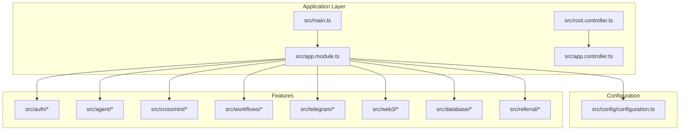

# Getting Started

<cite>
**Referenced Files in This Document**
- [package.json](file://package.json)
- [README.md](file://README.md)
- [src/main.ts](file://src/main.ts)
- [src/config/configuration.ts](file://src/config/configuration.ts)
- [src/app.module.ts](file://src/app.module.ts)
- [src/root.controller.ts](file://src/root.controller.ts)
- [src/app.controller.ts](file://src/app.controller.ts)
- [src/auth/auth.controller.ts](file://src/auth/auth.controller.ts)
- [supabase/config.toml](file://supabase/config.toml)
- [scripts/apply_migration.ts](file://scripts/apply_migration.ts)
</cite>

## Table of Contents
1. [Introduction](#introduction)
2. [Prerequisites](#prerequisites)
3. [Installation](#installation)
4. [Environment Configuration](#environment-configuration)
5. [Database Setup](#database-setup)
6. [Development Server](#development-server)
7. [API Documentation](#api-documentation)
8. [Basic API Examples](#basic-api-examples)
9. [Architecture Overview](#architecture-overview)
10. [Troubleshooting](#troubleshooting)
11. [Next Steps](#next-steps)

## Introduction
This guide helps you quickly set up the PinTool backend for Web3 workflow automation. It covers installing dependencies, configuring environment variables, preparing the database, starting the development server, and validating your setup with basic API calls. The backend is built with NestJS and integrates with Supabase for database and authentication, Solana for blockchain operations, and Crossmint for custodial wallets.

## Prerequisites
Before you begin, ensure you have:
- Node.js (LTS recommended) installed on your machine
- npm (comes with Node.js)
- A Solana wallet (e.g., Phantom) for testing wallet signature authentication
- Access to a Supabase project and a Solana RPC endpoint

These requirements are essential for running the backend and interacting with the APIs documented below.

**Section sources**
- [README.md:56-96](file://README.md#L56-L96)

## Installation
Follow these steps to install and prepare the backend:

1. Navigate to the backend directory and install dependencies:
   - Run the install script described in the project documentation
   - This installs all required packages defined in the project dependencies

2. Confirm the installation by checking the scripts and dependencies:
   - Development server script and build scripts are defined in the project configuration
   - Dependencies include NestJS, Supabase client, Solana libraries, and others

**Section sources**
- [README.md:58-63](file://README.md#L58-L63)
- [package.json:8-22](file://package.json#L8-L22)
- [package.json:23-54](file://package.json#L23-L54)

## Environment Configuration
Create and configure your environment file:

1. Copy the example environment template to create your local configuration:
   - Use the copy command shown in the documentation to create .env from .env.example

2. Fill in the required credentials:
   - Supabase: URL and service key
   - Crossmint: server API key
   - Solana: RPC URL

3. Optional variables:
   - Telegram bot token (for notifications)
   - Helius API key (required for HeliusWebhookNode)
   - Lulo API key (required for LuloNode)
   - Sanctum API key (required for SanctumNode)

4. Verify configuration loading:
   - The backend reads environment variables via the NestJS ConfigModule and configuration loader
   - Variables are grouped under supabase, solana, crossmint, telegram, pyth, helius, lulo, and sanctum

**Section sources**
- [README.md:65-83](file://README.md#L65-L83)
- [src/config/configuration.ts:1-45](file://src/config/configuration.ts#L1-L45)

## Database Setup
Prepare the database using Supabase:

1. Apply migrations:
   - Option A: Apply migrations from the project-supplied migration files in order
   - Option B: Run the SQL schema files from the database schema directory in your Supabase SQL editor

2. Local Supabase configuration:
   - The project includes a Supabase CLI configuration file that defines ports, schemas, and other local settings
   - Use this configuration to run a local Supabase environment if desired

3. Migration utility:
   - A script is available to apply a specific migration using a PostgreSQL client
   - Ensure your environment variables include the Supabase project ID and database password

**Section sources**
- [README.md:84-86](file://README.md#L84-L86)
- [supabase/config.toml:1-383](file://supabase/config.toml#L1-L383)
- [scripts/apply_migration.ts:1-74](file://scripts/apply_migration.ts#L1-L74)

## Development Server
Start the development server and access the API:

1. Launch the development server:
   - Use the development script defined in the project configuration
   - The server starts on port 3000 by default

2. Access the API:
   - Base URL: http://localhost:3000
   - API endpoints are prefixed with /api
   - Swagger documentation is available at /api/docs

3. Validate the server:
   - The root endpoint returns a welcome message and links to documentation and health
   - The health endpoint confirms the backend is running

**Section sources**
- [README.md:88-96](file://README.md#L88-L96)
- [src/main.ts:13-16](file://src/main.ts#L13-L16)
- [src/main.ts:59-63](file://src/main.ts#L59-L63)
- [src/root.controller.ts:1-20](file://src/root.controller.ts#L1-L20)
- [src/app.controller.ts:10-14](file://src/app.controller.ts#L10-L14)

## API Documentation
Explore the API documentation:

- Swagger/OpenAPI documentation is auto-generated and served at /api/docs
- The documentation includes tags for Auth, Referrals, Workflows, and Telegram
- The main controller exposes a root endpoint with links to documentation and health

**Section sources**
- [README.md:25](file://README.md#L25)
- [src/main.ts:40-56](file://src/main.ts#L40-L56)
- [src/root.controller.ts:6-13](file://src/root.controller.ts#L6-L13)

## Basic API Examples
Test your setup with these quick examples:

1. Health check:
   - Use the health endpoint to verify the server is running

2. List available node types:
   - Query the agent nodes endpoint to see available workflow node types

3. Wallet signature authentication:
   - Request a challenge for wallet signature authentication
   - The authentication controller handles challenge generation

Notes:
- These examples are based on the documented endpoints and controllers
- For wallet signature authentication, follow the documented flow to generate and submit challenges

**Section sources**
- [README.md:220-228](file://README.md#L220-L228)
- [src/app.controller.ts:10-14](file://src/app.controller.ts#L10-L14)
- [src/auth/auth.controller.ts:11-47](file://src/auth/auth.controller.ts#L11-L47)

## Architecture Overview
High-level architecture of the backend:

**Diagram sources**
- [src/main.ts:9-81](file://src/main.ts#L9-L81)
- [src/app.module.ts:15-32](file://src/app.module.ts#L15-L32)
- [src/config/configuration.ts:1-45](file://src/config/configuration.ts#L1-L45)

## Troubleshooting
Common setup issues and resolutions:

- Missing Supabase credentials:
  - Ensure .env contains SUPABASE_URL and SUPABASE_SERVICE_KEY
  - Without these, the backend cannot connect to the database

- Telegram bot not responding:
  - Verify TELEGRAM_BOT_TOKEN is correct
  - Check logs for the bot startup confirmation message

- Workflow execution failures:
  - Confirm Solana RPC is reachable
  - Ensure the account has sufficient SOL for transaction fees
  - Verify Crossmint wallet initialization

- Crossmint wallet errors:
  - Confirm CROSSMINT_SERVER_API_KEY is correct
  - Ensure CROSSMINT_ENVIRONMENT matches your key (staging/production)

**Section sources**
- [README.md:287-306](file://README.md#L287-L306)

## Next Steps
After completing setup:
- Explore the Swagger documentation at /api/docs
- Review the available workflow nodes and their requirements
- Test wallet signature authentication using the documented challenge flow
- Integrate with your frontend and configure additional optional services (Telegram, Helius, Lulo, Sanctum)