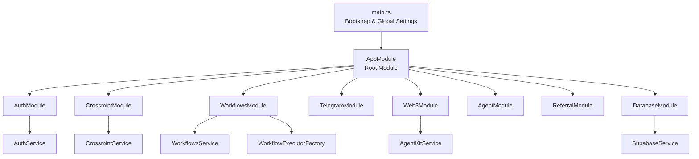
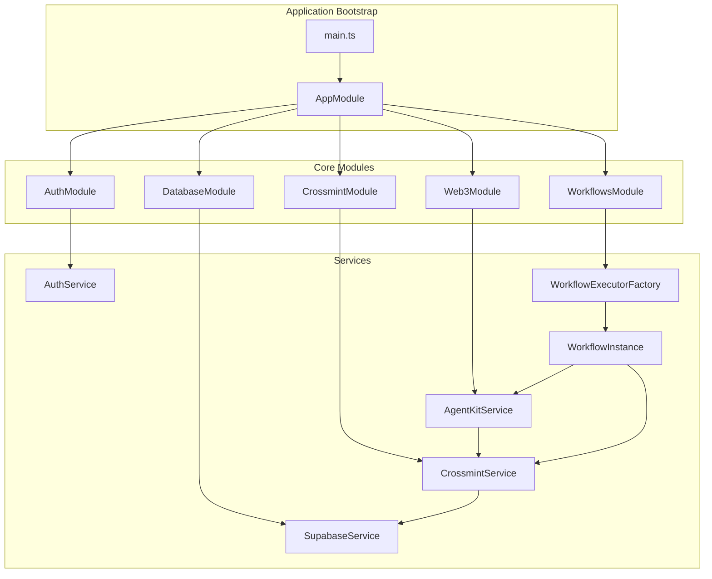
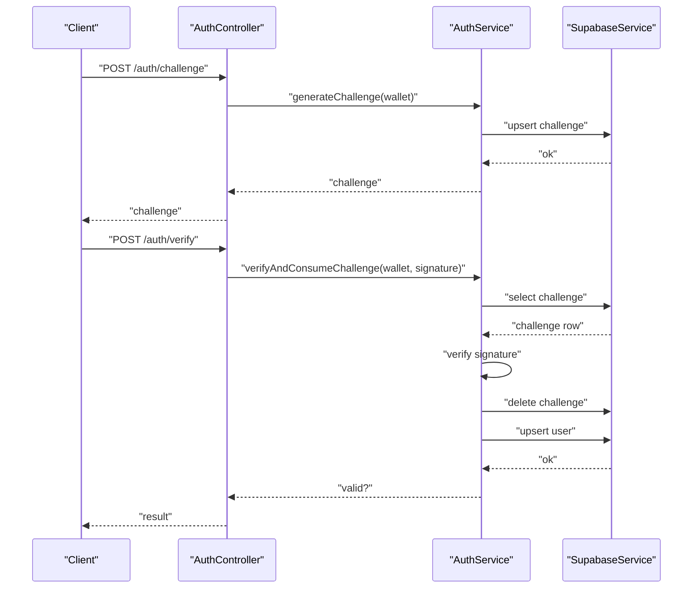
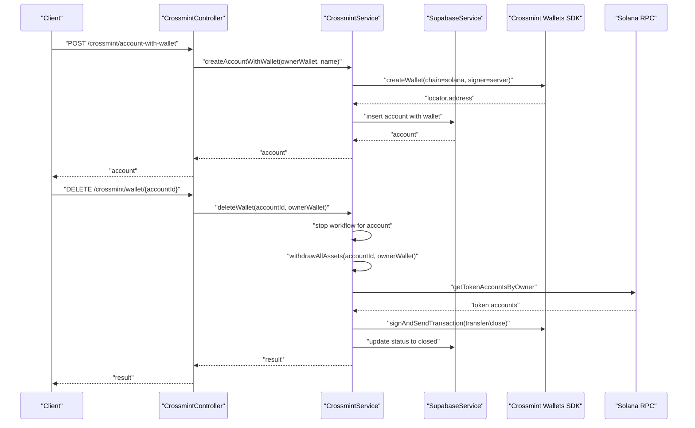
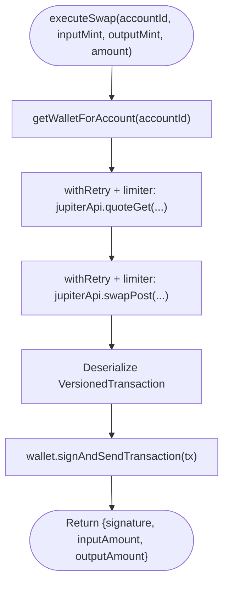
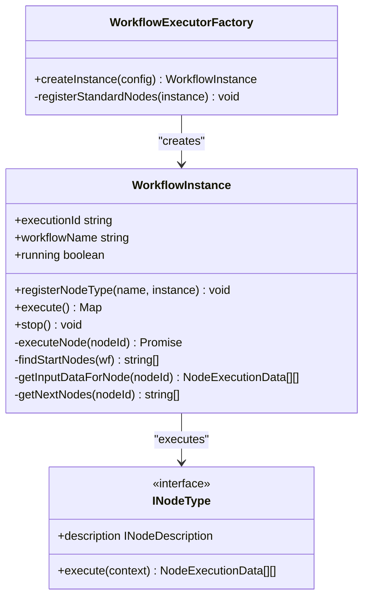
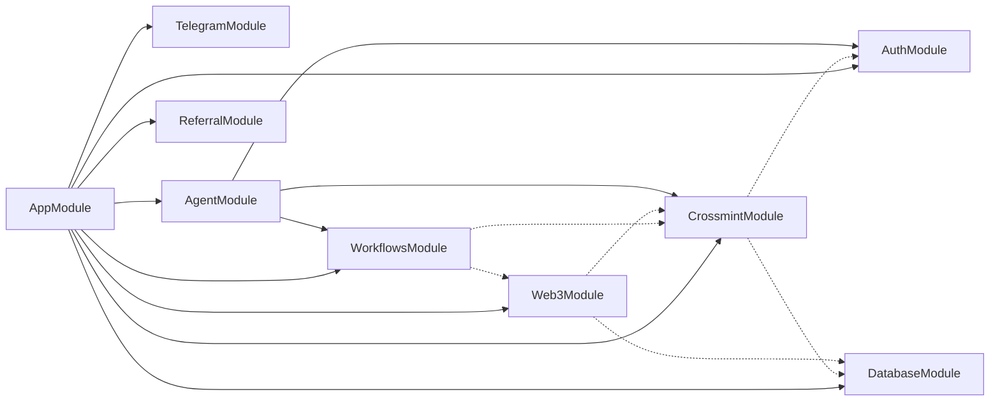
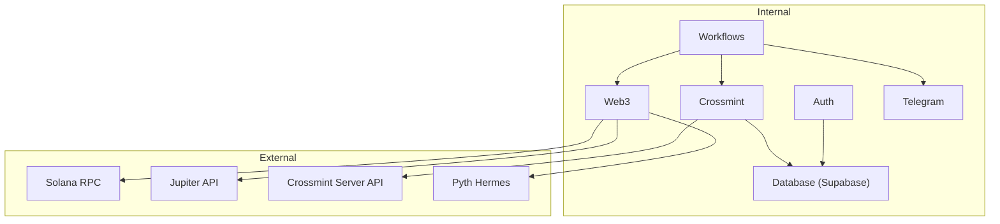

# Architecture Overview

<cite>
**Referenced Files in This Document**
- [main.ts](file://src/main.ts)
- [app.module.ts](file://src/app.module.ts)
- [auth.module.ts](file://src/auth/auth.module.ts)
- [agent.module.ts](file://src/agent/agent.module.ts)
- [crossmint.module.ts](file://src/crossmint/crossmint.module.ts)
- [web3.module.ts](file://src/web3/web3.module.ts)
- [workflows.module.ts](file://src/workflows/workflows.module.ts)
- [database.module.ts](file://src/database/database.module.ts)
- [workflow-executor.factory.ts](file://src/workflows/workflow-executor.factory.ts)
- [node-registry.ts](file://src/web3/nodes/node-registry.ts)
- [agent-kit.service.ts](file://src/web3/services/agent-kit.service.ts)
- [crossmint.service.ts](file://src/crossmint/crossmint.service.ts)
- [auth.service.ts](file://src/auth/auth.service.ts)
- [supabase.service.ts](file://src/database/supabase.service.ts)
- [workflow-instance.ts](file://src/workflows/workflow-instance.ts)
- [workflow-types.ts](file://src/web3/workflow-types.ts)
- [configuration.ts](file://src/config/configuration.ts)
- [package.json](file://package.json)
</cite>

## Table of Contents
1. [Introduction](#introduction)
2. [Project Structure](#project-structure)
3. [Core Components](#core-components)
4. [Architecture Overview](#architecture-overview)
5. [Detailed Component Analysis](#detailed-component-analysis)
6. [Dependency Analysis](#dependency-analysis)
7. [Performance Considerations](#performance-considerations)
8. [Troubleshooting Guide](#troubleshooting-guide)
9. [Conclusion](#conclusion)
10. [Appendices](#appendices)

## Introduction
This document describes the architectural design of the PinTool system, a modular monolithic backend built with NestJS. The system orchestrates Web3 workflow automation on Solana, integrating wallet-based authentication, Crossmint托管钱包, a pluggable node-based workflow engine, DeFi protocol SDKs, and Supabase for persistence. It emphasizes module-based organization, dependency injection, and a layered service architecture. The document also covers system boundaries, end-to-end data flows from authentication through workflow execution to blockchain interactions, integration patterns with external services, and cross-cutting concerns such as security, monitoring, and error handling.

## Project Structure
The application follows a NestJS modular monolithic architecture with clear separation of concerns:
- Application bootstrap initializes global settings, middleware, and Swagger documentation.
- AppModule aggregates all feature modules: Authentication, Crossmint, Workflows, Telegram, Web3, Agent, Referral, and Database.
- Feature modules encapsulate domain logic and expose providers/services/controllers.
- Shared services (e.g., Supabase) are globally provided via a dedicated module.

**Diagram sources**
- [main.ts:1-81](file://src/main.ts#L1-L81)
- [app.module.ts:1-33](file://src/app.module.ts#L1-L33)
- [auth.module.ts:1-11](file://src/auth/auth.module.ts#L1-L11)
- [crossmint.module.ts:1-16](file://src/crossmint/crossmint.module.ts#L1-L16)
- [workflows.module.ts:1-17](file://src/workflows/workflows.module.ts#L1-L17)
- [web3.module.ts:1-13](file://src/web3/web3.module.ts#L1-L13)
- [database.module.ts:1-10](file://src/database/database.module.ts#L1-L10)

**Section sources**
- [main.ts:1-81](file://src/main.ts#L1-L81)
- [app.module.ts:1-33](file://src/app.module.ts#L1-L33)

## Core Components
- Authentication: Wallet signature challenge generation and verification with Supabase-backed challenge storage and periodic cleanup.
- Crossmint Integration: Server-side managed Solana wallets via Crossmint SDK, with account creation, wallet retrieval, asset withdrawal, and deletion flows.
- Web3 Layer: AgentKit service for unified Solana operations (Jupiter swaps, RPC access), with rate limiting and retry mechanisms.
- Workflow Engine: Factory-driven instantiation of workflow instances, registry-based node registration, and a typed execution context for nodes.
- Database: Supabase client initialization and RLS context management for wallet-scoped queries.
- Telegram Integration: Optional notifications for workflow lifecycle events.

Key design patterns:
- Factory Pattern: Used in WorkflowExecutorFactory to construct WorkflowInstance with injected services and pre-register standard nodes.
- Registry Pattern: Centralized node registry for Web3 workflow nodes, enabling extensibility without modifying the executor.
- Service Layer Separation: Each domain area exposes a provider/service for DI and reuse.

**Section sources**
- [auth.service.ts:1-165](file://src/auth/auth.service.ts#L1-L165)
- [crossmint.service.ts:1-403](file://src/crossmint/crossmint.service.ts#L1-L403)
- [agent-kit.service.ts:1-163](file://src/web3/services/agent-kit.service.ts#L1-L163)
- [workflow-executor.factory.ts:1-42](file://src/workflows/workflow-executor.factory.ts#L1-L42)
- [node-registry.ts:1-47](file://src/web3/nodes/node-registry.ts#L1-L47)
- [workflow-instance.ts:1-314](file://src/workflows/workflow-instance.ts#L1-L314)
- [supabase.service.ts:1-42](file://src/database/supabase.service.ts#L1-L42)

## Architecture Overview
The system is organized around a central AppModule that wires feature modules. Cross-cutting concerns (logging, validation, exceptions) are applied globally during bootstrap. The Web3 layer integrates with Crossmint托管钱包 and external DeFi SDKs. Workflows orchestrate nodes that interact with blockchain and external APIs.

**Diagram sources**
- [main.ts:1-81](file://src/main.ts#L1-L81)
- [app.module.ts:1-33](file://src/app.module.ts#L1-L33)
- [auth.module.ts:1-11](file://src/auth/auth.module.ts#L1-L11)
- [crossmint.module.ts:1-16](file://src/crossmint/crossmint.module.ts#L1-L16)
- [workflows.module.ts:1-17](file://src/workflows/workflows.module.ts#L1-L17)
- [web3.module.ts:1-13](file://src/web3/web3.module.ts#L1-L13)
- [database.module.ts:1-10](file://src/database/database.module.ts#L1-L10)
- [workflow-executor.factory.ts:1-42](file://src/workflows/workflow-executor.factory.ts#L1-L42)
- [workflow-instance.ts:1-314](file://src/workflows/workflow-instance.ts#L1-L314)
- [crossmint.service.ts:1-403](file://src/crossmint/crossmint.service.ts#L1-L403)
- [agent-kit.service.ts:1-163](file://src/web3/services/agent-kit.service.ts#L1-L163)
- [supabase.service.ts:1-42](file://src/database/supabase.service.ts#L1-L42)

## Detailed Component Analysis

### Authentication Module
- Responsibilities:
  - Generate and persist challenge messages for wallet signature authentication.
  - Verify signatures using Ed25519 and NaCl.
  - Maintain a cleanup routine for expired challenges.
  - Upsert user records upon successful authentication.
- Data Flow:
  - Client requests a challenge for a wallet address.
  - Server stores challenge with expiry and returns challenge text.
  - Client signs challenge; server verifies signature against stored challenge and deletes it on success.
- Security:
  - Nonces and timestamps bound the challenge window.
  - Immediate consumption of challenges after verification prevents replay.
- Persistence:
  - Uses Supabase for challenge storage and user upsert.

**Diagram sources**
- [auth.service.ts:27-91](file://src/auth/auth.service.ts#L27-L91)
- [supabase.service.ts:29-40](file://src/database/supabase.service.ts#L29-L40)

**Section sources**
- [auth.service.ts:1-165](file://src/auth/auth.service.ts#L1-L165)
- [supabase.service.ts:1-42](file://src/database/supabase.service.ts#L1-L42)

### Crossmint Integration
- Responsibilities:
  - Initialize Crossmint SDK with server API key and signer secret.
  - Create托管 wallets for users/accounts.
  - Retrieve托管 wallets per account and adapt them for use with Solana operations.
  - Withdraw all assets (SPL + SOL) back to owner wallet and archive account.
- Data Flow:
  - Account creation triggers wallet creation via Crossmint SDK.
  - Wallet retrieval fetches locator/address from Supabase and adapts to a wallet adapter.
  - Asset withdrawal iterates SPL token accounts, transfers to owner, closes accounts, and sends remaining SOL after fee buffer.
- Security:
  - Server-side signing via Crossmint signer secret.
  - Ownership verification before deletion.
- Error Handling:
  - Graceful handling of missing wallets, invalid ownership, and partial withdrawal failures.

**Diagram sources**
- [crossmint.service.ts:84-204](file://src/crossmint/crossmint.service.ts#L84-L204)
- [crossmint.service.ts:209-344](file://src/crossmint/crossmint.service.ts#L209-L344)
- [supabase.service.ts:29-40](file://src/database/supabase.service.ts#L29-L40)

**Section sources**
- [crossmint.service.ts:1-403](file://src/crossmint/crossmint.service.ts#L1-L403)

### Web3 Layer and AgentKit
- Responsibilities:
  - Provide a unified interface for Solana operations using Crossmint托管钱包.
  - Execute Jupiter swaps with retry and rate limiting.
  - Manage RPC URLs and wallet adapters.
- Patterns:
  - Retry with exponential backoff and jitter.
  - Queue-based concurrency limiter for external API calls.
- Integration:
  - Uses @jup-ag/api for quotes and transactions.
  - Uses @solana/web3.js for transaction deserialization and signing.

**Diagram sources**
- [agent-kit.service.ts:99-161](file://src/web3/services/agent-kit.service.ts#L99-L161)

**Section sources**
- [agent-kit.service.ts:1-163](file://src/web3/services/agent-kit.service.ts#L1-L163)

### Workflow Engine
- Factory Pattern:
  - WorkflowExecutorFactory constructs WorkflowInstance with injected services and registers standard nodes from the registry.
- Registry Pattern:
  - node-registry.ts centralizes node registration for all Web3 nodes.
- Execution Model:
  - WorkflowInstance executes nodes in topological order, passing inputs and collecting outputs.
  - Context injection supports node parameters, input data, and service access.
  - Optional Telegram notifications for lifecycle and node execution.

**Diagram sources**
- [workflow-executor.factory.ts:8-41](file://src/workflows/workflow-executor.factory.ts#L8-L41)
- [workflow-instance.ts:33-314](file://src/workflows/workflow-instance.ts#L33-L314)
- [workflow-types.ts:12-15](file://src/web3/workflow-types.ts#L12-L15)

**Section sources**
- [workflow-executor.factory.ts:1-42](file://src/workflows/workflow-executor.factory.ts#L1-L42)
- [node-registry.ts:1-47](file://src/web3/nodes/node-registry.ts#L1-L47)
- [workflow-instance.ts:1-314](file://src/workflows/workflow-instance.ts#L1-L314)
- [workflow-types.ts:1-91](file://src/web3/workflow-types.ts#L1-L91)

### Database and RLS
- SupabaseService initializes the client and exposes a helper to set RLS configuration for wallet-scoped queries.
- RLS context is set via a PostgreSQL function call to enforce per-wallet access controls.

**Section sources**
- [supabase.service.ts:1-42](file://src/database/supabase.service.ts#L1-L42)

### Technology Stack
- Framework: NestJS (Core, Config, Swagger)
- Blockchain/Web3: @solana/web3.js, @solana/kit, @solana/spl-token, Solana Agent Kit
- DeFi Integrations: @jup-ag/api (Jupiter), @kamino-finance/klend-sdk, Hermes client for Pyth
- Wallets: @crossmint/wallets-sdk
- Database: @supabase/supabase-js
- Utilities: tweetnacl, bs58, axios, reflect-metadata, rxjs

**Section sources**
- [package.json:23-53](file://package.json#L23-L53)

## Dependency Analysis
- Module Dependencies:
  - AppModule imports all feature modules.
  - WorkflowsModule depends on TelegramModule, CrossmintModule (forwardRef), and Web3Module.
  - CrossmintModule depends on AuthModule and DatabaseModule (forwardRef).
  - Web3Module depends on DatabaseModule and CrossmintModule (forwardRef).
  - AgentModule depends on AuthModule, CrossmintModule, and WorkflowsModule.
- Provider Dependencies:
  - WorkflowExecutorFactory depends on TelegramNotifierService, CrossmintService (forwardRef), and AgentKitService.
  - CrossmintService depends on SupabaseService and WorkflowLifecycleManager (forwardRef).
  - AgentKitService depends on CrossmintService (forwardRef) and ConfigService.
  - AuthService depends on SupabaseService (forwardRef).

**Diagram sources**
- [app.module.ts:15-29](file://src/app.module.ts#L15-L29)
- [workflows.module.ts:10-11](file://src/workflows/workflows.module.ts#L10-L11)
- [crossmint.module.ts:9-10](file://src/crossmint/crossmint.module.ts#L9-L10)
- [web3.module.ts:7-8](file://src/web3/web3.module.ts#L7-L8)
- [agent.module.ts:8-9](file://src/agent/agent.module.ts#L8-L9)

**Section sources**
- [app.module.ts:1-33](file://src/app.module.ts#L1-L33)
- [workflows.module.ts:1-17](file://src/workflows/workflows.module.ts#L1-L17)
- [crossmint.module.ts:1-16](file://src/crossmint/crossmint.module.ts#L1-L16)
- [web3.module.ts:1-13](file://src/web3/web3.module.ts#L1-L13)
- [agent.module.ts:1-15](file://src/agent/agent.module.ts#L1-L15)

## Performance Considerations
- Concurrency Control:
  - External API limiter limits concurrent calls to Jupiter to avoid throttling.
  - Retry with exponential backoff reduces transient failure impact.
- Logging and Observability:
  - Global LoggingInterceptor captures request traces.
  - WorkflowInstance logs node execution start/end, duration, and outputs.
- Caching and Idempotency:
  - Challenges are short-lived and consumed upon verification to prevent repeated use.
- Resource Management:
  - AbortController enables cooperative cancellation of long-running workflows.

[No sources needed since this section provides general guidance]

## Troubleshooting Guide
- Authentication Failures:
  - Verify challenge exists and is unexpired.
  - Confirm signature verification uses correct wallet address and message encoding.
  - Check user upsert and challenge deletion on success.
- Crossmint Wallet Issues:
  - Ensure server API key and signer secret are configured.
  - Validate account has a wallet locator/address; handle missing wallet errors.
  - For deletion, confirm all assets were successfully withdrawn before soft-deleting the account.
- Web3 Operations:
  - Check RPC URL configuration and network availability.
  - Inspect AgentKit retry and limiter behavior under rate limits.
- Database Access:
  - Confirm Supabase credentials and RLS context are set before queries.
  - Review migration status and schema alignment.

**Section sources**
- [auth.service.ts:57-91](file://src/auth/auth.service.ts#L57-L91)
- [crossmint.service.ts:122-154](file://src/crossmint/crossmint.service.ts#L122-L154)
- [crossmint.service.ts:349-401](file://src/crossmint/crossmint.service.ts#L349-L401)
- [agent-kit.service.ts:8-45](file://src/web3/services/agent-kit.service.ts#L8-L45)
- [supabase.service.ts:11-27](file://src/database/supabase.service.ts#L11-L27)

## Conclusion
PinTool’s architecture leverages NestJS modularity and dependency injection to cleanly separate concerns across authentication, Crossmint托管钱包, Web3 operations, workflow orchestration, and persistence. The factory and registry patterns enable scalable extension of workflow nodes while maintaining a consistent execution model. Cross-cutting concerns like security (wallet signatures, server-side signing, RLS), monitoring (global interceptors, workflow logs), and error handling (retry/limiter, structured exceptions) are integrated throughout the system. Together, these patterns support a robust, extensible backend for Web3 workflow automation.

[No sources needed since this section summarizes without analyzing specific files]

## Appendices

### System Context Diagram
High-level view of internal modules and external dependencies.

[No sources needed since this diagram shows conceptual relationships]

### Configuration Surface
Key environment variables and their roles.

- Supabase: URL, service key, optional anon key
- Telegram: bot token, notification enable flag, webhook URL
- Solana: RPC URL, WS URL
- Pyth: Hermes endpoint
- Crossmint: server API key, signer secret, environment
- Helius, Lulo, Sanctum: API keys for respective DeFi integrations

**Section sources**
- [configuration.ts:1-45](file://src/config/configuration.ts#L1-L45)