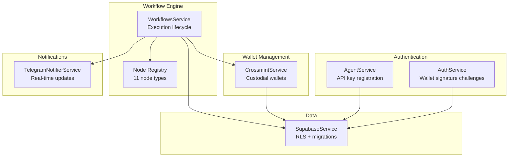
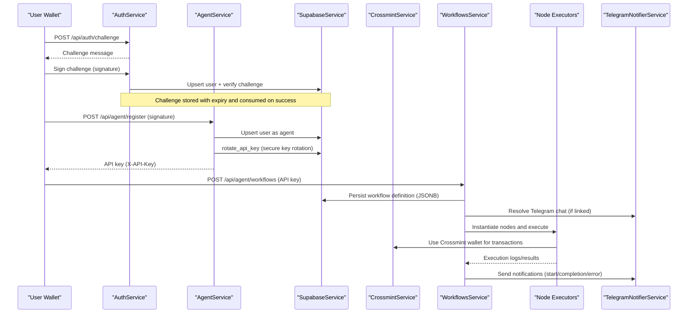
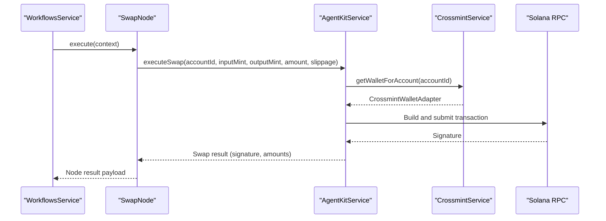
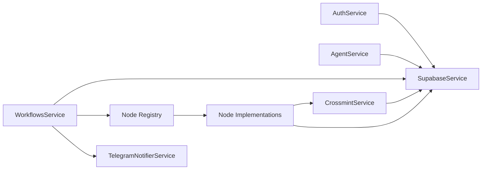

# Feature Highlights

<cite>
**Referenced Files in This Document**
- [README.md](file://README.md)
- [NODES_REFERENCE.md](file://docs/NODES_REFERENCE.md)
- [node-registry.ts](file://src/web3/nodes/node-registry.ts)
- [auth.service.ts](file://src/auth/auth.service.ts)
- [agent.service.ts](file://src/agent/agent.service.ts)
- [supabase.service.ts](file://src/database/supabase.service.ts)
- [crossmint.service.ts](file://src/crossmint/crossmint.service.ts)
- [workflows.service.ts](file://src/workflows/workflows.service.ts)
- [telegram-notifier.service.ts](file://src/telegram/telegram-notifier.service.ts)
- [price-feed.node.ts](file://src/web3/nodes/price-feed.node.ts)
- [swap.node.ts](file://src/web3/nodes/swap.node.ts)
- [kamino.node.ts](file://src/web3/nodes/kamino.node.ts)
- [drift.node.ts](file://src/web3/nodes/drift.node.ts)
- [helius-webhook.node.ts](file://src/web3/nodes/helius-webhook.node.ts)
- [referral.service.ts](file://src/referral/referral.service.ts)
</cite>

## Table of Contents
1. [Introduction](#introduction)
2. [Project Structure](#project-structure)
3. [Core Components](#core-components)
4. [Architecture Overview](#architecture-overview)
5. [Detailed Component Analysis](#detailed-component-analysis)
6. [Dependency Analysis](#dependency-analysis)
7. [Performance Considerations](#performance-considerations)
8. [Troubleshooting Guide](#troubleshooting-guide)
9. [Conclusion](#conclusion)
10. [Appendices](#appendices)

## Introduction
PinTool is a Web3 workflow automation platform built on Solana, designed to orchestrate DeFi operations programmatically and securely. It enables passwordless wallet authentication, agent-driven automation via API keys, custodial wallet management through Crossmint, a robust workflow engine with 11 node types spanning price feeds, swaps, limit orders, staking, lending, perpetual trading, liquid staking, transfers, balance queries, and Helius webhooks. The platform integrates with Supabase for secure, auditable data management and provides real-time notifications via Telegram. This document highlights each major feature, its purpose and benefits, practical use cases, and how they combine to form a comprehensive automation solution.

## Project Structure
The backend is organized around feature-focused modules:
- Authentication and authorization (wallet signature challenges and agent API keys)
- Crossmint custodial wallet management
- Workflow engine with a registry of nodes
- Telegram notifications
- Supabase integration for database and Row Level Security (RLS)
- DeFi protocol integrations (Jupiter, Kamino, Drift, Sanctum, Lulo, Pyth, Helius)

**Diagram sources**
- [auth.service.ts:1-165](file://src/auth/auth.service.ts#L1-L165)
- [agent.service.ts:1-77](file://src/agent/agent.service.ts#L1-L77)
- [crossmint.service.ts:1-403](file://src/crossmint/crossmint.service.ts#L1-L403)
- [node-registry.ts:1-47](file://src/web3/nodes/node-registry.ts#L1-L47)
- [workflows.service.ts:1-216](file://src/workflows/workflows.service.ts#L1-L216)
- [telegram-notifier.service.ts:1-185](file://src/telegram/telegram-notifier.service.ts#L1-L185)
- [supabase.service.ts:1-42](file://src/database/supabase.service.ts#L1-L42)

**Section sources**
- [README.md:27-54](file://README.md#L27-L54)

## Core Components
- Wallet Signature Authentication: Non-custodial, passwordless login using Solana wallet signatures with time-bound challenges and automatic cleanup.
- Agent API: Programmatic access via API keys for agents, with secure key rotation and RLS enforcement.
- Crossmint Custodial Wallets: Create, link, and manage custodial wallets for automated DeFi operations without exposing private keys.
- Workflow Engine: JSONB-defined workflows with lifecycle management, execution tracking, and Telegram notifications.
- Telegram Notifications: Structured, contextual updates for workflow starts, completions, and failures.
- Supabase Integration: PostgreSQL-backed with RLS to enforce tenant isolation and secure migrations.
- 11 Workflow Nodes: Price feeds, swaps, limit orders, staking, lending (Kamino, Lulo), perpetual trading (Drift), liquid staking (Sanctum), transfers, balance queries, and Helius webhooks.

Practical examples:
- Automated rebalancing: PriceFeed triggers -> Swap to target allocation -> Transfer remainder to savings account.
- Yield farming: Swap to LP token -> Stake in Kamino vault -> Periodic harvest and reinvest.
- Perpetual hedging: Drift hedge position when Pyth price breaches threshold.

**Section sources**
- [README.md:5-26](file://README.md#L5-L26)
- [NODES_REFERENCE.md:1-275](file://docs/NODES_REFERENCE.md#L1-L275)

## Architecture Overview
The platform combines authentication, wallet abstraction, workflow orchestration, and external DeFi integrations.

**Diagram sources**
- [auth.service.ts:24-91](file://src/auth/auth.service.ts#L24-L91)
- [agent.service.ts:15-59](file://src/agent/agent.service.ts#L15-L59)
- [supabase.service.ts:33-40](file://src/database/supabase.service.ts#L33-L40)
- [crossmint.service.ts:84-204](file://src/crossmint/crossmint.service.ts#L84-L204)
- [workflows.service.ts:83-214](file://src/workflows/workflows.service.ts#L83-L214)
- [telegram-notifier.service.ts:30-113](file://src/telegram/telegram-notifier.service.ts#L30-L113)

## Detailed Component Analysis

### Wallet Signature Authentication
Purpose:
- Enable passwordless, non-custodial login using Solana signatures.
- Prevent replay attacks with time-bound challenges and one-time consumption.

Benefits:
- Strong security with no password storage.
- Seamless UX with wallet-native signing.
- Audit trail via challenge records.

Use cases:
- Human users authenticating to access agent APIs.
- Verifying ownership before generating API keys or managing wallets.

Security:
- Challenges expire automatically.
- Signature verified with ed25519 against the provided wallet address.
- Users created/upserted on successful challenge verification.

**Section sources**
- [auth.service.ts:24-91](file://src/auth/auth.service.ts#L24-L91)
- [auth.service.ts:93-111](file://src/auth/auth.service.ts#L93-L111)
- [auth.service.ts:147-156](file://src/auth/auth.service.ts#L147-L156)

### Agent API with API-Key Authentication
Purpose:
- Provide programmatic access for agents to register, manage accounts, and create workflows.

Benefits:
- Secure separation between human and agent operations.
- Atomic key rotation to minimize exposure windows.
- RLS enforced via Supabase context.

Use cases:
- Integrating third-party systems to automate DeFi actions.
- Multi-account management with isolated permissions.

**Section sources**
- [agent.service.ts:15-59](file://src/agent/agent.service.ts#L15-L59)
- [supabase.service.ts:33-40](file://src/database/supabase.service.ts#L33-L40)

### Crossmint Custodial Wallet Management
Purpose:
- Manage wallets on behalf of users without handling private keys.
- Facilitate seamless DeFi operations across protocols.

Benefits:
- Reduced operational risk and UX friction.
- Asset consolidation and controlled withdrawals.
- Soft deletion with asset reconciliation.

Use cases:
- Creating isolated trading accounts per workflow.
- Withdrawing remaining assets before closing an account.

**Section sources**
- [crossmint.service.ts:84-204](file://src/crossmint/crossmint.service.ts#L84-L204)
- [crossmint.service.ts:209-344](file://src/crossmint/crossmint.service.ts#L209-L344)
- [crossmint.service.ts:349-401](file://src/crossmint/crossmint.service.ts#L349-L401)

### Workflow Engine and Lifecycle
Purpose:
- Define, execute, and monitor automated DeFi workflows with structured nodes.

Benefits:
- JSONB-based definitions enable flexible, versionable automation.
- In-flight execution guard prevents overlapping runs.
- Execution logs persisted for auditing and debugging.

Use cases:
- Automated trading strategies.
- Yield optimization pipelines.
- Event-triggered actions via Helius webhooks.

**Section sources**
- [workflows.service.ts:83-214](file://src/workflows/workflows.service.ts#L83-L214)

### Telegram Notification System
Purpose:
- Deliver real-time updates on workflow execution outcomes.

Benefits:
- Immediate visibility into automation status.
- Structured messages per node type with contextual details.

Use cases:
- Monitoring critical swaps or leveraged trades.
- Alerting on failures requiring manual intervention.

**Section sources**
- [telegram-notifier.service.ts:30-113](file://src/telegram/telegram-notifier.service.ts#L30-L113)

### Supabase Database Integration
Purpose:
- Provide relational persistence with Row Level Security for tenant isolation.

Benefits:
- Controlled access per wallet address.
- Migrations and functions for quota management and API key rotation.
- Audit-ready execution logs and user activity.

Use cases:
- Storing workflow definitions and execution history.
- Managing referral quotas and redemption tracking.

**Section sources**
- [supabase.service.ts:11-40](file://src/database/supabase.service.ts#L11-L40)

### Workflow Node Ecosystem
The node registry aggregates 11 node types, each with distinct DeFi capabilities:

```mermaid
classDiagram
class NodeRegistry {
+registerNode(name, factory)
+getRegisteredNodes()
}
class PriceFeedNode {
+execute(context) NodeExecutionData[][]
}
class SwapNode {
+execute(context) NodeExecutionData[][]
}
class KaminoNode {
+execute(context) NodeExecutionData[][]
}
class DriftNode {
+execute(context) NodeExecutionData[][]
}
class SanctumNode {
+execute(context) NodeExecutionData[][]
}
class LuloNode {
+execute(context) NodeExecutionData[][]
}
class StakeNode {
+execute(context) NodeExecutionData[][]
}
class TransferNode {
+execute(context) NodeExecutionData[][]
}
class BalanceNode {
+execute(context) NodeExecutionData[][]
}
class LimitOrderNode {
+execute(context) NodeExecutionData[][]
}
class HeliusWebhookNode {
+execute(context) NodeExecutionData[][]
}
NodeRegistry --> PriceFeedNode : "registers"
NodeRegistry --> SwapNode : "registers"
NodeRegistry --> KaminoNode : "registers"
NodeRegistry --> DriftNode : "registers"
NodeRegistry --> SanctumNode : "registers"
NodeRegistry --> LuloNode : "registers"
NodeRegistry --> StakeNode : "registers"
NodeRegistry --> TransferNode : "registers"
NodeRegistry --> BalanceNode : "registers"
NodeRegistry --> LimitOrderNode : "registers"
NodeRegistry --> HeliusWebhookNode : "registers"
```

**Diagram sources**
- [node-registry.ts:23-47](file://src/web3/nodes/node-registry.ts#L23-L47)
- [price-feed.node.ts:5-64](file://src/web3/nodes/price-feed.node.ts#L5-L64)
- [swap.node.ts:49-100](file://src/web3/nodes/swap.node.ts#L49-L100)
- [kamino.node.ts:69-130](file://src/web3/nodes/kamino.node.ts#L69-L130)
- [drift.node.ts:107-179](file://src/web3/nodes/drift.node.ts#L107-L179)
- [helius-webhook.node.ts:116-185](file://src/web3/nodes/helius-webhook.node.ts#L116-L185)

#### Node Capabilities and Use Cases
- PriceFeed (Pyth): Monitor token prices and trigger downstream actions when thresholds are met.
- Swap (Jupiter): Execute atomic swaps with configurable slippage and amount semantics.
- LimitOrder (Jupiter): Place limit orders with expiry and price precision.
- Stake (Jupiter): Stake SOL for liquid staking tokens and manage unstaking.
- Kamino: Deposit/withdraw from lending vaults with flexible amount parsing.
- Lulo: Lend assets for yield with deposit/withdraw/info operations.
- Drift Perp: Trade perpetuals with leverage, market/limit orders, and funding rate retrieval.
- Sanctum LST: Swap liquid staking tokens and query APY/quotes.
- Transfer: Move SOL or SPL tokens to recipients using Crossmint wallets.
- Balance: Query balances with optional threshold conditions to gate downstream nodes.
- Helius Webhook: Create/list/get/delete webhooks for on-chain event monitoring.

**Section sources**
- [NODES_REFERENCE.md:10-23](file://docs/NODES_REFERENCE.md#L10-L23)
- [NODES_REFERENCE.md:24-275](file://docs/NODES_REFERENCE.md#L24-L275)

#### Node Execution Flow (Example: Swap)

**Diagram sources**
- [swap.node.ts:102-207](file://src/web3/nodes/swap.node.ts#L102-L207)
- [crossmint.service.ts:122-154](file://src/crossmint/crossmint.service.ts#L122-L154)

### Referral System with Quota Management and Redemption Tracking
Purpose:
- Enable user-driven growth with controlled issuance and redemption.

Key features:
- Single-use referral codes with global uniqueness.
- Admin-set lifetime quotas and user self-generation limits.
- Quota reservation/release with retry-safe generation.
- Redemption via stored procedures with detailed failure diagnostics.

Benefits:
- Prevents abuse while enabling organic acquisition.
- Transparent auditability of issuance and redemptions.
- Metadata support for redemption attribution.

Use cases:
- Campaigns rewarding successful sign-ups.
- Partner programs distributing codes with quotas.

**Section sources**
- [referral.service.ts:51-82](file://src/referral/referral.service.ts#L51-L82)
- [referral.service.ts:84-107](file://src/referral/referral.service.ts#L84-L107)
- [referral.service.ts:109-138](file://src/referral/referral.service.ts#L109-L138)
- [referral.service.ts:140-193](file://src/referral/referral.service.ts#L140-L193)
- [referral.service.ts:255-277](file://src/referral/referral.service.ts#L255-L277)
- [referral.service.ts:279-320](file://src/referral/referral.service.ts#L279-L320)
- [referral.service.ts:330-362](file://src/referral/referral.service.ts#L330-L362)

## Dependency Analysis
High-level dependencies among core modules:

**Diagram sources**
- [auth.service.ts:12-15](file://src/auth/auth.service.ts#L12-L15)
- [agent.service.ts:10-13](file://src/agent/agent.service.ts#L10-L13)
- [crossmint.service.ts:49-54](file://src/crossmint/crossmint.service.ts#L49-L54)
- [workflows.service.ts:8-12](file://src/workflows/workflows.service.ts#L8-L12)
- [node-registry.ts:7-21](file://src/web3/nodes/node-registry.ts#L7-L21)

**Section sources**
- [node-registry.ts:23-47](file://src/web3/nodes/node-registry.ts#L23-L47)

## Performance Considerations
- Concurrency and rate limiting: External API calls (e.g., Drift, Helius) use rate limiters and exponential backoff to avoid throttling.
- Execution deduplication: Workflows prevent overlapping runs using in-memory execution keys.
- Batch operations: Withdrawal from Crossmint wallets consolidates SPL transfers and closes empty token accounts efficiently.
- Caching and context: Supabase RLS context is set per request to enforce tenant isolation without repeated lookups.

[No sources needed since this section provides general guidance]

## Troubleshooting Guide
Common issues and resolutions:
- Supabase credentials missing: Ensure environment variables for URL and service key are configured.
- Telegram bot not responding: Verify token configuration and check logs for initialization status.
- Workflow execution failures: Confirm RPC accessibility, sufficient SOL for fees, and proper Crossmint wallet initialization.
- Crossmint wallet errors: Validate server API key and environment settings; confirm wallet creation and linking.

**Section sources**
- [README.md:289-306](file://README.md#L289-L306)

## Conclusion
PinTool unifies secure authentication, custodial wallet management, and a powerful workflow engine to deliver a complete automation stack for DeFi. With 11 specialized nodes spanning price monitoring, swaps, limit orders, staking, lending, perpetual trading, liquid staking, transfers, balance checks, and Helius webhooks, it enables sophisticated strategies with minimal operational overhead. Combined with Supabase-backed RLS, agent API keys, and Telegram notifications, it scales from individual users to enterprise-grade automation.

[No sources needed since this section summarizes without analyzing specific files]

## Appendices

### Feature Comparison with Traditional DeFi Automation Tools
- Passwordless authentication vs. password-based sessions: Reduces credential risks and improves UX.
- Agent API keys vs. long-lived tokens: Enables granular access control and atomic key rotation.
- Custodial wallets via Crossmint vs. hardware/software wallets: Simplifies deployment and reduces private key exposure.
- Node-based workflows vs. monolithic bots: Modular composition allows reuse and easier maintenance.
- Telegram notifications vs. dashboards/logs: Immediate, actionable alerts integrated into existing workflows.

[No sources needed since this section provides general guidance]