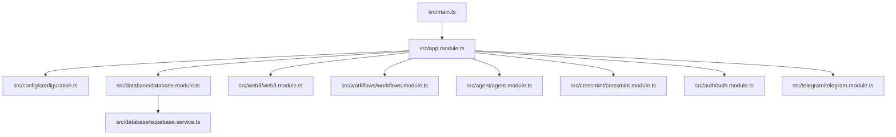

# Getting Started

<cite>
**Referenced Files in This Document**
- [package.json](file://package.json)
- [README.md](file://README.md)
- [src/main.ts](file://src/main.ts)
- [src/app.module.ts](file://src/app.module.ts)
- [src/config/configuration.ts](file://src/config/configuration.ts)
- [src/database/database.module.ts](file://src/database/database.module.ts)
- [src/database/supabase.service.ts](file://src/database/supabase.service.ts)
- [src/root.controller.ts](file://src/root.controller.ts)
- [src/app.controller.ts](file://src/app.controller.ts)
- [src/web3/web3.module.ts](file://src/web3/web3.module.ts)
- [src/workflows/workflows.module.ts](file://src/workflows/workflows.module.ts)
- [src/agent/agent.module.ts](file://src/agent/agent.module.ts)
- [src/crossmint/crossmint.module.ts](file://src/crossmint/crossmint.module.ts)
- [supabase/config.toml](file://supabase/config.toml)
- [supabase/migrations/20260129000000_update_schema_v2.sql](file://supabase/migrations/20260129000000_update_schema_v2.sql)
- [scripts/apply_migration.ts](file://scripts/apply_migration.ts)
</cite>

## Table of Contents
1. [Introduction](#introduction)
2. [Prerequisites](#prerequisites)
3. [System Requirements](#system-requirements)
4. [Installation](#installation)
5. [Environment Configuration](#environment-configuration)
6. [Database Setup](#database-setup)
7. [Development Server](#development-server)
8. [Accessing APIs](#accessing-apis)
9. [Architecture Overview](#architecture-overview)
10. [Troubleshooting Guide](#troubleshooting-guide)
11. [Next Steps](#next-steps)

## Introduction
This guide helps you set up the PinTool Web3 workflow automation platform locally. You will install dependencies, configure environment variables, prepare the database with Supabase migrations, and run the development server. You will also learn how to access the API documentation and health check endpoints, and how to troubleshoot common setup issues.

## Prerequisites
- Basic familiarity with TypeScript/JavaScript and Node.js
- Understanding of Web3 concepts and the Solana blockchain
- Familiarity with DeFi primitives (e.g., swapping, staking, lending) is helpful
- Experience with NestJS framework is beneficial but not mandatory

## System Requirements
- Node.js and npm: The project targets Node.js LTS and uses npm as the package manager.
- Git: To clone the repository and manage branches.
- A terminal/shell to run commands.

**Section sources**
- [package.json:1-95](file://package.json#L1-L95)

## Installation
Follow these steps to install the project locally:

1. Clone the repository and navigate into the backend directory.
2. Install dependencies using npm.

```bash
cd backend
npm install
```

3. Confirm the installation by checking available scripts.

```bash
npm run
```

You should see a list of available scripts including development, production, linting, formatting, testing, and documentation generation.

**Section sources**
- [README.md:56-96](file://README.md#L56-L96)
- [package.json:8-22](file://package.json#L8-L22)

## Environment Configuration
Create a local environment file from the example template and fill in the required and optional variables.

1. Copy the example environment file to `.env`.

```bash
cp .env.example .env
```

2. Required variables:
- SUPABASE_URL
- SUPABASE_SERVICE_KEY
- CROSSMINT_SERVER_API_KEY
- SOLANA_RPC_URL

3. Optional variables:
- TELEGRAM_BOT_TOKEN
- HELIUS_API_KEY
- LULO_API_KEY
- SANCTUM_API_KEY

These variables are consumed by the configuration loader and used across modules (database, Telegram, Solana, Crossmint, and protocol-specific integrations).

**Section sources**
- [README.md:65-83](file://README.md#L65-L83)
- [src/config/configuration.ts:1-45](file://src/config/configuration.ts#L1-L45)

## Database Setup
The project uses PostgreSQL via Supabase. You can either apply migrations using the provided SQL files or use the Supabase CLI.

Option A: Apply migrations via SQL files
- Use the Supabase SQL editor to run the schema files in order from the schema directory.
- Alternatively, use the migration script to apply a specific migration file against your Supabase project.

Option B: Use Supabase CLI (recommended)
- Initialize and push migrations using the Supabase CLI with the provided configuration.

Notes:
- The Supabase configuration defines ports and settings for local development.
- Migrations include updates to workflows, executions, and indexing for performance.

**Section sources**
- [README.md:84-86](file://README.md#L84-L86)
- [supabase/config.toml:1-383](file://supabase/config.toml#L1-L383)
- [supabase/migrations/20260129000000_update_schema_v2.sql:1-39](file://supabase/migrations/20260129000000_update_schema_v2.sql#L1-L39)
- [scripts/apply_migration.ts:1-74](file://scripts/apply_migration.ts#L1-L74)

## Development Server
Start the development server in watch mode to automatically reload on changes.

```bash
npm run start:dev
```

The server starts on port 3000 by default. You can change the port via the PORT environment variable.

**Section sources**
- [README.md:88-96](file://README.md#L88-L96)
- [src/main.ts:65-77](file://src/main.ts#L65-L77)

## Accessing APIs
Once the server is running, use the following endpoints:

- Root: /
  - Returns a welcome message and links to documentation and health.
- Health: /api/health
  - Returns a simple health check response.
- API Documentation: /api/docs
  - Swagger/OpenAPI documentation for all endpoints.

Example requests:
- Health check: curl http://localhost:3000/api/health
- Available nodes: curl http://localhost:3000/api/agent/nodes

**Section sources**
- [src/root.controller.ts:1-20](file://src/root.controller.ts#L1-L20)
- [src/app.controller.ts:1-15](file://src/app.controller.ts#L1-L15)
- [src/main.ts:39-63](file://src/main.ts#L39-L63)

## Architecture Overview
The backend is a NestJS application composed of modular features. The main modules include configuration, database, authentication, agent API, crossmint integration, workflows, Telegram notifications, and Web3 services.



**Diagram sources**
- [src/main.ts:9-81](file://src/main.ts#L9-L81)
- [src/app.module.ts:15-32](file://src/app.module.ts#L15-L32)
- [src/config/configuration.ts:1-45](file://src/config/configuration.ts#L1-L45)
- [src/database/database.module.ts:1-10](file://src/database/database.module.ts#L1-L10)
- [src/database/supabase.service.ts:1-42](file://src/database/supabase.service.ts#L1-L42)
- [src/web3/web3.module.ts:1-13](file://src/web3/web3.module.ts#L1-L13)
- [src/workflows/workflows.module.ts:1-17](file://src/workflows/workflows.module.ts#L1-L17)
- [src/agent/agent.module.ts:1-15](file://src/agent/agent.module.ts#L1-L15)
- [src/crossmint/crossmint.module.ts:1-16](file://src/crossmint/crossmint.module.ts#L1-L16)

## Troubleshooting Guide
Common setup issues and resolutions:

- Supabase URL and Service Key must be provided
  - Ensure the .env file contains SUPABASE_URL and SUPABASE_SERVICE_KEY.
  - The database module throws an error if these are missing.

- Telegram bot not responding
  - Verify TELEGRAM_BOT_TOKEN is correct.
  - Check logs for a confirmation that the Telegram bot started.

- Workflow execution failures
  - Confirm SOLANA_RPC_URL is reachable.
  - Ensure the account has sufficient SOL for transaction fees.
  - Verify Crossmint wallet initialization.

- Crossmint wallet errors
  - Confirm CROSSMINT_SERVER_API_KEY is correct.
  - Ensure CROSSMINT_ENVIRONMENT matches your key (staging/production).

Additional tips:
- Use the health check endpoint to verify the server is running.
- Review the Swagger documentation at /api/docs for endpoint details.

**Section sources**
- [src/database/supabase.service.ts:11-27](file://src/database/supabase.service.ts#L11-L27)
- [README.md:287-306](file://README.md#L287-L306)
- [src/app.controller.ts:10-14](file://src/app.controller.ts#L10-L14)

## Next Steps
- Explore the API documentation at /api/docs to understand available endpoints.
- Try the health check endpoint to confirm the server is ready.
- Review the agent and workflow modules to understand programmatic access and automation capabilities.
- For production deployment, review the provided Docker instructions and environment setup notes.

[No sources needed since this section summarizes without analyzing specific files]