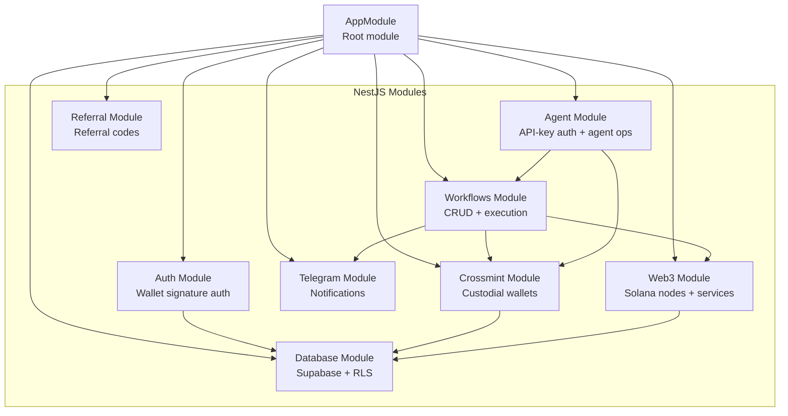
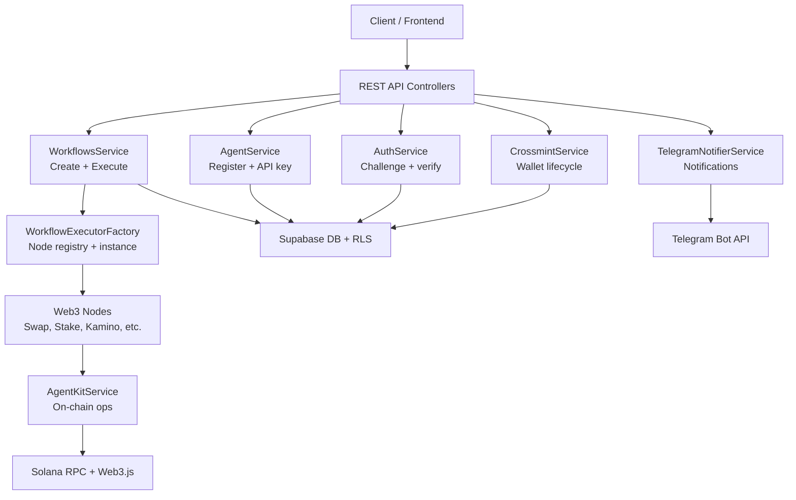
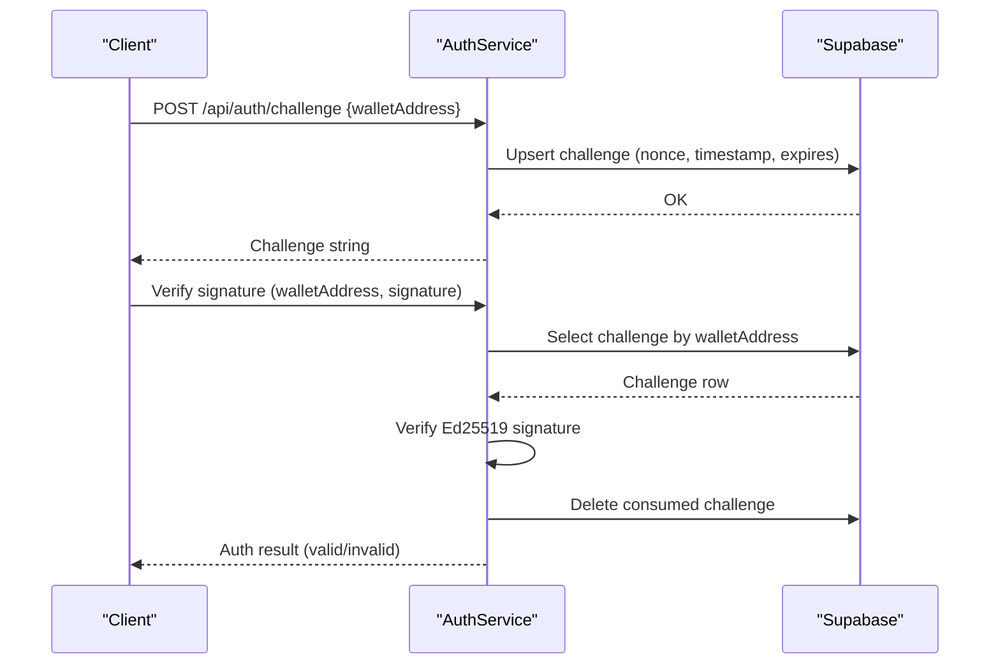
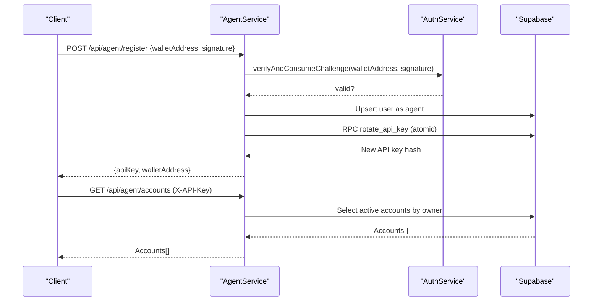
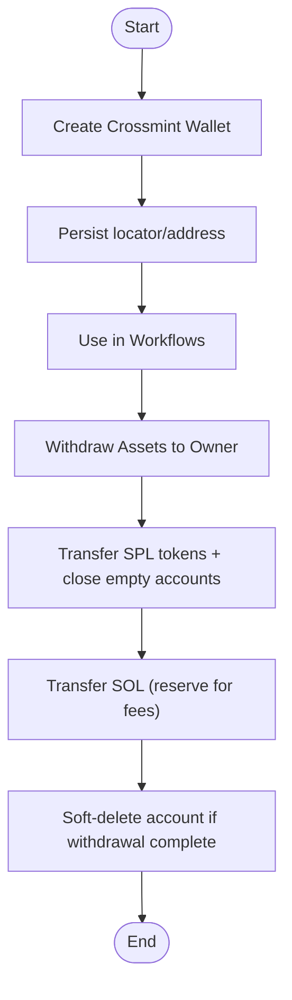
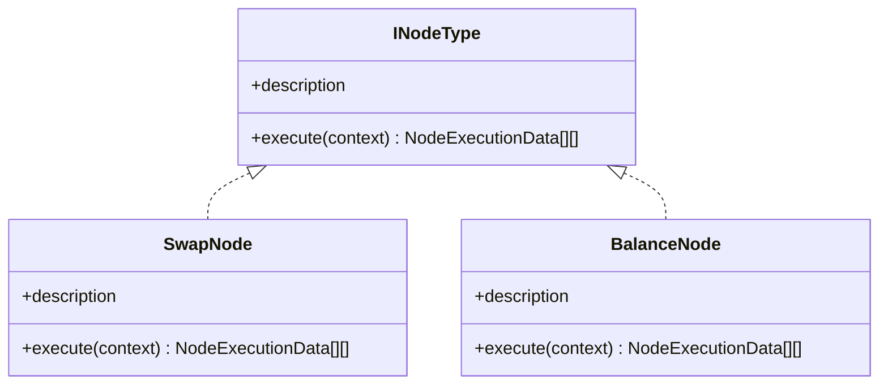
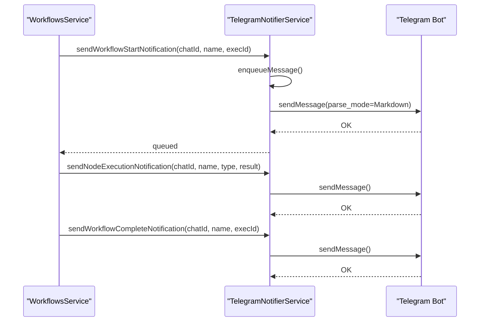
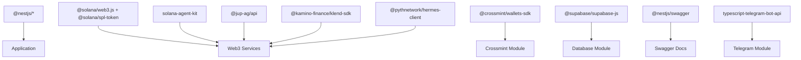

# Project Overview

<cite>
**Referenced Files in This Document**
- [README.md](file://README.md)
- [package.json](file://package.json)
- [src/main.ts](file://src/main.ts)
- [src/app.module.ts](file://src/app.module.ts)
- [src/auth/auth.service.ts](file://src/auth/auth.service.ts)
- [src/agent/agent.service.ts](file://src/agent/agent.service.ts)
- [src/crossmint/crossmint.service.ts](file://src/crossmint/crossmint.service.ts)
- [src/workflows/workflows.service.ts](file://src/workflows/workflows.service.ts)
- [src/workflows/workflow-executor.factory.ts](file://src/workflows/workflow-executor.factory.ts)
- [src/web3/nodes/node-registry.ts](file://src/web3/nodes/node-registry.ts)
- [src/web3/nodes/swap.node.ts](file://src/web3/nodes/swap.node.ts)
- [src/web3/nodes/balance.node.ts](file://src/web3/nodes/balance.node.ts)
- [src/web3/workflow-types.ts](file://src/web3/workflow-types.ts)
- [src/telegram/telegram-notifier.service.ts](file://src/telegram/telegram-notifier.service.ts)
- [docs/NODES_REFERENCE.md](file://docs/NODES_REFERENCE.md)
</cite>

## Table of Contents
1. [Introduction](#introduction)
2. [Project Structure](#project-structure)
3. [Core Components](#core-components)
4. [Architecture Overview](#architecture-overview)
5. [Detailed Component Analysis](#detailed-component-analysis)
6. [Dependency Analysis](#dependency-analysis)
7. [Performance Considerations](#performance-considerations)
8. [Troubleshooting Guide](#troubleshooting-guide)
9. [Conclusion](#conclusion)

## Introduction
PinTool is a NestJS-based backend service designed to automate DeFi workflows on the Solana blockchain. It enables programmable automation through a visual workflow engine with 11 specialized workflow nodes, integrated wallet signature authentication, an agent API for programmatic access, Crossmint custodial wallet management, real-time Telegram notifications, and robust Supabase-backed persistence with Row Level Security (RLS).

At its core, PinTool lets users define reusable automation “workflows” composed of modular “nodes.” These nodes encapsulate actions such as token swaps, staking, lending, perpetual trading, and balance checks, orchestrated to execute automatically or on-demand. The platform emphasizes composability, security (via wallet signatures and RLS), and operational visibility (via Telegram alerts).

Practical use cases include:
- Automated token swapping triggered by price thresholds
- Periodic staking and unstaking operations
- Yield farming and liquidity provision across DeFi protocols
- Portfolio rebalancing based on balance conditions
- Automated withdrawals and asset consolidation via Crossmint wallets

## Project Structure
The backend is organized into feature-focused modules with clear separation of concerns:
- Authentication and session management via wallet signatures
- Agent API for programmatic access with API key guards
- Crossmint integration for custodial wallet creation and lifecycle
- Workflow engine with a registry of nodes and execution orchestration
- Telegram notifications for workflow lifecycle events
- Supabase integration for database operations and RLS
- Web3 services for Solana interactions (AgentKit, token utilities, transactions)

**Diagram sources**
- [src/app.module.ts:15-31](file://src/app.module.ts#L15-L31)
- [src/main.ts:39-63](file://src/main.ts#L39-L63)

**Section sources**
- [README.md:27-54](file://README.md#L27-L54)
- [src/app.module.ts:15-31](file://src/app.module.ts#L15-L31)
- [src/main.ts:39-63](file://src/main.ts#L39-L63)

## Core Components
- Wallet Signature Authentication: Stateless challenge-response using Solana wallet signatures with database-backed challenge caching and expiration.
- Agent API: Programmatic access via API keys with agent registration and account listing.
- Crossmint Integration: Create, manage, and withdraw from custodial wallets; integrates with AgentKit for on-chain operations.
- Workflow Engine: JSON-based workflow definitions with a registry of 11 nodes (price feeds, swaps, staking, lending, perpetuals, transfers, balances, webhooks).
- Telegram Notifications: Real-time updates for workflow starts, completions, failures, and node executions.
- Supabase Integration: PostgreSQL-backed persistence with RLS to enforce tenant isolation.

**Section sources**
- [README.md:5-26](file://README.md#L5-L26)
- [src/auth/auth.service.ts:24-51](file://src/auth/auth.service.ts#L24-L51)
- [src/agent/agent.service.ts:15-59](file://src/agent/agent.service.ts#L15-L59)
- [src/crossmint/crossmint.service.ts:84-154](file://src/crossmint/crossmint.service.ts#L84-L154)
- [src/workflows/workflows.service.ts:83-214](file://src/workflows/workflows.service.ts#L83-L214)
- [src/telegram/telegram-notifier.service.ts:30-113](file://src/telegram/telegram-notifier.service.ts#L30-L113)
- [src/web3/nodes/node-registry.ts:23-47](file://src/web3/nodes/node-registry.ts#L23-L47)

## Architecture Overview
The system follows a layered architecture:
- Presentation Layer: NestJS controllers expose REST endpoints for authentication, agent operations, workflow management, Telegram, and referrals.
- Application Layer: Services coordinate business logic, enforce authorization, and orchestrate cross-service calls.
- Domain Layer: Web3 nodes encapsulate protocol-specific operations; the workflow engine executes them deterministically.
- Infrastructure Layer: Supabase for persistence and RLS; Solana Web3.js for blockchain interactions; Telegram Bot API for notifications; Crossmint SDK for custodial wallets.

**Diagram sources**
- [src/app.module.ts:15-31](file://src/app.module.ts#L15-L31)
- [src/workflows/workflow-executor.factory.ts:17-34](file://src/workflows/workflow-executor.factory.ts#L17-L34)
- [src/web3/nodes/node-registry.ts:23-47](file://src/web3/nodes/node-registry.ts#L23-L47)
- [src/crossmint/crossmint.service.ts:42-75](file://src/crossmint/crossmint.service.ts#L42-L75)
- [src/telegram/telegram-notifier.service.ts:14-24](file://src/telegram/telegram-notifier.service.ts#L14-L24)

## Detailed Component Analysis

### Authentication and Authorization
- Wallet Signature Authentication:
  - Generates a time-bound challenge per wallet address and stores it in the database.
  - Verifies client-provided signatures using Ed25519 and base58 decoding.
  - Cleans up expired challenges periodically and ensures user records exist post-auth.
- Agent API:
  - Agents register using wallet signatures and receive a hashed API key.
  - API keys are rotated atomically via a stored procedure to prevent reuse of old keys.
  - Agent accounts are listed by owner wallet address.

**Diagram sources**
- [src/auth/auth.service.ts:27-51](file://src/auth/auth.service.ts#L27-L51)
- [src/auth/auth.service.ts:57-91](file://src/auth/auth.service.ts#L57-L91)

**Section sources**
- [src/auth/auth.service.ts:24-51](file://src/auth/auth.service.ts#L24-L51)
- [src/auth/auth.service.ts:57-91](file://src/auth/auth.service.ts#L57-L91)
- [src/agent/agent.service.ts:15-59](file://src/agent/agent.service.ts#L15-L59)

### Agent API and Programmatic Access
- Registration flow:
  - Wallet signature verification followed by agent user upsert and atomic API key rotation.
- Account listing:
  - Fetches active agent accounts owned by the verified wallet address.

**Diagram sources**
- [src/agent/agent.service.ts:15-59](file://src/agent/agent.service.ts#L15-L59)
- [src/auth/auth.service.ts:57-91](file://src/auth/auth.service.ts#L57-L91)

**Section sources**
- [src/agent/agent.service.ts:15-59](file://src/agent/agent.service.ts#L15-L59)

### Crossmint Custodial Wallets
- Creation:
  - Creates a Crossmint wallet under a structured owner identifier and persists locator/address in the database.
- Lifecycle:
  - Retrieves wallet adapters for on-chain operations.
  - Withdraws all SPL tokens and SOL back to an owner wallet, closing empty token accounts to reclaim rent.
  - Soft-deletes the account only after successful withdrawal.
- Integration:
  - Used by workflow nodes to sign and submit transactions via AgentKit.

**Diagram sources**
- [src/crossmint/crossmint.service.ts:84-154](file://src/crossmint/crossmint.service.ts#L84-L154)
- [src/crossmint/crossmint.service.ts:209-344](file://src/crossmint/crossmint.service.ts#L209-L344)

**Section sources**
- [src/crossmint/crossmint.service.ts:84-154](file://src/crossmint/crossmint.service.ts#L84-L154)
- [src/crossmint/crossmint.service.ts:209-344](file://src/crossmint/crossmint.service.ts#L209-L344)

### Workflow Engine and Node Types
- Node Registry:
  - Central registry that auto-registers all 11 node types, enabling dynamic discovery and execution.
- Node Types:
  - PriceFeed, Swap, LimitOrder, Stake, Kamino, Lulo, Drift, Sanctum, Transfer, Balance, HeliusWebhook.
- Execution:
  - WorkflowsService creates an execution record, resolves Telegram chat and optional Crossmint wallet, and delegates to WorkflowExecutorFactory to instantiate a WorkflowInstance with registered nodes.
  - Execution proceeds asynchronously; completion/failure updates are persisted with logs.

**Diagram sources**
- [src/web3/workflow-types.ts:12-15](file://src/web3/workflow-types.ts#L12-L15)
- [src/web3/nodes/swap.node.ts:49-100](file://src/web3/nodes/swap.node.ts#L49-L100)
- [src/web3/nodes/balance.node.ts:15-66](file://src/web3/nodes/balance.node.ts#L15-L66)

**Section sources**
- [src/web3/nodes/node-registry.ts:23-47](file://src/web3/nodes/node-registry.ts#L23-L47)
- [src/workflows/workflows.service.ts:83-214](file://src/workflows/workflows.service.ts#L83-L214)
- [src/workflows/workflow-executor.factory.ts:17-40](file://src/workflows/workflow-executor.factory.ts#L17-L40)
- [docs/NODES_REFERENCE.md:10-275](file://docs/NODES_REFERENCE.md#L10-L275)

### Telegram Notifications
- Queue-based delivery with throttling to respect rate limits.
- Messages cover workflow start, node completion, and failure with contextual details.
- Enabled only when the Telegram bot token is configured.

**Diagram sources**
- [src/telegram/telegram-notifier.service.ts:30-113](file://src/telegram/telegram-notifier.service.ts#L30-L113)
- [src/workflows/workflows.service.ts:132-145](file://src/workflows/workflows.service.ts#L132-L145)

**Section sources**
- [src/telegram/telegram-notifier.service.ts:30-113](file://src/telegram/telegram-notifier.service.ts#L30-L113)
- [src/workflows/workflows.service.ts:132-145](file://src/workflows/workflows.service.ts#L132-L145)

### Practical Examples
- Automated token swapping:
  - Use the Swap node with amount parsing (“auto”, “all”, “half”) and slippage tolerance; optionally chain with a Balance node to gate execution based on thresholds.
- Staking operations:
  - Stake SOL for liquid staking tokens via the Stake node; later unstake using the same node with appropriate parameters.
- DeFi portfolio management:
  - Combine Balance queries, conditional checks, and Swap/LimitOrder nodes to rebalance positions or take profit/loss triggers.

These examples map directly to the node capabilities documented in the node reference.

**Section sources**
- [docs/NODES_REFERENCE.md:119-140](file://docs/NODES_REFERENCE.md#L119-L140)
- [docs/NODES_REFERENCE.md:246-252](file://docs/NODES_REFERENCE.md#L246-L252)
- [src/web3/nodes/swap.node.ts:102-207](file://src/web3/nodes/swap.node.ts#L102-L207)
- [src/web3/nodes/balance.node.ts:68-194](file://src/web3/nodes/balance.node.ts#L68-L194)

## Dependency Analysis
The backend leverages a modern, modular tech stack:
- Framework and runtime: NestJS 10, TypeScript 5
- Blockchain: Solana Web3.js, AgentKit, SPL Token
- DeFi integrations: Jupiter Aggregator, Kamino Finance, Pyth Network, Drift Protocol, Sanctum, Lulo Finance
- Infrastructure: Supabase (PostgreSQL), Swagger/OpenAPI, Telegram Bot API, Crossmint SDK
- Utilities: Decimal arithmetic, Axios, RxJS, class-validator/class-transformer

**Diagram sources**
- [package.json:23-53](file://package.json#L23-L53)
- [src/main.ts:39-63](file://src/main.ts#L39-L63)

**Section sources**
- [package.json:23-53](file://package.json#L23-L53)
- [src/main.ts:39-63](file://src/main.ts#L39-L63)

## Performance Considerations
- Asynchronous execution: Workflow execution is fire-and-forget from the API perspective, reducing latency for clients while ensuring eventual consistency.
- Throttled notifications: Telegram notifier enforces a minimum interval to avoid rate limiting.
- Idempotent operations: Challenges are consumed upon verification; API key rotation is atomic; Crossmint withdrawals guard against partial closure.
- Resource pooling: Reuse of services (e.g., AgentKitService) across nodes minimizes initialization overhead.

[No sources needed since this section provides general guidance]

## Troubleshooting Guide
Common issues and resolutions:
- Supabase credentials missing:
  - Ensure SUPABASE_URL and SUPABASE_SERVICE_KEY are set; migrations must be applied.
- Telegram bot not responding:
  - Confirm TELEGRAM_BOT_TOKEN is correct and the bot is started; verify logs show initialization success.
- Workflow execution failures:
  - Verify Solana RPC accessibility, sufficient SOL for fees, and that Crossmint wallets are initialized.
- Crossmint wallet errors:
  - Confirm CROSSMINT_SERVER_API_KEY correctness and environment alignment (staging vs production).

**Section sources**
- [README.md:289-306](file://README.md#L289-L306)

## Conclusion
PinTool delivers a robust, extensible automation platform for Solana DeFi. Its modular workflow engine, secure authentication, custodial wallet integration, and real-time notifications enable sophisticated automation scenarios. The NestJS architecture, combined with Supabase and a curated set of DeFi SDKs, provides a solid foundation for building production-grade automation services.

[No sources needed since this section summarizes without analyzing specific files]