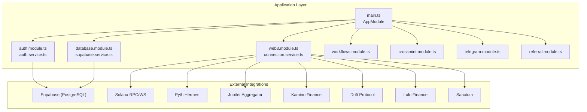
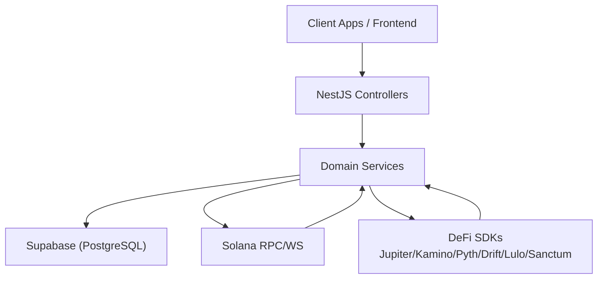
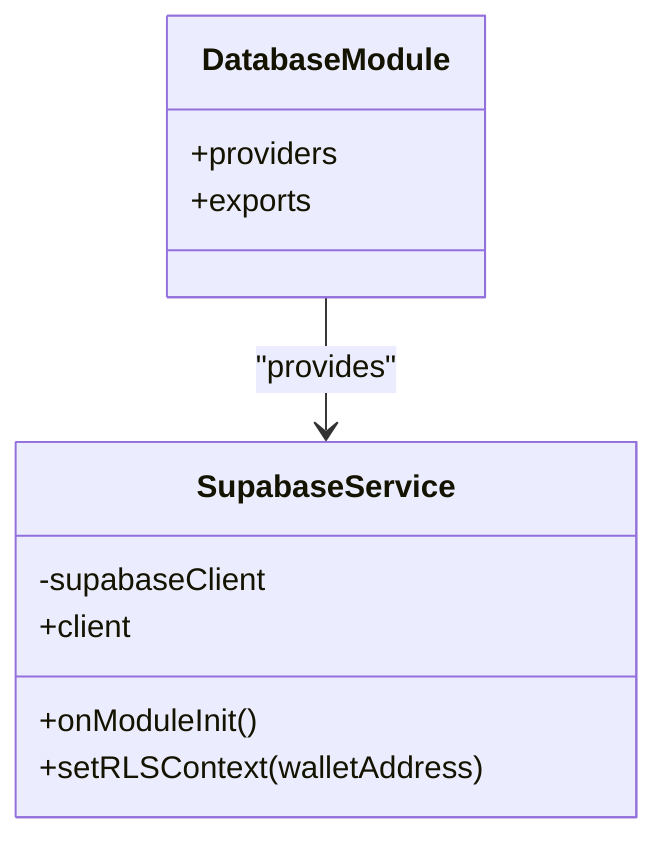
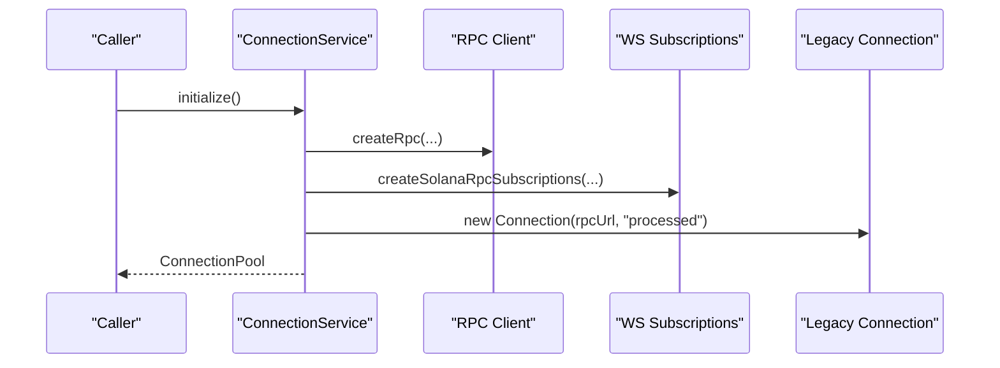
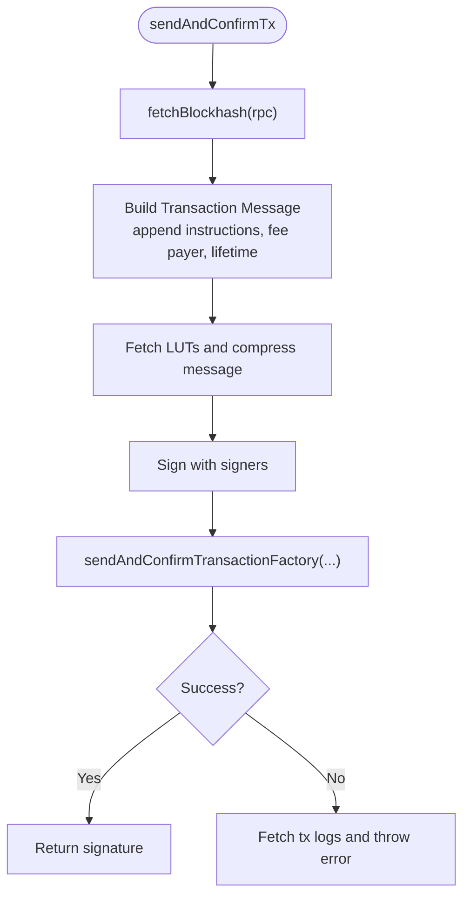
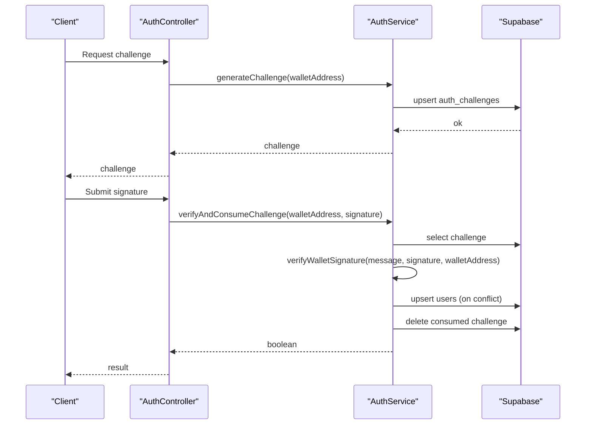
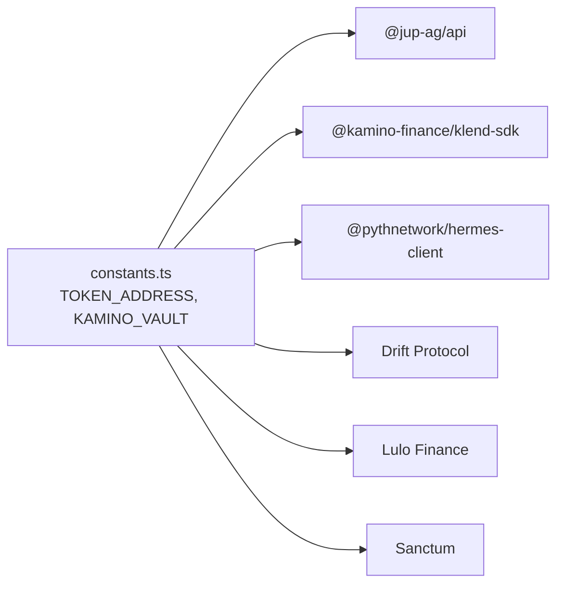
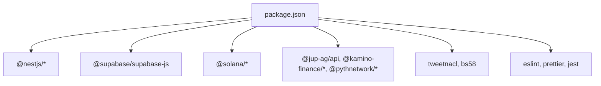

# Technology Stack

<cite>
**Referenced Files in This Document**
- [package.json](file://package.json)
- [tsconfig.json](file://tsconfig.json)
- [nest-cli.json](file://nest-cli.json)
- [Dockerfile](file://Dockerfile)
- [.eslintrc.js](file://.eslintrc.js)
- [.prettierrc](file://.prettierrc)
- [configuration.ts](file://src/config/configuration.ts)
- [supabase.service.ts](file://src/database/supabase.service.ts)
- [database.module.ts](file://src/database/database.module.ts)
- [config.toml](file://supabase/config.toml)
- [connection.service.ts](file://src/web3/services/connection.service.ts)
- [env.service.ts](file://src/web3/services/env.service.ts)
- [connection.ts](file://src/web3/utils/connection.ts)
- [constants.ts](file://src/web3/constants.ts)
- [auth.service.ts](file://src/auth/auth.service.ts)
- [wallet-challenge.dto.ts](file://src/auth/dto/wallet-challenge.dto.ts)
- [tx.ts](file://src/web3/utils/tx.ts)
- [token.ts](file://src/web3/utils/token.ts)
</cite>

## Table of Contents
1. [Introduction](#introduction)
2. [Project Structure](#project-structure)
3. [Core Components](#core-components)
4. [Architecture Overview](#architecture-overview)
5. [Detailed Component Analysis](#detailed-component-analysis)
6. [Dependency Analysis](#dependency-analysis)
7. [Performance Considerations](#performance-considerations)
8. [Security Considerations](#security-considerations)
9. [Maintenance and Upgrade Guidance](#maintenance-and-upgrade-guidance)
10. [Troubleshooting Guide](#troubleshooting-guide)
11. [Conclusion](#conclusion)

## Introduction
This document provides a comprehensive technology stack overview for the PinTool platform. It covers the backend framework (NestJS 10), programming language (TypeScript 5), database (PostgreSQL via Supabase), blockchain integration (Solana Web3.js and @solana/kit), DeFi protocol integrations (Jupiter Aggregator, Kamino Finance, Pyth price feeds, Drift, Lulo Finance, Sanctum), authentication (wallet signature verification with tweetnacl and base58), development tools (ESLint, Prettier), testing (Jest), and deployment (Docker). It also explains version compatibility, integration patterns, performance characteristics, security implications, and upgrade paths.

## Project Structure
The backend is organized around NestJS modules and feature-based packages:
- Application entrypoint and module wiring
- Feature modules: auth, database, web3, workflows, crossmint, telegram, referral
- Shared utilities for web3 transactions, token conversions, and connection pooling
- Supabase integration for database and auth challenges
- Configuration via environment variables and Supabase config

**Diagram sources**
- [main.ts](file://src/main.ts)
- [app.module.ts](file://src/app.module.ts)
- [auth.module.ts](file://src/auth/auth.module.ts)
- [database.module.ts](file://src/database/database.module.ts)
- [web3.module.ts](file://src/web3/web3.module.ts)
- [workflows.module.ts](file://src/workflows/workflows.module.ts)
- [crossmint.module.ts](file://src/crossmint/crossmint.module.ts)
- [telegram.module.ts](file://src/telegram/telegram.module.ts)
- [referral.module.ts](file://src/referral/referral.module.ts)

**Section sources**
- [package.json:1-95](file://package.json#L1-L95)
- [tsconfig.json:1-55](file://tsconfig.json#L1-L55)
- [nest-cli.json:1-9](file://nest-cli.json#L1-L9)

## Core Components
- Framework and Language
  - NestJS 10.x for modular backend architecture
  - TypeScript 5.x with strict compiler options and path aliases
- Database and Auth
  - Supabase client for PostgreSQL-backed auth and RLS
  - Environment-driven configuration for Supabase credentials and endpoints
- Blockchain Layer
  - Solana Web3.js and @solana/kit for RPC, WS subscriptions, and transaction construction
  - Connection pooling and caching for performance
- DeFi Integrations
  - Jupiter Aggregator SDK for swaps
  - Kamino Finance SDK for lending
  - Pyth Network Hermes client for price feeds
  - Drift, Lulo Finance, Sanctum for specialized DeFi operations
- Authentication
  - Wallet challenge generation and signature verification using tweetnacl and base58
- Dev Tools and Testing
  - ESLint + Prettier for code quality
  - Jest for unit and integration tests
- Deployment
  - Multi-stage Docker build with health checks and non-root runtime

**Section sources**
- [package.json:23-54](file://package.json#L23-L54)
- [tsconfig.json:2-49](file://tsconfig.json#L2-L49)
- [configuration.ts:1-45](file://src/config/configuration.ts#L1-L45)
- [supabase.service.ts:1-42](file://src/database/supabase.service.ts#L1-L42)
- [connection.service.ts:1-73](file://src/web3/services/connection.service.ts#L1-L73)
- [auth.service.ts:1-165](file://src/auth/auth.service.ts#L1-L165)
- [.eslintrc.js:1-29](file://.eslintrc.js#L1-L29)
- [.prettierrc:1-9](file://.prettierrc#L1-L9)
- [Dockerfile:1-63](file://Dockerfile#L1-L63)

## Architecture Overview
The system follows a layered architecture:
- Presentation and orchestration via NestJS controllers and services
- Domain services for web3 operations, DeFi integrations, and workflow execution
- Persistence through Supabase-managed PostgreSQL
- External chain and off-chain services via SDKs and HTTP/WebSocket clients

**Diagram sources**
- [auth.controller.ts](file://src/auth/auth.controller.ts)
- [workflows.controller.ts](file://src/workflows/workflows.controller.ts)
- [supabase.service.ts](file://src/database/supabase.service.ts)
- [connection.service.ts](file://src/web3/services/connection.service.ts)
- [constants.ts](file://src/web3/constants.ts)

## Detailed Component Analysis

### Database and Supabase Integration
- Supabase client initialization with service key and disabled auto-refresh for server-side sessions
- RLS context helper to set wallet-specific config for row-level security
- Centralized configuration via environment variables

**Diagram sources**
- [supabase.service.ts:1-42](file://src/database/supabase.service.ts#L1-L42)
- [database.module.ts:1-10](file://src/database/database.module.ts#L1-L10)

**Section sources**
- [supabase.service.ts:11-40](file://src/database/supabase.service.ts#L11-L40)
- [configuration.ts:6-10](file://src/config/configuration.ts#L6-L10)
- [config.toml:1-383](file://supabase/config.toml#L1-L383)

### Solana Connection and Transaction Utilities
- ConnectionService creates RPC, WS subscriptions, and legacy Connection instances
- Utility functions provide cached connection pools and blockhash fetching
- Transaction utilities construct, simulate, and send transactions with optional lookup tables

**Diagram sources**
- [connection.service.ts:22-73](file://src/web3/services/connection.service.ts#L22-L73)

**Diagram sources**
- [tx.ts:41-101](file://src/web3/utils/tx.ts#L41-L101)

**Section sources**
- [connection.service.ts:30-71](file://src/web3/services/connection.service.ts#L30-L71)
- [connection.ts:20-67](file://src/web3/utils/connection.ts#L20-L67)
- [tx.ts:41-158](file://src/web3/utils/tx.ts#L41-L158)
- [token.ts:7-44](file://src/web3/utils/token.ts#L7-L44)

### Authentication and Wallet Signature Verification
- Challenge generation with random nonce and expiration
- Signature verification using tweetnacl detached verify with base58-decoded signatures
- User upsert and challenge lifecycle management

**Diagram sources**
- [auth.service.ts:27-91](file://src/auth/auth.service.ts#L27-L91)
- [wallet-challenge.dto.ts:1-16](file://src/auth/dto/wallet-challenge.dto.ts#L1-L16)

**Section sources**
- [auth.service.ts:27-163](file://src/auth/auth.service.ts#L27-L163)
- [wallet-challenge.dto.ts:4-15](file://src/auth/dto/wallet-challenge.dto.ts#L4-L15)

### DeFi Protocol Integrations
- Token constants and vault addresses for Kamino and token mappings
- Integration points for Jupiter, Drift, Lulo, Sanctum, and Pyth price feeds are configured via environment variables

**Diagram sources**
- [constants.ts:1-603](file://src/web3/constants.ts#L1-L603)
- [configuration.ts:23-44](file://src/config/configuration.ts#L23-L44)

**Section sources**
- [constants.ts:1-603](file://src/web3/constants.ts#L1-L603)
- [configuration.ts:23-44](file://src/config/configuration.ts#L23-L44)

## Dependency Analysis
- NestJS core modules and platform express form the application backbone
- Supabase client and pg driver for PostgreSQL connectivity
- Solana ecosystem libraries for chain interaction
- DeFi SDKs and Pyth client for market data
- Development toolchain for linting and formatting

**Diagram sources**
- [package.json:23-54](file://package.json#L23-L54)

**Section sources**
- [package.json:23-94](file://package.json#L23-L94)

## Performance Considerations
- Connection pooling and caching
  - Reuse RPC/WS connections and cache token decimals to reduce repeated network calls
  - Use address lookup tables to compress transactions and lower size overhead
- Commitment levels and prefetch settings
  - Default processed commitment balances latency and reliability trade-offs
  - Skip preflight for higher throughput where acceptable
- Database RLS and context
  - Set RLS config per request to enforce wallet-scoped access
- Token conversion caching
  - Memoize token decimals to avoid redundant getMint calls

**Section sources**
- [connection.ts:20-67](file://src/web3/utils/connection.ts#L20-L67)
- [tx.ts:41-101](file://src/web3/utils/tx.ts#L41-L101)
- [token.ts:4-15](file://src/web3/utils/token.ts#L4-L15)
- [supabase.service.ts:33-40](file://src/database/supabase.service.ts#L33-L40)

## Security Considerations
- Authentication
  - Nonces and expirable challenges prevent replay attacks
  - tweetnacl verifies signatures against ed25519 public keys
  - base58 decoding ensures signatures are in canonical Solana format
- Secrets management
  - Supabase service key and API keys loaded from environment variables
  - Avoid logging sensitive data; errors are handled without exposing secrets
- Data integrity
  - RLS enforced via setRLSContext to scope rows by wallet address
  - DTO validation for wallet addresses using regex patterns

**Section sources**
- [auth.service.ts:57-111](file://src/auth/auth.service.ts#L57-L111)
- [wallet-challenge.dto.ts:4-15](file://src/auth/dto/wallet-challenge.dto.ts#L4-L15)
- [supabase.service.ts:33-40](file://src/database/supabase.service.ts#L33-L40)
- [configuration.ts:6-44](file://src/config/configuration.ts#L6-L44)

## Maintenance and Upgrade Guidance
- NestJS 10.x
  - Keep aligned with latest patch releases; review breaking changes in major updates
  - Leverage Nest schematics and webpack compilation settings
- TypeScript 5.x
  - Maintain strictNullChecks and incremental builds for reliability
  - Update tsconfig-paths and ts-jest for test environments
- Solana ecosystem
  - Track @solana/web3.js and @solana/kit compatibility; prefer LTS-compatible versions
  - Monitor blockhash validity windows and adjust simulation/confirmation flows
- Supabase
  - Align local major_version with remote database; keep migrations and seed files synchronized
  - Review RLS policies and setRLSContext usage after schema changes
- DeFi SDKs
  - Pin versions for @jup-ag/api, @kamino-finance/klend-sdk, @pythnetwork/hermes-client
  - Validate on-chain program IDs and price feed IDs after upgrades
- Tooling
  - Update ESLint and Prettier configs to enforce consistent code standards
  - Maintain Jest configuration for coverage and watch modes

**Section sources**
- [nest-cli.json:5-7](file://nest-cli.json#L5-L7)
- [tsconfig.json:14-19](file://tsconfig.json#L14-L19)
- [config.toml:32-34](file://supabase/config.toml#L32-L34)
- [package.json:55-76](file://package.json#L55-L76)

## Troubleshooting Guide
- Supabase initialization failures
  - Ensure SUPABASE_URL and SUPABASE_SERVICE_KEY are set
  - Verify service key permissions and network connectivity
- Authentication challenge issues
  - Confirm challenge expiration and nonce uniqueness
  - Validate wallet address format and signature encoding
- Transaction failures
  - Inspect transaction logs returned on send failure
  - Adjust commitment levels and retry strategies
- Token decimals mismatch
  - Clear cache or re-fetch mint info if token metadata changes
- Docker health checks
  - Confirm health endpoint responds and environment variables are passed

**Section sources**
- [supabase.service.ts:11-27](file://src/database/supabase.service.ts#L11-L27)
- [auth.service.ts:57-91](file://src/auth/auth.service.ts#L57-L91)
- [tx.ts:70-98](file://src/web3/utils/tx.ts#L70-L98)
- [token.ts:7-15](file://src/web3/utils/token.ts#L7-L15)
- [Dockerfile:54-56](file://Dockerfile#L54-L56)

## Conclusion
The PinTool platform leverages a modern, modular backend built on NestJS and TypeScript, integrated with Supabase for database and auth, and a comprehensive Solana ecosystem for blockchain operations. DeFi integrations are structured via SDKs and environment-driven configuration, while robust authentication and security measures protect user assets. The provided architecture, performance tips, and upgrade guidance support maintainability and scalability.