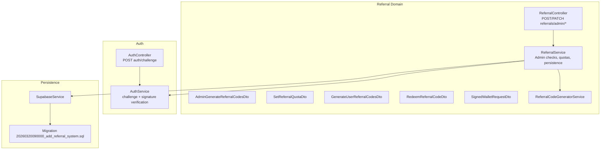
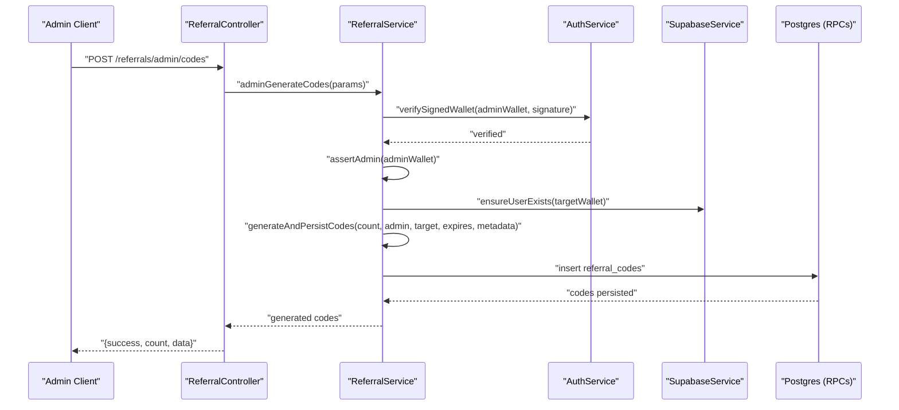
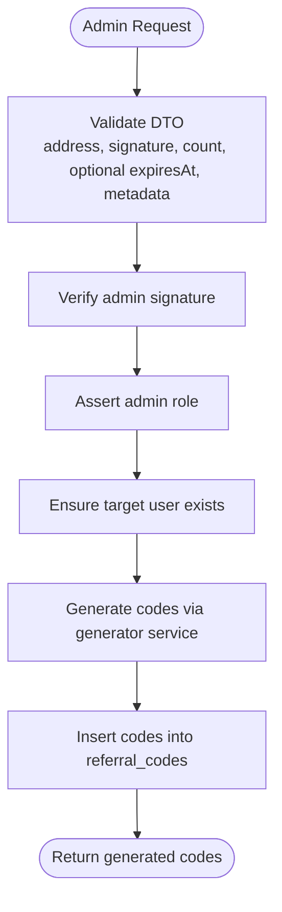
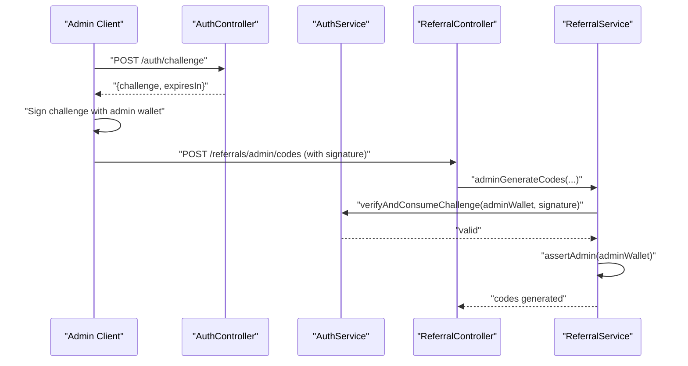
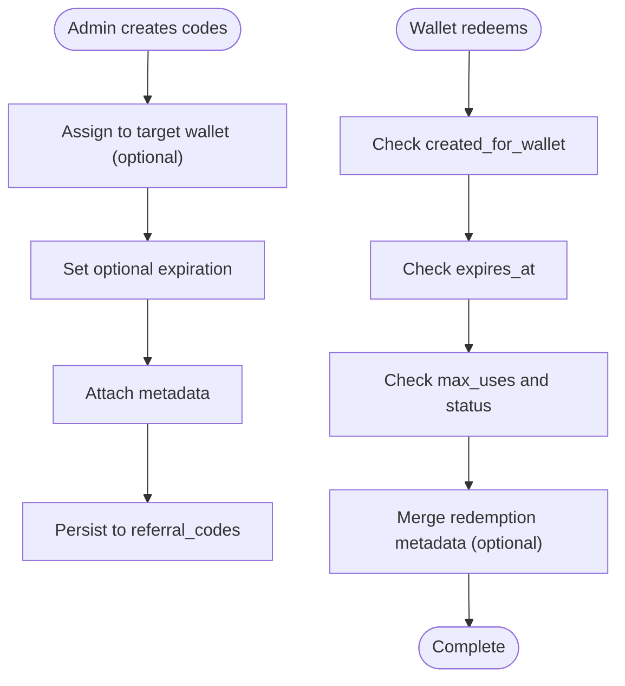
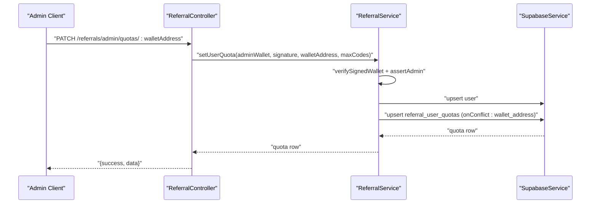
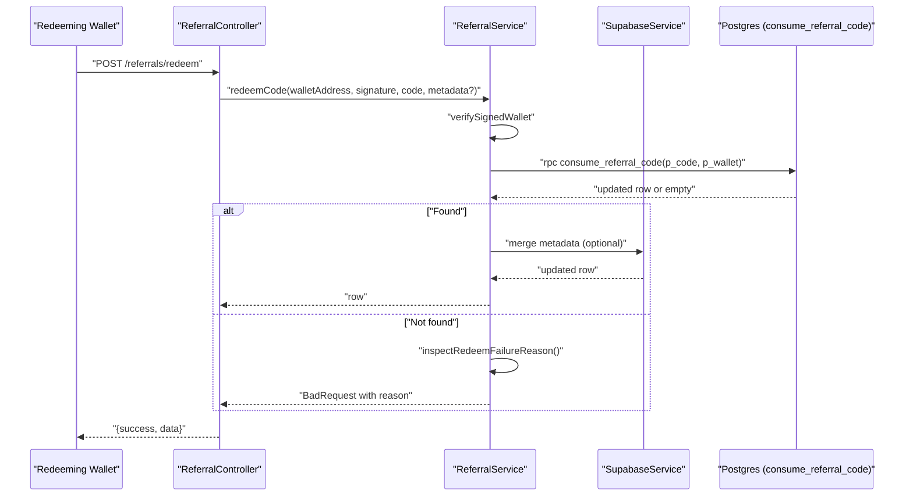
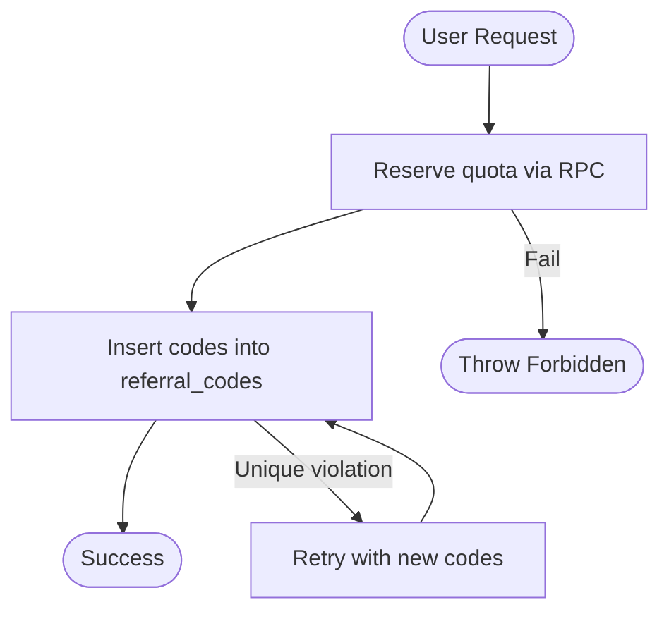
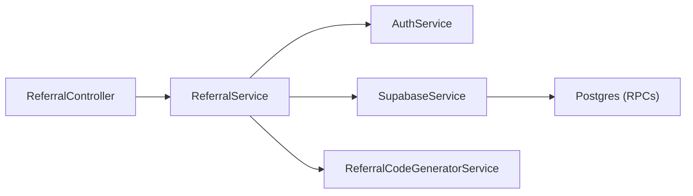

# Administrative Controls

<cite>
**Referenced Files in This Document**
- [referral.controller.ts](file://src/referral/referral.controller.ts)
- [referral.service.ts](file://src/referral/referral.service.ts)
- [admin-generate-referral-codes.dto.ts](file://src/referral/dto/admin-generate-referral-codes.dto.ts)
- [set-referral-quota.dto.ts](file://src/referral/dto/set-referral-quota.dto.ts)
- [generate-user-referral-codes.dto.ts](file://src/referral/dto/generate-user-referral-codes.dto.ts)
- [redeem-referral-code.dto.ts](file://src/referral/dto/redeem-referral-code.dto.ts)
- [signed-wallet-request.dto.ts](file://src/referral/dto/signed-wallet-request.dto.ts)
- [referral-code-generator.service.ts](file://src/referral/referral-code-generator.service.ts)
- [referral.constants.ts](file://src/referral/referral.constants.ts)
- [auth.controller.ts](file://src/auth/auth.controller.ts)
- [auth.service.ts](file://src/auth/auth.service.ts)
- [supabase.service.ts](file://src/database/supabase.service.ts)
- [20260320090000_add_referral_system.sql](file://supabase/migrations/20260320090000_add_referral_system.sql)
</cite>

## Table of Contents
1. [Introduction](#introduction)
2. [Project Structure](#project-structure)
3. [Core Components](#core-components)
4. [Architecture Overview](#architecture-overview)
5. [Detailed Component Analysis](#detailed-component-analysis)
6. [Dependency Analysis](#dependency-analysis)
7. [Performance Considerations](#performance-considerations)
8. [Troubleshooting Guide](#troubleshooting-guide)
9. [Conclusion](#conclusion)
10. [Appendices](#appendices)

## Introduction
This document describes the administrative controls for the referral system, focusing on privileged operations and oversight capabilities. It explains admin-only code generation with admin wallet signature verification, target wallet validation, bulk code creation, administrative approval workflow via role-based access control, audit trail maintenance, administrative responsibility tracking, targeted code assignment, expiration date configuration, and metadata management. Practical administrative scenarios such as promotional campaigns, user onboarding assistance, and emergency code issuance are included, along with security considerations, best practices, and monitoring guidance.

## Project Structure
The administrative referral system spans the Referral domain (controller, service, DTOs, generator), Authentication (challenge generation and signature verification), and the Supabase-backed persistence layer with stored procedures for quota and redemption.

**Diagram sources**
- [referral.controller.ts:15-47](file://src/referral/referral.controller.ts#L15-L47)
- [referral.service.ts:84-107](file://src/referral/referral.service.ts#L84-L107)
- [admin-generate-referral-codes.dto.ts:15-73](file://src/referral/dto/admin-generate-referral-codes.dto.ts#L15-L73)
- [set-referral-quota.dto.ts:5-34](file://src/referral/dto/set-referral-quota.dto.ts#L5-L34)
- [generate-user-referral-codes.dto.ts:15-62](file://src/referral/dto/generate-user-referral-codes.dto.ts#L15-L62)
- [redeem-referral-code.dto.ts:5-41](file://src/referral/dto/redeem-referral-code.dto.ts#L5-L41)
- [signed-wallet-request.dto.ts:5-25](file://src/referral/dto/signed-wallet-request.dto.ts#L5-L25)
- [referral-code-generator.service.ts:24-49](file://src/referral/referral-code-generator.service.ts#L24-L49)
- [auth.controller.ts:11-47](file://src/auth/auth.controller.ts#L11-L47)
- [auth.service.ts:27-91](file://src/auth/auth.service.ts#L27-L91)
- [supabase.service.ts:33-40](file://src/database/supabase.service.ts#L33-L40)
- [20260320090000_add_referral_system.sql:11-48](file://supabase/migrations/20260320090000_add_referral_system.sql#L11-L48)

**Section sources**
- [referral.controller.ts:1-92](file://src/referral/referral.controller.ts#L1-L92)
- [referral.service.ts:1-364](file://src/referral/referral.service.ts#L1-L364)
- [auth.controller.ts:1-49](file://src/auth/auth.controller.ts#L1-L49)
- [auth.service.ts:1-165](file://src/auth/auth.service.ts#L1-L165)
- [supabase.service.ts:1-42](file://src/database/supabase.service.ts#L1-L42)
- [20260320090000_add_referral_system.sql:1-195](file://supabase/migrations/20260320090000_add_referral_system.sql#L1-L195)

## Core Components
- Admin-only code generation endpoint: POST /referrals/admin/codes validates admin signature, admin role, and target user existence, then generates and persists single-use codes assigned to a specific wallet with optional expiration and metadata.
- Administrative quota management: PATCH /referrals/admin/quotas/:walletAddress sets a lifetime cap for a user’s codes, protected by admin signature and role checks.
- User code generation: POST /referrals/codes respects per-user lifetime quota via stored procedures and releases quota on insertion failure.
- Redemption pipeline: POST /referrals/redeem enforces admin/user signature verification, target wallet assignment, expiration, and single-use semantics via a stored procedure.
- Audit and metadata: Codes carry JSONB metadata; redemption can merge metadata for audit trails.
- Admin role enforcement: The users table includes app_role with a check constraint limiting values to 'user' or 'admin'.

**Section sources**
- [referral.controller.ts:15-47](file://src/referral/referral.controller.ts#L15-L47)
- [referral.service.ts:51-107](file://src/referral/referral.service.ts#L51-L107)
- [20260320090000_add_referral_system.sql:11-27](file://supabase/migrations/20260320090000_add_referral_system.sql#L11-L27)

## Architecture Overview
The administrative controls rely on:
- Wallet challenge/signature verification for all privileged operations.
- Admin role validation against the users table.
- Stored procedures for quota reservation/release and single-use redemption.
- A deterministic code generator for bulk creation.
- Supabase RLS and policies to enforce access control.

**Diagram sources**
- [referral.controller.ts:15-31](file://src/referral/referral.controller.ts#L15-L31)
- [referral.service.ts:84-107](file://src/referral/referral.service.ts#L84-L107)
- [auth.service.ts:57-91](file://src/auth/auth.service.ts#L57-L91)
- [20260320090000_add_referral_system.sql:106-187](file://supabase/migrations/20260320090000_add_referral_system.sql#L106-L187)

## Detailed Component Analysis

### Admin Code Generation Workflow
- Endpoint: POST /referrals/admin/codes
- Validation: Admin wallet address and signature, target wallet address, batch size limits, optional expiration, optional metadata.
- Steps:
  - Verify admin signature against active challenge.
  - Confirm admin role from users table.
  - Upsert target user to ensure presence.
  - Generate codes via the generator service.
  - Persist codes with source_type 'admin', created_for_wallet, optional expires_at, and metadata.
- Bulk capability: Batch size constrained by a constant; generator produces uppercase codes with a fixed prefix and charset.

**Diagram sources**
- [referral.controller.ts:15-31](file://src/referral/referral.controller.ts#L15-L31)
- [referral.service.ts:84-107](file://src/referral/referral.service.ts#L84-L107)
- [referral-code-generator.service.ts:30-39](file://src/referral/referral-code-generator.service.ts#L30-L39)
- [admin-generate-referral-codes.dto.ts:15-73](file://src/referral/dto/admin-generate-referral-codes.dto.ts#L15-L73)

**Section sources**
- [referral.controller.ts:15-31](file://src/referral/referral.controller.ts#L15-L31)
- [referral.service.ts:84-107](file://src/referral/referral.service.ts#L84-L107)
- [referral-code-generator.service.ts:24-49](file://src/referral/referral-code-generator.service.ts#L24-L49)
- [admin-generate-referral-codes.dto.ts:15-73](file://src/referral/dto/admin-generate-referral-codes.dto.ts#L15-L73)
- [referral.constants.ts:1-6](file://src/referral/referral.constants.ts#L1-L6)

### Administrative Approval Workflow and Role-Based Access Control
- Signature-based approval: All admin endpoints require a valid signature derived from an active challenge.
- Role-based access control: The users table includes app_role with a check constraint; admin-only operations query users and reject non-admins.
- Audit trail maintenance: Admin actions are attributable to adminWalletAddress; codes include created_by_wallet and created_for_wallet; metadata supports campaign tracking.
- Administrative responsibility tracking: Every generated code records who created it and for whom it was intended.

**Diagram sources**
- [auth.controller.ts:11-47](file://src/auth/auth.controller.ts#L11-L47)
- [auth.service.ts:27-91](file://src/auth/auth.service.ts#L27-L91)
- [referral.controller.ts:15-31](file://src/referral/referral.controller.ts#L15-L31)
- [referral.service.ts:211-236](file://src/referral/referral.service.ts#L211-L236)

**Section sources**
- [auth.controller.ts:11-47](file://src/auth/auth.controller.ts#L11-L47)
- [auth.service.ts:27-91](file://src/auth/auth.service.ts#L27-L91)
- [referral.service.ts:211-236](file://src/referral/referral.service.ts#L211-L236)
- [20260320090000_add_referral_system.sql:11-27](file://supabase/migrations/20260320090000_add_referral_system.sql#L11-L27)

### Targeted Code Assignment, Expiration, and Metadata Management
- Targeted assignment: created_for_wallet links codes to a specific wallet; redemption enforces that only the assigned wallet can redeem.
- Expiration: expires_at is optional; stored procedure enforces expiration during redemption.
- Metadata: codes store JSONB metadata; redemption can merge a redemption-specific metadata block.

**Diagram sources**
- [referral.service.ts:279-320](file://src/referral/referral.service.ts#L279-L320)
- [20260320090000_add_referral_system.sql:155-187](file://supabase/migrations/20260320090000_add_referral_system.sql#L155-L187)

**Section sources**
- [referral.service.ts:279-320](file://src/referral/referral.service.ts#L279-L320)
- [20260320090000_add_referral_system.sql:32-48](file://supabase/migrations/20260320090000_add_referral_system.sql#L32-L48)

### Administrative Quota Management
- Endpoint: PATCH /referrals/admin/quotas/:walletAddress
- Validates admin signature and role, ensures target user exists, and upserts the user quota.
- Enforces constraints: quota cannot drop below issued_count.

**Diagram sources**
- [referral.controller.ts:33-47](file://src/referral/referral.controller.ts#L33-L47)
- [referral.service.ts:51-82](file://src/referral/referral.service.ts#L51-L82)
- [set-referral-quota.dto.ts:5-34](file://src/referral/dto/set-referral-quota.dto.ts#L5-L34)

**Section sources**
- [referral.controller.ts:33-47](file://src/referral/referral.controller.ts#L33-L47)
- [referral.service.ts:51-82](file://src/referral/referral.service.ts#L51-L82)
- [set-referral-quota.dto.ts:5-34](file://src/referral/dto/set-referral-quota.dto.ts#L5-L34)

### Redemption Pipeline and Failure Inspection
- Endpoint: POST /referrals/redeem
- Verifies signature and user existence, normalizes code, invokes consume_referral_code RPC, merges redemption metadata if provided, and returns the updated row.
- Failure inspection reports reasons such as wrong assignee, expired, non-active status, or already used.

**Diagram sources**
- [referral.controller.ts:66-80](file://src/referral/referral.controller.ts#L66-L80)
- [referral.service.ts:140-193](file://src/referral/referral.service.ts#L140-L193)
- [redeem-referral-code.dto.ts:5-41](file://src/referral/dto/redeem-referral-code.dto.ts#L5-L41)
- [20260320090000_add_referral_system.sql:155-187](file://supabase/migrations/20260320090000_add_referral_system.sql#L155-L187)

**Section sources**
- [referral.controller.ts:66-80](file://src/referral/referral.controller.ts#L66-L80)
- [referral.service.ts:140-193](file://src/referral/referral.service.ts#L140-L193)
- [redeem-referral-code.dto.ts:5-41](file://src/referral/dto/redeem-referral-code.dto.ts#L5-L41)
- [20260320090000_add_referral_system.sql:155-187](file://supabase/migrations/20260320090000_add_referral_system.sql#L155-L187)

### User Code Generation and Quota Reservation
- Endpoint: POST /referrals/codes
- Reserves quota via reserve_referral_quota RPC; on insertion failure, releases quota via release_referral_quota RPC.
- Enforces per-user lifetime quota and batch size limits.

**Diagram sources**
- [referral.service.ts:109-138](file://src/referral/referral.service.ts#L109-L138)
- [20260320090000_add_referral_system.sql:106-153](file://supabase/migrations/20260320090000_add_referral_system.sql#L106-L153)

**Section sources**
- [referral.service.ts:109-138](file://src/referral/referral.service.ts#L109-L138)
- [generate-user-referral-codes.dto.ts:15-62](file://src/referral/dto/generate-user-referral-codes.dto.ts#L15-L62)
- [20260320090000_add_referral_system.sql:106-153](file://supabase/migrations/20260320090000_add_referral_system.sql#L106-L153)

### Administrative Scenarios and Examples
- Promotional campaigns:
  - Admin sets a quota for participating users.
  - Admin generates bulk codes with campaign metadata and optional expiration.
  - Users redeem codes within the campaign window.
- User onboarding assistance:
  - Admin assigns codes to specific wallets for new users.
  - Admin sets short expiration windows for timely onboarding.
- Emergency code issuance:
  - Admin quickly generates single-use codes with minimal metadata for immediate support.

[No sources needed since this section provides conceptual examples]

## Dependency Analysis
- Controller-to-Service coupling: Controllers delegate all business logic to ReferralService, keeping controllers thin.
- Service dependencies: ReferralService depends on AuthService for signature verification, SupabaseService for database access, and ReferralCodeGeneratorService for code generation.
- Database dependencies: Stored procedures encapsulate quota and redemption logic, ensuring atomicity and enforcing constraints.
- Security dependencies: Admin role enforcement and challenge/signature verification underpin all privileged operations.

**Diagram sources**
- [referral.controller.ts:1-92](file://src/referral/referral.controller.ts#L1-L92)
- [referral.service.ts:43-49](file://src/referral/referral.service.ts#L43-L49)
- [auth.service.ts:1-165](file://src/auth/auth.service.ts#L1-L165)
- [supabase.service.ts:1-42](file://src/database/supabase.service.ts#L1-L42)
- [referral-code-generator.service.ts:1-50](file://src/referral/referral-code-generator.service.ts#L1-L50)

**Section sources**
- [referral.controller.ts:1-92](file://src/referral/referral.controller.ts#L1-L92)
- [referral.service.ts:43-49](file://src/referral/referral.service.ts#L43-L49)
- [auth.service.ts:1-165](file://src/auth/auth.service.ts#L1-L165)
- [supabase.service.ts:1-42](file://src/database/supabase.service.ts#L1-L42)
- [referral-code-generator.service.ts:1-50](file://src/referral/referral-code-generator.service.ts#L1-L50)

## Performance Considerations
- Bulk generation retry loop: The service retries code generation and insertion to avoid duplicates, bounded by a maximum retry count.
- Indexes: Database indexes on created_by_wallet, created_for_wallet, and status improve query performance for listing and redemption.
- Stored procedures: Centralize atomic operations for quota and redemption to reduce contention and ensure consistency.
- Rate limiting: Consider adding rate limits at the controller level for admin endpoints to prevent abuse.

[No sources needed since this section provides general guidance]

## Troubleshooting Guide
- Admin permission errors:
  - Ensure the admin wallet has app_role 'admin'.
  - Verify the signature corresponds to an active challenge.
- Quota errors:
  - Cannot lower max_codes below issued_count; adjust upward or wait until issued_count decreases.
  - User quota reservation failures indicate insufficient quota or misconfiguration.
- Redemption failures:
  - Wrong assignee: created_for_wallet mismatch.
  - Expired: expires_at is in the past.
  - Already used or not active: status or max_uses reached.
- Audit and metadata:
  - Redemption metadata is merged; verify the final metadata reflects both original and redemption metadata.

**Section sources**
- [referral.service.ts:225-236](file://src/referral/referral.service.ts#L225-L236)
- [referral.service.ts:330-362](file://src/referral/referral.service.ts#L330-L362)
- [20260320090000_add_referral_system.sql:11-27](file://supabase/migrations/20260320090000_add_referral_system.sql#L11-L27)

## Conclusion
The administrative controls provide a secure, auditable, and scalable mechanism for privileged referral code operations. Admin-only endpoints enforce signature verification and role-based access control, while stored procedures guarantee quota and redemption integrity. Administrators can manage quotas, issue bulk codes with targeting and metadata, configure expirations, and maintain comprehensive audit trails. Proper oversight, monitoring, and adherence to best practices ensure system integrity and minimize abuse.

[No sources needed since this section summarizes without analyzing specific files]

## Appendices

### API Definitions

- POST /referrals/admin/codes
  - Description: Admin generates single-use referral codes for a target wallet.
  - Body: AdminGenerateReferralCodesDto
  - Response: { success: true, count: number, data: ReferralCodeRow[] }

- PATCH /referrals/admin/quotas/:walletAddress
  - Description: Admin sets lifetime referral-code quota for a user wallet.
  - Body: SetReferralQuotaDto
  - Response: { success: true, data: QuotaRow }

- POST /referrals/codes
  - Description: User generates single-use codes within lifetime quota.
  - Body: GenerateUserReferralCodesDto
  - Response: { success: true, count: number, data: ReferralCodeRow[] }

- POST /referrals/redeem
  - Description: Redeem a single-use referral code.
  - Body: RedeemReferralCodeDto
  - Response: { success: true, data: ReferralCodeRow }

- POST /auth/challenge
  - Description: Request authentication challenge for wallet signature.
  - Body: WalletChallengeDto
  - Response: { success: true, data: { challenge: string, expiresIn: number } }

**Section sources**
- [referral.controller.ts:15-80](file://src/referral/referral.controller.ts#L15-L80)
- [auth.controller.ts:11-47](file://src/auth/auth.controller.ts#L11-L47)
- [admin-generate-referral-codes.dto.ts:15-73](file://src/referral/dto/admin-generate-referral-codes.dto.ts#L15-L73)
- [set-referral-quota.dto.ts:5-34](file://src/referral/dto/set-referral-quota.dto.ts#L5-L34)
- [generate-user-referral-codes.dto.ts:15-62](file://src/referral/dto/generate-user-referral-codes.dto.ts#L15-L62)
- [redeem-referral-code.dto.ts:5-41](file://src/referral/dto/redeem-referral-code.dto.ts#L5-L41)