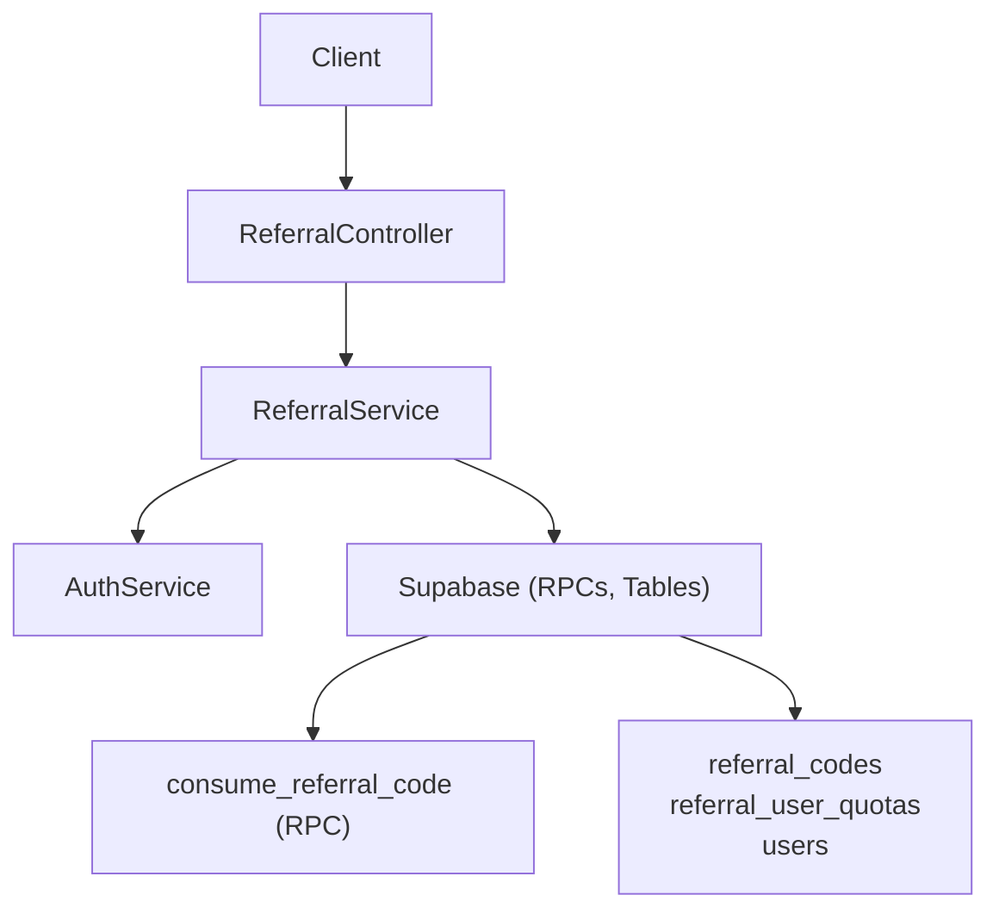
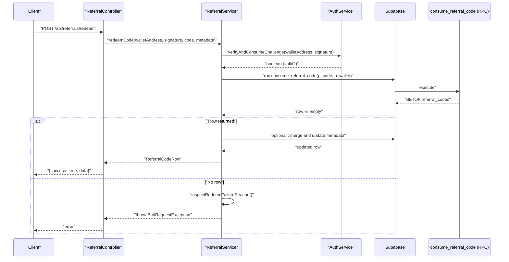
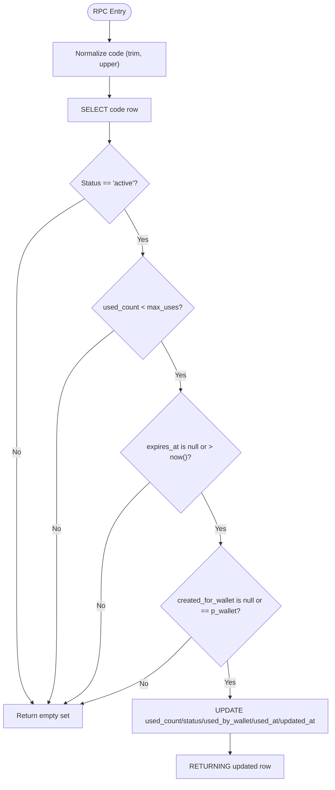
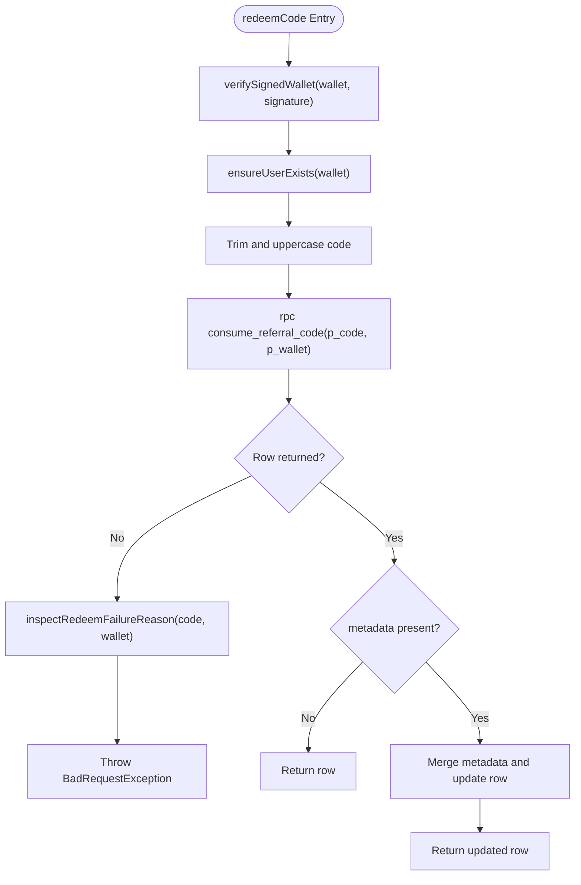
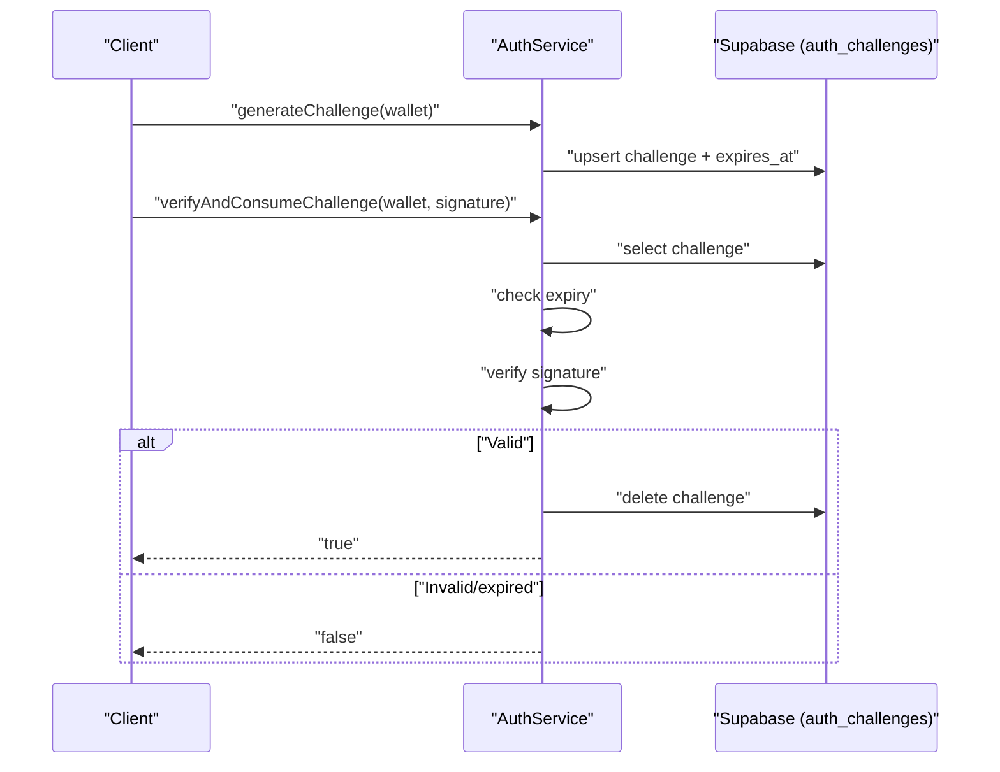
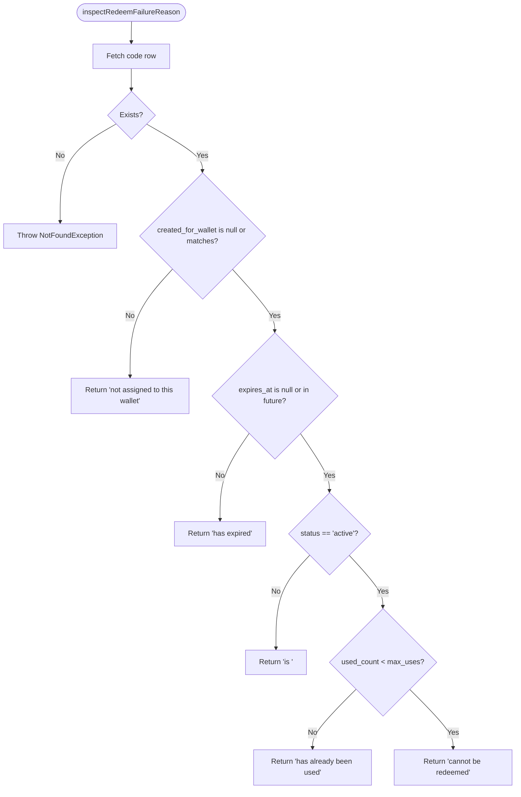
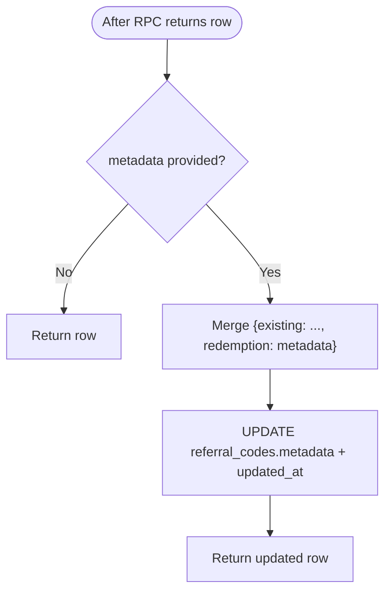
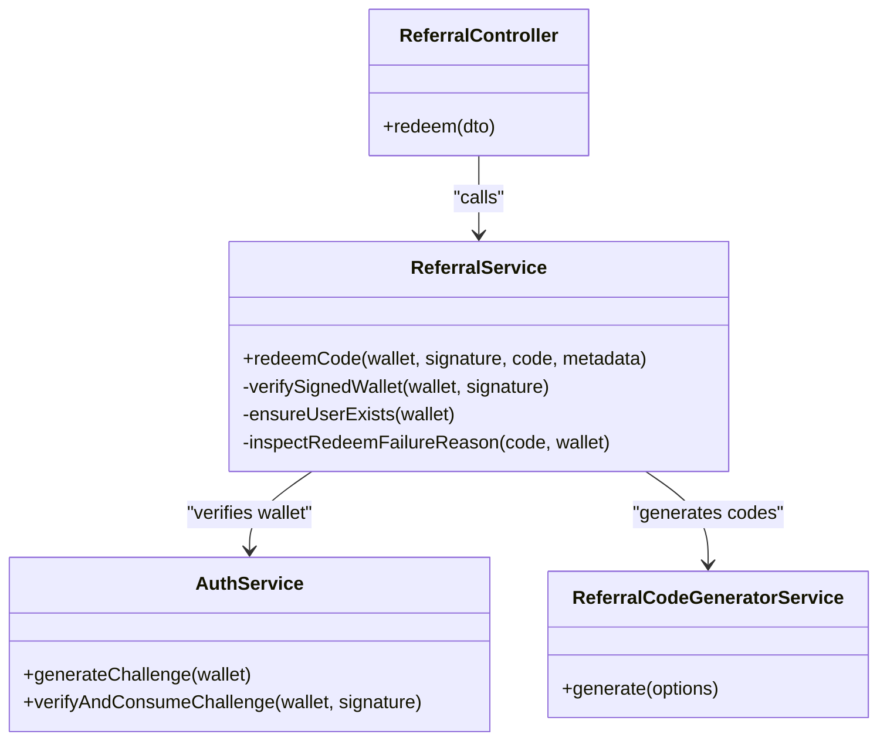

# Code Redemption Process

<cite>
**Referenced Files in This Document**
- [README.md](file://README.md)
- [src/referral/referral.controller.ts](file://src/referral/referral.controller.ts)
- [src/referral/referral.service.ts](file://src/referral/referral.service.ts)
- [src/referral/dto/redeem-referral-code.dto.ts](file://src/referral/dto/redeem-referral-code.dto.ts)
- [src/referral/dto/signed-wallet-request.dto.ts](file://src/referral/dto/signed-wallet-request.dto.ts)
- [src/referral/referral-code-generator.service.ts](file://src/referral/referral-code-generator.service.ts)
- [src/referral/referral.constants.ts](file://src/referral/referral.constants.ts)
- [src/referral/types/referral-code-generator.types.ts](file://src/referral/types/referral-code-generator.types.ts)
- [src/auth/auth.service.ts](file://src/auth/auth.service.ts)
- [src/auth/dto/wallet-challenge.dto.ts](file://src/auth/dto/wallet-challenge.dto.ts)
- [src/database/schema/initial-2-auth-challenges.sql](file://src/database/schema/initial-2-auth-challenges.sql)
- [src/database/functions/verify-wallet.ts](file://src/database/functions/verify-wallet.ts)
- [supabase/migrations/20260320090000_add_referral_system.sql](file://supabase/migrations/20260320090000_add_referral_system.sql)
</cite>

## Table of Contents
1. [Introduction](#introduction)
2. [Project Structure](#project-structure)
3. [Core Components](#core-components)
4. [Architecture Overview](#architecture-overview)
5. [Detailed Component Analysis](#detailed-component-analysis)
6. [Dependency Analysis](#dependency-analysis)
7. [Performance Considerations](#performance-considerations)
8. [Troubleshooting Guide](#troubleshooting-guide)
9. [Conclusion](#conclusion)
10. [Appendices](#appendices)

## Introduction
This document explains the code redemption system with a focus on single-use enforcement and wallet-based validation. It details the consume_referral_code RPC function for atomic redemption, including wallet signature verification, code state validation, and automatic status updates. It also documents the redemption workflow from code submission to successful activation, including metadata merging for redemption tracking, and outlines a comprehensive failure inspection system covering expired codes, wrong wallet assignment, inactive status, usage limits, and invalid codes. Practical examples, error diagnosis, and troubleshooting guidance are included, along with security measures against double redemption, code tampering, and unauthorized access, and guidance on redemption analytics and edge cases.

## Project Structure
The referral system spans controller, service, DTOs, constants, and database layers:
- Controller exposes the redemption endpoint and delegates to the service.
- Service orchestrates wallet signature verification, user existence checks, and calls the consume_referral_code RPC.
- DTOs define request shapes for validation.
- Constants define code format and charset.
- Database migration defines the schema and the consume_referral_code RPC.
- Authentication service verifies wallet signatures and manages challenges.

**Diagram sources**
- [src/referral/referral.controller.ts:66-80](file://src/referral/referral.controller.ts#L66-L80)
- [src/referral/referral.service.ts:140-193](file://src/referral/referral.service.ts#L140-L193)
- [src/auth/auth.service.ts:57-91](file://src/auth/auth.service.ts#L57-L91)
- [supabase/migrations/20260320090000_add_referral_system.sql:155-187](file://supabase/migrations/20260320090000_add_referral_system.sql#L155-L187)

**Section sources**
- [README.md:147-156](file://README.md#L147-L156)
- [src/referral/referral.controller.ts:12-92](file://src/referral/referral.controller.ts#L12-L92)
- [src/referral/referral.service.ts:43-49](file://src/referral/referral.service.ts#L43-L49)
- [supabase/migrations/20260320090000_add_referral_system.sql:32-48](file://supabase/migrations/20260320090000_add_referral_system.sql#L32-L48)

## Core Components
- ReferralController: Exposes the POST /api/referrals/redeem endpoint and forwards to ReferralService.
- ReferralService: Implements wallet signature verification, user existence checks, and redemption logic including the consume_referral_code RPC call and metadata merging.
- DTOs: RedeemReferralCodeDto validates walletAddress, signature, code, and optional metadata; SignedWalletRequestDto validates walletAddress and signature for listMyCodes.
- AuthService: Generates and verifies challenges, consumes challenges upon successful verification, and ensures user records exist.
- Database: Schema and RPCs enforce single-use semantics and atomic updates.

**Section sources**
- [src/referral/referral.controller.ts:66-80](file://src/referral/referral.controller.ts#L66-L80)
- [src/referral/referral.service.ts:140-193](file://src/referral/referral.service.ts#L140-L193)
- [src/referral/dto/redeem-referral-code.dto.ts:5-40](file://src/referral/dto/redeem-referral-code.dto.ts#L5-L40)
- [src/referral/dto/signed-wallet-request.dto.ts:5-24](file://src/referral/dto/signed-wallet-request.dto.ts#L5-L24)
- [src/auth/auth.service.ts:27-91](file://src/auth/auth.service.ts#L27-L91)

## Architecture Overview
The redemption flow is designed to be atomic and secure:
- Client submits walletAddress, signature, and code to the redemption endpoint.
- Service verifies the signature against a stored challenge and ensures the user exists.
- Service calls consume_referral_code RPC with the code and wallet.
- RPC atomically updates the code’s status and usage counters and returns the updated row.
- If metadata was provided, the service merges it into the code’s metadata and persists it.

**Diagram sources**
- [src/referral/referral.controller.ts:66-80](file://src/referral/referral.controller.ts#L66-L80)
- [src/referral/referral.service.ts:140-193](file://src/referral/referral.service.ts#L140-L193)
- [src/auth/auth.service.ts:57-91](file://src/auth/auth.service.ts#L57-L91)
- [supabase/migrations/20260320090000_add_referral_system.sql:155-187](file://supabase/migrations/20260320090000_add_referral_system.sql#L155-L187)

## Detailed Component Analysis

### consume_referral_code RPC (Atomic Redemption)
The consume_referral_code RPC enforces single-use redemption and atomic state transitions:
- Updates used_count and status to used when the code reaches max_uses.
- Records used_by_wallet and used_at on first use.
- Enforces conditions: active status, remaining uses, unexpired, and correct wallet assignment.
- Returns the updated row for downstream processing.

**Diagram sources**
- [supabase/migrations/20260320090000_add_referral_system.sql:155-187](file://supabase/migrations/20260320090000_add_referral_system.sql#L155-L187)

**Section sources**
- [supabase/migrations/20260320090000_add_referral_system.sql:155-187](file://supabase/migrations/20260320090000_add_referral_system.sql#L155-L187)

### ReferralService.redeemCode
Key responsibilities:
- Wallet signature verification via AuthService.verifyAndConsumeChallenge.
- Ensures user exists in users table.
- Normalizes and validates the code.
- Calls consume_referral_code RPC.
- On success, merges optional metadata into the code’s metadata and persists it.
- On failure, inspects reasons and throws descriptive errors.

**Diagram sources**
- [src/referral/referral.service.ts:140-193](file://src/referral/referral.service.ts#L140-L193)
- [src/referral/referral.service.ts:330-362](file://src/referral/referral.service.ts#L330-L362)

**Section sources**
- [src/referral/referral.service.ts:140-193](file://src/referral/referral.service.ts#L140-L193)
- [src/referral/referral.service.ts:330-362](file://src/referral/referral.service.ts#L330-L362)

### Wallet Signature Verification
The system uses a challenge-response mechanism:
- AuthService.generateChallenge creates a challenge with a nonce and timestamp and stores it with an expiry.
- AuthService.verifyAndConsumeChallenge retrieves the challenge, checks expiry, verifies the signature, and deletes the challenge upon success.
- ReferralService.verifySignedWallet delegates to AuthService.verifyAndConsumeChallenge and throws a forbidden error if invalid.

**Diagram sources**
- [src/auth/auth.service.ts:27-91](file://src/auth/auth.service.ts#L27-L91)
- [src/database/schema/initial-2-auth-challenges.sql:1-7](file://src/database/schema/initial-2-auth-challenges.sql#L1-L7)

**Section sources**
- [src/auth/auth.service.ts:27-91](file://src/auth/auth.service.ts#L27-L91)
- [src/database/schema/initial-2-auth-challenges.sql:1-7](file://src/database/schema/initial-2-auth-challenges.sql#L1-L7)

### Failure Inspection System
When the RPC does not return a row, the service inspects the code state to provide a precise reason:
- Wrong wallet assignment: created_for_wallet mismatch.
- Expired: expires_at is in the past.
- Not active: status != active.
- Already used: used_count >= max_uses.
- Not found: code does not exist.

**Diagram sources**
- [src/referral/referral.service.ts:330-362](file://src/referral/referral.service.ts#L330-L362)

**Section sources**
- [src/referral/referral.service.ts:330-362](file://src/referral/referral.service.ts#L330-L362)

### Metadata Merging for Redemption Tracking
If metadata is provided during redemption, the service merges it into the existing metadata under a redemption key and persists the update. This enables tracking of redemption sources and contexts.

**Diagram sources**
- [src/referral/referral.service.ts:169-190](file://src/referral/referral.service.ts#L169-L190)

**Section sources**
- [src/referral/referral.service.ts:169-190](file://src/referral/referral.service.ts#L169-L190)

### Security Measures
- Atomic redemption via consume_referral_code RPC prevents race conditions and double redemption.
- Single-use enforcement: max_uses defaults to 1 and enforced by the RPC.
- Wallet signature verification ensures only the legitimate wallet can redeem assigned codes.
- Admin-only operations require admin role checks.
- Database constraints and policies restrict access and enforce integrity.

**Section sources**
- [supabase/migrations/20260320090000_add_referral_system.sql:32-48](file://supabase/migrations/20260320090000_add_referral_system.sql#L32-L48)
- [src/referral/referral.service.ts:211-236](file://src/referral/referral.service.ts#L211-L236)

## Dependency Analysis
The referral system depends on:
- AuthService for wallet signature verification and challenge lifecycle.
- Supabase for storing users, referral codes, quotas, and executing RPCs.
- ReferralCodeGeneratorService for deterministic code generation.

**Diagram sources**
- [src/referral/referral.controller.ts:66-80](file://src/referral/referral.controller.ts#L66-L80)
- [src/referral/referral.service.ts:140-193](file://src/referral/referral.service.ts#L140-L193)
- [src/auth/auth.service.ts:27-91](file://src/auth/auth.service.ts#L27-L91)
- [src/referral/referral-code-generator.service.ts:24-49](file://src/referral/referral-code-generator.service.ts#L24-L49)

**Section sources**
- [src/referral/referral.controller.ts:66-80](file://src/referral/referral.controller.ts#L66-L80)
- [src/referral/referral.service.ts:45-49](file://src/referral/referral.service.ts#L45-L49)
- [src/referral/referral-code-generator.service.ts:24-49](file://src/referral/referral-code-generator.service.ts#L24-L49)

## Performance Considerations
- consume_referral_code is atomic and efficient, leveraging database constraints and a single UPDATE with RETURNING.
- Retry logic for code generation avoids collisions and reduces wasted attempts.
- Indexes on referral_codes support lookups by code, status, and timestamps.
- Metadata updates are optional and performed only when provided.

[No sources needed since this section provides general guidance]

## Troubleshooting Guide
Common issues and diagnostics:
- Invalid signature or challenge expired: verifyAndConsumeChallenge returns false; the service throws a forbidden error.
- Code not found: inspectRedeemFailureReason throws a not found error.
- Wrong wallet assignment: created_for_wallet mismatch; service returns a descriptive message.
- Expired code: expires_at in the past; service returns an expiration message.
- Inactive status: status not active; service returns the status message.
- Usage limits reached: used_count >= max_uses; service returns a “already used” message.
- Timing conflicts: ensure the client obtains a fresh challenge and signature before redemption; the challenge expires after five minutes.

Practical examples:
- Scenario A: User submits a code intended for another wallet.
  - Symptom: Error indicates the code is not assigned to the submitting wallet.
  - Action: Verify the correct wallet and reissue the code if needed.
- Scenario B: Redemption occurs after the code’s expiry.
  - Symptom: Error indicates the code has expired.
  - Action: Regenerate a new code with a future expiry.
- Scenario C: Double redemption attempt.
  - Symptom: First attempt succeeds; subsequent attempts fail with “already used.”
  - Action: Confirm the code is single-use and that the user did not reuse it.
- Scenario D: Signature validation failure.
  - Symptom: Forbidden error indicating invalid signature or expired challenge.
  - Action: Re-generate a challenge and sign it with the correct wallet.

**Section sources**
- [src/referral/referral.service.ts:159-167](file://src/referral/referral.service.ts#L159-L167)
- [src/referral/referral.service.ts:330-362](file://src/referral/referral.service.ts#L330-L362)
- [src/auth/auth.service.ts:57-91](file://src/auth/auth.service.ts#L57-L91)

## Conclusion
The code redemption system enforces single-use codes through an atomic RPC, robust wallet signature verification, and comprehensive failure inspection. It supports metadata merging for tracking and provides clear diagnostics for common failure modes. Security is ensured by atomic updates, strict constraints, and wallet-based authentication.

[No sources needed since this section summarizes without analyzing specific files]

## Appendices

### API Definition: POST /api/referrals/redeem
- Request body: walletAddress, signature, code, optional metadata.
- Validation: DTO enforces wallet format, non-empty signature and code, and optional object metadata.
- Behavior: Verifies signature, ensures user exists, calls consume_referral_code RPC, and optionally merges metadata.

**Section sources**
- [src/referral/referral.controller.ts:66-80](file://src/referral/referral.controller.ts#L66-L80)
- [src/referral/dto/redeem-referral-code.dto.ts:5-40](file://src/referral/dto/redeem-referral-code.dto.ts#L5-L40)

### Database Schema Highlights
- referral_codes: unique code, status, max_uses, used_count, used_by_wallet, used_at, expires_at, metadata.
- referral_user_quotas: per-wallet lifetime quota and issued_count.
- consume_referral_code RPC: atomic update and status transitions.

**Section sources**
- [supabase/migrations/20260320090000_add_referral_system.sql:32-48](file://supabase/migrations/20260320090000_add_referral_system.sql#L32-L48)
- [supabase/migrations/20260320090000_add_referral_system.sql:155-187](file://supabase/migrations/20260320090000_add_referral_system.sql#L155-L187)

### Code Generation and Format
- Codes are uppercase alphanumeric with a fixed prefix and length.
- Generator uses a dedicated library and returns uppercase codes.

**Section sources**
- [src/referral/referral.constants.ts:1-6](file://src/referral/referral.constants.ts#L1-L6)
- [src/referral/referral-code-generator.service.ts:30-39](file://src/referral/referral-code-generator.service.ts#L30-L39)
- [src/referral/types/referral-code-generator.types.ts:1-8](file://src/referral/types/referral-code-generator.types.ts#L1-L8)