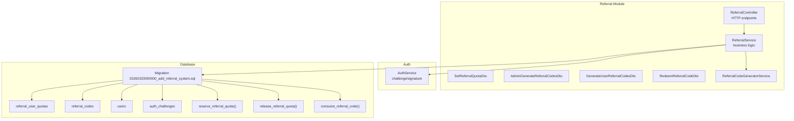
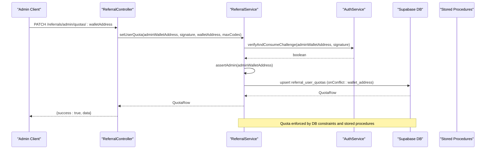
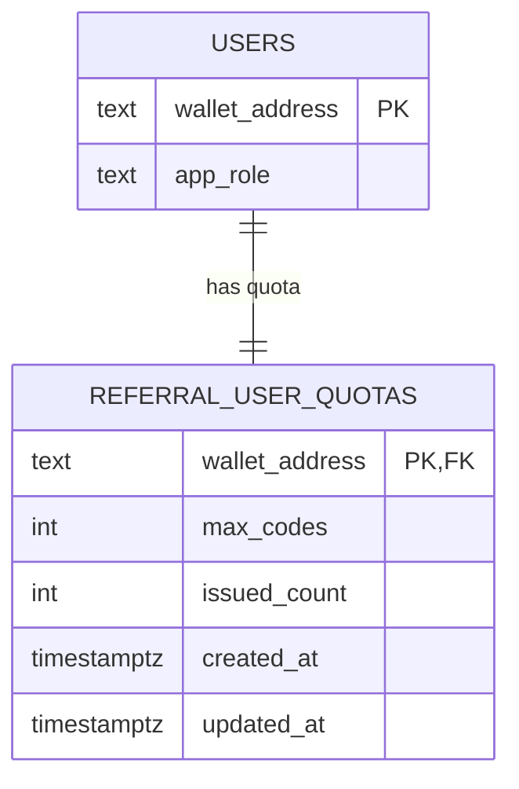
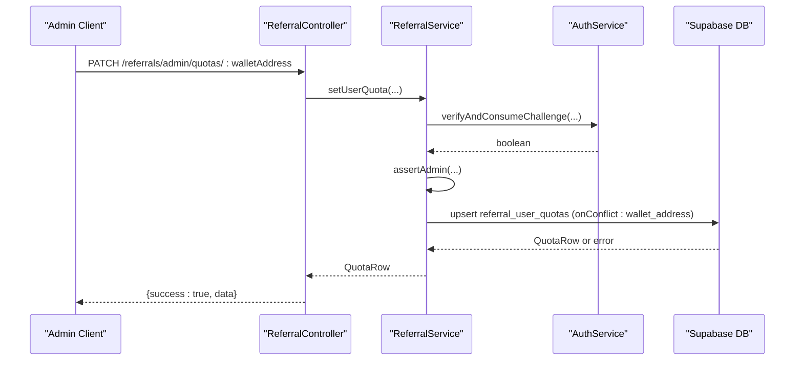
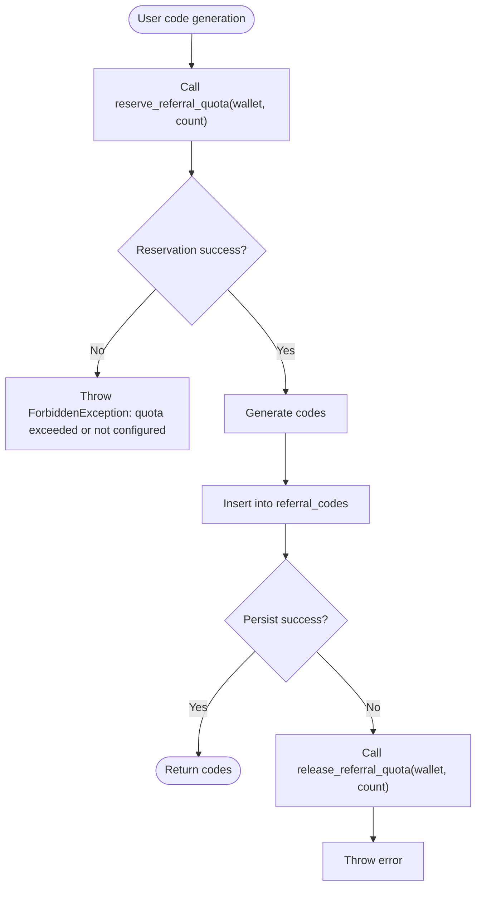
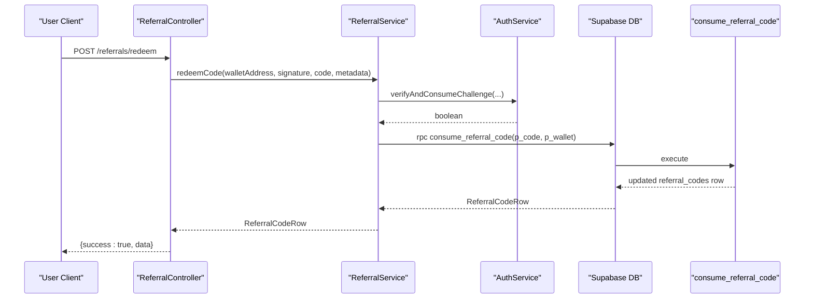
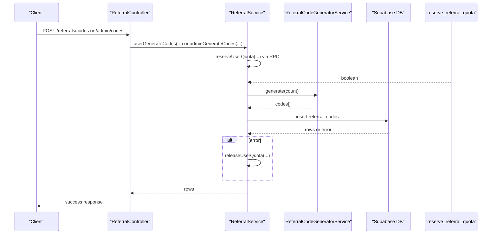
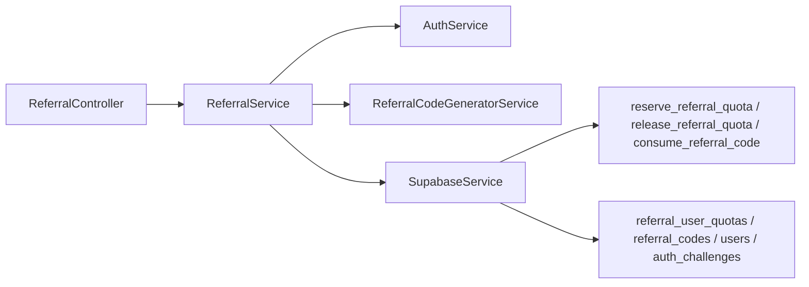

# Quota Management System

<cite>
**Referenced Files in This Document**
- [referral.service.ts](file://src/referral/referral.service.ts)
- [referral.controller.ts](file://src/referral/referral.controller.ts)
- [set-referral-quota.dto.ts](file://src/referral/dto/set-referral-quota.dto.ts)
- [admin-generate-referral-codes.dto.ts](file://src/referral/dto/admin-generate-referral-codes.dto.ts)
- [generate-user-referral-codes.dto.ts](file://src/referral/dto/generate-user-referral-codes.dto.ts)
- [redeem-referral-code.dto.ts](file://src/referral/dto/redeem-referral-code.dto.ts)
- [referral.constants.ts](file://src/referral/referral.constants.ts)
- [referral-code-generator.service.ts](file://src/referral/referral-code-generator.service.ts)
- [referral-code-generator.types.ts](file://src/referral/types/referral-code-generator.types.ts)
- [auth.service.ts](file://src/auth/auth.service.ts)
- [20260320090000_add_referral_system.sql](file://supabase/migrations/20260320090000_add_referral_system.sql)
- [initial-2-auth-challenges.sql](file://src/database/schema/initial-2-auth-challenges.sql)
</cite>

## Table of Contents
1. [Introduction](#introduction)
2. [Project Structure](#project-structure)
3. [Core Components](#core-components)
4. [Architecture Overview](#architecture-overview)
5. [Detailed Component Analysis](#detailed-component-analysis)
6. [Dependency Analysis](#dependency-analysis)
7. [Performance Considerations](#performance-considerations)
8. [Troubleshooting Guide](#troubleshooting-guide)
9. [Conclusion](#conclusion)
10. [Appendices](#appendices)

## Introduction
This document describes the quota management system for lifetime referral code limits and administrative controls. It explains the referral_user_quotas table structure, administrative quota setting via setUserQuota, the reservation system using reserve_referral_quota, quota release on generation failures, and conflict resolution when quotas are exceeded. Practical examples illustrate configuration scenarios, user limits, and administrative oversight workflows. Guidance is provided on quota analytics, monitoring usage patterns, and troubleshooting quota-related errors.

## Project Structure
The quota management system spans the referral module with controller endpoints, service logic, DTOs, and database schema with stored procedures.

**Diagram sources**
- [referral.controller.ts:1-92](file://src/referral/referral.controller.ts#L1-L92)
- [referral.service.ts:1-364](file://src/referral/referral.service.ts#L1-L364)
- [set-referral-quota.dto.ts:1-34](file://src/referral/dto/set-referral-quota.dto.ts#L1-L34)
- [admin-generate-referral-codes.dto.ts:1-73](file://src/referral/dto/admin-generate-referral-codes.dto.ts#L1-L73)
- [generate-user-referral-codes.dto.ts:1-62](file://src/referral/dto/generate-user-referral-codes.dto.ts#L1-L62)
- [redeem-referral-code.dto.ts:1-41](file://src/referral/dto/redeem-referral-code.dto.ts#L1-L41)
- [referral-code-generator.service.ts:1-50](file://src/referral/referral-code-generator.service.ts#L1-L50)
- [auth.service.ts:1-165](file://src/auth/auth.service.ts#L1-L165)
- [20260320090000_add_referral_system.sql:1-195](file://supabase/migrations/20260320090000_add_referral_system.sql#L1-L195)
- [initial-2-auth-challenges.sql:1-7](file://src/database/schema/initial-2-auth-challenges.sql#L1-L7)

**Section sources**
- [referral.controller.ts:1-92](file://src/referral/referral.controller.ts#L1-L92)
- [referral.service.ts:1-364](file://src/referral/referral.service.ts#L1-L364)
- [20260320090000_add_referral_system.sql:1-195](file://supabase/migrations/20260320090000_add_referral_system.sql#L1-L195)

## Core Components
- ReferralController: Exposes HTTP endpoints for admin quota setting, user code generation, admin code generation, code redemption, and listing owned codes.
- ReferralService: Implements business logic including signature verification, admin role checks, user existence, quota reservation/release, code generation/persistence, and redemption.
- DTOs: Validate and document request payloads for admin quota setting, user code generation, admin code generation, and code redemption.
- Stored Procedures: reserve_referral_quota, release_referral_quota, and consume_referral_code encapsulate atomic quota and code state transitions.
- AuthService: Generates and verifies wallet challenges for signature-based authentication.
- Database Schema: Defines referral_user_quotas, referral_codes, users, and auth_challenges with constraints and RLS policies.

Key responsibilities:
- Administrative controls: Admin-only endpoints and role checks.
- Lifetime quotas: Per-wallet max_codes and issued_count enforced by stored procedures.
- Reservation system: Reserve before generation; release on failure.
- Redemption: Atomic consumption with state updates.

**Section sources**
- [referral.controller.ts:1-92](file://src/referral/referral.controller.ts#L1-L92)
- [referral.service.ts:51-82](file://src/referral/referral.service.ts#L51-L82)
- [referral.service.ts:255-277](file://src/referral/referral.service.ts#L255-L277)
- [20260320090000_add_referral_system.sql:65-72](file://supabase/migrations/20260320090000_add_referral_system.sql#L65-L72)
- [20260320090000_add_referral_system.sql:106-187](file://supabase/migrations/20260320090000_add_referral_system.sql#L106-L187)
- [auth.service.ts:57-91](file://src/auth/auth.service.ts#L57-L91)

## Architecture Overview
The system enforces administrative controls and lifetime quotas through a layered architecture:
- HTTP layer: Controllers accept requests and delegate to services.
- Service layer: Performs validation, admin checks, and invokes database operations.
- Database layer: Uses stored procedures for atomic quota and code state transitions.
- Authentication layer: Verifies wallet signatures against generated challenges.

**Diagram sources**
- [referral.controller.ts:33-47](file://src/referral/referral.controller.ts#L33-L47)
- [referral.service.ts:51-82](file://src/referral/referral.service.ts#L51-L82)
- [auth.service.ts:57-91](file://src/auth/auth.service.ts#L57-L91)
- [20260320090000_add_referral_system.sql:65-72](file://supabase/migrations/20260320090000_add_referral_system.sql#L65-L72)

## Detailed Component Analysis

### Database Schema: referral_user_quotas
The referral_user_quotas table defines lifetime quota records:
- Primary key: wallet_address (references users.wallet_address)
- max_codes: total allowed codes for the wallet
- issued_count: currently issued codes tracked for enforcement
- Constraints: issued_count ≤ max_codes; max_codes ≥ 0; issued_count ≥ 0
- Security: Row Level Security enabled; grants for service_role and postgres

**Diagram sources**
- [20260320090000_add_referral_system.sql:65-72](file://supabase/migrations/20260320090000_add_referral_system.sql#L65-L72)
- [20260320090000_add_referral_system.sql:11-27](file://supabase/migrations/20260320090000_add_referral_system.sql#L11-L27)

**Section sources**
- [20260320090000_add_referral_system.sql:65-72](file://supabase/migrations/20260320090000_add_referral_system.sql#L65-L72)

### Administrative Quota Setting: setUserQuota
Administrative endpoint to set a user’s lifetime quota:
- Endpoint: PATCH /referrals/admin/quotas/:walletAddress
- Validation: Admin wallet address, signature, and maxCodes via DTO
- Steps:
  1) Verify signature against active challenge
  2) Assert admin role from users.app_role
  3) Upsert referral_user_quotas with onConflict on wallet_address
  4) Enforce constraint that max_codes ≥ current issued_count
  5) Return updated quota record

**Diagram sources**
- [referral.controller.ts:33-47](file://src/referral/referral.controller.ts#L33-L47)
- [referral.service.ts:51-82](file://src/referral/referral.service.ts#L51-L82)
- [auth.service.ts:57-91](file://src/auth/auth.service.ts#L57-L91)

**Section sources**
- [referral.controller.ts:33-47](file://src/referral/referral.controller.ts#L33-L47)
- [referral.service.ts:51-82](file://src/referral/referral.service.ts#L51-L82)
- [set-referral-quota.dto.ts:1-34](file://src/referral/dto/set-referral-quota.dto.ts#L1-L34)

### Reservation System: reserve_referral_quota and release_referral_quota
User code generation reserves quota before creation:
- reserve_referral_quota(p_wallet, p_count):
  - Atomically increments issued_count by p_count if issued_count + p_count ≤ max_codes
  - Returns boolean indicating success
- release_referral_quota(p_wallet, p_count):
  - Atomically decrements issued_count by p_count (minimum 0)
  - Used when generation fails to prevent quota leakage

**Diagram sources**
- [referral.service.ts:109-138](file://src/referral/referral.service.ts#L109-L138)
- [referral.service.ts:255-277](file://src/referral/referral.service.ts#L255-L277)
- [20260320090000_add_referral_system.sql:106-153](file://supabase/migrations/20260320090000_add_referral_system.sql#L106-L153)

**Section sources**
- [referral.service.ts:109-138](file://src/referral/referral.service.ts#L109-L138)
- [referral.service.ts:255-277](file://src/referral/referral.service.ts#L255-L277)
- [20260320090000_add_referral_system.sql:106-153](file://supabase/migrations/20260320090000_add_referral_system.sql#L106-L153)

### Conflict Resolution and Enforcement
- Constraint violation handling:
  - If attempting to reduce max_codes below current issued_count, DB returns a constraint error; service maps to BadRequestException
- Reservation failure:
  - If issued_count + p_count > max_codes, reservation fails; service throws ForbiddenException
- Generation failure:
  - On persistence failure, service releases reserved quota to prevent leaks

**Section sources**
- [referral.service.ts:74-82](file://src/referral/referral.service.ts#L74-L82)
- [referral.service.ts:121-137](file://src/referral/referral.service.ts#L121-L137)
- [20260320090000_add_referral_system.sql:120-127](file://supabase/migrations/20260320090000_add_referral_system.sql#L120-L127)

### Redemption Workflow: consume_referral_code
- Endpoint: POST /referrals/redeem
- Validates signature and ensures user exists
- Calls consume_referral_code RPC to atomically increment used_count, set status and timestamps, and enforce constraints
- Returns the updated referral code row

**Diagram sources**
- [referral.controller.ts:66-80](file://src/referral/referral.controller.ts#L66-L80)
- [referral.service.ts:140-193](file://src/referral/referral.service.ts#L140-L193)
- [20260320090000_add_referral_system.sql:155-187](file://supabase/migrations/20260320090000_add_referral_system.sql#L155-L187)

**Section sources**
- [referral.controller.ts:66-80](file://src/referral/referral.controller.ts#L66-L80)
- [referral.service.ts:140-193](file://src/referral/referral.service.ts#L140-L193)
- [20260320090000_add_referral_system.sql:155-187](file://supabase/migrations/20260320090000_add_referral_system.sql#L155-L187)

### Code Generation Pipeline
- User or admin initiates generation via controller endpoints
- Service validates signatures and roles (for admin)
- Service reserves quota via RPC
- Codes are generated and inserted into referral_codes
- On failure, reservation is released

**Diagram sources**
- [referral.controller.ts:15-31](file://src/referral/referral.controller.ts#L15-L31)
- [referral.controller.ts:49-64](file://src/referral/referral.controller.ts#L49-L64)
- [referral.service.ts:84-107](file://src/referral/referral.service.ts#L84-L107)
- [referral.service.ts:109-138](file://src/referral/referral.service.ts#L109-L138)
- [referral-code-generator.service.ts:30-39](file://src/referral/referral-code-generator.service.ts#L30-L39)
- [20260320090000_add_referral_system.sql:106-153](file://supabase/migrations/20260320090000_add_referral_system.sql#L106-L153)

**Section sources**
- [referral.controller.ts:15-31](file://src/referral/referral.controller.ts#L15-L31)
- [referral.controller.ts:49-64](file://src/referral/referral.controller.ts#L49-L64)
- [referral.service.ts:84-138](file://src/referral/referral.service.ts#L84-L138)
- [referral-code-generator.service.ts:30-39](file://src/referral/referral-code-generator.service.ts#L30-L39)

### Practical Scenarios and Workflows

#### Scenario 1: Configure a user’s lifetime quota
- Admin signs a challenge and calls PATCH /referrals/admin/quotas/:walletAddress with admin credentials and desired maxCodes
- Service verifies signature, asserts admin role, and upserts referral_user_quotas
- If maxCodes is below current issued_count, service throws a bad request error

#### Scenario 2: User generates codes within lifetime quota
- User signs a challenge and calls POST /referrals/codes with count
- Service reserves quota via reserve_referral_quota
- On success, codes are generated and persisted; on failure, reservation is released

#### Scenario 3: Admin generates codes for a target user
- Admin signs a challenge and calls POST /referrals/admin/codes with target wallet and count
- Service verifies admin credentials and persists codes directly

#### Scenario 4: Redemption with audit metadata
- User redeems a code; optional metadata is merged into the code’s metadata field upon successful redemption

**Section sources**
- [referral.controller.ts:33-47](file://src/referral/referral.controller.ts#L33-L47)
- [referral.controller.ts:49-64](file://src/referral/referral.controller.ts#L49-L64)
- [referral.controller.ts:66-80](file://src/referral/referral.controller.ts#L66-L80)
- [referral.service.ts:51-82](file://src/referral/referral.service.ts#L51-L82)
- [referral.service.ts:109-138](file://src/referral/referral.service.ts#L109-L138)
- [referral.service.ts:140-193](file://src/referral/referral.service.ts#L140-L193)

### Administrative Oversight and Policies
- Admin-only endpoints: PATCH /referrals/admin/quotas/:walletAddress and POST /referrals/admin/codes
- Admin role enforcement: users.app_role must be 'admin'
- Signature verification: Active challenges must be verified before processing
- User existence: Upsert ensures users referenced by foreign keys exist

**Section sources**
- [referral.controller.ts:33-47](file://src/referral/referral.controller.ts#L33-L47)
- [referral.controller.ts:15-31](file://src/referral/referral.controller.ts#L15-L31)
- [referral.service.ts:218-236](file://src/referral/referral.service.ts#L218-L236)
- [referral.service.ts:211-216](file://src/referral/referral.service.ts#L211-L216)
- [20260320090000_add_referral_system.sql:11-27](file://supabase/migrations/20260320090000_add_referral_system.sql#L11-L27)

### Quota Analytics and Monitoring
- Track issued_count vs max_codes per wallet to monitor utilization
- Monitor referral_codes usage metrics (used_count, status, expires_at)
- Use stored procedure results and DB logs to observe reservation and release events
- Audit trails via metadata fields and timestamps

[No sources needed since this section provides general guidance]

### Rollback and Modification Procedures
- Reduce max_codes: Only allowed if max_codes ≥ current issued_count; otherwise rejected
- Release on failure: Automatic release via release_referral_quota when generation fails
- Manual adjustment: Admin can adjust quotas via PATCH endpoint; ensure constraints remain satisfied

**Section sources**
- [referral.service.ts:74-82](file://src/referral/referral.service.ts#L74-L82)
- [referral.service.ts:134-137](file://src/referral/referral.service.ts#L134-L137)
- [20260320090000_add_referral_system.sql:120-127](file://supabase/migrations/20260320090000_add_referral_system.sql#L120-L127)

## Dependency Analysis
The system exhibits clear separation of concerns:
- Controllers depend on ReferralService
- ReferralService depends on AuthService for signature verification, SupabaseService for DB operations, and ReferralCodeGeneratorService for code generation
- Stored procedures encapsulate atomic operations for quota and code state transitions
- Database schema defines referential integrity and constraints

**Diagram sources**
- [referral.controller.ts:1-92](file://src/referral/referral.controller.ts#L1-L92)
- [referral.service.ts:1-364](file://src/referral/referral.service.ts#L1-L364)
- [auth.service.ts:1-165](file://src/auth/auth.service.ts#L1-L165)
- [referral-code-generator.service.ts:1-50](file://src/referral/referral-code-generator.service.ts#L1-L50)
- [20260320090000_add_referral_system.sql:106-187](file://supabase/migrations/20260320090000_add_referral_system.sql#L106-L187)

**Section sources**
- [referral.controller.ts:1-92](file://src/referral/referral.controller.ts#L1-L92)
- [referral.service.ts:1-364](file://src/referral/referral.service.ts#L1-L364)
- [auth.service.ts:1-165](file://src/auth/auth.service.ts#L1-L165)
- [referral-code-generator.service.ts:1-50](file://src/referral/referral-code-generator.service.ts#L1-L50)
- [20260320090000_add_referral_system.sql:106-187](file://supabase/migrations/20260320090000_add_referral_system.sql#L106-L187)

## Performance Considerations
- Batch sizes: Maximum batch size is enforced by DTOs to prevent excessive load
- Unique code generation: Retry loop with uniqueness checks reduces collisions
- Atomic operations: Stored procedures minimize race conditions during quota and code updates
- Indexes: Database indexes on frequently queried columns improve performance

[No sources needed since this section provides general guidance]

## Troubleshooting Guide
Common errors and resolutions:
- Invalid signature or challenge expired: Ensure challenge is fresh and signature is valid
- Admin permission required: Verify users.app_role is 'admin'
- Quota exceeded or not configured: Check referral_user_quotas for the wallet; ensure reservation succeeds
- Quota reduction conflicts: Cannot lower max_codes below current issued_count
- Generation failures: Reservation is automatically released on persistence errors
- Redemption failures: Inspect code state (status, expiry, assignment, usage) to determine cause

**Section sources**
- [referral.service.ts:211-216](file://src/referral/referral.service.ts#L211-L216)
- [referral.service.ts:218-236](file://src/referral/referral.service.ts#L218-L236)
- [referral.service.ts:121-124](file://src/referral/referral.service.ts#L121-L124)
- [referral.service.ts:74-79](file://src/referral/referral.service.ts#L74-L79)
- [referral.service.ts:134-137](file://src/referral/referral.service.ts#L134-L137)
- [referral.service.ts:330-362](file://src/referral/referral.service.ts#L330-L362)

## Conclusion
The quota management system provides robust administrative controls and lifetime quota enforcement through a combination of controller endpoints, service logic, DTO validation, stored procedures, and database constraints. The reservation and release mechanism ensures quota integrity during code generation, while atomic redemption operations maintain code state consistency. Administrators can configure quotas securely, and users can generate codes within their limits, with clear error handling and auditability.

## Appendices

### API Endpoints Summary
- PATCH /referrals/admin/quotas/:walletAddress
  - Purpose: Set lifetime referral-code quota for a user wallet
  - Requires: Admin credentials and signature
- POST /referrals/admin/codes
  - Purpose: Admin-generate single-use codes for a target wallet
  - Requires: Admin credentials and signature
- POST /referrals/codes
  - Purpose: User-generate single-use codes within lifetime quota
  - Requires: User credentials and signature
- POST /referrals/redeem
  - Purpose: Redeem a single-use referral code
  - Requires: User credentials and signature

**Section sources**
- [referral.controller.ts:33-47](file://src/referral/referral.controller.ts#L33-L47)
- [referral.controller.ts:15-31](file://src/referral/referral.controller.ts#L15-L31)
- [referral.controller.ts:49-64](file://src/referral/referral.controller.ts#L49-L64)
- [referral.controller.ts:66-80](file://src/referral/referral.controller.ts#L66-L80)