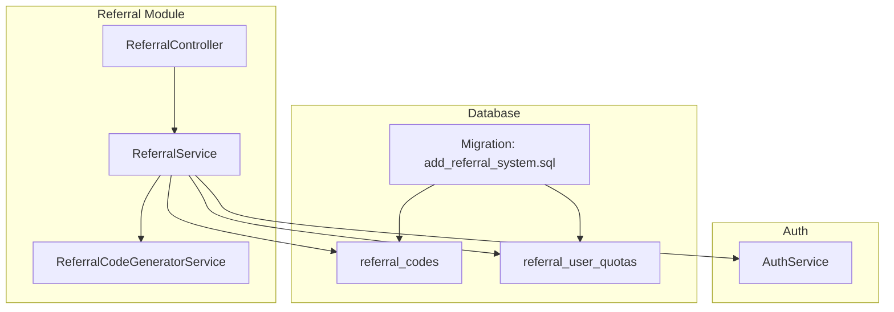
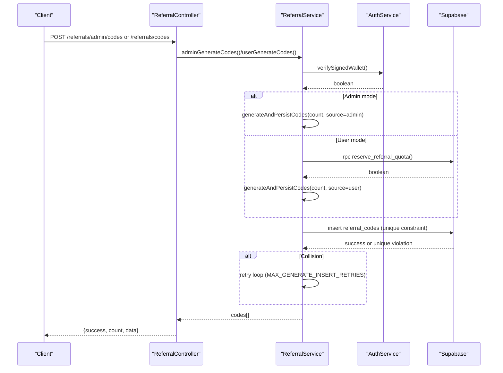
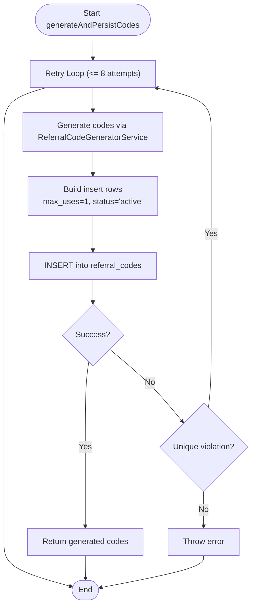
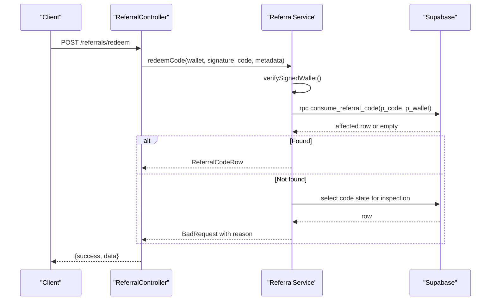
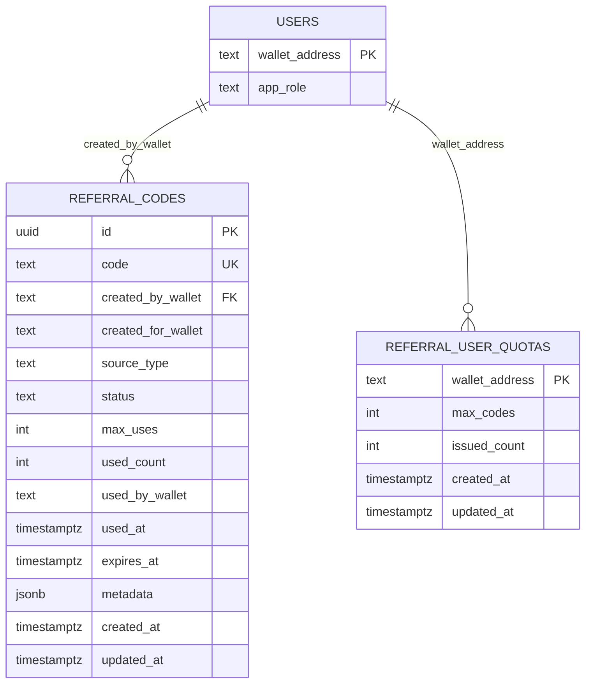
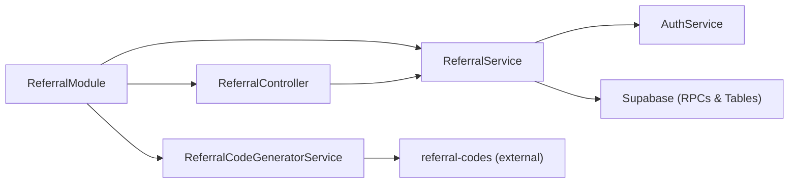

# Referral Code Generation

<cite>
**Referenced Files in This Document**
- [referral.module.ts](file://src/referral/referral.module.ts)
- [referral.controller.ts](file://src/referral/referral.controller.ts)
- [referral.service.ts](file://src/referral/referral.service.ts)
- [referral-code-generator.service.ts](file://src/referral/referral-code-generator.service.ts)
- [referral.constants.ts](file://src/referral/referral.constants.ts)
- [referral-code-generator.types.ts](file://src/referral/types/referral-code-generator.types.ts)
- [admin-generate-referral-codes.dto.ts](file://src/referral/dto/admin-generate-referral-codes.dto.ts)
- [generate-user-referral-codes.dto.ts](file://src/referral/dto/generate-user-referral-codes.dto.ts)
- [redeem-referral-code.dto.ts](file://src/referral/dto/redeem-referral-code.dto.ts)
- [set-referral-quota.dto.ts](file://src/referral/dto/set-referral-quota.dto.ts)
- [signed-wallet-request.dto.ts](file://src/referral/dto/signed-wallet-request.dto.ts)
- [20260320090000_add_referral_system.sql](file://supabase/migrations/20260320090000_add_referral_system.sql)
- [auth.service.ts](file://src/auth/auth.service.ts)
- [package.json](file://package.json)
</cite>

## Table of Contents
1. [Introduction](#introduction)
2. [Project Structure](#project-structure)
3. [Core Components](#core-components)
4. [Architecture Overview](#architecture-overview)
5. [Detailed Component Analysis](#detailed-component-analysis)
6. [Dependency Analysis](#dependency-analysis)
7. [Performance Considerations](#performance-considerations)
8. [Security Considerations](#security-considerations)
9. [Practical Workflows](#practical-workflows)
10. [Troubleshooting Guide](#troubleshooting-guide)
11. [Conclusion](#conclusion)

## Introduction
This document explains the referral code generation system, focusing on the fixed-format code structure (REF-XXXXXXXX), single-use enforcement via max_uses=1, global uniqueness enforced by database constraints, and robust generation and redemption workflows. It covers the dual generation modes (admin-generated and user-generated with lifetime quota), validation, retry mechanisms, collision handling, error scenarios, and integration with wallet authentication.

## Project Structure
The referral system is organized around a dedicated module with a controller, service, generator, constants, DTOs, and database schema. The authentication service provides wallet challenge-based signature verification used across referral operations.

**Diagram sources**
- [referral.controller.ts:10-92](file://src/referral/referral.controller.ts#L10-L92)
- [referral.service.ts:43-49](file://src/referral/referral.service.ts#L43-L49)
- [referral-code-generator.service.ts:24-49](file://src/referral/referral-code-generator.service.ts#L24-L49)
- [auth.service.ts:57-91](file://src/auth/auth.service.ts#L57-L91)
- [20260320090000_add_referral_system.sql:32-72](file://supabase/migrations/20260320090000_add_referral_system.sql#L32-L72)

**Section sources**
- [referral.module.ts:1-14](file://src/referral/referral.module.ts#L1-L14)
- [referral.controller.ts:1-92](file://src/referral/referral.controller.ts#L1-L92)
- [referral.service.ts:1-364](file://src/referral/referral.service.ts#L1-L364)
- [referral-code-generator.service.ts:1-50](file://src/referral/referral-code-generator.service.ts#L1-L50)
- [auth.service.ts:1-165](file://src/auth/auth.service.ts#L1-L165)
- [20260320090000_add_referral_system.sql:1-195](file://supabase/migrations/20260320090000_add_referral_system.sql#L1-L195)

## Core Components
- Fixed-format code structure: Prefix "REF-", length 8, uppercase alphanumeric charset.
- Single-use enforcement: max_uses defaults to 1; consumed via stored procedure.
- Global uniqueness: database-level unique constraint on code column.
- Retry mechanism: up to 8 attempts to avoid collisions.
- Two generation modes:
  - Admin-generated codes for a specific wallet (assignable).
  - User-generated codes constrained by lifetime quota.

Key implementation references:
- Constants define prefix, length, charset, and batch limits.
- Generator service wraps external library for deterministic code generation.
- Service orchestrates validation, quota reservation, persistence, and error handling.
- Database migration defines tables, constraints, indexes, and helper RPCs.

**Section sources**
- [referral.constants.ts:1-6](file://src/referral/referral.constants.ts#L1-L6)
- [referral-code-generator.types.ts:1-8](file://src/referral/types/referral-code-generator.types.ts#L1-L8)
- [referral-code-generator.service.ts:30-39](file://src/referral/referral-code-generator.service.ts#L30-L39)
- [referral.service.ts:38-320](file://src/referral/referral.service.ts#L38-L320)
- [20260320090000_add_referral_system.sql:32-48](file://supabase/migrations/20260320090000_add_referral_system.sql#L32-L48)

## Architecture Overview
The system enforces wallet identity via signed challenges, validates inputs, generates codes, persists them with uniqueness guarantees, and consumes codes atomically.

**Diagram sources**
- [referral.controller.ts:15-64](file://src/referral/referral.controller.ts#L15-L64)
- [referral.service.ts:84-138](file://src/referral/referral.service.ts#L84-L138)
- [auth.service.ts:57-91](file://src/auth/auth.service.ts#L57-L91)
- [20260320090000_add_referral_system.sql:106-187](file://supabase/migrations/20260320090000_add_referral_system.sql#L106-L187)

## Detailed Component Analysis

### Code Generation Algorithm
- Uses external library to generate N codes with fixed prefix, length, and charset.
- Uppercase normalization ensures consistent storage and matching.
- Batch insertion with retry loop handles unique violations.

**Diagram sources**
- [referral.service.ts:279-320](file://src/referral/referral.service.ts#L279-L320)
- [referral-code-generator.service.ts:30-39](file://src/referral/referral-code-generator.service.ts#L30-L39)
- [20260320090000_add_referral_system.sql:32-48](file://supabase/migrations/20260320090000_add_referral_system.sql#L32-L48)

**Section sources**
- [referral-code-generator.service.ts:30-39](file://src/referral/referral-code-generator.service.ts#L30-L39)
- [referral.service.ts:279-320](file://src/referral/referral.service.ts#L279-L320)
- [referral.constants.ts:2-5](file://src/referral/referral.constants.ts#L2-L5)

### Redemption Flow
- Normalizes input to uppercase.
- Calls stored procedure to atomically increment used_count, set status and timestamps, and enforce constraints.
- Returns detailed failure reasons for diagnostics.

**Diagram sources**
- [referral.controller.ts:66-80](file://src/referral/referral.controller.ts#L66-L80)
- [referral.service.ts:140-193](file://src/referral/referral.service.ts#L140-L193)
- [20260320090000_add_referral_system.sql:155-187](file://supabase/migrations/20260320090000_add_referral_system.sql#L155-L187)

**Section sources**
- [referral.service.ts:140-193](file://src/referral/referral.service.ts#L140-L193)
- [20260320090000_add_referral_system.sql:155-187](file://supabase/migrations/20260320090000_add_referral_system.sql#L155-L187)

### Admin-Generated Codes
- Requires admin wallet signature verification and admin role check.
- Supports assigning codes to a specific target wallet (assignable).
- Enforces batch size limits and optional expiration.

**Section sources**
- [referral.controller.ts:15-31](file://src/referral/referral.controller.ts#L15-L31)
- [referral.service.ts:84-107](file://src/referral/referral.service.ts#L84-L107)
- [admin-generate-referral-codes.dto.ts:15-73](file://src/referral/dto/admin-generate-referral-codes.dto.ts#L15-L73)

### User-Generated Codes with Lifetime Quota
- Requires wallet signature verification and user existence.
- Reserves quota via stored procedure; releases quota on generation failure.
- Enforces per-user lifetime quota and optional expiration.

**Section sources**
- [referral.controller.ts:49-64](file://src/referral/referral.controller.ts#L49-L64)
- [referral.service.ts:109-138](file://src/referral/referral.service.ts#L109-L138)
- [generate-user-referral-codes.dto.ts:15-62](file://src/referral/dto/generate-user-referral-codes.dto.ts#L15-L62)
- [20260320090000_add_referral_system.sql:106-153](file://supabase/migrations/20260320090000_add_referral_system.sql#L106-L153)

### Data Model and Constraints
- referral_codes table enforces uniqueness, single-use semantics, and status transitions.
- referral_user_quotas tracks lifetime issuance limits per wallet.
- Helper RPCs encapsulate atomic operations for quota and redemption.

**Diagram sources**
- [20260320090000_add_referral_system.sql:32-72](file://supabase/migrations/20260320090000_add_referral_system.sql#L32-L72)

**Section sources**
- [20260320090000_add_referral_system.sql:32-72](file://supabase/migrations/20260320090000_add_referral_system.sql#L32-L72)

## Dependency Analysis
- ReferralModule imports AuthModule and exposes ReferralService.
- ReferralController depends on ReferralService.
- ReferralService depends on AuthService, SupabaseService, and ReferralCodeGeneratorService.
- External library "referral-codes" provides deterministic code generation.
- Database migration defines tables, constraints, and helper functions.

**Diagram sources**
- [referral.module.ts:7-12](file://src/referral/referral.module.ts#L7-L12)
- [referral.controller.ts:1-13](file://src/referral/referral.controller.ts#L1-L13)
- [referral.service.ts:43-49](file://src/referral/referral.service.ts#L43-L49)
- [referral-code-generator.service.ts:24-49](file://src/referral/referral-code-generator.service.ts#L24-L49)
- [package.json:33-33](file://package.json#L33-L33)

**Section sources**
- [referral.module.ts:1-14](file://src/referral/referral.module.ts#L1-L14)
- [referral.controller.ts:1-13](file://src/referral/referral.controller.ts#L1-L13)
- [referral.service.ts:1-49](file://src/referral/referral.service.ts#L1-L49)
- [referral-code-generator.service.ts:1-50](file://src/referral/referral-code-generator.service.ts#L1-L50)
- [package.json:33-33](file://package.json#L33-L33)

## Performance Considerations
- Retry loop caps collisions under normal load; increase attempts only if collision rate is high.
- Batch size limit reduces contention; consider batching for large-scale generation.
- Indexes on created_by_wallet, created_for_wallet, and status improve query performance.
- Stored procedures centralize atomic updates, minimizing race conditions.

[No sources needed since this section provides general guidance]

## Security Considerations
- Wallet identity: All operations require a valid, unexpired signature verified via challenge-response.
- Brute force protection: Challenges expire quickly; signatures are verified server-side; admin actions require explicit admin role.
- Code entropy: 8-character alphanumeric (36^8 ≈ 2.8 trillion combinations) provides strong collision resistance.
- Collision probability: With 2.8 trillion candidates and uniform randomness, collisions are extremely rare; retry loop mitigates edge cases.
- Protection against misuse: Unique constraints prevent duplicates; single-use enforcement via max_uses and stored procedure ensure idempotency.

**Section sources**
- [auth.service.ts:57-91](file://src/auth/auth.service.ts#L57-L91)
- [referral.service.ts:38-39](file://src/referral/referral.service.ts#L38-L39)
- [referral.constants.ts:3-4](file://src/referral/referral.constants.ts#L3-L4)
- [20260320090000_add_referral_system.sql:32-48](file://supabase/migrations/20260320090000_add_referral_system.sql#L32-L48)

## Practical Workflows

### Admin-Generated Codes Workflow
- Request: POST /referrals/admin/codes with admin credentials, target wallet, count, optional expiry and metadata.
- Validation: Admin signature verified; admin role checked; target wallet ensured.
- Generation: Codes generated with max_uses=1; persisted with unique constraint.
- Response: Array of created codes with metadata and timestamps.

**Section sources**
- [referral.controller.ts:15-31](file://src/referral/referral.controller.ts#L15-L31)
- [referral.service.ts:84-107](file://src/referral/referral.service.ts#L84-L107)
- [admin-generate-referral-codes.dto.ts:15-73](file://src/referral/dto/admin-generate-referral-codes.dto.ts#L15-L73)

### User-Generated Codes Workflow
- Request: POST /referrals/codes with user credentials, count, optional expiry and metadata.
- Validation: Wallet signature verified; user ensured.
- Quota: reserve_referral_quota RPC reserves slots; on failure, throws forbidden.
- Generation: Codes generated and persisted; on failure, quota released.
- Response: Array of created codes.

**Section sources**
- [referral.controller.ts:49-64](file://src/referral/referral.controller.ts#L49-L64)
- [referral.service.ts:109-138](file://src/referral/referral.service.ts#L109-L138)
- [generate-user-referral-codes.dto.ts:15-62](file://src/referral/dto/generate-user-referral-codes.dto.ts#L15-L62)
- [20260320090000_add_referral_system.sql:106-153](file://supabase/migrations/20260320090000_add_referral_system.sql#L106-L153)

### Redemption Workflow
- Request: POST /referrals/redeem with wallet credentials and code.
- Validation: Wallet signature verified; code normalized to uppercase.
- Atomic consumption: consume_referral_code updates counters and status; returns row or empty.
- Failure diagnostics: Inspects code state to return precise reason (expired, revoked, used, wrong wallet, etc.).

**Section sources**
- [referral.controller.ts:66-80](file://src/referral/referral.controller.ts#L66-L80)
- [referral.service.ts:140-193](file://src/referral/referral.service.ts#L140-L193)
- [redeem-referral-code.dto.ts:5-41](file://src/referral/dto/redeem-referral-code.dto.ts#L5-L41)
- [20260320090000_add_referral_system.sql:155-187](file://supabase/migrations/20260320090000_add_referral_system.sql#L155-L187)

### Format Validation and Examples
- Format: REF-XXXXXXXX (uppercase, 8 alphanumeric characters).
- Validation: Regex enforces Solana wallet address format; DTOs constrain counts and ISO dates.
- Example requests:
  - Admin: { adminWalletAddress, signature, targetWalletAddress, count, expiresAt?, metadata? }
  - User: { walletAddress, signature, count, expiresAt?, metadata? }
  - Redemption: { walletAddress, signature, code, metadata? }

**Section sources**
- [referral.constants.ts:1-6](file://src/referral/referral.constants.ts#L1-L6)
- [admin-generate-referral-codes.dto.ts:15-73](file://src/referral/dto/admin-generate-referral-codes.dto.ts#L15-L73)
- [generate-user-referral-codes.dto.ts:15-62](file://src/referral/dto/generate-user-referral-codes.dto.ts#L15-L62)
- [redeem-referral-code.dto.ts:5-41](file://src/referral/dto/redeem-referral-code.dto.ts#L5-L41)

## Troubleshooting Guide
Common errors and resolutions:
- Invalid signature or expired challenge: Wallet signature verification fails; ensure challenge freshness and correct signature.
- Admin permission required: Non-admin users attempting admin endpoints receive forbidden.
- Quota exceeded or not configured: User quota reservation fails; adjust lifetime quota via admin endpoint.
- Unique violation during insert: Retry loop handles collisions; if persistent, investigate concurrency spikes.
- Redemption failures: System returns specific reasons (expired, revoked, used, wrong wallet); inspect returned message for guidance.

**Section sources**
- [referral.service.ts:56-82](file://src/referral/referral.service.ts#L56-L82)
- [referral.service.ts:118-138](file://src/referral/referral.service.ts#L118-L138)
- [referral.service.ts:159-167](file://src/referral/referral.service.ts#L159-L167)
- [referral.service.ts:330-362](file://src/referral/referral.service.ts#L330-L362)
- [auth.service.ts:57-91](file://src/auth/auth.service.ts#L57-L91)

## Conclusion
The referral code system combines deterministic generation, strict uniqueness, single-use enforcement, and robust validation to deliver a secure, scalable solution. Admin and user generation modes serve distinct use cases, while helper RPCs encapsulate atomic operations. Together, these components provide strong guarantees for code uniqueness, integrity, and usability.