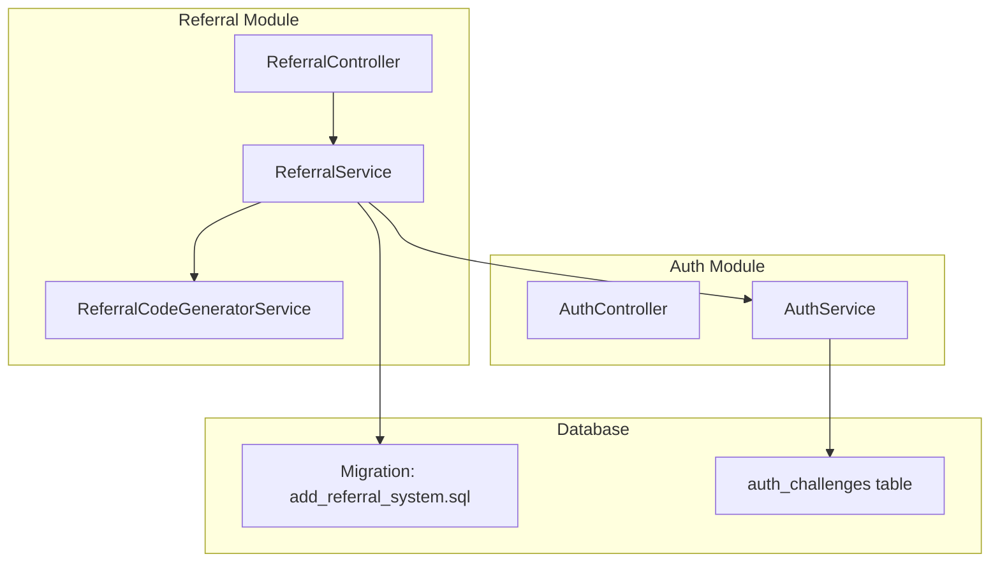
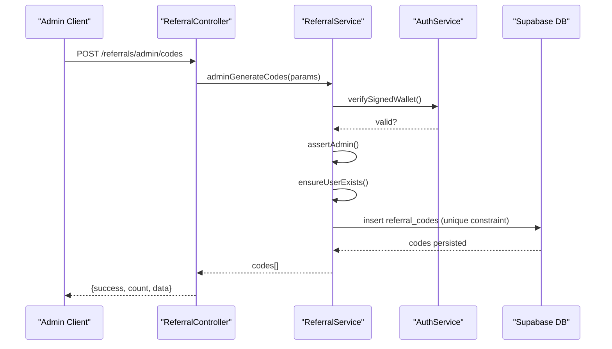
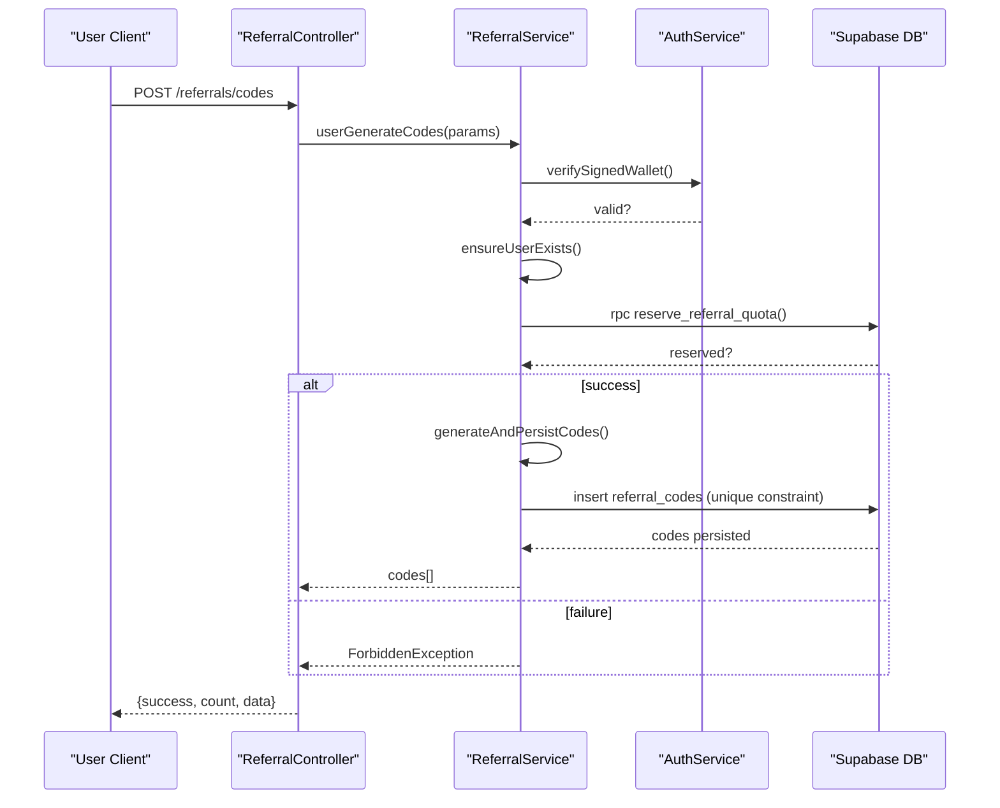
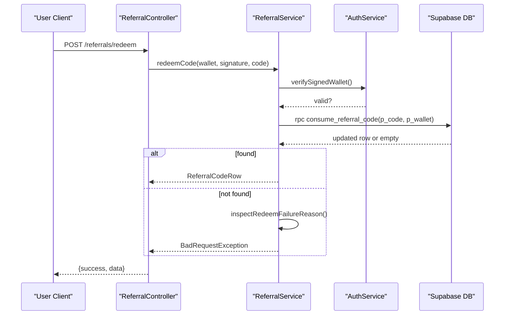
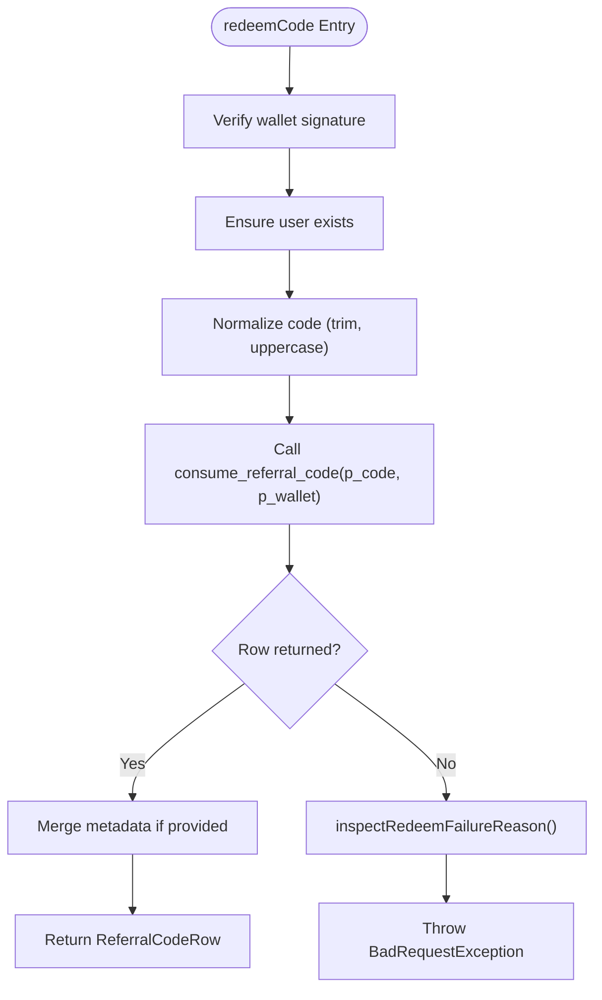
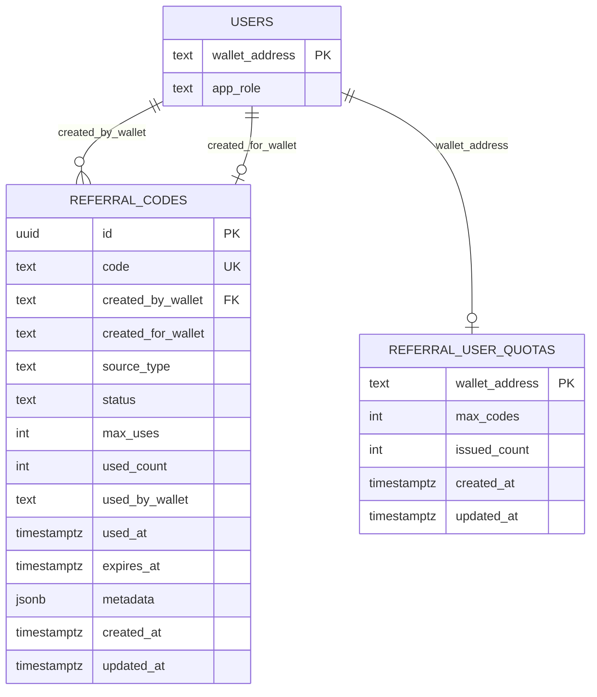
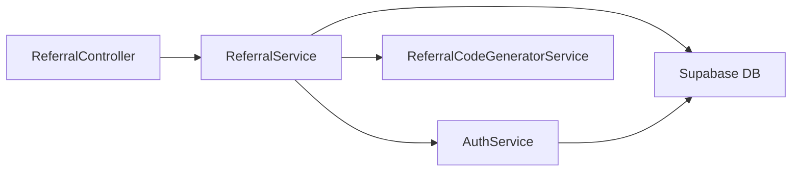

# Referral System

<cite>
**Referenced Files in This Document**
- [referral.module.ts](file://src/referral/referral.module.ts)
- [referral.controller.ts](file://src/referral/referral.controller.ts)
- [referral.service.ts](file://src/referral/referral.service.ts)
- [referral-code-generator.service.ts](file://src/referral/referral-code-generator.service.ts)
- [referral.constants.ts](file://src/referral/referral.constants.ts)
- [admin-generate-referral-codes.dto.ts](file://src/referral/dto/admin-generate-referral-codes.dto.ts)
- [generate-user-referral-codes.dto.ts](file://src/referral/dto/generate-user-referral-codes.dto.ts)
- [set-referral-quota.dto.ts](file://src/referral/dto/set-referral-quota.dto.ts)
- [redeem-referral-code.dto.ts](file://src/referral/dto/redeem-referral-code.dto.ts)
- [referral-code-generator.types.ts](file://src/referral/types/referral-code-generator.types.ts)
- [add_referral_system.sql](file://supabase/migrations/20260320090000_add_referral_system.sql)
- [initial-2-auth-challenges.sql](file://src/database/schema/initial-2-auth-challenges.sql)
- [auth.service.ts](file://src/auth/auth.service.ts)
- [auth.controller.ts](file://src/auth/auth.controller.ts)
- [verify-wallet.ts](file://src/database/functions/verify-wallet.ts)
</cite>

## Table of Contents
1. [Introduction](#introduction)
2. [Project Structure](#project-structure)
3. [Core Components](#core-components)
4. [Architecture Overview](#architecture-overview)
5. [Detailed Component Analysis](#detailed-component-analysis)
6. [Dependency Analysis](#dependency-analysis)
7. [Performance Considerations](#performance-considerations)
8. [Security and Abuse Prevention](#security-and-abuse-prevention)
9. [Practical Workflows](#practical-workflows)
10. [Analytics and Tracking](#analytics-and-tracking)
11. [Troubleshooting Guide](#troubleshooting-guide)
12. [Conclusion](#conclusion)

## Introduction
This document explains the referral system designed for user acquisition and incentive management. It covers the fixed-format referral code generation (REF-XXXXXXXX), single-use enforcement, global uniqueness guarantees enforced by database constraints, admin capabilities to generate codes for target wallets and set lifetime quotas, user self-generation governed by quotas, and the redemption process with robust validation. It also documents integration with the authentication system for wallet-based code management, the relationship with user account status, and operational guidance for analytics, code tracking, and troubleshooting.

## Project Structure
The referral system is organized around a dedicated module with a controller, service, generator, DTOs, and constants. Database schema and stored procedures are defined in a migration. Authentication is handled by a separate module with challenge generation and signature verification.

**Diagram sources**
- [referral.controller.ts:11-91](file://src/referral/referral.controller.ts#L11-L91)
- [referral.service.ts:44-49](file://src/referral/referral.service.ts#L44-L49)
- [referral-code-generator.service.ts:24-49](file://src/referral/referral-code-generator.service.ts#L24-L49)
- [auth.controller.ts:8-48](file://src/auth/auth.controller.ts#L8-L48)
- [auth.service.ts:9-164](file://src/auth/auth.service.ts#L9-L164)
- [add_referral_system.sql:1-195](file://supabase/migrations/20260320090000_add_referral_system.sql#L1-L195)
- [initial-2-auth-challenges.sql:1-7](file://src/database/schema/initial-2-auth-challenges.sql#L1-L7)

**Section sources**
- [referral.module.ts:1-14](file://src/referral/referral.module.ts#L1-L14)
- [referral.controller.ts:1-92](file://src/referral/referral.controller.ts#L1-L92)
- [referral.service.ts:1-364](file://src/referral/referral.service.ts#L1-L364)
- [referral-code-generator.service.ts:1-50](file://src/referral/referral-code-generator.service.ts#L1-L50)
- [auth.service.ts:1-165](file://src/auth/auth.service.ts#L1-L165)
- [add_referral_system.sql:1-195](file://supabase/migrations/20260320090000_add_referral_system.sql#L1-L195)
- [initial-2-auth-challenges.sql:1-7](file://src/database/schema/initial-2-auth-challenges.sql#L1-L7)

## Core Components
- ReferralController: Exposes endpoints for admin code generation, quota setting, user code generation, code redemption, and listing owned codes.
- ReferralService: Orchestrates business logic, including wallet signature verification, admin checks, user existence, quota reservation/release, code generation, persistence, and redemption via stored procedures.
- ReferralCodeGeneratorService: Generates fixed-format codes using a library with configurable prefix, charset, and length.
- DTOs: Strongly typed request DTOs for admin generation, user generation, quota setting, and redemption.
- Constants: Define code format (prefix, length, charset) and batch limits.
- Stored Procedures: reserve_referral_quota, release_referral_quota, consume_referral_code encapsulate atomic quota and single-use enforcement.
- Auth Integration: Wallet challenge generation and signature verification ensure only authorized actors can manage or use codes.

**Section sources**
- [referral.controller.ts:1-92](file://src/referral/referral.controller.ts#L1-L92)
- [referral.service.ts:44-364](file://src/referral/referral.service.ts#L44-L364)
- [referral-code-generator.service.ts:24-50](file://src/referral/referral-code-generator.service.ts#L24-L50)
- [referral.constants.ts:1-6](file://src/referral/referral.constants.ts#L1-L6)
- [admin-generate-referral-codes.dto.ts:1-73](file://src/referral/dto/admin-generate-referral-codes.dto.ts#L1-L73)
- [generate-user-referral-codes.dto.ts:1-62](file://src/referral/dto/generate-user-referral-codes.dto.ts#L1-L62)
- [set-referral-quota.dto.ts:1-34](file://src/referral/dto/set-referral-quota.dto.ts#L1-L34)
- [redeem-referral-code.dto.ts:1-41](file://src/referral/dto/redeem-referral-code.dto.ts#L1-L41)
- [add_referral_system.sql:106-187](file://supabase/migrations/20260320090000_add_referral_system.sql#L106-L187)
- [auth.service.ts:27-91](file://src/auth/auth.service.ts#L27-L91)

## Architecture Overview
The system enforces single-use codes and global uniqueness at the database level. Admins can generate codes for specific wallets; users can self-generate within lifetime quotas. Redemption is performed atomically via a stored procedure that updates usage counters and status.

**Diagram sources**
- [referral.controller.ts:15-31](file://src/referral/referral.controller.ts#L15-L31)
- [referral.service.ts:84-107](file://src/referral/referral.service.ts#L84-L107)
- [auth.service.ts:57-91](file://src/auth/auth.service.ts#L57-L91)
- [add_referral_system.sql:32-48](file://supabase/migrations/20260320090000_add_referral_system.sql#L32-L48)

**Diagram sources**
- [referral.controller.ts:49-64](file://src/referral/referral.controller.ts#L49-L64)
- [referral.service.ts:109-138](file://src/referral/referral.service.ts#L109-L138)
- [add_referral_system.sql:106-129](file://supabase/migrations/20260320090000_add_referral_system.sql#L106-L129)

**Diagram sources**
- [referral.controller.ts:66-80](file://src/referral/referral.controller.ts#L66-L80)
- [referral.service.ts:140-193](file://src/referral/referral.service.ts#L140-L193)
- [add_referral_system.sql:155-187](file://supabase/migrations/20260320090000_add_referral_system.sql#L155-L187)

## Detailed Component Analysis

### ReferralController
- Endpoints:
  - Admin: POST /referrals/admin/codes (generate single-use codes for a target wallet)
  - Admin: PATCH /referrals/admin/quotas/:walletAddress (set lifetime quota)
  - User: POST /referrals/codes (self-generate within lifetime quota)
  - Public: POST /referrals/redeem (redeem a single-use code)
  - Public: POST /referrals/my-codes (list codes created by wallet)
- Each endpoint delegates to ReferralService and returns standardized success responses.

**Section sources**
- [referral.controller.ts:15-91](file://src/referral/referral.controller.ts#L15-L91)

### ReferralService
- Responsibilities:
  - Wallet signature verification via AuthService and challenge consumption.
  - Admin role assertion against users.app_role.
  - User existence upsert to satisfy foreign keys.
  - Quota management:
    - setUserQuota: upserts referral_user_quotas with conflict on wallet_address.
    - reserveUserQuota: RPC reserve_referral_quota increments issued_count if within max_codes.
    - releaseUserQuota: RPC release_referral_quota decrements issued_count safely.
  - Code generation and persistence:
    - generateAndPersistCodes: generates codes, maps to insert rows, inserts with retry on unique violation.
    - Single-use enforcement: max_uses defaults to 1; used_count and status updated atomically on redeem.
  - Redemption:
    - consume_referral_code RPC performs atomic validation and update.
    - inspectRedeemFailureReason provides precise failure reasons.
  - Listing:
    - listMyCodes returns codes created by a wallet ordered by creation time.

**Diagram sources**
- [referral.service.ts:140-193](file://src/referral/referral.service.ts#L140-L193)
- [add_referral_system.sql:155-187](file://supabase/migrations/20260320090000_add_referral_system.sql#L155-L187)

**Section sources**
- [referral.service.ts:51-364](file://src/referral/referral.service.ts#L51-L364)

### ReferralCodeGeneratorService
- Uses a library to generate fixed-format codes with:
  - Prefix: REF-
  - Length: 8
  - Charset: digits and uppercase letters (excludes ambiguous characters)
- Returns uppercase codes.

**Section sources**
- [referral-code-generator.service.ts:24-50](file://src/referral/referral-code-generator.service.ts#L24-L50)
- [referral.constants.ts:2-5](file://src/referral/referral.constants.ts#L2-L5)

### DTOs and Validation
- AdminGenerateReferralCodesDto: admin wallet, signature, target wallet, count (bounded), optional expiresAt, optional metadata.
- GenerateUserReferralCodesDto: user wallet, signature, count (bounded), optional expiresAt, optional metadata.
- SetReferralQuotaDto: admin wallet, signature, maxCodes (>= 0).
- RedeemReferralCodeDto: wallet, signature, code, optional redemption metadata.

**Section sources**
- [admin-generate-referral-codes.dto.ts:15-73](file://src/referral/dto/admin-generate-referral-codes.dto.ts#L15-L73)
- [generate-user-referral-codes.dto.ts:15-62](file://src/referral/dto/generate-user-referral-codes.dto.ts#L15-L62)
- [set-referral-quota.dto.ts:5-34](file://src/referral/dto/set-referral-quota.dto.ts#L5-L34)
- [redeem-referral-code.dto.ts:5-41](file://src/referral/dto/redeem-referral-code.dto.ts#L5-L41)

### Database Schema and Constraints
- referral_codes:
  - Unique code, single-use enforced by max_uses=1 and used_count checks.
  - Status lifecycle: active -> used.
  - Optional created_for_wallet restricts redemption to intended wallet.
  - Optional expires_at prevents redemptions after expiry.
  - Metadata JSONB for auditing/analytics.
- referral_user_quotas:
  - Primary key wallet_address.
  - max_codes and issued_count with constraints ensuring issued_count <= max_codes.
- Stored procedures:
  - reserve_referral_quota: atomically increment issued_count if within limit.
  - release_referral_quota: atomically decrement issued_count (min 0).
  - consume_referral_code: atomic single-use redemption with validation.

**Diagram sources**
- [add_referral_system.sql:32-72](file://supabase/migrations/20260320090000_add_referral_system.sql#L32-L72)

**Section sources**
- [add_referral_system.sql:1-195](file://supabase/migrations/20260320090000_add_referral_system.sql#L1-L195)

## Dependency Analysis
- ReferralController depends on ReferralService.
- ReferralService depends on AuthService (challenge verification), SupabaseService (database operations), and ReferralCodeGeneratorService.
- Database constraints and stored procedures enforce business rules (uniqueness, single-use, quota, redemption conditions).
- Auth module manages challenges and signatures; users are upserted to satisfy foreign key constraints.

**Diagram sources**
- [referral.controller.ts:1-92](file://src/referral/referral.controller.ts#L1-L92)
- [referral.service.ts:44-49](file://src/referral/referral.service.ts#L44-L49)
- [auth.service.ts:1-165](file://src/auth/auth.service.ts#L1-L165)
- [add_referral_system.sql:106-187](file://supabase/migrations/20260320090000_add_referral_system.sql#L106-L187)

**Section sources**
- [referral.module.ts:1-14](file://src/referral/referral.module.ts#L1-L14)
- [referral.service.ts:44-49](file://src/referral/referral.service.ts#L44-L49)

## Performance Considerations
- Batch generation retry: generateAndPersistCodes retries insertion on unique violations to improve collision resilience.
- Stored procedures: Atomic operations reduce contention and ensure correctness under concurrent loads.
- Indexes: Composite indexes on referral_codes support common queries (created_by_wallet, created_for_wallet, status, created_at).
- Quota reservation: reserve/release RPCs operate in-memory-like increments/decrements with minimal lock contention.

[No sources needed since this section provides general guidance]

## Security and Abuse Prevention
- Wallet-based authentication: All endpoints require a valid signature derived from a short-lived challenge.
- Admin-only actions: Admin role enforced via users.app_role check.
- Single-use enforcement: Database constraints and stored procedures prevent reuse.
- Global uniqueness: Unique index on referral_codes.code prevents duplicates.
- Expiration and assignment: Optional expires_at and created_for_wallet limit misuse.
- Rate-limiting and monitoring: Apply at API gateway and monitor quota reservations and redemptions.

[No sources needed since this section provides general guidance]

## Practical Workflows

### Admin: Generate Single-Use Codes for a Target Wallet
- Request a challenge from the Auth module.
- Sign the challenge with the admin wallet.
- Call POST /referrals/admin/codes with:
  - adminWalletAddress
  - signature
  - targetWalletAddress
  - count (bounded)
  - expiresAt (optional)
  - metadata (optional)
- The system verifies admin signature, ensures admin role, upserts the target user, and persists unique codes.

**Section sources**
- [referral.controller.ts:15-31](file://src/referral/referral.controller.ts#L15-L31)
- [referral.service.ts:84-107](file://src/referral/referral.service.ts#L84-L107)
- [admin-generate-referral-codes.dto.ts:15-73](file://src/referral/dto/admin-generate-referral-codes.dto.ts#L15-L73)

### Admin: Set Lifetime Quota for a User
- Request a challenge and sign it.
- Call PATCH /referrals/admin/quotas/:walletAddress with:
  - adminWalletAddress
  - signature
  - maxCodes
- The system verifies admin signature, ensures admin role, and upserts the quota.

**Section sources**
- [referral.controller.ts:33-47](file://src/referral/referral.controller.ts#L33-L47)
- [referral.service.ts:51-82](file://src/referral/referral.service.ts#L51-L82)
- [set-referral-quota.dto.ts:5-34](file://src/referral/dto/set-referral-quota.dto.ts#L5-L34)

### User: Self-Generate Codes Within Lifetime Quota
- Request a challenge and sign it.
- Call POST /referrals/codes with:
  - walletAddress
  - signature
  - count (bounded)
  - expiresAt (optional)
  - metadata (optional)
- The system verifies the signature, ensures user exists, reserves quota, generates unique codes, and persists them. On failure, it releases the quota.

**Section sources**
- [referral.controller.ts:49-64](file://src/referral/referral.controller.ts#L49-L64)
- [referral.service.ts:109-138](file://src/referral/referral.service.ts#L109-L138)
- [generate-user-referral-codes.dto.ts:15-62](file://src/referral/dto/generate-user-referral-codes.dto.ts#L15-L62)

### Redemption Workflow
- Request a challenge and sign it.
- Call POST /referrals/redeem with:
  - walletAddress
  - signature
  - code
  - metadata (optional)
- The system verifies signature, ensures user exists, and calls consume_referral_code. If successful, returns the updated code row; otherwise, provides a precise failure reason.

**Section sources**
- [referral.controller.ts:66-80](file://src/referral/referral.controller.ts#L66-L80)
- [referral.service.ts:140-193](file://src/referral/referral.service.ts#L140-L193)
- [redeem-referral-code.dto.ts:5-41](file://src/referral/dto/redeem-referral-code.dto.ts#L5-L41)

### Listing Owned Codes
- Request a challenge and sign it.
- Call POST /referrals/my-codes with:
  - walletAddress
  - signature
- Returns all codes created by the wallet, ordered by creation time.

**Section sources**
- [referral.controller.ts:82-90](file://src/referral/referral.controller.ts#L82-L90)
- [referral.service.ts:195-209](file://src/referral/referral.service.ts#L195-L209)

## Analytics and Tracking
- Metadata storage: Both code creation and redemption support metadata for auditing and analytics.
- Redemption inspection: The system inspects failure reasons to aid analytics on why redemptions fail.
- Ownership tracking: Codes are linked to creator and optional recipient wallets for attribution.
- Database indexes: Support efficient queries for reporting and dashboards.

**Section sources**
- [referral.service.ts:169-193](file://src/referral/referral.service.ts#L169-L193)
- [add_referral_system.sql:44-47](file://supabase/migrations/20260320090000_add_referral_system.sql#L44-L47)

## Troubleshooting Guide
Common issues and resolutions:
- Quota conflicts:
  - Symptom: ForbiddenException when self-generating codes.
  - Cause: issued_count >= max_codes or quota not configured.
  - Resolution: Increase maxCodes via admin endpoint or wait until quota resets/expands.
- Code validation errors:
  - Symptom: BadRequestException on redeem.
  - Causes: Not assigned to wallet, expired, not active, already used, or generic invalid state.
  - Resolution: Inspect returned reason and adjust code distribution or expiration.
- Unique collision during generation:
  - Symptom: InternalServerError after retries.
  - Cause: Persistent unique violation despite retries.
  - Resolution: Reduce batch size or investigate generator/library health.
- Admin permission errors:
  - Symptom: ForbiddenException on admin endpoints.
  - Cause: Non-admin wallet or missing app_role.
  - Resolution: Ensure admin role and valid signature.

**Section sources**
- [referral.service.ts:121-124](file://src/referral/referral.service.ts#L121-L124)
- [referral.service.ts:330-362](file://src/referral/referral.service.ts#L330-L362)
- [referral.service.ts:317-320](file://src/referral/referral.service.ts#L317-L320)
- [referral.service.ts:218-236](file://src/referral/referral.service.ts#L218-L236)

## Conclusion
The referral system combines deterministic, globally unique code generation with robust single-use enforcement and lifetime quota management. Admins can distribute codes to specific wallets and configure quotas, while users can self-generate within limits. Redemption is secure and auditable, with precise failure diagnostics. The design leverages database constraints and stored procedures to guarantee correctness under concurrency, integrates tightly with wallet-based authentication, and supports comprehensive analytics through metadata and indexing.