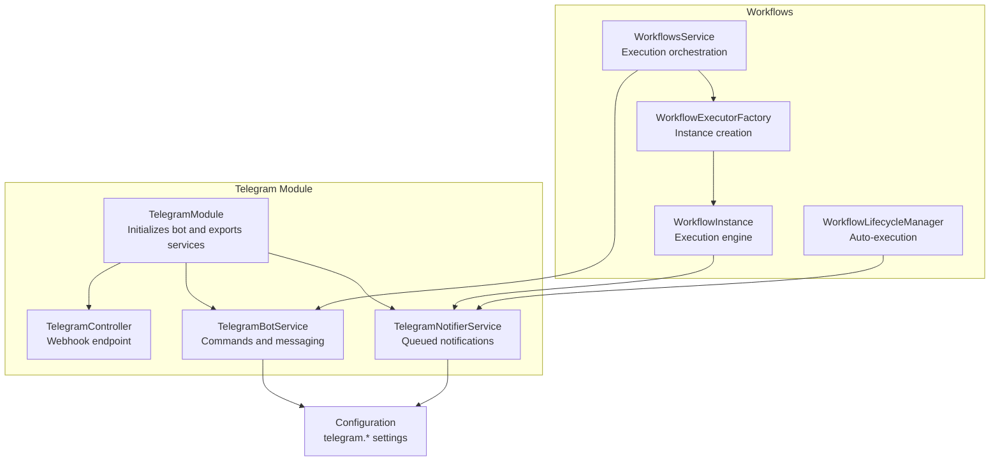
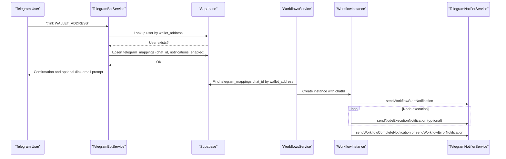
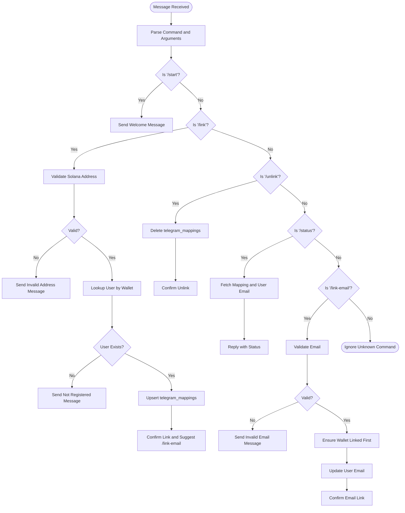
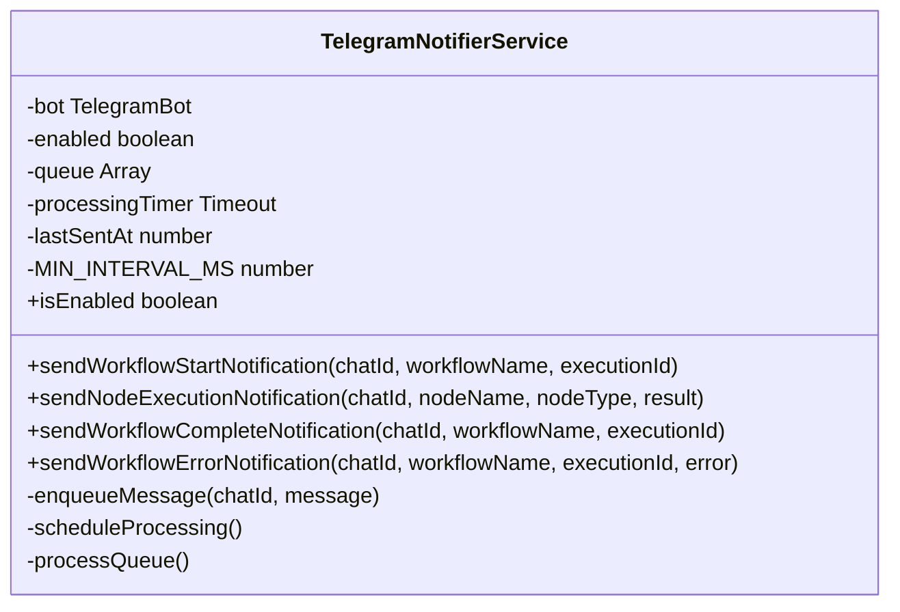
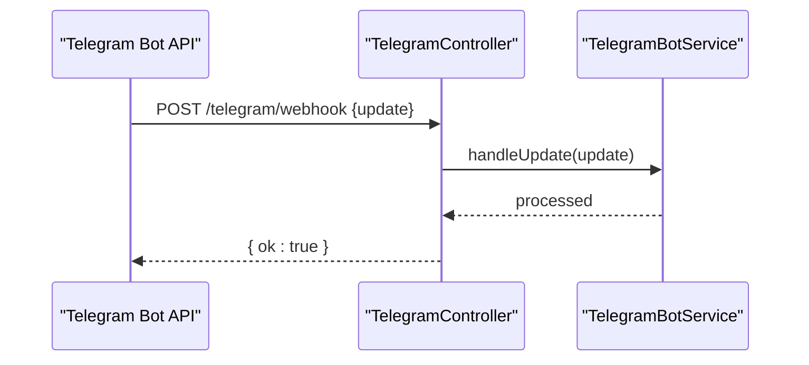
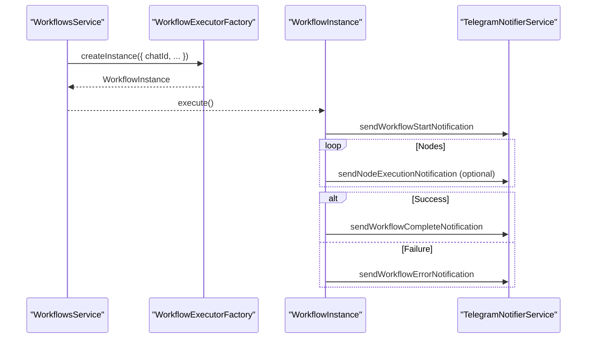
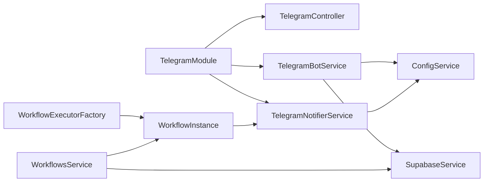

# Telegram Integration

<cite>
**Referenced Files in This Document**
- [telegram.module.ts](file://src/telegram/telegram.module.ts)
- [telegram.controller.ts](file://src/telegram/telegram.controller.ts)
- [telegram-bot.service.ts](file://src/telegram/telegram-bot.service.ts)
- [telegram-notifier.service.ts](file://src/telegram/telegram-notifier.service.ts)
- [configuration.ts](file://src/config/configuration.ts)
- [workflows.service.ts](file://src/workflows/workflows.service.ts)
- [workflow-lifecycle.service.ts](file://src/workflows/workflow-lifecycle.service.ts)
- [workflow-executor.factory.ts](file://src/workflows/workflow-executor.factory.ts)
- [workflow-instance.ts](file://src/workflows/workflow-instance.ts)
- [initial-1.sql](file://src/database/schema/initial-1.sql)
- [auth.service.ts](file://src/auth/auth.service.ts)
</cite>

## Table of Contents
1. [Introduction](#introduction)
2. [Project Structure](#project-structure)
3. [Core Components](#core-components)
4. [Architecture Overview](#architecture-overview)
5. [Detailed Component Analysis](#detailed-component-analysis)
6. [Dependency Analysis](#dependency-analysis)
7. [Performance Considerations](#performance-considerations)
8. [Troubleshooting Guide](#troubleshooting-guide)
9. [Conclusion](#conclusion)
10. [Appendices](#appendices)

## Introduction
This document explains the Telegram integration for real-time notifications and bot communication. It covers bot setup and configuration, webhook versus long polling modes, command processing (/start, /link, /unlink, /status, and /link-email), and the integration with the workflow execution system. It also documents the telegram-notifier.service for workflow execution notifications, telegram-bot.service for bot operations, and telegram.controller for webhook handling. Practical examples, security considerations, notification customization, scheduling, user preferences, and troubleshooting are included, along with the relationship to the user authentication system.

## Project Structure
The Telegram integration is organized under the telegram module and integrates with the workflows subsystem and configuration system.

**Diagram sources**
- [telegram.module.ts:1-18](file://src/telegram/telegram.module.ts#L1-L18)
- [telegram.controller.ts:1-32](file://src/telegram/telegram.controller.ts#L1-L32)
- [telegram-bot.service.ts:1-260](file://src/telegram/telegram-bot.service.ts#L1-L260)
- [telegram-notifier.service.ts:1-185](file://src/telegram/telegram-notifier.service.ts#L1-L185)
- [workflows.service.ts:1-216](file://src/workflows/workflows.service.ts#L1-L216)
- [workflow-lifecycle.service.ts:1-343](file://src/workflows/workflow-lifecycle.service.ts#L1-L343)
- [workflow-executor.factory.ts:1-42](file://src/workflows/workflow-executor.factory.ts#L1-L42)
- [workflow-instance.ts:1-314](file://src/workflows/workflow-instance.ts#L1-L314)
- [configuration.ts:12-16](file://src/config/configuration.ts#L12-L16)

**Section sources**
- [telegram.module.ts:1-18](file://src/telegram/telegram.module.ts#L1-L18)
- [configuration.ts:12-16](file://src/config/configuration.ts#L12-L16)

## Core Components
- TelegramModule: Registers the controller and providers, starts the bot on module initialization.
- TelegramController: Receives Telegram webhook updates and delegates to TelegramBotService.
- TelegramBotService: Manages bot token, sets up commands, handles user interactions, and supports webhook or polling.
- TelegramNotifierService: Queues and sends Markdown-formatted notifications for workflow lifecycle events.
- WorkflowsService and WorkflowInstance: Trigger notifications during workflow execution and completion/failure.
- Configuration: Provides telegram.botToken, telegram.webhookUrl, and telegram.notifyEnabled.

**Section sources**
- [telegram.module.ts:1-18](file://src/telegram/telegram.module.ts#L1-L18)
- [telegram.controller.ts:1-32](file://src/telegram/telegram.controller.ts#L1-L32)
- [telegram-bot.service.ts:1-260](file://src/telegram/telegram-bot.service.ts#L1-L260)
- [telegram-notifier.service.ts:1-185](file://src/telegram/telegram-notifier.service.ts#L1-L185)
- [workflows.service.ts:132-169](file://src/workflows/workflows.service.ts#L132-L169)
- [workflow-instance.ts:94-151](file://src/workflows/workflow-instance.ts#L94-L151)
- [configuration.ts:12-16](file://src/config/configuration.ts#L12-L16)

## Architecture Overview
The Telegram integration operates in two complementary modes:
- Bot commands and user linking via TelegramBotService.
- Real-time notifications via TelegramNotifierService triggered by workflow execution.

**Diagram sources**
- [telegram-bot.service.ts:65-126](file://src/telegram/telegram-bot.service.ts#L65-L126)
- [workflows.service.ts:132-169](file://src/workflows/workflows.service.ts#L132-L169)
- [workflow-instance.ts:102-147](file://src/workflows/workflow-instance.ts#L102-L147)
- [telegram-notifier.service.ts:30-113](file://src/telegram/telegram-notifier.service.ts#L30-L113)

## Detailed Component Analysis

### TelegramBotService: Commands and User Management
- Initializes TelegramBot using telegram.botToken from configuration.
- Supports webhook or long polling based on telegram.webhookUrl.
- Processes commands:
  - /start: Welcomes user and explains /link usage.
  - /link WALLET_ADDRESS: Validates Solana address, checks user existence, and creates/updates telegram_mappings.
  - /unlink: Removes telegram_mappings entry for the chat.
  - /status: Displays linked wallet, email status, and notification preferences.
  - /link-email EMAIL: Links email to the user’s wallet via telegram_mappings mapping.
- Uses SupabaseService to query users and manage telegram_mappings.

**Diagram sources**
- [telegram-bot.service.ts:24-42](file://src/telegram/telegram-bot.service.ts#L24-L42)
- [telegram-bot.service.ts:45-63](file://src/telegram/telegram-bot.service.ts#L45-L63)
- [telegram-bot.service.ts:65-126](file://src/telegram/telegram-bot.service.ts#L65-L126)
- [telegram-bot.service.ts:128-148](file://src/telegram/telegram-bot.service.ts#L128-L148)
- [telegram-bot.service.ts:150-187](file://src/telegram/telegram-bot.service.ts#L150-L187)
- [telegram-bot.service.ts:197-241](file://src/telegram/telegram-bot.service.ts#L197-L241)

**Section sources**
- [telegram-bot.service.ts:14-22](file://src/telegram/telegram-bot.service.ts#L14-L22)
- [telegram-bot.service.ts:24-43](file://src/telegram/telegram-bot.service.ts#L24-L43)
- [telegram-bot.service.ts:243-258](file://src/telegram/telegram-bot.service.ts#L243-L258)
- [telegram-bot.service.ts:45-187](file://src/telegram/telegram-bot.service.ts#L45-L187)
- [telegram-bot.service.ts:197-241](file://src/telegram/telegram-bot.service.ts#L197-L241)

### TelegramNotifierService: Notification Engine
- Initializes only when telegram.notifyEnabled is true and telegram.botToken is present.
- Maintains an internal queue and enforces a minimum interval between messages to avoid rate limits.
- Sends notifications for:
  - Workflow start
  - Node execution (conditional based on node configuration)
  - Workflow completion
  - Workflow error
- Uses Markdown formatting for rich messages.

**Diagram sources**
- [telegram-notifier.service.ts:6-28](file://src/telegram/telegram-notifier.service.ts#L6-L28)
- [telegram-notifier.service.ts:124-164](file://src/telegram/telegram-notifier.service.ts#L124-L164)

**Section sources**
- [telegram-notifier.service.ts:14-24](file://src/telegram/telegram-notifier.service.ts#L14-L24)
- [telegram-notifier.service.ts:30-113](file://src/telegram/telegram-notifier.service.ts#L30-L113)
- [telegram-notifier.service.ts:124-164](file://src/telegram/telegram-notifier.service.ts#L124-L164)

### TelegramController: Webhook Endpoint
- Exposes POST /telegram/webhook for Telegram Bot API.
- Delegates update handling to TelegramBotService.handleUpdate.
- Returns { ok: true } to acknowledge receipt.

**Diagram sources**
- [telegram.controller.ts:10-30](file://src/telegram/telegram.controller.ts#L10-L30)
- [telegram-bot.service.ts:255-258](file://src/telegram/telegram-bot.service.ts#L255-L258)

**Section sources**
- [telegram.controller.ts:10-30](file://src/telegram/telegram.controller.ts#L10-L30)
- [telegram-bot.service.ts:255-258](file://src/telegram/telegram-bot.service.ts#L255-L258)

### TelegramModule: Initialization and Export
- Registers TelegramController, providers, and exports services.
- Calls TelegramBotService.startBot() on module initialization to configure webhook or start polling.

**Section sources**
- [telegram.module.ts:6-17](file://src/telegram/telegram.module.ts#L6-L17)

### Configuration: Environment Variables
- telegram.botToken: Required for bot initialization.
- telegram.webhookUrl: Optional; if present, enables webhook mode; otherwise long polling is used.
- telegram.notifyEnabled: Enables TelegramNotifierService.

**Section sources**
- [configuration.ts:12-16](file://src/config/configuration.ts#L12-L16)

### Workflow Integration: Notifications During Execution
- WorkflowsService resolves chatId from telegram_mappings and passes it to WorkflowInstance.
- WorkflowInstance triggers TelegramNotifierService for start, node completion, and completion/error notifications.
- Node-level notifications depend on node configuration (e.g., telegramNotify flag).

**Diagram sources**
- [workflows.service.ts:132-169](file://src/workflows/workflows.service.ts#L132-L169)
- [workflow-executor.factory.ts:17-34](file://src/workflows/workflow-executor.factory.ts#L17-L34)
- [workflow-instance.ts:94-151](file://src/workflows/workflow-instance.ts#L94-L151)
- [telegram-notifier.service.ts:30-113](file://src/telegram/telegram-notifier.service.ts#L30-L113)

**Section sources**
- [workflows.service.ts:132-169](file://src/workflows/workflows.service.ts#L132-L169)
- [workflow-instance.ts:102-147](file://src/workflows/workflow-instance.ts#L102-L147)
- [workflow-executor.factory.ts:17-34](file://src/workflows/workflow-executor.factory.ts#L17-L34)

### Database Schema: User and Telegram Mapping
- telegram_mappings links wallet_address to chat_id with notifications_enabled and timestamps.
- Foreign key constraint ensures wallet_address references users.

**Section sources**
- [initial-1.sql:66-79](file://src/database/schema/initial-1.sql#L66-L79)

### Authentication Relationship
- Users are created/updated upon successful wallet signature verification.
- Telegram linking requires a pre-existing user with a matching wallet_address.
- Email linking complements wallet linkage for richer notifications.

**Section sources**
- [auth.service.ts:116-132](file://src/auth/auth.service.ts#L116-L132)
- [telegram-bot.service.ts:75-87](file://src/telegram/telegram-bot.service.ts#L75-L87)
- [telegram-bot.service.ts:207-224](file://src/telegram/telegram-bot.service.ts#L207-L224)

## Dependency Analysis
- TelegramModule depends on TelegramController, TelegramBotService, and TelegramNotifierService.
- TelegramBotService depends on ConfigService and SupabaseService.
- TelegramNotifierService depends on ConfigService.
- WorkflowInstance depends on TelegramNotifierService and is created by WorkflowExecutorFactory.
- WorkflowsService resolves chatId from telegram_mappings and injects it into WorkflowInstance.

**Diagram sources**
- [telegram.module.ts:6-17](file://src/telegram/telegram.module.ts#L6-L17)
- [telegram-bot.service.ts:10-14](file://src/telegram/telegram-bot.service.ts#L10-L14)
- [telegram-notifier.service.ts:14](file://src/telegram/telegram-notifier.service.ts#L14)
- [workflow-executor.factory.ts:10-15](file://src/workflows/workflow-executor.factory.ts#L10-L15)
- [workflows.service.ts:8-12](file://src/workflows/workflows.service.ts#L8-L12)

**Section sources**
- [telegram.module.ts:6-17](file://src/telegram/telegram.module.ts#L6-L17)
- [telegram-bot.service.ts:10-14](file://src/telegram/telegram-bot.service.ts#L10-L14)
- [telegram-notifier.service.ts:14](file://src/telegram/telegram-notifier.service.ts#L14)
- [workflow-executor.factory.ts:10-15](file://src/workflows/workflow-executor.factory.ts#L10-L15)
- [workflows.service.ts:8-12](file://src/workflows/workflows.service.ts#L8-L12)

## Performance Considerations
- Rate limiting: TelegramNotifierService enforces a minimum interval between messages to prevent rate limiting.
- Queueing: Messages are queued and sent sequentially to avoid bursts.
- Conditional notifications: Node-level notifications are gated by node configuration to reduce noise.
- Polling vs webhook: Prefer webhook mode when possible to reduce CPU usage compared to long polling.

[No sources needed since this section provides general guidance]

## Troubleshooting Guide
- Bot not responding:
  - Verify telegram.botToken is set.
  - Ensure telegram.webhookUrl is configured for webhook mode or allow long polling.
- Webhook not received:
  - Confirm /telegram/webhook endpoint is reachable and returns { ok: true }.
  - Validate webhook URL in Telegram Bot settings matches deployment.
- Linking fails:
  - Check wallet address validity and user existence.
  - Inspect Supabase errors for upsert failures.
- Notifications not sent:
  - Confirm telegram.notifyEnabled is true.
  - Ensure chatId is present for the user’s wallet.
- Rate limit errors:
  - Reduce message frequency or rely on built-in queue throttling.

**Section sources**
- [configuration.ts:12-16](file://src/config/configuration.ts#L12-L16)
- [telegram.controller.ts:10-30](file://src/telegram/telegram.controller.ts#L10-L30)
- [telegram-bot.service.ts:15-22](file://src/telegram/telegram-bot.service.ts#L15-L22)
- [telegram-notifier.service.ts:14-24](file://src/telegram/telegram-notifier.service.ts#L14-L24)
- [workflows.service.ts:132-169](file://src/workflows/workflows.service.ts#L132-L169)

## Conclusion
The Telegram integration provides a robust foundation for user onboarding via bot commands and real-time notifications during workflow execution. By leveraging configuration-driven modes (webhook/polling), a queued notification system, and seamless integration with the workflow engine, the system delivers timely updates while maintaining reliability and scalability.

[No sources needed since this section summarizes without analyzing specific files]

## Appendices

### Setup and Configuration Examples
- Environment variables:
  - TELEGRAM_BOT_TOKEN: Your bot token from BotFather.
  - TELEGRAM_WEBHOOK_URL: Full HTTPS URL to /telegram/webhook when using webhook mode.
  - TELEGRAM_NOTIFY_ENABLED: true to enable notifications.
- Example command usage:
  - /start
  - /link WALLET_ADDRESS
  - /unlink
  - /status
  - /link-email EMAIL

**Section sources**
- [configuration.ts:12-16](file://src/config/configuration.ts#L12-L16)
- [telegram-bot.service.ts:29-41](file://src/telegram/telegram-bot.service.ts#L29-L41)

### Notification Templates
- Workflow started: Includes workflow name, execution ID, and timestamp.
- Node completed: Includes node name, type, and type-specific details (e.g., price, swap amounts, transaction signature).
- Workflow completed: Confirms completion and total execution time.
- Workflow error: Includes error message with code block formatting.

**Section sources**
- [telegram-notifier.service.ts:30-113](file://src/telegram/telegram-notifier.service.ts#L30-L113)

### Security Considerations
- Token management: Store TELEGRAM_BOT_TOKEN securely and restrict access.
- Rate limiting: Rely on Telegram’s limits and the internal queue throttling.
- Input validation: Commands validate wallet addresses and emails before processing.
- Access control: Webhook endpoint is internal; ensure only Telegram can reach it.

**Section sources**
- [telegram-bot.service.ts:67-73](file://src/telegram/telegram-bot.service.ts#L67-L73)
- [telegram-bot.service.ts:199-205](file://src/telegram/telegram-bot.service.ts#L199-L205)
- [telegram-notifier.service.ts:124-164](file://src/telegram/telegram-notifier.service.ts#L124-L164)

### User Preference Management
- notifications_enabled is stored in telegram_mappings and defaults to true.
- Users can toggle notifications indirectly by unlinking or by disabling bot interactions.

**Section sources**
- [initial-1.sql:73](file://src/database/schema/initial-1.sql#L73)
- [telegram-bot.service.ts:89-96](file://src/telegram/telegram-bot.service.ts#L89-L96)

### Notification Scheduling
- Notifications are sent synchronously when events occur; there is no background scheduler.
- Queue processing ensures steady delivery without overwhelming the Telegram API.

**Section sources**
- [telegram-notifier.service.ts:124-164](file://src/telegram/telegram-notifier.service.ts#L124-L164)