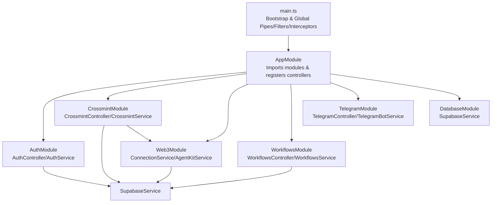
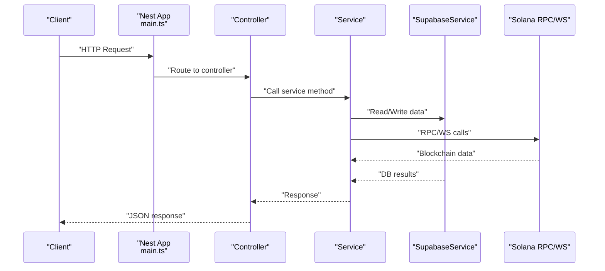
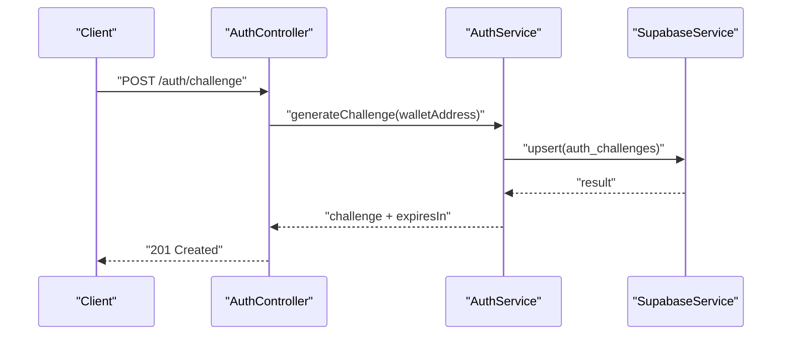
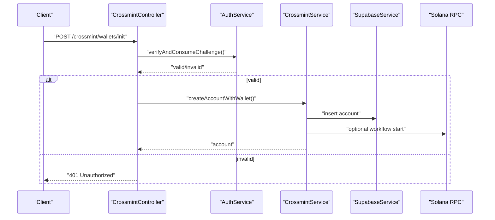
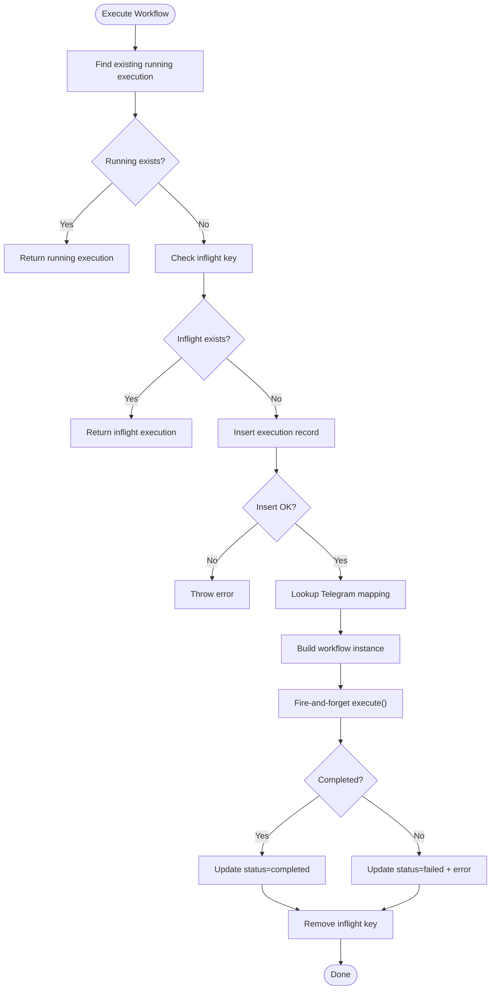
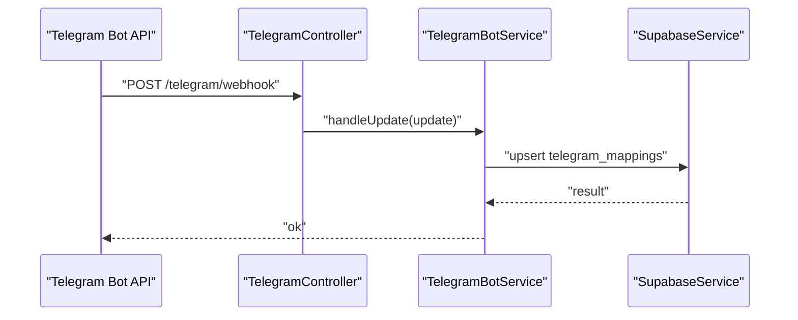
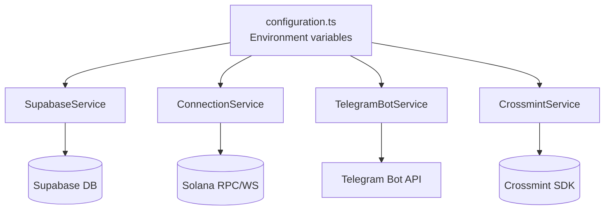

# Troubleshooting and FAQ

<cite>
**Referenced Files in This Document**
- [main.ts](file://src/main.ts)
- [app.module.ts](file://src/app.module.ts)
- [configuration.ts](file://src/config/configuration.ts)
- [logging.interceptor.ts](file://src/common/interceptors/logging.interceptor.ts)
- [http-exception.filter.ts](file://src/common/filters/http-exception.filter.ts)
- [auth.controller.ts](file://src/auth/auth.controller.ts)
- [auth.service.ts](file://src/auth/auth.service.ts)
- [crossmint.controller.ts](file://src/crossmint/crossmint.controller.ts)
- [crossmint.service.ts](file://src/crossmint/crossmint.service.ts)
- [supabase.service.ts](file://src/database/supabase.service.ts)
- [database.module.ts](file://src/database/database.module.ts)
- [connection.service.ts](file://src/web3/services/connection.service.ts)
- [web3.module.ts](file://src/web3/web3.module.ts)
- [workflows.controller.ts](file://src/workflows/workflows.controller.ts)
- [workflows.service.ts](file://src/workflows/workflows.service.ts)
- [telegram.controller.ts](file://src/telegram/telegram.controller.ts)
- [telegram-bot.service.ts](file://src/telegram/telegram-bot.service.ts)
- [package.json](file://package.json)
</cite>

## Table of Contents
1. [Introduction](#introduction)
2. [Project Structure](#project-structure)
3. [Core Components](#core-components)
4. [Architecture Overview](#architecture-overview)
5. [Detailed Component Analysis](#detailed-component-analysis)
6. [Dependency Analysis](#dependency-analysis)
7. [Performance Considerations](#performance-considerations)
8. [Troubleshooting Guide](#troubleshooting-guide)
9. [FAQ](#faq)
10. [Conclusion](#conclusion)
11. [Appendices](#appendices)

## Introduction
This document provides a comprehensive troubleshooting and FAQ guide for PinTool. It focuses on diagnosing and resolving common issues across authentication (wallet signature verification, API keys), Crossmint integration, workflow execution (node failures, transactions, blockchain connectivity), database and Row Level Security (RLS), and Telegram bot integration (webhooks, message delivery, user linking). It also outlines diagnostic procedures using logging interceptors, exception filters, and health checks, along with performance optimization, monitoring, escalation, and preventive maintenance strategies.

## Project Structure
PinTool is a NestJS backend with modularized concerns:
- Authentication and Crossmint integrations
- Web3 connectivity and nodes
- Workflows and lifecycle management
- Telegram bot and notifications
- Database via Supabase with RLS
- Global configuration and middleware

**Diagram sources**
- [main.ts:9-38](file://src/main.ts#L9-L38)
- [app.module.ts:15-31](file://src/app.module.ts#L15-L31)
- [database.module.ts:4-9](file://src/database/database.module.ts#L4-L9)
- [web3.module.ts:7-12](file://src/web3/web3.module.ts#L7-L12)

**Section sources**
- [main.ts:9-38](file://src/main.ts#L9-L38)
- [app.module.ts:15-31](file://src/app.module.ts#L15-L31)

## Core Components
- Global logging interceptor records request method, URL, and response time.
- Global exception filter standardizes error responses and logs stack traces.
- Auth service generates and validates wallet challenges, stores them, and cleans up periodically.
- Crossmint service initializes SDK, manages wallets, and performs asset withdrawals.
- Supabase service centralizes DB client initialization and RLS context setting.
- Web3 connection service initializes RPC, WS, and legacy connections.
- Workflows service executes workflow instances and persists execution logs.
- Telegram bot service handles commands, links/unlinks wallets, and manages webhooks/polling.

**Section sources**
- [logging.interceptor.ts:5-19](file://src/common/interceptors/logging.interceptor.ts#L5-L19)
- [http-exception.filter.ts:4-39](file://src/common/filters/http-exception.filter.ts#L4-L39)
- [auth.service.ts:27-91](file://src/auth/auth.service.ts#L27-L91)
- [crossmint.service.ts:56-75](file://src/crossmint/crossmint.service.ts#L56-L75)
- [supabase.service.ts:11-41](file://src/database/supabase.service.ts#L11-L41)
- [connection.service.ts:30-72](file://src/web3/services/connection.service.ts#L30-L72)
- [workflows.service.ts:83-214](file://src/workflows/workflows.service.ts#L83-L214)
- [telegram-bot.service.ts:14-22](file://src/telegram/telegram-bot.service.ts#L14-L22)

## Architecture Overview
High-level runtime flow for typical requests and integrations:

**Diagram sources**
- [main.ts:9-38](file://src/main.ts#L9-L38)
- [workflows.service.ts:83-214](file://src/workflows/service.ts#L83-L214)
- [supabase.service.ts:29-41](file://src/database/supabase.service.ts#L29-L41)
- [connection.service.ts:40-53](file://src/web3/services/connection.service.ts#L40-L53)

## Detailed Component Analysis

### Authentication and Wallet Signature Verification
Common issues:
- Challenge generation fails due to DB write errors.
- Signature verification fails due to malformed inputs or invalid signatures.
- Expired challenges not cleaned up leading to stale entries.

Diagnostic steps:
- Confirm challenge creation and storage via the AuthController endpoint.
- Verify signature verification path and error logging.
- Monitor periodic cleanup of expired challenges.

**Diagram sources**
- [auth.controller.ts:36-47](file://src/auth/auth.controller.ts#L36-L47)
- [auth.service.ts:35-51](file://src/auth/auth.service.ts#L35-L51)
- [supabase.service.ts:29-31](file://src/database/supabase.service.ts#L29-L31)

**Section sources**
- [auth.controller.ts:36-47](file://src/auth/auth.controller.ts#L36-L47)
- [auth.service.ts:27-91](file://src/auth/auth.service.ts#L27-L91)
- [supabase.service.ts:11-27](file://src/database/supabase.service.ts#L11-L27)

### Crossmint Integration
Common issues:
- Missing Crossmint API key or signer secret causing SDK initialization failure.
- Wallet retrieval errors due to missing locator/address or invalid owner.
- Asset withdrawal failures during close-account operations.

Diagnostic steps:
- Check service initialization logs and environment variables.
- Validate account ownership and wallet locator presence.
- Inspect withdrawal transactions and error accumulation.

**Diagram sources**
- [crossmint.controller.ts:30-42](file://src/crossmint/crossmint.controller.ts#L30-L42)
- [auth.service.ts:57-91](file://src/auth/auth.service.ts#L57-L91)
- [crossmint.service.ts:163-204](file://src/crossmint/crossmint.service.ts#L163-L204)
- [supabase.service.ts:29-31](file://src/database/supabase.service.ts#L29-L31)
- [connection.service.ts:40-42](file://src/web3/services/connection.service.ts#L40-L42)

**Section sources**
- [crossmint.controller.ts:30-42](file://src/crossmint/crossmint.controller.ts#L30-L42)
- [crossmint.service.ts:56-75](file://src/crossmint/crossmint.service.ts#L56-L75)
- [crossmint.service.ts:349-401](file://src/crossmint/crossmint.service.ts#L349-L401)

### Workflows Execution
Common issues:
- Duplicate or concurrent executions blocked by inflight tracking.
- Execution stuck due to unhandled exceptions; verify completion updates.
- Telegram notification not sent if no mapping found.

Diagnostic steps:
- Use the active workflows endpoint guarded by API key.
- Review execution records and logs persisted to DB.
- Confirm inflight execution keys are cleared.

**Diagram sources**
- [workflows.service.ts:83-214](file://src/workflows/workflows.service.ts#L83-L214)

**Section sources**
- [workflows.controller.ts:11-26](file://src/workflows/workflows.controller.ts#L11-L26)
- [workflows.service.ts:83-214](file://src/workflows/workflows.service.ts#L83-L214)

### Telegram Bot Integration
Common issues:
- Webhook not configured or reachable.
- Message delivery failures due to invalid chat ID or disabled notifications.
- User linking fails due to invalid wallet address or missing user.

Diagnostic steps:
- Start bot and either set webhook URL or start polling.
- Validate command handlers and DB upserts for mappings.
- Confirm bot can send messages to chat IDs.

**Diagram sources**
- [telegram.controller.ts:27-30](file://src/telegram/telegram.controller.ts#L27-L30)
- [telegram-bot.service.ts:255-258](file://src/telegram/telegram-bot.service.ts#L255-L258)
- [telegram-bot.service.ts:89-96](file://src/telegram/telegram-bot.service.ts#L89-L96)

**Section sources**
- [telegram.controller.ts:27-30](file://src/telegram/telegram.controller.ts#L27-L30)
- [telegram-bot.service.ts:14-22](file://src/telegram/telegram-bot.service.ts#L14-L22)
- [telegram-bot.service.ts:243-253](file://src/telegram/telegram-bot.service.ts#L243-L253)

## Dependency Analysis
Key external dependencies and configuration touchpoints:
- Supabase client requires URL and service key.
- Solana RPC/WS require configured URLs.
- Telegram requires bot token and optional webhook URL.
- Crossmint requires server API key and signer secret.

**Diagram sources**
- [configuration.ts:6-44](file://src/config/configuration.ts#L6-L44)
- [supabase.service.ts:11-27](file://src/database/supabase.service.ts#L11-L27)
- [connection.service.ts:30-42](file://src/web3/services/connection.service.ts#L30-L42)
- [telegram-bot.service.ts:14-22](file://src/telegram/telegram-bot.service.ts#L14-L22)
- [crossmint.service.ts:56-75](file://src/crossmint/crossmint.service.ts#L56-L75)

**Section sources**
- [configuration.ts:6-44](file://src/config/configuration.ts#L6-L44)
- [package.json:23-54](file://package.json#L23-L54)

## Performance Considerations
- Logging overhead: The logging interceptor adds minimal per-request overhead; keep enabled in production for observability.
- Exception filtering: Centralized error handling prevents verbose stack traces to clients while preserving logs.
- DB RLS: Setting RLS context per request ensures row-level filtering; ensure policies are efficient and indexed.
- Blockchain calls: Batch operations and reuse connections; avoid redundant RPC calls.
- Memory: Avoid retaining large execution logs in memory; stream or persist incrementally.
- Resource monitoring: Track CPU, memory, DB connections, and RPC latency.

[No sources needed since this section provides general guidance]

## Troubleshooting Guide

### Authentication and Wallet Signature Issues
Symptoms:
- Challenge generation returns 500.
- Signature verification returns false.
- Frequent “challenge expired” errors.

Procedures:
- Verify DB initialization and auth_challenges upsert.
- Confirm challenge TTL and cleanup interval.
- Validate wallet address format and signature encoding.

Resolution:
- Check DB connectivity and Supabase service key.
- Ensure wallet address normalization and correct public key derivation.
- Confirm challenge deletion after successful verification.

**Section sources**
- [auth.service.ts:35-51](file://src/auth/auth.service.ts#L35-L51)
- [auth.service.ts:72-91](file://src/auth/auth.service.ts#L72-L91)
- [auth.service.ts:147-156](file://src/auth/auth.service.ts#L147-L156)

### API Key Problems
Symptoms:
- Active workflows endpoint returns 401.
- Requests unauthorized despite valid credentials.

Procedures:
- Confirm API key guard is applied to the endpoint.
- Verify X-API-Key header is present and correct.

Resolution:
- Regenerate and redeploy API key.
- Ensure environment variable is set and loaded by ConfigService.

**Section sources**
- [workflows.controller.ts:11-26](file://src/workflows/workflows.controller.ts#L11-L26)

### Crossmint Integration Errors
Symptoms:
- Wallet creation fails with SDK initialization warning.
- Account creation succeeds but no wallet returned.
- Asset withdrawal errors during close.

Procedures:
- Check CROSSMINT_SERVER_API_KEY and CROSSMINT_SIGNER_SECRET.
- Validate account ownership and locator/address presence.
- Inspect withdrawal transactions and error arrays.

Resolution:
- Reconfigure environment variables and restart.
- Retry failed withdrawal steps individually.
- Ensure sufficient SOL balance for fees.

**Section sources**
- [crossmint.service.ts:56-75](file://src/crossmint/crossmint.service.ts#L56-L75)
- [crossmint.service.ts:163-204](file://src/crossmint/crossmint.service.ts#L163-L204)
- [crossmint.service.ts:349-401](file://src/crossmint/crossmint.service.ts#L349-L401)

### Workflow Execution Troubleshooting
Symptoms:
- Execution stuck in running state.
- No completion/failure updates.
- Duplicate executions not prevented.

Procedures:
- Use GET /workflows/active to inspect lifecycle manager.
- Inspect workflow_executions records for status and error_message.
- Check inflight execution keys and cleanup.

Resolution:
- Investigate unhandled exceptions in workflow instance.
- Ensure completion/failure updates occur in finally block.
- Clear stale inflight keys if needed.

**Section sources**
- [workflows.controller.ts:11-26](file://src/workflows/workflows.controller.ts#L11-L26)
- [workflows.service.ts:171-214](file://src/workflows/workflows.service.ts#L171-L214)

### Blockchain Connectivity Issues
Symptoms:
- RPC calls fail or timeout.
- WS subscriptions not established.
- Legacy connection not initialized.

Procedures:
- Verify SOLANA_RPC_URL and SOLANA_WS_URL.
- Test RPC reachability and fallback to WS conversion.
- Initialize connection pool on startup.

Resolution:
- Update environment variables and restart.
- Use reliable RPC endpoints; monitor latency.

**Section sources**
- [connection.service.ts:30-72](file://src/web3/services/connection.service.ts#L30-L72)
- [configuration.ts:18-21](file://src/config/configuration.ts#L18-L21)

### Database and RLS Violations
Symptoms:
- Permission denied errors.
- Unexpected empty results despite valid queries.
- RLS policy mismatches.

Procedures:
- Confirm Supabase URL and service key are set.
- Set RLS context using setRLSContext with wallet address.
- Validate RLS policies and indexes.

Resolution:
- Fix environment variables and restart.
- Align RLS policies with app.current_wallet.

**Section sources**
- [supabase.service.ts:11-27](file://src/database/supabase.service.ts#L11-L27)
- [supabase.service.ts:33-40](file://src/database/supabase.service.ts#L33-L40)

### Telegram Bot Troubleshooting
Symptoms:
- Webhook not received by service.
- Messages not delivered.
- Linking fails due to invalid wallet or missing user.

Procedures:
- Configure TELEGRAM_WEBHOOK_URL or start polling.
- Validate bot token and webhook URL reachability.
- Check command handlers and DB upserts.

Resolution:
- Set webhook URL and restart bot.
- Validate wallet address format and user existence.
- Ensure notifications_enabled flag is respected.

**Section sources**
- [telegram-bot.service.ts:243-253](file://src/telegram/telegram-bot.service.ts#L243-L253)
- [telegram.controller.ts:27-30](file://src/telegram/telegram.controller.ts#L27-L30)
- [telegram-bot.service.ts:65-126](file://src/telegram/telegram-bot.service.ts#L65-L126)

### Diagnostic Procedures Using Interceptors, Filters, and Health Checks
- Logging interceptor: Use request method, URL, and response time to identify slow endpoints.
- Exception filter: Inspect standardized error responses and timestamps.
- Health checks: Implement lightweight GET endpoints for readiness/liveness; monitor logs for startup errors.

**Section sources**
- [logging.interceptor.ts:5-19](file://src/common/interceptors/logging.interceptor.ts#L5-L19)
- [http-exception.filter.ts:4-39](file://src/common/filters/http-exception.filter.ts#L4-L39)

### Performance Optimization and Monitoring
- Reduce unnecessary DB calls; cache small lookup results.
- Use streaming for large payloads; avoid large in-memory logs.
- Monitor RPC latency and throughput; scale endpoints horizontally.
- Use structured logging and correlation IDs for distributed tracing.

[No sources needed since this section provides general guidance]

## FAQ
- What blockchain networks are supported?
  - Solana mainnet is configured by default; adjust RPC/WS URLs for other networks.

- How do I configure Crossmint?
  - Set CROSSMINT_SERVER_API_KEY and CROSSMINT_SIGNER_SECRET; environment defaults to production.

- How do I enable Telegram notifications?
  - Provide TELEGRAM_BOT_TOKEN and optionally TELEGRAM_WEBHOOK_URL; otherwise bot starts in polling mode.

- How do I secure workflow endpoints?
  - Use X-API-Key header; the active workflows endpoint enforces API key guard.

- How do I manage database permissions?
  - Ensure RLS policies align with app.current_wallet; set RLS context per request.

- What are the system limits?
  - Limits depend on RPC capacity, DB throughput, and bot rate limits; monitor and scale accordingly.

**Section sources**
- [configuration.ts:18-31](file://src/config/configuration.ts#L18-L31)
- [telegram-bot.service.ts:243-253](file://src/telegram/telegram-bot.service.ts#L243-L253)
- [workflows.controller.ts:11-26](file://src/workflows/workflows.controller.ts#L11-L26)
- [supabase.service.ts:33-40](file://src/database/supabase.service.ts#L33-L40)

## Conclusion
This guide consolidates diagnostic strategies and resolutions for PinTool’s core subsystems. By leveraging global interceptors, centralized exception handling, and module-specific checks, most issues can be quickly identified and resolved. Adopt proactive monitoring, RLS best practices, and robust environment configuration to prevent recurring problems.

[No sources needed since this section summarizes without analyzing specific files]

## Appendices

### Escalation Procedures and Support Channels
- Internal escalation: Team leads review persistent issues; coordinate with DevOps for infrastructure bottlenecks.
- Community resources: GitHub Discussions for general questions; Stack Overflow with tags for PinTool and Web3/Solana.
- Support channels: Contact provider support with logs, timestamps, and reproduction steps.

[No sources needed since this section provides general guidance]

### Preventive Measures and Proactive Maintenance
- Regularly rotate API keys and secrets.
- Monitor DB query performance and RLS policy effectiveness.
- Maintain up-to-date RPC endpoints and backup providers.
- Automate health checks and alerting for critical paths.

[No sources needed since this section provides general guidance]