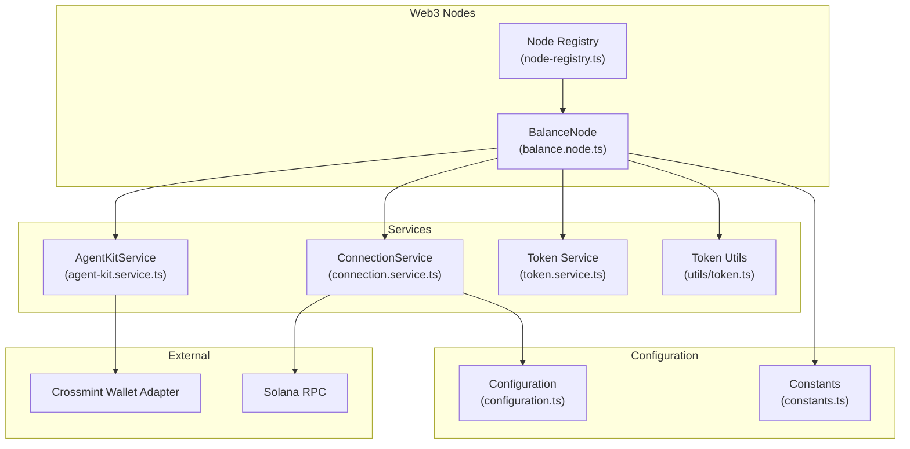
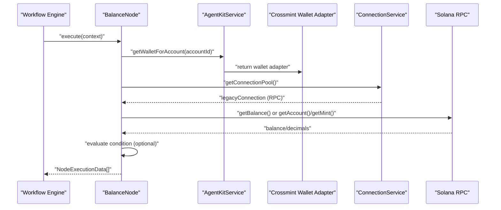
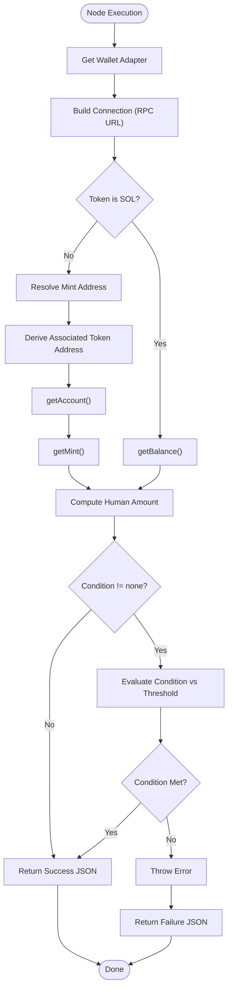
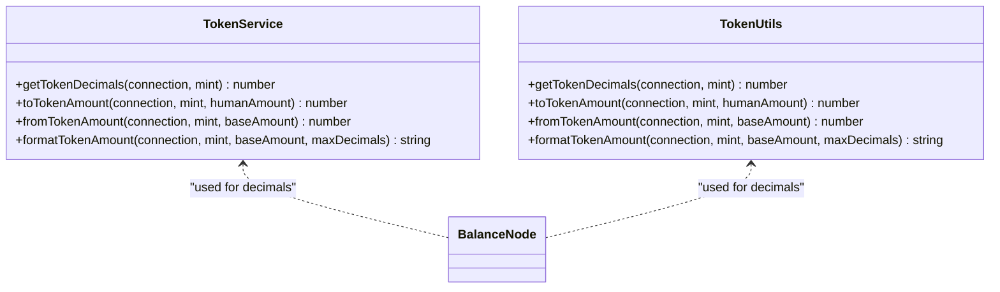
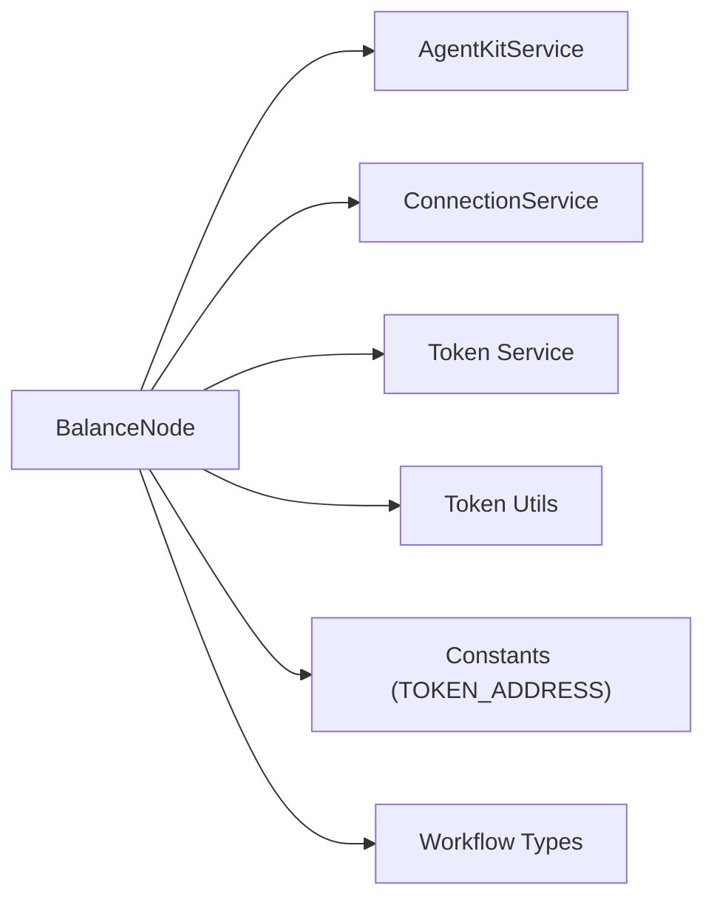

# Balance Node

<cite>
**Referenced Files in This Document**
- [balance.node.ts](file://src/web3/nodes/balance.node.ts)
- [node-registry.ts](file://src/web3/nodes/node-registry.ts)
- [workflow-types.ts](file://src/web3/workflow-types.ts)
- [agent-kit.service.ts](file://src/web3/services/agent-kit.service.ts)
- [connection.service.ts](file://src/web3/services/connection.service.ts)
- [token.service.ts](file://src/web3/services/token.service.ts)
- [token.ts](file://src/web3/utils/token.ts)
- [constants.ts](file://src/web3/constants.ts)
- [configuration.ts](file://src/config/configuration.ts)
</cite>

## Table of Contents
1. [Introduction](#introduction)
2. [Project Structure](#project-structure)
3. [Core Components](#core-components)
4. [Architecture Overview](#architecture-overview)
5. [Detailed Component Analysis](#detailed-component-analysis)
6. [Dependency Analysis](#dependency-analysis)
7. [Performance Considerations](#performance-considerations)
8. [Troubleshooting Guide](#troubleshooting-guide)
9. [Conclusion](#conclusion)

## Introduction
The Balance Node is a workflow node designed to query SOL or SPL token balances for a given account and optionally enforce balance conditions. It integrates with Crossmint托管 wallets, Solana RPC endpoints, and supports multi-token enumeration via a centralized token registry. This document explains how the node retrieves balances, evaluates conditions, handles token metadata, and provides guidance for configuration, performance optimization, and troubleshooting.

## Project Structure
The Balance Node is part of a modular Web3 workflow system. It relies on shared services for wallet management, connection pooling, and token metadata handling.

**Diagram sources**
- [balance.node.ts:15-66](file://src/web3/nodes/balance.node.ts#L15-L66)
- [node-registry.ts:23-47](file://src/web3/nodes/node-registry.ts#L23-L47)
- [agent-kit.service.ts:55-84](file://src/web3/services/agent-kit.service.ts#L55-L84)
- [connection.service.ts:22-53](file://src/web3/services/connection.service.ts#L22-L53)
- [token.service.ts:1-45](file://src/web3/services/token.service.ts#L1-L45)
- [token.ts:1-45](file://src/web3/utils/token.ts#L1-L45)
- [constants.ts:16-27](file://src/web3/constants.ts#L16-L27)
- [configuration.ts:18-21](file://src/config/configuration.ts#L18-L21)

**Section sources**
- [balance.node.ts:15-66](file://src/web3/nodes/balance.node.ts#L15-L66)
- [node-registry.ts:23-47](file://src/web3/nodes/node-registry.ts#L23-L47)
- [configuration.ts:18-21](file://src/config/configuration.ts#L18-L21)

## Core Components
- BalanceNode: Implements the balance retrieval and optional condition evaluation logic. It accepts account identifiers, token selection, and threshold parameters, and returns structured JSON results per item.
- AgentKitService: Provides Crossmint托管 wallet adapters and manages RPC URLs for node execution.
- ConnectionService: Manages RPC and WebSocket connections with configurable URLs and commitment levels.
- Token Services and Utils: Offer token decimal resolution and conversion utilities for human-readable amounts.
- Constants: Centralized token address registry enabling multi-token support.

Key capabilities:
- SOL balance retrieval via RPC getBalance
- SPL token balance via associated token accounts and mint info
- Optional balance condition checks (greater than, less than, equal to, greater or equal, less or equal)
- Structured output with success/error, token metadata, decimals, and optional condition result

**Section sources**
- [balance.node.ts:68-195](file://src/web3/nodes/balance.node.ts#L68-L195)
- [agent-kit.service.ts:74-84](file://src/web3/services/agent-kit.service.ts#L74-L84)
- [connection.service.ts:30-53](file://src/web3/services/connection.service.ts#L30-L53)
- [token.service.ts:7-44](file://src/web3/services/token.service.ts#L7-L44)
- [token.ts:7-44](file://src/web3/utils/token.ts#L7-L44)
- [constants.ts:16-27](file://src/web3/constants.ts#L16-L27)

## Architecture Overview
The Balance Node orchestrates wallet retrieval, RPC connection creation, and balance computation. It delegates token metadata resolution to dedicated services and enforces optional conditions before returning results.

**Diagram sources**
- [balance.node.ts:68-195](file://src/web3/nodes/balance.node.ts#L68-L195)
- [agent-kit.service.ts:74-77](file://src/web3/services/agent-kit.service.ts#L74-L77)
- [connection.service.ts:51-53](file://src/web3/services/connection.service.ts#L51-L53)

## Detailed Component Analysis

### BalanceNode Implementation
- Inputs: accountId, token (SOL or SPL), condition, threshold
- Execution flow:
  - Retrieve wallet adapter via AgentKitService
  - Create Connection using RPC URL from AgentKitService
  - For SOL: query getBalance and use fixed decimals
  - For SPL: resolve mint address, derive ATA, fetch account and mint info, compute balance from raw amount and decimals
  - Evaluate optional condition against threshold
  - Return structured JSON with success flag, token info, balance, decimals, wallet address, and condition result

**Diagram sources**
- [balance.node.ts:68-195](file://src/web3/nodes/balance.node.ts#L68-L195)

**Section sources**
- [balance.node.ts:68-195](file://src/web3/nodes/balance.node.ts#L68-L195)

### Token Enumeration and Multi-Token Support
- Token registry: Centralized mapping of token tickers to mint addresses enables multi-token support.
- Supported tokens include SOL, USDC, and numerous SPL tokens.
- SPL token handling derives associated token accounts and resolves decimals from mint info.

Practical usage:
- Select token via node property (e.g., SOL, USDC)
- Add new tokens by extending the registry in constants

**Section sources**
- [constants.ts:16-27](file://src/web3/constants.ts#L16-L27)
- [balance.node.ts:102-128](file://src/web3/nodes/balance.node.ts#L102-L128)

### Integration with Token Metadata Services
- Token decimals resolution is performed via getMint and cached in memory for performance.
- Conversion utilities support human-readable amount formatting and raw amount calculations.

**Diagram sources**
- [token.service.ts:7-44](file://src/web3/services/token.service.ts#L7-L44)
- [token.ts:7-44](file://src/web3/utils/token.ts#L7-L44)
- [balance.node.ts:117-127](file://src/web3/nodes/balance.node.ts#L117-L127)

**Section sources**
- [token.service.ts:7-44](file://src/web3/services/token.service.ts#L7-L44)
- [token.ts:7-44](file://src/web3/utils/token.ts#L7-L44)
- [balance.node.ts:117-127](file://src/web3/nodes/balance.node.ts#L117-L127)

### Real-Time Balance Updates and Caching Strategies
- Balance retrieval uses live RPC calls per execution.
- Token decimals are cached in-memory within token service/utilities to reduce redundant getMint calls.
- No persistent cache invalidation is implemented in the Balance Node itself; cache lifetime aligns with process runtime.

Recommendations:
- For frequent queries, consider process-level cache invalidation or periodic refresh strategies.
- Use ConnectionService for consistent commitment levels and connection reuse.

**Section sources**
- [token.service.ts:5-15](file://src/web3/services/token.service.ts#L5-L15)
- [token.ts:5-15](file://src/web3/utils/token.ts#L5-L15)
- [connection.service.ts:40-53](file://src/web3/services/connection.service.ts#L40-L53)

### Configuration Options
- Account ID: Required identifier for retrieving the Crossmint托管 wallet.
- Token: Token ticker (SOL or SPL) selected from the registry.
- Condition: Optional comparison operator (none, gt, lt, eq, gte, lte).
- Threshold: Numeric threshold for condition evaluation (human-readable).

Environment configuration:
- Solana RPC URL and WS URL are loaded from configuration and used by ConnectionService.

**Section sources**
- [balance.node.ts:26-66](file://src/web3/nodes/balance.node.ts#L26-L66)
- [configuration.ts:18-21](file://src/config/configuration.ts#L18-L21)

### Practical Examples

- Setting up a balance monitoring workflow:
  - Place BalanceNode after nodes that prepare the accountId.
  - Configure token to monitor (e.g., USDC) and condition to trigger downstream actions only when balance meets criteria.
  - Connect downstream nodes (e.g., transfer, swap) based on condition result.

- Implementing conditional logic:
  - Use condition "gte" with a threshold to gate further processing.
  - Inspect returned JSON for success flag and condition result to route workflow branches.

- Handling token discovery:
  - Add new tokens to the constants registry and reference them by ticker in the node configuration.

Note: The Balance Node does not implement built-in rate limiting or retry mechanisms; these are handled by AgentKitService for external APIs and ConnectionService for RPC configuration.

**Section sources**
- [balance.node.ts:132-165](file://src/web3/nodes/balance.node.ts#L132-L165)
- [constants.ts:16-27](file://src/web3/constants.ts#L16-L27)
- [agent-kit.service.ts:8-47](file://src/web3/services/agent-kit.service.ts#L8-L47)

## Dependency Analysis
The Balance Node depends on:
- AgentKitService for wallet retrieval and RPC URL
- ConnectionService for RPC connection management
- Token services/utils for decimals resolution
- Constants for token registry
- Workflow types for execution contract

**Diagram sources**
- [balance.node.ts:68-195](file://src/web3/nodes/balance.node.ts#L68-L195)
- [agent-kit.service.ts:55-84](file://src/web3/services/agent-kit.service.ts#L55-L84)
- [connection.service.ts:22-53](file://src/web3/services/connection.service.ts#L22-L53)
- [token.service.ts:1-45](file://src/web3/services/token.service.ts#L1-L45)
- [token.ts:1-45](file://src/web3/utils/token.ts#L1-L45)
- [constants.ts:16-27](file://src/web3/constants.ts#L16-L27)
- [workflow-types.ts:12-56](file://src/web3/workflow-types.ts#L12-L56)

**Section sources**
- [balance.node.ts:68-195](file://src/web3/nodes/balance.node.ts#L68-L195)
- [workflow-types.ts:12-56](file://src/web3/workflow-types.ts#L12-L56)

## Performance Considerations
- Token decimals caching: Both token service and utils cache decimals in-memory to minimize getMint calls.
- Connection reuse: ConnectionService provides a legacy Connection instance configured with appropriate commitment level.
- Rate limiting: External API calls (not applicable to balance queries) use a limiter in AgentKitService; balance queries themselves rely on RPC throughput and configuration.
- Recommendations:
  - Batch items thoughtfully; each item triggers separate RPC calls.
  - Consider process-level cache invalidation for long-running deployments.
  - Tune RPC endpoint reliability and latency via configuration.

**Section sources**
- [token.service.ts:5-15](file://src/web3/services/token.service.ts#L5-L15)
- [token.ts:5-15](file://src/web3/utils/token.ts#L5-L15)
- [connection.service.ts:40-53](file://src/web3/services/connection.service.ts#L40-L53)
- [agent-kit.service.ts:8-24](file://src/web3/services/agent-kit.service.ts#L8-L24)

## Troubleshooting Guide
Common issues and resolutions:
- Missing AgentKitService in execution context:
  - Ensure the workflow supplies the required service parameter to the node.
- Account ID required:
  - Provide a valid Crossmint托管 wallet account identifier.
- Unknown token:
  - Verify the token ticker exists in the constants registry.
- Token account does not exist:
  - SPL token queries gracefully handle missing accounts by treating balance as zero.
- Balance condition not met:
  - Adjust threshold or condition type; inspect returned condition result in JSON.
- Network connectivity:
  - Confirm Solana RPC URL configuration and endpoint availability.
- Retry and rate limiting:
  - For external API-dependent flows (not balance queries), AgentKitService applies retries and a limiter; balance queries use RPC configuration.

Operational tips:
- Inspect returned JSON for success flag and error messages.
- Log outputs during execution can aid diagnosis.
- Validate environment variables for RPC URLs and Crossmint credentials.

**Section sources**
- [balance.node.ts:72-89](file://src/web3/nodes/balance.node.ts#L72-L89)
- [balance.node.ts:117-127](file://src/web3/nodes/balance.node.ts#L117-L127)
- [balance.node.ts:162-164](file://src/web3/nodes/balance.node.ts#L162-L164)
- [configuration.ts:18-21](file://src/config/configuration.ts#L18-L21)
- [agent-kit.service.ts:26-45](file://src/web3/services/agent-kit.service.ts#L26-L45)

## Conclusion
The Balance Node provides a robust mechanism for querying SOL and SPL token balances within workflow contexts, with optional condition enforcement and multi-token support through a centralized registry. Its integration with AgentKitService and ConnectionService ensures reliable wallet access and RPC connectivity, while token service utilities optimize metadata resolution. For production deployments, consider process-level cache invalidation, appropriate RPC configuration, and careful tuning of conditions to achieve desired automation outcomes.