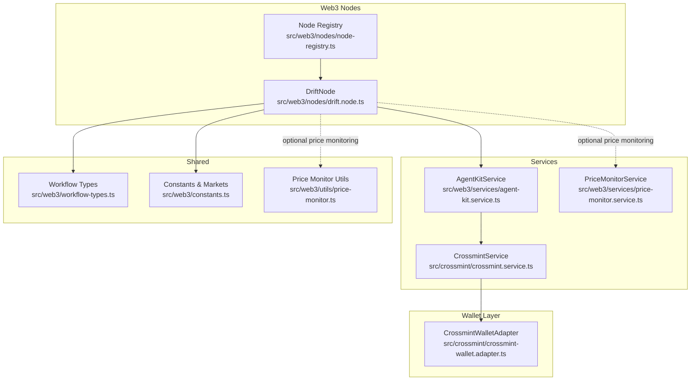
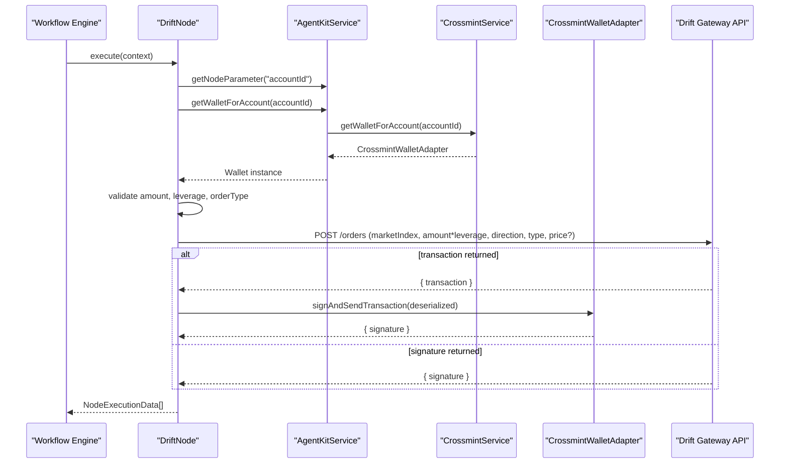
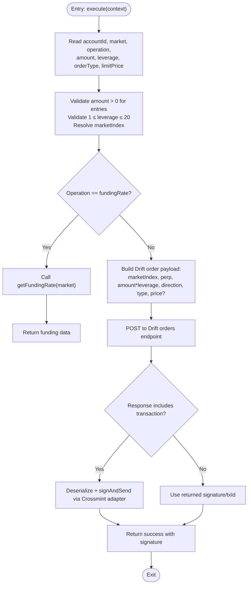
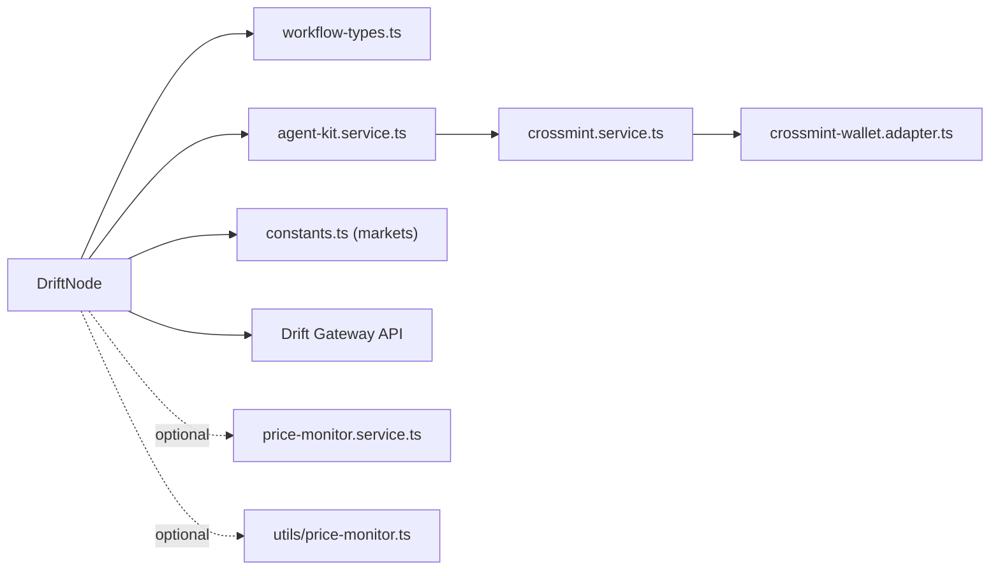

# Drift Node

<cite>
**Referenced Files in This Document**
- [drift.node.ts](file://src/web3/nodes/drift.node.ts)
- [agent-kit.service.ts](file://src/web3/services/agent-kit.service.ts)
- [crossmint.service.ts](file://src/crossmint/crossmint.service.ts)
- [crossmint-wallet.adapter.ts](file://src/crossmint/crossmint-wallet.adapter.ts)
- [node-registry.ts](file://src/web3/nodes/node-registry.ts)
- [workflow-types.ts](file://src/web3/workflow-types.ts)
- [constants.ts](file://src/web3/constants.ts)
- [price-monitor.service.ts](file://src/web3/services/price-monitor.service.ts)
- [price-monitor.ts](file://src/web3/utils/price-monitor.ts)
</cite>

## Table of Contents
1. [Introduction](#introduction)
2. [Project Structure](#project-structure)
3. [Core Components](#core-components)
4. [Architecture Overview](#architecture-overview)
5. [Detailed Component Analysis](#detailed-component-analysis)
6. [Dependency Analysis](#dependency-analysis)
7. [Performance Considerations](#performance-considerations)
8. [Troubleshooting Guide](#troubleshooting-guide)
9. [Conclusion](#conclusion)

## Introduction
This document explains the Drift perpetual trading node implementation, focusing on perpetual contract operations, position management, and margin-related mechanics within the Drift Protocol ecosystem. It covers how the node integrates with Drift's derivatives infrastructure, leverages Crossmint custodial wallets, and manages risk controls such as leverage limits and order types. Practical guidance is provided for building workflows, monitoring position health, hedging strategies, and managing trading execution risks.

## Project Structure
The Drift node is part of a modular Web3 workflow system. It relies on shared services for wallet management, configuration, and price feeds. The node registers itself into the global node registry and participates in workflow execution orchestrated by the platform.

**Diagram sources**
- [drift.node.ts:107-390](file://src/web3/nodes/drift.node.ts#L107-L390)
- [node-registry.ts:23-47](file://src/web3/nodes/node-registry.ts#L23-L47)
- [agent-kit.service.ts:55-163](file://src/web3/services/agent-kit.service.ts#L55-L163)
- [crossmint.service.ts:122-154](file://src/crossmint/crossmint.service.ts#L122-L154)
- [crossmint-wallet.adapter.ts:16-89](file://src/crossmint/crossmint-wallet.adapter.ts#L16-L89)
- [workflow-types.ts:12-56](file://src/web3/workflow-types.ts#L12-L56)
- [constants.ts:65-97](file://src/web3/constants.ts#L65-L97)
- [price-monitor.service.ts:28-105](file://src/web3/services/price-monitor.service.ts#L28-L105)
- [price-monitor.ts:29-104](file://src/web3/utils/price-monitor.ts#L29-L104)

**Section sources**
- [drift.node.ts:107-118](file://src/web3/nodes/drift.node.ts#L107-L118)
- [node-registry.ts:23-47](file://src/web3/nodes/node-registry.ts#L23-L47)

## Core Components
- DriftNode: Implements perpetual trading operations (open/close long/short, funding rate retrieval) using Drift's gateway API and Crossmint custodial wallet.
- AgentKitService: Provides unified access to Crossmint wallets and RPC configuration for workflow nodes.
- CrossmintService: Manages Crossmint wallet creation, retrieval, and asset withdrawal for accounts.
- CrossmintWalletAdapter: Wraps Crossmint wallet to conform to the wallet adapter interface for signing and sending transactions.
- Market Constants: Defines supported perpetual markets and their indices for Drift.
- Price Monitoring Utilities: Optional helpers for monitoring price targets and Pyth price streams.

Key capabilities:
- Perpetual operations: Open long/short, close position, get funding rates.
- Order types: Market and limit orders with configurable limit price.
- Leverage control: Enforced range (1–20x).
- Margin implication: Position size equals amount × leverage; Drift handles margin posting internally via gateway.

**Section sources**
- [drift.node.ts:107-179](file://src/web3/nodes/drift.node.ts#L107-L179)
- [drift.node.ts:214-291](file://src/web3/nodes/drift.node.ts#L214-L291)
- [drift.node.ts:293-390](file://src/web3/nodes/drift.node.ts#L293-L390)
- [agent-kit.service.ts:55-84](file://src/web3/services/agent-kit.service.ts#L55-L84)
- [crossmint.service.ts:122-154](file://src/crossmint/crossmint.service.ts#L122-L154)
- [crossmint-wallet.adapter.ts:16-89](file://src/crossmint/crossmint-wallet.adapter.ts#L16-L89)
- [constants.ts:65-97](file://src/web3/constants.ts#L65-L97)

## Architecture Overview
The Drift node orchestrates trading through a deterministic flow:
1. Resolve account and wallet via AgentKitService/CrossmintService.
2. Validate parameters (amount, leverage, order type).
3. Build Drift order payload and submit to Drift gateway API.
4. If gateway returns a serialized transaction, deserialize and sign via Crossmint adapter; otherwise, return the order result.
5. Emit structured output with operation metadata and signature.

**Diagram sources**
- [drift.node.ts:181-291](file://src/web3/nodes/drift.node.ts#L181-L291)
- [drift.node.ts:336-390](file://src/web3/nodes/drift.node.ts#L336-L390)
- [agent-kit.service.ts:74-77](file://src/web3/services/agent-kit.service.ts#L74-L77)
- [crossmint.service.ts:122-154](file://src/crossmint/crossmint.service.ts#L122-L154)
- [crossmint-wallet.adapter.ts:65-76](file://src/crossmint/crossmint-wallet.adapter.ts#L65-L76)

## Detailed Component Analysis

### DriftNode: Perpetual Operations and Risk Controls
Responsibilities:
- Operation selection: openLong, openShort, close, fundingRate.
- Parameter validation: amount > 0 for entries; leverage in [1, 20]; orderType market/limit.
- Market resolution: maps market ticker to Drift index.
- Funding rate retrieval: queries Drift API and returns hourly/annualized rates and next funding time.
- Transaction construction: builds order payload and submits to Drift gateway; signs and sends if gateway returns a transaction.

Risk controls embedded:
- Leverage bounds enforced client-side.
- Market whitelist via DRIFT_MARKETS mapping.
- Order type enforcement (market vs limit) with optional limit price.

Operational flow for open/close:
- Compute effective position size as amount × leverage.
- Determine direction from operation.
- Submit order; handle gateway response (signature or transaction).

**Diagram sources**
- [drift.node.ts:181-291](file://src/web3/nodes/drift.node.ts#L181-L291)
- [drift.node.ts:293-390](file://src/web3/nodes/drift.node.ts#L293-L390)

**Section sources**
- [drift.node.ts:107-179](file://src/web3/nodes/drift.node.ts#L107-L179)
- [drift.node.ts:214-291](file://src/web3/nodes/drift.node.ts#L214-L291)
- [drift.node.ts:293-390](file://src/web3/nodes/drift.node.ts#L293-L390)

### AgentKitService: Wallet and Swap Integration
Role:
- Provides Crossmint wallet adapter for an account.
- Supplies RPC URL for Solana connectivity.
- Includes a reusable swap executor leveraging Jupiter API and Crossmint wallet signing.

Integration points:
- Used by DriftNode to obtain wallet and connection.
- Enables downstream swaps within the same workflow context.

**Section sources**
- [agent-kit.service.ts:55-84](file://src/web3/services/agent-kit.service.ts#L55-L84)
- [agent-kit.service.ts:99-161](file://src/web3/services/agent-kit.service.ts#L99-L161)

### CrossmintService and CrossmintWalletAdapter: Custody and Signing
CrossmintService:
- Retrieves or creates Crossmint wallets for accounts.
- Supports asset withdrawal and account lifecycle operations.

CrossmintWalletAdapter:
- Wraps Crossmint wallet to support signTransaction, signAllTransactions, and signAndSendTransaction.
- Throws if message signing is attempted (not supported).

Integration:
- DriftNode obtains a wallet adapter via AgentKitService, which delegates to CrossmintService.
- Transactions are signed and sent through the adapter.

**Section sources**
- [crossmint.service.ts:122-154](file://src/crossmint/crossmint.service.ts#L122-L154)
- [crossmint-wallet.adapter.ts:16-89](file://src/crossmint/crossmint-wallet.adapter.ts#L16-L89)

### Market Definitions and Price Feeds
Market mapping:
- DRIFT_MARKETS maps ticker symbols to Drift market indices for perpetual contracts.

Price monitoring:
- Optional utilities exist for monitoring Pyth price feeds and reaching target thresholds.
- These can be used alongside the Drift node to inform entry/exit decisions.

**Section sources**
- [constants.ts:65-97](file://src/web3/constants.ts#L65-L97)
- [price-monitor.service.ts:28-105](file://src/web3/services/price-monitor.service.ts#L28-L105)
- [price-monitor.ts:29-104](file://src/web3/utils/price-monitor.ts#L29-L104)

## Dependency Analysis
The Drift node depends on:
- Workflow types for node interface and execution context.
- AgentKitService for wallet and RPC access.
- CrossmintService/WalletAdapter for custody and signing.
- Drift gateway API for order submission.
- Optional price monitoring utilities for pre/post execution checks.

**Diagram sources**
- [drift.node.ts:1-10](file://src/web3/nodes/drift.node.ts#L1-L10)
- [workflow-types.ts:12-56](file://src/web3/workflow-types.ts#L12-L56)
- [agent-kit.service.ts:55-84](file://src/web3/services/agent-kit.service.ts#L55-L84)
- [crossmint.service.ts:122-154](file://src/crossmint/crossmint.service.ts#L122-L154)
- [crossmint-wallet.adapter.ts:16-89](file://src/crossmint/crossmint-wallet.adapter.ts#L16-L89)
- [constants.ts:65-97](file://src/web3/constants.ts#L65-L97)
- [price-monitor.service.ts:28-105](file://src/web3/services/price-monitor.service.ts#L28-L105)
- [price-monitor.ts:29-104](file://src/web3/utils/price-monitor.ts#L29-L104)

**Section sources**
- [drift.node.ts:1-10](file://src/web3/nodes/drift.node.ts#L1-L10)
- [node-registry.ts:23-47](file://src/web3/nodes/node-registry.ts#L23-L47)

## Performance Considerations
- Concurrency and retries: The node uses retry helpers and external API limiting to avoid overload when fetching funding rates or interacting with external APIs.
- Transaction signing overhead: When the gateway returns a transaction, deserialization and signing occur locally; ensure adequate CPU headroom for signing operations.
- Network latency: Drift gateway and RPC calls introduce latency; batch operations where possible and avoid unnecessary repeated submissions.

[No sources needed since this section provides general guidance]

## Troubleshooting Guide
Common issues and resolutions:
- Missing AgentKitService in context: Ensure the workflow passes the service instance to the node.
- Account ID missing or invalid: Verify the account exists and has a configured Crossmint wallet.
- Unknown market: Confirm the market ticker exists in the DRIFT_MARKETS mapping.
- Invalid amount or leverage: Ensure amount > 0 for entries and 1 ≤ leverage ≤ 20.
- Drift API errors: Inspect returned error messages from the gateway; adjust parameters accordingly.
- Transaction signing failures: Confirm the Crossmint wallet supports transaction signing and that sufficient funds exist for fees.

Operational tips:
- Use the funding rate operation to assess roll costs and next funding time.
- Combine with price monitoring utilities to gate entries/exits based on price targets.
- For limit orders, specify a valid limit price; ensure liquidity exists at that level.

**Section sources**
- [drift.node.ts:181-291](file://src/web3/nodes/drift.node.ts#L181-L291)
- [drift.node.ts:293-390](file://src/web3/nodes/drift.node.ts#L293-L390)
- [crossmint.service.ts:122-154](file://src/crossmint/crossmint.service.ts#L122-L154)

## Conclusion
The Drift node provides a robust, production-ready pathway to execute perpetual trading on Drift using Crossmint custodial wallets. It enforces client-side risk controls (leverage bounds, market whitelist), integrates seamlessly with the workflow engine, and offers optional price monitoring hooks for informed decision-making. By combining the node with hedging strategies, stop-loss-like triggers, and careful position sizing, operators can manage risk while participating in Drift's perpetual futures markets.