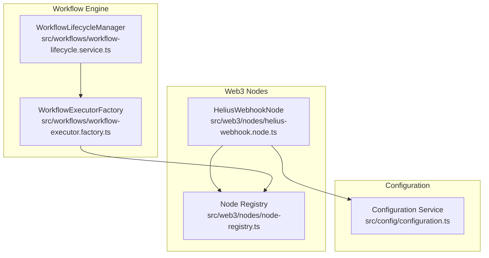
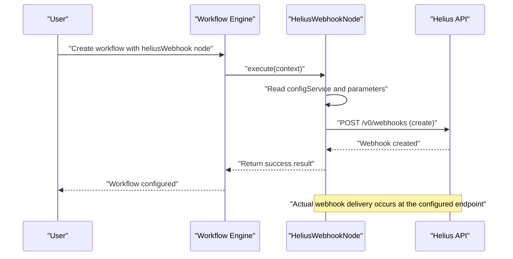
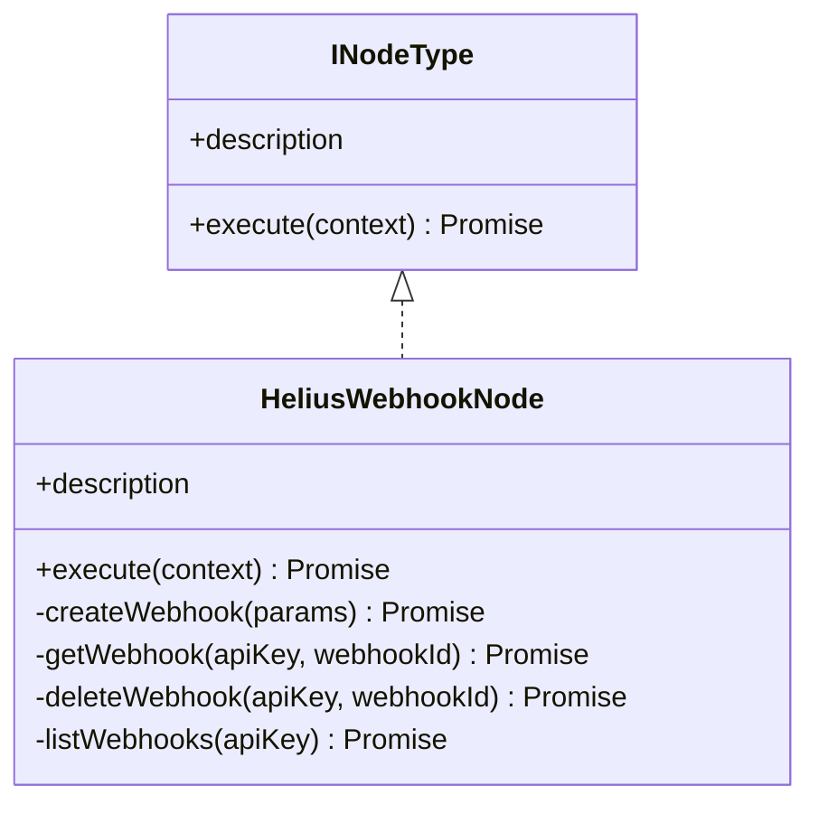
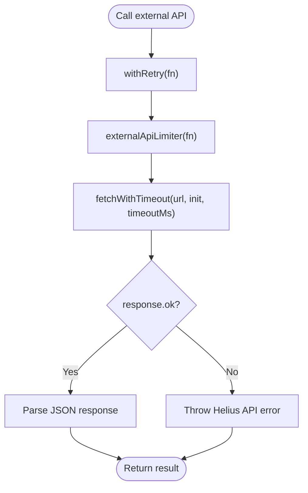
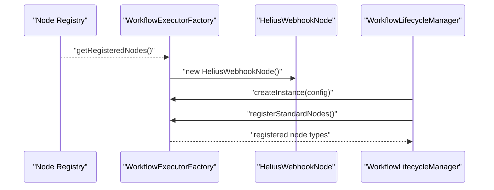
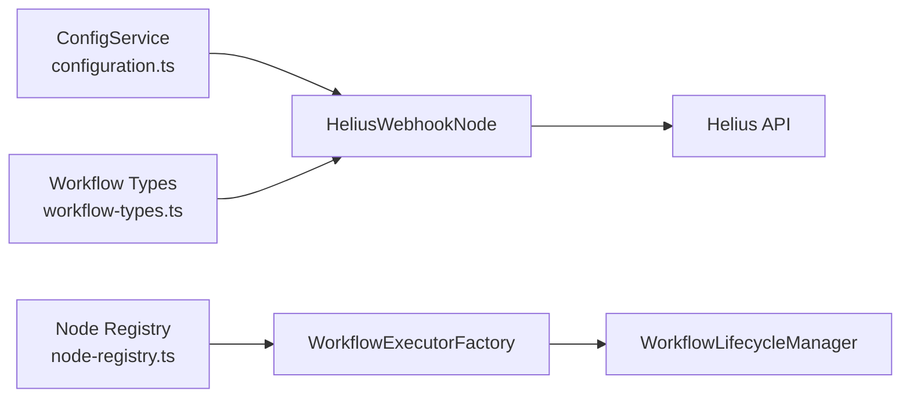

# Helius Webhook Node

<cite>
**Referenced Files in This Document**
- [helius-webhook.node.ts](file://src/web3/nodes/helius-webhook.node.ts)
- [node-registry.ts](file://src/web3/nodes/node-registry.ts)
- [configuration.ts](file://src/config/configuration.ts)
- [workflow-types.ts](file://src/web3/workflow-types.ts)
- [workflow-executor.factory.ts](file://src/workflows/workflow-executor.factory.ts)
- [workflow-lifecycle.service.ts](file://src/workflows/workflow-lifecycle.service.ts)
- [NODES_REFERENCE.md](file://docs/NODES_REFERENCE.md)
- [README.md](file://README.md)
</cite>

## Table of Contents
1. [Introduction](#introduction)
2. [Project Structure](#project-structure)
3. [Core Components](#core-components)
4. [Architecture Overview](#architecture-overview)
5. [Detailed Component Analysis](#detailed-component-analysis)
6. [Dependency Analysis](#dependency-analysis)
7. [Performance Considerations](#performance-considerations)
8. [Security Considerations](#security-considerations)
9. [Practical Setup Examples](#practical-setup-examples)
10. [Troubleshooting Guide](#troubleshooting-guide)
11. [Conclusion](#conclusion)

## Introduction
This document explains the Helius webhook node implementation used to configure and manage on-chain event monitoring via Helius webhooks. It covers configuration options, event filtering, trigger management, integration with the Helius API, and operational guidance for webhook endpoints, rate limiting, and replay protection. It also provides troubleshooting advice for common webhook delivery and processing issues.

## Project Structure
The Helius webhook node is part of a modular workflow engine. It registers as a trigger node and integrates with the workflow lifecycle manager to orchestrate automated actions when on-chain events occur.

**Diagram sources**
- [helius-webhook.node.ts:116-186](file://src/web3/nodes/helius-webhook.node.ts#L116-L186)
- [node-registry.ts:34-46](file://src/web3/nodes/node-registry.ts#L34-L46)
- [workflow-executor.factory.ts:36-40](file://src/workflows/workflow-executor.factory.ts#L36-L40)
- [workflow-lifecycle.service.ts:19-23](file://src/workflows/workflow-lifecycle.service.ts#L19-L23)
- [configuration.ts:33-35](file://src/config/configuration.ts#L33-L35)

**Section sources**
- [helius-webhook.node.ts:116-186](file://src/web3/nodes/helius-webhook.node.ts#L116-L186)
- [node-registry.ts:34-46](file://src/web3/nodes/node-registry.ts#L34-L46)
- [workflow-executor.factory.ts:36-40](file://src/workflows/workflow-executor.factory.ts#L36-L40)
- [workflow-lifecycle.service.ts:19-23](file://src/workflows/workflow-lifecycle.service.ts#L19-L23)
- [configuration.ts:33-35](file://src/config/configuration.ts#L33-L35)

## Core Components
- HeliusWebhookNode: A configuration node that manages Helius webhooks (create, get, delete, list) and interacts with the Helius API.
- Node Registry: Registers the HeliusWebhookNode so the workflow engine can discover and instantiate it.
- Configuration Service: Provides the Helius API key from environment variables.
- Workflow Types: Defines the node interface and execution contract used by the workflow engine.
- Workflow Executor Factory and Lifecycle Manager: Integrate nodes into workflow execution and lifecycle management.

Key responsibilities:
- Validate configuration and parameters.
- Call Helius API endpoints for webhook management.
- Return structured results for downstream nodes in the workflow.

**Section sources**
- [helius-webhook.node.ts:116-186](file://src/web3/nodes/helius-webhook.node.ts#L116-L186)
- [node-registry.ts:34-46](file://src/web3/nodes/node-registry.ts#L34-L46)
- [configuration.ts:33-35](file://src/config/configuration.ts#L33-L35)
- [workflow-types.ts:12-15](file://src/web3/workflow-types.ts#L12-L15)
- [workflow-executor.factory.ts:36-40](file://src/workflows/workflow-executor.factory.ts#L36-L40)
- [workflow-lifecycle.service.ts:19-23](file://src/workflows/workflow-lifecycle.service.ts#L19-L23)

## Architecture Overview
The Helius webhook node operates as a trigger node within the workflow engine. It does not itself receive webhook payloads; instead, it configures Helius to send events to a webhook endpoint you define. The workflow engine orchestrates downstream nodes that react to those events.

**Diagram sources**
- [helius-webhook.node.ts:187-337](file://src/web3/nodes/helius-webhook.node.ts#L187-L337)
- [helius-webhook.node.ts:342-378](file://src/web3/nodes/helius-webhook.node.ts#L342-L378)

**Section sources**
- [helius-webhook.node.ts:187-337](file://src/web3/nodes/helius-webhook.node.ts#L187-L337)
- [helius-webhook.node.ts:342-378](file://src/web3/nodes/helius-webhook.node.ts#L342-L378)

## Detailed Component Analysis

### HeliusWebhookNode Class
The node implements the INodeType interface and exposes configurable properties for managing Helius webhooks. It supports four operations: create, get, delete, and list. It validates inputs, constructs API requests, and handles responses with retry and timeout logic.

**Diagram sources**
- [workflow-types.ts:12-15](file://src/web3/workflow-types.ts#L12-L15)
- [helius-webhook.node.ts:116-186](file://src/web3/nodes/helius-webhook.node.ts#L116-L186)

Key behaviors:
- Parameter validation for required fields (webhook URL, account addresses).
- Transaction type parsing from comma-separated strings.
- API calls with retry, timeout, and concurrency limiting.
- Structured success/failure responses for workflow consumption.

**Section sources**
- [helius-webhook.node.ts:187-337](file://src/web3/nodes/helius-webhook.node.ts#L187-L337)
- [helius-webhook.node.ts:342-457](file://src/web3/nodes/helius-webhook.node.ts#L342-L457)

### API Interaction Utilities
The node uses helper utilities for robust external API calls:
- withRetry: Retries transient failures with exponential backoff and jitter.
- fetchWithTimeout: Enforces timeouts to prevent hanging requests.
- createLimiter: Limits concurrent external API calls to respect provider limits.

**Diagram sources**
- [helius-webhook.node.ts:24-57](file://src/web3/nodes/helius-webhook.node.ts#L24-L57)
- [helius-webhook.node.ts:351-370](file://src/web3/nodes/helius-webhook.node.ts#L351-L370)

**Section sources**
- [helius-webhook.node.ts:24-57](file://src/web3/nodes/helius-webhook.node.ts#L24-L57)
- [helius-webhook.node.ts:351-370](file://src/web3/nodes/helius-webhook.node.ts#L351-L370)

### Configuration and Parameters
The node reads configuration from the injected ConfigService and environment variables. It requires a Helius API key for all operations.

Parameters exposed by the node:
- Operation: create, get, delete, list.
- Webhook ID: required for get/delete.
- Webhook URL: required for create.
- Account Addresses: comma-separated list of addresses to monitor.
- Transaction Types: comma-separated list of types to filter.
- Webhook Type: enhanced, raw, discord, enhancedDevnet, rawDevnet.

These parameters map to Helius API request bodies and are validated before making API calls.

**Section sources**
- [helius-webhook.node.ts:127-184](file://src/web3/nodes/helius-webhook.node.ts#L127-L184)
- [configuration.ts:33-35](file://src/config/configuration.ts#L33-L35)
- [NODES_REFERENCE.md:83-92](file://docs/NODES_REFERENCE.md#L83-L92)

### Event Filtering and Types
Supported transaction types include NFT-related, swap, transfer, mint/burn, staking, loans, liquidity pool actions, and more. The node accepts a comma-separated string and converts it to an array of types for the API request.

Note: The node does not implement event deduplication or replay protection. These capabilities are provided by Helius and should be considered when designing workflows.

**Section sources**
- [helius-webhook.node.ts:66-96](file://src/web3/nodes/helius-webhook.node.ts#L66-L96)
- [helius-webhook.node.ts:225-228](file://src/web3/nodes/helius-webhook.node.ts#L225-L228)

### Trigger Management in Workflow Engine
The workflow engine discovers and registers nodes via the node registry. The HeliusWebhookNode is registered under the key "heliusWebhook". The lifecycle manager launches workflow instances for active accounts and executes registered nodes.

**Diagram sources**
- [node-registry.ts:34-46](file://src/web3/nodes/node-registry.ts#L34-L46)
- [workflow-executor.factory.ts:36-40](file://src/workflows/workflow-executor.factory.ts#L36-L40)
- [workflow-lifecycle.service.ts:238-295](file://src/workflows/workflow-lifecycle.service.ts#L238-L295)

**Section sources**
- [node-registry.ts:34-46](file://src/web3/nodes/node-registry.ts#L34-L46)
- [workflow-executor.factory.ts:36-40](file://src/workflows/workflow-executor.factory.ts#L36-L40)
- [workflow-lifecycle.service.ts:238-295](file://src/workflows/workflow-lifecycle.service.ts#L238-L295)

## Dependency Analysis
- HeliusWebhookNode depends on:
  - ConfigService for retrieving the Helius API key.
  - Workflow types for the node interface and execution context.
  - External HTTP client utilities for robust API calls.
- Node Registry provides discovery and instantiation of nodes.
- Workflow Executor Factory and Lifecycle Manager integrate nodes into workflow execution.

**Diagram sources**
- [configuration.ts:33-35](file://src/config/configuration.ts#L33-L35)
- [workflow-types.ts:12-15](file://src/web3/workflow-types.ts#L12-L15)
- [helius-webhook.node.ts:192-197](file://src/web3/nodes/helius-webhook.node.ts#L192-L197)
- [node-registry.ts:34-46](file://src/web3/nodes/node-registry.ts#L34-L46)
- [workflow-executor.factory.ts:36-40](file://src/workflows/workflow-executor.factory.ts#L36-L40)
- [workflow-lifecycle.service.ts:19-23](file://src/workflows/workflow-lifecycle.service.ts#L19-L23)

**Section sources**
- [configuration.ts:33-35](file://src/config/configuration.ts#L33-L35)
- [workflow-types.ts:12-15](file://src/web3/workflow-types.ts#L12-L15)
- [helius-webhook.node.ts:192-197](file://src/web3/nodes/helius-webhook.node.ts#L192-L197)
- [node-registry.ts:34-46](file://src/web3/nodes/node-registry.ts#L34-L46)
- [workflow-executor.factory.ts:36-40](file://src/workflows/workflow-executor.factory.ts#L36-L40)
- [workflow-lifecycle.service.ts:19-23](file://src/workflows/workflow-lifecycle.service.ts#L19-L23)

## Performance Considerations
- Concurrency control: External API calls are limited to a fixed concurrency level to avoid overwhelming the Helius API.
- Timeouts: Requests are aborted after a defined timeout to prevent resource starvation.
- Retries: Transient failures are retried with exponential backoff and jitter to improve resilience.
- Rate limiting: Respect provider rate limits; adjust workflow frequency accordingly.

Recommendations:
- Monitor API response times and adjust retry parameters if needed.
- Batch operations where possible to reduce API churn.
- Use appropriate webhook types to minimize payload sizes.

**Section sources**
- [helius-webhook.node.ts:24-57](file://src/web3/nodes/helius-webhook.node.ts#L24-L57)
- [helius-webhook.node.ts:351-370](file://src/web3/nodes/helius-webhook.node.ts#L351-L370)

## Security Considerations
- API key management: The Helius API key is required and must be provided via configuration or environment variables. Store keys securely and restrict access.
- Webhook endpoint security: The node does not receive webhook payloads; configure your endpoint with authentication, HTTPS, and rate limiting.
- Replay protection: Implement idempotency and deduplication at your endpoint to handle potential duplicate deliveries.
- Validation: The node validates required parameters before calling the API; ensure your endpoint validates incoming payloads.

Operational notes:
- The node description indicates that actual webhook reception is handled externally; design your endpoint to accept and process Helius webhook payloads.
- Consider using signed webhooks or shared secrets to authenticate Helius-originated requests.

**Section sources**
- [helius-webhook.node.ts:192-197](file://src/web3/nodes/helius-webhook.node.ts#L192-L197)
- [helius-webhook.node.ts:113-115](file://src/web3/nodes/helius-webhook.node.ts#L113-L115)
- [README.md:79-82](file://README.md#L79-L82)

## Practical Setup Examples

### Example 1: Create a Webhook
- Operation: create
- Parameters:
  - webhookUrl: your webhook endpoint URL
  - accountAddresses: comma-separated list of addresses to monitor
  - transactionTypes: comma-separated list of types (e.g., SWAP, TRANSFER, NFT_SALE)
  - webhookType: enhanced, raw, discord, enhancedDevnet, rawDevnet

Expected outcome:
- The node returns a success result containing the created webhook metadata.

**Section sources**
- [helius-webhook.node.ts:206-251](file://src/web3/nodes/helius-webhook.node.ts#L206-L251)
- [NODES_REFERENCE.md:87-92](file://docs/NODES_REFERENCE.md#L87-L92)

### Example 2: Retrieve a Webhook
- Operation: get
- Parameters:
  - webhookId: the ID of the webhook to retrieve

Expected outcome:
- The node returns a success result with the webhook details.

**Section sources**
- [helius-webhook.node.ts:254-274](file://src/web3/nodes/helius-webhook.node.ts#L254-L274)

### Example 3: Delete a Webhook
- Operation: delete
- Parameters:
  - webhookId: the ID of the webhook to delete

Expected outcome:
- The node returns a success result indicating deletion.

**Section sources**
- [helius-webhook.node.ts:277-296](file://src/web3/nodes/helius-webhook.node.ts#L277-L296)

### Example 4: List All Webhooks
- Operation: list
- Expected outcome:
- The node returns a success result with counts and metadata for all webhooks.

**Section sources**
- [helius-webhook.node.ts:299-318](file://src/web3/nodes/helius-webhook.node.ts#L299-L318)

## Troubleshooting Guide

Common issues and resolutions:
- Missing Helius API key:
  - Symptom: Error indicating the API key is required.
  - Resolution: Set the configuration value or environment variable and ensure it is loaded by the ConfigService.
  - Section sources
    - [helius-webhook.node.ts:192-197](file://src/web3/nodes/helius-webhook.node.ts#L192-L197)
    - [configuration.ts:33-35](file://src/config/configuration.ts#L33-L35)

- Invalid parameters:
  - Symptom: Errors for missing webhook URL or account addresses.
  - Resolution: Provide required parameters as per the node schema.
  - Section sources
    - [helius-webhook.node.ts:218-223](file://src/web3/nodes/helius-webhook.node.ts#L218-L223)
    - [NODES_REFERENCE.md:89-92](file://docs/NODES_REFERENCE.md#L89-L92)

- API errors:
  - Symptom: Errors returned from the Helius API.
  - Resolution: Inspect the error message and retry with backoff; verify API key and endpoint availability.
  - Section sources
    - [helius-webhook.node.ts:372-375](file://src/web3/nodes/helius-webhook.node.ts#L372-L375)
    - [helius-webhook.node.ts:399-402](file://src/web3/nodes/helius-webhook.node.ts#L399-L402)
    - [helius-webhook.node.ts:426-429](file://src/web3/nodes/helius-webhook.node.ts#L426-L429)
    - [helius-webhook.node.ts:451-454](file://src/web3/nodes/helius-webhook.node.ts#L451-L454)

- Rate limiting:
  - Symptom: API responses indicate throttling.
  - Resolution: Reduce request frequency or increase delays between operations; consider batching.
  - Section sources
    - [helius-webhook.node.ts:59](file://src/web3/nodes/helius-webhook.node.ts#L59)
    - [helius-webhook.node.ts:24-43](file://src/web3/nodes/helius-webhook.node.ts#L24-L43)

- Webhook delivery failures:
  - Symptom: Helius reports delivery failures.
  - Resolution: Ensure your endpoint is reachable, responds quickly, and returns appropriate HTTP status codes; implement idempotent processing.
  - Section sources
    - [helius-webhook.node.ts:113-115](file://src/web3/nodes/helius-webhook.node.ts#L113-L115)

## Conclusion
The Helius webhook node provides a streamlined way to configure on-chain event monitoring via Helius. It validates inputs, interacts with the Helius API with retry and timeout logic, and integrates cleanly into the workflow engine. For reliable event-driven automation, pair the node’s configuration with a secure, idempotent webhook endpoint and appropriate rate limiting and replay protection measures.